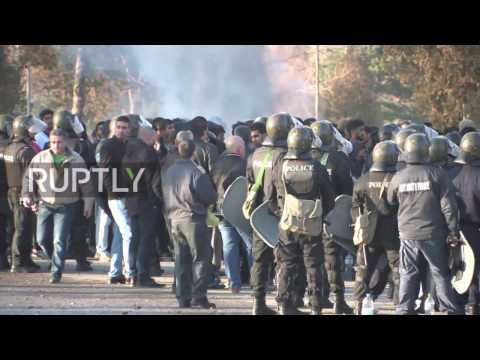
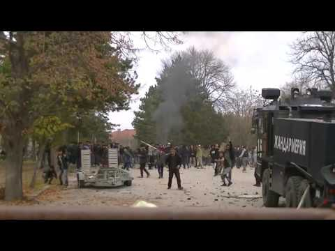
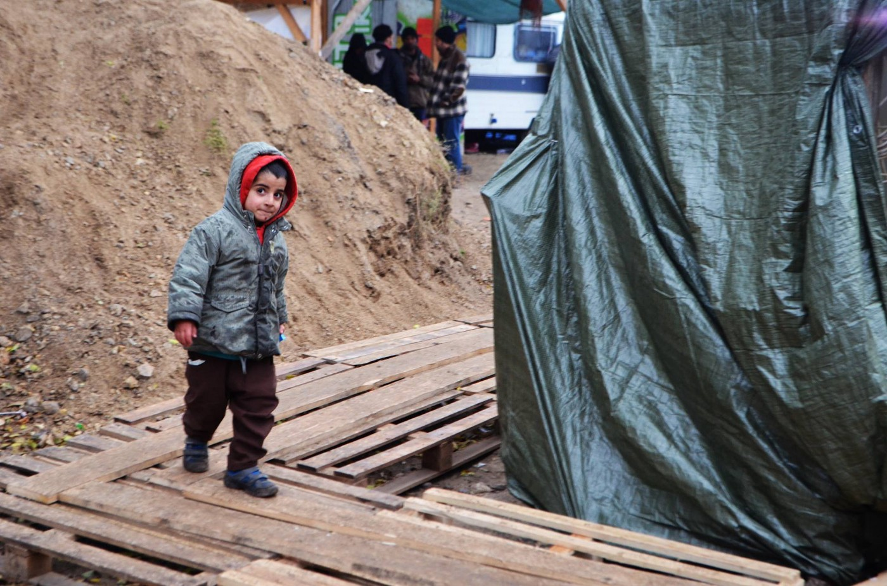
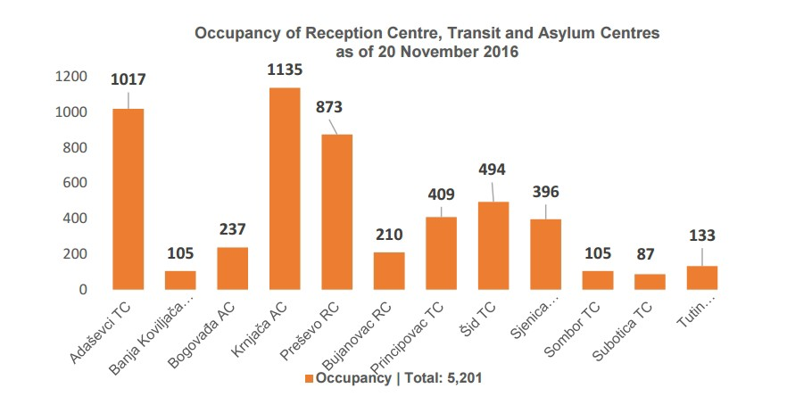
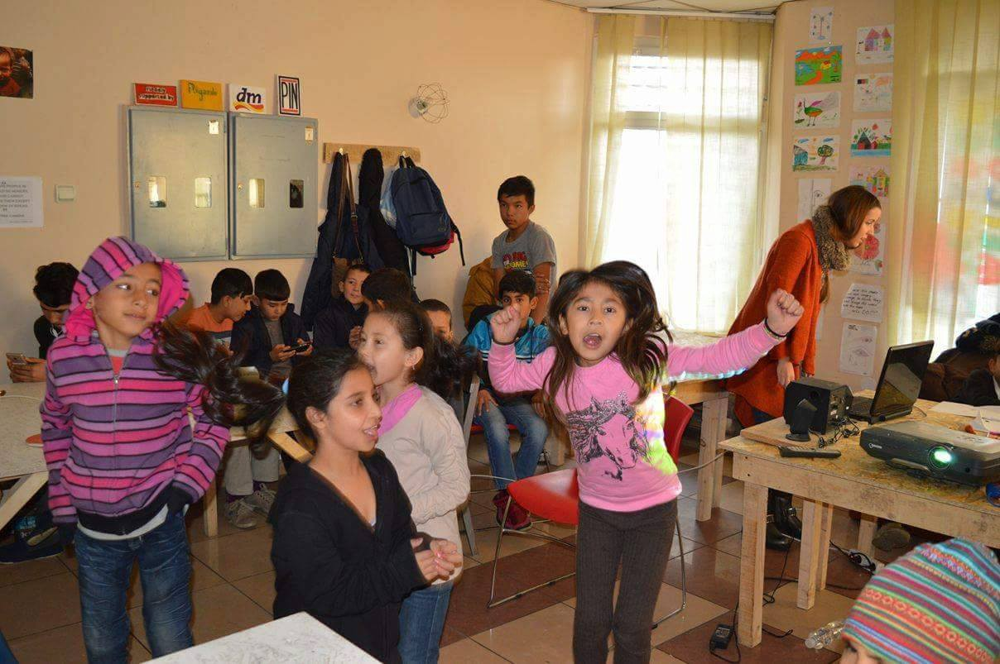
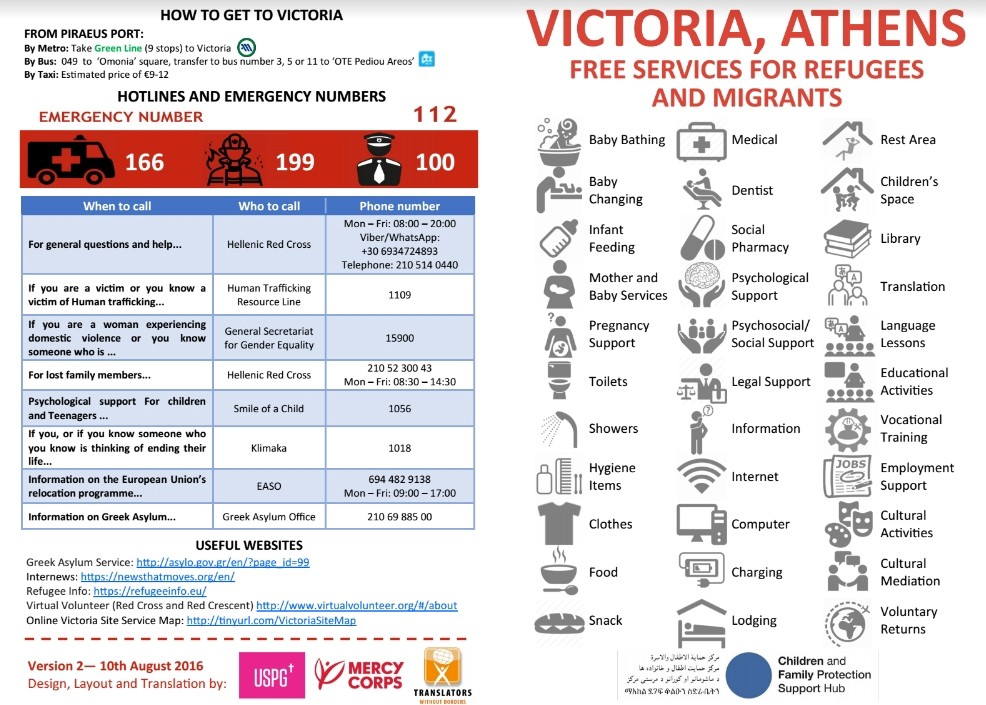

### AYS 25/11 Hundreds of protesters arrested, to be deported from Bulgaria
#### In the aftermath of yesterday’s riots in Harmanli, the Bulgarian Prime Minister vows to detain and deport 1,000 people\. Many people injured while trying to jump off the train in the middle of forced deportation from Subotica, Serbia\. Greece mourns the loss of the refugee woman and her grandchild burned alive while trying to cook a family meal in Moria camp\. Important notice about Family Reunification from Greece to Germany\!

Many serious injuries were reported by the refugees in the camp — we chose not to publish gore photos of open wounds\.
### Feature report: Hatred explodes in Bulgaria

About 400 people have been detained after yesterday’s riots Bulgaria’s largest refugee camp in Harmanli in southern Bulgaria, which left more than 200 refugees and 29 policemen injured\. According to the official government sources, **a thousand refugees who clashed with police will be moved from Harmanli into former army barracks near the Turkish border before being expelled from the country** \. It seems Bulgarian authorities are following Hungary’s example by playing the terrorism card\. Bulgarian prime Minister Boyko Borissov already said some of the arrested people were a “threat to national security” in a statement to BNR public radio after visiting the camp this morning\. The local press [claims](https://news.bg/crime/terorist-uchastval-v-buntovete-v-bezhanskiya-tsentar-v-harmanli.html) there might be terrorists among the people who led the riots, adding to the already heated situation\.

> “All necessary preparations will be made over the next week so that we can isolate those who do not want to obey the rules\. Based on an agreement between the European Union and Afghanistan, we have asked for a plane to start extraditing people there in early December\. **They will be then expelled from Bulgaria as soon as possible\. As for the rest, all who have acted brutally and violated public order will be moved to closed camps,** ” Bulgarian Prime Minister Boyko Borisov [said](http://www.reuters.com/article/us-europe-migrants-bulgaria-idUSKBN13K15A?feedType=RSS&feedName=worldNews&utm_source=Twitter&utm_medium=Social&utm_campaign=Feed%3A+Reuters%2FworldNews+%28Reuters+World+News%29) today\. “Only Syrian families will remain in Harmanli from next year,” he added during a meeting with local residents, who have long demanded the closure of the camp, according to [AP](https://www.yahoo.com/news/bulgaria-isolate-1-000-migrants-harmanli-riots-202315936.html) \. 

#### Notorious Bulgarian “refugee hunter” Dinko Valev also made an appearance in front of the camp today, surrounded by his thugs, threatening the already scared refugees in front of the cameras\.

According to the Bulgarian police, about 2,000 refugees, most from Afghanistan, were involved in the riots\. The conflict reportedly erupted over the camp being put under quarantine following the outbreak of infectious diseases\. According to local volunteers, scabies, fleas and other diseases have been reported for the last two months, but the authorities chose to ignore these concerns until the locals started threatening and demanding the camp’s closure\. Part of the local media helped to spread the panic about the disease in the camp, which resulted in the anti\-refugee hysteria\.

[Bordermonitoring Bulgaria](http://bulgaria.bordermonitoring.eu/) says the closing of the camp had already been decided by the government as part of a larger plan to deal with the **permanent ongoing protest by right\-wing parties, neo\-Nazis and their supporters** \. According to their info, police entered some buildings in the middle of the riot, and were physically violent, including towards people who were not involved in the riot\. According to volunteers sources, when the beatings started, it was almost impossible to get any camp official on the phone\. **Ambulances didn’t arrive immediately, so the people had to use whatever they had, even dirty cloths, to prevent bleeding all over the camp\.** Additionally many people were afraid to go to the ambulance because they feared more abuse might happen\. It has also been reported that the police used rubber bullets and water cannons to disperse the crowd of protesters, some of whom were throwing stones\.

According to [Reuters](http://www.reuters.com/article/us-europe-migrants-bulgaria-idUSKBN13K15A?il=0) , Harmanli was heavily guarded by 250 riot police today\. The Bulgarian Defense Ministry says it is sending around sixty army troops to support them in preventing any further escalation of violence in the camp, which hosts around 3,000 people\. Local [press](http://m.novinite.com/articles/177648/Harmanli+Riot+Coordinated+With+Disturbances+in+Europe) says a fence, similar to the one on the border Turkey, will be immediately built around the refugee camp, following the order issued by Prime Minister Borisov on this morning’s emergency meeting\. Deputy Prime Minister Tomislav Donchev will coordinate the construction on\-site\.
#### Media hysteria, fence around the camp: pre\-election stunt?

The [Bulgarian Helsinki Commitee](http://www.bghelsinki.org/en/news/) notes that Bulgarian elections are pending, which may explain the heightened tensions at Harmanli and the government’s response\. “Certain parties which bet only on anti\-migrant, xenophobic and fascist rhetoric feel the need to accumulate self\-confidence and an electorate,” the organization stated, adding:

> **“What would be better than organising a controlled riot with a little blood\-letting and lots of media hysterics?”** 

Anti\-migrant sentiment is also broadcast by a range of Bulgarian media organs, via sensationalist news items, tabloid negative treatment of human rights workers, and in some cases positive reporting about anti\-migrant vigilantes\. Many such items have a coded or open anti\-Muslim subtext\.
#### Serbia
### Refugees injured while jumping off train in an attempt to avoid eviction from Subotica

Since early in this morning, we’ve been receiving news about a dangerous incident that occurred during the government’s attempt to relocate yet another group of refugees from Northern Serbia to Presevo camp\. A group of people who were sleeping rough in the Subotica area, obviously hoping to continue their trip towards Hungary or Croatia, panicked after being pushed into a train to Presevo, and jumped off the moving vehicle\. MSF has confirmed the incident and provided medical support to the injured people\.

■■■■■■■■■■■■■■ 
> **[MSF Sea](https://twitter.com/MSF_Sea) @ Twitter Says:** 

> > UPDATE: @[MSF](https://twitter.com/MSF) has treated those who jumped off a train as #Serbia tried to forcefully relocate #migrants sleeping rough in #Subotica. https://t.co/to8sbjql19 

> **Tweeted at [2016-11-25 11:04:27](https://twitter.com/msf_sea/status/802105664986349568).** 

■■■■■■■■■■■■■■ 

This incident comes in the wake of the Serbian government’s decision to move all of the roaming refugees to official camps\. At the moment, there are twelve refugee accommodation facilities, but some of them, such as Presevo in the South of Serbia, also serve as detention facilities, with people being locked up to prevent them from fleeing and travelling further\.
#### Cynical situation in Northern Serbia

On the Northern border with Hungary, there are two transit zones \(Kelebija/Tompa and Horgos/Roszke\) which are not recognised as official camps and are best described as smaller versions of Idomeni\. Some of the people residing in them are offered relocation to official camps, but they are afraid to leave the border because they don’t want to lose their place in the ridiculously organised system of accepting fifteen \(recently changed to ten\) people per day in each of the two transit zones\. The decision on who gets to cross is quite arbitrary, based on a list which was managed by refugee representatives\. Prime placement on the list has been sold for bribes, and the rightful individuals are often disregarded in favor of someone else\.

Hundreds are waiting around Kelebija and Horgos transit zones\. Photo: Sara Bencekovic, AYS in Kelebija

Many people who cannot meet the cynical standards for crossing the border officially have hidden in the woods to try to enter Hungary irregularly\. This exposes them to the risk of being hunted down by armed Hungarian border guards with dogs, who enter into Serbian territory to prevent the refugees from approaching the Hungarian border\. There are a few hundred refugees sleeping rough around Kelebija and Horgos\.

Currently, several NGOs and groups are working in the area\. AYS is cooperating with [NorthStar](https://www.facebook.com/NorthStarSerbia/?fref=ts) , an American\-Serbian NGO that manages makeshift the Kelebija Cultural Centre, but we can also recommend many other groups in the North such as SIRIUS\.HELP that currently [needs donations](https://www.facebook.com/sirius.help/posts/380033785670179) of winter clothes, and of course [MigSzol](https://www.facebook.com/migszolcsoport/?fref=ts) on the Hungarian side of the border\. [Fresh response](https://www.facebook.com/freshresponseserbia/?fref=ts) , a group stared by delivering food to refugees in the area, has recently also opened a small community centre in Subotica\.
#### Croatia unlawfully returns refugees to Western Serbia

Official camps in western Serbia continue to shelter close to 2,000 refugees, many of whom have tried to enter Croatia irregularly, only to be pushed back to Serbia\. UNHCR and partners have encountered over 120 foreign nationals who reported to have been pushed back or unlawfully expelled into Serbia, without having been granted access to asylum procedures in Croatia\. We fear the number of those who were pushed back from Croatia could be much higher, however\.
#### New camps emerging, some lacking basic infrastructure

In the government’s attempt to accommodate around 7,500 refugees that are currently in Serbia, the government is investing in new camps, which often lack basic infrastructure\. At the moment, there are 12 officially recognised refugee facilities, with more \(such as Pirot\) in the making\. The once\-notorious Krnjaca camp near Belgrade was recently redecorated and it seems much more hospitable now\. However, people don’t want to go to the camps because they don’t see Serbia as their final destination; most want to continue their trip towards Western Europe by all available means\.

#### Volunteers prevented from helping in Belgrade

Belgrade remains one of the major smuggling hubs in the Balkans, with many people refusing to go to nearby Krnjača camp\. With the government’s recent attempt to get rid of refugees who are sleeping rough in abandoned buildings and parks of Belgrade, local NGO’s have been prevented from distributing food and clothes to those in need\. However, emergency meals are provided by organizations like [Hot Food Idomeni](https://www.facebook.com/Hotfoodidomeni/?fref=ts) that is still distributing around 1000 meals per day, while [Refugee Aid Serbia](https://www.facebook.com/refugeeaidserbia/?fref=ts) is distributing clothes\.

The situation in the abandoned buildings where hundreds of refugees sleep is very dire, without electricity or running water, and piles of garbage everywhere\. In the attempt of making it a bit better, MSF is organizing a cleanup of the barracks behind the bus station on Monday, but they need assistance and support from volunteers\. Those interested in joining Monday’s cleanup should visit [this event](https://www.facebook.com/events/702852993212692/) and RSVP for more info\.

■■■■■■■■■■■■■■ 
> **[Radio Free Europe/Radio Liberty](https://twitter.com/RFERL) @ Twitter Says:** 

> > Migrants from Afghanistan &amp; Pakistan take refuge in this Belgrade warehouse https://t.co/6RRaSFycRr 

> **Tweeted at [2016-10-22 10:21:51](https://twitter.com/rferl/status/789773757980094464).** 

■■■■■■■■■■■■■■ 

[Miksaliste](https://www.facebook.com/RefugeeAidMiksaliste/?fref=ts) , which used to be one of the main distribution hubs for vulnerable groups, had to completely stop their distribution activities today\. According to their [statement](https://www.facebook.com/RefugeeAidMiksaliste/photos/a.1656591594607458.1073741828.1652129721720312/1794578264142123/?type=3&theater) , they will continue to host activities and programs related to social inclusion and integration, as well as provide hygienic, medical and psychological support\. They had 300 people today, including 224 children\.

Even [Info Park](https://www.facebook.com/Info-Park-885932764794322/?fref=ts) , which was the main provider of the food in Belgrade park, had to stop distributing food and clothes to the refugees\. They continue to provide daily support in terms of information, especially to new arrivals who need to be registered and forwarded to the camps\. They also organise English and German classes, and have an informal drop\-in centre for women and young girls which is open during the day\.

[Refugees Foundation Serbia](https://www.facebook.com/izbegliceusrbiji/?fref=ts) also has a daily drop\-in centre, mainly for kids who come all the way from Krnjača camp in order to attend their workshops\. They will soon introduce Serbian language lessons\.

Refugee children playing in Refugees Foundation Serbia daily drop\-in centre in Belgrade\. Photo: RFS
#### Illegal push\-backs, detention in Southern Serbia

With buses and trains of forcefully relocated people arriving almost daily, Presevo has become the main transit hub in the “inverted route” of people being pushed out of the country\. After taking them from the streets \(and sometimes camps\) all over Serbia, police are forwarding migrants to Presevo camp, and then pushing them back over the border to Macedonia\. Our Macedonian sources tell us they first saw returns of West African men, then Afghans, and now they are encountering more Syrians, even families, that are pushed back from Serbia\. These desperate people go straight to the smugglers, who return them back to Serbia, and the vicious circle continues\.
#### Greece
### Lesvos mourns death of refugee woman and her grandchild who just tried to have something to eat

Both the refugee and volunteer communities are still in shock in the wake of yesterday’s tragic incident in Moria camp\. After the gas canister they used for cooking exploded, a grandmother and her grandson were killed on the spot, while the mother and another child were seriously burnt and transferred to the hospital in Athens\. According to the volunteers, at least ten more people were injured, among them several children\. Witnesses of the tragedy were left heavily traumatised, while others responded in anger, triggering more riots in the already tense atmosphere of the camp\.

Tragedy happened in the overpopulated Moria camp, which is no place for victims of war and poverty\.

> “The loss of innocent lives last night at Moria, the overcrowded facility on the Greek island of Lesbos, is a damning indictment of the ineptitude of European leaders’ response to the refugee crisis\. Earlier this week the IRC [warned](https://www.rescue.org/press-release/irc-europe-failing-refugees-greece-and-balkans-winter-immediate-action-needed) that unless immediate steps are taken to improve the response for refugees stranded in Greece, lives would be lost\. It gives us absolutely no pleasure to be shown correct,” IRC said in a statement, noting that the camp is overcrowded as a result of the implementation of the EU\-Turkey deal\. The deal itself seems to be ever closer to complete failure after today’s angry [speech](http://www.nytimes.com/video/world/europe/100000004789135/erdogan-threatens-to-reopen-borders.html?action=click&gtype=vhs&version=vhs-heading&module=vhs&region=title-area) by Turkey’s president, Recep Tayyip Erdogan\. Erdogan accused the European Union of dishonesty and betrayal and threatened to “remove controls from his borders, allowing the flood of migrants into Europe to resume\.” 

### Important notice on family reunification\!

Volunteers were informed by BAMF DU5 that due to technical problems, they didn’t receive some Family Reunion files from GAS Greece on time, which could affect some of the reunification requests\. Once their relatives lodge for Family Reunion in Greece, families should contact Referat DU5 Dortmund in order to speed up the process\. They should write to this address:

> **Referat DU5 Dortmund** 
 

> **Märkische Strasse 109** 
 

> **44144 Dortmund** 

The letter needs to contain valid address of the family members in Germany, names and birth dates and location of the family members in Greece, acceptance of the relative of his family to Germany, asylum case number “Aktenzeichen”, and their Greek case number\.
### Infographic shows where to seek help in Athens

Please [click here](https://drive.google.com/drive/folders/0B5eHzYChsokiVTNmdm5VUEx6c00) to find \.pdf files that list all of the available services in Victoria Square in Athens, in English, Arabic, Farsi and Urdu\.

#### France
### Refugees are back on the streets of Paris

After the recent big evacuation of the people who were sleeping rough on the streets of Paris, some of them are back on the street, along many new people arrivals\. All are facing exposure to harsh winter conditions\.

> “Although this month we saw The Centre at la Chappelle open, the rising numbers of new arrivals means the centre can’t cope with the demand\. They can only hold 400 people and people are only allowed to stay for a maximum of 10 days\. People are left with little choice but to sleep on the street\. We are now seeing around 70 new arrivals every week and we expect these numbers to increase as Christmas draws near\. We are working closely with our friends at the Paris Refugee Ground Support and other groups and, as temperatures drop, they are in urgent need of vital supplies to keep people warm”, says Care4Calais\. 

Care4Calais asks for urgent donations of small tents, sleeping bags and gloves, but also roll mats, blankets, thermal underwear, emergency blankets, warm clothes and boots, hygiene packs and mobile phones or phone credit\.

_Converted [Medium Post](https://areyousyrious.medium.com/ays-25-11-hundreds-of-protesters-arrested-to-be-deported-from-bulgaria-9dd73ce01f45) by [ZMediumToMarkdown](https://github.com/ZhgChgLi/ZMediumToMarkdown)._
