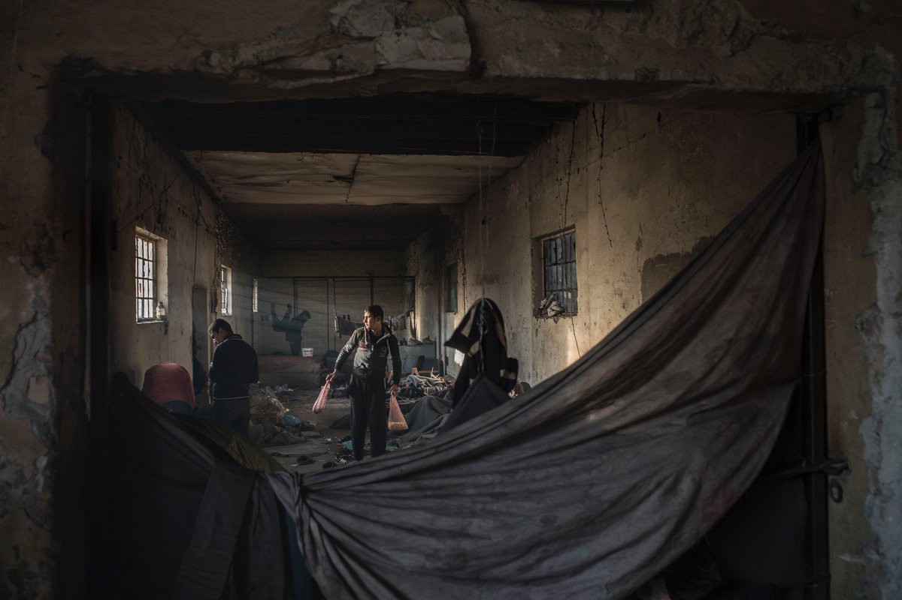
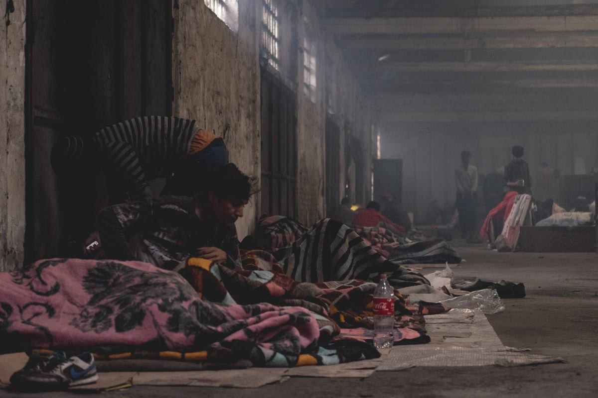
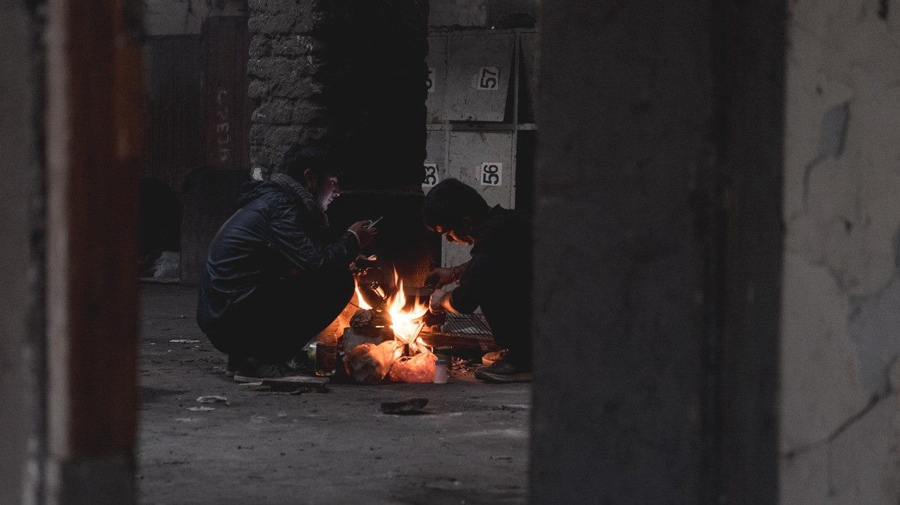
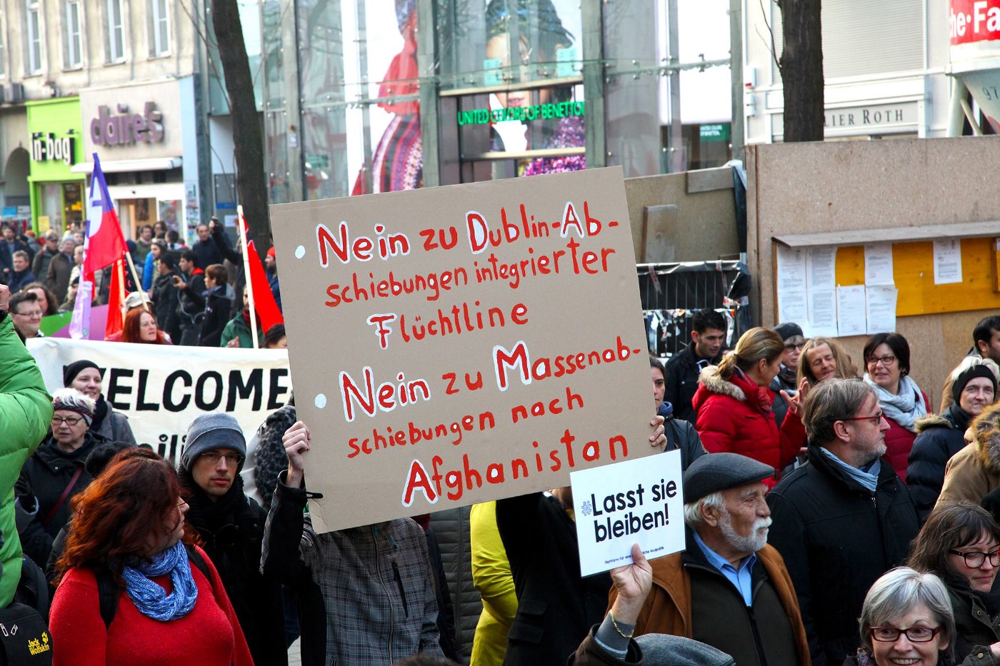
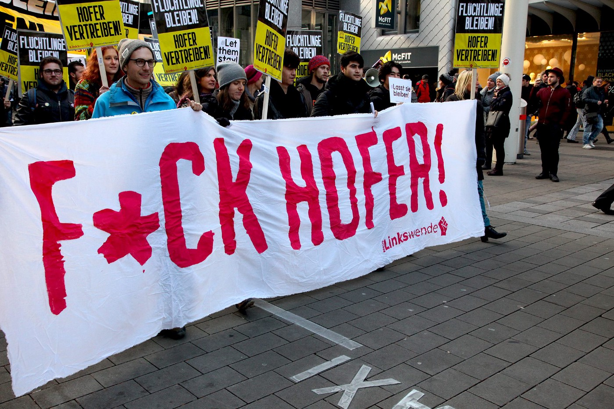
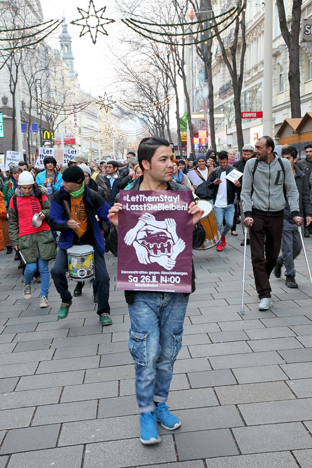
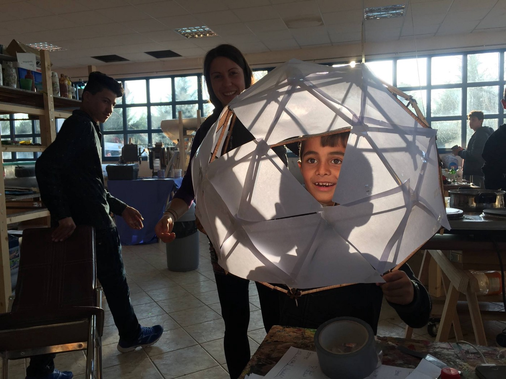
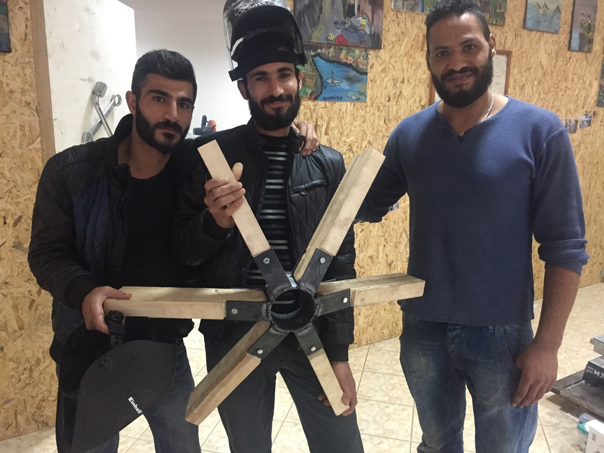

### AYS Daily Digest 26/11: Refugees are freezing in the open, but EU leaders don’t care

_Citizens of Europe, unlike decision makers in their countries, do care about those who need help /// Five boats with 112 people arrived at Chios today /// Another blackmail from Turkey to EU /// Bulgaria threatens expulsion of Afghan refugees/// Volunteers needed for the shifts of watching and scans the shore for boats in Greece/// New camp established in Paris_

Refugees inside an abandoned warehouse in Belgrade\. Foto Matej Leskovsek\.
### Feature
#### Slight increase in number of new arrivals to Greece

A number of refugees staying on Greek islands is growing every day\. Today on Chios, 112 people arrived, which is a slight increase compared to numbers from previous weeks\.

Officially, there are around 16\.000 refugees on the islands at the moment\. The real number could be much higher with many people sleeping in the streets and improvised shelters\. But every camp on the islands has been full for weeks now\. The solution for this situation is nowhere to be found yet\.

At Mytilene, there are around 6000 people at the moment, while the capacity of the two main camps — Kara Tepe and Moria — is 3500\. The situation is especially bad in Moria where twice as many people live as the camp has capacity\. Sanitary conditions are awful, food is poor, there are not enough warm clothes for all the people who are stuck there against their will\. The situation can get worse as more people are expected to come soon\. [Lifeguard Hellas Save and Rescue Volunteer team](https://www.facebook.com/lifeguardhellas/) asks for more volunteers for the shifts of watching and scans the shore for boats\. From the 1st of December they are planning a daily 24/7 observation\. Activists from the [No Border Kitchen](https://www.facebook.com/NBKLesvos/) Lesvos, who are providing 600 meals daily \(and need help to continue doing this incredibly important part of the work\), are reporting about dreadful conditions on this island\.

> “Some people are in the camp for nine months already as their application for asylum is processed very slowly or not at all\. Some people don’t have the chance to apply for asylum at all\. Many people cannot endure these conditions and choose to sleep in empty buildings or on the street\. These people have to hide from police because they are obliged to sleep in the camps\.” 

In Chios, the situation after [the fascist attacks on camp Souda](https://medium.com/@AreYouSyrious/ays-daily-digest-17-11-second-night-of-fascist-attacks-on-souda-camp-9a50d5721bce#.v4np13ul9) remains edgy\. Many of the refugees are without a place to stay, and all of them are afraid the attack could happen again\.

Meanwhile, leaders in Turkey threatened to open borders and allow refugees to reach the European Union, that could mean more people arriving in Greece in the near future\. The threat came after the European Parliament backed a freeze in EU accession talks\. “Listen to me\. If you go any further, then the frontiers will be opened, bear that in mind,” Erdogan sent the message to the EU from Istanbul\.

In March this year, the EU and Turkey made a deal for Turkey to halt the flow of refugees to Europe\. In exchange, the EU promised political and financial concessions for Ankara\. The deal, that was described by many as controversial from the very beginning, sealed the borders leaving thousands of people stranded in the Balkans, most of all in Greece\. So far, the biggest benefit out from the deal was for the smugglers along the route\.

When refuges arrived in Europe, unfortunately not much had been done so far to improve their living conditions\. And winter is already here\. We will probably see the first snow and freezing temperatures next week in the Balkans\. [In Greece, a dramatic drop down of temperature on Tuesday and Wednesday, with snowfall, is expected](http://meteoalarm.eu/en_UK/1/0/GR-Greece.html) \.

Thousands of people will be left to live out in the open in Greece, Macedonia, Serbia, France, Italy… all over Europe\. Their lives are at risk\. Lives of people who are only looking for peace and a chance for a normal life\. They were not offered this chance by the West\.

People are left to sleep in freezing cold all over Europe\. Foto by IRC\.

Today, we live in Europe in which people, with their entire families, are forced to live under tents, with no electricity, heating, or enough food\. In Greece as well as in Bulgaria, recently we witnessed brutal attacks on unprotected people, children included\. Only in Serbia, which is not an EU member state, over 1000 people live out in the open\. The streets of Paris are full of people who need help\.

However, while their leaders remain blind to the suffering of people, we call on all the people of Europe to show solidarity and help in any way they can\. No one deserves what is happening now around us\. We can do better\.

Today, people in Vienna, around 5\.000, protested against “Fortress Europe” and the decision made by its leadership to expel Afghan refugees from the EU\.

](assets/2b92b794c793/1*55zPP9waFF_4nc7V-9MNYw.jpeg)

Photo by [**Arye Wachsmuth**](https://www.facebook.com/arye.wachsmuth)

> “For them, the involuntary return to the country, which was torn by the war, would be dangerous to life… We demand a permanent asylum status for refugees from Afghanistan and other unsafe countries of origin as well as the right to family reunification\!… The people have arrived here, we have received them\. We have the right to live together with them\!” 

Join them in their demands\.

In Paris, people were also in the streets protesting government policy toward refugees\.

Hopefully, more people will join even this call\.

People in Bulgaria are showing their solidarity with refugees in an appeal to the State Agency for Refugees, at the Council of Ministers of the Republic of Bulgaria, demanding their response for beatings reported on Thursday, November 24th inside the largest refugee center in Bulgaria, Harmanli\.

> “Over the course of the past week, the residents of the Harmanli Centre have been placed under a strict quarantine, without any clear explanation as to why\. The mobility of the residents has been completely restricted to the confines of the Centre, which is presently run below any basic reception conditions standards\. After several residents of the Centre protested against their internment, the residents reported that police officers entered the camp and systematically carried out beatings, beating even those who did not participate in the protest\.” 

Join and [sign the petition](https://www.change.org/p/state-agency-for-refugees-authorities-must-allow-emergency-aid-medical-access-to-harmanli-refugee-center) \.
### Greece
#### Important notice on family reunification\!

> Volunteers were informed by BAMF DU5 that, due to technical problems, they didn’t receive some Family Reunion files from GAS Greece on time, which could affect some of the reunification requests\. 

> Once their relatives lodge for Family Reunion in Greece, families should contact Referat DU5 Dortmund in order to speed up the process\. They should write to this address: 

> Referat DU5 Dortmund Märkische Strasse 109 44144 Dortmund 

> The letter needs to contain a valid address of the family members in Germany, names and birth dates and location of the family members in Greece, acceptance of the relative of his family to Germany, asylum case number “Aktenzeichen”, and the Greek case number\. 

#### Habibi team

Incredible news from Katsikas camp\. A very dedicated team [Habibi\.Works](https://www.facebook.com/HabibiWorks/posts/1015590198586404?__mref=message_bubble /react-text) from camp Katsikas completed the first stage of a geodesic dome\!

Team with magic hands\. Habibi\.Works

The dome will be used as a quiet room for [Kiron Open Higher Education](https://www.facebook.com/KironOpenHigherEducation/) students, but also for a cozy music session or as an emergency shelter for unexpected sleepovers\.

> “This team is unstoppable\. Being stuck in Greece for 9 months they carry a spirit and dedication we are applauding\. Shukran — it’s an honor to create with you\.” 

#### New camp opened in Northern Greece

More interesting info from Greece\. Apparently, a new camp near Koutsochero, close to Larissa, is open for the people from Syria who were transferred from Cherso\. The camp is sponsored from Emirates\. Last week we reported that people living in Cherso had to burn all the wood from their Cultural Center to warm themselves\.

The new camps are supplied with isoboxes, heating, and even a little fridge for each of the boxes\. UNHCR and Danish Refugee Council are inside\.

We hope that the rest of the people from Cherso will soon be transferred to a better equipped camp\.
### Help if you can

[Project Clothes](https://www.facebook.com/mobileclothesproject/posts/1822820244622194?hc_location=ufi) continues delivering winter supplies to people in Northern Greece\. They still need mens’ small winter jackets and jumpers and mens’ winter shoes 41 and 42\.

Also, they need help to fund the running costs \(petrol, expanding the truck and warehouse\) \.

You can donate:
TruckSHOP — Verein zur Förderung fairer Verteilungen
Erste Bank der österreichischen Sparkassen AG
IBAN: AT40 2011 1829 4153 2200
BIC: GIBAATWWXXX
or
[https://www\.gofundme\.com/project\-clothes\-2utxcp8](https://www.gofundme.com/project-clothes-2utxcp8)

It sounds absurd to have as a news when somebody buys a washing machine\. But, it is huge thing for people in camps, unfortunately\. [No More Walking](https://www.facebook.com/permalink.php?story_fbid=1181730448574126&id=907385666008607) organization, and their donors, managed to buy 8 machines for people in LM Village, a family camp in the South of Greece, and 225kg of washing powder\. All over Greece, as well as in most of the other countries, refugees are forced to wash their things by hands, outside, and only rarely warm water is provided\.

Hopefully, soon more camps will have washing machines\. The project continues in the North of Greece\. More info about the project and possibilities to help, can be found [here](http://www.nomorewalking.ch/donate) \.

[Doliana Solidarity Project](http://dolianasolidarity.org) in the Epirus region \(Northern Greece\) is currently looking for new Farsi\-speaking volunteers in December/January\. Doliana is a small camp outside of Ioannina with about 130 residents at the moment\. 
DSP is primarily an English education program as well as facilitators between camp residents and NGOs that come into camp\. Volunteer duties will include adult and youth education, translation facilitation \(Farsi/ Arabic\) and psychosocial support\. Free accommodation\!

Dentists, dental nurses, and translators for Arabic are needed in the Thessaloniki area to work with [Health\-Point Foundation \(HPF\)](https://www.facebook.com/groups/1666846223566047/permalink/1761126897471312/) \.

> “We are a charitable organization providing essential dental treatment to the many thousands of refugees in the camps in Northern Greece\. We have established outreach clinics in 15 different refugee camps around the city of Thessaloniki and see hundreds of patients every week\.” 

### Bulgaria
#### Forced expulsions announced in December

The situation in Bulgaria is not settling\. Local authorities are seriously ready to expel over 1,000 refugees who [protested against restrictions on their freedom of movement](https://medium.com/@AreYouSyrious/ays-25-11-hundreds-of-protesters-arrested-to-be-deported-from-bulgaria-9dd73ce01f45#.n9hlzwxl1) \. They are now moved to a former army barracks, but soon could be expelled, as Prime Minister Boiko Borisov said\. People who are being threatened are by large from Afghanistan\. Expulsion could happen in December, as Bulgarian media are reporting\.

[Yesterday, we reported about protests and clashes with the police at the Harmanli reception center](https://medium.com/@AreYouSyrious/ays-25-11-hundreds-of-protesters-arrested-to-be-deported-from-bulgaria-9dd73ce01f45#.n9hlzwxl1) , near the Turkish border\. People who used to live there were banned from leaving the camp freely earlier this week after rumors about communicable skin diseases was spread through the local media\.

Today, authorities in Bulgaria — despite images and testimonies from witnesses and activists — claim that no force have been used against protesters\. However, according to the independent reports around 30 refugees were injured\.

_“We will try to extradite five people immediately because of national security\. The others who disturbed the peace will be among the first to be extradited but, until then, they will be placed in closed\-type camps\. A plane for Afghanistan has already been arranged and it will fly in December,”_ Borisov said to the media\.

At the same time, the Specialized Prosecutor’s Office initiated an investigation against a person from Afghanistan who allegedly set the Bulgarian flag on fire during the protests in Harmanli\.

Bulgaria also announced that the government has no intention to build any new refugee centers\.

The government in Bulgaria ignores all the alarming calls from human rights organizations in the country, including the one from [the Bulgarian Helsinki Committee \(BHC\)](http://www.bghelsinki.org/en/news/press/single/bhc-calls-authorities-investigate-reports-systemic-human-rights-violations-regarding-refugee-access-territory-and-international-protection/) , that warns about a robbery, physical violence and degrading treatment of asylum seekers by police officers\.
### France
#### New camp in Paris

There is a new camp establishing itself not too far from the humanitarian center in Paris\. So far there are around 140 people there\. They are a mix of Afghan, Sudanese, Iranian, chad and Egyptian\.

As volunteers are reporting, this camp is growing daily as new arrivals turn up\.

In France, as well as in the Balkans, part of the media is spreading fear and lies about refugees\. The latest example is from the Facebook page A World At War which on November 22 shows a row of cars enveloped by flames in Paris, stating that the fire had been started by “Muslim migrants” the night before\.

[The video turns out to be more than a year old, and so far there has been no substantiated information about who started the blaze\.](http://observers.france24.com/en/20161125-france-paris-old-video-burning-cars-used-foment-anti-muslim-migrant-sentiment)

Unfortunately, in only three days, the video had been viewed over 1\.3 million times\.

Much of the content posted on this Facebook page has an anti\-Islam and anti\-migrant\.

_Converted [Medium Post](https://areyousyrious.medium.com/ays-daily-digest-26-11-refugees-are-freezing-in-the-open-but-eu-leaders-dont-care-2b92b794c793) by [ZMediumToMarkdown](https://github.com/ZhgChgLi/ZMediumToMarkdown)._
