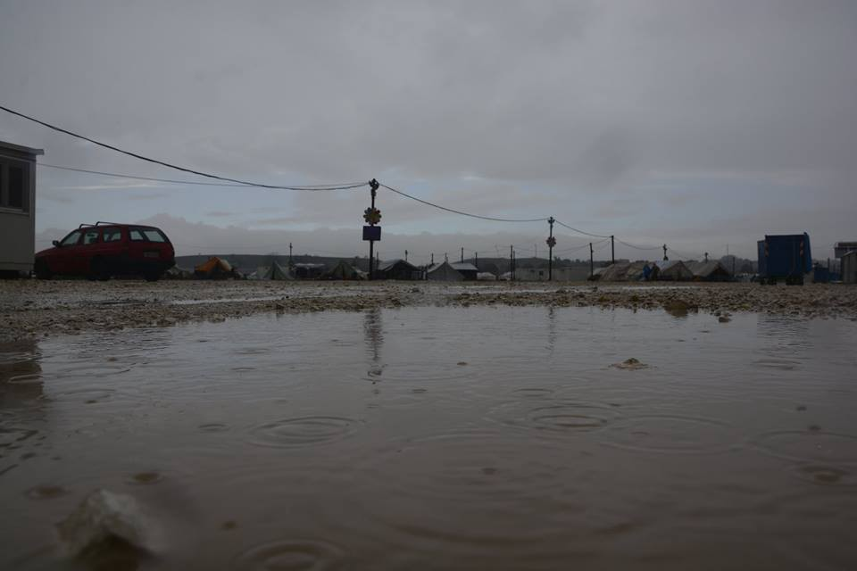

### AYS digest 28/11: Cold November rain does not stop and cannot put out fires

_November rain hitting camps in Greece with snow to come / Fire in Nea Kavala camp / Petra camp being emptied out / Aleppo is still burning with civilians seeking refuge in Kurdish part of the city / Watch the Med reports increased violence against migrants and NGOs in the Mediterranean / 2016 — a year of record numbers of asylum seekers in Italy / Austrian organization, Border Crossing Spielfeld, seeks help / France offering money for voluntary returns / Donations and volunteers needed in Greece, Serbia, Italy and France_

Nea Kavala\. We Are Here community center burned down this morning\.
#### Greece
### **Weather warning**

Severe weather conditions off the coast of many Greek islands\. Waves as high as 2m off the coast of Leros and Kos and 1\.5m high off the coast of Lesvos, Chios and Samos\.
### **November rain lasts forever**

There have been 69 new arrivals on the Greek islands in the last 24 hours while both the mainland and the islands experience harsh weather and even fires\. Several camps in Chios and Lesvos report heavy rain, with storms pummeling facilities ill\-equipped for the winter weather\. Camps on the mainland have also been affected, bringing to mind Axl Rose’s “November rain\.”

Lesvos\. Moria camp

MSF reports that heavy rains are making life even more unbearable in Moria camp, Lesvos, as previous damage caused by fires was never repaired\. Dromografos News has reported a similar situation on Chios\. On the mainland, suffering in places such as Katsikas camp brings to mind desperation from last year’s encampment in Idomeni\.

Chios

Katsikas camp

Heavy rains have not, however, prevented fires from breaking out\. Kathimerini News reports that a fire broke out this morning in Nea Kavala camp\. The fire seems to have originated at the “We Are Here” school and community center in the camp\. Fortunately, no injuries have been reported\.

Burnt down community center in Nea Kavala camp

The community center team at We Are Here [has reported](https://www.facebook.com/WeAreHereCentre/posts/1905957346292528) that it seems the fire was not an accident\. The team suspects arson and believes that the incident was not motivated by anything other than vandalism\. They report their sadness at this loss and its effect on the hundreds of camp residents that were using this facility, especially young children\. The fire has destroyed the center, but solidarity and the will to help still remain\. As the team reports:

“Amidst all the destruction, we were also overwhelmed by the outpouring of love for our team and our project\. We have been there for them and today they were there for us\. We were brought tea and hot food, and countless offers of help to rebuild the centre from scratch\. People even offered the use of their own living containers, and our team has never felt more wanted or welcome in the camp than today\. We believe it is truly important that the community does not suffer from the actions of an individual\. Until the centre is up and running again, the hundreds of people who benefited from its existence have been left with no access to adult education, hugely depleted access to children’s education, no sewing machine, no library and none of the clubs, groups and activities that help to make life in the camp more bearable\. From the overwhelming response of the people of Nea Kavala today, we believe we can take this opportunity to create a stronger centre, in which the community is yet more invested and proud\.”

To rebuild, the community will need help\. If you are able to contribute, please follow this link: [http://bit\.ly/2gDjGYg](http://bit.ly/2gDjGYg)

In a similar vein, Elpida camp has been striving to improve living conditions through collaboration between residents and volunteers\. An engineer from Syria recently designed a water supply system that is to be implemented by the camp’s directors\. This initiative has been facilitated by Emergency Response Centre International, an organization which relies on solidarity and volunteer efforts\. To learn more or to collaborate, see these links: [www\.ercintl\.org/volunteer/](http://www.ercintl.org/volunteer/) and [www\.ercintl\.org/donate/](http://www.ercintl.org/donate/)
### **Petra camp in process of being emptied out**

At long last, Petra camp is being emptied out\. In previous coverage, AYS has described the appalling conditions in the camp\. Staff on the ground currently report that half of Petra’s residents have now been transferred to Athens, with others soon to head onward to either Athens or Thessaloniki\. We cannot yet confirm the final destination of the residents\.
### **Hepatitis A vaccine now available in Filippiada camp**

In other camp news, vaccinations against Hepatitis A are now available in Filippiada camp, as reported by the camp’s information point\. The vaccine was provided with the help of MDM\.
### Madrasa in the Filippiada camp

Filippiada also reports that their madrasa is up and running with English classes to be held in the morning and Arabic and art in the afternoons\.

### **Expect the snow, hope for less rain**

The weather forecast is not looking good for the coming days, with the possibility of snowfall as early as tonight in Attica and more northern regions\. Meanwhile, the south will see more cold November rain\. As they sleep in camps ill\-equipped for the cold weather, many people are reliving last year’s trying experiences\. And we thought nothing could last forever, not even cold November rain\.
#### Syria
### **Civilians seeking refuge in Kurdish part of Aleppo as heavy bombing continues**

As besieged Aleppo is falling, thousands of civilians have sought refuge in Sheikh Maqsood, a Kurdish part of Aleppo\. Syria Civil Defence has issued a statement on the situation in this heavily bombed city, of which we bring you an excerpt:

“The bombardment also destroyed two SCD centres out of a total of four in the besieged part of the city\. Further, as at the time of writing this statement, 35 people are still stuck under the rubble because our teams have not been able to reach them since yesterday\.

Aleppo

Syria Civil Defence, having fully run out of its fuel reserve and \[having\] lost equipment and vehicles used to rescue civilians and having seen these unprecedented attacks on the eastern neighbourhoods, announces Aleppo an inflicted city\. SCD warns of an imminent humanitarian disaster befalling all civilians living in besieged areas\. These civilians have no access to basic food materials and medicines in the light of internal displacement from eastern to western neighbourhoods in the besieged part of the city\. Moreover, the available houses or shelters are not adequate to accommodate and protect them\.

SCD calls on all humanitarian, aid and medical organizations to immediately intervene to put an end to the humanitarian disaster that civilians in besieged Aleppo are suffering from\.”
#### Mediterranean
### **More violence against migrants as well as against the NGOs — Watch the Med six week report**

Watch the Med has issued its [six week report](https://alarmphone.org/en/2016/11/27/six-week-report/) \. The report states that violence against migrants as well as NGOs is increasing, and warns that the EU is ever more concerned with systematically pushing people back to Libya’s coast than helping them to reach safety\. It seems that in late October, the EU’s naval operation EUNAVFOR MED/Sophia started to train the so\-called Libyan coast guard on their vessels, showing them how to do the dirty job of preventing travelers from leaving Libyan waters\.
#### Italy
### **2016 — a year of record numbers of asylum seekers in Italy**

Despite the EU’s appalling practices, keeping people out or forcing people into dangerous situations at sea, 2016 has been a year of record numbers of asylum seekers in Italy\. As [The Guardian reports,](https://www.theguardian.com/world/2016/nov/28/2016-sets-new-record-for-asylum-seekers-reaching-italy-by-boat) “Nearly 171,000 people have arrived in Italy from [north Africa](https://www.theguardian.com/world/africa) since the start of the year, according to statistics compiled by the UN refugee agency and the Italian government\. As of Monday, the total had surpassed the previous record of 170,000, set in 2014\.” This situation has, not surprisingly, prompted a militarized reaction from the EU, which is aiming to prevent people from crossing into European waters\. As for the Italian mainland, Rome’s mayor Virginia Raggi stated today that “Rome is not able to welcome anymore\.”
### **Baobab Experience needs donations**

Baobab Experience community

Because many people in Rome are in need of accommodation, [Baobab Experience](https://www.facebook.com/BaobabExperience/) is working tirelessly and is asking for help\. They are able to accept donations every day in Piazzale Spadolini \(behind Tiburtina Station\) from 8:30am to 8pm\. As the temperature is falling, they are especially in need of the following items: sleeping bags, blankets, duvets, scarves, gloves, hats, winter jackets in small sizes \(XS, S, M\), thermal underwear, cotton socks and underwear \(sizes XS and S\), especially in dark colors\. The organization also accepts donations via bank transfer:

Baobab Experience — c\.f\. 97878960588

Bank transfer to: Carta EVO — Banca Etica

IBAN: IT72Y0359901899050188533521

They sum up their mission with the following message: “Together with your support, we know that we can still give warmth to these people, who have been forgotten by other institutions\.”

The agencies concerned with asylum procedures are clogged per usual\. For more information follow this link: [http://reut\.rs/2g9FNYf](http://reut.rs/2g9FNYf)
#### Serbia
### **Hot Food Idomeni needs donations**

Hot Food Idomeni has posted the following message and is reaching out to all those able to help with their efforts in Serbia and Northern Greece: “Hot Food Idomeni remain fully committed to giving effective support to the refugees in Serbia and Northern Greece this winter and rely on your donations to continue making a difference\. If you want to support any of our responses please click on our donate button or send a private message to help us directly\.” You can donate via [their FB page](https://www.facebook.com/Hotfoodidomeni/?fref=nf) \.
### **Kelebija community needs donations**

Further to the north, our friends at [North Star](https://www.facebook.com/NorthStarSerbia/) described the situation in Kelebija Community Center as “Rainy Sundays\!” They added that, “Yesterday, we had around 60 people show up at the KCC and stay most of the day\. This was due in part to the fact that the tents at the KCC are some of the only large structures that can keep people out of the rain\. Pictured below are some members of our community support team\. We have now assembled a roster of community supporters who are residents of the Kelebija Transit Zone\. These are the people you can count on, and with their help we’re able to stay up\-to\-date on the needs of the community and respond to them ASAP\. Thank you, community team\! You guys are the BEST\.”

Kelebija Community Center crew

They went on to say that, “electricity costs approximately doubled last month and we can only expect them to be higher\. We may have to rely on the generator more in the coming weeks in order to keep the location safe \[and keep\] from overloading the electrical system\. If you like what you see, [please donate](https://www.youcaring.com/kelebija-community-center-675966/donate#wp) so we can continue to keep the KCC as \[a\] warm, inviting place\!”
#### Hungary
### **Bicske reception center closing, Migszol against it**

The Bicske reception center will be closed by the Hungarian government by the end of 2016\. Migszol has issued a statement explaining that they are against this because they support, “the full inclusion of anyone in society regardless of their immigration status\.”

Moreover, they demand that we “take the necessary steps to reach that goal\. We want to live in a society where people seeking protection are not separated, where they can live in apartments, can have the same conditions, circumstances as citizens of the country do\. That means, we do not support the idea that people should have to live in camps at all during their asylum procedure, let alone for years after they were granted asylum\.” For more information follow this link: [http://bit\.ly/2fFTSsq](http://bit.ly/2fFTSsq)
#### Bulgaria
### **Those arrested in the riots will be tried and probably deported**

According to reports on the ground, in the aftermath of riots and police violence 400 people were taken to the detention center in Elhovo\. Two people were brought to the emergency room with injuries; these were caused in both cases by brutal police violence\. Those arrested will go to Elhovo court, but if detainees agree to a voluntary return, they will not be sentenced and may be able to avoid court altogether\.

According to volunteers on site, “In the last 3 days they are taking away all single men out of the camp — we don’t know exactly where — they say in old military barracks next to the border but nobody really knows\. It is possible that the government just wants to deport back all Afghans regardless if they were part of the riot or not\.”

This decision may have been prompted by the “very common mass opinion spread by media that there is no war in Afghanistan and all of them are economic migrants, so people hate them much more than they hate Syrians for example\.”
#### Austria
### **Border Crossing Spielfeld requests help from activists in Croatia**

As deportations from Austria are happening, Border Crossing Spielfeld is asking for the following donations\. They are also aiming to establish increased communication between Croatian and Austrian organizations and activists\. Specifically, they need:
1. Help bringing bags that have been left behind by refugees journeying from lower/upper Austria to Graz, Spielfeld or Zagreb
2. Financial help for medical treatment of refugees in Zagreb \(the organization can help with direct contact\)
3. Updates about the situation in Croatian camps and knowledge of Croatian asylum procedures\.

For more information see [their FB page](https://www.facebook.com/RefugeesSpielfeld/posts/1785509125042902)
#### France
### **Volunteers needed in Dunkirk**

Dunkirk Refugee Children’s Centre

“Dunkirk Refugee Children’s Centre is seeking medium\-long term \(1 month\+ \) and short term volunteers \(1–3 weeks\) to join our expanding team this December\. The children’s centre, set up in March this year, has grown from a tiny tent with a handful of children to two large classes, with over 100 children accessing our services over the past month alone\. We run a nursery/playschool for children aged 1–7 and a safe play space for children aged 7–11\+ \. We would particularly like to hear from people with a background in Education, Early Years, Youth Services, Psychology/Therapy, Arts or Sports Coaching\. We also need general short term volunteers to work as Play Assistants\. If you have experience of working with children and would like to find out more about volunteering at Dunkirk Children’s Centre, please get in touch with us at [dunkirkchildrenscentre@gmail\.com](mailto:dunkirkchildrenscentre@gmail.com) \.”
### **France offering money for voluntary returns**

With the streets of Paris still full of people sleeping out in the cold, French authorities have proposed paying people so as to encourage them to return to their homelands\. Authorities are offering a plane ticket and 2,500 euros if people are willing to leave\. There is the possibility of receiving up to 10,000 euros for people who start a business in their country of origin\. Some people have accepted this offer and have left France\. Authorities are aiming to expand the budget for this initiative, News that Moves reports\.

_Converted [Medium Post](https://areyousyrious.medium.com/ays-digest-28-11-cold-november-rain-does-not-stop-and-cannot-put-out-fires-49f1a924037c) by [ZMediumToMarkdown](https://github.com/ZhgChgLi/ZMediumToMarkdown)._
