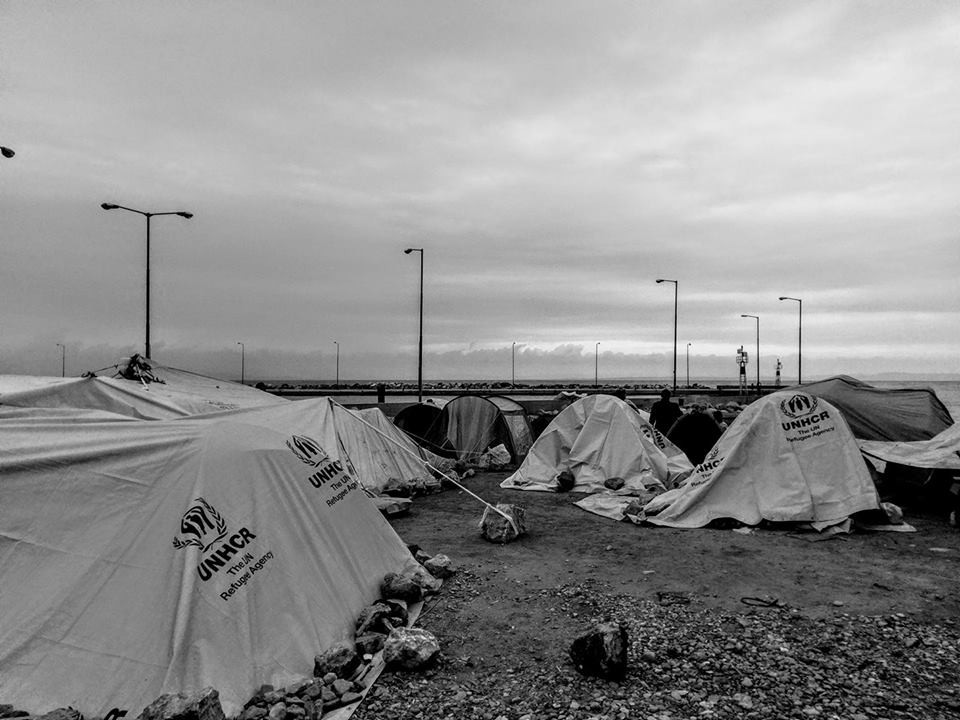
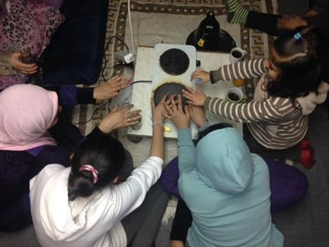
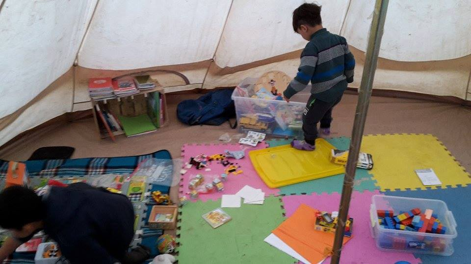
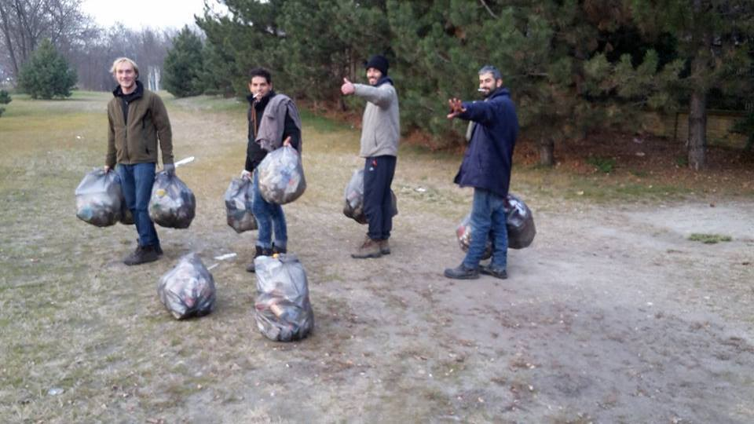
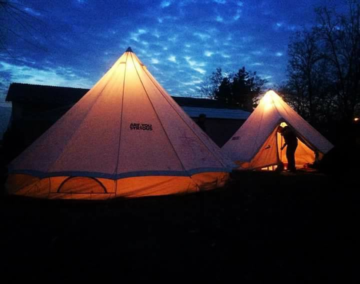
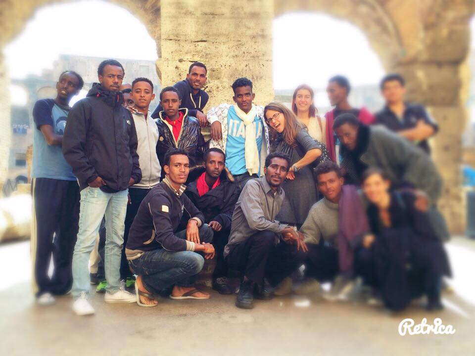

### AYS Digest 27\.11: Greek refugee camps unprepared for winter

](assets/8e1ae253a09a/0*Y8FfBqJVC8BfA9pq.)

Photo by [Through Refugee Eyes](https://www.facebook.com/throughrefugeeeyes/)

_Greek camps unprepared for winter /// Update on Harmanli riots — lack of access to legal aid and police retaliation feared /// Specialist volunteers needed in Calais /// Call for 1,000 unaccompanied minors to join UK by Christmas\._
### New arrivals in Chios and Lesvos

100 refugees were registered on Chios today and one boat with 53 people landed in the north coast of Lesvos this morning\.

Photo by Katerina Efthimiou
### Overcrowded facilities, lack of preparation for winter putting refugees at risk

Refugees in Lesvos protested today over Friday’s explosion of a gas canister in the Moria camp, leading to the death of one grandmother and her grandson\.

■■■■■■■■■■■■■■ 
> **[Will Horner](https://twitter.com/willhorner) @ Twitter Says:** 

> > #Refugees and migrants of all nationalities are protesting now in Mytilene, Lesvos over #Moria fire, not my video https://t.co/hVYKUb2V7g 

> **Tweeted at [2016-11-27 16:57:37](https://twitter.com/willhorner/status/802919316047982592).** 

■■■■■■■■■■■■■■ 

Migration Minister Mouzalas was criticized in Parliament after the explosion, with MPs saying overcrowded facilities, as well as the lack of precautions taken for the onset of winter put refugees at risk\.

As refugees face their second winter in Greece, many volunteers also worry that camps are not prepared for the cold temperatures\. On Chios, lack of space in official camps forces people to sleep on the beach\. One Chios volunteer said an Afghan family with a ten month old baby and five year old child was given only “one blanket each and a flimsy cheap looking tent” to sleep on the beach, in the rain, and in the cold\.

Another Chios volunteer notes that “winterisation, \(…\) the humanitarian\-speak for making refugee camps ready for winter conditions”, in practice means “moving people from flimsy, rickety, pathetic little tents covered by rags of UNHCR tarps, into slightly less flimsy, slightly less pathetic field tents”\.

Photo by Gabrielle Tan

As of Sunday, more than 16,000 refugees live on camps in the Aegean Islands, despite capacity for only 7,450\. Despite overcrowded camps, Minister for Migration Mouzalas resists calls for transfers to the mainland, saying this could threaten the EU\-Turkey deal and instead suggests creating new camps on the islands\. Government officials also told Ekathimerini that “the best solution would be to speed up the asylum process and create new reception facilities on the mainland as well as the islands”\. However, new camps are resisted by local officials\. In Chios in particular, the municipal council is split over the creation of a new hot spot, while local residents have demanded for the Souda camp to be shut down\.

Given the overcrowded camps and slow asylum procedures, refugees often try to \(and sometimes succeed to\) reach the mainland\. In response, the Greek government has threatened to detain and return back to the islands those who have reached the mainland without approval\. Volunteers note that the threat to deport refugees back to Turkey or to their home countries however should be taken with a grain of salt\.
### Mainland camps unprepared for winter

Mainland camps are also unprepared for the winter\. A video, shot in Elliniko, shows the living conditions of the camp under heavy rain\.

■■■■■■■■■■■■■■ 
> **[City Plaza Squat](https://twitter.com/sol2refugees) @ Twitter Says:** 

> > #Video #refugees send us from the #EllinikoCamp, show the horrible condition of families live in #tents while its raining. #Athens #Greece https://t.co/pcafFwNK3w 

> **Tweeted at [2016-11-27 22:58:16](https://twitter.com/sol2refugees/status/803010078504873988).** 

■■■■■■■■■■■■■■ 

The problem is not only that people are still sleeping in tents, but that many of the camps are badly connected to electricity grids and are not provided with heating\. In Filippiada for example, the camp was provided with cabins, but the lack of heating makes them useless, as it is colder inside the cabins than outside\. In Oreokastro, a lot of people are sick because of the cold and resort to desperate measures in order to stay warm\.

This is the desperate way in which people try to heat themselves in Oreokastro\. Photo by The Voices of Oreokastro\.

There is however a tendency to move refugees from camps to hotels and indoor housing, with people recently moved from Petra camp to hotels and camps with heated containers\.

The Emirates Red Crescent has opened two camps in Greece that are hopefully better equipped for the winter\. One of those camps near Larissa includes 331 residential units for 2,000 people, a medical clinic, parks, and educational and sport facilities according to the [Emirates News Agency](http://www.wam.ae/en/news/emirates-international-aid/1395303542851.html) \. Volunteers say that some refugees were moved from Cherso to this new camp, called Efthimiopoulou, which for the moment hosts 440 people, while only 645 are left in Cherso, down from 1,077 last Tuesday\. The second facility, also located near Athens, will house almost 1,000 refugees\.

 s”\.](assets/8e1ae253a09a/0*nmjovm_h9bxu_iCP.jpg)

“ We know the fire isn’t healthy for us and for our kids at all 
 but still it’s our only way to get warm in this cold winter “\. By “ [Through Refugee Eye](https://www.facebook.com/throughrefugeeeyes/?ref=br_rs) s”\.
### Detention centres planned on Aegean Islands

According to [Lesvos News](http://www.lesvosnews.net/articles/news-categories/politiki/o-moyzalas-apofasise-kentro-kratisis-sti-mytilini-epektasi-ton) , Mouzalas said that there will be detention centres on Lesvos, Chios, Samos, Kos and Leros, arguing that these are necessary to accelerate asylum procedures\. He added that many disappear to the mainland once their asylum requests are rejected and believes closed detention centres will prevent this\.

](assets/8e1ae253a09a/0*LJZT5rtc5ybZG9IR.jpg)

“I was standing in front of the tents for 5 minutes, looking at how difficult is it to be here, how difficult is it when kids ask their father about school, how difficult it is to have so many dreams while you are in a refugee camp, how beautiful the rain is and how difficult is it here\.” By [Abdulazez Dukhan](https://www.facebook.com/AbdulazezDukhan)
#### Volunteers needed in Doliana

[The Doliana Solidarity](http://dolianasolidarity.org/) Project is urgently looking for an English teacher to come as fast as possible for at least one or two weeks and needs Farsi\-speaking teachers for December/January\. The camp is situated in Eprius and hosts around 200 people\.
#### Serbia
### Update from Kelebija

Fresh Response Serbia has filled the kids tent with toys and pencils, colors, books, papers in Kelebija\. Photo by Fresh Response

The whole area along the road to Kelebija has been cleaned as part of a community project, with help from both refugees and volunteers\. Nearly 30 bags of trash were collected\. Photo by Fresh Response

AYS tents in action\. Photo by Fresh Response
#### Hungary
### Demonstrations in solidarity with Ahmed H\.

A demonstration is planned on Wednesday in Szeged, in front of the court house where Ahmed H\.’s last court hearing will take place\. Another protest will take place on the 3rd of December in Budapest\. Ahmed H faces terrorism charges and up to 20 years in prison, related to protests after Hungary closed its border with Serbia\.

You can find more information about the trial on the [Free the Rozke website](http://freetheroszke11.weebly.com/) and through this short documentary\.

#### Bulgaria
### Update on Harmanli riots

[In Friday’s digest](https://medium.com/@AreYouSyrious/ays-25-11-hundreds-of-protesters-arrested-to-be-deported-from-bulgaria-9dd73ce01f45#.h3mdv64v5) we reported about the riots in Bulgaria’s largest refugee camp of Harmanli, that left more than 200 refugees and 29 policemen injured\. Official government sources said a thousand refugees will be moved near the Turkish border and later expelled from the country, while a number of other sources reported on brutal retaliation by police within the camp itself\.

One volunteer said police stormed into the camp after the riots, severely beating men and teenage boys for two hours\. The same source said Afghan asylum seekers are confused and scared, having now lost all trust in authorities and believing that any kind of violence or abuse is possible\.

Arrested refugees said they have been separated into three different groups and sent to different places, adding that they have never been given food — some of them are believed to have been take to court in Elhovo, in the south\-east of Bulgaria\.

The volunteer now fears that arrested people will lack access to legal aid and that violence could again be used against them\.
#### France
### Call for specialist volunteers in Calais

Care4Calais is looking for specialist volunteers :
- to help on a building project from the 28th to the 30th of November\.
- a good electrician for one day only, any time in the next month\. Care4Calais can help with travel costs\.
- French, Tigrinya, Oromo, Amharic, Pashto interpreters in the UK or in Calais\.

Volunteers are also needed for normal day to day work, which includes visiting CAOs and detention centres, helping refugees in Paris and in small camps, supporting the Dunkirk camp and running the warehouse\.
### 1,000 children by Christmas

Thousands of unaccompanied children remain in France after the destruction of the Calais camp and were transferred to accommodation centres, after the Home Office promised to rapidly process their claims to join the UK under Dublin Regulations and the Dubs amendment\. However, Calais Action says that transfers have ground to a halt in the last three weeks, while the Home Office has drastically narrowed down who can enter the UK under the Dubs amendment\.

Help Refugees suggests sending letters to the Home Office \( public\.enquiries@homeoffice\.gsi\.gov\.uk\) and to [MPs](http://www.writetothem.com) , asking them to let at least 1,000 children enter the UK\.
#### Italy
### Tour guides for refugees needed in Rome

[Baobab](https://www.facebook.com/BaobabExperience) is looking for tour guides, art historians, archaeologists, architects and passionate people to propose and organise guided tours around Rome for refugees\. The first visits will be organised in the next two days\.

Photo by Baobab
#### Germany
### 165 asylum\-seekers taken back from Belgium

[RTBF](http://www.rtbf.be/info/dossier/drames-de-la-migration-les-candidats-refugies-meurent-aux-portes-de-l-europe/detail_l-allemagne-reprend-en-charge-des-demandeurs-d-asile-arrives-en-belgique?id=9465409) says Germany has accepted to take back 165 asylum\-seekers from Belgium\. The group is part of 350 people who first registered in Germany and should therefore go back to the country according to the Dublin procedure\. Around half of the 900 asylum seekers living in the Netherlands and first registered in Germany were also taken back\.

_Converted [Medium Post](https://areyousyrious.medium.com/new-arrivals-in-chios-and-lesvos-8e1ae253a09a) by [ZMediumToMarkdown](https://github.com/ZhgChgLi/ZMediumToMarkdown)._
