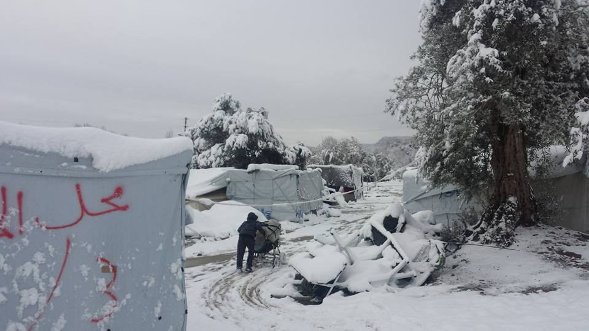
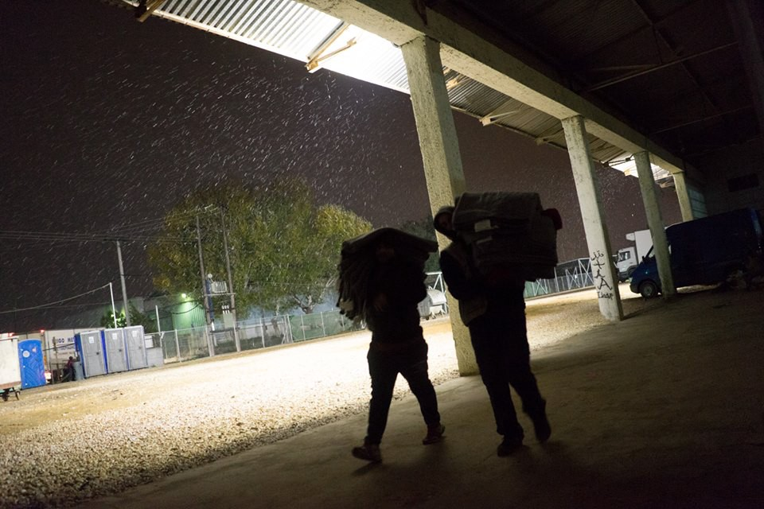
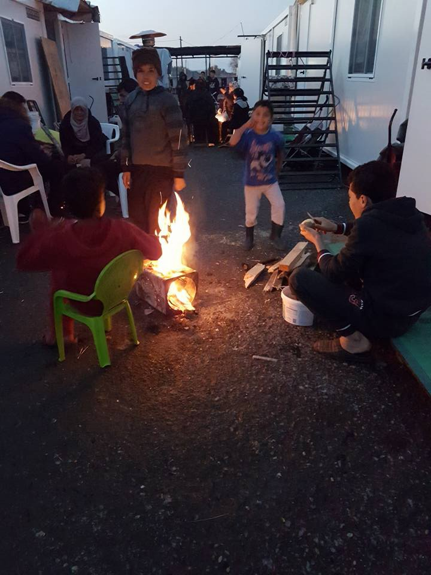
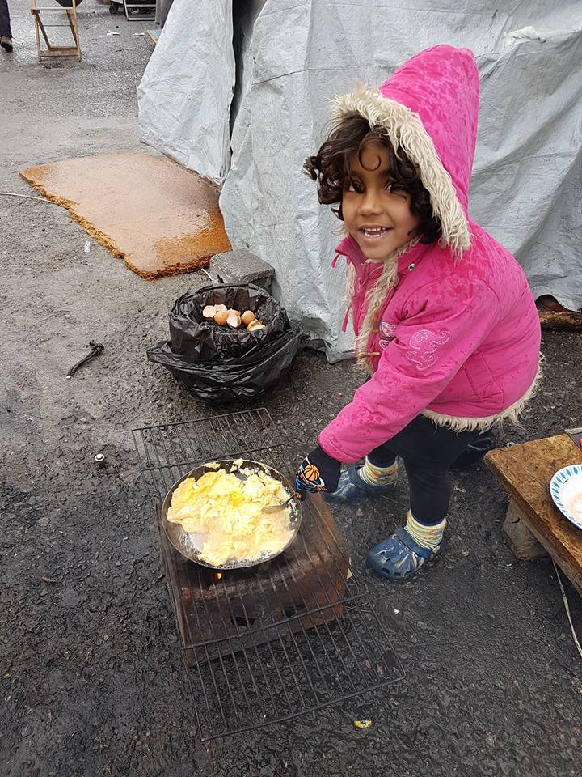
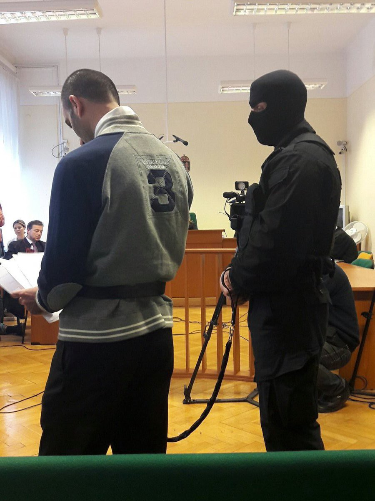

### AYS DIGEST 30/11: Winter arrives in force to Greece

](assets/bb9f750b8e99/1*hXN-soVuhPjJNLsdIdDulQ.jpeg)

Petra camp this morning by [Paul Carr](https://www.facebook.com/refugee.aidlesvos)
### Feature

It had been very cold for a while now in northern Greece and volunteers have been very busy trying to improve the difficult conditions the refugees live in around the country\.

But no preparations would have been enough for what happened last night and today, especially the camp of Petra on the hills next to mount Olympus, where 241 people \(official numbers\) were still living when a huge snow storm came down merciless on them\.

Throughout the day people have been moved to different parts of the country, some to hotels in Thessaloniki, some to Volvi area, Katerini and even some places in Athens\. Reports said that 5 buses were used to take all refugees away from the camp and the last information collected fortunately suggest that everyone could be rescued and is now proper shelter\.

Another angle from Petra, by Paul Carr

Since last week, the camp had been systematically evacuated and actually the number of refugees living there were reduced from almost 1000 to 241 like the official figures say, an effort that wasn’t enough but after today we really wish the governments of, not only Greece but also Europe and the big NGOs double their efforts to provide better shelter to all the refugees living in rough conditions around Greece and beyond\.

It wasn’t only from this camp that we got reports from bad weather, freezing temperatures and snowfall, many other camps further north experienced, and will continue to experience, the harsh conditions brought by the winter\.

The Kurdish refugees remaining at Cherso are also being moved to houses and hotels but according to local volunteers about 250 are still there\.

At Softex camp we get a emotional report from a volunteer working there today:

> Today the winter kicked in ultimately in Northern Greece\. It snowed all day here in camp Softex\. And I was definitely not prepared\. Not for the snow, not for the unimaginable cold, not for the wind, not for the despair of the people, not for my own despair\. 

> A little blond, curled girl of only one year cried heavily for blankets in a tent\. She wouldn’t let me go\. I can’t stop crying ever since\. A woman sat crying in another tent and asked where the human rights have gone\. I don’t know where they are, but I can definitely tell that she won’t find them here\. It’s 0 degrees, it feels like minus 8 and it’s snowing\. And we leave single moms with little children to sleep outside in the snow in a tent without heating\. If there are human rights in the world, they are not here\. If there is solidarity and humanity in the world, it is not here\. There is nothing human here\. No human should be here\. 

> And while the big organisations shut down all their activities because of the cold, we were all day running desperately from A to B to C to distribute blankets, sleeping bags, shoes, clothes, anything that could help against the cold\. But it is never enough\. When we go home to our heated, safe and dry rooms, when we close the doors to the snow and the wind, we leave them behind\. In a tent without heating in the wind and snow\. Many times I literally froze today in disbelief\. I just can’t understand how this can happen\. I really don’t understand\. 

Photos by Loïs Simac

Also from the camp at Alexandria, [Refugee support Greece](https://www.facebook.com/RefugeeSupportGreece/?fref=nf) , make an appeal for help\.

_It is 1°C this morning in Alexandreia and I feel very concerned for my friends living on camp with no heating\._ 
_Unfortunately there is nothing I can do about this at present\._ 
_I did however decide to do a little magic\! \! I donated my £200 Winter Fuel allowance and turned it into £250 by Gift Aiding the donation\. This money will help buy food for people like this little girl so at least she and her family can have a hot meal this morning\._ 
_Please join me in helping as they say “ [every little bit helps](https://mydonate.bt.com/events/foodandessentials/338610) ”_

Photo by Refugee Support Greece

Photo by Refugee Support Greece

Tonight and tomorrow, even if snow isn’t expected, temperature is expected to range between \-3 and \-10 in central and northern Greece so special measures are recommended to try to keep people warm\. Temperatures will stay very low, especially in the north for the following days\.
#### Chios

The bad weather has also been felt on Chios for another day and many refugees couldn’t keep their tents from being blown apart by the strong winds\.

Unfortunately not everyone is trying to help refugees on the island\.

](assets/bb9f750b8e99/1*rbH3A0Wq-Gm6WBhXdYHS5w.jpeg)

Photo by [Gabrielle Tan](https://www.facebook.com/gabrielle.tan)

At Souda a tent wrecked by strong winds blowing through Chios for the past 3 days\.

> This photo should speak a thousand words\. 

> [Pothiti](https://www.facebook.com/pothiti.kitromilidi) and me spent an hour — well her — calling various hotel owners along the eastern shore to accommodate families with extremely young children\. We heard nothing but lame excuses and some outright “no”\. 

> News reported that 4 parishes of Chios have refused to open their halls — citing “operational” reasons\. 

The world is witnessing the biggest humanitarian crisis since World War 2\. Yet the responsible authorities have failed to preserve the dignity of the displaced, and governments only interested in maintaining the institution of Fortress Europe\.

The weather forecast from SAO \(Save Assist Forecast\) predicts severe warnings for all the Aegean sea with strong winds and high waves for tonight\.
#### This rough sea conditions explain the low number of arrivals on the Greek islands today with only 20 registrations\.
#### Athens

From the capital, once again, we get a report about sexual abuse of refugees\.

Children are still prostituting themselves to survive\.

> A few weeks ago, the RefuComm team rescued several unaccompanied minors from the streets of Athens and potentially saved them from the same fate\. They are safe in minors homes now after a battle with the ‘authorities’\. 

> Unfortunately, as indicated once again, in this report, no one single agency wants to take responsibility\. The agencies just shift the problem around\. 

> In this report, UNHCR say the ‘authorities’ should do something about it\. As protection officers \(and senior protection officers\) surely they are the authorities? What exactly does protection mean? Who are they allegedly protecting if kids are prostitution themselves on the streets in full view of the general public? 

> Also present in Athens, Save The Children, Unicef and various other ‘protection’ agencies for minors\. Shouldn’t this be their job? Protecting minors? When exactly are they going to begin saving the children? 

> The police say they are aware of it but have had no reports\. What sort of answer is this? It happens in full view of the general public\. What exactly needs reporting before the police act? Child prostitution is against the law\. Why aren’t they arresting people? Dealing with the problem? 

#### UNHCR

There is some good news for three Syrian families that UNHCR has moved to apartments in the town of Livadia\. Another 55 apartments will provide a home for more relocation candidates and vulnerable asylum seekers\.
#### There has been a call for help from teams of volunteers\.

Lighthouse Relief volunteers of Lesvos are fundraising because there is a critical shortage of shoes to provide for refugees\. With winter fast approaching, nearly every refugee now arrives with soaking wet shoes, increasing the life threatening risk of hypothermia\. Providing dry clothing is the fastest and most efficient response to hypothermia that Lighthouse Relief can provide\. Unfortunately, NGOs across the island have exhausted the supply of shoes and, due to the reality of the crisis, demand outweighs supply\. To support them please follow the [link](https://www.justgiving.com/crowdfunding/lighthousereliefvolunteers-lesvos) \.

[Northern Greece Volunteers](https://www.facebook.com/northerngreecevolunteers/?fref=nf) are asking for volunteers to sort warm clothes, weatherproof living spaces, cook hot meals\. Whether you can give your time for few days\.

[ERCI](https://www.facebook.com/ercintl/posts/551224418410647?hc_location=ufi) is looking for a German teacher at Elpida home\.
### Syria

As regime forces gain ground in eastern Aleppo, rescue workers said more than 45 people had been killed in artillery bombardment of rebel\-held eastern Aleppo on Wednesday, and the Syrian Observatory for Human Rights said more than 50,000 people had been displaced by the fighting\. The Civil Defense said in a message posted on its Telegram account that dozens more people had been wounded in the artillery attack it said had hit people displaced from eastern Aleppo\. Most of the dead were women and children, it said\.

In the meanwhile, Russian Deputy Foreign Minister Mikhail Bogdanov hopes the situation in Syria’s Aleppo will be ‘sorted out’ by year’s end\.

> “We need to force these terrorists out in the same way as they need to be forced out in Mosul and in Raqqa,” 

Bogdanov told the RIA Novosti news agency\.
### Serbia

Today at Miksaliste centre a total of 357 people were served having 33 men, 31 women and 293 children\.

Also from Serbia volunteer says the number of people is decreasing in Kelebija and they’re slowly letting the remaining people go through\. It is possible that only the Algerians might be sent back to Macedonia, that is the general atmosphere in the camp at the moment\.
### Hungary

A Syrian refugee has been jailed for 10 years on terrorism charges in Hungary in a case that has become a cornerstone of the country’s crackdown on refugees, and which [Amnesty International](https://www.amnesty.org/en/latest/news/2016/11/how-a-family-man-in-cyprus-ended-up-in-a-hungarian-jail-cell-accused-of-terrorism/) has called “an affront to justice”\.

The 42\-year\-old Syrian, named in court as “Ahmed H”, was arrested on the Hungarian\-Serbian border in September 2015 and accused of orchestrating clashes between refugees and police\.

The case has been central to the rightwing Hungarian government’s two\-year campaign to stoke xenophobia and portray refugees as terrorists\. It has also become a cause celebre for rights campaigners seeking to highlight the draconian character of Europe’s refugee policies\.

By the time of his arrest, H was already a legal EU resident living in Cyprus with his wife and children\. He says he only joined the thousands of refugees making their way from Turkey to Germany last year when his elderly parents and other family members fled Syria and asked him to accompany them for their safety\.

They reached the Hungarian border just as it closed, which sparked clashes between police and migrants\. In the melee H and his parents were arrested\. As H had been carrying a loudspeaker as well as his family’s passports, he was accused of being the ringleader\.

Ahmed literaly on a leash during the trial

There are reports of protests on the streets of Budapest after these outrageous happenings\.
### Italy

The UN’s refugee agency \(UNHCR\) has written to the mayor of Rome voicing alarm over the hundreds of migrants sleeping rough on the capital’s streets while thousands more with legal residency are forced to live in squats\.

> “We have been highlighting this problem for months and our worries have only increased,” said Carlotta Sami, UNHCR’s spokeswoman in Italy\. 

Sami said Rome’s could learn from Milan, where the city authorities have established a migrant reception “hub” with the express purpose of keeping people off the streets as winter sets in\.

Raggi, a member of the populist Five Star Movement, said recently that her administration’s priority was to stop the flow of migrants into the city\.

> “If we set up 100 tents, in two days we will have to provide 100 others” 

### UK

[**Samara’s Aid Appeal**](https://www.facebook.com/winterclothesappeal/?ref=page_internal) **has asked an urgently for donations to send to Syria and Iraq\. They need:**

WINTER CLOTHES, SHOES, BEDDING & HYGIENE items needed\.

MILD SEASON CLOTHES
COATS & SNOW WEAR
NEW UNDERWEAR only \(no used\), with tags or in packaging
SHOES \(polished\) in immaculate condition
BOOTS & WELLY BOOTS, clean
BLANKETS, sleeping bags, sheets & towels in immaculate condition
DUVETS only if like new with no marks or stains
WHEELCHAIRS, zimmer frames and crutches \(paired\)
MOSES baskets and baby bedding
DISPOSABLE nappies, sanitary towels & incontinence pads
CARE PACKS for mothers & babies

[**United Aid Network**](https://www.facebook.com/groups/refugeeaidnetwork/?fref=ts) **is also asking for donations to help [fund](https://www.justgiving.com/crowdfunding/TeamReyhanli) their next aid mission\.**

_Converted [Medium Post](https://areyousyrious.medium.com/ays-digest-30-11-winter-arrives-in-force-to-greece-bb9f750b8e99) by [ZMediumToMarkdown](https://github.com/ZhgChgLi/ZMediumToMarkdown)._
