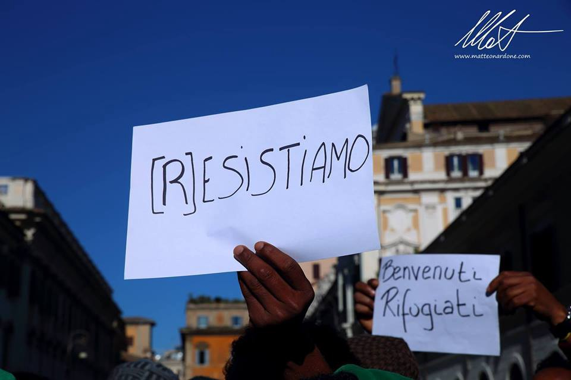
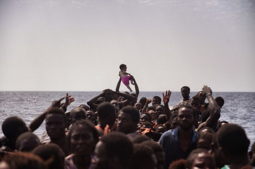
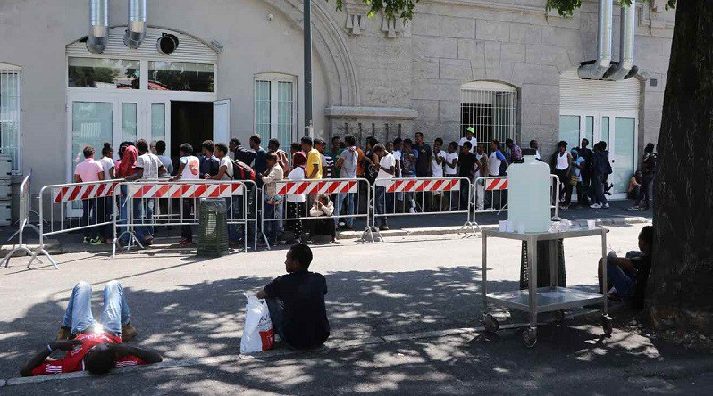
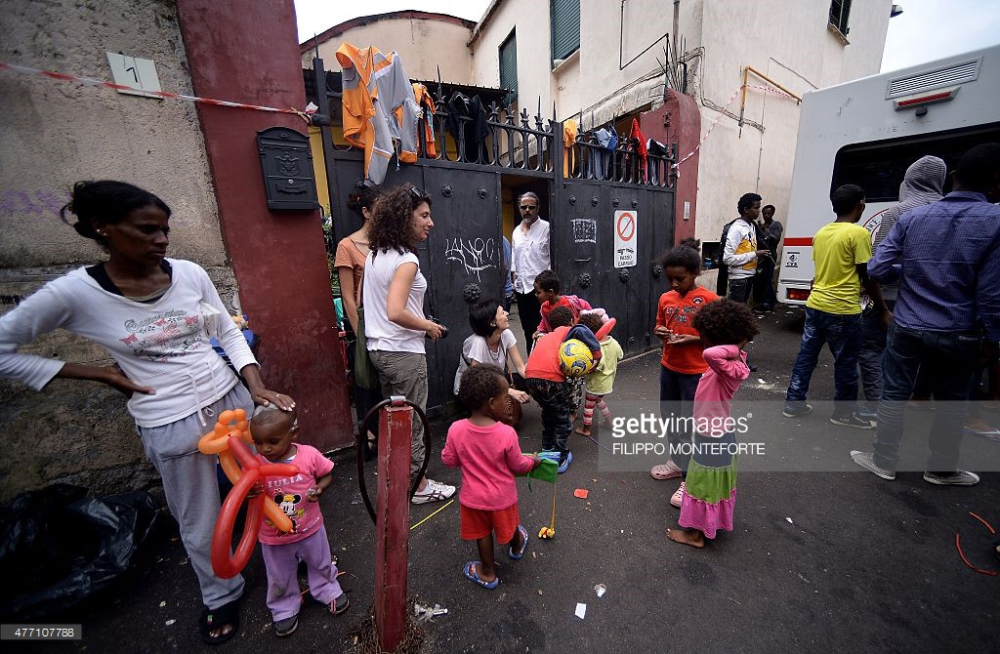
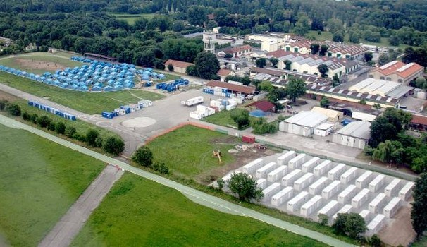

### AYS SPECIAL: The situation in Italy

Photo by Baobab

According to UNHCR, in 2016, the arrivals by sea have been 167,653 \(update on 17th of November 2016\) \. In comparison with the year before, the numbers are increased \(153,842 arrivals by sea in 2015\) \. The principal regions of origin are two: the Horn of Africa and the West Africa\. The main migrant nationalities are: Nigeria \(21%\) and Eritrea \(12%\), followed by Sudan\-Gambia\-Cote d’Ivoire \(7%\) and Guinea Conakry\-Somalia\-Mali\-Senegal \(5–6%\) \. Since the last year, also the Syrians, Afghan and Iraq migrants \(also through the Balkan Route\) have taken an important part of the migration flow to Italy\. The demographic composition of the migrant flow is characterized by a predominant presence of men \(71%\), with a relevant percentage of unaccompanied minors \(around 14%\), and a consistent presence of women \(14%\) and children \(16%\) \.

Comparing the arrivals of the previous year with 2016, it is interesting to analyze the monthly sea arrivals: in relation to the first 6 months of the year, in 2015 more arrivals \(>8000\) have been registered, while in the last part of the year it is possible to notice an opposite tendency\. This year there was a strong increase of arrivals in the month of November and it must be underlined the fact that this last trend was not easy to predict at all: usually is the summer season the one that allows more arrivals from the sea\.

The large majority of the people who arrive in Italy gets identified \( give their fingerprints and have a picture taken\), sometimes with the use of violence as registered from the Amnesty International\), immediately after they have been rescued in the Mediterranean Sea\. This means that the only option for them is to stay in Italy and ask for Asylum protection in this country, or, if they are eligible, take part of the Relocation Programme\. In reality Italy, for many migrants and refugees, it is only a country of transit, and the final destination of the journey are northern countries\. Refugees actually think that giving their details just once won’t make them stuck in Italy so they will do so when they arrive to firm land, in Sicily for example\. Afterwards, when they get to the next centre, somewhere else in Italy they just leave and make their way north\. This strategy seems to work for many people so far as many northern european countries accept asylum applications from people previously registered in Italy\. This means that a big part of these people who arrive in Italy make this route and cross the country with the dream of reaching another European country \(possibly in the North of EU\), but staying in illegal or “invisible” status because of the Dublin System\. A big question for the near future is, how many people will be sent back to Italy on Dublin terms?

Refugees on a dinghy waiting to be rescued

Italy has a relatively long story of immigration \(since 1990\) but the hosting system has been always characterized by an emergence attitude to the migration phenomenon\. This not forward\-looking policy making has brought the Italian hosting system to be fragmented and extremely heterogeneous\. Concerning the “Migration Centers”, there are many different typologies of accommodation: from the big emergency centers called CAS \(Extra\-ordinary accommodation center\) to the small apartments spread all around the national territory\. All of these buildings are open, so the people are allowed to get inside or outside of the building without movement restrictions, but this is possible because the first step of the identification has place in a different type of building: the Hotspots\. In Italy there are many Hotspots: Pozzallo, Porto Empedocle, Trapani, Lampedusa, Taranto and Augusta\. More informations about the conditions and services inside the Hotspots ca be read in an Amnesty International report “Rapporto HotSpot Italia”\.

After the people have been rescued in the Mediterranean sea, and usually identified when they are already on the boat, these are the buildings where they are redistributed\. In each of these hotspots there are accommodations centers that could host more than 2000 persons in total\. After this first step the people is relocated around the national territory in other centers on the base of their eligibility or not eligibility for international protection\. In this second step many migrants, simply start their journey to the North and, as said before, do not apply for international protection in Italy and move from the centers where they have been relocated\.
#### Relocation

Italy, together with Greece, is part of the Relocation Programme as a “sender” country\. It is estimated that between September 2015 and September 2016 over 24000 potential candidates arrived to Italy by sea\. However only 1549 [\[3\]](#_ftn3) applicants have been relocated\. Because of this lack of efficiency and absence of trust in the Relocation Programme, most of the people who are eligible prefer to cross illegally the borders than to apply for the Relocation Programme than risking to wait for more than 7 months and receive a negative answer\.

The people who decide to go to Northern countries illegally must cross all the Italian territory, from South to the Northern borders\. In this case Rome and Milan are the two main cities where all the migrants go to continue their journey and plan the next steps to Swiss or Germany or France\.
#### Milan

Entrance of “The Hub”

Milan is one of the main knots for the migrants routes inside Italy\. Since the 18th of October 2013 more than 107\.000 migrants and refugees have crossed this city\. Milan is attractive for three main reasons: the relative proximity to Swiss/France and Austria, the strong presence of smugglers and the particular hosting system\. Everyday hundreds of migrants come to Milan by bus and train from all around Italy\. One way is the “governmental” channel, so through the relocation from the Hotspots in the other centers, the other way is the spontaneous movement from the other centers\. Regarding the second case, migrants can find accommodation through the national community network \(especially the Eritrean community, that has his core in the “Porta Venezia” Area, or around the Central Station Area\) or the HUB Center, a building close to the Central Station where it is possible to eat, to be sent to another center and find a temporary accommodation, or in the case of all the other centers are full, to be directly hosted there\.

Because of the fact that the borders are closed, the situation in Milan is getting worse: previously, with the borders open, the migration flow was free to come and easily go from Milan\. Now Milan is living a really stressful situation\. The people who just wanted to transit is now stuck in the city, the centers start to be overwhelmed and the beginning of the “Cold Plan” \(an annual policy that is implemented in coincidence with the winter season to give accommodation to homeless people\) express the necessity to open new centers, always in an emergence attitude\. This means that sometimes people have to sleep outside in the streets or that the basic services that should be provided for refugees and asylum seekers are not provided\. At the moment the Local Administration is trying to open new centers to avoid having people sleeping outside in the streets, but sometimes the solutions consist simply in a camping\-bed in empty gyms\.

Concerning the Asylum Seekers in Milan, once that express their will to ask asylum to the police station \( _Questura, Via Montello 6_ \), they receive the first appointment \(so the beginning of the process of their asylum procedure\) around 4/5 months later\. So people have to wait a lot, and after this first appointment it is possible that they have to wait for more than 12 months to have the final decision about their case\. Despite of this situation, many people keeps asking asylum in Milan because of the supposed better opportunities that this city can offer, but in certain case it would be better to apply for asylum in smaller cities so that all the asylum process could be faster\.

Another peculiarity of Milan is the high presence of unaccompanied minors: from Egypt, to Nigeria and Gambia are the main nationalities\. The city has a specific service to manage the minors flow, but at the moment is under the pressure of the non\-stop arrivals: Pronto Intervento SOS Minori should be the service \(together with the minors office in _Via Dogana 2_ \) that should relocate as soon as possible all the unaccompanied minors who ask for asylum in Milan\. This service should guarantee specific types of accommodation and support for minors in a really short range of time \(few days\) \. Despite of that it is known that there are minors who have to wait for more than 2 months to have a positive answer from the service\.
#### Borders

From Milan the people who wants to continue their journey can take three different directions: Ventimiglia, Brennero or Como\-Chiasso\. As already said, the borders are closed with France, Switzerland and Austria\. These three places are the main spots were the people try to illegally cross by train, on foot or by car \(with smugglers\) \. In coincidence with these three places, but also in the previous stations and villages, is evident a strong presence of the police and border police\. The border is not always tangible, as in the case of the Austria’s fences, but “invisible” and “on movement”, due to the fact that the border express its power and movement restrictions through the document checking by the police agents\. These checks are systematic: not only the “suspected” migrants \(people that is classified like this because the color of their skin\) are checked, but also all the volunteers and solidarity citizens\. Once that the police has found enough “illegal migrants”, they send them by bus back to Taranto \(one of the main Migration Centers\) or other Southern centres, to avoid the migrants to cross the border and unload the pressure on borders\. These dynamics only make refugees go around in circules in the country as many come back to the border when they arrive to the centres\. Also the solidarity side is under challenge: specially in Ventimiglia is taking place a strong criminalization of volunteer work by the local Administration, for example avoiding the people to give free food in the streets or support migrants with basic needs distribution or demonstrations\. Right now the informal camps are forbidden and have been evicted\. The government, through the direct participation of the Red Cross in Ventimiglia and Como, is managing temporary camps \(tents\-camp or container camps\) that should absorb the pressure on the border and stuck the people\.
#### Roma

Refugees outside Tiburtina station in Rome

Another fundamental knot of the journey within Italy is Rome\. In the Capital of Italy it is not present an “Hub” system like in Milan, where the relocation of the people is managed in a central way and try to coordinate different governmental and non\-governmental services all around the local area\. This it means that all the people that do not ask for Asylum in Italy, the so called “transitanti”, do not have any accommodation \(while in Milan this service is provided from the HUB itself for example\) and have to sleep in tents in the streets\. Once the accommodation service was provided in Via Capua by Baobab, a place that have been evicted 4 times \(the most recent one on the beginning of November 2016\) \. The Local Administration has recently affirmed that an HUB\-system, inspired by the Milan one, will be implement in Rome too, but these are only promises for the moment\. In the meanwhile the volunteers of Baobab Experience and Medu have set up a tent\-camp behind Tiburtina Station\.
#### Last Update

The situation in Italy has also being followed recently by a new group called [Progetto20k](https://www.facebook.com/progetto20k/?fref=ts) which shares information throughout the country providing updates of some of the most important spots\.

The most recent informations that we get from Ventimiglia say that the situation remains precarious\. There is still no news of a migrant lost in Roja River last week, while the flow of migrants shows no signs of stopping\. Saturday, 3 December is expected to “Ventimiglia Parade // Human and Solidarity”: a performative parade, artistic, colorful and inclusive\.

Also about France, in Roya where on the 23th November was held in Nice on trial Cedric and Pierre\-Alain\. Outside the court gathered more than 200 people in the garrison, and in the end the process of both has been postponed to early January\. They are accused of “aiding illegal residence or transit” for having helped some migrants in difficulty\.

You can see a video about this story here\.

At Bresso, a small town north of Milan where there’s a refugee camp, after the events last Thursday , migrants do not intend to stop their claims\. two days ago a rally was held by about one hundred people\. “Each Your problem is my problem”\.

Bresso refugee camp

In Milan, around the metropolitan area it’s being launched a new partnership of security with youngsters from Arabic countries, China or Latin countries\. They are supposed to become interns pairing up with the local police and some 150 agents have been called to patrol the streets in suburbs and in sensitive areas\.

At Como, a border town with Switzerland which has an accommodation centre, on the November 24th they had 400 presences, in a field designed to accommodate up to 380 people\. A large part of them are minors\. The Prefecture has opened an area to be able to provide at least an additional 100 beds\. As usual, the Northern League try fanning the xenophobia wind to gain momentum in the territory\.

From Turin comes an alternative story to the ones published in the media on November 23th\. Around 11 pm, about twenty hooded and armed with sticks attacked the former Moi Occupied Refugees, where about 1300 refugee live in buildings built for athletes for the 2006 Olympic games, throwing paper bombs\. At that point, many of the migrants within the building had gone out to defend themselves and noted that those responsible had already fled, without the police team nearby intervened\. The next day the mainstream media published that the riots were started by the migrants themselves\.

At Saronno, another town next to the border with Switzerland, a [protest](https://www.facebook.com/events/1213975371993535/) will be held on the 16th of December a 3 day protest against the border closing\.

Finally, at the Italian capital, Rome there’s still no solution for migrants in transit\. The solidarity of [Baobab Experience](https://www.facebook.com/BaobabExperience/) launched the emergency cold and those who want to help out can find their contact and directions on how to organize the collection here\.

Data collected from UNHCR and Rapporto “Hotspot Italia”

Special thanks to Ilaria Bertè for the report about the overall situation\.

João Pequeno

_Converted [Medium Post](https://medium.com/are-you-syrious/ays-special-the-situation-in-italy-2d2fd1290add) by [ZMediumToMarkdown](https://github.com/ZhgChgLi/ZMediumToMarkdown)._
