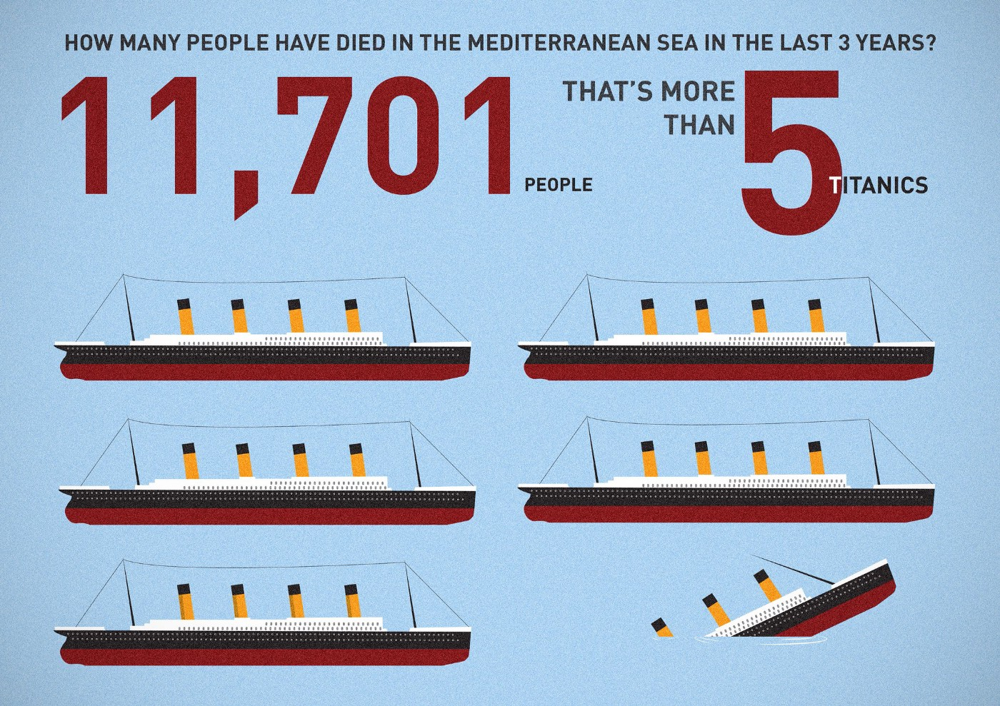
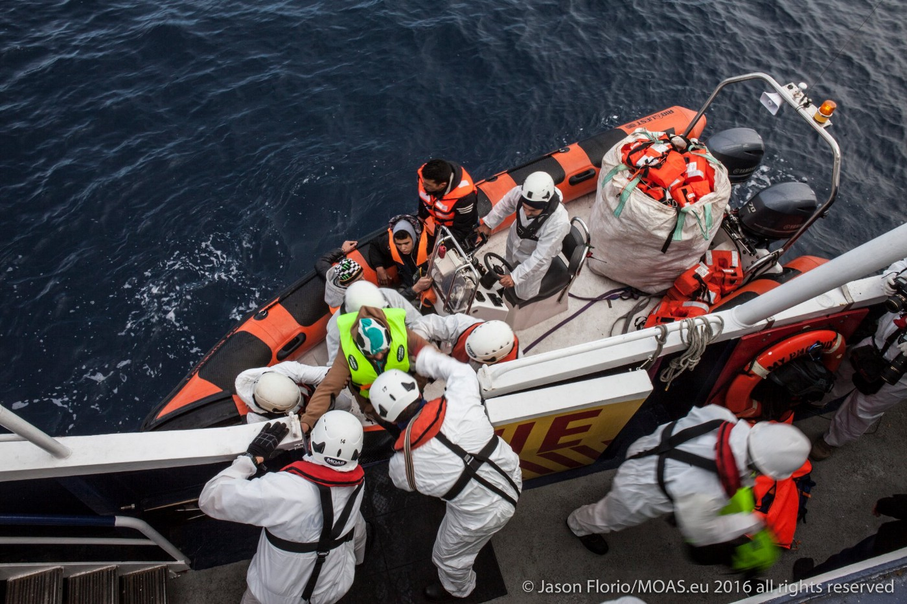
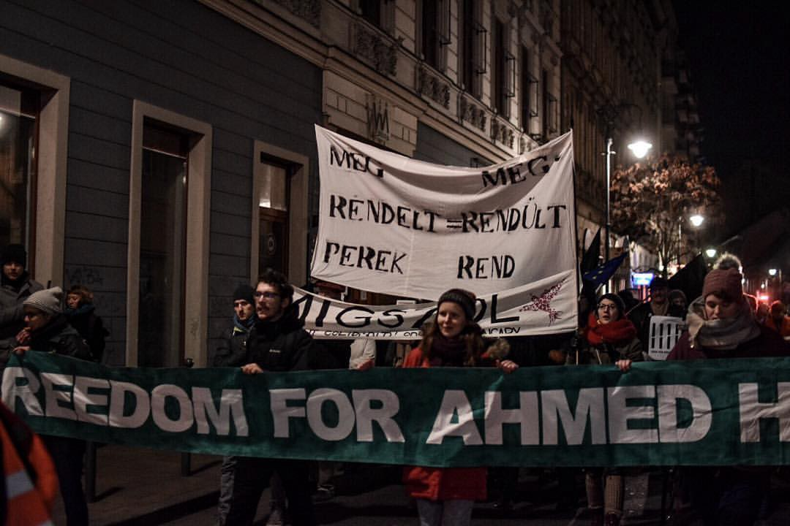
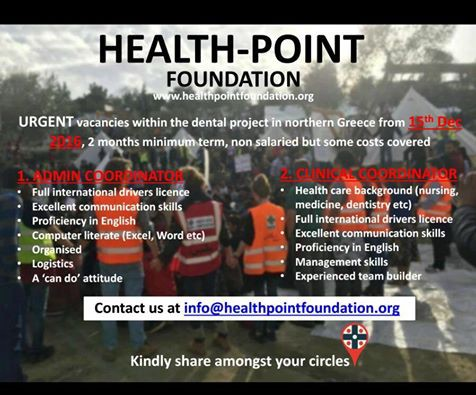

### AYS DAILY DIGEST 3/12/2016: Two refugees froze to death in Austria

_Another devastating day in Europe: people froze to death, die in the sea while trying to cross, deprived of freedom of movement, deprived of freedom and basic human rights\. All this in Europe millions are dreaming about_

According to the MSF, 2016 was the deadliest year in the sea for people who are trying to cross and come to Europe\.
### FEATURE STORY

This insane policy of close border is taking more people’s life every day in Europe\. Devastating news today are coming from Austria: two refugees, a man, and a woman have been run over by truck that was leaving a wagon train\. It happened at the station of Wörgl, Tirol, near the city of Innsbruck\. Police assumed, that they froze to death before\.

Another refugee, man, has been injured and transported in serious condition to the University Clinic in Innsbruck\.

None of the refugees had any documents with them\.

The train started in Verona and crossed the Brenner, which is 1\.400 high\. It was freezing cold there last night\. This route is the fastest way from Italy to Germany for many refugees\.

Authorities are investigating what exactly happened\. According to the first available info, the three were hiding on a car carrying truck and were crushed during the unloading of lorries\.

A few days ago, an Eritrean boy of 17 years died in the Bolzano station, overwhelmed in trying to board a freight train in Austria\.
### Sea

Aquarius, [Doctors Without Borders](https://medium.com/u/893ddca64e30) and [SOS Mediterranian France](http://www.sosmediterranee.fr) boats rescued 143 people from a rubber boat on Saturday\. Many people were saved from the water\. MSF doctors treated several cases of hypothermia\. So far this year, MSF teams have rescued 19\.708 people\.

In the past three years, 11\.701 people have died in the Mediterranean\. Only this year, at least 4\.690 men, women, and children have died while trying to reach Europe by the sea from Africa and Turkey, which is almost 1\.000 more than last year\. **MSF claims 2016 is the deadliest year so far\.**

> “Despite the shocking figures and the immense loss of life, the European response in the Central Mediterranean continues to focus on deterrence measures rather than on saving lives,” the MSF said\. 

Out of total number of arrivals to Italy, 16 percent are kids, 88 percent are unaccompanied\. The youngest unaccompanied kid MSF team met this year was 8 years old\.

[See our special report on situation in Italy](https://medium.com/@AreYouSyrious/ays-special-the-situation-in-italy-2d2fd1290add#.bzn6doep0) \.

Last night, boat Phoenix by [MOAS team](https://www.moas.eu) rescued a small wooden boat carrying 44 people, including 3 children\. Last night, around 130 people landed in Cagliari and on Sulcis’s coasts\.

Spanish authorities reported rescue of 92 persons traveling in five makeshift boats\. Among those rescued were 63 people from sub\-Saharan Africa, officials said without specifying their nationalities, and 29 Algerians\.

Most of the people were taken to the port of Malaga, southern Spain\.

The group included three women and a child as well as a boy who had to be hospitalized after suffering from hypothermia\.
### Greece

The issue of unaccompanied children among refugees remains the unresolved issue all over Europe, as well as in Greece\. [Local media are reporting](http://www.ekathimerini.com/214269/article/ekathimerini/news/migrant-children-await-hostel-spots) that more than 1\.200 children are now on waiting lists to be relocated to one of the country’s special hostels for vulnerable children\. Government sources are estimating that around 2\.500 unaccompanied minors are among over 62\.000 refugees in this country\.
### Useful info for refugee from The Mobile Info Team

**_How do you get the birth certificate_**

If you give birth while in Greece you must provide your newborn baby with a birth certificate\. Generally, it is advisable to get help from an organization or volunteers in your camp with that\. More info about this and other important issues for refugees in Greece could be found at t [he Mobil Info Team FB page](https://www.facebook.com/mobileinfoteam/posts/1878796765682377:0) \.
#### ADVANCE WARNING FOR TUESDAY, DECEMBER 6TH

This date is an anniversary of the police shooting of a teenager in December of 2008\. It resulted in two weeks of rioting in Exarcheia, Athens\. We received many warning about possible protest even this year\. Volunteer and refugees, please be alert\. Volunteers put together [the manual how to act if in dangerous situation](http://bit.ly/FIRSTAIDBASICS) , with the numbers to call for help\.

Due to the possibility of unrests, the [Khora community center](https://www.facebook.com/KhoraAthens/?hc_ref=SEARCH&fref=nf) will be closed on this day\. They will be giving food for Monday and Tuesday during Monday’s lunch service\.
#### Services provided to LGBT refugees

One of the most vulnerable groups among the refugees is the LGBT community\. In the camps, they are often victims of discrimination, harassment or abuse but until now very little has being done to protect them and to provide them support\.

If you know cases of LGBT people who need support, please send an email to the following address: [lgbtrefugeegr@gmail\.com](mailto:lgbtrefugeegr@gmail.com)

> Here is a list of services provided to the LGBT refugees and LGBT friendly places\. If you are aware of other services or LGBT friendly places, please COMPLETE this list\. 

_SolidarityNow_ : launched a program to provide housing to a very small number of extremely vulnerable asylum seekers\.
Address: Domokou 2, opposite Larissis train station 
Email: [contact@solidaritynow\.org](mailto:contact@solidaritynow.org) 
Phone: 210 6772500

[_Colour Youth_](https://www.facebook.com/groups/colouryouth/?fref=ts) : provides legal support to LGBT refugees\. Most importantly, a lawyer from Colour Youth can be present during the asylum interview, which indirectly certifies the refugee’s gender identity\. 
Phone: 6945583395 
Email: [info@colouryouth\.gr](mailto:info@colouryouth.gr)

[_ΣΥΔ \(Transgender Association\):_](https://www.facebook.com/groups/1479111452303717/?fref=ts) it provides legal support and asylum casework mainly to transgender refugees\. A lawyer from ΣΥΔ can be present during the asylum interview\.
Address: Syggrou 29, 1st floor, Athens, 11743
Phone: 6944820441
Email: [transgender\.support\.association@gmail\.com](mailto:transgender.support.association@gmail.com)

[_LGBTQI refugees in Greece:_](https://www.facebook.com/lgbtqirefugeesingreece/?fref=ts) is a self\-organized solidarity team created by Suma Rafi, a transgender refugee herself\. It’s a point of reference for the LGBT refugee community, it financially supports the most vulnerable refugees and regularly organizes events where they can socialize in a secure and fun environment\. The initiative is supported by Notara 26, Femin@tre, LOA and NoBorders
Email: [lgbtqi\.refugees\.gr@gmail\.com](mailto:lgbtqi.refugees.gr@gmail.com)

**_LGBT friendly places:_** 
_AthensCheckpoint:_ offers free and anonymous HIV, HBV HCV testing\. 
Address: Pittaki 4, Athens, 10554 \(Near Monastiraki Metro station\)
Phone: 210 3310400

_ThessCheckpoint: o_ ffers free and anonymous HIV, HBV HCV testing\.
Address: Al\. Svolou 15, Thessaloniki
Phone 2310 282284

_Day Centre Babel_ : Provides psychological support and is particularly sensible to LGBT issues\.
Address: Ioanni Drosopoulou 72, 112 57 Athens
Phone: 210 8616280
Greek Helsinki Monitor: provides legal support to victims of hate crime\. 
Phone: 210 3472259
Email: [office@greekhelsinki\.gr](mailto:office@greekhelsinki.gr)

_Greek Council for Refugees:_ provides legal support and is particularly sensible to LGBT issues\. 
Phone: 210 3800990
Email: [gcr1@gcr\.gr](mailto:gcr1@gcr.gr) 
25 Solomou Str\., 10682, Athens

[_Piraeus Open School for Immigrants:_](https://www.facebook.com/groups/52023118964/?fref=ts) Since 2005 it offers a large variety of courses to immigrants and refugees in a safe and friendly place that LGBT refugees can access and treated with respect\. They offer language courses in greek, English, german, French, Spanish, Arabic, Urdu as well as history and culture, photography, theater studies and computer courses\. 
Ag\. Anargiron ke Ko
Pireas 185 42
Phone: 210 4200917
Ε\-mail: [asmpir@gmail\.com](mailto:asmpir@gmail.com)

[_Notara 26 Squat:_](https://www.facebook.com/Κατάληψη-Στέγης-ΠροσφύγωνΜετανασ…/…) Is one of the few LGBT\-friendly squats\. It provides support to the LGBT refugees with food, clothing, and accommodation\. 
Address: Navarchou Notara, 106 83, Athens
Phone: 695 531 0674
Email: [notara26@riseup\.net](mailto:notara26@riseup.net)

[_Zaatar:_](https://www.facebook.com/zaatarngo/?fref=ts) Runs an LGBT\-friendly shelter\. It offers English, french and german language classes\. 
Phone: 694 724 4608
Email: [contact@zaatarngo\.org](mailto:contact@zaatarngo.org)

[_Khora community cente_](https://www.facebook.com/KhoraAthens/?fref=ts) _r_ is a safe and friendly place that LGBTQs can access; most importantly it has a no tolerance policy for any kind of bullying or intimidation\. Open Monday to Saturday from 9:30am to 7pm\. There is a community kitchen for refugees to have a meal, and it provides support with sanitation and language skills\.
Address: Asklipiou 80, 114 71,Athens
Email: [khora\.athens@gmail\.com](mailto:khora.athens@gmail.com)
### Bulgaria

Out of 160 million euros, EU relocated to Bulgaria for refugees, around 80 per cent will be spent on border protection and security\.Other 20 percent will go on improving capacities in asylum centers\. Apparently, 50\.000 euros will be spent to repair the damage caused during clashes in Harmanli center on 24 November\. Part of the center will be turned into the closed facility, while the center in Pastrogor, near the border with Turkey, will be fully transformed into a closed facility\. That will cost around 1\.1 million euros\. Bulgaria’s outgoing Interior Ministry Rumyana Bachvarova has said authorities are preparing to restrict the movement of migrants within Bulgaria’s territory\. [Authorities plan to set up parameter within refugees in Bulgaria will be able to move](http://www.novinite.com/articles/177784/Bulgaria+to+Curb+Movement+of+Migrants#sthash.AO3jSJbj.dpuf) \.

Additionally, Bulgarian government will invest money EU tax payers are giving them to increase security measures in the camps because, as they said, “the moment a center becomes closed, it generates aggression\.” So far, nobody in EU objected these plans or said anything about violence used by Bulgarian authorities during unrests in Harmanli, or everything that happens after\.

Plan about increase security measures and limits on freedom of movement for refugees in Bulgaria were announced this summer when the government approved measures that pave the way for the introduction of a restricted movement regime\.
### Serbia

> Good, news from Serbia\. Kelebija Community Center will reopen on Sunday\. 
 

>  
 

> “We are having to reorganize our services at the moment, so we are limited to charging, wifi, and respite in heated tents, but in this terrible weather, it’s better than nothing\!” 

[Earlier this week we reported](https://medium.com/@AreYouSyrious/ays-daily-digest-01-12-the-strongest-have-been-broken-5c60b1d610dc#.8tzvsmr8o) on attempts by the Serbian authorities to crack down on some spots they deem obnoxious, and the first victim was this community center\.
### Hungary

Hundreds of people protested today in Budapest against Ahmed H\. conviction and for freedom of Roszke 11\.

Photo **by** Balazs Turay

Ahmed H\. from Syria has been jailed for 10 years on terrorism charges in a case that has become a cornerstone of the country’s crackdown on refugees, as [we reported earlier this week](https://medium.com/@AreYouSyrious/ays-digest-30-11-winter-arrives-in-force-to-greece-bb9f750b8e99#.fq5jspqbl) \. Ahmed was arrested on the Hungarian\-Serbian border in September 2015 and accused of orchestrating clashes between refugees and police\.
### Italy

In Pordenone, northeast Italy in the Friuli\-Venezia Giulia region, around ten people are living outside in the cold weather, sleeping in blankets, wrapped in coats and fed by few volunteers and private citizens\. The area where they sleep, a parking lot, is known to local as the Bronx\. They are asylum seeker who obtained their status, but they do not know how to find a house and a job\.

Volunteers from Rete Solidale are taking care of them, bringing blankets, clothes, shoes, food\.

> “The number of people sleeping in Bronx parking lot swings widely, they are not bound to the territory, usually between 3 and 10 people\. They could be helped by finding a house, but they are residents abroad, and this drives us mad: it would be really easy to find a solution to shelter them,” [Rete Solidale told the media\.](http://react-text: 205 http://messaggeroveneto.gelocal.it/.../notti-al-gelo-l...) 

### Germany

Despite protests and news about more atrocities and instability, the German government is determined to deport people back to Afghanistan\. [New deportations are planned for December\.](http://www.spiegel.de/politik/ausland/bundesregierung-bereitet-sammel-abschiebung-von-afghanen-vor-a-1124211.html)

In October this year, Germany signed an agreement with Afghanistan about deportations\. Number of NGOs protested claiming that Afghanistan is not a safe country, but it did not change the plan\.

Even more, the government announced the plan to set up a camp in Tunisia, close to the Libyan border, so refugees who are saved crossing the Mediterranean will be brought there\. From this place, they should be able to apply for asylum in Germany or other EU countries\. This is their plan to reduce the number of people trying to cross the Sea\.
### HELP IF YOU CAN
#### A Drop in the Ocean

Volunteers needed in northern Greece from January 1\. If you are available, over 25, and can stay more at least 10 days get in touch 
Contact: [siv@drapenihavet\.no](mailto:siv@drapenihavet.no)
#### United Rescue Aid

The team works with sea rescue and people stranded in dangerous situations\. If you would like to be part of our their team, you can do that also from your home\. You just need a smartphone\.

> “We are always looking for new members eager to learn and help make the world a little better every day\.” 

[Apply using this following link](http://unitedrescues.eu/become-a-volunteer/) \.
#### [SIRIUS\.HELP](https://www.facebook.com/sirius.help/videos/384057715267786/)

These tents are the home of dozens of refugee children at the Serbian/Hungarian border\. The SIRIUS\.HELP team tries to make conditions more livable for children and their parents\.

_“The past few nights have been at sub\-zero temperatures around Izmir\. It’s frigging cold\. We keep meeting more and more new arrivals who have next to nothing\. Over the past 2 weeks, we’ve met and documented another 500 people who just arrived from Syria\. Heard stories of long, tiring journeys, little belongings left to people’s names\. Now, essentials needed to keep warm get borrowed\. We wanted to address heating needs as part of the winterizing project\. And with the sharp drop in temperatures, we also wanted to act fast\. With around 500 families in total and roughly 3,000 people documented, we asked where heating was needed\. Close to 200 families, 1,000 people, urgently needed heating\._

_So rather than giving heaters as a handout, we subsidized and asked for £5 contributions, so the deal was roughly “half/half”\. This was a good idea, people thought\. And it allowed us to help 50% more people off the initial investment, by reinvesting the £5 contributions back into buying more subsidized heaters\. Over the last week, we delivered what was asked 200 heaters\.”_

To support the work they are doing [visit their site](https://mydonate.bt.com/events/tribeturkeyshelter) \.
#### Health\-Point Foundation Dental/Medical Relief

[HPF urgently needs your help](https://www.facebook.com/healthpointfoundation/) to fill two ground staff vacancies\. Get in touch with them if you’d like to find out more or to help\.

_Converted [Medium Post](https://areyousyrious.medium.com/ays-daily-digest-3-12-2016-two-refugees-froze-to-death-in-austria-71e3d67edc9) by [ZMediumToMarkdown](https://github.com/ZhgChgLi/ZMediumToMarkdown)._
