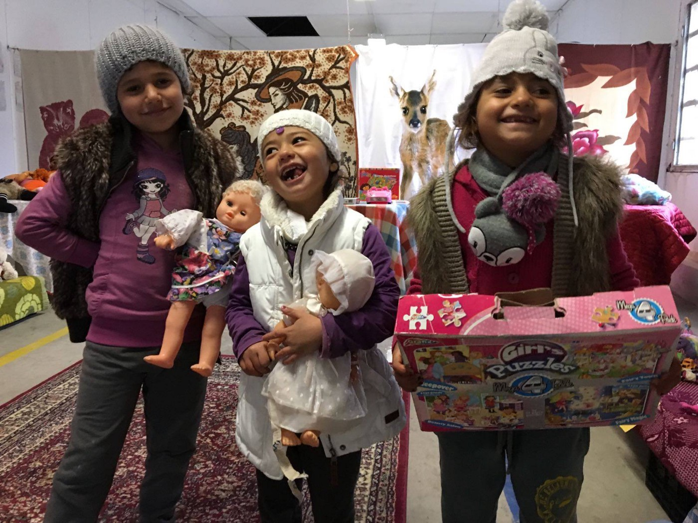
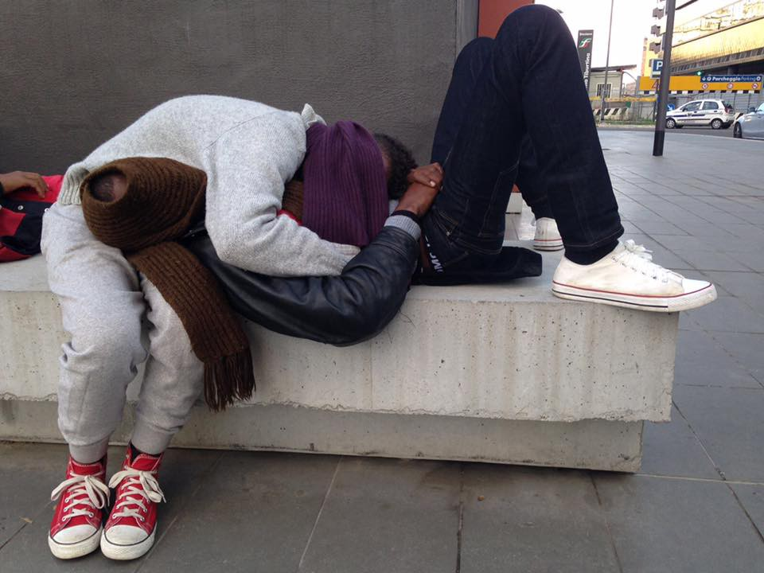

### AYS DAILY DIGEST 05/12/2017: Volunteers are being prosecuted all over Europe

_Volunteers from Spain and Germany arrested for helping people in need // List of spots in Athens where volunteers are providing food and clothes // New camp in Paris is growing with dozens of new tents daily // Sweden is calling people to come, while at the same time finding ways to deport recent arrivals // List of calls for help from all over Europe_

Photo by Refugee Support Greece

December 5 is International Volunteer Day\. Is there anything better for a volunteer on such a day than to be able to make kids smile? This is what volunteers from [Refugee Support Greece](https://www.facebook.com/RefugeeSupportGreece/) have done today \(as well as so many other days in the past, and just as the group will continue to do in the future\) by giving toys to 33 kids in Filipiada camp\. Refugee Support Greece also announced that everything is ready for Children’s Clothes Week\.

We live in the world in which millions of people are forced to leave their homes, fleeing war and persecution, and dreaming about the possibility of a better life\. Volunteers who are standing in solidarity with fellow human beings, opening their hearts and doors for all people, are creating a parallel system alongside the existing one\. This new system is based on solidarity and empathy, and aims to fight hate and prejudices\.

We can all join and try to bring about the change that we need so much\. You can help in different ways\. Sometimes all it takes is a smile, holding someone’s hand, or just being a friend when one is needed\. Other times it takes much more\. But it is always rewarding\.

Unfortunately, those with the power, instead of showing compassion, are arresting volunteers around Europe\. We have received news of arrests in both Germany and Spain of people who were trying to help refugees\. In both cases, the volunteers concerned may be facing smuggling charges\. The activist from Spain, who is facing 5 years in prison for helping a family in Greece, stated that she didn’t act for financial reasons but out of solidarity and political motives\. Both volunteers have a history of volunteerism with refugees in Europe and are associated with volunteer organizations\.

The [Migreurop](http://www.migreurop.org/?lang=en) group created a map of all the places where refugees are being accommodated across Europe\.

> “Using the pretext of ‘massive’ arrivals, the EU and neighboring states have constantly reinforced their detention systems: from 2011 to 2016, the total known capacity of camps identified by the Migreurop has gone from 32,000 to 47,000 places\.” 

### Syria

Aleppo remains under heavy fire\. Today, 32 civilians were killed and 115 injured\. We could not find even one story in the international media saying that somebody talked about peace in Syria today\.

](assets/c1b60317fd56/1*iUPS2A_JZpigxAY55rRpqw.jpeg)

By [NOIRE](https://www.facebook.com/STENCIL.NOIRE/)
### Greece

Because war continues to rage, people are still being forced to leave their countries\. Today, 74 new arrivals were officially registered in Greece\.

Even though many people have been moved from camps to hotels, flats and other accommodation, too many remain in camps that are essentially uninhabitable\. It is too cold and windy, there is no hot water, and the food they are receiving is not nutritious\. One of these places is camp Kavala\. Ali Borsan, one of the residents, posted calls for help on Twitter explaining that only 69 people are still in the camp, in other words, around 15 families, and that they are begging to be moved to some place where they can at least be warm\. He also stated that people in the camp have run out of money and cannot even buy food or other basic necessities\. Even if they did have money, buying food would still be next to impossible because the nearest shop is in a village 60km away\. As Ali told us, people in the camp were told that they could be moved to a small hotel near the border with Bulgaria, high up in the mountains, but they are afraid that would mean more isolation and an even colder winter\.

Volunteers and different organizations in Athens have drafted a list of sites where free clothes, food, and other items can be picked up\. Many of the locations can be found on maps [in this folder,](https://drive.google.com/…/fol…/0B5eHzYChsokiVTNmdm5VUEx6c00) available in different languages\.

**Here is the list:**

[BRIDGES HUMANITARIAN INITIATIVE](http://www.bridges.org.gr/index.php/en/) Vilara 2, 10437 Athens
Tel: 699 514 4160
Monday to Thursday 09:00 to 17:00 
Clothing, food pack distribution \(temporarily suspended\), access to Skype, legal information about accessing the asylum system, integration support\.

[CARITAS](https://www.facebook.com/CaritasHellas) Kapodistriou Street 52
Tel: 210 524 6637
Hot Food Services — 10:30 to 13:00 \(Monday to Friday\)
Showers and Toilets — 10:00 to 14:00 \(Monday to Friday\)
Clothes — Monday morning for women and children; Wednesday morning for men

[HELPING HANDS](https://www.facebook.com/Helping-Hands-Athens-Refugee-Mini…/) Sofokleous 53
Tel: 210 322 4216
Operating Hours: 09:00–14:00 \(Tuesday to Friday\) 
Free meals and showers
Coupons for free meals are provided every Friday

[KHORA](https://www.facebook.com/KhoraAthens/) Tsimiski 21 / Asklipiou 80
Open Daily \(except Sunday\)
Lunch is served daily \(restaurant style\) 
Clothes and other limited items are available in their free shop

MISSIONARIES OF CHARITY Ithakis 97
Tel: 210 825 4770
Daily operating Hours: 09:00–14:00 and 16:30–19:00

OMONIA CHURCH Pireos 28, 1st floor, Omonia
Tel: 694 501 4385
Tuesdays and Thursday: 11:00–17:00
Lunch is provided and clothes distributed through Samaritans Purse
Legal support provided by Advocates Abroad 
Occasional children’s activities and art workshops
Sunday: Lunch fellowship meal provided

[SALVATION ARMY](https://www.facebook.com/TSAVSDC/) Aristotelous St\. 99
Tel: 211 411 2357
Clothing and hygiene products
Daily operating hours: 10:00–18:00

SAMARIA, Leonidou 20, 10436 Athens
Food served on Tuesdays and Wednesdays at 16:00
Meal for homeless Greek people: every Monday

In Athens there is an active branch of the [AMURTEL organization](http://greece.amurtel.org) \(Ananda Marga Universal Relief Team Ladies\), an NGO that assists pregnant women\. The group provides antenatal and postnatal care, helps new mothers feed their young children, and provides safe spaces for mothers to spend time with their children and rest\.

To get help from AMURTEL:
 • Visit the Day Center: Aristotelous street 98, Athens \(Victoria Square\)
 • Call for information: \+30 211 184 8436

You can also find them on [Facebook](https://www.facebook.com/AmurtelHellasforRefugeeMothersandBabies/) \.

Finally, camp Mazaraki, Cherso, is almost empty\. This ugly place — where, this past summer, more than 2,000 people were living in tents, with no shade, far away from any large city, surrounded by snakes and other wild animals — is to be closed by the end of this week\.

We published several calls for help from Mazaraki this fall and winter\. Today, the volunteers from the [Open Cultural Center](https://www.facebook.com/OpenCulturalCenter/) , the only bright spot of the camp, said goodbye to a big group of people who have been moved to hotels and accommodation in nearby Kilkis\. By the end of this week the remaining 150 people should be moved to the city of Lamia, central Greece\.

The last 8 months were like hell for many of the people in the camp and we are happy that they have finally moved to a better place\. However, they are still not able to continue their journeys or have their asylum applications approved; they have to wait for a couple more months for that\. We wish our friends from this camp good luck\.

### Serbia

Despite the cold winter, people are still on the move throughout the Balkans\. Today in Miksaliste there were 53 men, 38 women and 307 kids who needed help\. In Belgrade, there are around 1,000 people sleeping out in the cold\. They share 3 showers between them and must wait in line for hours to have a chance to wash\.

According to UNHCR data, currently there are around 6,400 refugees, asylum\-seekers, and migrants in Serbia\. The vast majority, over 5,300 people, are accommodated in thirteen government\-run facilities\. Others live in the streets and in improvised shelters, mostly in Belgrade and near the border with Hungary\. All of the existing centers are overcrowded\. Newcomers are directed toward the Reception Centre of Presevo and Dimitrovgrad\.

In November, 1,503 people expressed their intention to seek asylum in this country\. Among them are people from Afghanistan, Iraq, Syria, Pakistan, and Iran\.
### Italy

According to the Italian coastguard, more than 1,000 people were saved from overcrowded boats in the last two days\. Sixteen bodies were also recovered\. On Sunday, coastguard ships rescued some 800 people from nine different vessels; on Monday, they coordinated the rescue of another boat with 230 people on board\.

According to official numbers, from 28 November to 4 December 592 people were stopped at the Swiss Border while trying to cross\. These numbers represent a slight decrease compared to the first few weeks of November\.

Once they arrive, many people are forced to sleep on the streets\. Volunteers from [Baobab](https://www.facebook.com/BaobabExperience/) report that a group of young people who reached Rome last night, aged 18 and 25, had to sleep on the pavement near the train station, an area which is already full of people\. Volunteers offered food, help and other necessities\.

By Baobab

Volunteers and activists from Baobab are calling on everyone to join them for massive protests on 17 December in Rome\. The protests will demand that all people be protected, as international human rights conventions and international law require\.
### France

](assets/c1b60317fd56/1*t5dXTD500SttQYCK4oHwyA.jpeg)

Photo [Rastplatz](https://www.facebook.com/rastplatz/photos/pb.134599573554179.-2207520000.1480977632./381452105535590/?type=3&theater)

More people are in France and on the streets of Paris, too\. The newly formed self\-established camp St Denise, according to volunteers from [Rastplatz](https://www.facebook.com/rastplatz/) , is attracting more and more people with dozens of new tents springing up every day\.

Authorities in Paris are appealing to people’s good will by planning a huge sale of the love locks that were removed from bridges around the city last year\.

Bruno Julliard, the environment chief at Paris City Hall, has announced that [ten tons worth of the locks would be sold off](http://www.thelocal.fr/20161205/could-these-old-paris-love-locks-raise-100000-for-refugees) to anyone hoping to take a piece of modern Paris history with them\. _“Members of the public can buy five or ten locks, or even clusters of them, all at an affordable price,”_ he told journalists last week\. _“All of the proceeds will be given to to those who work in support and in solidarity with the refugees in Paris\.”_ 
 
He said that the sales could bring in up to €100,000\.
### Denmark

Semi\-good news from Denmark\. Some 350 asylum seekers were told that the Danish Immigration Service \(Udlændingestyrelsen — DIS\) would not be sending them back to Hungary as was previously suggested\. This news was reported by the newspaper [Politiken](http://politiken.dk/indland/politik/ECE3496662/regeringen-dropper-nu-at-sende-asylansoegere-retur-til-ungarn/) \.

People had been threatened that they would be sent back to Hungary as it was the first EU country that registered them\. This decision was overturned after reports about inhumane conditions for refugees in Hungary came out, but DIS did not confirm that this is what influenced the change\. Instead, the media were told that the deadline has been moved\.
### Sweden

The Swedish Employment Office foresees that Sweden will be in huge need of immigration in order to avoid shortages in the labor force in the future\. [According to Mikael Sjöberg, head of the Employment Office](http://www.svt.se/nyheter/inrikes/arbetsformedlingen-sverige-behover-stor-invandring-for-att-undvika-arbetskraftsbrist) , Sweden needs an estimated 64,000 people aged 16–64 to immigrate every year\. The birth rate is too low to sustain growth, he claims\. People with high levels of education are especially needed, as well as chefs, bus and train drivers and other skilled professionals\.

Last year, 162,000 people claimed asylum in Sweden and 29,000 are expected to do so before the end of 2016\.

Yet, this has not made Sweden withdraw plans to return people to Afghanistan, a country that is still extremely unsafe\. The government has demanded a “clear and authoritative statement” from Afghanistan that the agreement previously signed between the two countries can be implemented\. If that happens, several thousands of people could be sent back\.

In October, applications from over 800 Afghans were rejected and 36,000 people are still waiting to get their asylum cases reviewed\.

At the same time, [local media are very critical about expulsions of people](http://react-text%3a%20154%20http%3a//sverigesradio.se/sida/avsnitt/813551?programid=1300) saying that there is an overall problem with a lack of transparency\. 
The media are reporting about a place called Förvaret in the suburb Märsta, outside of Stockholm\. This place is for people whose asylum applications in Sweden have been rejected\. The media claim that 200–400 people are returned to their countries of origin from Sweden every week\. Last week 203 people were expelled from Sweden, with 157 leaving by choice and 46 being forced to leave\.

Afghans that are expelled from Sweden can apply for economic assistance on leaving the country\. However, as an Afghan boy remarked in a radio program on this topic: _”I didn’t come to Sweden for money, but to survive\. I’m not interested in that money\.”_
### HELP IF YOU CAN

If you want to volunteer in Greece, everything you need to know can be found [here](http://greecevol.info/task.list.php?ID=289) \. Below is an abbreviated list of some of the organizations that need volunteers and donations:

**Refugee Community Kitchen in Dunkirk needs volunteers**

> “The general feeling in the UK and in media is that Calais is now closed as the jungle is gone\. THIS IS NOT SO……\. We are open every day 7 days a week\! The Kitchen, Warehouse and Woodyard open at 9am and work solidly till 6pm every day\!” 

[See what they do](https://www.facebook.com/groups/RefugeeCommunityKitchen/permalink/1244503938950440/) and join them if you can\.

For more information, email them at [refugeecommunitykitchen@gmail\.com](mailto:refugeecommunitykitchen@gmail.com) \.

**Chios Eastern Shore Response team \(CESRT\) needs volunteers**

> “It has been another difficult week here on Chios, with strong winds and rain making life very hard for people in Souda\. So it is wonderful to also have some good news to share\. CESRT are delighted that in the next couple of weeks we will be opening the “Parent and Toddler House\.” 

CESRT wants to develop services for parents and young children and will be providing a safe, structured, space for children to be children and for parents to develop their parenting skills with support and encouragement from suitably trained volunteers\. There will also be facilities for bathing and washing babies which has been a real challenge for the residents of Souda\.

They are going to be recruiting volunteers who have appropriate experience and police checks\.

Regular updates to follow\. In the meantime, [see what they do](https://www.facebook.com/groups/421759534684819/) and if you would like to donate, see [here](https://www.youcaring.com/chios-east-shore-rescue-team-517584) \.

**Refugee Volunteers of Izmir \(ReVi\) needs additional volunteers to help them help others**

> “The language barrier is probably one of the most difficult issues when trying to access health care in Turkey\. When we visit a family with some health issues, we do different things depending on the situation\. If we’re not able to provide any translation assistance or the case isn’t very urgent, we refer them to WAHA or Worldwide Doctors\. They can do basic assessment and assistance with translation services and set up appointments with local Turkish hospitals\. If you speak Turkish and are able to go to the hospital every now and then for translation services, please get in touch with Montaser Ahmar\. Most of the time, we refer these cases to other groups, but it’s good to be able to do it ourselves if we need to\.” 

See their Facebook page [here](https://www.facebook.com/groups/reviizmir/permalink/1174551279319358/) \.

_Converted [Medium Post](https://areyousyrious.medium.com/ays-daily-digest-05-12-2017-volunteers-are-being-prosecuted-all-over-europe-c1b60317fd56) by [ZMediumToMarkdown](https://github.com/ZhgChgLi/ZMediumToMarkdown)._
