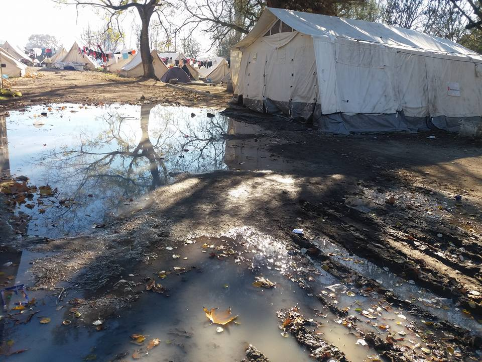
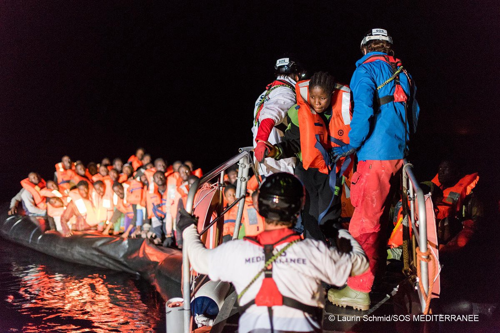
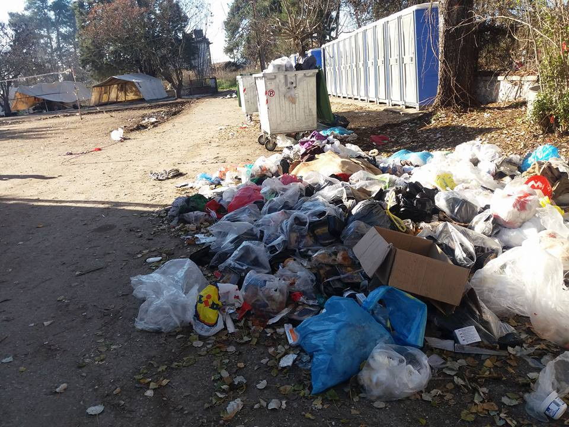

### AYS DIGEST 04/12/16: No more space in graveyards for the victims of Aleppo
#### Terrible conditions at Serres camp; Two women die of hypothermia after being rescued; New camp in Paris grows; UN to make biggest aid appeal ever; Pro\-refugee demonstrations across Europe; More requests for donations from different groups

Unhealthy conditions and Serres camp
### Syria

The old Aleppo cemetery was filled up a year ago, the new one was filled up last week\. Now the dead are left in the besieged eastern enclave’s streets, buried in backyards\.

> “We have no more room” 

The head of the local forensic authority, Mohammed Abu Jaafar, said his department is so overwhelmed that the staff registering the dead pleaded with him not to take any more bodies\. He also said that even if they were to consider mass burials, they wouldn’t have the machines to do the digging\.

Now some bodies have been left on the streets\. Ambulances and rescue vehicles can’t reach them because they have been targeted or because fuel has run out\. As troops close in, there are now multiple front lines, all too dangerous to approach\.

Government troops have been crashing into opposition\-held eastern Aleppo, shelling civilians as they flee and forcing thousands to squeeze into a chaotic, devastated and shrinking pocket of neighbourhoods\. For two weeks, they bombarded the area, killing more than 310 civilians, including 42 children, and up to 220 opposition fighters, according to the Syrian Observatory for Human Rights\. Last weekend, ground troops stormed into the 17\-square\-mile enclave, captured half of it, and advanced on the rest\.

> “There are wounded people everywhere\. I am afraid I will step on them as I walk” 

The makeshift medical points are overwhelmed and understaffed, Abu Jaafar says, and they also don’t know where to bury the dead as they are afraid the piled bodies would expose the clinics’ secret locations\.

Since the war intensified, residents of east Aleppo have had to resort to whatever is closest to bury their dead\. They have buried their dead in gardens for a while and when possible, people take their dead to the Tababa, or the health authority run by Abu Jaafar that operates the morgue and issues deaths certificates\.

At the same time the government started running buses again to eastern Aleppo, taking people back to see their homes\. Many of the buses were adorned with propaganda pictures of President Bashar al\-Assad, as well as the flags of Syria\.

“I haven’t been to my house for almost six years,” said Hala Hassan Fares, who was on bus with her husband and son\.

About 60% of the territory once held by the rebels have been taken recently by the Government forces\.

Médecins Sans Frontières bring us a story of another innocent trapped in Aleppo, Abu Ahmed recounts his experience [here](https://medium.com/@MSF_USA/27-years-old-leg-shattered-trapped-in-aleppo-c6e76e089855#.tmojc6qr2) \.
### Mediterranean

Refugees being rescued

MSF has reported the death of two women after they were rescued from a dinghy\. Teams from Aquarius are devastated with this loss\.

Tomorrow morning at 8:00, a boat with 285 refugees is expected at Ragusano in Sicily\. The refugees \(217 men, 15 women an 53 children\) were rescued at sea in three missions \(2 with the boat PHOENIX and 1 with AQUARIUS\) \. Their countries of origin are Libya, Syria, Morocco, Guinea Bissau, Mali, Guinea, Cameroon, Ivory Coast, Nigeria, Sierra Leone, Gambia, Liberia, Togo and Niger\.
### Greece

The camps of Greece are once more news for the wrong reasons\. This time Serres camp, located north of Thessaloniki, has been reported as not meeting the basic living conditions\.

It is reported now as a serious health hazard, there is a large puddle of grey water coming from the bathrooms that everyone walks through to reach the tent area and it has also reached the children’s play tent making it unusable\. The bathrooms are said to be also not usable\.

Photo by Shahab Kalo

The sub\-zero temperatures are also a big problem as because the tents are not prepared for the winter\.

This camp, one of the most northern in Greece accommodates almost 500 people and 150 are small children\.

Some refugees have even said they might leave the camp in protest of the poor conditions\.

Photo by Shahab Kalo
#### Lesvos

There has been a big number of arrivals on this island in the last 24 hours with 3 boats being picked up\.

Two boats arrived in the north east shore of Lesvos, both picked up by Frontex\. One boat carrying 56 people, 10 were minors and 1 woman had a broken leg \. The total arrivals in these two boats was 74 people \. Later, another boat landed in the north coast of the island at 1:15 pm, with 60 people on board\. Everyone was wet and cold but were ok after getting dry clothes and hot tea and snacks\. After waiting over 3 hours, the transportation arrived and taken to Moria, only to be sent back to the north of the island to spend the night in stage 2 transit zone as the camp as full\. [Sao](https://www.facebook.com/save.assist.outreach/) was also able to give everyone a dry warm coat\.
#### Chios

Despite the terrible week with very bad weather, today there is some good news from Chios\.

> [CESRT](https://www.facebook.com/groups/421759534684819/permalink/557564601104311/) are delighted that in the next couple of weeks we will be opening the “Parent and Toddler House” and are teaming up with Janne Hegna to provide what we think is a very important service to parents and young children\. We will be providing a safe, structured, space for children to be children and for parents to develop their parenting skills with support and encouragement from suitably trained volunteers\. There will also be facilities for bathing and washing babies which has been a real challenge for the residents of Souda\. There is still a lot of work to do to decorate the space, provide toys, talk to parents and other organisations\. We will also be trying to recruit volunteers who have the right experience and police checks\. Many parents have lived in such difficult situations that they find it hard to be parents, and children are often traumatised from the experiences they have had in their difficult and short lives, so we feel that this is a vital project for us to set up\. 

To help this initiative click [here](https://www.youcaring.com/chios-east-shore-rescue-team-517584/update/560494) \.
#### Athens

There are expected protests and possibly riots in the city, especially in Exarchia area on the 6th of December, next Tuesday\.

This date tends to be a day of unrest in Exarcheia marking the police shooting of a teenager in December of 2008 that resulted in two weeks of rioting\.

As there are hundreds of refugees living in this part of the city we urge the volunteers to alert refugee families to stay inside on this day and prepare them in advance\.

[Here](https://docs.google.com/document/d/1Csv3yry2l9sVZLU1NJYWunll3PDQZX2N7VNdJSHAnqg/edit) is the medical guidance that was put together, by Ana Jorge and others, after a previous Moria incident, there is a section on tear gas\.

[Advocates Abroad](https://www.facebook.com/advocatesabroad/?fref=nf) and [Khora](https://www.facebook.com/KhoraAthens/) announced a new collaboration for a legal aid clinic, provided for free each week\. This clinic will be based on the 4th floor in the Khora center \(Tsimiski 21 / Asklipiou 80, Athens, Greece\) \.

The first session of this Advocates Abroad legal aid clinic in Khora will take place on Wednesday the 7th of December, from 10\.30 a\.m till 13\.30 p\.m\.

People can make an appointment by contacting the Khora center or sending a message on their Facebook pages\.

[**Spirou Trikoupi 17**](https://www.facebook.com/spiroutrikoupi17/?fref=nf) open clinic is in the need of the following items:

Cough/cold/sore throat meds for adults 
\- Sudafed
\- Panadol cough/cold
\- Robutussin \(adults and kids\) 
\- Gotussin \(adults and kids\)
\- Cough drops \(strepsil or ricolla\)
\- eucalyptus nasal and throat spray 
\- anything else you see for cough/cold/sore throat

Immunity support medications
\- Vitamin C
\- Multivitamins
\- Vitamin D
\- Vitamin B

Antibiotics
\- Amoxicillin 500mg
\- Augmentin \(Amoxicillin\- Clavulanate\) 875mg
\- Azithromycin \(250mg and 500mg\)

Other 
\- Neurontin \(gabapentin\) 300mg and/or 400mg
### Serbia

The temperatures on the Serbian\-Hungarian borders will drop to \-7 degrees tonight\. There are still dozens of refugee families living out there along the fence, just in camping tents\. It is one of our most important tasks — to help in these freezing days to people fleeing war, especially children\. In cooperation with [SIRIUS\.HELP](https://www.facebook.com/sirius.help/) , volunteers are every week distributing food, clothes, shoes and wood brickets in the transit zones\. Please consider contributing\.

](assets/4b99f6fdbc6f/1*dRThzbYSjXJoCZ79ocOQzA.jpeg)

Volunteers from [Fresh response](https://www.facebook.com/freshresponseserbia/)

At Miksaliste centre in Belgrade the numbers today were:

76 men

40 women

264 children
### France

In Paris the new makeshift camp is growing day by day\. The new camp is at St\. Denis, not too far from the centre at La Chapelle, just outside the border of inner Paris\.
There are now 129 tents with an average of 2 to 3 people in a tent\. Volunteers on the ground will do a more accurate census soon\.

](assets/4b99f6fdbc6f/1*OCOewfFDpK6WwRFDrjXv8A.jpeg)

Photo by [kevinWidanel](https://www.facebook.com/muttleydawg)

](assets/4b99f6fdbc6f/1*ETao0dnYdtLcyOWqJeRTFA.jpeg)

Photo by [**Agathe Nadimi**](https://www.facebook.com/agathe.nadimi)

](assets/4b99f6fdbc6f/1*FPDuE9GWU0JbGZ4Xz48hpQ.jpeg)

Photo by [**Agathe Nadimi**](https://www.facebook.com/agathe.nadimi)

The camp now has a compost toilet\.

](assets/4b99f6fdbc6f/1*hfqmWhiqqxzX_6x7h5HuCg.jpeg)

Photo by [KevinWidanel](https://www.facebook.com/muttleydawg)

A Swiss group who were in Dunkirk has been in Paris for a few days now and have been cooking for the camp for the last few days\. They are called [Rastplatz](https://www.facebook.com/rastplatz/?fref=ts) \.

](assets/4b99f6fdbc6f/1*vNMEY5nDxZW5xd0pTqe42A.jpeg)

Photo by [KevinWidanel](https://www.facebook.com/muttleydawg)

More donations are needed to support the people living on the streets of Paris as the winter brings terrible conditions to the growing number of refugees left outside\. Tents, sleeping bags, mats, winter clothes, etc, please contact [PRGS](https://www.facebook.com/PRGS.team/?fref=ts) for more details\.

From Dunkirk we also get a very complete report about the current situation, especially about the situation of the many minors still living rough, left behind by the governments\. Please follow the link for the [report](https://docs.google.com/document/d/1qq5TIbMP81p4QuPnXHM8_plw_kqQzBuJ8DGshgHWQM8/mobilebasic) \.
### UN

The United Nations is expected to launch its biggest ever appeal for humanitarian funding amid growing fears that major donors no longer have the political will to address proliferating crises in Yemen, Syria, Nigeria and elsewhere\.

The annual appeal, to be launched on Monday will seek to raise roughly $22bn\.

The current number of nations in crisis, coupled with the sheer scope of those crises, means that global resources and funding are in such great demand that one nation, even one crisis, is pitted against another\. The number of people in need of aid have increased year on year, with nearly 100 million people targeted for 2017\. But last year emergency requests for natural disasters in Haiti, Ecuador and Fiji attained only half their targets\. Half of the required humanitarian funds are for four countries alone, including Syria and Iraq\.

Politics play also a major part, the nationalist ideologies gaining ground around the world tend to emphasise a charity\-begins\-at\-home approach\.
### Fighting for refugees

There were, around Europe, several demonstrations and protests against the poor treatment given to refugees by the institutions of Europe and to show support to those that keep suffering and are forgotten\.

Activists protested against the most recent wall built in Calais with the purpose of trying to stop refugees from reaching the UK\.

](assets/4b99f6fdbc6f/1*Rr-FJSkofbc6gjWvo6wQDA.jpeg)

Photo by [**Rosie Strickland**](https://www.facebook.com/profile.php?id=582590426)

The wall in Calais is the first physical, permanent border defence wall to be erected in Europe since the humanitarian crisis began\. Its intent is to keep migrants and refugees out of the UK\. Funded by the UK government, permitted by the French state, and implemented by a UK security corporation under the Juxtaposed Borders agreement, the wall appears as a 4m high concrete scar on the horizon of Calais\. A court case taken against the corporation by the local mayor was recently lost, the mayor’s case of it being an ‘unnecessary eyesore’ sadly fell by the wayside of corporate interests to continue with development\.

It is also the first wall to be built on an effective border in Europe since Berlin\. And as that story tells us, in modern day progressive Europe, these needless walls are made to be dismantled\.

On the other side of the channel, another protest took place in Bedford, site of a detention centre for migrants\.

On the 3rd December 2016, nearly two thousand protesters travelled to the isolated site to stand for several hours in the 10th protest organised here by Movement for Justice calling for the closure of Yarl’s Wood and all immigration detention centres, waving and shouting support to the women asylum seekers held indefinitely inside Yarl’s Wood\.

](assets/4b99f6fdbc6f/1*0yQ0ZjVG0n3fjwNSiQaMWQ.jpeg)

Photo by [**No Border Network**](https://www.facebook.com/freefighters/)

They responded enthusiastically by shouting and waving back from the prison blocks behind the high fence, hindered by windows that open only a small crack\.

](assets/4b99f6fdbc6f/1*jvW9XGiwfYwhioYmVoRlLA.jpeg)

Photo by [**No Border Network**](https://www.facebook.com/freefighters/)
#### In Vienna many people held a demonstration in support of the Syrian people\.

> We continue to stand with the Syrian people and to inform the world what’s happening in Syria and Aleppo \(the massacres, the displacement and the harassment\) \. 

](assets/4b99f6fdbc6f/1*QfBBS8Jni72dgOSZYQLpWA.jpeg)

Photo by [**Free Syria — Salam**](https://www.facebook.com/Free.SyriaSalam/)
### Calls for help

[\-Winder in Syria and Gaza](https://www.onenationuk.org/projects/winter-in-syria-gaza/) \- You can follow them on Facebook [here](https://www.facebook.com/onenationUK) \.

\- [Project Lifejacket](https://www.thunderclap.it/projects/50518-projectlifejacket-help-now)

\- [Choose Love this Winter](https://www.justgiving.com/campaigns/charity/prism-thegiftfund/helprefugeeschooselove) launched our winter appeal

[\-Turkeyvolunteers\.](http://l.facebook.com/l.php?u=http%3A%2F%2FTURKEYVOLUNTEERS.ORG%2F&h=YAQHZiFBPAQFsPTlVc_vHhnHAusuK7rEd-uquc3kgcsVnzA&enc=AZPYa0ReBoHx_FvWKiGAA9-LpymuJ1ukdXWRQK0Zci3bzNpm_0LerJ8NnJ5tt5yO_Jx2K_8wauFkgCntZQRZY6av12OijgwYUYEIOR_6hHcvAk3JRvKkLuViHjfdXQchuv_G4F1nMCJNRI7cVmUa6byFVU25iUVRxlzZGpy2sln4TfJ_EZqKADFiDu7k23IlmdY&s=1) org — Winter Appeal

For materials donations see the list below:
\- Blankets\.
\- Children’s and baby clothes of all sizes and categories\.
\- Men’s and women’s coats, jackets, hats, scarves and jumpers ONLY\.
\- Shoes all ages — good condition, \(practical footware only\)
\- Diapers, hygiene items \(tooth brushes, deodorant, wet wipes,
shampoo etc\) \.
\- Dry or tinned food\.

_Converted [Medium Post](https://areyousyrious.medium.com/ays-digest-04-12-16-no-more-space-in-graveyards-for-the-victims-of-aleppo-4b99f6fdbc6f) by [ZMediumToMarkdown](https://github.com/ZhgChgLi/ZMediumToMarkdown)._
