### AYS DAILY DIGEST 11/12/2016: Baby boy born on boat sinking in the Mediterranean

_Messages from volunteers and refugees for the EU — do something\! // Greek government proposes segregation of refugees to decrease the number of people on islands while human rights activists are trying to prevent this // Volunteers in Como saving refugees who are sleeping in the streets // People sleeping out in the cold city of Malmo // Streets of Paris covered with tents with only volunteers to help the people_

](assets/3d09dec7d94d/1*DctKrSxfR8NskrMhb84KhQ.jpeg)

Sindos women’s and children’s day\. Photo by [schwizerchrüz\.ch Michael Räber](https://www.facebook.com/swisscross.help/?ref=page_internal)
### Mediterranean
#### Another baby born on a rescue boat

A dramatic day at sea\. MSF and SOS MedFrance rescued more than 700 people from drowning\. They were found on a wooden boat\. Among the people rescued was a woman who gave birth to a baby boy \(3\.1 kg\) on the boat\. Baby and mother are safe and well\. It is beyond understanding why this baby and women had to go through this extreme experience in order to come to the richest continent in the world\.

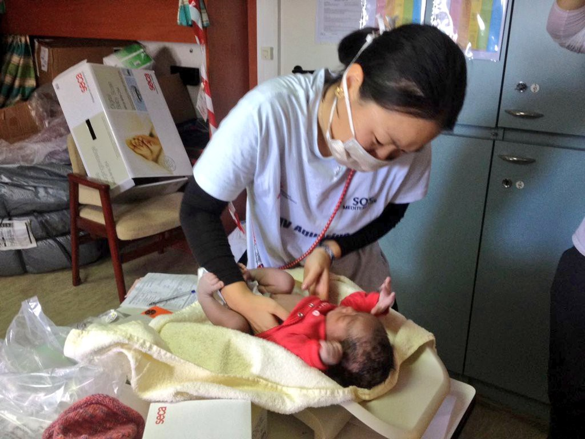

Photo by MSF Sea

More people were rescued from other boats making the total number for Sunday 1,164\. Six people did not survive this perilous journey\.

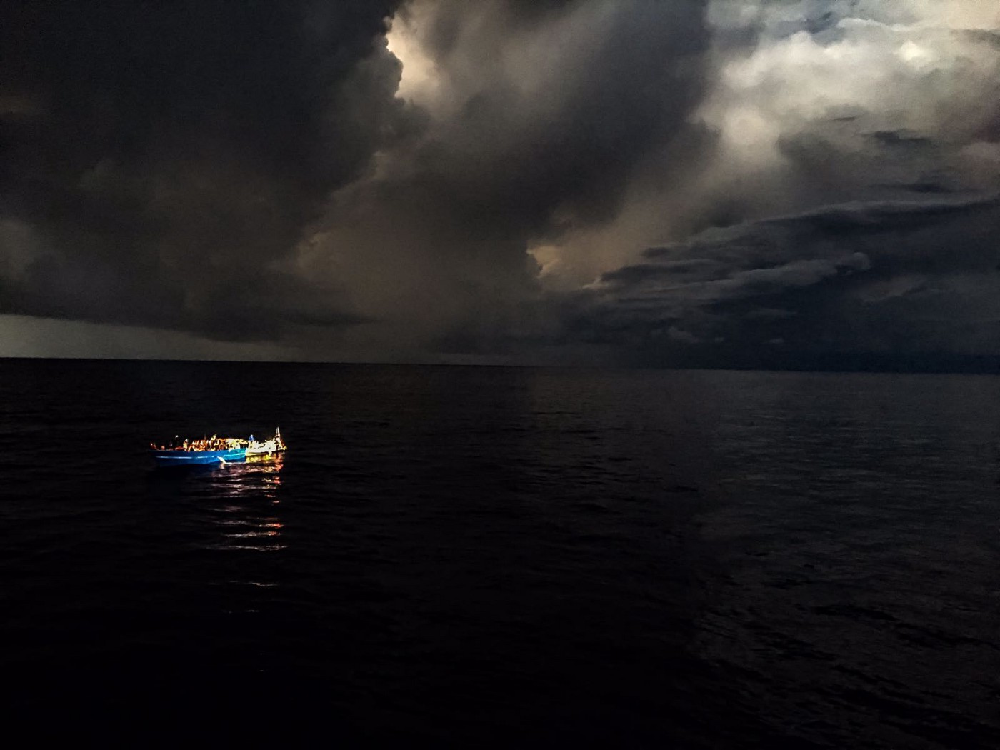

Photo by MSF Sea
### Weather forecast

There are no weather alerts for tomorrow, but be careful and stay safe wherever you are\. [SOA weather forecasts can be found here](http://saoweather.azurewebsites.net) \.
### Turkey
#### Silence in EU about shooting at the border with Syria

[The European Council on Refugees and Exiles \(ECRE\)](http://www.ecre.org) , a body consisted of 90 NGOs in 38 European countries, [condemned silence in EU](http://www.ecre.org/european-politicians-silent-over-mounting-number-of-deaths-at-turkish-syrian-border/) about reports of shootings at the Turkish — Syrian border\.

ECRE’s German member [Pro Asyl](https://www.proasyl.de/en/) links this silence with the interest to manage refugee flows to the Union through the EU\-Turkey Deal\.

Karl Kopp, Pro Asyl’s Director of European Affairs told ECRE:

> “The silence of Europe on the fatal shootings at the Turkish\-Syrian border speaks volumes\. For people who flee before war and terror in Syria, all escape routes are closed\. Already on 7 January 2016, Turkey had introduced the visa requirement for Syrian refugees from third countries — under applause from the EU\. The suffering of the fugitives in the Turkish border area is also the result of European refugee policy\.” 

### Greece
#### New arrivals to islands

More people arrived to Greece today\. Officially, 45 to Chios and 1 to another island\. Volunteer [Eric Kempson](https://www.facebook.com/eric.kempson.7) was among those who help to some of the new arrivals\. He has been doing that for years now\. Watch and listen to his message to those who have the power to stop this tragedy\.

[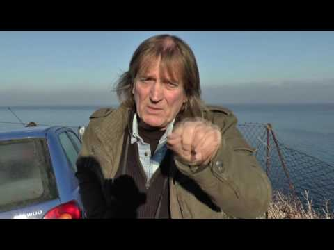](http://www.youtube.com/watch?v=qFUmgXqaEtA)

Volunteers at Lesvos believe more volunteers could be needed soon on a night watch on the island’s north coast\.

[Lucky Ali](https://www.facebook.com/lucky.ali.100046?qsefr=1) is a refugee stranded in Greece who is also sending a message to those who can make decisions:

> “We \(REFUGEES\) respect one thing and that is HUMANITY\. It’s been 9 months since the border closed to refugees and since then the EU has done nothing to help us to leave here and settle in other European countries\. 

> WHY ? WE ARE HUMAN AFTER ALL\. 

> We know that here in Greece there is a refugee crisis and it is a really harsh situation\. I respect every refugee, to me every refugee is equal\. The main focus on the relocation of refugees is Syrian people, I feel that there is not enough attention given to people of Afghanistan\. WHY IS THIS? We risked our lives to come to Europe to escape war, So why do we feel that we are still fighting? 

> We Want Our Human Rights\.” 

#### People of Oraiokastro camp need help

The situation in Oraiokastro camp remains worrisome\. [The Voice of Oraiokastro](https://www.facebook.com/ThevoicesofO/) , a self\-organized group of refugees, are reporting there is no heating in the camp, yet, even though it was promised to them\. They also have problems with electricity, that is often off, and wifi\. They keep repeating these messages for days\. Isn't it about time somebody does something to help them?
#### Segregation is not the solution\!

Meanwhile, as a solution to the overcrowded situation on islands, the Greek government proposed to the EU a plan to segregate people by nationality\. This would mean those with a “low recognition rate” of asylum eligibility — namely Algeria, Pakistan and Morocco — and people judged to be behaving improperly, are moved to “pre\-removal centers” on the mainland where they will be kept under tight security before being returned to Turkey\.

Greek Migration Ministry believes that the overcrowding was mostly down to people whose asylum claims were “manifestly unfounded”\.

Some 16,300 refugees are now thought to be living on the Aegean islands\.
#### Beautiful stories from Sindos and Filippiada camps

In Sindos, yesterday was women’s and children’s day, and a small celebration was organized in the Community Center\.

](assets/3d09dec7d94d/1*n6IvOqYZC2Zu5Ry3azIkTw.jpeg)

Photo by [schwizerchrüz\.ch Michael Räber](https://www.facebook.com/swisscross.help/?ref=page_internal)

In [Filippiada](https://www.facebook.com/groups/924445867653404/) , on December 14, an exhibition will be organized with artwork by the people living in this camp\.

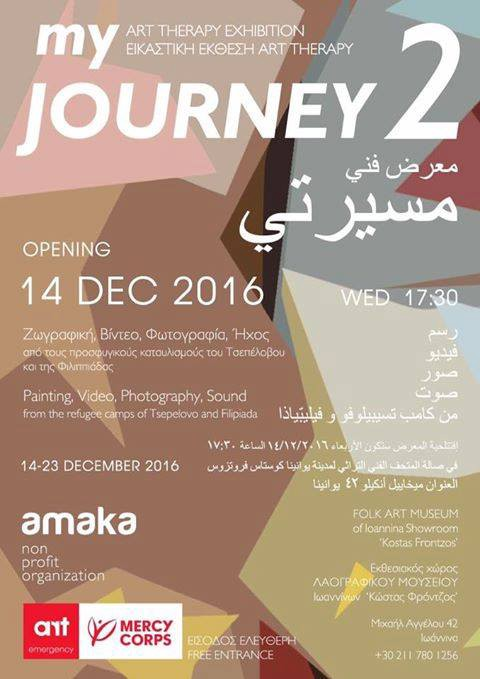

### Italy
#### People count in the streets of Como to start

In Como, 74 people were rescued last night on the streets by the group of volunteers\. Among the refugees were two mothers with a baby and 4 children\.

[The volunteers have launched the initiative](https://www.facebook.com/osservatoriomigranticomo/?fref=nf) \#accoglienzafredda with the intention to publish daily the numbers of people rescued\.
### Serbia
#### With the little help from friends

No good news from Serbia today\. Hundreds of people are still out in the cold, and they are hungry and afraid\. Volunteers are trying to help in every possible way\.

[In Miksaliste](https://www.facebook.com/RefugeeAidMiksaliste/) , refugees and volunteers made a makeshift Pachis board and called everybody in Serbia to join in a game\.

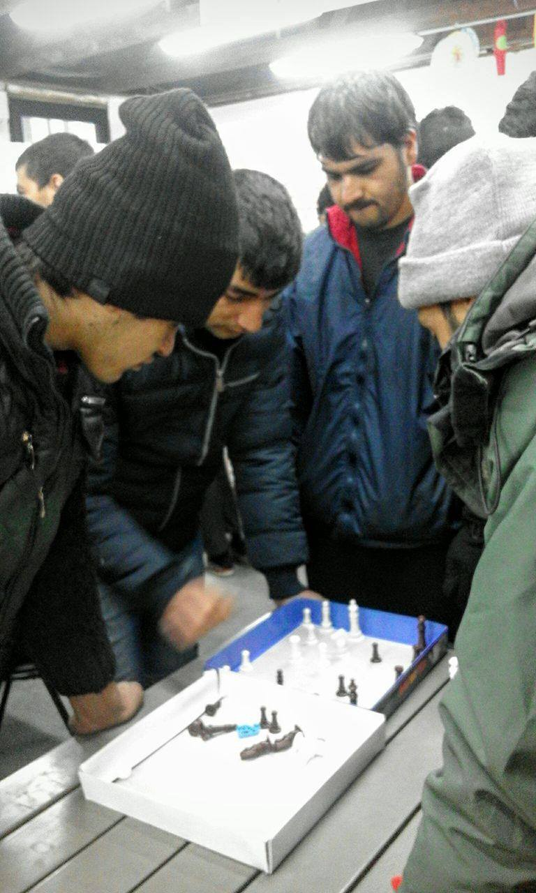

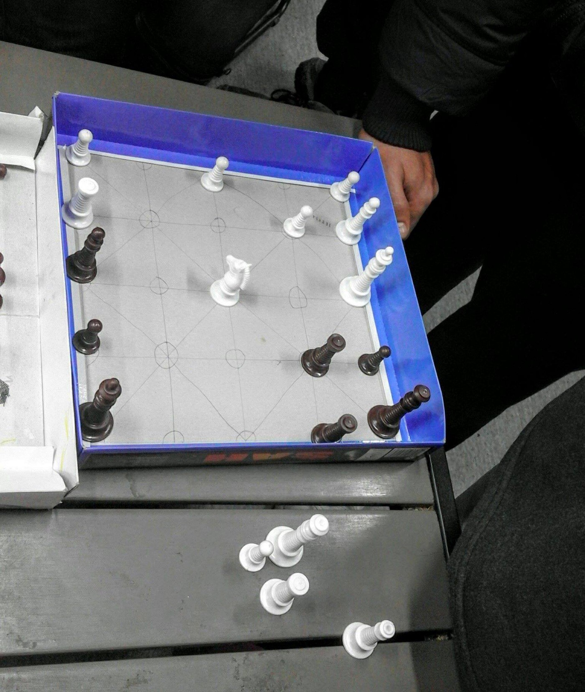

Foto Refugee Aid Miksaliste

In Bujanovac, volunteers from the [Borderfree Association](https://www.facebook.com/borderfreeassociation/posts/1577669672250358?hc_location=ufi) organized Yoga and Zumba classes for women\.

These “woman\-only power sessions”, as organizers call them, will continue in the next few weeks\.

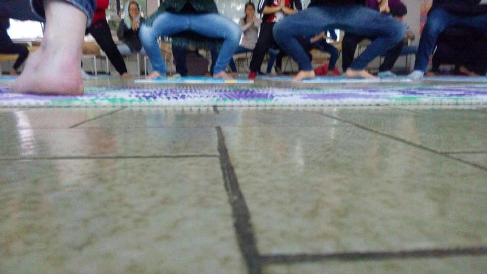

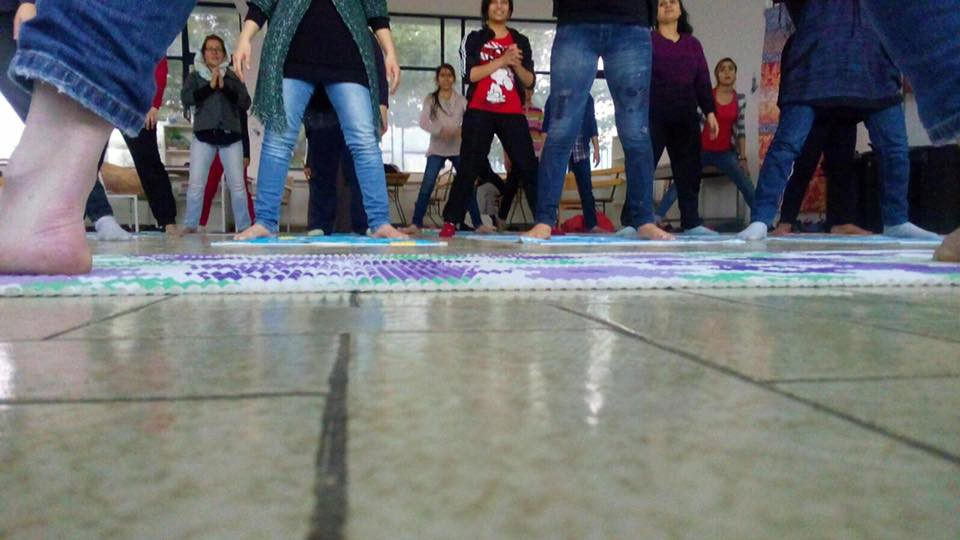

Photo by Borderfree Association

Sometimes, life is made of a small things\. This story from [North Star team](https://www.facebook.com/NorthStarSerbia/) is another confirmation\. There is a new football field and today it was their first day of some language lessons\.

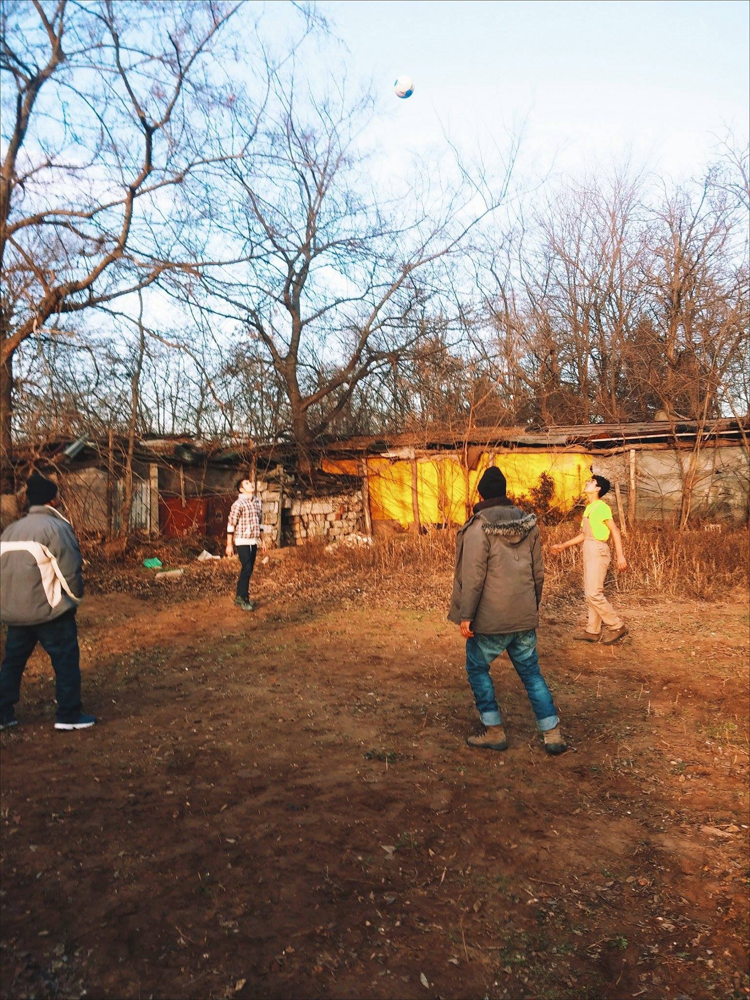

By NorthStar

If you’d like to get involved with them in any way, you can contact them on their [FB](https://www.facebook.com/NorthStarSerbia/) page\.
### France
#### Help needed in the street of Paris

The number of people at St Martin in Paris is growing\. Volunteers from [Rastplatz](https://www.facebook.com/rastplatz/) yesterday counted 280 tents, and an estimated 500–750 people\. People are arriving every day\.

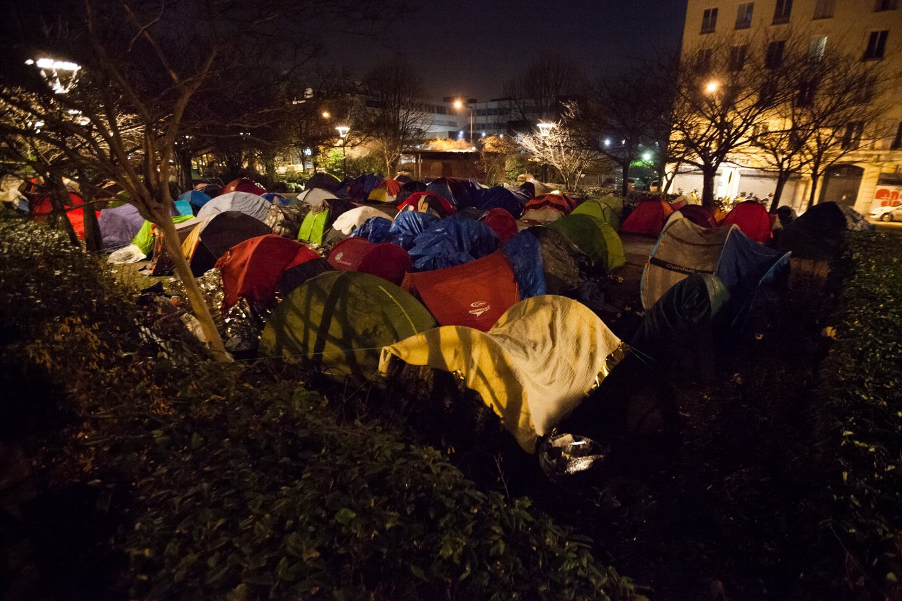

By Rastplatz

Help is needed\. [Paris Refugee Ground Support](https://www.facebook.com/PRGS.team/) is constantly running out of blankets, tents, sleeping bags and tents\. Find more info on their [FB page](https://www.facebook.com/PRGS.team/) \.

Many small French organizations are aware of the new camp and deliver food, but they also need your help\.
### Germany
#### Stop deportation of Afghan people\!

Thousands of people protested today in Berlin, Frankfurt, and Bremen against planned deportations to Afghanistan\.

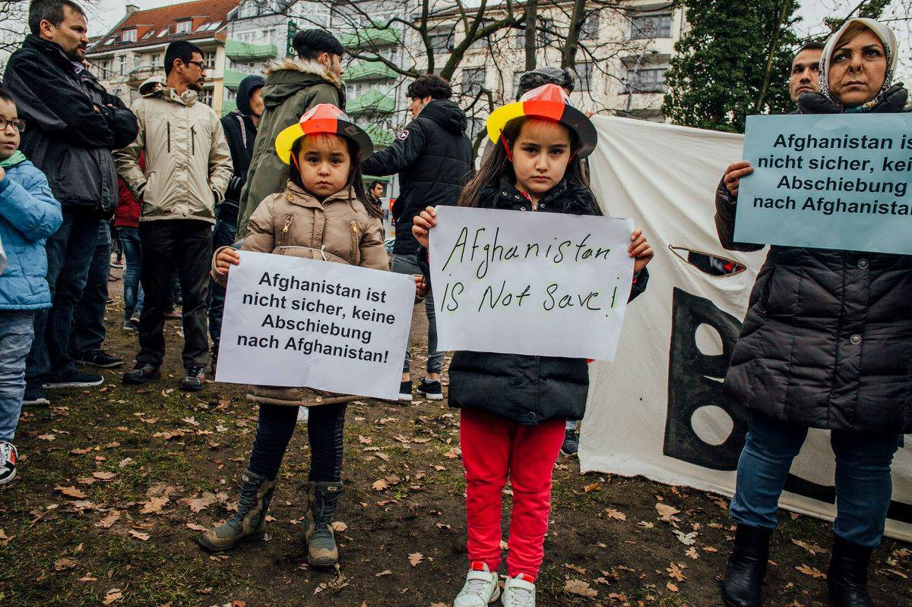

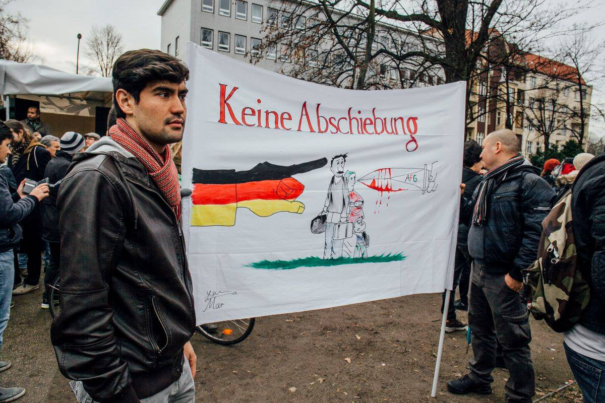

 n\.](assets/3d09dec7d94d/1*KY0tLECwttyzuSIiAcu4UQ.jpeg)

Photo by the [Newsgroup Afghanista](https://www.facebook.com/pg/weltenwandertheater/photos/?tab=album&album_id=1808093609466124) n\.

[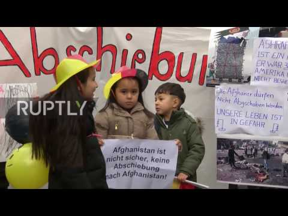](http://www.youtube.com/watch?v=rOzhCp3xA4o)

At the beginning of October, the EU made a deal with the government in Afghanistan about sending tens of thousands of Afghan refugees back despite the obvious danger for all civilians in this country\.
### Sweden
#### Homeless refugees in Malmö

Refugees are sleeping in tents in the schoolyard of Malmö International School\. [According to the reports](http://www.thelocal.se/20161211/homeless-eu-migrants-sleeping-outside-malm-school) , school personnel noticed an increase in the number of people camping in its yard during the autumn\.

Two refugee camps were demolished recently in Sweden, despite the fact that people are still arriving\.

_Converted [Medium Post](https://areyousyrious.medium.com/ays-daily-digest-11-12-2016-baby-boy-born-on-the-drowning-boat-in-mediterranean-3d09dec7d94d) by [ZMediumToMarkdown](https://github.com/ZhgChgLi/ZMediumToMarkdown)._
