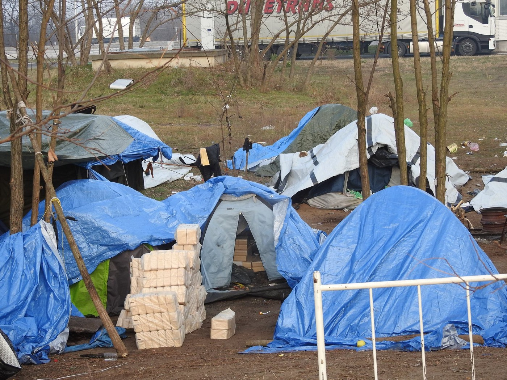
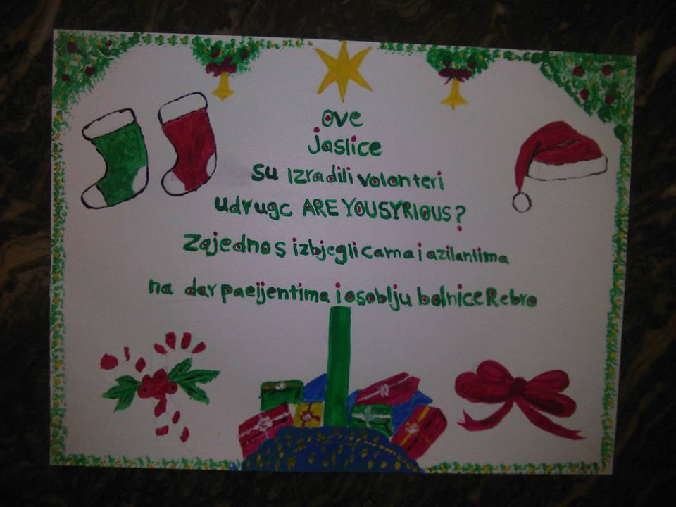

### AYS Daily News Digest 10/12: Human rights?
#### Refugees’ reality: fleeing war only to find yourself fighting for survival elsewhere / A surge of arrivals to the Greek islands / Cherso closes / A risk of people freezing at the European borders / Help needed as conditions worsen / Afghans in Germany deepening their doubts about returns after the recent attacks / Syrian families in court against EU member state on account of human rights’ breach

](assets/4b28d0428c65/1*e2aqR10iPywuVeHL_ci4Lw.jpeg)

Photo: [**Through refugee eyes**](https://www.facebook.com/throughrefugeeeyes/)

> “Everyone has the right to freedom of movement and residence within the borders of each state\.
 

> Everyone has the right to leave any country, including his own, and to return to his country\.
 

> Everyone has the right to seek and to enjoy in other countries asylum from persecution\.” — 

These were considered “fundamental human rights to be universally protected” back in [1948](http://www.un.org/en/universal-declaration-human-rights/)
#### LEBANON
#### Help needed in camps in Lebanon

A camp in the north of Lebanon, in Tel Abbass \(at the Lebanese\-Syrian border\)has about 500 refugee families living in the main and the surrounding areas\. The conditions are getting more difficult to live in, especially with the coming winter temperatures, as they expect snow soon\. A few days ago new arrivals were registered — about 70 people from Aleppo fled to these areas and they are finding abandoned garages and buildings to settle in\. Four members of the operazione Colomba who are present in the area are asking for help in: **medicine, fuel for the heaters, clothes and supplies\.** 
If you can help in any way, please [send a private message](https://www.facebook.com/forgotten.idomeni/?hc_ref=PAGES_TIMELINE) \.

](assets/4b28d0428c65/1*UunZJ6wSJiEMZQHZETMZag.jpeg)

Photo: [Forgotten in Idomeni](https://www.facebook.com/forgotten.idomeni/?hc_ref=PAGES_TIMELINE)
#### GREECE
#### Arrivals

330 people were officially registered today: 138 on Lesvos, 67 on Chios and 125 in other places\. For the first time after August this year, the number of official registrations on Greek islands reached over 300\.
#### Cherso

As of yesterday the Mazarakis camp in Cherso is closed\.

Mazaraki camp in Cherso, August \(Photo: AYS\)

The camp that until recently had more than a thousand people living in [harsh conditions](https://medium.com/@AreYouSyrious/ays-daily-news-digest-18-11-the-world-ignores-one-of-the-worst-days-for-aleppo-desperation-in-e180c1193dde#.myaa1l8g9) , is set to finally close\. Most of the refugees were transfered earlier and over a 100 people had remained there\. Now, the remaining refugees were taken to houses in different areas, including Kilkis, and some moved five hours away from Cherso, to a hotel in Plataria, in the Ioannina area\. Some of those people still have months to wait before their relocation interview takes place\. For some, it will mark a year in Greece, most of which they spent in a remote camp under a tent canvas…

Cherso \(Photo: AYS\)
#### Thessaloniki

According to the volunteers in Thessaloniki, the homeless refugee families in the city parks and streets are not as many as before, but those stranded outside are in harsh conditions and any help or assistance in warm clothes, shoes and sleeping bags is welcome at any time\. [Team Bananas](https://www.facebook.com/TBananita/?fref=nf) still provides bananas and breakfast on the streets and together with [SOUL FOOD Kitchen](https://www.facebook.com/dirtybunch/) they help preparing, cooking and distributing 2 hot meals a day\.

Refugees on the streets of Thessaloniki are left to rely on the kindness of strangers — volunteers continually working to help them \(Photos: Soul Food Kitchen; M\. Ali\)
#### Samos

A non\-profit organisation, the Greek Council for Refugees claims a young Iraqui refugee had requested international protection in Greece and had been tortured by members of the ISIS, and therefore should have joined the program for torture victims\. Instead, he was held under inhumane conditions at the police station for nineteen days, it is [reported](http://www.keeptalkinggreece.com/2016/11/30/samos-council-for-refugees-accuses-police-of-torturing-isis-victim/) \.
[Samos Volunteers](https://www.facebook.com/samosvolunteers/?fref=nf) are looking for German teachers\. If you or somebody you know are interested in helping those who wish to learn German while staying in the refugee camp on Samos, please [contact](samosvolunteers.org) them as soon as possible\.
#### Lesvos

Dirty Girls of Lesvos have issued a notice:

> Once again an organized group of older Greek women are representing themselves as Dirty Girls at clothing distribution areas and claiming that they can take whatever clothes they need\. They tell a good story but they have absolutely nothing to do with Dirty Girls\. 
 

> They are stealing the clothes in order to sell them\. If you encounter them\. do not give them any clothes\. 
 

> Do try to take their photo\.
 

> They have turned up on beaches in the past so also be aware of this\.
 

> Always ask them for a name from Dirty Girls if you aren’t sure\. If they can’t give my name then they have absolutely nothing to do with us\.
 

> It’s yet another underhand way of exploiting the refugees and it must be stopped\. 

As some volunteers made an effort to help refugees move from camps to proper lodging, it is important along the way to think in advance and make sure those people are taken care of — with a network or contacts that can provide them with food and medical assistance, not to be left alone on their new addresses\. Some of the volunteers reminded about that due to a couple of cases where families were left on their own in their alternative accommodation\.

Refugees from the camp [Oraiokastro](https://www.facebook.com/ThevoicesofO/posts/1688655474778893?hc_location=ufi) continue having problems with electricity\. That causes further problems with heating, WiFi and power in the entire camp\. 
Many refugees stranded in Greece, apart from their everyday worries and those of the asylum procedures also carry a lot of personal weight of their life [stories](http://www.ekathimerini.com/214471/gallery/ekathimerini/in-images/syrian-refugees-find-temporary-shelter-in-exarchia-neighborhood) \.
### Human rights at the Serbian — Hungarian border

Refugees at the Serbian\-Hungarian border, in the Röszke transit zone, are reminding how very cold it is in the unheated tents at night, so much that they say, parents are afraid their children might have fatal injuries due to the cold they experience out there during the night\.
The Sirius\.Help team reported that refugees, who are in a bad shape, wrote to them:

> We don’t have any ingredients for cooking\. And unfortunately the wood you bring us twice a week, is not enough either in this extreme cold\. We have already brought every dry branches from the forest nearby\. 

](assets/4b28d0428c65/1*QqMl_XQDtFfkdSxOOX9dww.jpeg)

Photos: [SIRIUS\.HELP](https://www.facebook.com/sirius.help/)
#### BOSNIA AND HERZEGOVINA
### Sarajevo stands with Aleppo

[A gathering](http://www.klix.ba/vijesti/bih/miting-podrske-narodu-sirije-14-decembra-u-sarajevu/161209075) of support to the Syrian people, especially to those suffering in Aleppo, will be held in Sarajevo on Wednesday, December 13\. 
As a city that has endured the longest siege in the modern times, as citizens of Sarajevo, the people want to let Syrians know they understand their suffering and to call the world to react\.

> We don’t want to quietly ignore the problem and we intend to say clearly that the conflicts in Syria have to do with all of us, they’re not only the matter of the world’s most powerful figures who play their game of chess on the Syrian board\. 

#### CROATIA

Asylum seekers in Zagreb, together with AYS volunteers, made a Christmas crib for the residents and staff of the largest hospitals in Zagreb, Rebro\. The intention of this common workshop project was bringing joy to those who will spend holidays in hospital rooms\.

Photo: AYS
#### FRANCE
### Paris

Paris volunteer teams report that an evacuation is planned in the coming days in the St\. Denis area of Paris that currently has over 500 people staying there\. The Paris [team](https://www.facebook.com/PRGS.team/?fref=ts) needs more helping hands to collect, sort and distribute help, so if anyone can join — contact them\!

 \)](assets/4b28d0428c65/1*Jgo42XjEUPt5AAxtihhRPg.jpeg)

Paris \(Photo: [Care4Calais](https://www.facebook.com/care4calais/) \)
#### …meanwhile …

An international meeting was held in Paris, where foreign ministers from the United States, Britain, Germany, Italy, Turkey, Saudi Arabia, UAE, Qatar and Jordan were planned to discuss the situation in Aleppo\. Meanwhile, US and Russian military experts and diplomats were meeting in Geneva to work out details of the rebels’ exit from eastern Aleppo, sources [report](http://An%20international%20meeting%20will%20be%20on%20Saturday%20in%20Paris,%20where%20foreign%20ministers%20from%20the%20United%20States,%20Britain,%20Germany,%20Italy,%20Turkey,%20Saudi%20Arabia,%20UAE,%20Qatar%20and%20Jordan%20to%20discuss%20the%20situation%20in%20Aleppo.%20%20Meanwhile,%20US%20and%20Russian%20military%20experts%20and%20diplomats%20are%20meeting%20in%20Geneva%20on%20Saturday%20to%20work%20out%20details%20of%20the%20rebels’%20exit%20from%20eastern%20Aleppo.) \.
#### SPAIN
### Demonstrating will to act for the rights of others

On the occasion of the International Human Rights day, Stop Mare Mortum organization along with other

entities that support the campaign Casa Nostra, Casa Vostra organized „We give birth to human rights“ event\. It took place at the University of Barcelona ending with the public reading of the Casa Nostra, Casa Vostra campaign manifesto\. People were invited to participate in this united action by bringing a candle that symbolizes Catalonia as a welcoming place\.

](assets/4b28d0428c65/1*XrYIVZ0AAIinKVdurzDu4Q.jpeg)

Photo: [**Stop Mare Mortum**](https://www.facebook.com/StopMareMortum/)

Given the constant and systematic violation of the fundamental rights of migrants, Stop Mother Mortum encourages citizens to demand a change in migration policies and asylum in Europe\.
You can sign the manifestro here: [http://www\.casanostracasavostra\.cat/](http://www.casanostracasavostra.cat/)

](assets/4b28d0428c65/1*wrofb2YfBsAoMzgRRt8Bmg.jpeg)

Photo: [**Stop Mare Mortum**](https://www.facebook.com/StopMareMortum/)
#### IRELAND
### Refugee families pointing to the breach of human rights by the EC, EU and an EU member state

Members of one of two Syrian families now in Greece who have sued in the Irish courts in a bid to prevent their transfer to Turkey are to be transferred to Germany, [Irish Times](http://www.irishtimes.com/news/crime-and-law/courts/high-court/syrian-family-in-irish-court-application-will-be-moved-to-germany-1.2897003#.WEwMtoFx_OI.facebook) reports\. Both families wish to join other family members in Germany and they had initiated a case against the European Council, EU and Ireland over alleged breach of their human rights last month\. The core claim of the families is the EU\-Turkey deal on migration, allowing Greece to return to Turkey “all new irregular migrants”, was made outside the powers of the EC and breaches EU law\. That deal, and Ireland’s sanctioning of it, is incompatible with Ireland’s obligations under the European Convention on Human Rights and breaches various EU Treaties\.
#### UK
### Refugee children’s rights in risk

Home Office transfers of unaccompanied minors who were registered in the Calais refugee camp have stopped, meaning up to 1,000 children are unlikely to be given sanctuary in the UK, [Guardian](https://www.theguardian.com/uk-news/2016/dec/09/home-office-transfers-of-calais-child-refugees-to-uk-cease) reports\.
[Safe Passage](https://www.theguardian.com/society/2016/dec/09/the-charities-supported-by-the-guardian-and-observer-2016-appeal) , a charity that offers legal support to refugee children applying to join relatives in the UK, said it estimated several hundred Calais children remained in France despite having a legal right to be in the UK\. Although the remaining children from Calais look unlikely to travel to the UK, the Home Office said it would continue to transfer other children from Europe in coming months\.
#### GERMANY
#### Afghan refugees afraid of how they are viewed by Germans

More than a hundred Afghan asylum seekers gathered in the Freiburg city center on Thursday afternoon to light candles in memory of Maria, a 19\-year\-old medical student and volunteer, found dead on October 16\. It remains to be seen if the atrocity in Freiburg will play any role in future asylum\-related debates in Germany\. But reports suggest that plans are underway to deport in the coming days the first group of Afghan migrants whose asylum requests have been rejected by Germany **,** [DW](http://m.dw.com/en/afghan-asylum-seekers-apologetic-about-freiburg-murder/a-36714266) reports\.

](assets/4b28d0428c65/1*WCjpIF87ThjYiHO1mulNEA.jpeg)

Photo credits/source: [DW](http://m.dw.com/en/afghan-asylum-seekers-apologetic-about-freiburg-murder/a-36714266)

Some useful links to support those working on the field are available [here](http://greecevol.info/notes.list.php?tag%5B196%5D=1&filter=set&mysearch&sort=title) \.

_Converted [Medium Post](https://areyousyrious.medium.com/ays-daily-news-digest-10-12-human-rights-4b28d0428c65) by [ZMediumToMarkdown](https://github.com/ZhgChgLi/ZMediumToMarkdown)._
