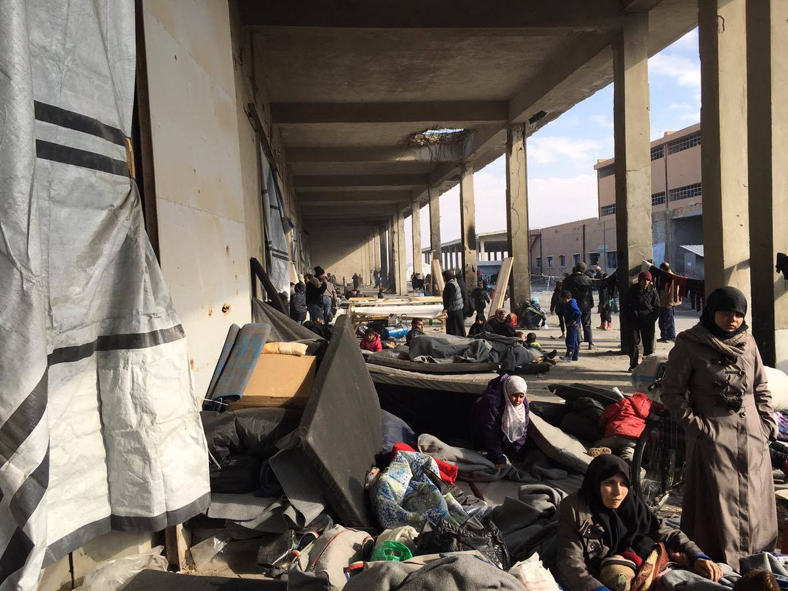
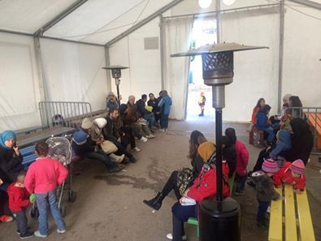
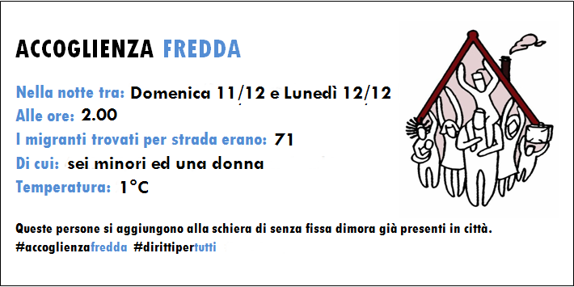

### AYS digest 12/12: “Impossible to determine the number of dead and displaced”

_Aleppo — impossible to determine the number of displaced / Clashes in Chios due to overcrowding / Hunger strike in Korinthos Detention Centre / EU struck a deal with Mali / Donations needed in Serbia and France / Saint Denis camp to be closed down_

People from east Aleppo are trying to survive in what seem to be the last days of the rebel\-controlled era\.
#### Syria
### **East Aleppo — impossible to confirm numbers of dead and displaced in government offensive**

Reuters reports, quoting military sources, that Syria’s army is in its “last moments before declaring victory” in east Aleppo\. Meanwhile, the Syrian Red Cross has posted this message on their Twitter account: “Update on the situation in east Aleppo: Hundreds continue to arrive daily at shelters\. It’s impossible to confirm numbers of displaced\.” According to numerous sources from the ground, the number of casualties is extremely high, but no one is able to estimate exact numbers as the government offensive continues\.

■■■■■■■■■■■■■■ 
> **[The White Helmets](https://twitter.com/SyriaCivilDef) @ Twitter Says:** 

> > +100,000 civilians are packed into a tiny area. Bombing + shelling relentless. Casualties unimaginable. Bodies lie where they fell. 

> **Tweeted at [2016-12-13 00:37:11](https://twitter.com/syriacivildef/status/808470791000129537).** 

■■■■■■■■■■■■■■ 

In a dramatic series of tweets, The White Helmets have described an atmosphere of utter despair in the last rebel strongholds within the city, where many civilians are facing the option to surrender to Government forces or risk death if they stay in their homes\. Many fear surrender as they may be treated as rebels or rebel supporters\.

> The Secretary\-General is alarmed over **reports of atrocities against a large number of civilians, including women and children, in recent hours in Aleppo** \. While stressing that the UN is not able to independently verify these reports, the Secretary\-General is conveying his grave concern to the relevant parties\. \(…\) The United Nations underlines the obligation of all parties on the ground to protect civilians and abide by international humanitarian and human rights law\. This is particularly the responsibility of the Syrian Government and its allies, said the UN chief Ban Ki\-moon in last night’s [statement](https://www.un.org/sg/en/content/sg/statement/2016-12-12/statement-attributable-spokesperson-secretary-general-aleppo-syria) \. 

#### Greece
### **Clashes in Chios, seven people injured**

Overcrowding in the islands’ hotspots has led to yet another outburst of violence\. Medium [griechenland\.net](https://www.griechenland.net/) reports that seven people were injured in clashes among residents on Chios\. The fights broke out after a group tried to get from Vial\-Hotspot to the UNHCR\-run Souda camp, which is also overcrowded\. As tension between new arrivals and residents escalated, the refugees started fighting with visitors of a tavern nearby, who fled\. A relative of the owner tried to disperse the fight by firing five shots in the air with his sporting gun\. When police came, the clashes ended\. Investigations are now underway\. It has been reported that everyone involved in the fight is now all right and is not in any danger from the injuries sustained\. The innkeeper was among the seven injured\.

As News that Moves reported, “The incident came as local officials on Chios again warned of growing anger among island residents, and demanded Hellenic Migration Policy Minister Mouzalas and the government in Athens immediately deal with the ‘impossible’ overcrowding on the island\.”
### **Hunger strike in Korinthos Detention Centre**

According to reports from inside Korinthos Detention Centre, over 100 asylum seekers currently detained there began a hunger strike yesterday\. They are protesting against their arbitrary detention which has, in certain cases, exceeded the length of their sentences\. They are also protesting the inhumane treatment they have received and conditions in Korinthos\.

One asylum seeker taking part in the hunger strike wrote, “We protest for freedom, we didn’t do anything wrong… we came to Europe to ask for asylum, not to be imprisoned\.” He continued, “everyone is hungry here, we don’t have enough food or hot water… we are treated like animals\.” Those taking part in the protest have one clear demand — to be released\.

This video, albeit several months old, shows the situation inside the centre\.

[In Detention](http://www.youtube.com/watch?v=F9p5QBIAi7Q)
### **Giannita and Larissa camp upgraded?**

As for the situation concerning camp facilities, we move further north, where there are indications that Giannita and Larissa are now empty\. The camps are being “upgraded” and will probably be reused soon\.
### **A concert in Samos**

So as to include a bit of a beauty in the beginning of this report we bring you a bit of atmosphere from an event that took place yesterday in Samos\.

As reported by Samos volunteers, “live performances by a Greek local band and an Iranian singer delighted the room as we came together to enjoy \(and later on, dance to\) the music\. The audience was a mix of locals from town, people from camp, lots of children and several of us from Samos Volunteers\.”
### **Information for asylum seekers**

Refucomm will soon be launching a series of [animated films](https://www.youtube.com/watch?v=t_9JEhRvVx0) showing the asylum procedures in Greece\. The picture below shows the reality of this process as it currently stands\. Apparently you have to arrive at 7am although the offices do not open until 9\. It appears very cold in the waiting room\.

Asylum service, Athens

In addition, migrants and refugees currently in Mytilene, on the Greek island of Lesbos, are eligible for free legal assistance, advice and representation at the Legal Centre Lesbos\. For more information and opening hours, please follow [this link](https://newsthatmoves.org/en/help-in-mytilene-legal-centre-lesbos/) \.
### **Dublin returns explained in Arabic**

We have written extensively on the new procedures of returns to Greece under the Dublin accord\. This information is now available in Arabic and is available [here](https://www.facebook.com/refugee.info/posts/1244954342231377:0?hc_location=ufi) \. The site was prepared by [Refugee Info](https://www.facebook.com/refugee.info/) \.

### **Information for volunteers**

Volunteers working in the field may be interested in the event Reporting from the Field\. \(See event page [here](https://www.facebook.com/events/698350100332408/) \. \) The event will be held in honor of International Migrants Day and is being organized by [Οργάνωση Γη — Organization Earth](https://www.facebook.com/OrganizationEarth/) and [LATRA](https://www.facebook.com/LATRALESVOS/) Innovation Lab\. It will take place on Thursday, December 15 at 7:00 pm in Athens\. Ten NGOs and grassroots initiatives deployed in Greek refugee camps will present their work and share best practices\. The event will also be an opportunity to build new partnerships\.

Meanwhile, Elpida Home is looking for a Protection Manager\. More details about the position are listed [here](https://www.facebook.com/groups/infopointfornortherngreecevolunteers/permalink/375389229474043/?hc_location=ufi) \.
#### Mediterranean
### **The deadliest year so far**

UNHCR first started tracking data on Mediterranean crossings in 2008\. By that measure, 2016 has been the deadliest year for the Mediterranean, even though the numbers of people trying to cross has decreased\. [Open Migration](http://openmigration.org/) has published a list of reasons why:

1\. Difficulties in coordinating actions between NGOs and military working at sea and the port authority in Rome\. Communication made worse by the fact that fewer and fewer migrants leave with a GPS phone\.

2\. “Political reasons\.” Sometimes it’s not clear who should intervene, and Frontex has deliberately ignored some SOS requests\.

3\. Late intervention by coast guards of different countries\.
### **EU struck a deal with Mali**

The Dutch Foreign Minister, whose country will hold the EU’s rotating presidency next year, said on Sunday that the bloc had signed an agreement with Mali on the return of migrants whose asylum applications had been refused\. The deal is the first such mechanism agreed by an African country and the EU\.

At a summit in November 2015 on Malta, EU leaders agreed with African counterparts to set up a €1\.8 billion \($1\.9 billion\) fund to address the root causes of migration\. In return, African nations would step up controls and accept repatriations of those deemed not in need of asylum protection, Deutsche Welle reports\.
#### Serbia
### **Solidarity with the North star**

If you are willing and able, please support our friends North Star\. North Star are working in Kelebija on the border of Serbia and Hungary\. We are working with them extensively and call on anybody that can to lend a helping hand\. For donations or to help please click [this link](https://signup.com/client/invitation/6775657374/1716445/false#!1716445/false/false) \.
#### Italy
### **Cold welcome in Como**

As the death toll rises at sea, the mainland is no respite\. In the early hours of December 12, at around 2am, in the city of Como there were as many as 71 migrants in the street, including 6 minors and 1 woman\. It has also been reported that a 15 year\-old boy from Eritrea tried to commit suicide on Saturday evening around 9pm inside the centre in Via Regina Teodolinda in the same city\.

Cold welcome\. Como, Italy
#### Germany
### **Practical info for those working on family reunion cases**

There are still technical issues between the German Federal Office for Migration and Refugees \(BAMF\) and the Greek asylum service \(GAS\) \. On occasion, documents and other communication may not be transmitted from one side to the other\. If you are working on family reunion cases \(Dublin III\), follow up with both offices to ensure that nothing has been lost and that all papers are in order\.
#### Sweden
### **Changes in asylum law in Sweden came too late for some**

Three unaccompanied minors from Afghanistan have committed suicide in the last six weeks as a result of rejected asylum requests and decisions about deportation\. When the new asylum laws were implemented last summer, several organizations warned that the psychological stress among many young unaccompanied minors would increase\. One new law, for example, stipulated that a young person who had been living at an HVB\-home \(a Swedish abbreviation for “Home for care and living”\) would lose their right to stay there and be taken care of the day they turn 18\.

The Migration Agency declared last Thursday \(December 8\) that as a result of the deteriorating situation in Afghanistan, asylum cases from the country would be judged more generously in the future\. But for some this new framework comes too late\.
#### France
### **Saint Denis camp to be closed tomorrow**

According to reports from the field, Saint Denis camp in Paris is going to be closed tomorrow\. Rastplatz has posted the video below, which portrays what they are calling the last supper\.

In the North of France there is a call for donations for Kesha Niya No Border Kitchen team\. If you can help, follow [this link](https://www.facebook.com/KeshaNiyaProject/posts/372489839762556:0?hc_location=ufi) \.

_Converted [Medium Post](https://areyousyrious.medium.com/ays-digest-12-12-impossible-to-determine-the-number-of-displaced-2c473cb7445c) by [ZMediumToMarkdown](https://github.com/ZhgChgLi/ZMediumToMarkdown)._
