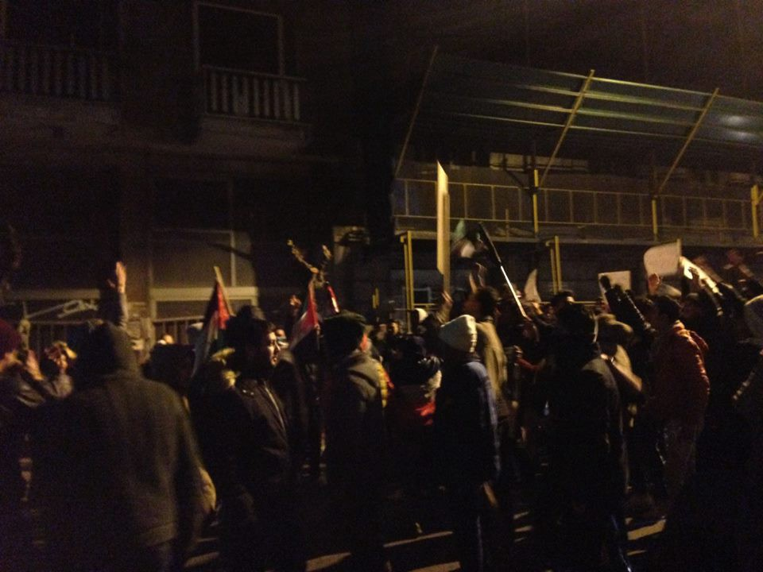
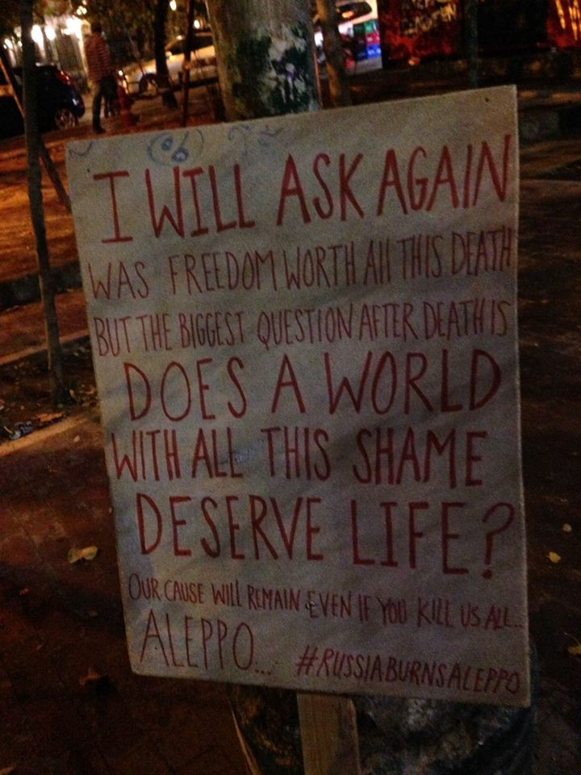

### AYS DIGEST 13/12: “We said never again”

Today we witnessed, how the world community turned away from humanity and left the residents of Aleppo abandoned\. During the recapture of Assad’s troops several war crimes have been reported\. While governments did not act, citizens in several cities stood up to show solidarity\. Report: Frontex wants to reinforce its presence in Greece\. Sweden and Germany start deporting Afghan refugees back to Afghanistan\.

](assets/304aef12c2f0/1*yHSqte9Ia7HcZI1XZLhgOA.jpeg)

Credits: [Firas Abdullah](https://www.facebook.com/Firas.Al.Abdullah)
### Feature: Humanity has fallen

Today we have been shocked by the events which happend in Aleppo\. Through social media we witnessed live how Assad’s troops recaptured, not to say invaded, the rebel\-held parts of the city\. Fights there were ongoing since 2012\.

■■■■■■■■■■■■■■ 
> **[Bana Alabed](https://twitter.com/AlabedBana) @ Twitter Says:** 

> > My name is Bana, I'm 7 years old. I am talking to the world now live from East #Aleppo. This is my last moment to either live or die. - Bana 

> **Tweeted at [2016-12-13 09:06:53](https://twitter.com/alabedbana/status/808599057794998272).** 

■■■■■■■■■■■■■■ 

Already in the night and early morning residents sent out their goodbye and SOS messages to the world, which had been left unanswered\. During this time [reportedly](https://www.facebook.com/Free.SyriaSalam/posts/725448500953218) already 180 people had been executed\. “ Now we are with 100,000 civilians trapped in an area of five squared kilometres with the non\-stop bombs, shells and advancements on the ground\. In one building more than 500 people are sheltering\. People have been underground for days” the White Helmets called for help\. “ We hear children crying, we hear calls for help, but we just can’t do anything\. We’re being bombed continuously\.”

■■■■■■■■■■■■■■ 
> **[The White Helmets](https://twitter.com/SyriaCivilDef) @ Twitter Says:** 

> > +100,000 civilians are packed into a tiny area. Bombing + shelling relentless. Casualties unimaginable. Bodies lie where they fell. 

> **Tweeted at [2016-12-13 00:37:11](https://twitter.com/syriacivildef/status/808470791000129537).** 

■■■■■■■■■■■■■■ 

Due to bad weather conditions the bombings abated during the day\. The bad news did not\. The fights in the streets continued\. Syrian government published videos of crossing checkpoints to safer zones\. But it is unknown, what happened with them after\. Already during the last days men haven been rounded up and forced to fight for govermental \(or near\) forces\. Today UN’s human rights office [reported](http://www.bbc.com/news/world-middle-east-38301629) the first executions, when 82 civilians had reportedly been killed by pro\-government forces, of whom 11 were women and 13 children, resuming the death toll could be much higher\. The streets were full of bodies\.

■■■■■■■■■■■■■■ 
> **[Lina shamy](https://twitter.com/Linashamy) @ Twitter Says:** 

> > To everyone who can hear me!
#SaveAleppo
#SaveHumanity https://t.co/cbExEMKqEY 

> **Tweeted at [2016-12-12 21:23:44](https://twitter.com/linashamy/status/808422105809387520).** 

■■■■■■■■■■■■■■ 

There have been further unconfirmed reports of women committing suicide in order not to get captured or even raped by army forces\. It was also [said](http://www.thedailybeast.com/articles/2016/12/12/last-rebels-in-aleppo-say-assad-forces-are-burning-people-alive.html) , that troops burned the remained residents alive and mass executions begun\. All of this would be war crimes\.

With the recapture of Aleppo the war in Syria did not end\. It has just reached a new peak level\. There are already [reports](https://twitter.com/NRC_Egeland/status/806862656124649473) of heavy bombings in other cities, some of them besieged\. And now the regime know it can do whatever it wants without having to fear consequences\. “What’s happening in Aleppo, will follow the world for years\. \[…\] The concept of responsibility to protect \[…\], to prevent ethnic cleansings, is over after Aleppo”, Christoph Sydow [commented](http://www.spiegel.de/politik/ausland/aleppo-kriegsverbrechen-lohnen-sich-kommentar-zu-syrien-a-1125642.html) for Spiegel Online\.

■■■■■■■■■■■■■■ 
> **[Janine di Giovanni](https://twitter.com/janinedigi) @ Twitter Says:** 

> > Today I feel like a failure. Nearly 25 years reporting war crimes has added up to nothing. We said "never again." What happened?  #Aleppo 

> **Tweeted at [2016-12-13 07:11:28](https://twitter.com/janinedigi/status/808570013670141952).** 

■■■■■■■■■■■■■■ 

Nevertheless worldwide solidarity was raising its voice today\. In several cities citizens stood up to protest against the war crimes happening in Aleppo\.

](assets/304aef12c2f0/1*FNh5Xh3xwPiPdDSlCkiw8A.jpeg)

Istanbul\. Credits: [Rami Jarrah](https://www.facebook.com/ramijarah)

 ‎](assets/304aef12c2f0/1*l-608UWn2j4ERjdKIatknw.jpeg)

Manchester\. Credits: [**Feras Alkassem**](https://www.facebook.com/feras.palmyra) ‎

Athens\. Credits: L\. Martens

Credits: L\. Martens
### Greece
#### Islands

According to Lesvos volunteers on the ground 48 people arrived in the north around 13\.00, 36 men, 7 women and 5 children\. It was a cold and windy day, but everyone was ok, volunteers in the beginning took care of them\. All of them were later transferred to a transit camp\. There were no new registrations until 7\.30\.

](assets/304aef12c2f0/1*_lkqyapEEg0R1bdjoSFoDQ.jpeg)

Arrival on Lesvos\. Credits: [Philippa Kempson](https://www.facebook.com/photo.php?fbid=10154425589189355&set=pcb.10154425627744355&type=3&theater)

UNHCR and Advocated Abroad team on Chios confirmed, that the boy who has been apparently abused by his father was found and is now safe with police\. Father is in custody\. Yesterday and today the videos of the alleged abuse have been shared widely\. In order to protect the dignity of the boy we ask you to not share this video anymore or other similar ones in the future\. It is enough the share the news to try to find out more\. Even if it is despite intention, sharing such contents can cause a lot of harm and apparenlty is illegal in some countries\. If you find the video, please report it to Facebook so they will delete it\.
#### Mainland

According to a [report](http://www.ekathimerini.com/214527/article/ekathimerini/news/eu-to-reinforce-frontex-presence-in-greece-says-german-report) of Spiegel Online border agency Frontex intends to deploy more staff at Greek border with Republic Macedonia\. This would point to preparations for a possible cancellation of the EU Turkey deal\.

Amurtel will host two seminars for prepare pregnant women to give birth in Greece\. They will take place on Wednesday the 14\.12\. at 12\.30 for Arabic speakers and on Thursday the 15\.12\. at 12\.30 for Farsi speakers\. Both in the Amurtel Greece for Refugee Mothers and Babies \(Aristotelous 98, 10434 Athens\) \. For further informations please follow this [link](https://www.facebook.com/AmurtelHellasforRefugeeMothersandBabies/photos/a.139709686384249.1073741828.139461616409056/371072726581276/?type=3&theater) \.

The Cinema for Refugees [arrived](https://www.facebook.com/groups/greecevolinfopoint/permalink/414254562238948/) in Athens and will stay for one week\. They have a lot of awesome children movies but also some for adults\. If you want to invite them to your camp, please contact Contact on whatsapp \+447792155021 or phone in Greece \+306955702235\.
### Italy

Tonight 55 refugees and one minor slept in the rough streets of Como while the temperature was at 3°C\.

A skipper has been found guilty of causing the wreckage of a refugee boat in which 700 migrants drowned and only 28 survived in April 2015\. He was sentenced to 18 years in jail\. The man was also convicted of manslaughter and human trafficking\. A Syrian was handed a five\-years sentence\. Another man, accused of being a crew member, also convicted by the court and given five years in jail\.

Melting Pot Europa [reports](https://www.facebook.com/meltingpoteuropa/posts/1335544716477252) , that a makeshift camp, called “Gran Ghetto” in Rignano Garganico is being rebuild by residents and activists\. A lot of people lost their shelter after a fire last week\. Around 800 people live there without electricity or drinkable water\.

](assets/304aef12c2f0/1*n8iEi9JymQEf0oxrgKlBzQ.jpeg)

Credits: [Melting Pot Europa](https://www.facebook.com/meltingpoteuropa/photos/pcb.1335544716477252/1335544626477261/?type=3&theater)

Baobab Experience and other associations are calling to participate at a demonstration on Saturyday, 17th December in Rome\. Starting at 14\.00 at Piazza della Repubblica\. You can find details in the Facebook event [here](https://www.facebook.com/events/1210303015703351/) \.
### Sweden

Swedish authorities wanted to deport 12 Afghan refugees back to their country of origin\. Volunteers and activists tried to block the deportations without much effort\. Two of the persons sceduled to be deported last night, got the right to stay, at least temporarily\. One of them was is a journalist\. Tomorrow on Wednesday the 14\.12\. he will be transfered to Malmö to a “förvar”\. He says that he doesn’t know what is going to happen now but is more than happy to stay\. Anything is better than Afghanistan, he says\. It was the activists work that made this possible\. They cross\-checked papers and went to the migration court \(migrationsdomstolen\) to postpone the decisions\. This is [reported](http://www.unt.se/sigtunabygden/utvisning-stoppad-4471574.aspx) by Uppsala Nya Tidning\.

](assets/304aef12c2f0/1*gFYXrG6NYBLhVCtal4KlMQ.jpeg)

Credits: [City Plaza](https://www.facebook.com/sol2refugeesen/photos/pcb.1653857204906616/1653856968239973/?type=3&theater)

To follow up on the past nights deportation [Blank Spot Project](https://www.facebook.com/vistarinteut/) now collects money to put togheter a team of reporters to go to Kabul and follow up on what happens with the people that are sent back\. They put it this way:

”Foreign Ministry assesses the security situation in Afghanistan as very dangerous\. Yet Sweden is planning to deport thousands of people — most of them children\. We now wonder, just like you — what will happen to Wares Khan and the other persons deported to Kabul?

We need your contribution to post a migration correspondent to Afghanistan to monitor these expulsions\. \(This could be of interest outside of Sweden to, if more EY countries are to send back people\. \)

Swish any amount to 123 554 35 41 or use the account number 640–8835 \(Corporate identity number 559002–4617\) name the deposit with Afghanistan and your email address if you wish to receive newsletters from us\.”
### Germany

Also in Germany Afghan refugees are facing deportation\. As Spiegel Online [reports](http://www.spiegel.de/politik/deutschland/sammel-abschiebungen-deutschland-schickt-fluechtlinge-nach-afghanistan-zurueck-a-1125665.html) , an accumulative deportation will happen on Wednesday from Frankfurt to Kabul\. It is reported, that this is just the beginning, the next plane is supposed to start in January\. Volunteers called out for [a protest](https://www.facebook.com/events/1823050731284945/) for the Wednesday 14\.12\., 17\.30 at the Airport Frankfurt a\.M\., Gate B1\.
### Serbia

Refugee Aid Miksalište participated at the presentation of the study “Mental Health of Refugees \- Establishing Communication and Trust”\. By the end of this year, 1,320 users got psychosocial help, among whom 31% were women, 69% men, and 28% underage\.

](assets/304aef12c2f0/1*JzkX_4mc-e8OGQ7yujCqIQ.jpeg)

Credits: [Refugee Aid Miksalište](https://www.facebook.com/RefugeeAidMiksaliste/photos/pcb.1804309406502342/1804309269835689/?type=3&theater)
### France

Help Refugees is looking to send more containers full of food to Syria as well as to Greece and Lebanon\. To fill the lorry, they are looking for volunteers over the christmas days\. If you can help in their warehouse, please contact calaisvolunteers@helprefugees\.org\.uk
#### Are you looking for Christmas presents?

The [World Wide Tribe](https://www.facebook.com/theworldwidetribe/posts/1801580396794386) has a selection of beatyful items they are selling as gifts\. By purchasing them, you don’t only get presents for your loved ones but also support their work\.

The [Open Cultural Center](https://www.facebook.com/OpenCulturalCenter/posts/1527371910624555) \(formerly Idomeni Cultural Center\) is just finishing its book projects\. Together with children they worked to explain their stories\. It will be available in Catalan in the end of the year\.

_Converted [Medium Post](https://areyousyrious.medium.com/ays-digest-13-12-we-said-never-again-304aef12c2f0) by [ZMediumToMarkdown](https://github.com/ZhgChgLi/ZMediumToMarkdown)._
