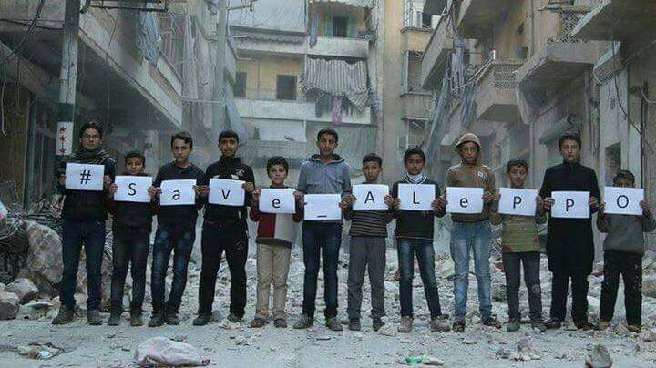
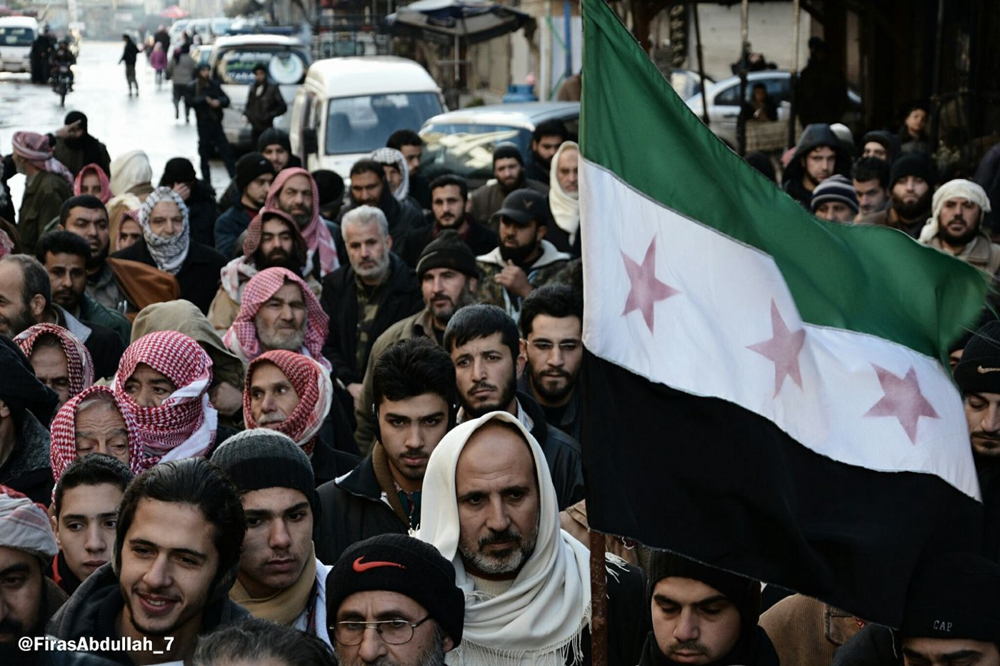
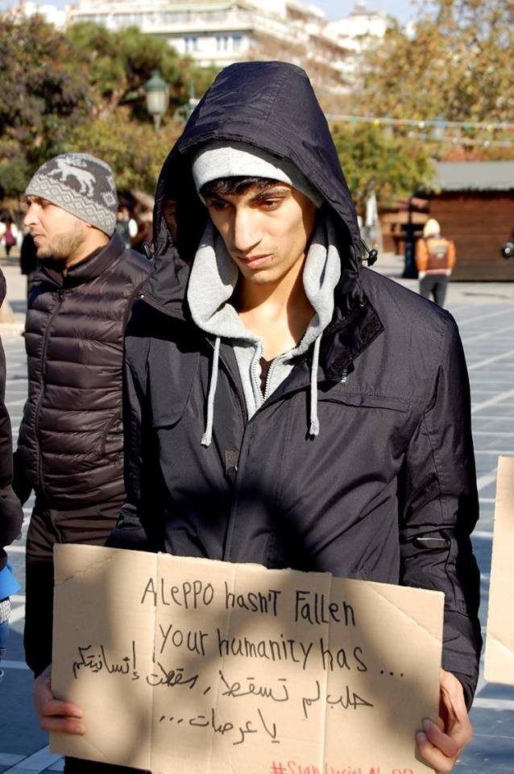
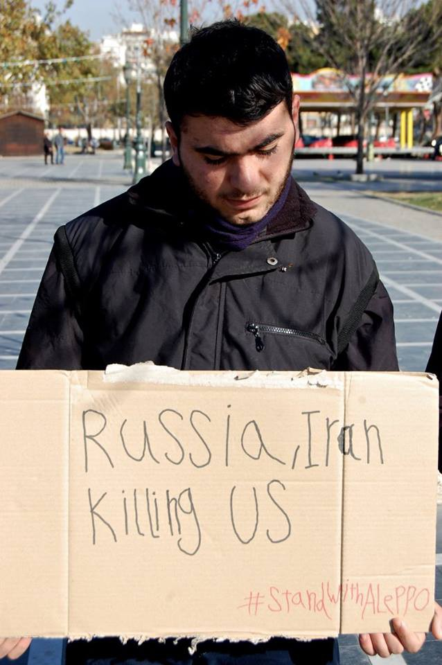
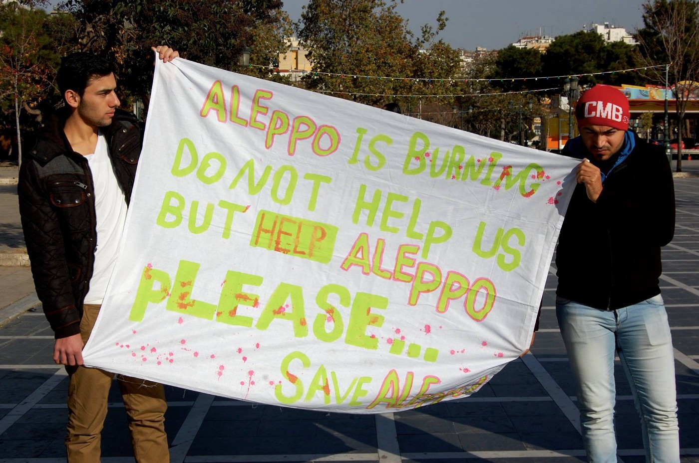
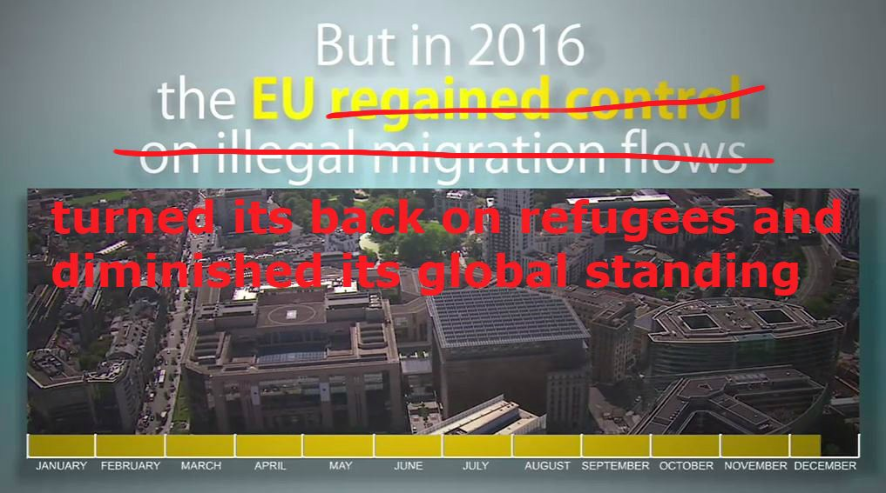

### AYS Digest 14/12: Waiting for an evacuation

_Protests in solidarity with Aleppo planned today, tomorrow, this week\. Unaccompanied minors go on partial hunger strike in France\. Protests against the deportation of Afghan asylum\-seekers in Germany\._

#### Syria
### Latest news from Aleppo

Rebel groups said a new ceasefire would come into effect late this Wednesday and evacuation would follow early on Thursday according to the [BBC](http://www.bbc.com/news/world-middle-east-38323591?ns_mchannel=social&ns_campaign=bbc_breaking&ns_source=twitter&ns_linkname=news_central) \. Yesterday night, the ceasefire seemed not to be holding, but it appears as if evacuations could start today\.

■■■■■■■■■■■■■■ 
> **[Barnaby Green](https://twitter.com/Barnaby_Green) @ Twitter Says:** 

> > Latest video from #Aleppo shoes the ceasfire is NOT holding. #itvnews https://t.co/X3FEA6lNKN 

> **Tweeted at [2016-12-14 21:27:27](https://twitter.com/barnaby_green/status/809147817310769152).** 

■■■■■■■■■■■■■■ 

Yesterday, the first major shock was that the evacuation deal failed to come through, with Iran imposing new conditions, demanding the simultaneous evacuation of wounded people from two villages besieged by rebel fighters\. Aleppo24 also said the Assad Regime had issued a list with 260 rebel commanders that should be handed over before starting evacuations\. The supposed evacuation was quickly replaced by bombings, with Zouhir AlShimale, a freelance journalist in eastern Aleppo, saying he counted more than 100 bombs dropping in on the city within one hour\. Cluster bombs were also allegedly used by the regime\.

■■■■■■■■■■■■■■ 
> **[Zouhir Al-Shimale](https://twitter.com/ZouhirAlShimale) @ Twitter Says:** 

> > Cluster bombs attacks now.. 
#SaveOurSoul 
#Save_Aleppo
We are being killed now!
Maybe will lose the connection shortly. 
#Aleppo https://t.co/CEHxXyY4bF 

> **Tweeted at [2016-12-14 12:41:49](https://twitter.com/zouhiralshimale/status/809015539163168768?lang=fr).** 

■■■■■■■■■■■■■■ 

The U\.N\. High Commissioner for Human Rights, Zeid Ra’ad al Hussein, said that “ _while the reasons for the breakdown in the ceasefire are disputed, the resumption of extremely heavy bombardment by the Syrian government forces and their allies on an area packed with civilians is almost certainly a violation of international law and most likely constitutes war crimes”\._

The Syrian American Medical Society says three of their medical personnel in Aleppo were hit by an airstrike, with two in critical condition\.

The UN stated yesterday that it had received reports of bodies in Aleppo “lying in the streets”, with residents unable to get them out because of the heavy bombardment\. As a result of the heavy shelling, residents of Aleppo have nowhere to sleep, while facing temperatures close to zero degrees at night\.

](assets/f14095248f2f/0*j-lnQyrv_RRggHfo.)

Image by [Abdulazez Dukhan](https://www.facebook.com/AbdulazezDukhan?fref=nf)
### Worldwide Solidarity

While it is easy to feel powerless at this time, there are still things that can be done\. For one thing, protest and make the Syrian government, Russia and Iran feel that the world is watching, and that people still care about what is happening in Aleppo\. This is what people in Aleppo are asking too\.

■■■■■■■■■■■■■■ 
> **[Lina shamy](https://twitter.com/Linashamy) @ Twitter Says:** 

> > HUMANS ALL OVER THE WORLD, DO NOT STOP! ONLY YOU CAN DO SOMETHING.
TO THE STREETS NOW!
#StandWithAleppo
#ToTheStreetsNow https://t.co/ioDgBgxJkY 

> **Tweeted at [2016-12-14 17:54:22](https://twitter.com/linashamy/status/809094194136580096).** 

■■■■■■■■■■■■■■ 

Yesterday, protests already took place in Istanbul, London, Stockholm, Brussels, Malmo, Gaziantep, Amman and Douma, amongst other cities

Protests in Douma, Syria\. Photo by Firas Abdullah

Today, protests took place in Paris, Madrid, Berlin, Barcelona and countless other cities, including Sarajevo, that had a strong message of solidarity, having witnessed similar horrors\.

Tomorrow, this week, and this entire month, protests are planned in public squares and in front of embassies all over the world\.

Tomorrow \(15\.12\.16\), events are planned in [Munich,](https://www.facebook.com/events/942180362580342/?acontext=%7B%22ref%22%3A%223%22%2C%22ref_newsfeed_story_type%22%3A%22regular%22%2C%22action_history%22%3A%22null%22%7D) [Paris](https://www.facebook.com/events/773702236105576/) and [Vienna](https://www.facebook.com/events/156466161497050/) \.

On the 16th, another protest is taking place in [Vienna](https://www.facebook.com/events/387055451634060/) , and a sit\-in will take place outside 10 Downing Street in [London](https://www.facebook.com/events/899257216843600/) from the 15th to the 17th while a march for Aleppo will take place on the 17th in [London](https://www.facebook.com/events/179292665870670/) as well\. Please consider joining one of theses protests, creating one yourself and informing friends&family\.

Please also consider following [Day of Solidarity with Syria](https://www.facebook.com/solidaysyria/) and [SyriaCalendar\.com](http://syriacalendar.com/) to remain up\-to\-date on solidarity events all over the world\.

Salah Ashkar, a Syrian activist says “everyone in Aleppo city now is depending on you to put pressure on your governments to protect them from being killed or captured by the regime”\.

■■■■■■■■■■■■■■ 
> **[Karim Serjieh](https://twitter.com/KarimSerjieh) @ Twitter Says:** 

> > Everyone in Aleppo city now is depending on you to put pressure on your governments to protect them from being killed or captured by regime https://t.co/BkzdTxE4vw 

> **Tweeted at [2016-12-13 14:55:55](https://twitter.com/salahashkar/status/808686896813637632).** 

■■■■■■■■■■■■■■ 

#### Greece
### Refugees in solidarity with Aleppo

In Thessaloniki, residents from the Sindos, Softex & Oreokastro camps also came together to protest for family, friends and to stand in solidarity with the people of Aleppo and Syria\.

¨Photo by Eleanor Yankah

¨Photo by Eleanor Yankah

¨Photo by Eleanor Yankah
### Many sites still “not fit for living in during winter”

In Lesvos, 48 new refugees were registered until this morning, while one boat with 44 people landed on the north coast of the island\.

In a [joint statement](http://www.ecre.org/joint-statement-eu-leaders-can-save-lives-in-winter-if-they-change-migration-policies/) ahead of the Thursday’s European Council, NGOs called on EU states to make changes so that the EU “ manages migration with respect to human rights and prevents unnecessary suffering”, saying living conditions “do not meet even the most basic standards of dignity or safety” while “many sites are not fit for living in during winter”\.

Image by Judith Sunderland

Samos, faces this harsh reality\. “ [No more borders, no more tears](https://www.facebook.com/No-more-borders-No-more-tears-1254181771265187/) ”, is calling for help, as temperatures continue to drop on the island, while people continue to sleep in flimsy pop\-up tents\. Tents that are barely good enough to go camping for two days, have been the home of entire families for several months\. The duo of Irish volunteers says the “ elderly, sick and injured are facing yet another night of pain, cold, wind and little else”, and calls for donations on its [Gofundme page](https://www.gofundme.com/https-no-more-borders-no-more-tears-2tuhg) to make living conditions a little more bearable\.

The real solution would be to relocate refugees to the mainland and to the rest of Europe, but this is unlikely to happen anytime soon\.

](assets/f14095248f2f/0*tqy4wYV2f-ac5npE.)

Photo by [No more borders, no more tears](https://www.facebook.com/No-more-borders-No-more-tears-1254181771265187/)
### More calls for help by volunteers and NGOs\.
- Be Aware and Share \(BAAS\), who runs the school for refugee children in Chios, calls for 400 Godfathers/Godmothers to support its coordination team of five people, through a monthly contribution of 35 CHF/EUR/GBP for one year\. This will allow the coordination team to pay for free accommodation and transportation of volunteers, as well as for unexpected expenses if donations run low\. The school has been [widely praised](http://www.independent.co.uk/news/world/europe/refugee-school-chios-greece-lessons-in-life-for-the-migrant-children-a7229916.html) and relies entirely on volunteers, who often need some form of support in order to be able to remain on the island and continue their work\. More info can be found on their [Facebook page](https://www.facebook.com/refugeeeducationchios/) \.
- The Mobile Info Team is calling for [donations](https://www.youcaring.com/mobileinfoteam-713068) to continue providing legal aid and updated information to refugees in Northern Greece\.
- A support group for LGBT refugees in Athens now offers “fully confidential and comprehensive support service with professionally trained English, Arabic and Farsi speaking staff”\. The group encourages volunteers to share its phone numbers, Facebook group details, and email address as widely as possible:

\+30 694 524 76 13 \(Arabic العربية/English\) 
\+30 694 859 43 77 \(Farsi فارسی/English\)

LGBTrefugeesgreece@gmail\.com

[www\.facebook\.com/groups/LGBTrefugeesgreece](https://www.facebook.com/groups/LGBTrefugeesgreece/)

The group also offers medical help, legal advice, counseling, social activities and a ‘safe space’ drop\-in centre in Athens\.
### 12 Scholarships available for refugees at the Hellenic Open University

12 scholarships for refugees are being awarded at the Hellenic Open University in the fields of humanities and social sciences\. The duration of the funding is twelve months and the total amount per scholar is €10\.000\. The deadline is the 23rd of December 2016, a master’s or doctoral degree in social sciences is necessary for most positions and all require at least some knowledge of English or Greek\. More information [here](https://www.eap.gr/images/stories/pdf/call-sub-ref.pdf) \.
#### France
### Unaccompanied minors go on partial hunger strike

[The Guardian](https://www.theguardian.com/world/2016/dec/14/calais-child-refugees-on-partial-hunger-strike-after-transfers-to-uk-stop) reports a group of 12 unaccompanied minors cleared from the Calais camp have gone on partial hunger strike, after reading in newspapers that the process of reuniting refugee children with family members in the UK had ended\. While a team from the Home Office met with the teenagers in their reception centre on the 15th of November, the team has not been heard of since, despite the children having a legal right to enter Britain — two of the boys have spent a year and eight months in the Calais camp and have brothers in the UK that they could join\.

Many children in France are now in a similar situation, having been brought to reception centres under the false promise that their case would be processed\. Many will now go back to northern France and once again risk their lives trying to join the UK, despite being entitled to legal and safe routes into the country\.
### Update on Paris

In Paris, the makeshift camp in St Denis has still not been evacuated\. One volunteers says refugees are waiting and hoping to be brought somewhere warm\.

Meanwhile, in the centre Jean Quarré in Paris, a young refugee tried to take his life, with the association BAAM saying that the centre “weighed him down”, adding that he was not supported by the institutional bodies that manage the shelter\. BAAM also denounced the deplorable living conditions in most of these shelters, with the “crushing system and lack of perspectives making a lot of victims among migrants’\.
#### Italy
### Tunisian captain sentenced to 18 years after death of 700 refugees

The [New York Times](http://www.nytimes.com/2016/12/13/world/europe/italy-migrants-libya-shipwreck.html) reports a Tunisian captain who was piloting a fishing vessel crammed with migrants that collided with another ship, resulting in the deaths of about 700 people traveling to Italy from Libya, was sentenced on Tuesday to 18 years in prison — only 28 survivors were found after the captain steered the fishing boat into a Portuguese freighter, off the Italian island of Lampedusa\.
### Refugees forced to sleep in the streets of Como

In Como, at the Swiss\-Italian border, 54 migrants were found in the streets yesterday night by freezing temperatures, including two minors\.

](assets/f14095248f2f/0*lX9j9vX1Bw1zCt-A.)

Image by [Como senza frontiere](https://www.facebook.com/comosenzafrontiere/)

The information bulletin of [Progetto20k](https://www.facebook.com/progetto20k/?fref=nf) says the Red Cross Centre in Como seems overcrowded and imposes rigid hours, forcing many to sleep in the streets\. The group also says that an Eritrean minor attempted to hang himself in a container a few days ago, due to the inhuman conditions in which migrants are forced to live\.

Baobab experience based in Rome, visited Como last week and says 70 people were sleeping in the streets at that time\. The group also criticizes the lack of space in the “institutional camp’ and the lack of cooperation with informal groups\.
#### Germany
### Protests against the deportation of Afghan asylum\-seekers

The German newspaper [FAZ](http://www.faz.net/aktuell/politik/inland/protest-gegen-geplante-sammelabschiebung-nach-afghanistan-14574057.html) reports the planned deportation of a group of 50 rejected Afghan asylum\-seekers has led to massive protest from human rights organisations with pro\-Asyl calling the deportations ‘irresponsible’, noting that regions that are safe today, might not be safe tomorrow\.

[DW](http://www.dw.com/en/german-high-court-stops-one-afghan-deportation-dozens-more-go-ahead/a-36769820) reports that the Constitutional Court postponed the deportation of an Afghan man until he can complete an application for asylum, but did not stop the deportations of some other 34 Afghans\.
### New German language course through Whatsapp

For refugees wishing to learn German, [WhatsGerman](http://www.whatsgerman.de/whats_app_sprachkurs_eng.html) might be the perfect point of entry\. It offers free classes over Whatsap, with the first course focusing on the alphabet and with the third and last one focusing on German grammar\.

_Converted [Medium Post](https://areyousyrious.medium.com/rebel-officials-say-a-new-ceasefire-is-to-come-into-effect-late-this-wednesday-and-evacuation-would-f14095248f2f) by [ZMediumToMarkdown](https://github.com/ZhgChgLi/ZMediumToMarkdown)._
