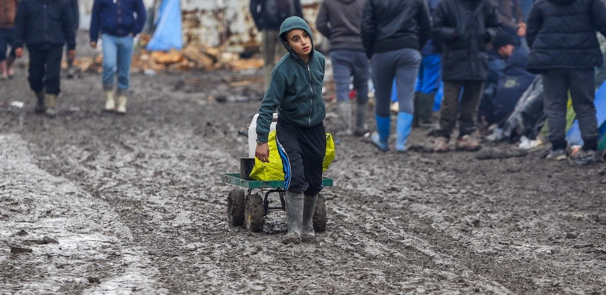
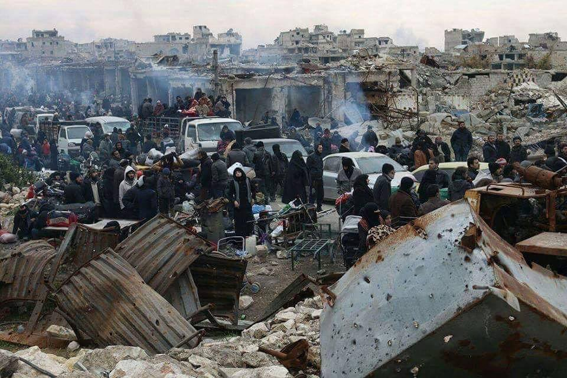
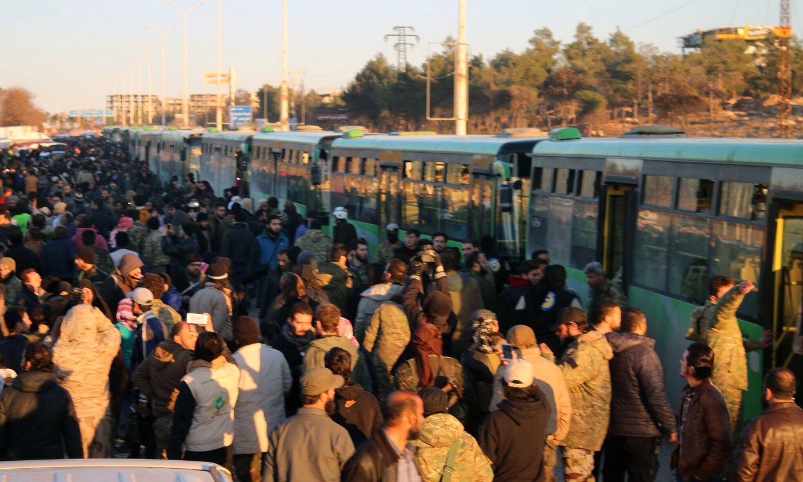
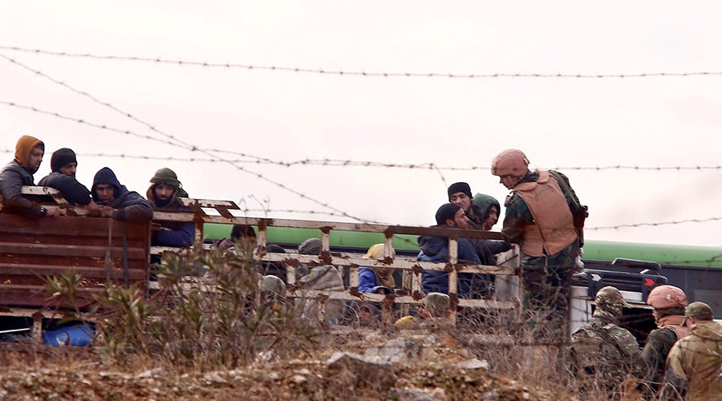
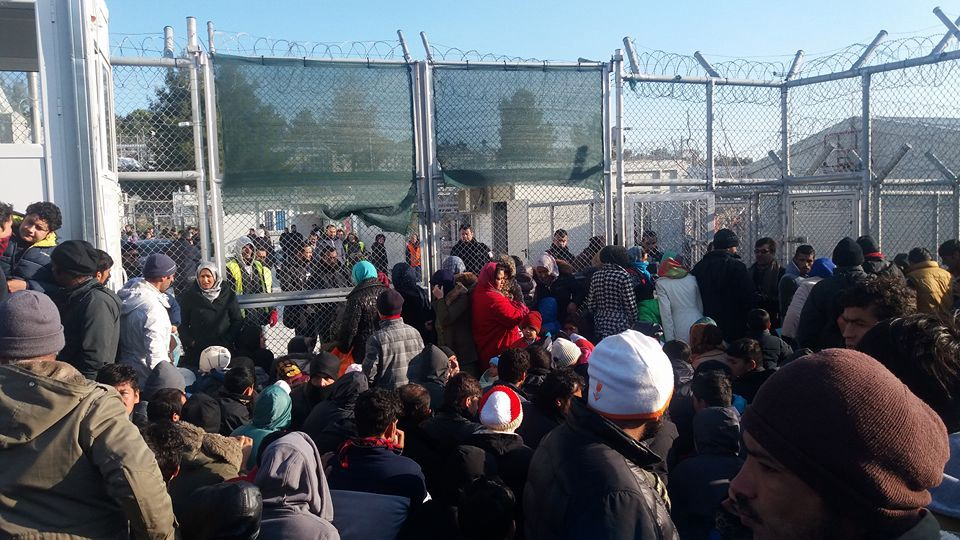
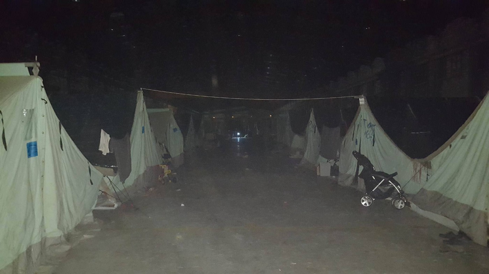
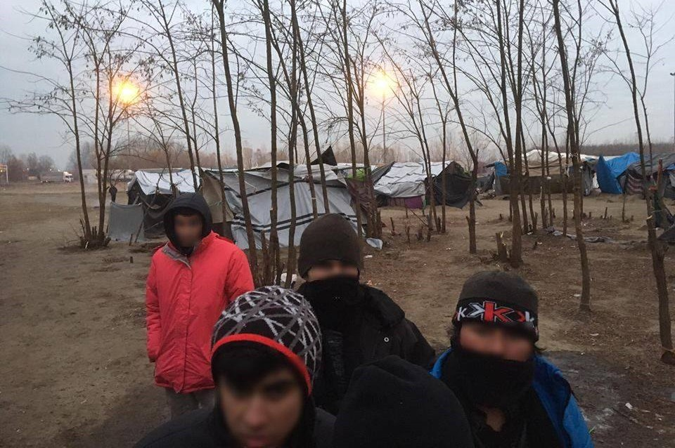
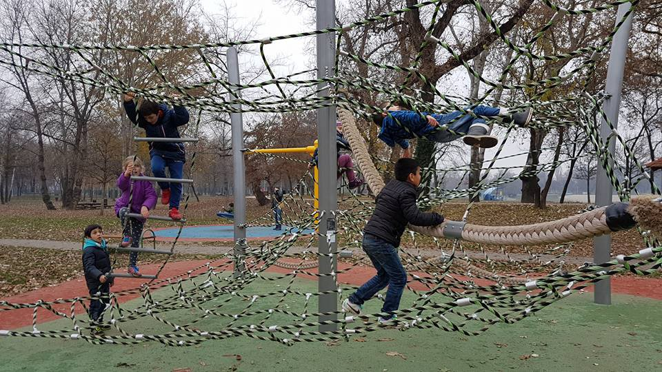
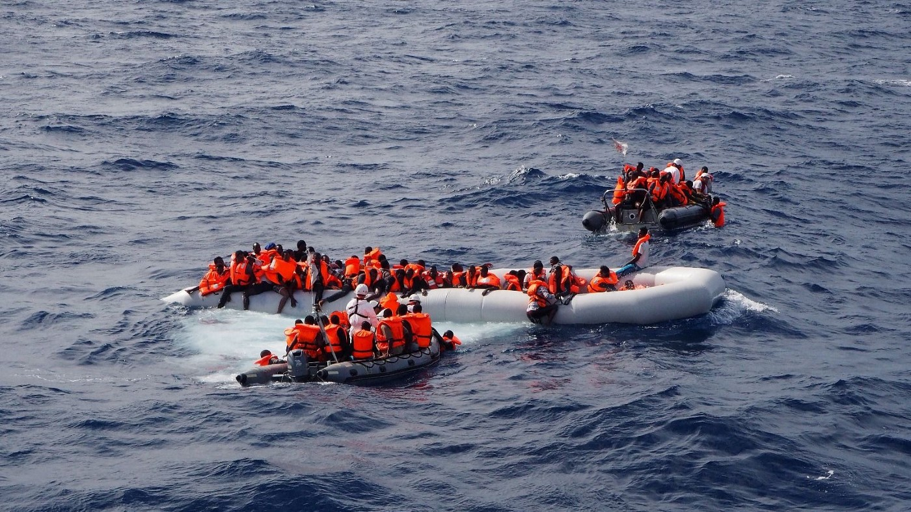
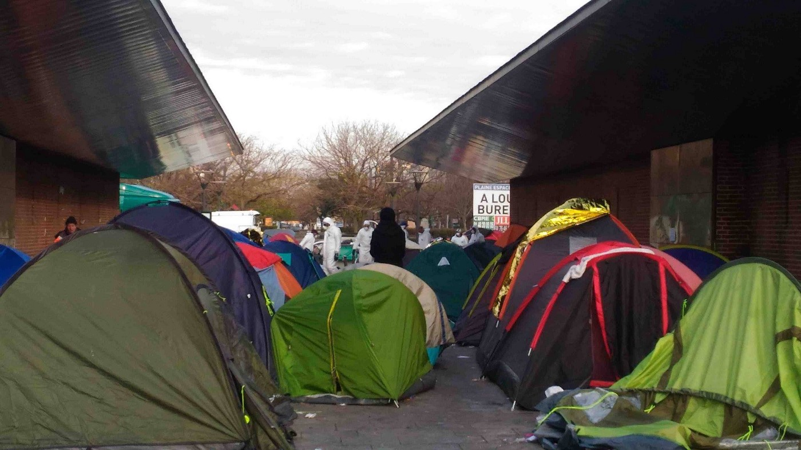

### AYS 16/12: UK rejects all remaining asylum claims for refugee children in France
#### Evacuation of eastern Aleppo on hold, with Russia “screening extremists from moderate rebels\.” Streets of Thessaloniki almost empty, power shortages in Oreokastro\. People sleeping rough at \-7° C, hoping to enter Hungary\. Croatian police keep silent about push\-backs to Serbia\. Frontex ties NGO’s to smugglers in a leaked report\. 500 refugees fled evacuation of Saint\-Denis camp\. Undocumented refugees in Amsterdam protest eviction\.

A total of 750 children have been brought to the UK, but there were 1,900 registered after the Calais refugee camp was demolished\.
#### End of the hope
### UK rejects hundreds of Calais children asylum claims, transfer of children from France officially ended

According to [The Guardian](https://www.theguardian.com/uk-news/2016/dec/16/hundreds-calais-child-refugees-uk-asylum-claims-rejected-home-office?CMP=Share_iOSApp_Other) , hundreds of child asylum seekers in France who had been expecting to come to the UK have been told that the Home Office has rejected their claims\. The children and teenagers dispersed from Calais in October have been advised to lodge their applications in France instead\. **The Home Office confirmed that the transfer of children previously in the Calais camp and now in French reception centres had ended\.**

> “The current phase of transfers is being concluded\. This is a planned process, done in conjunction with the French authorities\. We have interviewed all the children who were transferred from the camp to the children centres in France\. Those transferred to the UK include all Dublin cases where the family relationship has been verified,” a Home Office spokeswoman said\. 

According to the volunteers and lawyers who representing the refugee children scattered around France, the unaccompanied kids who asked for asylum in UK are now in a extreme state of distress\. Many are already considering embarking on a dangerous illegal trip towards the UK\.

**A total of 750 children have been brought to the UK, but there were 1,900 registered after the Calais refugee camp was demolished** \. The Home Office has said that “more unaccompanied children were undergoing initial screening in Italy and Greece and may also be brought to the UK\.”
#### Syria
### Evacuation of eastern Aleppo on hold after armed militiamen stop the convoy

Civillians, including women and children, in the convoy that was stopped and sent back to eastern Aleppo\.

At least 8,500 people, including about 3,000 thousands rebels and 360 medical cases, were able to leave eastern Aleppo and reach Rashdin, west of Aleppo, before the evacuation was put on hold\. The Russian Defense Ministry’s Center for Reconciliation claims all of the women and children have been evacuated, but many other sources say that a convoy of hundreds of people who left the rebel areas of Aleppo using ambulances and cars, have been returned to the city after being stopped by a Hezbollah checkpoint southwest of Aleppo\.

> Soldiers and tanks advanced towards the convoy, encircled it, expelled the Red Crescent and ICRC and started firing at it\. Four people were killed and six injured\. The convoy was held hostage for hours and all civilians had their remaining possessions taken\. White Helmet’s vehicles and ambulances were confiscated\. All those on the convoy were then forced to walk back into the besieged eastern Aleppo, according to the White Helmets 

Remaining rebels and civillians gathering around green government busses, hoping to be allowed to evacuate\.

Later today, **the evacuation was officially suspended by the Assad regime\.** According to the International Committee of the Red Cross, several more days are needed to evacuate all of the remaining civilians from the city\.
### Russia “screening extremists from moderate rebels”

**Russian reports regarding the treatment of those left in the city raises much concern, as no explanation has been given about who decides if people are “terrorists” or “moderate opposition\.”** These are the direct quotes from Russian officials, according to the pro\-regime website Russia Today:

> “The operation by the Syrian Army aimed at liberating the militant\-controlled neighborhoods of eastern Aleppo has been completed\. The Syrian government forces continue to eliminate isolated pockets of militant resistance”, the Russian Defense Ministry’s Center for Reconciliation has stated\. During the liberation, over 3,400 rebels from the moderate opposition voluntarily surrendered, around 3,000 of which will receive amnesty pending security checks\. The vast majority of them have been taken outside the city limits in the last few hours\. This completes the separation of the moderate opposition from the terrorists”, Russian General Staff head of operations Sergey Rudskoy has added\. 

Russian soldiers checking men who were al who were transfered to the government\-held area of al\-Ramousah bridge
### Evacuated people arriving “in bad condition”

Médecins Sans Frontières \(MSF\) is providing support to the humanitarian evacuation of east Aleppo\. Yesterday, medical and logistics teams conducted a first assessment in the area\. According to today’s [statement](http://www.msf.org/en/article/syria-msf-sends-medical-supplies-wounded-evacuated-east-aleppo) , doctors supported by MSF inside east Aleppo are safe and they were taking part in the evacuation of the sick and wounded\. Three MSF teams visited Sarmada and Al Atareb today to assess the situation of those newly displaced people and to identify their primary healthcare, food and shelter needs\. Medical staff in contact with MSF had reported that people were arriving in bad condition after having lived under siege in east Aleppo for five months\.
#### Greece

71 **new refugees were officially registered in Greece today** , including 24 on Lesvos, 43 on Chios and 4 on Samos\.

Today, refugees have held aprotest against UNHCR ineffectiveness inside overcrowded Moria camp\. Photo: Qasim Khan
### People leaving Thessaloniki, streets almost empty

Following several hard months for the refugees who have been sleeping rough in Thessaloniki, the streets seems to be almost empty now\. Volunteer groups are still present to monitor the situation and support those who pass through the area\. Refugees that reside in nearby camps also still rely on their assistance\.

> They’ve gone to try to cross the borders — the people from the streets\. That abandoned building where they’ve been living in the past few months is the most horrible place I’ve seen refugees living in the northern Greece, said one of our most reliable volunteer contacts in the city\. 

### Power outages cause trouble in Oreokastro

During power outages the camp is pitch black, cold, and not safe for its residents\. Photo: Erika Rudash

Our friends in Oreokastro are still having big power issues\. The electricity keeps going on and off, and most of the time the camp is cold and pitch dark\. It’s not safe for the children — for anyone, really\. The problems with electricity have been happening for the last couple of weeks\. Tonight, volunteers saw military workers trying to get power grid running\.

> **Donations and volunteering positions in Greece:** 

**City Plaza Hotel** has started a new [fundraiser](https://www.youcaring.com/refugeeaccommodationandsolidarityspacecityplaza-716186) to continue their operations\. Currently the squat, located in a hotel building in the heart of Athens, hosts 165 children, 100 men, and 115 women, as well as 35 locals, activists and volunteers\.

**Get Shit Done team** needs volunteers\. They are focused on improving infrastructure in Northern Greek camps\. No particular skills are required, but masons, carpenters, plumbers and welders are especially encouraged to apply\. Send them a private message on [their FB page](https://www.facebook.com/pg/The-Get-Shit-Done-Team-304001796641127/about/?ref=page_internal) \.

**Elpida Home,** which provides alternative housing in the outskirts of Thessaloniki, is recruiting new volunteers\. All volunteering is done through the coordination of ERCI\. In order to apply, fill out the [ERCI form](http://www.ercintl.org/volunteer/) and select “Thessaloniki” and “In Camp Volunteer Coordination\+Logistics Support”\.

](assets/f2fa4ab58a44/1*t5kT6BrDUDCF-cbrwH8RsQ.jpeg)

A small reminder: Despite being overwhelmed by big human tragedies, we shouldn’t forget how even the smallest acts of kindness can mean a lot for those who are left with nothing\. Kids enjoying solar\-powered creative kits and donations of toys in Alexandreia camp\. Photo: [Refugee Support Greece](https://www.facebook.com/RefugeeSupportGreece/)
#### Serbia
### People sleeping rough as temperatures drop to \-7° C

Temperatures have reached \-7°C in central Serbia, but many people, especially young single men, are still sleeping on the streets of Belgrade\. [Hot Food Idomeni](https://www.facebook.com/Hotfoodidomeni/) is still distributing food to those who are not accommodated in the camps\. MSF is also monitoring situation in the squats\. [Miksaliste](https://www.facebook.com/RefugeeAidMiksaliste/?fref=ts) provided services 316 people today: 31 men, 18 women and 267 children\.

In Northern Serbia, around 150 people are sleeping in the open, hoping to cross the border into Hungary\. Some of them are spending their days in Kelebija Community Center which is run by Northstar, and supported by MSF and AYS\. Now they need emergency winter funding to keep running, so please consider contributing to their [fundraiser](https://www.youcaring.com/kelebija-community-center-675966) \.

Young refugees hoping to be admitted to Hungary despite ever changing rules and quotas\. Photo: MigSzol

During the past weeks, Hungarian solidarity group MigSzol has also supported hundreds of asylum\-seeking families in front of the Röszke and Tompa transit zones \(named Horgoš and Kelebija on Serbian side\) \.

> These people do not give up waiting, they are patiently waiting for their turn\. They do not try to enter Hungary with the help of smugglers or by other illegal means, but nevertheless, they are in the hardest situation, and among the most inhumane conditions\. According to data from UNHCR, the number of refugees waiting for admittance in front of the Hungarian transit zones is not decreasing, still, the Office of Immigration and Nationality, following governmental orders, a few weeks ago dropped the number of applications registered daily, practically as winter was approaching\. When the zones were set up, each registered 50 claims daily; this number was later lowered to 30, 20, 15, and to 10 this autumn\. The last figure applies only to weekdays — since November, there is no administration on weekends\. In our opinion, this measure means no reduction of costs for the government of Hungary, but at the same time, it obviously directs immigrants and refugees towards illegal ways, which is clearly harmful and dangerous for all parties, except for smugglers, MigSzol warns\. 

#### Croatia
### Police keeps silent about push\-backs to Serbia

Ten days ago, AYS was asked to support refugees who arrived to Zagreb, only to learn they had been swiftly returned back to Serbia\. This was not the first time we’ve learned about push\-backs from Zagreb or other cities in inner Croatia, in addition to countless accounts of \(not officially confirmed\) push\-backs from border areas\. However, one of the refugees who was recently pushed back to Serbia offered a detailed testimony of what happened, including a piece of paper with the address of police station where he tried to ask for asylum\. Before he was brought back to the border and told to walk the rails until he reached Šid train station, Croatian police allegedly told him to sign a document, which he did, not knowing what he was signing\. Both CMS and AYS have asked for official explanation of the incident, as there was no official report on police website, where every big or minor incident is usually listed\. We’re still waiting for the response\.

Refugee kids playing in a public park in Zagreb under supervision of AYS volunteers\. Photo: Asja Korbar, AYS

Meanwhile, we continue our daily presence in the Porin refugee hotel in Zagreb\. Our volunteers organise workshops and classes for children, sports activities, visits to cultural events etc\. We also distribute donations and provide support in the asylum\-seeking process and integration\. If you’d like to support our work, Rando Wagner has generously set up a [fundraiser](https://www.gofundme.com/areyousyrious) for us\.
#### Mediterranean
### Frontex denies tying NGOs to smugglers after a leaked report causes uproar in the press

The EU’s border agency has accused charities operating in the Mediterranean of colluding with people smugglers, according to confidential reports described by the Financial Times\. According to the [article](http://on.ft.com/2gUufYI) , Frontex put its concerns in a confidential report last month, raising the idea that refugees had been given “clear indications before departure on the precise direction to be followed in order to reach the NGOs’ boats\.” The agency made the accusation explicitly in another report last week, which stated: “First reported case where the criminal networks were smuggling migrants directly on an NGO vessel\.” Elsewhere in the reports, which are shared among EU officials and diplomats, Frontex says people rescued by NGO vessels were often “not willing to co\-operate with debriefing experts at all” with some claiming “that they were warned \[by NGOs\] not to co\-operate with Italian law enforcement or Frontex\.” Following a well deserved uproar, Frontex retracted these claims\.

Frontex claimed that smugglers were forwarding the rubber boats precisely towards NGO vessels\. Photo: MSF sea

> The title of the article published by FT does not reflect the content of the report and is damaging to our relationship with NGOs\. Please note that in no part of our report do we say that the NGO vessels are “colluding with the smugglers\.” Frontex has responded to multiple media requests for clarification\. 

However, this wouldn’t be the first time Frontex has linked NGO efforts with smuggler activities\. Two Danish volunteers and three Spanish lifeguards were arrested in a joint operation of Frontex and Greek police in January, for towing a stranded dinghy with 51 refugees in Aegean sea\. Despite no clear link to any sort of smuggling activity, their charges might result in prison sentences of up to 10 years\. One of the arrested volunteers was not allowed to leave Greece after initial hearing\.
#### France
### 500 refugees fled evacuation of Saint\-Denis camp

Police took 250 people to emergency shelters and swiftly took down their tents\. Photo: Le Journal de Saint\-Denis

According to [Rastplatz](https://www.facebook.com/rastplatz/?rc=p) group, the previously announced eviction took place in Saint\-Denis Camp northeast of Paris\. Around 250 people have been taken to emergency shelters, while 500 fled and are currently spread across the city \. Police broke down makeshift camps to prevent the refugees from returning\. A small group of volunteers managed to save some tents, blankets and sleeping bags to reuse them in the future\.
#### Netherlands
### Undocumented refugees protest their eviction

After being forced to leave the squat where they were staying, a group of undocumented refugees that have been refused asylum held a peaceful march in Amsterdam\. They walked from the Torensluisburg Bridge \(Singel 165a\) towards the Vredeskerkplein \(Peace Church Square\) via the mayor’s house and the IND office to the square, where a manifestation held place with speeches, food, music and candle lights\. With this demonstration and manifestation, the group We Are Here hopes to engage in a dialogue with the mayor to find a solution together\.

After struggling for four years and surviving twenty evictions, the building’s residents were once again evicted this Thusday\. After the eviction, the group organized a sit\-in/sleep\-in in front of Hoogte Kadijk 401, a building that is owned by the government and where a few anti\-squatters live\.

](assets/f2fa4ab58a44/1*7eqLByVtAzwWhT7fsIFU9w.jpeg)

After the eviction the group organized a protest march to the Peace church square\. Photo: [**Wij Zijn Hier**](https://www.facebook.com/WijZijnHier/)

_Converted [Medium Post](https://areyousyrious.medium.com/ays-16-12-uk-rejects-all-remaining-asylum-claims-for-refugee-children-in-france-f2fa4ab58a44) by [ZMediumToMarkdown](https://github.com/ZhgChgLi/ZMediumToMarkdown)._
