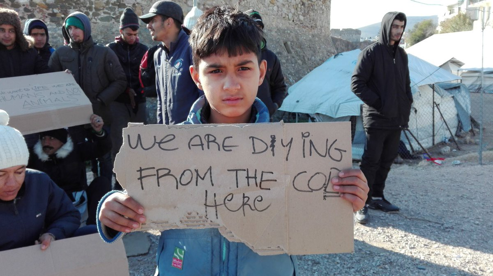
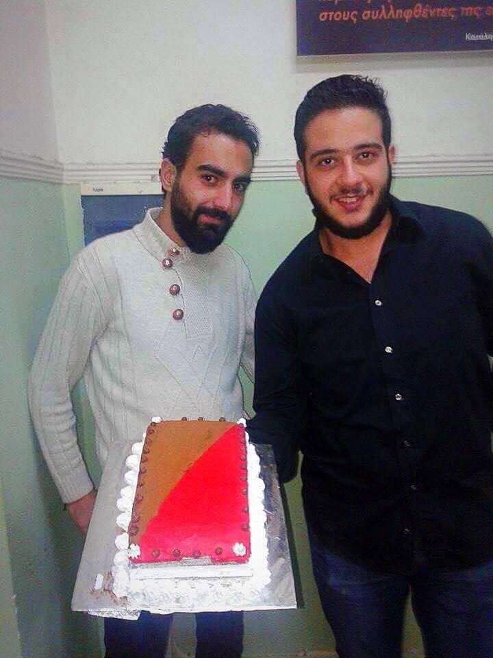
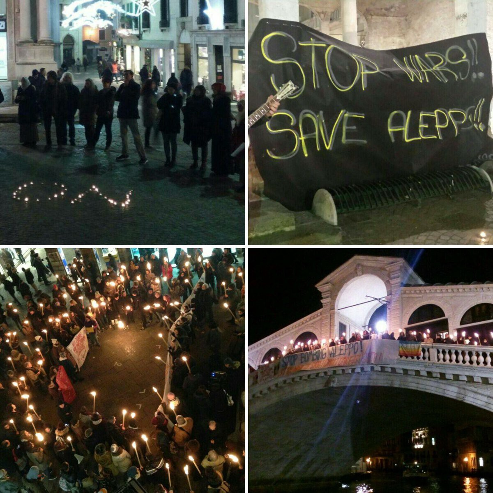

### **AYS Daily News Digest 19/12: Despair grows in Greek camps without electricity**
#### _Still no electricity in some Greek camps \|Temperatures across Europe could be deadly for all those sleeping on city pavements and in abandoned buildings \|Evacuation continues in Syria \| Other countries follow Germany’s lead in sending people back to Afghanistan \| Italy stands up for Syria; volunteers in Como overwhelmed, demanding action\| Swedish organizations fear young refugee boys are selling sex to survive \|_

](assets/f2a8e62ad55/1*uAsRRvD7cqP6klggr2dxfg.jpeg)

Photo source: [Theurgia\_Goetia](https://twitter.com/Theurgia_Goetia)
#### GREECE
#### Chios
### People on Chios feel trapped, with no possibility to wash, warm up or feel safe

> “When the infrastructure of the camp site is unable to properly provide electricity to address the most basic of needs like warmth and hot water for heating and hygiene\.
 

> When the responsible parties are slow in addressing a pressing issue of a proper hosting site, playing pass the parcel, and sub\-standard attempts at “winterisation\.” Because no one got the memo that cold tends to set in from November — February\.
 

> When it is 4 degrees and all they are being told is to try to wrap themselves in another blanket\.
 

> When the responsible authorities refuse to respond in providing a more dignified solution\. 

> This caused:
 

> Men, women, children to be unable to wash for weeks\.
 

> The camp to be plunged into darkness after the sun sets in winter, heightening risks to women, causing them to be too scared to go to the toilet in the night\.
 

> This is when institutions and authorities strip human beings of their dignity\.” — by Chios\-based volunteer [Gabrielle Tan](https://www.facebook.com/gabrielle.tan) 

News That Moves visited Chios recently to investigate the living conditions of the refugees there\. Residents in Souda camp, mostly families or groups of single men, are hosted in prefab plastic shelters\. The shelters have a slightly raised floor but no insulation on the hard plastic walls\. Some residents are hosted in large tents, even in winter\. The NTM report, stating the main issues, is available [here](https://newsthatmoves.org/en/souda-camp-an-insight/) \.
#### Oraiokastro
### Still no electricity

We have been covering Oraiokastro’s electricity crisis for the past few days, and there is no end in sight for the problem\. Alternate solutions such as upgrading the installations on site, providing diesel generators or moving people to a safer and better place brought about no reaction from the officials capable of solving the matter\.

> “The lack of electrical capacity is at the heart of all the problems here\. 
 

> Until someone fixes that or moves us there will be protest and despair here\.” 

> — Residents of Oraiokastro 

### Breathing troubles due to ‘winterisation’ solutions

The NGOs responsible for site management at Oraiokastro were “given a directive” by the Ministry that they should implement a plan for ‘winterisation\.’ Refugees living in the camp are complaining about the poor solution that has been imposed\. Many people are now unable to breathe properly due to the insulation material that has been installed on top of the tents in the cold, dark halls\. NGO representatives claim that a lack of funds is preventing them from making good on their earlier promise to prepare the place for winter\. NRC stated they can “carry out maintenance and repairs only\.”

](assets/f2a8e62ad55/1*4R7RgK-GUYFPIHe-RJL-BA.jpeg)

Photo: [The Voices of Oraiokastro](https://www.facebook.com/ThevoicesofO/)

 \)](assets/f2a8e62ad55/1*ljFf-QwUByDreQOb9RrgXg.jpeg)

Somebody always cares\. These are some of the messages that came from people in the UK\. This brought back smiles on the faces of people in Oraiokastro, who say ‘thank you’ to their distant friends\. \(Photo: [The Voices of Oraiokastro](https://www.facebook.com/ThevoicesofO/) \)
#### Thessaloniki

Micropolis Social Space provides food, shelter, support and friendship to refugees and locals in need in the city of Thessaloniki\. This beautiful initiative between locals and their Syrian friends means that as refugees wait for the relocation process to untangle, biding their time until they can move on with their lives, they are not just left to sit and wait\.

Photo by: Αλληλεγγύη σε Πρόσφυγες/Μετανάστες Μικρόπολις

> “A new working structure begins today at Micropolis Social Space for Freedom\. Our new bread and pastry workshop\! Nizar and Yehea from Syria, two of our guests, after spending months waiting for their relocation, decide not to just wait anymore but create, work, become autonomous\. We, as a solidarity group, offered them the place that they can make their ideas come true\. Let’s all support this initiative\! Their products are available in our Syntrofia at the 1st floor of Micropolis, Vasileos Irakliou 18 & Venizelou, Thessaloniki\.” 

#### Cherso — Kilkis — Polikastro

Our friends from the Open Cultural Centre have been successfully providing the children of Mazarakis camp in Cherso with informal education, in the form of cultural, social and educational activities, since the beginning of last summer\. After the closing of the camp in Cherso, residents were relocated to other parts of Greece or given better lodging in neighboring Polikastro and Kilkis\. The Open Cultural Centre team is continuing to give classes in Polikastro and they hope to be able to offer educational programmes in both Kilkis and Polikastro if they manage to open centres there\.

Their story is told in a short film here\. If you are an English or German teacher wishing to join the team for at least a few months \(preferably long term, 4 months\), contact them\. They also need a lot of support in order to continue the good work they are doing with children and adults in the north of Greece — don’t hesitate to support their mission\.

#### Arrivals

Frontex found 9 people on board a boat that reached the north coast of Lesvos this morning\. Locals report that everyone is safe\. 87 people were officially registered on Lesvos today\. 26,000 people have been registered on the Greek islands since the EU\-Turkey deal was signed\.

](assets/f2a8e62ad55/1*AfcpJqBd66xCMyqo4Ujx9A.jpeg)

“The hours of consecutive operations in 2016\. Regardless of the weather conditions or emergency incidents our teams, both in Lesvos and in Thessaloniki, have been operating almost non\-stop the last year\. We couldn’t have done this without our devoted and very competent volunteers who managed to handle and overcome all sorts of situations, providing safety, whether this is rescue or access to education to more than 45,500 refugees\.” — [ERCI — Emergency Response Centre International](https://www.facebook.com/ercintl/)
#### SYRIA
### Many sleep in the streets of eastern Aleppo, waiting to be evacuated, in extremely dire conditions

Nearly 50 children who were trapped in an orphanage in eastern Aleppo were evacuated as dozens of buses carrying evacuees from the last rebel\-held district of Aleppo travelled to opposition\-controlled areas outside the city early on Monday\. Turkey said that about 20,000 people have been evacuated from eastern Aleppo so far, as a fragile ceasefire between rebels and government forces was holding, [the media report](http://www.aljazeera.com/news/2016/12/east-aleppo-evacuations-161219040452388.html) \. The Syrian Observatory for Human Rights said that an estimated 500 people had been evacuated from Fuah and Kefraya\.

In the meantime, the UN Security Council has voted unanimously to approve a joint text from France and Russia for UN observers to monitor the evacuation of civilians from Aleppo, [stating](http://m.dw.com/en/un-security-council-unanimously-backs-sending-monitors-to-aleppo/a-36831076) the importance of the international presence\.

Turkey has made preparations to accommodate around 1,000 [Syrian refugees](https://www.alaraby.co.uk/english/news/2016/12/18/syria-evacuations-postponed-after-buses-torched-in-idlib) from East Aleppo in the southern Turkish city of Reyhanli, a statement [released](https://www.alaraby.co.uk/english/news/2016/12/19/turkey-prepares-to-receive-1-000-aleppo-refugees?utm_source=twitter&utm_medium=sf) on Monday said\. It added that officials conducting the Turkish aid effort are also exploring the possibility of setting up camps within Syria’s borders\.
#### SERBIA
#### Volunteers wanted in Preševo with the [**Borderfree Association**](https://www.facebook.com/borderfreeassociation/?rc=p)

> From the beginning until the middle of January and from February we are looking for volunteers who are willing to join us at Preševo \(Serbia\) \.
 

> Are you available for at least a week?
 

> Are you at least 20 years old?
 

> Do you speak English?
 

> Are you easygoing, flexible, and a team\-player?
 

> We are looking forward to hearing from you:
 

> info@border\-free\.ch 

#### ITALY
#### Gatherings in support of Aleppo

People in many Italian cities and towns gathered on Monday to host marches and protests against the violence and destruction that is taking place in Syria and to support the people of Aleppo\. \(See [here](http://www.globalproject.info/it/in_movimento/tante-piazze-in-sostegno-della-popolazione-siriana-contro-massacri-guerra-e-fondamentalismo/20549) \. \)

### Como demands a welcome

Volunteers from the Italian organization [Como senza frontiere](https://www.facebook.com/comosenzafrontiere/) and the local branch of Caritas have sent an open letter to the mayor demanding a change in the way new arrivals are treated\. The letter explains that the number of people denied access to the Via Regina Teodolinda centre has been growing, even when free places are available\. As a direct consequence, there are now more than 100 people sleeping rough on the streets and being held by police\. The advent of the winter cold has exasperated conditions\. It is impossible to overstate the importance of the issue\.

The letter goes on to say that as a border city, the fluctuation of people in transit doesn’t represent an isolated incident, and the city needs a long\-term solution\. They remind the mayor that it would be a mistake to think that denying people a welcome will stop them from coming\. In fact, as in other places, the number of arrivals is only getting bigger and people are left with only one option — that of crossing the borders illegally to reach safety\.

> “In a city that displays its beauty for everyone to see, it is unacceptable that those who are most fragile, be they Italians or foreigners, risk dying of cold in the street\.” 

The letter makes the point that the welcome should not come from law enforcement, nor from the volunteers working to fill the gaps caused by a lack of political will\. They demand that officials solve the situation, and suggest possible places for lodging the refugees\.
#### FRANCE
### Many still sleeping rough on the streets of Paris

](assets/f2a8e62ad55/1*x-0Vy54bybH3xRren5EGPA.jpeg)

Photo: [Sarah Fenby\-dixon](https://www.facebook.com/sarah.fenbydixon.1)
#### Take part in creating info point for refugees in France

Faced with the demanding situation of a great number of refugees, [France terre d’asile](https://www.facebook.com/France-terre-dasile-129826463760101/?fref=nf) has launched an [online guide](http://samsam.guide/) linking to collaborative networks of initiatives that help refugees\. The platform assists people in finding food distribution points, local offices charged with helping asylum seekers, accommodation, shower and wash facilities, and other resources\. So far the information is available in French and English for the Île\-de\-France region, but with some help it could soon contain information for all of France\. If you are able to help with this initiative, contact the group on [Facebook](https://www.facebook.com/SamSam-Guide-1309918849031939/) or [Twitter](https://twitter.com/samsamguide) \.
#### NETHERLANDS

In the wake of the first charter flights, organized by Germany to take rejected Afghan asylum seekers back to Afghanistan, some sources are reporting similar stories that have started developing in other EU countries\.

> A family of four is being deported from the Netherlands today and will arrive in Afghanistan tomorrow\. There are other families in detention now who are facing deportation from the Netherlands\. 

](assets/f2a8e62ad55/1*p_STDchCR88Ndr0YV6d2JQ.jpeg)

Photo: [Through refugee eyes](https://www.facebook.com/throughrefugeeeyes/)
#### SWEDEN
### Accounts of young refugee boys risking their lives to earn money for survival raise concerns

According to the Swedish organization Göteborgs Räddningsmission, many young asylum seekers from Afghanistan have been found prostituting themselves at night in the company of older men\. The boys are often asylum seekers who have opted not to leave Sweden after having their asylum applications rejected\. In Sweden, minors who are refused asylum cannot be directly sent back to any country which does not have an orderly system of processing them, though they can be given temporary residence permits and then deported when they turn 18\. For more information about the problem in Gothenburg, see Swedish media coverage [here](http://www.thelocal.se/20161219/refugee-boys-in-gothenburg-selling-sex-to-survive-charity-says) \. Similar [stories](http://www.svt.se/nyheter/lokalt/vast/ensamkommande-saljer-sex-pa-gatan) have been noted in [Malmö](http://malmo.se/Social---familjefragor/Personligt-stod/Mika-Malmo.html) and elsewhere, in cities such as Athens to places in the north of Europe\. Not a lot of information or investigation seems to be going on about this serious issue\.

_Converted [Medium Post](https://areyousyrious.medium.com/ays-daily-news-digest-19-12-despair-grows-in-greek-camps-without-electricity-f2a8e62ad55) by [ZMediumToMarkdown](https://github.com/ZhgChgLi/ZMediumToMarkdown)._
