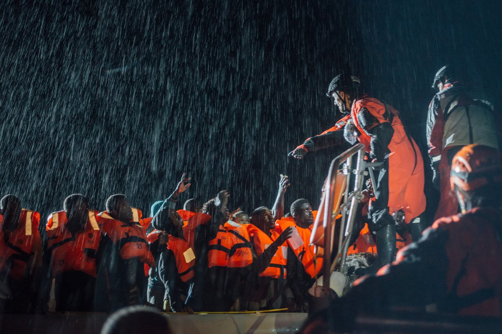
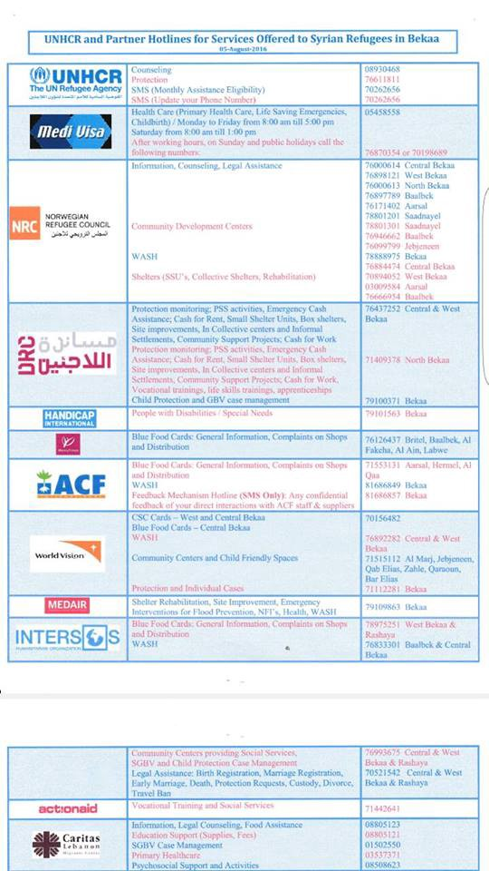
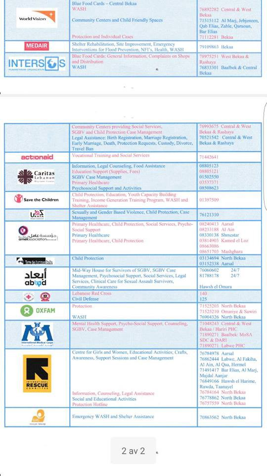
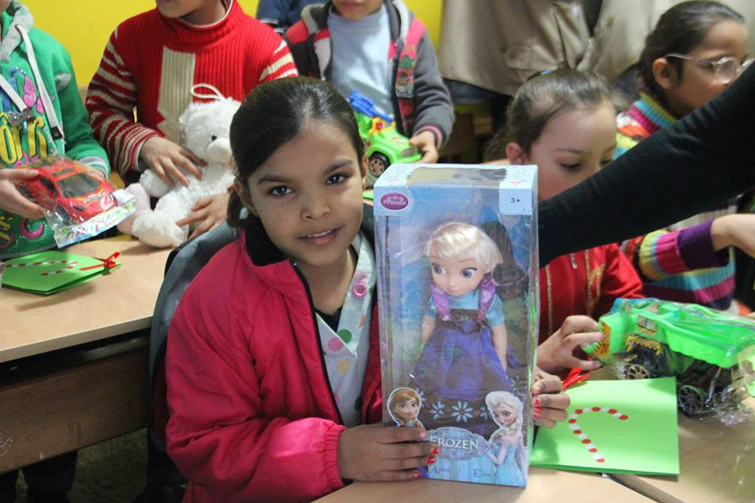
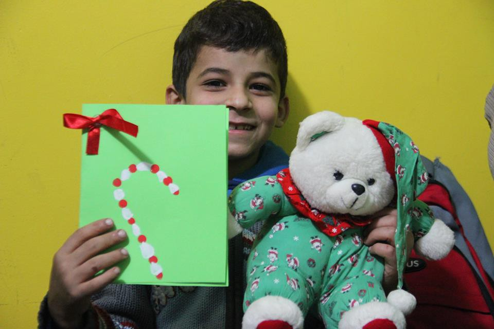

### AYS Daily Digest 23\.12\.16 — UN reports that 5,000 refugees have drowned in the Mediterranean this year

Over 100 refugees were rescued last night by the Aquarius project\. Photo Credit: MSF Sea
#### Feature

The latest of the long string of large\-scale deaths associated with the Mediterranean route happened on Thursday, when two rubber dinghies were reported to have sunken off the coast of Italy\. This brings the yearly total to over 5,000, or, an average of 14 deaths per day\. This number is far greater than it was in 2015, when 3,800 deaths were reported\. This increase comes despite a decrease in the overall number of people making the crossing attempt, indicating that smugglers are resorting to even more dangerous methods\.

The increase in deaths indicates a failure on the part of the EU to give these people safer means of reaching Europe to claim asylum\. Dublin regulations bar these people from making the crossing by plane, for example\. This gives the refugees, who flee from their home countries for a myriad of reasons, no safe alternative\. Europe is currently stepping up its efforts of keeping those refugees who made it as far as Libya from boarding the ships, through the construction of camps and by offering economic incentives for the potential asylum seekers to go home\. However, Libya as hardly a safe place for these people to remain, as the country is currently engulfed in a civil war waged by multiple competing governments as well as armed militias, with no end in sight\.
#### Lebanon
### Refugees in Lebanon struggle to cope with harsh winter conditions\.

The UNHCR has released a [harrowing article](http://www.unhcr.org/news/latest/2016/12/585cddcf4/winter-blows-across-lebanon-refugees-struggle.html) about the plight of Syrian refugees as winter quickly approaches\. There are currently over one million Syrian refugees in Lebanon, over half of whom live in structures, such as tents, animal sheds, and garages, that are not suited for staying safe during winter\. UNHCR is currently providing aid for 850,000 people, but resources are stretched thin, and the agency is currently [collecting donations](https://donate.unhcr.org/gu-en/warmth/#_ga=1.36598624.1930055785.1463055264) \.
### A list of hotline numbers for refugees staying in Bekaa

Refugee children celebrate Christmas in Lebanon\.Photo Credit: Kaitlyn Winegardner
#### Iraq
### The displaced people from Mosul need your help\!

#### Syria
### Syrian regime resumes massive bombing of Aleppo suburb

Following a brief period of respite after the regime’s capture and evacuation of East Aleppo, military operations are now seemingly in full swing once more\. The following video shows regime planes bombing Khan al\-Asal with what seem to be cluster munitions\.

#### Greece

Ritsona camp residents distribute flowers to thank the Greek people for their hospitality\.
### Athens offers makeshift solution for homeless facing cold weather

As a cold wave approaches, the city of Athens has announced that community centers at Mamouri and Dymis streets and at 35 Alexandras Avenue will be kept open aroun the clock until the cold subsides\. The homeless shelter is also handing out food, clothing, and bedding to the homeless\. More information may be found by dialing the 1595 hotline\.
### 1,200 refugee children have completed their first trimester of school

An additional 600 are expected to begin schooling after the winter break\. These numbers constitute a small minority of the refugee children currently stranded in Greece, many of whom went for years without an education because of unrest and war in their own home countries\. One hopes that the program will be greatly expanded to give refugee children a chance to integrate into society and to keep them occupied, rather than idle and bored in the camps\.
### Refugee named Haya seeking to reestablish contact with Maisie Williams\!

### Help to provide for refugees in need\!

Winter is once again upon us, and the cold temperatures leave the most vulnerable refugees in great danger\. You can help by donating to the fundraiser below, which seeks to provide the needy with new tents and warm clothing\. They are already over halfway past the 3000 pound goal\. Your donation will also be matched by an anonymous donor, i\.e\. if you give 10 pounds then the donor will also contribute 10 pounds\.

Team Bananas is also collecting donations for food and other basic necessities\.

Finally, DocMobile, a project dedicated to providing medical treatment to refugees where it might otherwise be hard to come by, is also seeking donations\.

Happy Holidays, and be sure to help the needy in any way that you can\!
### Elpida Home Hygiene Shop opened this week

### Volunteers needed\!

Do Your Part is looking for volunteers from now through June of 2017\. Must be at least 18 years old and commit to a minimum of 7 full days\. Please email DYPLisa@gmail\.com\.
#### Serbia
### Daily numbers for Mikaliste, demand for volunteers continues\!

Men 32, Women 20, Children 261
Total: 313
#### Hungary
### Migszol issues new report on the camps, borders, and deportations\.

The report, accessible [here](http://www.migszol.com/blog/hungarian-and-eu-border-policy-creates-humanitarian-catastrophe-in-serbia-migszol-november-update) , states that the introduction of the 8 kilometer rule has resulted in markedly fewer refugees claiming asylum in Hungary\. Additionally, it contains an update on the outcry following political trial of Ahmed H\., and the closing of the Bicske camp\.
### A Dutch man was arrested on the border with Romania for bringing in refugees
#### France
### A guide for refugees threatened by deportation

A volunteer has put together a helpful guide for refugees who had been in Calais and who are now in CAO, and who have applied for asylum in France\. The guide is in the process of being translated into Arabic and Pashto\. Please share it with refugees who are being discouraged and/or intimidated into leaving France\! The English version may be read [here](https://www.facebook.com/groups/CalaisMigrantSolidarityActionFromUK/permalink/1291628840911860/) \.
### Host family needed for an Eritrean mother, her daughter, and a 17 year old girl\!

#### UK
### Home available for 4–5 refugees in Malvern\!

> _REFUGEE SUPPORT FRIENDS — REFUGEE HOME AVAILABLE NOW\!_ 
 

> _So, really need your help\. I have the opposite of the Christmas tale here\. instead of no room at the inn, we have no guests at the inn\!_ 
 

> _A home is available immediately for a refugee family in Malvern, Worcestershire\. it will be let conventionally very soon if no family is found_ 
 

> _Refugee action will not refer anyone as they deem Malvern unsuitable, and the family reunification we had lined up has fallen through due to visa nightmares\._ 
 

> _Other possibles have decided it is too far from their own communities/network_ 
 

> _So, we have a few days before this house goes back up for conventional letting and the opportunity to start a refugee community here is lost\._ 
 

> _It is suitable for a family to settle, \(it is not available to an individual\), 4–5 people ideally, 6 at a push as it has 2/3 bedrooms\. its is small, but a nice property, really well equipped, in a beautiful area, between the town and the hills and walkable distance to schools, train stations, buses, shops, library etc\. Malvern is a large town in stunning countryside, by no means out in the sticks… there are 2/3 other properties probably becoming available in Malvern in April, and a refugee support hub setting up in the new year, so everything is moving in the right direction\. There is a syrian refugee community nearby who a family can be connected with\. We have esol teachers lined up, are researching employment opportunities, and have a large support network available_ 
 

> _We do not have a mosque should it be wanted, though there is a church that offers friday prayers, and things like Halal are tricky, but we have volunteers willing to help with shopping trips to the nearby city, and mosques, and you can get there by train in ten minutes_ 
 

> _Criteria… it needs to be a refugee family in need of housing and support to live independently, and all families would be subject to an assessment to see what support is required, affordability checks etc, Spring Housing are very happy to facilitate a visit if somebody would like to view the property\._ 
 

> _pm me, or contact direct to_ 
 

> _Dominic Bradley_ 
 

> _Managing Director_ 
 

> _dominic@springhousing\.org\.uk_ 
 

> _Tel: 0121 663 1443 M: 07827291564_ 

#### Poland
### Rozbrat art collective has organized an online auction\. Proceeds will go to AYS\!

You may bid to buy an icon —a two — sided digital print on silver paper featuring the Holy family in exile, and refugee carol lyrics in Polish\. The proceeds will go towards AYS’s efforts in the field\. Bids may be placed in the discussion section of the event page below\.

#### Ethiopia
### Danish Refugee Council is hiring a research consultant for a study in Ethiopia\!

_Converted [Medium Post](https://areyousyrious.medium.com/ays-daily-digest-23-12-16-ae454b518995) by [ZMediumToMarkdown](https://github.com/ZhgChgLi/ZMediumToMarkdown)._
