### AYS DAILY DIGEST 24/12: Refugees and volunteers share the joy of Christmas creatively together while still fellow humans suffering

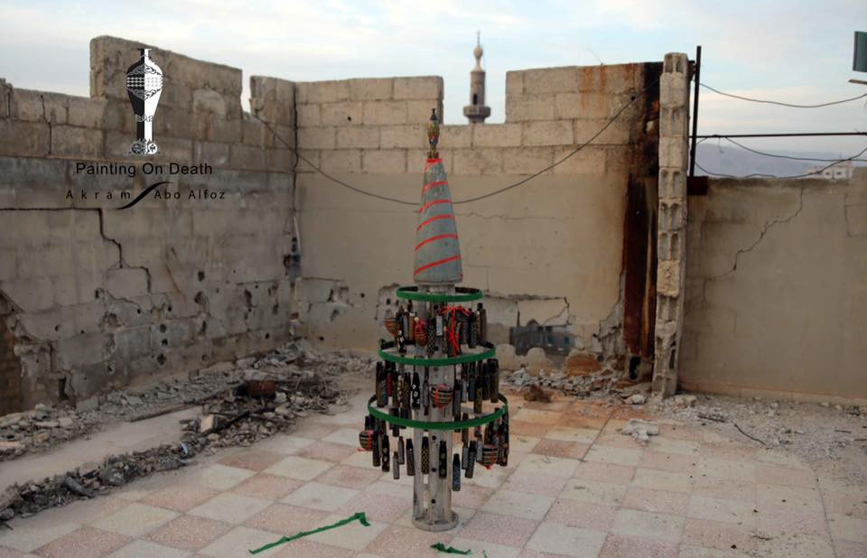

Christmas tree in Douma City, Akram Abo Alfoz
### SYRIA
#### Painting on Death — Artworks of Akram Abo Alfoz

Photos: Bassam Khabieh

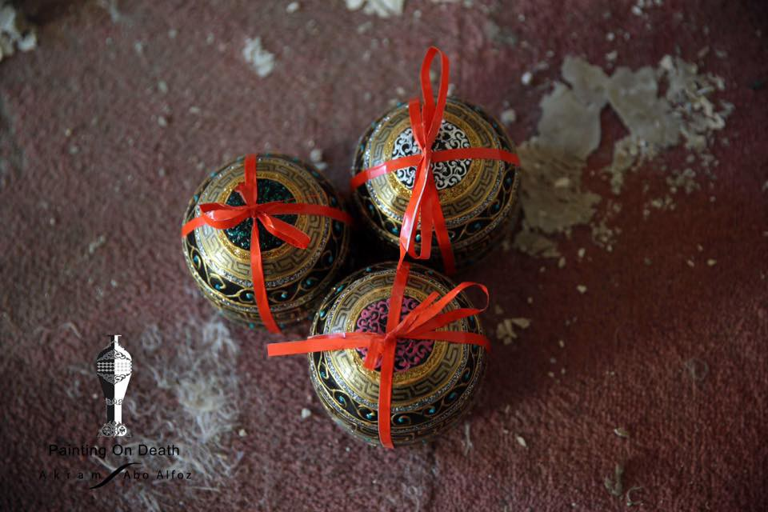

We love peace\.

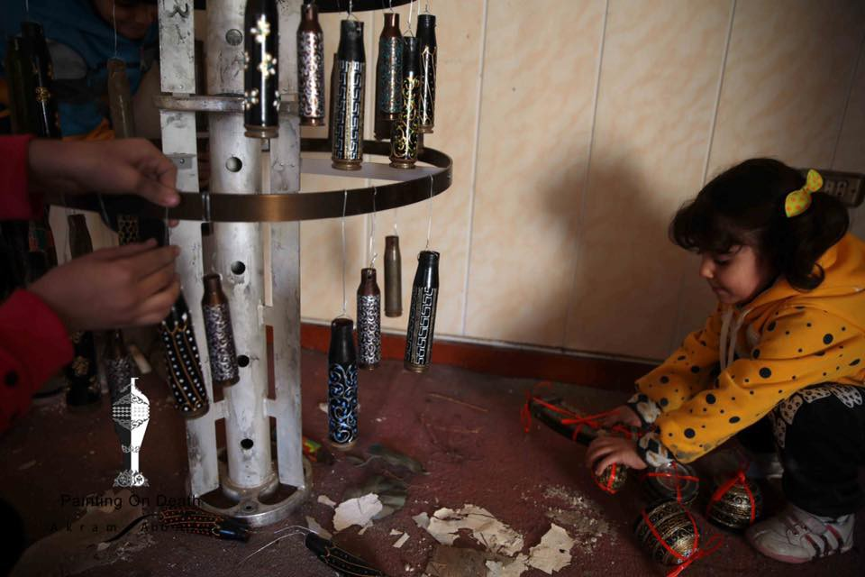

We convert the death into the life\.

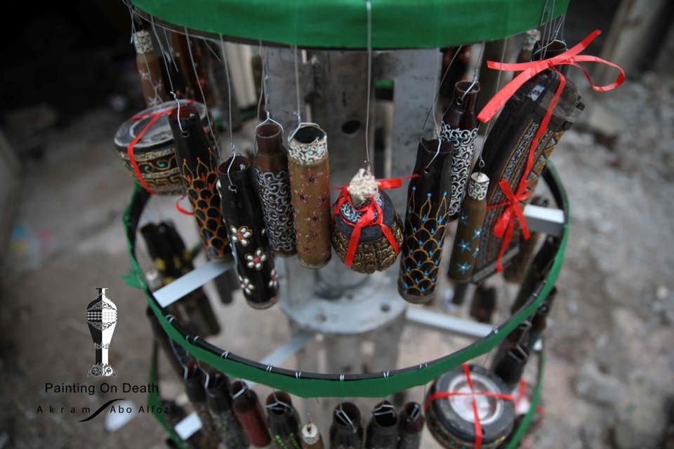

These are different kinds of weapons which Assad and Russia dropped on our houses to terminate us\.

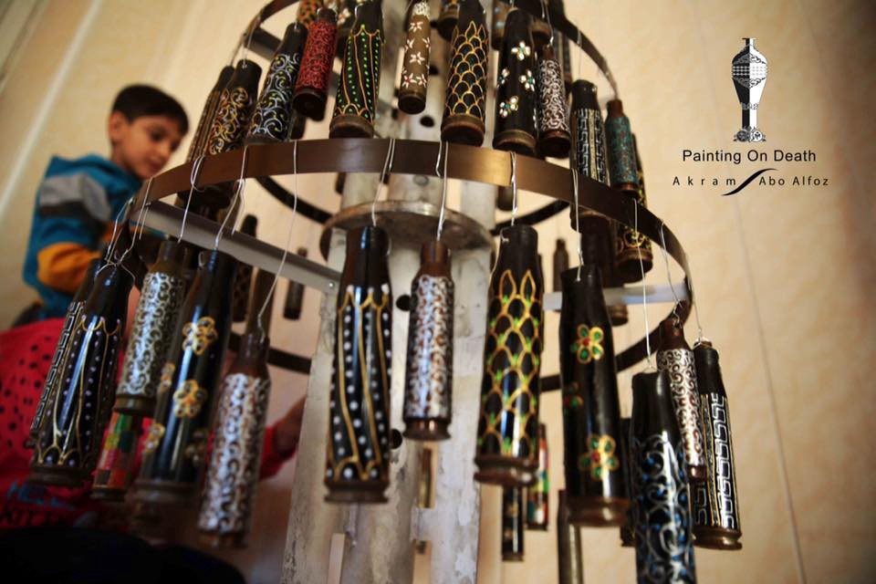

We have just proved that the life is more power than death

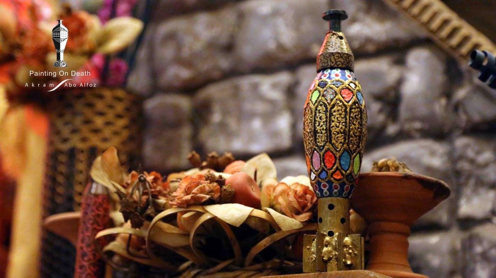

Syria deserves peace … 24/12/2016
#### \#PrayForSyria

For joining more of his iconic artworks and prayers for the artist Akram Abo Alfoz, please visit his page [“Painting on Death” here](https://www.facebook.com/painting.on.death) \.
### GREECE
#### Officially registered new arrivials on Greek islands of the day are:

Lesvos 1, Leros 34, Kos 2\. It makes a total of 37 persons\.
#### Current volunteering opportunities in Athens

Ellinikon Camps, The Schoolbox Project, Project Elea in the Eleonas camp, ArmandoAid at the Oinofyta camp, Skaramangas with Drop in the Ocean and Organisation Earth, which is also working in the Sounio Camp in Lavrio are calling out for volunteers\. Please follow the [details here](https://www.facebook.com/groups/AthensVolunteersInformation/permalink/998812063584424/) \.

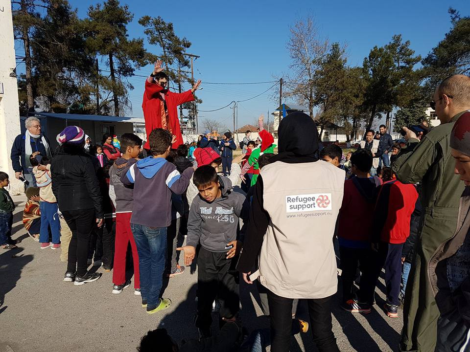

Photo: Refugee Support Greece

Yesterday Refugee Camp Alexandreia was all about Christmas for the children\. Even Papa Noel visited the camp to give presents to all the children\. In the early evening the children were taken to the Town Hall in Alexandreia for a fantastic Puppet Show\. [It was just an amazing day](https://www.facebook.com/RefugeeSupportGreece/posts/1733307180322086) \.

Sarah Griffith in the camp Veria with [Help Refugees](https://www.facebook.com/HelpRefugeesUK/) , [Refugees Foundation e\.V](https://www.facebook.com/RefugeesFoundationSfRotR/) and [Donate4Refugees, UK](https://www.facebook.com/Donate4Refugees.org.uk/)

> Merry Christmas from Greece — Sam James and I are so grateful for your support over these last 3 months — we could not have achieved what we have on Camp Veria without your moral and physical help and of course amazing financial donations\! Thanks go to Guernsey for punching well above their weight as ever, your support this year has been phenomenal, and our partners Refugees Foundation, e\.V\. Support for Refugees on the Run, Help Refugees and Donate4Refugees who have been solid in their assistance\.
 

> The volunteers who have helped us have been incredible and special thanks go to our own Papa Noel Bruford Low who has come to Greece to be with us over the Christmas period and worked his little Santa Socks off\! 

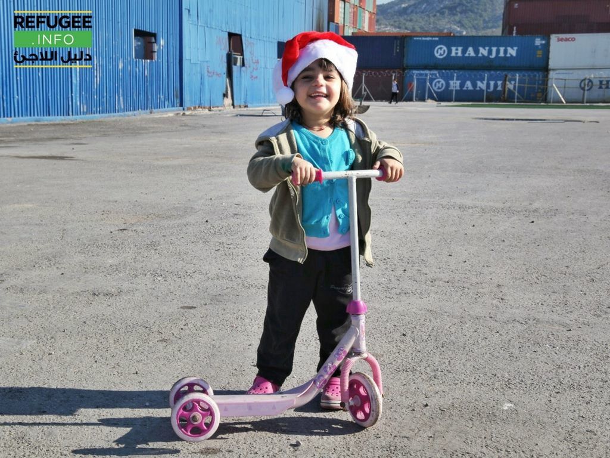

Photo: Refugee\.Info team

[The Refugee\.Info team](https://www.facebook.com/refugee.info/) sends best wishes to all refugees for a merry Christmas filled with love and happiness\.
### MACEDONIA
#### The Youth Forum “Refugees and Migrants in the New Media in South\-East Europe and Central Europe”

[Mladiinfo International](http://www.mladiinfo.eu/) extended their [invitation](http://www.mladiinfo.eu/2016/12/22/youth-forum-refugees-migrants-new-media-see-ce/) for young researchers, students and activists from most Balkan countries to join the seminar in Skopje 30\. March to 1\. April 2017 about migration and how media is handling and framing the refugee situation\. The last day to apply will be the 30\. December 2016\. For further details, please follow [this link](http://www.mladiinfo.eu/2016/12/22/youth-forum-refugees-migrants-new-media-see-ce/) \.
### SERBIA
#### Refugee Aid Miksalište

from Belgrade resumes todays numbers as: 71 men, 18 women, 243 children, make 332 in total\.
#### BORDERFREE ASSOCIATION

held a pre\-christmas creative workshop in Presevo and could gain a high interest among refugee ladies in the camp\. [Decent gloves, friendship bracelets and beautiful paintings were the results](https://www.facebook.com/borderfreeassociation/posts/1593619353988723) \. The team tribute wholehearted thanks to donors and volunteers, who spend the Christmas time in the camp with fleeing people\. \(Photos: Borderfree Association\)

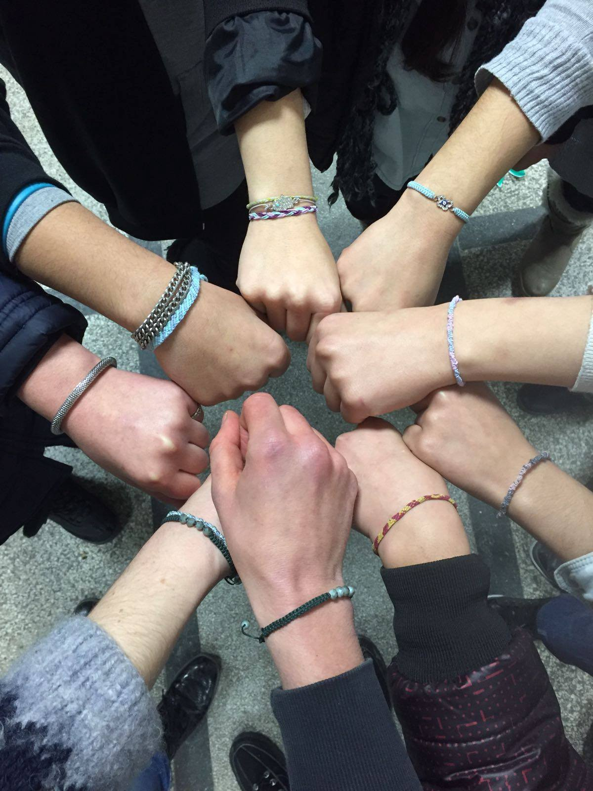

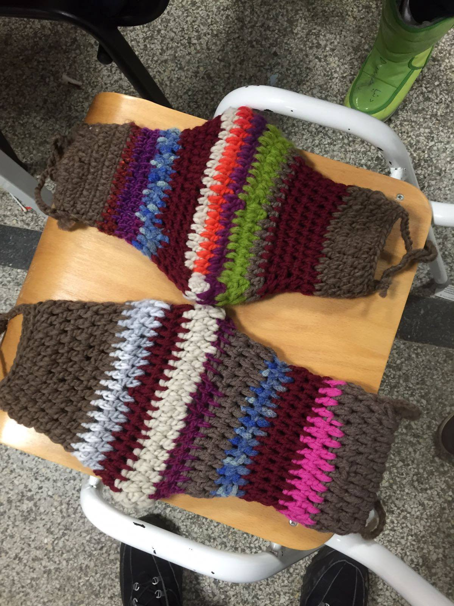

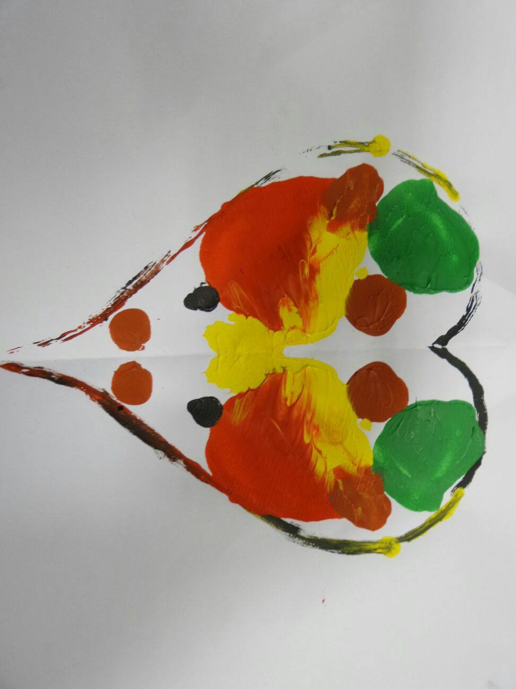

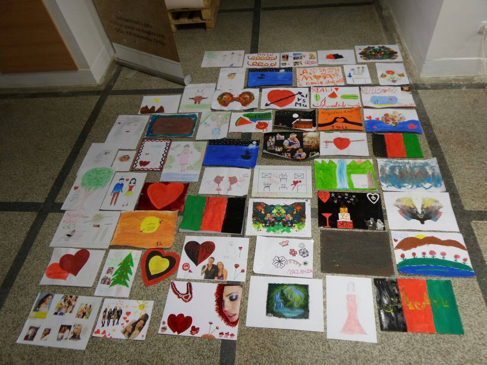

#### ART AGAINST PROJECT

> Belgrade, Serbia 22 December 2016
 

> [Refugees stand in line to receive free food](https://www.facebook.com/artagainstproject/posts/1231139386935493) outside a derelict customs warehouse in Belgrade, where they have found refuge as they are trapped during in between closed borders\. The weather is freezing cold and the conditions are inhumane\. 

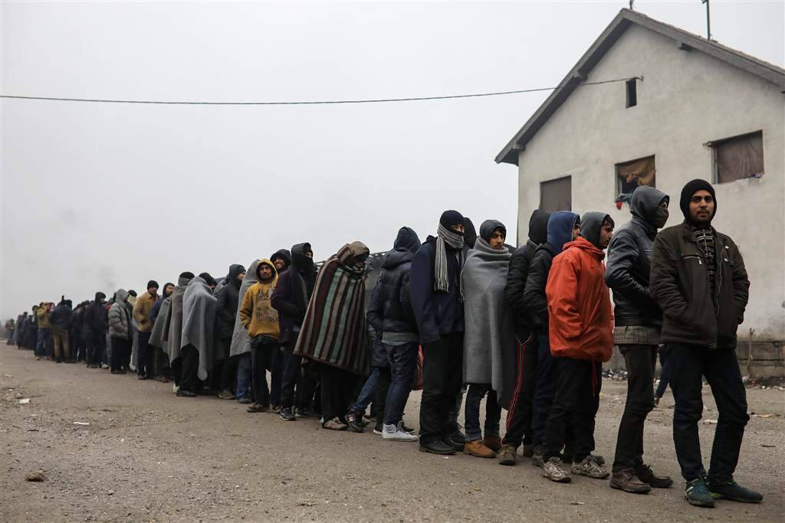

Photo: Marko Djurica
### FRANCE
#### [Volunteers urgently needed in Calais](https://www.facebook.com/calaisaction/posts/1380594061993095)

Refugee Community Kitchen and Calais Kitchens, [Care 4 Calais](https://www.facebook.com/care4calais/posts/1390362450996708) and Help Refugees all need you NOW\! If you would like to be a crucial member of their teams, helping the most vulnerable people this winter please get in contact\. If you have a spare room this winter in the UK or France and would like to host please get in contact with us and we can pass your details on discreetly\.

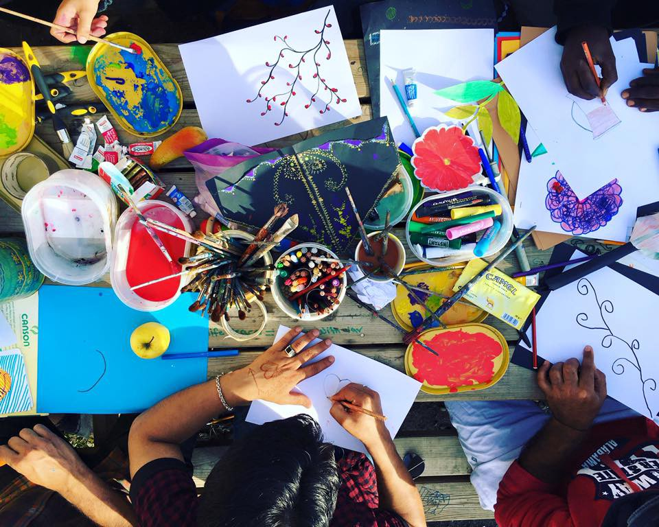

Photo: Imagine Calais

A couple of months ago, a little organisation called [Imagine](https://www.facebook.com/imaginecalais/) set up art workshops in the calais jungle\. [According to the project coordinator Lujza Richter](https://www.facebook.com/groups/refugeeworkexchange/permalink/595723970626040/) the wonderful art work by the residents finally has been used to make cards and calendars\. Have a look [here](http://www.assoimagine.com/shop) \!
### UNITED KINGDOM
#### Help Refugees UK

won a signification first step in their law suit against the British Government failing to take responsibility for 3000 additional unaccompanied children according to [the Lords amendments to the Immigration Bill](http://www.parliament.uk/business/news/2016/may/mps-to-consider-lords-amendments-to-the-immigration-bill/) , the so called “ [Dubs Amendment](http://services.parliament.uk/bills/2015-16/immigration/documents.html) ”\. The British High Court made a declaration in the organization’s legal challenge, which confirms that the number of children to be transferred under Dubs is separate from and additional to Dublin III transfers\.

[Help Refugees said](https://www.facebook.com/HelpRefugeesUK/posts/359639447730068) : ‘The Government already owed legal duties under EU law since 2013 to unaccompanied children with close family ties in the UK\. Dubs is additional to that — it is about the vulnerable and isolated children who have no family ties\. Many of these children are in desperate situations and at serious risk of abuse and trafficking\. With the blurring by the Government of the distinction between Dubs and Dublin, too little was happening on implementing the Dubs Amendment\. We hope that this much needed clarification will ensure more transfers of Dubs children take place urgently\.’

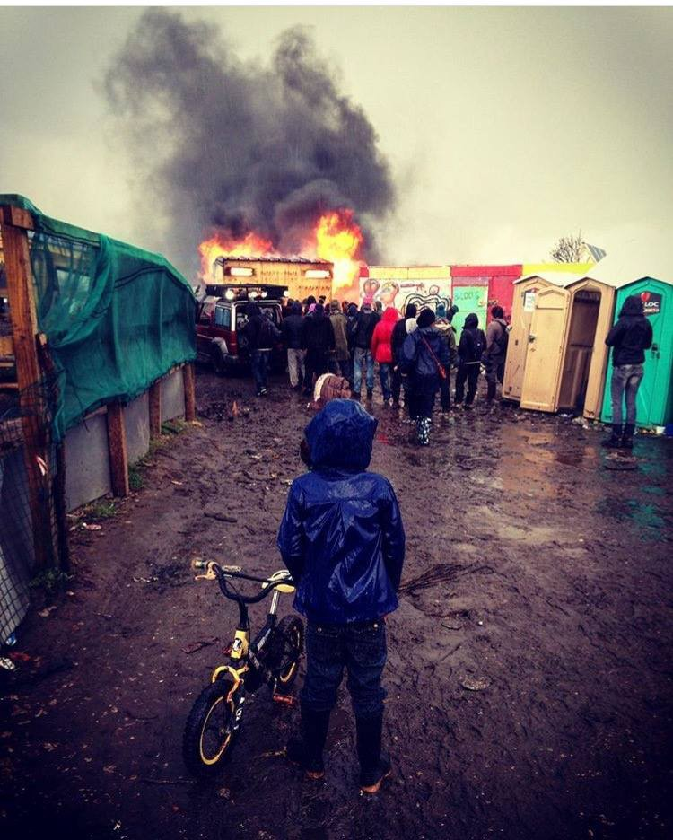

Photo: Inca Sorell
### NETHERLANDS
#### [Movement On](https://www.facebook.com/movementontheground/) [The Ground](http://www.movementontheground.com) and the [Refugee Company](https://www.facebook.com/refugeecompany/)

[have launched](https://www.facebook.com/movementontheground/posts/747726658736982) a new offical fundraising campagne to convert the former prison Bijlmer Bajes to a inspiring place hosting more than 600 refugees, while linking the new Amsterdamers living at the Bijlmer to employment\. Please visit the [detailed project descriptions here](https://www.pifworld.com/en/projects/SRQ3a2zxZ-A/bijlmer-bajes-an-inspiring-hub-f/about) and contribute\.

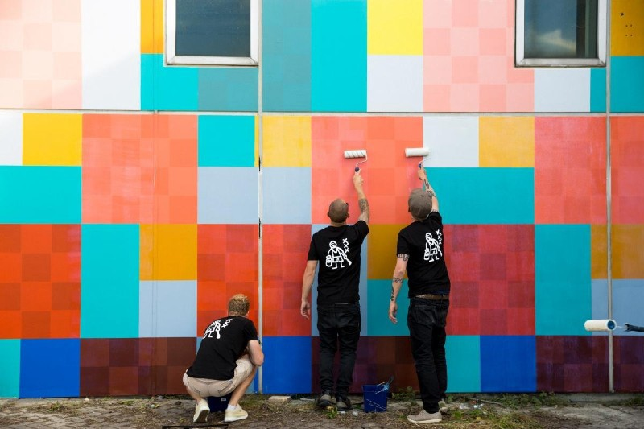

Photo: Movement On The Ground
### SWEDEN
#### [Info from Viomis Aid Sverige, a small ngo](https://www.facebook.com/ViomisAidSweden/posts/1919588714936078)

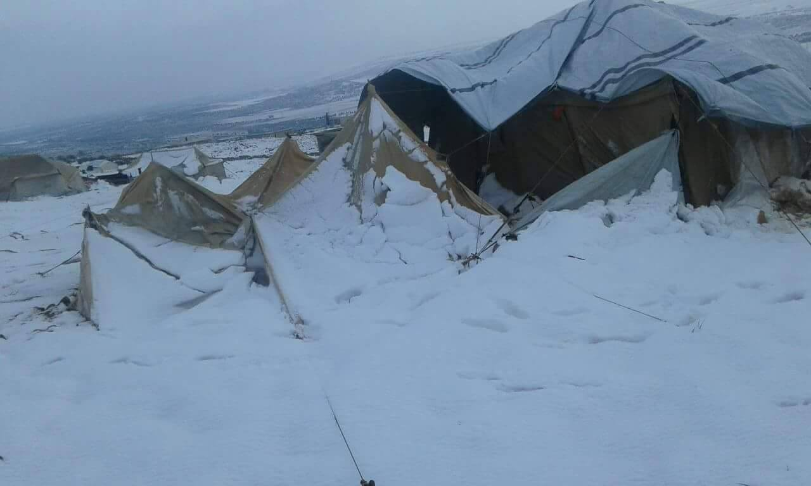

Photo: Viomis Aid Sverige

A family of five, three of them children, died tonight due to the cold in the village Saraqib, Syria\. This was only one of the many families displaced after the past conflicts\. We need to do more for the families that fled only with the clothes they was wearing at the time\.

If you want to contribute to their work, 
swish any amount to number: 1234548566 or use
Bankgiro number: 894–1320 for Swedish residents\. 
Name the transaction “Aleppo”\.

_Converted [Medium Post](https://areyousyrious.medium.com/ays-daily-digest-24-12-refugees-and-volunteers-share-the-joy-of-christmas-creatively-together-4b0e1c4e6ba9) by [ZMediumToMarkdown](https://github.com/ZhgChgLi/ZMediumToMarkdown)._
