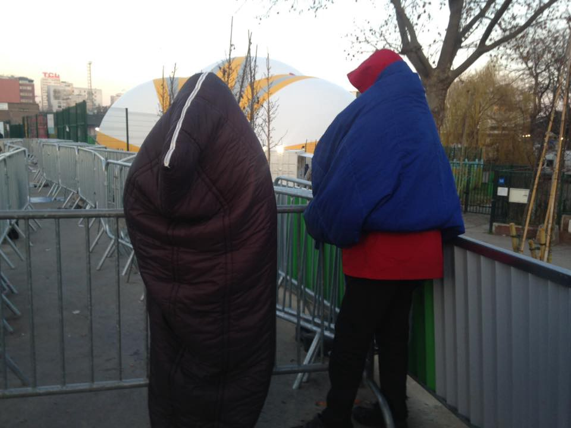
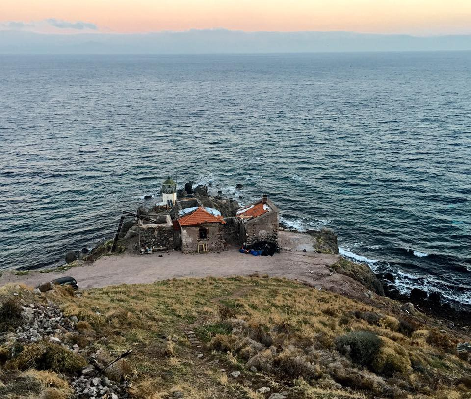
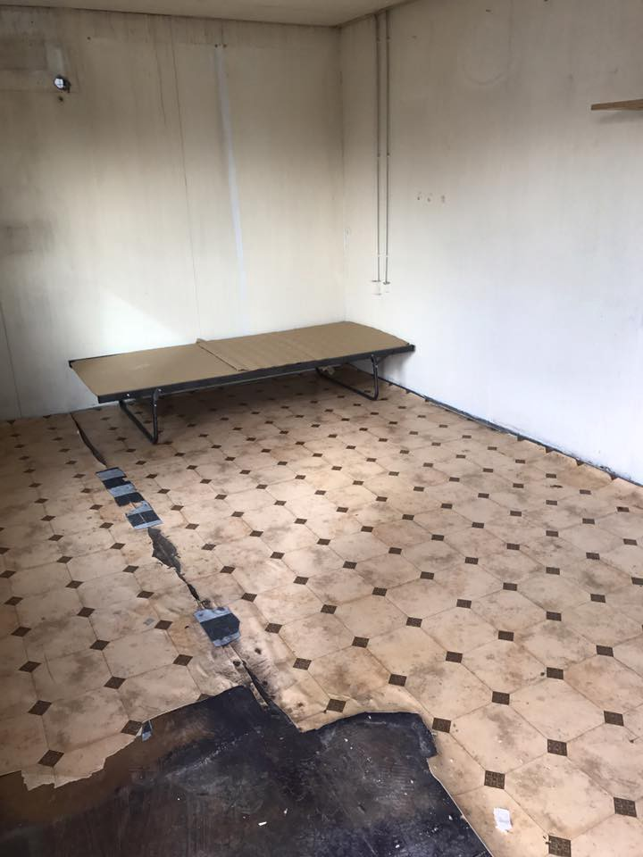
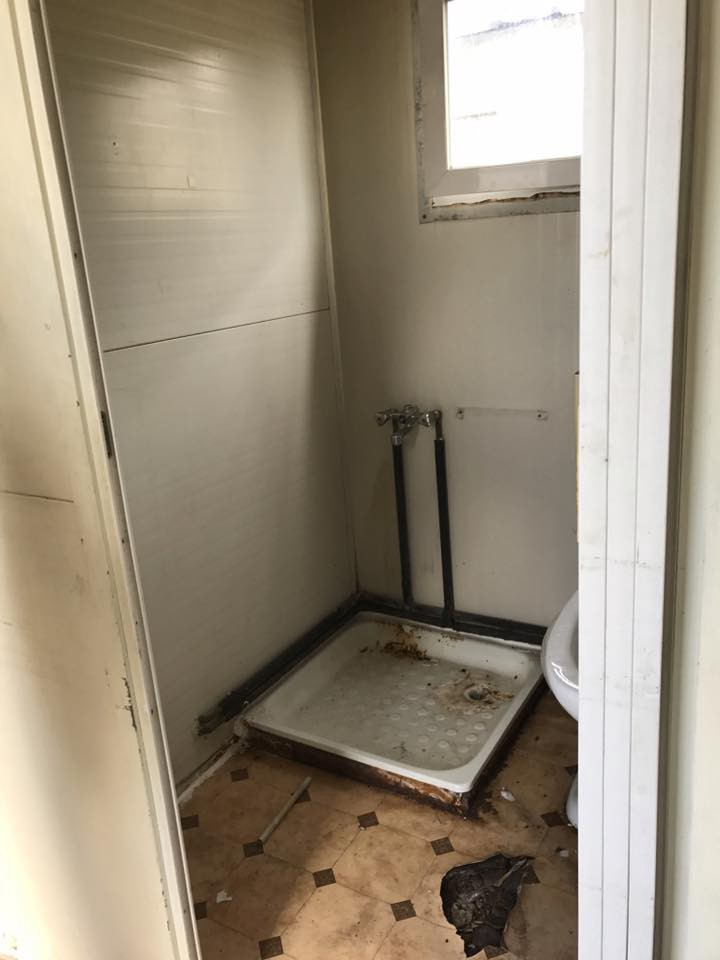
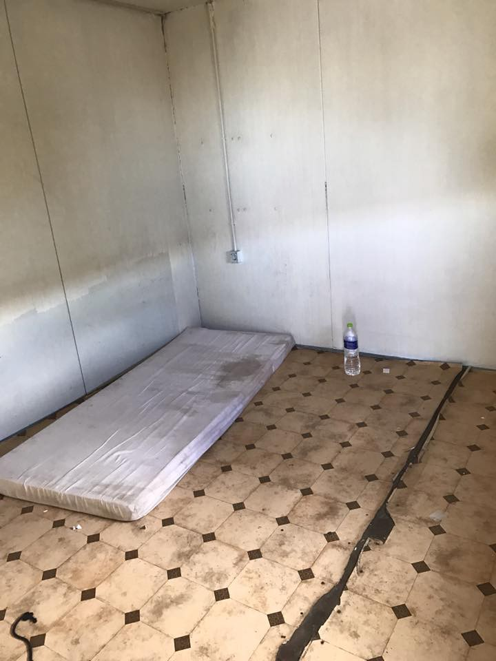
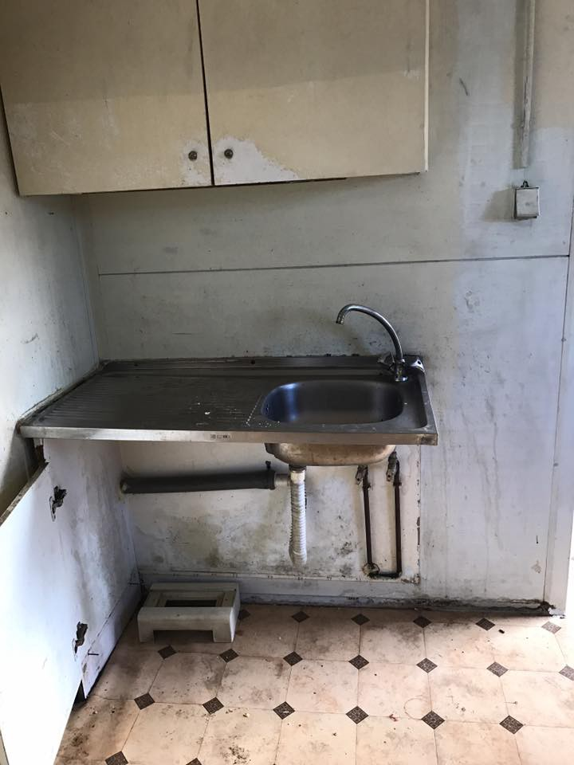
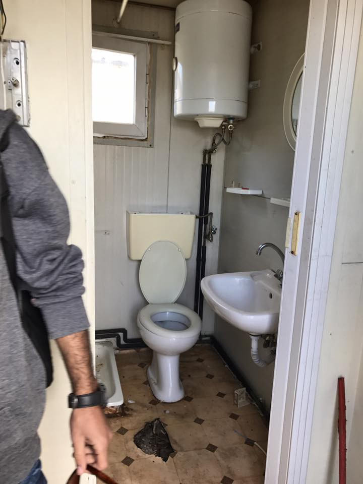
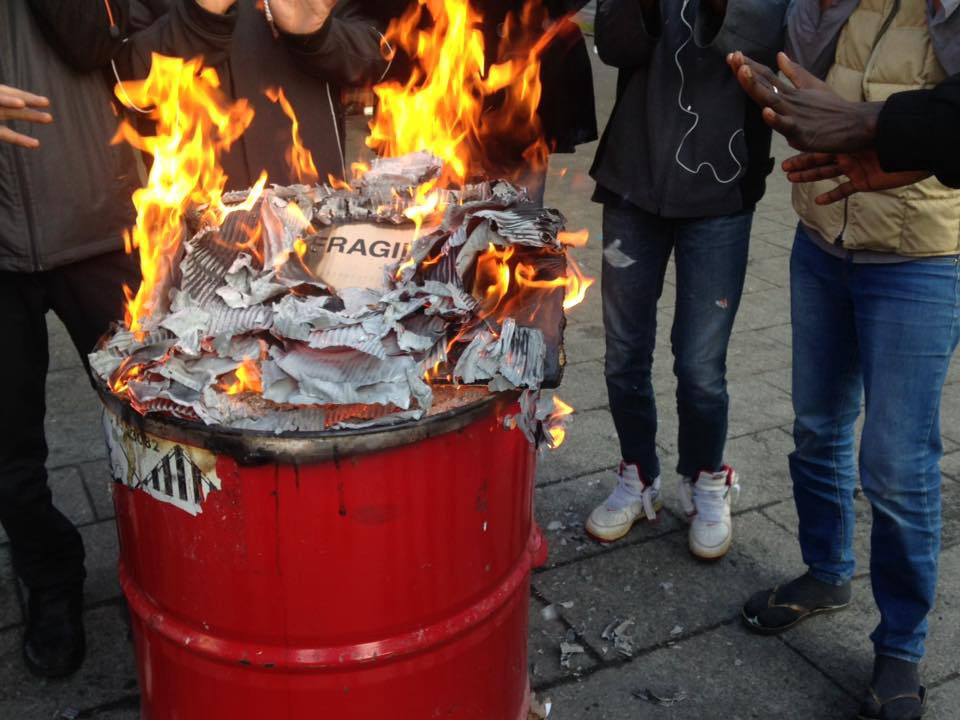
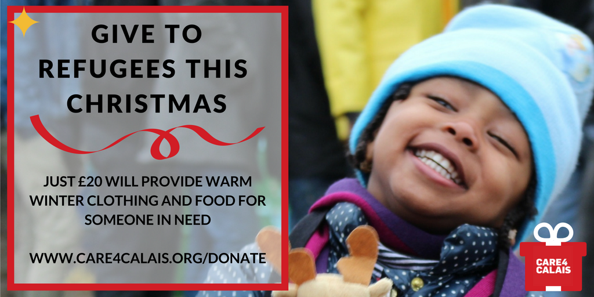

### AYS DAILY DIGEST 25/12/2016: Refugees in Bosnia criminalized and kept in prison\-like facilities

_Refugee children who enter Bosnia and Herzegovina are locked down in prison\-like facilities and kept inside forup to 90 days with their parents // New arrivals to Greece // Greek government promised that by January 15 all the people should be living in a safe and warm places // Series of fascist attacks against refugees in Germany in December // People left in dreadful conditions all over France_

Dark side of the city of lights\. People, refugees, are left in the streets, including children, sick and eldrely\. Photo by Agathe Nadimi
### Feature

Even though Bosnia and Herzegovina is on the Balkan Route, nobody knows how many refugees went through the country or how many of them are currently residing there\. Additionally, it is not possible to establish how many refugee children are in the country since they are not counted in the official numbers\.

The government has imposed strict measures; resulting in people being pushed back, deported back to the countries of origin where possible, or treated as illegal immigrants and kept in a prison\-like center near Sarajevo\. Journalists are not allowed there, and it is forbidden to film or take pictures inside or outside the center\.

Relevant authorities do not keep data on children in Bosnia\. We were told by the local activists that people from Syria and Afghanistan are traveling through Bosnia since 2013\. Including unaccompanied children\. Again, there are no reliable data on the numbers\. Children who are traveling with parents, if the family is arrested, are not counted either\. The decision made by the court about their parents is automatically applied over them, even if the decision is expulsion\.

UNHCR is aware of this, a local activist told us\. Asked about children, the UNHCR representatives in Bosnia told the media that they _“strongly advocates for finding alternative solutions to the detention of all asylum seekers in general, and in particular for children — who in principle should never be detained,”_ but also could not give more details about children in the prison\-like facilities\.

The UNHCR is not directly involved with any of the centers but only through material help they provide to couple of small, understaffed, non governmental organizations\.

In Bosnia, local police do not make any distinction between people coming from Syria, Afghanistan, Iraq, Eritrea or any other country\. If arrested while trying to cross the border, they will be put into detention and transferred to the center where they can be kept up to 18 months \(but usually from 30 to 90 days\) \.

It happens very often that, after the arrest, people are not informed properly about their rights, sometimes due to the lack of interpreters, and sometimes just as a matter of negligence\.

In the center, all belongings, including phones and documents, are taken away from the people\. Once a week they are granted visits, closely observed by the police\. People are allowed to use an official phone in the center, but their conversations are followed\. When and if they get in touch with the organization Vasa Prava, the only one that provides free legal aid, they receive help and information about their rights, including the right to apply for asylum\.

However, people who apply for the asylum often do that only to be able to leave this prison\. If their application is accepted, they are transferred to the asylum center near Sarajevo, on the slopes of the mountain Bjelasnica\. Since 2014, when the center was established, 94 people were accommodated inside\. According to the official data, more than 60 percent of people who applied for asylum left the country before the decision was made\. However since recently, many people have chosen not to apply for the asylum, but rather to be pushed back to Serbia in order to try again\.

The other option is to apply for a refugee status, but only 317 done that so far, and most of them — over 50 percent — are already relocated to other countries\.

Those who are still in the country, mostly live in a private accommodation, while only 34 are hosted in the refugee reception center in Salakovac, near Mostar\. Those in the center receive for each person 15 Euros a month, while the family of 4 gets around 80 Euros, which is far less than it is needed to survive a month in Bosnia\. Those in private accommodation do not get help from the government, only from small groups of volunteers and citizens\.

An activist is claiming that the number of refugees in the country could be much higher, but many of them are not registered with the local authorities at all\.

Over 20 years ago, more than 2 million people left their homes in Bosnia during the bloody war and genocide, from 1991 to 1995\. Today, many compare the situation in Bosnia during the war and Syria today\. Cities under the siege, attacks on hospitals, civilians killed in the streets, children afraid and hungry… Yet, the government in the country where people still feel the wounds from the war, is not capable of improving the system in order to offer at least basic care to people in need\. The fact that it is one of the poorest European countries does not justify inhumane treatment of people who need help\.
### Greece

This morning a refugee boat carrying 41 people, including 3 children, landed on the South shore of Lesvos\. All the people are safe and well\.

The government announced that “decongestion and the removal of refugees according to their legal rights” will start in April\. Migration Policy Minister Yiannis Mouzalas also said that in parallel the process of 2,000 to 2,500 relocations to EU countries every month should start\.

The Greek government is responsible for the integration of 20,000 to 25,000 refugees that will remain in Greece\.

At Karakas Lighthouse … looking toward Turkey from Lesvos\. A treacherous boat trip for people fleeing war for a new life in Europe\. By Dirty Girls of Lesvos\.

He also promised that by the January 15, no refugee or migrant will live in tents, and that everybody will be moved to organized centers with heating, medical care, and food\. AYS will monitor this process, with the hope that his promise will be kept\.

From reports we are getting from various camps around Greece, this process is slow and often people are not accommodated in a decent and livable places\. One of the examples comes from Softex camp where isobox that has been installed, is defiantly not suitable for living\. The elderly gentleman who was supposed to move inside refuses to do so, deciding to rather stay in his tent\. No wonder why after seeing these pictures\.

Photo by Ruhi Loren Akhta

Meanwhile, more help is needed all over Greece\. [Doliana Solidarity Project](http://dolianasolidarity.org) is urgently looking for a Farsi speaker to join their project long term \(1 month \+ \) \. Read more about our project at their [web site](http://dolianasolidarity.org) \.

Team Humanity and Charity United have joined forces on [a new refugee aid project](http://charityunited.us/homes-refugee-children/) aimed to give to families with children and pregnant women the opportunity to move out of cold, dirty, inhuman camps, into warm and safe rooms in a community center\. Their children will also have the opportunity to attend school\. And they have more plans\. If you want to help, please visit their website to learn how\.
### Germany

[Fascist attacks in German against refugees are reported again\.](https://enoughisenough14.org/2016/12/25/antifa-xmas-the-wave-of-fascist-attacks-in-germany-continues/) On December 24, an arson attack against a refugee shelter in Haldersleben was committed by a group of 4 men dressed in black who threw a Molotov cocktail\. No one was injured and there was only minor damage\.

On December 21 a refugee shelter in Bochum was attacked\. A window was smashed and a fire set in the hall\. Police stated that a gas pipe was sabotaged\. Fortunately, the refugee shelter was empty

In Rostock, the alternative housing project “Alternative Wohnen in Rostock” \(AWIRO\) was attacked for the second time in just 4 days\.
### France

In Paris, but also some other cities, too many people are in desperate need\. They live in dreadful conditions, forced to live on the streets\. Among them are children, sick people, elderly… Volunteers are with them and trying to help

By Agathe Nadimi

If you can help, consider the [Care4Calais](https://www.facebook.com/care4calais/) \.

_Converted [Medium Post](https://areyousyrious.medium.com/ays-daily-digest-25-12-2016-refugees-in-bosnia-criminalized-and-kept-in-prison-like-facilities-8e0a530a5e45) by [ZMediumToMarkdown](https://github.com/ZhgChgLi/ZMediumToMarkdown)._
