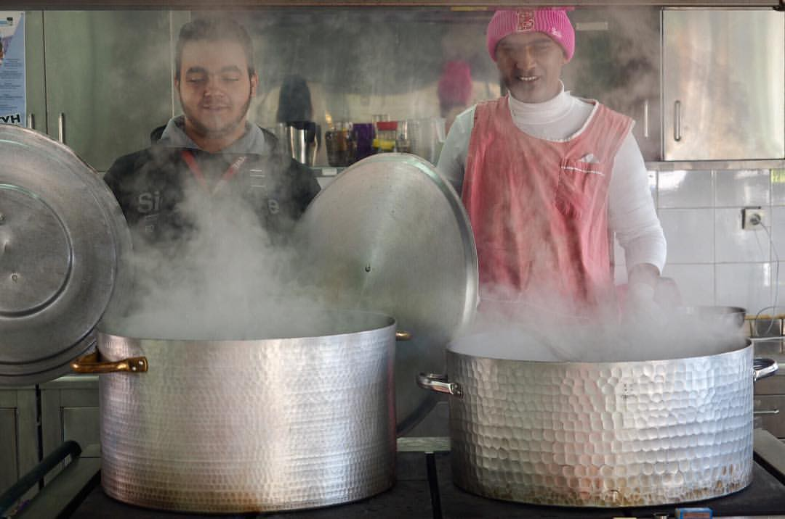
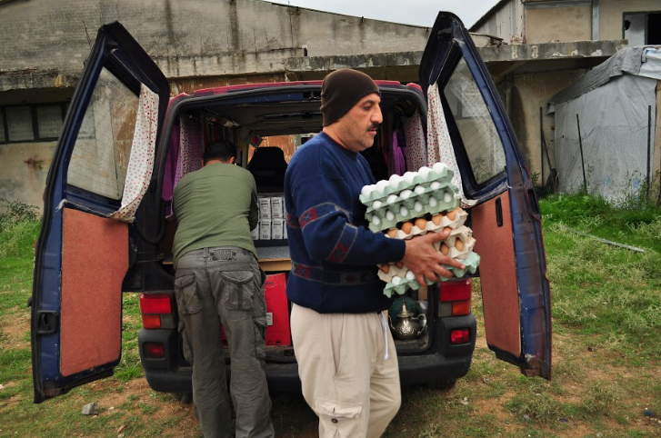
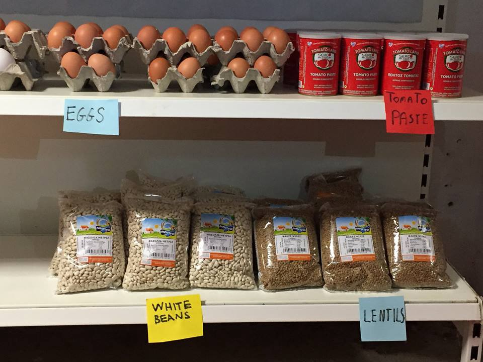
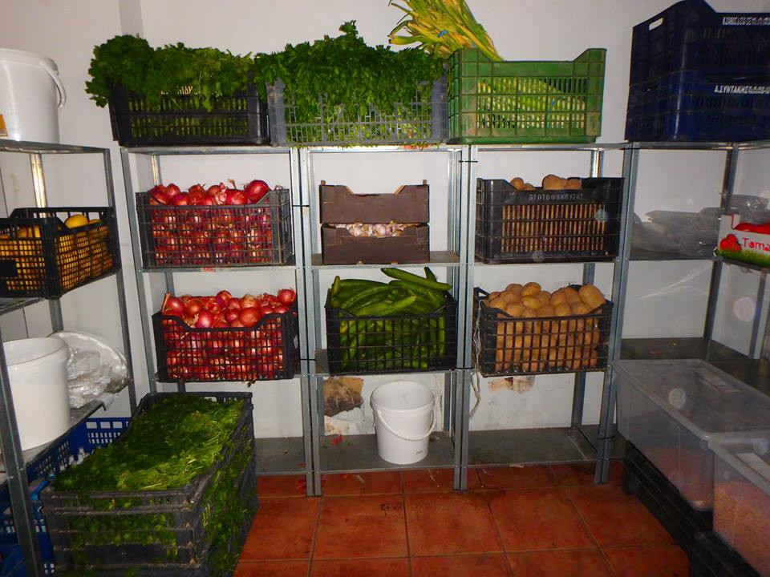
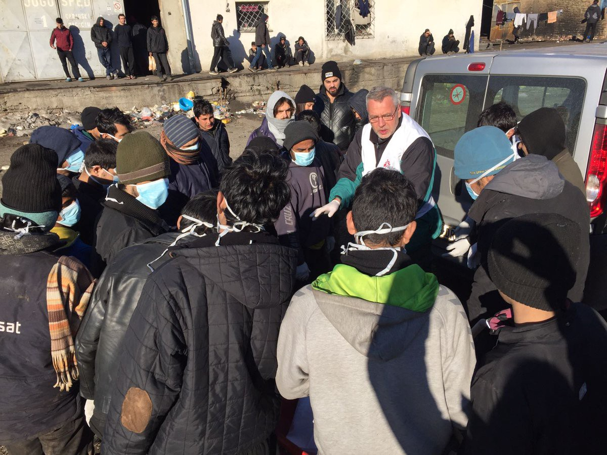
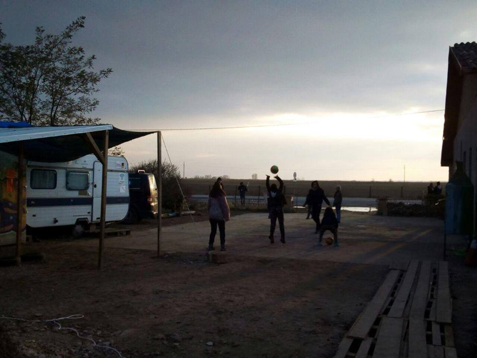

### AYS DAILY DIGEST 27/12/2016: Weather conditions to deteriorate in Greece
#### _Cold weather expected throughout Greece//Calls for donations in Greece// Refugees return to Calais //NGOs still active in Belgrade//Kelebija Community Center in Serbia forced to close//_

\. Pikpa, Lesvos\. Photo by Knut Bry
#### Greece
### Three boats with 86 people arrived today on Lesvos

64 people on two boats arrived in the south and one boat with 22 people landed in the north\.
### Extremely cold weather expected throughout Greece

[Keeptalkinggreece](http://www.keeptalkinggreece.com/2016/12/27/greeces-civil-protection-issues-warning-for-extreme-snow-weather-conditions-dec-28-312016/) says the Greek Civil Protection issued a warning, urging people to avoid staying outdoors during rain and hail storms and to avoid being near the sea shore and beaches\.

**Snow fall is to be expected on Wednesday in Macedonia and the Aegean islands** while winds of 7–9 Beaufort are to be expected in the Aegean\.

**Snowfall will continue in these regions on Thursday and snow is also expected to fall in Athens and Attica** \.

**On Friday, winds could reach up to 10 Beaufort in the Aegean Sea** and temperatures could drop to \-14 to \-16 degrees Celsius in some mountain areas\.

The situation on the mainland and on the islands, especially Chios, is still extremely difficult and the bad weather will only make matters worse\. [**People are still living in tents and the ‘winterisation’ of camps is still not completed\.**](https://www.theguardian.com/world/2016/dec/22/thousands-of-refugees-left-in-cold-as-un-and-eu-accused-of-mismanagement)
### Notara26 needs funds to winter\-proof its building

**With winter fast approaching, the self\-organised housing structure Notara26 in Athens [needs your help to winter\-proof and heat its building](https://www.youcaring.com/notara26housingforrefugeesandmigrants-711152) \.** All donations will be used towards this goal, while everything above will go towards Notara26’s operational costs\.
### No Border Kitchen calls for donations

**The [No Border Kitchen](https://www.facebook.com/NBKLesvos/?fref=nf) is also appealing for funds as their financial situation situation is desperate** \. It says it spends around €6,000 on food per month, €500 on construction materials and €1,000 on other expenditure such as fuel \. The Kitchen currently cooks 600 portions that are distributed in different places to people who don’t live in the camps and supplies around 150 more people with groceries\. They also take care of their social center and hope to stay at least until the end of the winter\.
### The Food Project needs help

[Help Refugees is looking for donations to support The Food Project in Greece](https://mydonate.bt.com/donation/start.html?charity=127188) , which supplies fresh fruit and vegetables and supports smaller organisations across 16 refugee camps in northern Greece\.

Vasilika Camp: food boxes contain oil, eggs, sugar, tea, rice\. Photo by Eko Project

Distributing ingredients enables camp residents to cook for themselves in a dignified way, making food that reminds them of the homes that they were forced to flee\. It also offers some variety and some necessary additional proteins to compliment the dull army diet\.

Food shop at the Alexandreia refugee camp\. Photo by Refugee Support Greece

In just two months, The Food Project has distributed a staggering amount of food:

\- 2,280 kg of beans
 — 2,545 kg of chick peas
 — 50,312 eggs
 — 3,026 kg of rice
 — 6,964 litres of sunflower

In the Karamanlis and Frakapor refugee camps, people are able to buy additional food and items through a point system\. There are no queues, people can chose and buy only what they need and consumer\. Photo by Anas Kbabeh

You can help The Food Project continue its work by donating here:

[http://bit\.ly/HelpRefugeesDonate](http://l.facebook.com/l.php?u=http%3A%2F%2Fbit.ly%2FHelpRefugeesDonate&h=6AQEijTBrAQGD4pWfasOOANe_IkKs0OUMnpa2JMr8C1DsRA&enc=AZNCeFGiiYWHSR9Q_DK_RARclx_Kmd2I0k4UZclCcg_iXcl8EUe0BXeMTDIelX8_XN8YlmYsIbMBoF9g9z05xj9DoPzyeaxBBEy2CfC9XCDBQqb5xzio0enxyjPisogIOl51pA_uz1sCdd3r-g1cAISxxBITCqhto-Sj5qCjSkyAmGgcoDj-XuygS_i8Oi_rhMI&s=1)
### Cafe Rits in Ritsona offers Syrian food

All these previous projects are worth supporting and [The Greek Reporter](http://greece.greekreporter.com/2016/12/26/syrian-chef-serves-up-traditional-food-at-ritsona-migrant-camps-cafe-rits-photos/#sthash.hk5zCUGL.dpuf) ’s article on the “Cafe Rits”, shows how support and donations can lead to inspiring projects, that allow refugees to self\-organise and improve their living conditions\. This “Café”, created inside the Ritsona camp allows Talal, a former chef at Syrian restaurant Bawabet Al Dimashq — Damascus Gate, to offer fresh Syrian food, made by refugees, for refugees\.
#### FYROM
### Vizbegovo camp almost empty

[News That Moves](https://newsthatmoves.org/en/fyrom-asylum-center-almost-empty/) says the reception centre for asylum seekers in Vizbegovo, near Skopje is almost empty, although conditions at the site are generally better than in the camps of Gevgelija and Tabanovce\.

Only around 30 asylum seekers are currently in Vizbegovo despite a capacity of 400 beds\.

News That Moves says that asylum seekers in Vizbegovo can leave the centre from 8:00 to 20:00, says the centre is clean and provides good food, while two doctors are present around the clock\.
#### Serbia
### NGOs still active in Belgrade

This morning, MSF and volunteers were helping refugees to clean the buildings where they have been abandoned in Belgrade\.

Photo by MSF

1,500 are still sleeping in Belgrade’s warehouses in awful condition according to MSF, while more than 1,200 live in an overcrowded official camp in the city\.

The government has officially asked NGOs and local groups since end of November to stop providing food and non\-food aid to refugees sleeping rough, instead asking them to “ _provide counseling, referrals and transport to accommodation in governmental centres_ ”, according to the UNHCR\.

However, Belgrade remains one of the major smuggling hubs in the Balkans, and many people refuse to go to the nearby Krnjača camp\.

Several NGOs are still working in the city and adapting to the new situation\. Refugee Aid Miksalište for example has initiated “The Women’s Corner”, a space for women and girls to relax, play and learn\. The group says women have told them that they “ _truly appreciate this space, where in smaller groups they can hang out and build friendships, as well as study and practice the languages they are interested in learning and learn new skills such as knitting_ ”\.

](assets/daa80b7c711e/0*RNr4WCGBkl-nALAH.)

Photo by [Refugee Aid Miksalište](https://www.facebook.com/RefugeeAidMiksaliste/)
### UNHCR reports on illegal deportations to Serbia

The UNHCR spokeswoman in Serbia, Mirjana Milenkovska, told the AFP that some 1,000 people “were expelled in November alone along the Balkans route”\. NGOs also warned that an increasing number of legally\-registered refugees were being “illegally deported” from Serbia to Bulgaria and Macedonia\. This comes after the report by Gordan Paunovic of Info Park group saying that “ _a seven\-member Syrian family, including a two\-year old child, 16\-year old girl and two women almost froze after being left in a forest in \-11 Celsius degrees to walk towards Bulgaria some one kilometre away_ ”\. The family “ _was registered in Belgrade and on its way to a refugee centre, when they were taken off the bus by a police or army unit that tore their documents_ ”\.
### Afghan refugees stuck at the border

[Refugee’s Anthem](https://www.facebook.com/refugeesanthem/?fref=nf) reports on the situation of Afghan refugees who briefly returned to their home country, often because of a tragedy in their family, only to see the borders closed upon their return and to be stuck in Serbia:

_“One story that touched us in particular was a man of late 30’s who had lived 4 years in Austria and speaks German\. He has 8 children and a wife in Afghanistan, and most were too sick to attempt the journey\. He returned to Afghanistan because one of his sons was undergoing a very serious surgery\. Then left again, to go back to a safe country to continue to try and make a better life for himself and his family\._

_We met him in Belgrade, living in an abandoned railway car\. Keeping warm from scrap wood and a excellently installed heater stove that they had bought from a local market\._

_Over tea he explained why his family couldn’t be with him here\. “Deserts, borders, many countries by walking\. this is a very hard dangerous journey, for anyone\. \.”_

Refugee’s Anthem says it saw two men collapse in the last two days, one of which had just spent four days in sub\-zero degree weather, “ _lost in a Bulgarian forest trying to cross the border_ ”\.
### Kelebija Community Center forced to close

The NorthStar\-run Kelebija Community Center at the Serbian\-Hungarian border will be forced to close its doors at the end of the year\.

The county court is preparing to hold the Center’s landlord accountable for crimes committed by those who frequent the space, forcing him to not renew the contract which expires at the end of the month\.

This is truly tragic for refugees sleeping rough around the Kelebija and Horgos transit zones\. The Center is offering essential services, such as a free WiFi hotspot, cell phone charging stations and a kitchen providing food, warm tea and coffee\. It also offers language classes, activities for children and distributes essential items such as winter\-weather sleeping bags\. The heated tent has become essential, given the freezing temperatures at the border — most of all, it has remained a shelter and place of refuge, in an area known for its inhospitality and harsh living conditions\.

Photo By NorthStar
#### France
### Refugees return to small camps near Calais

[The Independent](http://www.independent.co.uk/news/world/europe/calais-refugees-secret-camps-migrants-france-jungle-a7488196.html) reports hundreds of refugees have returned to live in secret camps in the Calais region, in the hope of traveling to the UK, adding that numbers are growing in at least six informal settlements\. The paper also says that many of them are children whose asylum claims were rejected by the Home Office and have experienced poor living conditions in the French centres\. One volunteer says ‘ _adults are also coming back from centres in bigger numbers\. Some wanted to stay in France, but they have been waiting for two months and they haven’t even been given the opportunity to apply for asylum\. They’ve given up_ \.’

In a special [report](https://www.dropbox.com/sh/mc1qtfz8h2wx561/AAAof4FQGk50uEF9p6Iabj3Ha?dl=0&preview=Uncertain+Future+Report.pdf) written end of November, Help Refugees already warned about the dire situation in the 12 French accommodation centres for unaccompanied minors, writing that ‘ _access to psychological support for minors is worryingly deficient_ ’\. The Home Office is also accused in this report of raising false expectations about transfers to the UK and of providing misinformation\. The report insists that ‘ _as a result of what they see as the ‘hopelessness’ of their situation,minors are experiencing depression, mental distress and are self harming\. Many minors are choosing to leave their accommodation centres and return to trying to reach the UK by alternate means_ ’\.

[Libération](http://www.liberation.fr/france/2016/12/27/y-a-t-il-des-camps-secrets-autour-de-calais_1537711) however nuances The Independent’s report, saying the six camps mentioned by the British paper are ‘neither secret, nor new’ and include the camps of Tatinghem, Steenvoorde, Grande\-Synthe, Angres and Hazebrouck\. Several NGO workers are also skeptical about the claims that numbers have increased, with vice\-president of L’Auberge des migrants François Guennoc saying that every person who ‘looks like a migrant’ is controlled by police, while helicopters with thermal sensors are reviewing the area\. The paper argues that refugees who return to Calais, either join existing camps or remain hidden alone, afraid of even lighting a fire, as they are afraid of being detected\.
#### Italy

**52 refugees, including four women, were sleeping in the streets of Como last night, under freezing temperatures\.**

](assets/daa80b7c711e/0*apflSdeAliBzn6mV.)

Image by [Como senza frontiere](https://www.facebook.com/comosenzafrontiere/)
### Guitars needed in Rome

In Rome, Baobab Experience has started giving guitar lessons every Tuesday, with overwhelming success\. More than 20 participants were present, but there were only 10 guitars — if you are in Rome and have classic acoustic guitars and scores to give or even to lend, please [contact them](https://www.facebook.com/BaobabExperience/) \.
#### Germany
### Information on family reunification

The organisation KommMit has published a booklet in German and Arabic, explaining in detail how family reunification works in Germany\. The booklet is available [here](http://www.bbzberlin.de/images/Infobroschuere%20zu%20Familiennachzug%20zu%20syrischen%20Fluechtlingen%20dt_ar.pdf) \.

_Converted [Medium Post](https://areyousyrious.medium.com/ays-daily-digest-27-12-2016-weather-conditions-to-deteriorate-in-greece-daa80b7c711e) by [ZMediumToMarkdown](https://github.com/ZhgChgLi/ZMediumToMarkdown)._
