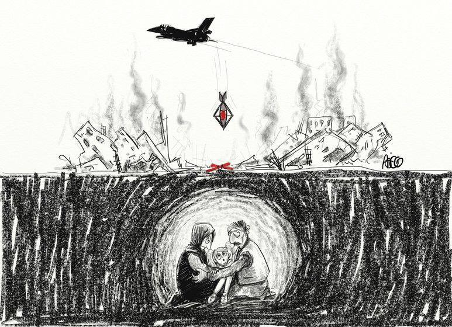
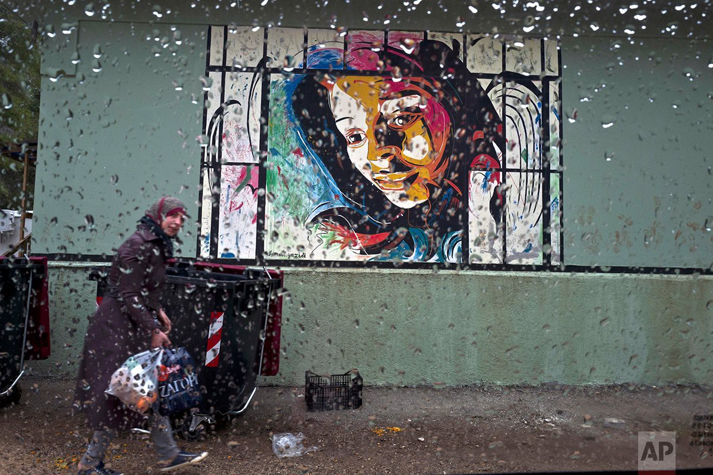
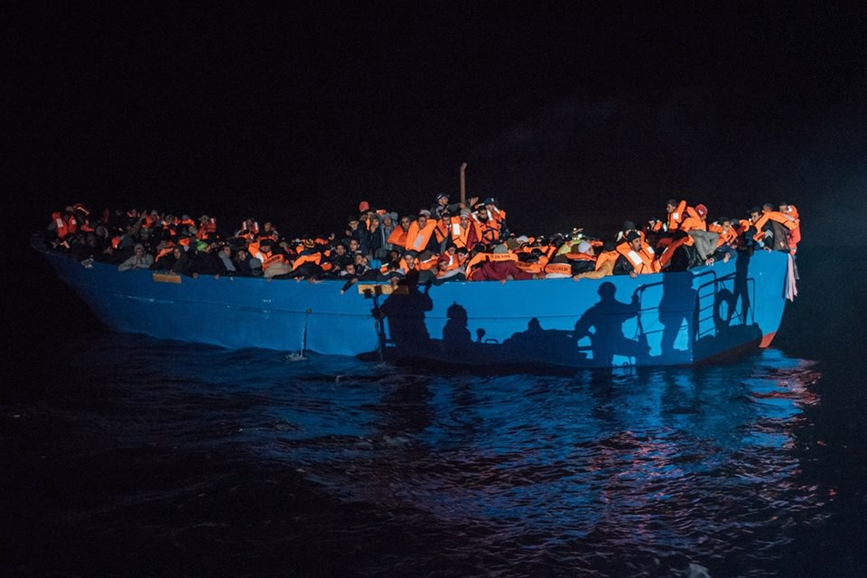
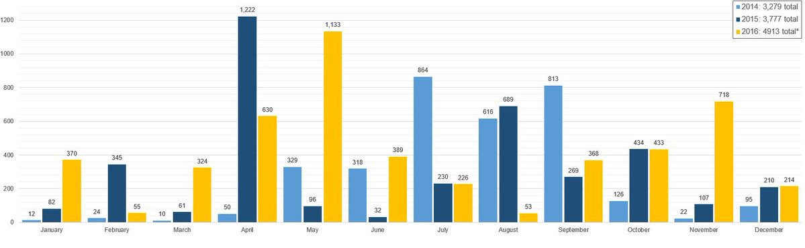

### AYS DAILY DIGEST: 28/12/2016: Erdogan’s Peace Plan: Dismemberment of Syria, War against Kurds

Art Against\. By Mohamed Ajeg
#### Feature
#### Turkey, Russia, and Iran agree on nationwide ceasefire in Syria

The ceasefire is set to go into effect on Thursday, and is supposed to be the precursor to political talks intended to secure peace after war has ravaged the country for nearly 6 years\. Peace talks are scheduled to take place in Astana, the capital of Kazakhstan\. Turkey, Russia, and Iran are to be the only foreign countries that participate in the conference, with a conspicuous absence of the US and Gulf States\. American officials have voiced intense displeasure at such an arrangement\. These talks are, according to the involved parties, supposed to support and not supplant a future UN\-led peace process\. Several opposition groups are complaining that they have not received an invitation\.

Sources who have given statements to Reuters indicate that the plan will see Syria carved up into distinct spheres of influence, and the continued reign of Syrian president Bashar Assad\. Assad’s tenure would not be permanent however, and there are plans to have him replaced, with a list of possible successors drawn up\. “Russia and Turkey would allow him to stay until the next presidential election when he would quit in favor of a less polarizing Alawite candidate,” the sources told Reuters\. The deal would also implement the decentralization of the Syrian government, allowing for more autonomy in the spheres of influence\.
#### The Turkish About\-face and the Kurdish Question

Participation in such a venture signals a major change in Turkish policy on Syria\. For years, Turkey was at the forefront of the effort to unseat Assad, with Turkish president Erdogan making very loud calls for his departure\. Following the downing of a Russian jet which supposedly breached Turkish airspace however, Turkey has moved closer to Russia’s position\. One official interviewed by Reuters had the following to say:

> _“Our priority is not to see Assad go, but for terrorism to be defeated… It doesn’t mean we approve of Assad\. But we have come to an understanding\. When Islamic State is wiped out, Russia may support Turkey in Syria finishing off the PKK\.”_ 

The statement is central to understanding the shift in Turkey’s position\. With brutal reprisals taking place in the Kurdish\-majority provinces of East Anatolia, Turkey sees the prospect of an independent Kurdish formation in Northern Syria as a far greater threat to its integrity and safety than the Assad regime\. Turkey is angry at continued American support of the SDF, an organization overwhelmingly composed of YPG troops\. This support triggered an intervened in Northern Syria last summer\. Operation Euphrates Shield, ostensibly meant to clear the Turkish\-Syrian border of ISIS troops, has been heavily engaged in preventing Rojava from “linking the cantons” i\.e\. unifying the Kurdish areas under YPG control into a single contiguous bloc\. The peace talks will not include representatives from the Kurdish PYD party, despite the fact that they control a significant amount of territory\.

Should the above\-mentioned peace plan be implemented, Turkey will find it imperative to wrest control from the Kurds\. Turkey would of course be responsible for the zone of influence encompassing the Kurdish\-majority areas of Syria\. Turkey’s goal is to pacify the Kurds by any means necessary, as attacks against Kurds in Turkey and battles against YPG forces in Syria show\. There is to be no mistake about it, the peace plan outlined above would be a death sentence for the Rojava project, and for the people living in the territory\.

In addition to the political effect of Turkish policy, encroachment would also have a catastrophic effect on the populace of these areas\. Turkey has brutally violated the rights of Kurds who are citizens of Turkey, there is no telling what the Turkish military would do to the Syrian Kurds\. Indeed, it is very likely that there would be another flow of refugees out of Rojava, thousands more displaced from their homes\.
#### Lebanon
### SB OverSeas sets up school for refugee children

#### Turkey
### Iraqi refugee in desperate need of medication\!

An Iraqi refugee who lost his both legs in a bomb had a double amputation in Iraq\. He is now living in Balikesir, Turkey\.

He still experiences severe pain and needs the painkiller Contramal 50mg\. He has been to a private hospital but they would only issue him 20 tablets, which will last him 10 days\. If he wants more, he has to travel to Izmir to a specialist hospital\.

We are looking for someone who can drive him or donate the money to get him to the hospital in Izmir so that he can get a prescription\. If you can drive him, he will need help with getting into the car and you need to be able to store his wheelchair\.

Alternatively, if you know of any other way for him to get his pain medication, please James Smith on Facebook\.
#### Greece

Refugee woman walks through the rain: Photo Credit: Muhammed Muheisen\.
### 204 arrivals to the islands
### Greek government releases refugee statistics through December

The full report may be found [here](http://asylo.gov.gr/en/wp-content/uploads/2016/12/Greek-Asylum-Service-statistical-data_November2016_en.pdf) \. According to the government, a total of 44,375 people have applied for asylum from January 1 to November 30 2016\. A total of 7,625 applied for asylum in November 2016, compared to the monthly average of 1,100, a nearly 600% increase from last year\. This shows the aftermath of the closure of the Balkan Route, with refugees now understanding that they will be trapped in Greece for a very long time\. To do otherwise would mean deportation, which is an even worse option\.
### Greece promises to fix overcrowding in camps

The Greek Migration Minister Yiannis Mouzalas has promised to implement solutions to minimize crowding on the camps on the islands\. [“We are planning to have new, small venues on the islands, either by setting up small, two\-story houses, in order to empty the tents, or by finding other places… to improve conditions,”](http://www.ekathimerini.com/214899/article/ekathimerini/news/migration-minister-vows-to-improve-conditions-at-camps) he said\. One can only hope that this time the Greek government will live up to its promise\. Similar promises have been made already, with little to show for it\.

He also promised that by March, refugees will be receiving no less than 400 euros per month, and that soup kitchens will no longer function in camps\. By April, refugees will be receiving electronic cards to replace residence permits\.
### Basque activists arrested while boarding ferry with refugees

[Pikara Magazine reports](http://www.pikaramagazine.com/2016/12/dos-activistas-vascas-detenidas-en-grecia-cuando-intentaban-trasladar-a-un-grupo-de-refugiados-desde-grecia/) that two activists were arrested while they were boarding a ferry heading to Italy along with 8 refugees\. The action was part of a civil disobedience campaign\.
### Due to cold temperatures, two new shelters open for homeless in Athens

1/ 26, Drakou Street, Koukaki, Athens 
 Phone: 210 9232 044

2/ 12, Formionos Street, Pagrati, Athens 
 Phone: 210 7222 590

### Tips for coping with the cold

News That Moves [has reposted](https://newsthatmoves.org/en/surviving-the-cold-3/) the following common sense tips for helping people in cold\-related emergencies:
- If you are in an organised camp/shelter, ask for assistance to the staff/medical working there;
- If you are on the outside, get out of the cold and seek shelter, if possible;
- If you are assisting somebody in danger because of cold, treat the person gently and monitor breathing carefully; get the person into a shelter and remove any wet clothes, gently drying the person; warm the person by wrapping blankets or dressing in dry clothes; cover the head and neck and warm the person slowly\. If hot water bottles are available put them under armpits, around the groin and back of the neck, but be careful not to burn these areas;
- Never rub areas affected by frostbite;
- If the person is alert, give small sips of warm liquids to drink\.

### Free eye checks, prescription glasses for refugees

Dear friends and volunteers in Lesvos:

I am happy to announce that from 7th of January Lea Vittoria Uva, a volunteer from UK coming to Lesvos for a month she will help me to support this project coordinating the appointments for the free eye check on Thursday’s at Dr\.Marselos’ \(ophthalmologist\) clinic in Mytilini and the distribution of the prescription glasses after the check has been done\.

Please help us to spread the word among refugees in all camps: Moria,Pikpa,Kara Tepe,No borders kitchen…
 Please contact us through private message for appointment\.
 The visits will start again after Christmas holidays\.

“When I see them smiling and with so much gratitude I realize how worth is this project\.”

HELP US TO BRING LIGHT TO THEIR EYES\!

Thank you so much Lea Vittoria for your support and kindness\. I am so grateful to you\!
### No Border Kitchen Lesvos needs your help\!

#### Serbia

■■■■■■■■■■■■■■ 
> **[MSF Sea](https://twitter.com/MSF_Sea) @ Twitter Says:** 

> > We have offered the @[SerbianGov](https://twitter.com/SerbianGov) our availability to intervene in #Belgrade, but we're still waiting for a reply. How long can they wait for? https://t.co/b40qjeBpB8 

> **Tweeted at [2016-12-28 16:34:44](https://twitter.com/msf_sea/status/814147584675745792).** 

■■■■■■■■■■■■■■ 

### Refugees illegally pushed back in the Balkans

UNHCR has warned that 1,000 refugees were expelled in November along the Balkans route, a violation of international law\. One particularly egregious incident happened on December 17, when a seven\-member Syrian family was accosted on a bus, and their documents were torn up by an officer\. The bus driver has confirmed the incident, according to the Belgrade Center for Human Rights\. In November, 109 people were deported from Serbia to Macedonia, even though some of these people had Serbian asylum papers\.
### Today’s numbers for Miksalište

Today a total of 283 people took advantage of Miksalište’s facilities, 233 children, 31 men, and 19 women\.

#### Hungary
### Group provides counseling for refugees\.

The Cordelia Foundation for the Victims of Torture, based in Budapest, is offering counseling for refugees suffering for psychological trauma, especially those who were tortured\. They have translators for a wide variety of languages, such as Arabic, Farsi, Pashtu, Dari, Somali, Amhara, Oromo and English\. Their medical team visits centers all over Hungary, and those who are in Budapest may find their office at 1333 Budapest, 1/b\. Karpat utca, 6th floor 24\. You may make an appointment by calling them at \+36 1 3491450, or by sending them an email at [cordelia@cordelia\.hu](mailto:cordelia@cordelia.hu) \.

#### Germany
### 55k chose to return to home country, 20k barred from entering Germany

The following is a translation of a Süddeutsche Zeitung article:

In 2016, 55 000 refugees have left Germany voluntarily — an unprecedented number\. They are receiving money from the German government and avoid forced deportation\.

An estimate of 55\.000 refugees have voluntarily returned to their home country with financial aid from German government in 2016\. Most of them from/to the West Balkans\. Forced deportations are estimated at 25\.000\. Voluntary returns have a lot of advantages: more human \(no police coming for people in the middle of the night\), an informed and planned decision to return, and no re\-entry ban for Germany\. Authorities also save money\. 
The largest number of returns, with 15\.000 refugees, before November, were from Albania, followed by Serbia \(5\.000\) Iraq and Kosovo\. Returns to Afghanistan, Iran and Iraq have also increased \(3\.200 voluntary returns to Afghanistan\) \.

Various financial incentives are offered for voluntary returnees\. Starting February 2017, the program of „Starthilfe plus“ is going to offer money in addition to the standard grant for returnees: the earlier the refugees decide to return, the more money they’ll receive\. If a family of 5 decides to return even before they receive a negative decision for their asylum plea, they’ll receive 4\.200 Euro in addition to the standard sum, which includes travel costs, pocket money, and a simple starting grant \(depending on country and age of the children between 1\.000 and 3000 Euro\) \. The program “Migration and Development” will open up for returning refugees\. The program supports individual counseling and reintegration into the home countries and will initially focus on refugees from Morocco, Tunisia, Nigeria, Kosovo, Serbia and Albania\. This program is offered in addition to existing development projects, which encompass 150 Mio\. Euro for the next 3 years\.

Already now, a large number of offers exists for voluntary returnees — depending on state/city of residence and home country\. The international organization of migration \(IOM\) is managing these programs\. In addition, there are several further programs for future entrepreneurs: Someone who wants to start his own business, and can present a viable business plan, might receive several thousand Euros\.
#### France
### Refugee dies trying to into England

A 17 year old Kurdish refugee died on December 24 after falling from a truck\. He had presumably hidden in the truck in the hopes of making it into England\. This is the 17th known death this year\. His death shows first of all that refugees continue to go to northern France in the hopes of crossing into the UK, and secondly that the journey presents considerable risks\. Many refugees were injured trying to make this crossing, some of them escaping with only injuries\. Others, such as this week’s victim, were not so lucky\.
### Police filmed in the aftermath of teargas and rubber bullet attack against refugees

Kesha Niya reports that on the night of December 27, there was a police action against refugees using teargas and rubber bullets\. Two injuries were reported\. The video may be seen below\.

### A reminder for volunteers

Don’t go looking for or visiting small camps and squats in France\.

You attract the attention of the CRS\- however careful you think you are being\- and that can have horrible consequences for the people you want to help\.
#### UK
### Unaccompanied refugee children from Calais sue UK government

[The Guardian reports that](https://www.theguardian.com/world/2016/dec/28/calais-child-asylum-seekers-legal-action-against-uk-government) the asylum seekers feel that Amber Rudd has reneged on her legal responsibilities\. Of the 36 children, 28 have been refused asylum and 8 are still awaiting decisions\. The lawyers accuse that the Home Office did not give asylum to the most desperate, and that proper decisions explaining the rejection were not issued\.
#### Mediterranean

One of the three boats picked up by SOS Mditerranee last night\.
### Over 800 people were rescued by SOS Mediterranee last night
### 11 bodies found on Libyan beach

The Red Crescent [has reported](https://www.today.ng/news/africa/237846/11-dead-migrants-libya-beaches) that 11 bodies of refugees were found on the beach near Tripoli\. The victims will likely go unidentified and will be buried in unmarked graves\.
### Lest we forget, a record number of people has died crossing the Mediterranean this year

The above chart is not completely up to date\. The current figure for 2016 is actually 5,011 deaths\. This massive increase comes despite a decrease in the number of people making the voyage, a testament to the increasingly scrupulous practices of smugglers\.
#### Australia
### Please sign this petition for visas so that family can visit a terminally ill relative

#### General
### A guide for locating missing family members

[News That Moves has published](https://newsthatmoves.org/en/illegal-pushbacks-continue-in-balkans/) a guide to the Restoring Family Links service\.
- Begin a general search on the [Restoring Family Links home page](http://familylinks.icrc.org/en/Pages/home.aspx) , which asks which country the user is in currently and where you believe the person you are searching for is;
- If you are looking for someone **in Europe** or if family or friends are looking for you, please click on [Trace the Face](http://familylinks.icrc.org/europe/en/Pages/Home.aspx) \. You can post a photo of yourself, allowing friends and relatives to find you;
- If searching **globally** , use [Online Tracing](http://familylinks.icrc.org/en/Pages/online-tracing.aspx) , which includes a long list of countries where the service is available;
- Restoring Family Links also can [help those without travel documents](http://familylinks.icrc.org/en/Pages/HowWeWork/other-services.aspx) \.

_Converted [Medium Post](https://areyousyrious.medium.com/ays-daily-digest-28-12-2016-peace-plans-for-syria-97b0459dbaf3) by [ZMediumToMarkdown](https://github.com/ZhgChgLi/ZMediumToMarkdown)._
