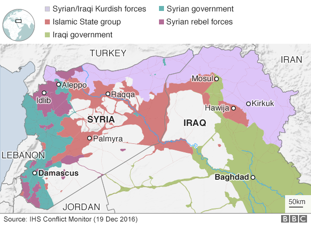

### AYS DIGEST: 29/12 —Are the camps prepared for the cold?
### New ceasefire in Syria to start at midnight/Widespread support for arrested volunteers/Austria threatens refugee homelands with sanctions/Bavarian lawmakers want to return boats to Africa

](assets/5e931d1e502f/1*RhS9bNhc-RrzSEHi-uzhfQ.jpeg)

Photo by [**Art Against**](https://www.facebook.com/artagainstproject/?hc_ref=PAGES_TIMELINE&fref=nf)
### Syria

The Syrian government and rebel groups have agreed to a nationwide ceasefire beginning Thursday at midnight\.

The announcement was made by Russia’s President Vladimir Putin and confirmed by Turkey\. The two nations, which back opposing sides in the conflict, will act as guarantors\. The High Negotiations Committee \(HNC\), regarded by the UN as Syria’s main opposition body, confirmed the deal, which excludes jihadist groups like Jabhat Fateh al\-Sham\(former Al\-Nusra\) and ISIS/Daesh\.

If the truce holds, peace talks will be held in Kazakhstan within a month\.

On one side of the deal are Syrian government forces, their factional allies and the Russian military; on the other side, the Free Syrian Army \(FSA\), a loose alliance of several moderate rebel factions, plus other groups under the High Negotiations Committee \(HNC\), the umbrella group representing Syria’s political and armed opposition factions\. In total, thirteen opposition factions have signed the deal\.

This deal does not include the Kurdish Popular Protection Units \(YPG\) which, along with other Kurdish militias, control a large area of northern Syria on the Turkish border\. The YPG is regarded by Turkey as a terrorist organisation and an extension of the banned Kurdistan Workers’ Party \(PKK\) \.

According to Putin, the agreement has 3 key points: the ceasefire itself, measures for overseeing the truce, and the start of peace talks between both sides\. Under the terms of the deal, the peace talks would begin within a month of the ceasefire taking effect and would be held in the capital of Kazakhstan, Astana\.

Although conditions on the ground have changed since previous ceasefire attempts, including the fall of Aleppo into regime hands, Putin described the deal as fragile\. Meanwhile, Turkey’s president has said a “window of opportunity” had been created that “should not be wasted\.” Both stressed that they will continue to fight groups considered as terrorists\.

In the interim, fighting continues to rage in the country; we recently received reports of 14 people being killed and many more injured in east Ghouda after Russian airstrikes and mortar fire\.

](assets/5e931d1e502f/1*mtMNgyVNbGX5c0y8ROuTsQ.jpeg)

Photo by [**Free Syria — Salam**](https://www.facebook.com/Free.SyriaSalam/)

It will be difficult to believe in a real ceasefire whilst innocent people keep dying even as promises are being made\.
### Greece

As announced, very cold weather and snowfall has arrived to many parts of Greece today, including the Atika area, Athens and even the islands on the front line of the crisis like Lesvos, Chios and Rhodes\.

Refugees have been struggling to live in very poor conditions in the camps, especially since the winter began\. Ironically, this severe weather came less than twenty\-four hours after Greece’s migration minister, Yiannis Mouzalas, said that all refugees were staying in sheltered, heated areas with the exception of the ones living at Elliniko camp, in Athens, which were still in outdoor tents\.

These comments have outraged many refugees and volunteers around the country that see very different conditions every day, and continue to struggle with the low temperatures\.

These are some examples of how **wrong and uninformed** the minister is about the real situation:

Derveni\-Alexi \(Northern Greece\)

](assets/5e931d1e502f/1*JIiZ7dMJo9L4-UCsS2ou0g.jpeg)

Photo by [**Ruhi Loren Akhtar**](https://www.facebook.com/ruhi.akhtar.7)

Vagiohori \(Northern Greece\)

](assets/5e931d1e502f/1*J5CNxz3hlcrHkPHLLptcMg.jpeg)

Photo by [**Ruhi Loren Akhtar**](https://www.facebook.com/ruhi.akhtar.7)

Vasilika \(Northern Greece\)

](assets/5e931d1e502f/1*MFNubkgi5QfZhPpe4lB12g.jpeg)

Photo by [**Chania Helps Refugees**](https://www.facebook.com/groups/ChaniaHelpsRefugees/permalink/1446205585506012/)

](assets/5e931d1e502f/1*pLiO6O_5ExT54BppIWpAHA.jpeg)

Photo by [**Chania Helps Refugees**](https://www.facebook.com/groups/ChaniaHelpsRefugees/permalink/1446205585506012/)

Softex \(Northern Greece\)

](assets/5e931d1e502f/1*6-zaFVLsHRC-Peyi67TmDw.jpeg)

Photo by [**Sainab Abdi**](https://www.facebook.com/sainab.abdi)

Oreokastro \- with regular power cuts \(Northern Greece\)

](assets/5e931d1e502f/1*Cjjh4ahp_6JHn2tOFids0g.jpeg)

Photo by [**Ruhi Loren Akhtar**](https://www.facebook.com/ruhi.akhtar.7)

Some refugees have to use rudimentary ways to generate heat\.

](assets/5e931d1e502f/1*xVSOtoodBCh8xJ0r_6Qz0Q.jpeg)

Photo by [**Ruhi Loren Akhtar**](https://www.facebook.com/ruhi.akhtar.7)

Malakasa \(Southern Greece\)

](assets/5e931d1e502f/1*W6BgqPQ6xe0uNBpRBAVTuw.jpeg)

Photo by [**HeimatsternMünchen**](https://twitter.com/Heimatstern_org)

Oinofita \(Southern Greece\)

](assets/5e931d1e502f/1*gLLevq779Fm9hprAS5N9tQ.jpeg)

Photo by [**Art Against**](https://www.facebook.com/artagainstproject/)

Moria \(Lesvos\)

](assets/5e931d1e502f/1*ENu2pO-UHzvIpUhXlosQrw.jpeg)

Photo by [@MSF\_Sea](https://twitter.com/MSF_Sea)

Souda \(Chios\)

](assets/5e931d1e502f/1*KsX5uoS2Xy1hlhyj0BeIvg.jpeg)

Photo by [**Leslie Meral Schick**](https://www.facebook.com/leslie.schick?fref=nf)

Samos

](assets/5e931d1e502f/1*eXIdyOL4KOrbBbXbrUZ2cA.jpeg)

Photo by [**Samos Volunteers**](https://www.facebook.com/samosvolunteers/)

](assets/5e931d1e502f/1*qcHvUA6SXO7M2pM2UpCFKQ.jpeg)

Photo by [**Samos Volunteers**](https://www.facebook.com/samosvolunteers/)

It’s difficult to understand where the minister is getting his updates from, but volunteers on the ground tell a very different story\. There are many, many refugees still living in unheated tents around Greece\.

Even the **evacuation of the Katsikas camp today** and the transfer of all the refugees to a hotel gives us another example of the inaccurate information Mr\. Mouzalas delivered yesterday\. At that time almost 200 refugees were living in tents like these:

](assets/5e931d1e502f/1*MUHNuNNMNfHALOC4xQF2Cw.jpeg)

Photo by [**KatsikasLive**](https://www.facebook.com/muhammadalisyria/)

Nevertheless, the transfer of these refugees can be seen as good news for today\. We continue to hope that all the other camps will close as soon as possible and refugees transferred to safer places\.
#### Islands

There were **31** new registrations today on the Greek islands\.
#### Solidarity

Today, many groups expressed their solidarity with the Spanish couple who was arrested yesterday and accused of trying to smuggle eight refugees in a trailer back to the Basque Country region:

> Crime is drowning refugees or putting them in concentration camps, not civil disobedience and solidarity 

> In the early hours of Wednesday 28 December 2016, the Igoumenitsa Coast Guard arrested Mikel Zuloaga and Begoña Huarte, both of Basque origin, because they attempted to transport eight refugees in a trailer, with Basque Country as their final destination\. This was part of a large\-scale campaign for the free movement of refugees, with guaranteed dignified living and working conditions, in the struggle for a life without discrimination and exclusion\. This is an absolutely justified act\. The two Basques are being held in Igoumenitsa under heavy indictment, six out of the eight refugees were released, while the remaining two are being held under terrible conditions because they didn't have any papers\. 

> In their statement, published shortly after their arrest, Mikel and Bego vividly illustrate their motivations and reveal the greatness of solidarity: "\. \. \.this is an act not aiming at profit, an action that is self\-financed by various people belonging to social movements\. It is an action aiming at solidarity between people, and at condemning the policies currently being implemented\. \[ \. \. \. \] When states do not respect human rights, the civil disobedience will protect them is not only legitimate but essential\. \. \."\. 

> The organization signing this text fully embrace the initiative taken by our Basque comrades and express our solidarity to them and to the detained refugees\. 

> We believe that this act of civil disobedience against the European horror of exclusion, of encroachment of fundamental human rights for refugees, of racism, sets the example for internationalism, dignity and humanity\. 

> The popular, labor and anti racist movement will fight for not only the immediate release and withdrawal of all charges against the four detainees who, from different starting points, rose up against sealed borders, deportations, and barbarism, in favor of dignified conditions for living, education for refugees, in favor of open borders, against racist agreements, against imperialist wars\. 

> Solidarity is our weapon 

> Anarchosyndicalist Initiative Rosinante
 

> Anasynthesi ONRA
 

> ANTARSYA
 

> Thessaloniki antiracist initiative
 

> ARK
 

> Diktyo \- Network for Political and Social Rights
 

> Diktyo\-Network of Social Support to Immigrants and Refugees 
 

> Networking for the Radical Left
 

> Solidarity Committee for Political Prisoners in Turkey and Kurdistan
 

> Movement to Deport Racism
 

> Thessaloniki Solidarity Kitchen
 

> Sunday School for Mograntz
 

> Popular Unity \(LAE\) 

Another statement in solidarity with the 4 arrestees in Igoumenitsa:

> We are all refugees\. 

> We are all Basque solidarians\. 

> We are all traffickers of solidarity\. 

> The signatories of this letter express our unbridled solidarity and demand the immediate release of the two Basque activists and the 2 refugees who questioned in practice the racist border regime of the EU, who were arrested at the port of Igoumenits, and who are today threatened with heavy charges for “illegal trafficking of migrants” and with lengthy detention and deportation, respectively\. We would like to declare that this act of civil disobedience by Mikel and Bego, to transport refugees from Greece to Basque Country is an act that must not only not be persecuted, but which sets the example for humanity, solidarity and justice, in a Europe which more and more resembles the darkest times in its history, a Europe which builds fences and which marshals armed forces against refugees fleeing war, oppression, and poverty\. The arrestees Mikel Zuloaga, Begoña Huarte, Reza Ali και Ahmet Awais have earned our full respect and support\. We will not accept the criminalization of solidarity, on the pretense of a crackdown on “trafficking”, which is met with heavy prison sentences\. With them, we will fight against the barbarism of Fortress Europe, against the segregation of people by nationality, religion, gender, for freedom of movement and for the right to remain\. 

> Antiracist Initiative \(Thessaloniki\)/Antiracist Initiative \(Larissa\)/Antiracist Initiative \(Preveza\)/Athens\- Piraeus Antifascist coordination of committees\- initiatives and collectives/Athens Migrant Social Support Network/“Ektos Taxis” \(Teaching and learning group at the Thessaloniki Migrants Social Centre — Steki Metanaston\)/Movement to Deport Racism/Thessaloniki Social Clinic \(KIA\)/Migrants’ Sunday School Open initiative for a self organized Thessaloniki Pride/“Piso Thrania”\- an initiative for education without discrimination/Thessaloniki Union of Booksellers’ and Stationers’ Employees/ROSSONERO\- Social Center Trikala/Room 39 \(Thessaloniki Support group for Migrants and the Homeless\) 

And From Pampiraiki:

> Freedom to the Basque solidarity activists Zuloaga and Huarte\! 

> According to information received from Igoumenitsa, the charges pressed against the two Basque solidarity activists are trafficking of persons without economic incentive and exposure of persons to danger\.They will be brought to the Igoumenitsa Court tomorrow Friday at 12:30, where greek and spanish groups of solidarity volunteers have called for a protest rally, while they have started collecting money to cover legal costs and the amount of bail that may be imposed for their release\. 

In better news, there has been some great work done throughout Greece, with groups building structures and giving out donations to people in need\. But they still need everyone’s support to be able to continue to operate\.

[Intervolve](http://InterVolve - International Volunteers) have been distributing shoes and diapers to hundreds of refugees at Softex camp\.

](assets/5e931d1e502f/1*5KypEvFBNwHE6wVoMm7-jQ.jpeg)

Photo by [**InterVolve — International Volunteers**](https://www.facebook.com/InterVolve-International-Volunteers-219418945063168/)

](assets/5e931d1e502f/1*2v3t4Pwh2JNf4tH6wMKhmA.jpeg)

Photo by [**InterVolve — International Volunteers**](https://www.facebook.com/InterVolve-International-Volunteers-219418945063168/)

[Help Refugees](https://www.facebook.com/HelpRefugeesUK/?fref=nf) have been building shelters and hygiene facilities in refugee camps across Northern Greece\. They work with people from the refugee community to build community spaces, distribution points and flooring in tents\.

This simple service improves the lives of many, providing respite from the often harrowing camp environments and bringing dignity through improved living conditions and the provision of social spaces\.

To continue this important work in 2017, they need help to purchase the materials needed\. Please help us help them by clicking [here](https://mydonate.bt.com/donation/start.html?charity=127188) \.

[Refugee Info Bus](https://www.facebook.com/RefugeeInfoBus/?fref=nf) is now recruiting:

> We are excited to be recruiting three, 6 month positions to start up the Refugee Info Bus in Greece, in the New Year\. You will form an integral part of the Info Bus team in Greece and Southern Europe\. 

> We are looking for a Greek speaking co\-ordinator, as well as an Arabic speaking Legal Rights and Digital Literacy Co\-ordinators\. These two positions are really well suited for refugees who have claimed asylum in Greece or in other European countries\. 

> Please have a look at our website, which has more details of the requirements and send us a CV and covering letter to recruitment@refugeeinfobus\.com\. 

> All accommodation, expenses and travel costs will be paid for\. Plus, you will receive a stipend of 500 euros a month\. 

[Refugee Support Greece](https://www.facebook.com/RefugeeSupportGreece/) has been in a collaborative effort to heat refugee homes during the bitter winter weather:

> This weekly refill cost 1200 euros\. We pay, a local business supplies and refugees distribute\. Thank you to our donors — this is where you make a difference 

](assets/5e931d1e502f/1*7ljIZwAoaQrnG0ZC8fpwuQ.jpeg)

Photo by [**Refugee Support Greece**](https://www.facebook.com/RefugeeSupportGreece/)
### Serbia

We received tragic new today from Serbia as three refugees were killed in a car crash\.

Three refugees died and 10 were injured, including one child, in a traffic
accident in the south of Serbia, near the city of Nis\. The incident occurred on the highway between Nis and Belgrade when smugglers were transporting 12 migrants and refugees, from Syria, Iraq and Afghanistan, in a family car that smashed into the guardrail and flipped over\.

The ten injured, six of them are children, are in life\-threatening conditions, after having suffered serious injuries to head, arms and legs\. The driver of the vehicle fled before police and ambulances could reach the accident location\.
### Hungary

[SIRIUS\.HELP](https://www.facebook.com/sirius.help/?fref=nf) is in need of donations to continue their great work:

> In the last 3 months the team of SIRIUS\.HELP has handed out
 

> \- 15 tons of firewood
 

> \- 2 tons of food,
 

> \- 1500 winter coats,
 

> \- 800 pairs of winter shoes,
 

> \- 3 tons of pants, pullovers, scarves, gloves, hats and other types of clothes,
 

> \- 500 hygiene packs and medicine
 

> to refugees in the transit zones along the Serbian\-Hungarian border and in Hungarian refugee camps\. 

> To make all of this happen, members of the team
 

> \- drove 25\.000 kms,
 

> \- worked 1\.600 hours on the field,
 

> \- worked 500 hours in our warehouse,
 

> \- spent 300 hours organising, writing e\-mails and articles\. 

> All of this was made possible by your donations\. Thank you for your sympathy and solidarity\. 

If you would like to support them you can do so [here](http://www.sirius.help/donate-now/) \.
### Austria

Austria’s foreign minister, Sebastian Kurz, has called for drastic consequences for countries which fail to take back their asylum\-seeking citizens following the recent Berlin attack, as well as calling for tighter borders\. The Austrian minister said severe measures are necessary in order to address the number of failed deportations of rejected asylum\-seekers or those who have committed a criminal offense\.

According to plans from Vienna, countries that refuse to take back their citizens are expected to receive noticeably less development aid from Europe\.

The EU therefore has to act according to the “less\-for\-less principle,” Kurz said — meaning that those who do less will receive less financially\.
### Germany

Politicians from Bavaria want migrants intercepted in the Mediterranean sent back to Africa\. They also advocate for holding migrants without ID documents in transit centers\.

The Christian Social Union \(CSU\), the Bavarian sister party to Chancellor Angela Merkel’s Christian Democratic Union \(CDU\), is looking to propose a drastic shift in how Germany, and Europe, handle migrant arrivals\. The CSU will hold a party convention next week and are set to call for tens of thousands of migrants intercepted in the Mediterranean Sea to be sent back to North Africa\.

_“The existing policy of automatically bringing all people saved on the migrant route in the Mediterranean to Europe must be broken\.”_

The CSU’s plan would call for expanding cooperation with North African countries and convincing them to take back migrants\.

The CSU has also proposed that migrants who arrive at German borders without a passport or other ID documents should be held at the border and stay in transit centers until their identity is clarified\. In addition, the CSU is advocating limitations on family reunification for certain classes of asylum seekers beyond 2018\.

Fortunately **not everyone has completely lost connection with reality, legality and humanity\.** Refugee advocates strongly criticized the proposal\. A spokesperson for Pro Asyl said sending asylum\-seekers back to Africa without checking whether they are in need of protection was a “full frontal attack on the validity of human rights in Europe\.”

Ulrich Delius from the Society for Endangered Peoples \(GfbV\) argued that Egypt and Libya — the two countries most refugees depart from on their way to Europe and would likely be sent back to — did not offer asylum\-seekers sufficient protection\.

_Converted [Medium Post](https://areyousyrious.medium.com/ays-digest-29-12-new-ceasefire-in-syria-to-start-at-midnight-severe-weather-over-unprepared-5e931d1e502f) by [ZMediumToMarkdown](https://github.com/ZhgChgLi/ZMediumToMarkdown)._
