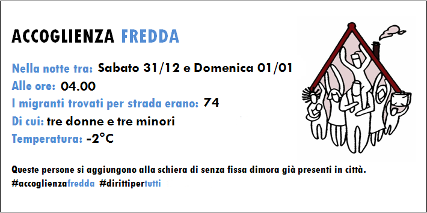
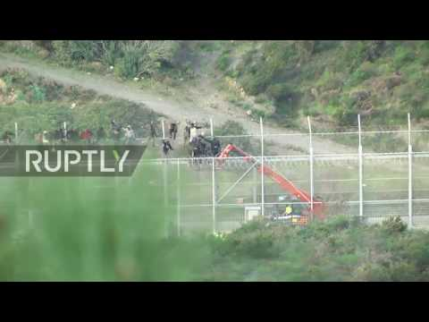
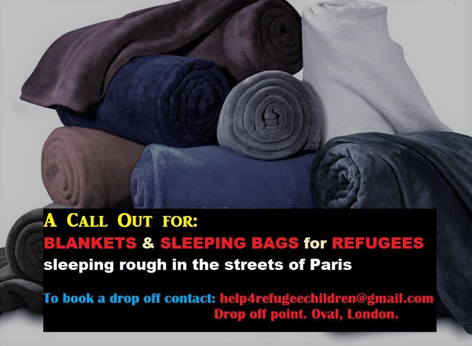

### AYS DAILY DIGEST 1/1/2017: 47 people arrived in Greece at the beginning of new year

_Civilians leaving Damascus area // 3 babies arrived in Greece by boat on the first morning of 2017 // Around 1000 people tried to enter Spain from Morocco // Propaganda against refugees in Serbia // Info from Montenegro // People in the streets in Italy and France need your help_

](assets/2104999f7eb2/1*ar6bzFYYMeU8yWqG2ht-cA.jpeg)

“Happy New Year to all those celebrating it\! Resistance against Hungary government’s racist border policy will continue in 2017" [@MigSzolCsop](https://twitter.com/MigSzolCsop)
#### Syria
### Civilians leaving their homes despite ceasefire

The new year did not start peacefully despite the ceasefire\. Media are reporting that hundreds of civilians fled Barada Valley, the mountainous region outside Damascus today\. According to Syrian military sources, people who left Barada Valley were relocated to “safer areas and their names were registered by the Syrian Arab Red Crescent”\. More details about these civilians are not available so far\.

Akram Abo Alfoz, living in Douma, Syria, paints bombs and bullets and turns weapons of war into art\. “These shells were embossed with the blood of innocents before I was able to bring them back to life one more time\.” Photographs/info by الرسم على الموت\. By Art Against\.
#### Greece
### New arrivals to overcrowded islands

On the first day of a new year, the [Chios Easter Shore Response Team](https://www.facebook.com/chiosesrt/videos/1194922710576911/) helped 47 people who arrived early morning at the port of Chios\. Among people on the boat were a 2 year old with a disability and two 6 month old babies\. All the people are directed toward Vial camp for registration\.

According to official figures, there are 10,938 asylum seekers whose application had not been processed and who are stranded on islands: 5,551 on Lesvos, 3,517 on Chios and 1,870 on Samos\.

[Help Refugees](https://www.facebook.com/HelpRefugeesUK/?fref=nf) issued another call for volunteers\. Visit their page to found out more\.

If in Athens, visit Khora center where there is a new computer lab and IT lessons offered for everybody every weekday from 5 to 7 pm\.

If you have questions write them via [khora\.computer@gmail\.com](mailto:khora.computer@gmail.com) or simply drop by the [Center](https://www.facebook.com/KhoraAthens/) \.
#### Serbia
### Hate propaganda against refugees

Serbian media reports today that police in Belgrade stopped groups of refugees from joining in public celebrations on New Year’s Eve\. Instead, they stayed alone in a park nearby main train station\. At the same time, hate propaganda against refugees in Serbia by the media is relentless\. Media are constantly portraying refugees as potential dangers, the source of diseases, creating the atmosphere of fear and distrust, which may become dangerous\.
#### Montenegro
### Hundreds in center near Podgorica

Over the last couple of weeks, we received info about people who are stopped in Montenegro\. Not much information are available about the situation there\. We found out about some small groups who are helping people, alongside big organizations, including the local office of the Red Cross\. Most of the people are accommodated in Centar za smjestaj in Grbe, Danilovgrad, near Podgorica, the capital city\. During 2016, 251 persons were in this center, including 5 unaccompanied minors and 26 kids with their parents\. At the end of December, 64 persons were in the Center, 54 asylum seekers and 7 refugees, including families with kids and unaccompanied minors\. The state is providing all the people with all the basics, including heath insurance\.
#### Italy
### Possible stricter controls for asylum seekers

In Como, 74 persons slept during the New Years Eve in the streets, including three women and three kids\.

New Italian Prime Minister wants his country to increase ID checks, deportations, and the construction of detention centers\. Previously, Interior Minister Marco Minniti confirmed plans to build several new detention centers to facilitate faster deportations for people whose asylum applications are denied\. Previous Prime Minister Mateo Renzi objected to detention centers on humanitarian grounds\. Due to his attitude, Italy has only four pre\-repatriation camps left operating\. Media reports are suggesting that the interior ministry will open 16 more in the coming year\.
#### Spain
### Another attempt to enter Europe through Ceuta

Around 1000 people tried to enter into Spain’s North African enclave of Ceuta from Morocco on the first day of new year\. Most of them were eventually turned back, according to the Spanish government\.

People tried to climb the top of the 6\-meter barbed wire fence but were lifted down by cranes\. Only two people were allowed into Ceuta to be taken to a hospital, while the rest were returned to Morocco\.

#### France
### Help needed

People are still in the streets of Paris, but also many other cities in France\. If you can, please try to help and join other volunteers who are already doing that\.

#### Sweden
### Around 10,000 asylum applications processed monthly

Sweden’s Migration Agency received 112,000 asylum claims last year, and 77 percent were accepted so far\. According to data released by this body, around 17,000 asylum seekers were registered as refugees, 47,000 were given a permit due to “alternative needs of protection”, and 5,880 withdrew their applications\. The remaining 70,000 applications will be processed in the near future\. 
 
At the end of the last year, Swedish Interior Minister announced the possibility of stricter asylum procedure in the future\. Currently, he said that the proof of ID required when submitting an asylum application is too low\.
Sweden’s Migration Agency \(Migrationsverket\) and police have suggested to the Swedish government that it should consider granting them new powers to help establish identities\. One proposal is for the police to be able to check telephones and computers to look for evidence of identity, as well as on social media\. Being able to body search asylum seekers during the asylum process, as police in Norway can currently do, is another\.

_Converted [Medium Post](https://areyousyrious.medium.com/ays-daily-digest-1-1-2017-47-people-arrived-in-greece-at-the-beginning-of-new-year-2104999f7eb2) by [ZMediumToMarkdown](https://github.com/ZhgChgLi/ZMediumToMarkdown)._
