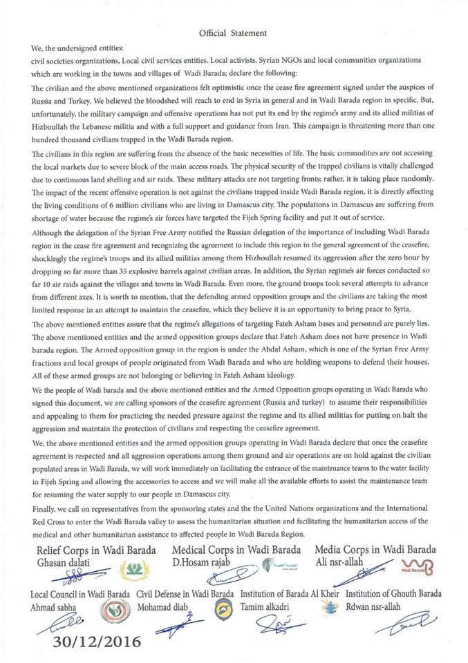
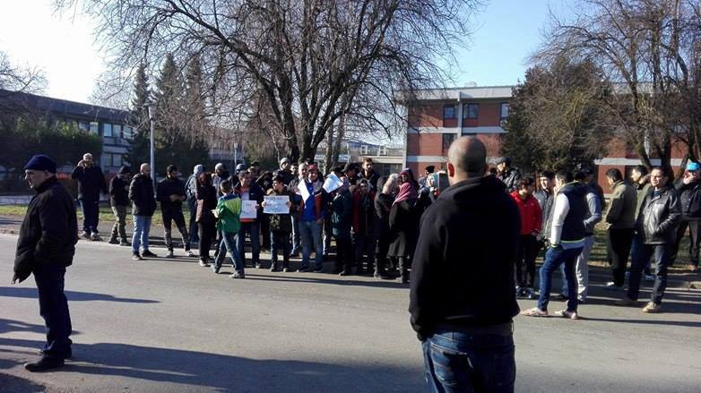

### AYS Daily News Digest 02/01: Hundreds saved in freezing seas at the start of 2017
#### Syrian truce broken\|Hundreds saved in the Mediterranean\|1443 unaccompanied children are on a waiting list for shelter in Greece\|Asylum seekers attacked in Croatia on New Year’s eve\|France deports Sudanese, evicts refugees who are 2 weeks in line to spend a night at a shelter \|Swedish fast lane asylum solving \|Guterres in a tough mission to restore trust in the UN

Photo by Proactiva
#### Weather forecast — warning\!

Extreme cold over the weekend is announced for the Balkan peninsula, with temperatures reaching \-20°C in the mornings of Saturday 7th and Sunday 8th January, [Severe Weather Europe](https://www.facebook.com/severeweatherEU/) warns\.

](assets/900ff0d97142/1*mV2oziQ1UC85EInxhsI-xQ.jpeg)

Source: [Meteociel](https://www.facebook.com/Meteociel.fr/)
#### SYRIA
### Ceasefire breaches break trust in the truce agreement

Thirteen Syrian civil society organizations have appealed for a single version of the ceasefire agreement, to be made public\. They said the violations, including the 10 airstrikes targeting Wadi Barada northwest of Syria’s capital Damascus on Monday morning, prove “the lack of seriousness of the regime”, and called for “the continuous and unhindered delivery of humanitarian and medical aid to all Syrian territories and primarily to the besieged areas” as “the real test on the willingness of the regime and its allies to abide by UN Security Council resolutions”\.

**Official statement on the situation in Wadi Barada that was released by Syrian civil society groups**
#### Mediterranean

More than a hundred people, among them four children and three pregnant women, were travelling in an overcrowded boat on rough seas in very low temperatures\. Everyone aboard was saved by the teams of [Proactiva Open Arms](https://www.facebook.com/proactivaservice/) \. 
MSF also reports the first rescue of this year went well, with more than 100 people safely evacuated from the vessels\.

Photo: MSF Sea \(Twitter\)
#### GREECE
#### Arrivals & registrations

Along with the 46 refugees we reported as arriving on Chios, another 66 people arrived on Samos, making a total of 112 people who landed on Greek shores in the first 24 hours of the new year\. They and 22 people on other islands, i\.e\., a total of 134 people were officially registered today\.
Speaking about the overcrowded camps on the Aegean islands, Greek deputy minister Yannis Mouzalas offered an explanation that “if the refugees currently on the islands would move to the mainland, the EU\-Turkey refugee relocation deal might be put at risk”, [media](http://greece.greekreporter.com/2017/01/02/refugees-in-greece-will-receive-cash-instead-of-meals/) report\.

Banners in Souda Camp on Chios

A new food program will be implemented in March for the refugees in mainland Greece, Mouzalas announced\. They will be getting money for food instead of free meals — every month each refugee family will receive the minimum guaranteed income a Greek family would get minus one euro\.

[Nurture Project International](http://www.nurtureprojectinternational.org) is looking for technical volunteers experienced in infant feeding support such as IBCLCs, midwives, peer supporters, health visitors, nurses, nutritionists, breastfeeding counselors, IFE experts, and support personnel to volunteer in Greece\. Please email Volunteer@NurtureProjectInternational\.org for more information and to apply\.
### Thessaloniki

While many refugees from mainland Greece have recently been moved from camps to more decent accommodation, volunteer groups like Team Bananas and Soul Food Kitchen have been providing food for those on the streets of Thessaloniki, refugees and homeless, and camps in the area\. Recently help also came from the [Graz:Spendenkonvoi](https://www.facebook.com/GrazSpendenkonvoi/) team, who have been present and active in Greece before, having come two times with substantial financial support and donations for the Thessaloniki area camps, but most importantly — coming personally to help and assist those working in the area\. To those on the streets of Thessaloniki, in severe weather conditions, [Soul Food Kitchen](https://www.facebook.com/dirtybunch/?fref=ts) provides two meals a day, hot tea and together with other volunteer groups they hand out blankets and sleeping bags\.

 , [Graz:Spendenkonvoi](https://www.facebook.com/GrazSpendenkonvoi/) \)](assets/900ff0d97142/1*H0AzMhA1KvZwHrDHqFnbEA.jpeg)

spices shelf of the Soul Food Kitchen \(Photo: [Ulrike Kabosch](https://www.facebook.com/ulrike.kabosch?fref=nf) , [Graz:Spendenkonvoi](https://www.facebook.com/GrazSpendenkonvoi/) \)

Thankfully, a great number of volunteers staying for different lengths of time come to give a hand at the kitchen where the cooking coordinator Piksi and the team always welcome everyone willing to help\. Together with [Team Bananas](https://www.facebook.com/TBananita/?fref=nf) they try to provide food also to those in the more remote and less well equipped camps, like Vagiochori, 40 km away from Thessaloniki\.

 \)](assets/900ff0d97142/1*YnbwW1CLO9Wy6SjZwXY0Og.jpeg)

Vagiochori camp \(Photo: [Ulrike Kabosch](https://www.facebook.com/ulrike.kabosch?fref=nf) \)

> Many of the places are spread out so that some areas are well looked after and others are not\. In one area 40 minutes from Thessaloniki, where there are greater numbers of children, refugees are not permitted to cook and are given insufficient meals such as salads and white bread\. Team Bananas are currently negotiating with other organisations to find ways to help with supplies, food and support for the refugees\. — [Team Bananas](https://www.facebook.com/TBananita/?fref=nf) 

Photos: Team Bananas
### Athens
#### Free clothes distribution

[**Humanitarian Initiative Bridges**](https://www.facebook.com/pages/Humanitarian-Initiative-Bridges/223591664756323) : Address Vilara 2\., tel: 6995144160
Monday to Thursday: 09:00 to 17:00

[**Caritas Hellas**](https://www.facebook.com/caritashellas/) : Kapodistriou Street 52, tel: 210–524\.66\.37
Mondays 10:30 to 13:00: women and children
Wednesday 10:30 to 13:00: men

[**Khora**](https://www.facebook.com/KhoraAthens/) : Tsimiski 21 / Asklipiou 80 \(Basement\)
Open Daily \(except Sunday\)10\.00–19\.00

**Omonia Church** 
Pireos 28, 1st floor, Omonia, tel\.: 6945 014 385
Tuesdays and Thursday: 11:00 to 17:00
Clothes distributed through Samaritans Purse

[UAREUK](https://www.facebook.com/groups/uareuk/) volunteer group is collecting sewing material for the women’s space at one of the squats in Athens, contact them if you would like to join\.

> The former Athens airport at Elliniko that had become a makeshift camp accommodating about 5,000 refugees should be removed as soon as the planned new hospitality structures are finished, Greek minister Mouzalas said\. 

 & [UN Children’s Fund](http://reliefweb.int/organization/unicef)](assets/900ff0d97142/1*wTtYXVpYouG81TgkJfSHYw.png)

Statistical data of the number of refugee children in Greece, infographics by [Government of Greece](http://reliefweb.int/organization/govt-greece) & [UN Children’s Fund](http://reliefweb.int/organization/unicef)

 & [UN Children’s Fund](http://reliefweb.int/organization/unicef)](assets/900ff0d97142/1*XV2Tbi00EcMPNBzXUO3LTQ.png)

infographics by [Government of Greece](http://reliefweb.int/organization/govt-greece) & [UN Children’s Fund](http://reliefweb.int/organization/unicef)
#### MACEDONIA
#### “Macedonia with Love for Aleppo”

LEGIS launched a campaign that aims to raise awareness of the harsh and heartbreaking conditions of the refugees evacuated from Aleppo, to back the safe evacuation of the ones that still await refuge and to support thousands of innocent human lives by donations by selfless citizens and through various activities\. The funds raised by the citizens of Macedonia will be delivered on their behalf to refugee camps where refugees are sheltered\. Link for donations is available [here](http://www.legis.mk/donate) \.
#### ROMANIA
#### 48 Iraqis found in a truck transporting chocolate

The border police at the Danube port of Giurgiu on the Romanian\-Bulgarian border said that they discovered 22 men, 9 women and 17 minors including a young infant, all from from Iraq, in a vehicle on Thursday evening after checks on the truck revealed a high level of carbon dioxide\. The official statement from Romania’s border police said the truck was driven by a Bulgarian man who was transporting boxes of Bulgarian chocolate to Hungary, the desired final destination\. The people told the police they wanted to reach Hungary, Associate Press reported\.
#### SERBIA

For the second year running, [Refugee Aid Serbia](https://www.facebook.com/refugeeaidserbia/) is organizing the Shoebox Project in collaboration with different schools and organizations on the occasion of the orthodox Christmas celebrations\. The boxes are intended for the refugee children in Serbia, but also for Serbian children in need\. Refugee Aid Serbia invites everyone to take part by coming to a concert [event](https://www.facebook.com/events/1435106276508853/?ref=1&action_history=%5B%7B%22surface%22%3A%22permalink%22%2C%22mechanism%22%3A%22surface%22%2C%22extra_data%22%3A%5B%5D%7D%5D) on January 4 and leaving a decorated shoebox at the entrance of the venue, containing articles such as candies, a small toy, underwear, socks or stationary supplies and a Christmas card\.

Meanwhile, in Belgrade and the surrounding area, harsh living conditions continue for many stuck in limbo on their way to a refuge\.

 \)](assets/900ff0d97142/1*XofM1ZGDuiZZyJYCAZ-6GA.jpeg)

On the first days of the year the sun brought many of the refugees, residents of the abandoned sold warehouses, out to enjoy a bit of much needed warmth\. Some spent time together playing cricket\. \(Photo: [Refugee’s Anthem](https://www.facebook.com/refugeesanthem/) \)

 \)](assets/900ff0d97142/1*sFvULN_WbAl8inq1t0Ck_w.jpeg)

showering in the winter sun \(Photo: [Refugee’s Anthem](https://www.facebook.com/refugeesanthem/) \)
#### CROATIA
### Asylum seekers beaten up on New Year’s eve

The Croatian capital did not send out a nice message on the first day of the new year\. While on their way home from the city centre, on the night of December 31/January 1, a young man and a woman, both residents of the Porin reception centre, were attacked by an unknown group of four masked men who got on the 109 city line bus at the main train station\. Right after that, according to the statements of those attacked, another bus arrived with a group of Porin residents on board\. The driver reportedly let the masked men get on the second bus despite their obviously agressive intentions\. The unknown masked men then attacked the four asylum seekers, only to get off the bus later and wait for them at the end station, attacking them again, beating them with baseball bats, while according to their statements, a female person seemed to have been recording everything from a nearby car that the attackers later used to drive off\. According to the asylum seekers’ statements, they reported the incident to the police, but the police did not investigate any further, not having even asked the names of the assailants\. Also, only upon insisting they needed to go to the hospital in the morning, after having received first aid in Porin in the night, the group from the second bus went to the hospital\. Two of them have medical documents to prove it, contrary to police claims that only one person accepted their invitation to seek medical help\. The medical papers document injuries to the head and extremities\.

some of the injuries \(Photos: Sara Benceković, AYS\)

In the [statement](https://www.mup.hr/novosti/325/prosvjed-trazitelja-azila) issued by the police, they insist the police officers did follow up and that the refugees and asylum seekers in Croatia are given the rights they are entitled to, including the right to protection, mentioning that the Porin reception centre is constantly under police protection\. These reactions came after Porin residents held a [protest](http://hr.n1info.com/a171461/Vijesti/Prosvjed-trazitelja-azila-ispred-Porina-zbog-napada.html) in front of the reception centre today, receiving a lot of media attention and the media insisting on police clarification\.

Protest in front of the reception centre Porin

However, due to the discrepancies in the claims of both sides, AYS volunteers — and, we hope, the other volunteer organisations present — will do everything they can to find out exactly what happened, help those who were attacked to get justice, make sure the police have done everything they should have in the situation and afterwards, and ultimately, hope this will be an exception so people arriving here in search of refuge can feel like any other citizen of Zagreb\.
#### ITALY
#### Sports equipment donations needed

[Baobab Experience](https://www.facebook.com/BaobabExperience/?fref=nf) team is looking for **long trousers, long sleeved tops** \(size: S and XS\), **socks and sports shoes** \(size: 40–43\) for those who will participate in the Corsa della Befana race on January 6\. Drop offs can be organised on the morning of the race, between 8 and 9\.30, at the Runners for Emergency stand or the LBM stand\. They will be located at the Parco degli Acquedotti, beside via Lemonia \(Rome\) \. Lifts by car would be much appreciated\.
#### A gesture of solidarity at the start of the year in Ventimiglia

Activists gathered in the group Progetto 20K, together with the French citizens of Val Roja, shared food and drinks with refugees on New Year’s eve in a remote parking lot\.

 \)](assets/900ff0d97142/1*hNAUnnQnS106isIWpwOe7g.jpeg)

“there is nothing to toast for if it is not solidarity, a world without borders, the fight to tear them down and the joy of doing it every day\.” \(Photo: [Progetto20k](https://www.facebook.com/progetto20k/?ref=page_internal) \)
#### SWITZERLAND

Between January and the end of November 2016 some 8,166 asylum seekers in Switzerland dropped out of the system without telling Swiss authorities, according to the Swiss migration office\. The majority were from the African continent, Eritrea \(801\), Gambia \(792\), Nigeria \(716\), Guinea \(508\), Algeria \(504\) and Somalia \(494\) \.
#### FRANCE
### Paris — police evicting open spaces

A dozen police vehicles forcibly evicted the large number of people who had spent more than 15 days waiting and sleeping outside in the cold in the hope of reaching the “humanitarian” centre just meters away\. The police were clear in their intention to stop any sort of permanent gathering, as no fixed point of grouping is acceptable for them\. Some of the volunteers, disappointed in the functioning of the centre, in the city welcome and the authorities, have welcomed groups of refugees into their homes for the time being\. 
As one of the Parisian volunteers wrote, “good decisions of a more humane world are not visibly put into practice by most of the world”\.

](assets/900ff0d97142/1*xCjnQMECOMQEP35vano08A.jpeg)

Paris Photos: [**Agathe Nadimi**](https://www.facebook.com/agathe.nadimi)

#### Two new deportations scheduled for Sudan

> Both had just arrived in France and were travelling from the Italian border to Paris\. Both thought they were going to seek for asylum in France but did not know the procedures\. Both were arrested on the road and imprisoned in the detention center in Nîmes, one by a decision of the Vaucluse prefecture and the other of the prefecture of the Var\. For those who doubted it, deportation to Sudan is a national policy, not a peculiarity of the Pas\-de\-Calais prefecture\. 

Read both stories in detail [here](https://passeursdhospitalitesenglish.wordpress.com/2017/01/01/two-new-expulsions-scheduled-to-sudan/) as well as other [stories](https://passeursdhospitalitesenglish.wordpress.com/2017/01/02/dublin-to-norway-flight-to-kabul/) on deportations of Afghans to Norway, based on Dublin III, and the journey they took only to be flown back into the uncertainty and danger they risked their lives to escape from\.
#### GERMANY
#### Information for the Afghan refugees in Germany

There is a growing fear, especially within the Afghan communities, of deportations also from Germany, especially after the first charter\-deportation that happened in the past month, causing worries and sometimes possibly causing more serious [reactions](https://www.google.hr/url?sa=t&rct=j&q=&esrc=s&source=web&cd=1&cad=rja&uact=8&ved=0ahUKEwiMrY72h6XRAhXG7BQKHQeUCZYQqOcBCBgwAA&url=http%3A%2F%2Fwww.dw.com%2Fen%2Fasylum-seeker-lights-himself-on-fire-in-german-supermarket-warehouse%2Fa-36973683&usg=AFQjCNE7QFzzNzWaRTcC3DaVOVMGHU6E3A&bvm=bv.142059868,d.bGg) out of desperation\. Some information to support claims that it is not a plausible scenario for most refugees from Afghanistan is available [here](http://w2eu.info/germany.en/articles/germany-deportation-afghanistan.en.html) \.

Refugees and migrants [who need additional training](http://m.dw.com/en/germanys-challenge-integration-of-refugees/a-18702361) to get their associate degrees recognized in Germany may not be entitled to get paid the country’s minimum wage, German [media](http://m.dw.com/en/no-minimum-wage-for-some-migrants/a-36970965) report\. This conclusion stems from a document drawn up jointly by the Labor, Finance and Education Ministries\.
#### French support to the German refugee policy

French presidential candidate, Emmanuel Macron, took a stance against anti\-refugee sentiment in an interview with German daily Süddeutsche Zeitung, which was published on Monday\.

> “Chancellor Merkel and the German society as a whole were up to the mark of our joint values,” he said\. “They saved our collective dignity by taking in refugees and providing them with accommodation and education\.” — [DW](http://m.dw.com/en/french-presidential-candidate-macron-praises-merkels-refugee-policy/a-36971293) quotes 

#### SWEDEN
#### Sweden accepts 77% of the **asylum claims processed in 2016**

Sweden’s Migration Agency aims to keep processing 10,000 cases a month up until the summer, allowing them to clear the remaining 70,000 asylum seekers waiting for a decision\. The number of asylum seekers coming to Sweden dropped to just 29,000 in 2016, down from more than 160,000 in the crisis year of 2015\. According to the Agency, this is partly as a result of Sweden’s decision to tighten its rules on family reunion and permanent residency, and partly as a result of a refugee deal struck between the EU and Turkey, The Local [reports](http://www.thelocal.se/20170101/swedens-migration-agency-close-to-clearing-crisis-backlog) \.
### No one wins these wars — everyone loses

In the first official [statement](https://www.google.hr/url?sa=t&rct=j&q=&esrc=s&source=web&cd=2&cad=rja&uact=8&ved=0ahUKEwjK_9Kg-qTRAhVEShQKHXeTDdMQFggeMAE&url=http%3A%2F%2Fwww.un.org%2Fapps%2Fnews%2Fstory.asp%3FNewsID%3D55899&usg=AFQjCNHCWeq7ZoCw48Pl9iE6IljhEjEGsw&bvm=bv.142059868,d.bGg) as head of the United Nations, Secretary\-General Antonio Guterres said that **“all that we strive for as a human family — dignity and hope, progress and prosperity — depends on peace\. But peace depends on us\.”** Guterres, former UN refugee chief, has vowed to make the necessary changes to restore faith in the organization\.
…

_Converted [Medium Post](https://areyousyrious.medium.com/ays-daily-news-digest-02-01-hundreds-saved-in-freezing-seas-at-the-start-of-2017-900ff0d97142) by [ZMediumToMarkdown](https://github.com/ZhgChgLi/ZMediumToMarkdown)._
