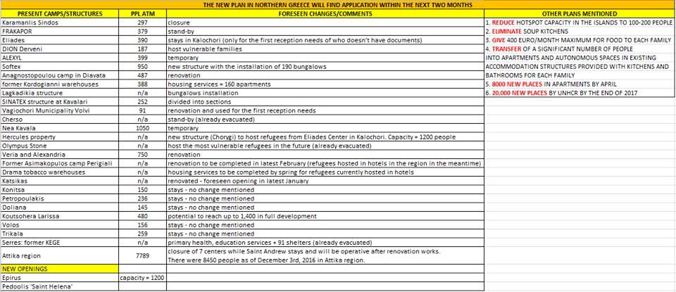

### AYS DAILY DIGEST 5\.1\.17\- Additional homeless shelters available in Greece
#### Feature

With this winter proving to be a particularly cold one, those who find themselves without a roof over their head will be particularly at risk\. Among many of the homeless in Greece are, of course, refugees\. The infrastructure to keep the homeless warm has been expanding for a few weeks now, and it is exciting to see that more places are opening to keep people safe from the elements\. With snow expected to fall soon, these shelters may be vital to peoples’ survival\.

](assets/4be01e50b181/1*TrwYBk45VjwUoYGptZX27w.jpeg)

Photo by [kostasiaido](http://kostasiaido.deviantart.com/)

In Athens, in addition to the regular homeless shelters, refugees may find a place to stay in numerous train stations, which will now be open overnight\. Among these are Omonia, Monastiraki, and Metaxourgeio\. There are also, of course, dedicated homeless shelters as well\. The following homeless shelters will be open around the clock:

🏚 26, Drakou Street, Koukaki, Athens 
Phone: 210 9232 044
Map: [http://tinyurl\.com/j45dwn7](http://tinyurl.com/j45dwn7)

🏚 12 Formionos Street, Pagrati, Athens 
Phone: 210 7222 590
Map: [http://tinyurl\.com/hk9vdzr](http://tinyurl.com/hk9vdzr)

🏚 Aimonos 9 and Astrous 
Phone: 210 5140877
Map: [http://tinyurl\.com/jb69vtu](http://l.facebook.com/l.php?u=http%3A%2F%2Ftinyurl.com%2Fjb69vtu&h=XAQHKRFzCAQFm7eD6L3BhyyycklU2TXvzxqr8n0CzvEHA3w&enc=AZPDg7HbXKof98y6F2Pluu5XPrTsX5YdIu3ZZN9hj7Iby8h28n7tTYJoufdD0W25N7CM81LVf7mfT96oT12bM-ciQKFH0jnkVtmOIHR_y_2sf4QyGrMS_UVuu4GkVT8hj0FoReoVysl7O51v__Xvb4e9H_VN6iQPmoNgCNQuvcp2t8Ep4quobiKGcPxXLWRonJOMdltP9TRMEUA0HNYZmoEu&s=1)

🏚 Eyripidou 14 
Phone: 210 3315417
Map: [http://tinyurl\.com/z5xvds8](http://tinyurl.com/z5xvds8)

🏚 Telestou 4, 
Phone: 210 8646481
Map: [http://tinyurl\.com/gllrkwu](http://l.facebook.com/l.php?u=http%3A%2F%2Ftinyurl.com%2Fgllrkwu&h=HAQHah9GJAQH45GtvofHlWUflfzxIicBIsN0qXFT668v0dA&enc=AZNIwXLSpAUck-3lsKa9JGLiMezDsaJkyQvhLqqzgDJH_21EvnAXzp1_HM_gD9txGBlT80QehPHMxvMx7lo9gn8MWBbKXeIyIU17WvXhFmYfDvmS5GfRBDdSXn45AzRlWYrG8_wW2xQ10oXSy19irSmbQW-vsIVhFayzr0wPc9FXWMHSjK4qRDuFwPMCqHGxmqCaN-f0-J8qtaKwuUHLZ87G&s=1)

🏚 Vatheos and Panormou
Phone: 210 6459890, 210 6451870 
Map: [http://tinyurl\.com/jowz2jl](http://tinyurl.com/jowz2jl)

There is only one overnight shelter in Thessaloniki, the Arsis located on _Geor\. Andreou 13_ \. This shelter are open from 5pm to 11am and their coordinates may be found [here](https://www.google.gr/maps/place/Geor.+Andreou+13,+Thessaloniki+546+27/@40.6414435,22.9190076,17z/data=!3m1!4b1!4m5!3m4!1s0x14a8399db8d587e5:0x6a11af55727b8ed6!8m2!3d40.6414395!4d22.9211963) \. Fortunately, there are several daytime shelters in operation as well:

🏚Grigoriou Lampraki 42, Thessaloniki
Map: [http://tinyurl\.com/hf7o2v7](http://tinyurl.com/hf7o2v7)

🏚 Alexandrias 27, Thessaloniki
 Map: [http://tinyurl\.com/hgg9f9l](http://tinyurl.com/hgg9f9l) 
 Both are open 9am to 7pm, from Thursday 5th until Monday 9th January

🏚 Praksis 
Monastiriou 62,
Thessaloniki 546 27 
Map: [http://tinyurl\.com/jfjsdw9](http://l.facebook.com/l.php?u=http%3A%2F%2Ftinyurl.com%2Fjfjsdw9&h=3AQG0Y1vrAQHRsEXwVRH95n5LH3e7DrPpLYzfkLWx-wbe1w&enc=AZNycQVLhfGNRA5zdI-V7E0Go4w-NI-CFIsTDSy2v4sTRrCdCJCVwxfEgrCficDSb6mfGTTntDI-O4mb8q4davEweSEUqJ_o2BG-J3zYUftzolqDN1e4cmfzsSIMZuUHySDA3dEQ-_PzqW_Q1a0hwlxNxen9ZX1bYdZzBAu9PWbuiV-BQ8TZnRQTOu9QyTBdynkUu_OdjmTrep-79y5Zq1SK&s=1) 
Open 10:30–17:00

Three KAPI \- Elderly Open Care Centres \(KAPI Dimou Patreon\) are available in Patras\.

7 Vosporou Street, Geraneika, 262 26 Patra Achaea 
Phone: \+302610316479
Map: [http://tinyurl\.com/gpu26h7](http://tinyurl.com/gpu26h7)

2 Aidipsou Street, Psahou, 263 32 Patra Achaea 
\+302610339638
Map: [http://tinyurl\.com/jl6vplc](http://tinyurl.com/jl6vplc)

21 Kazantzaki Nikou Street, Agyia, 264 42 Patra Achaea 
Phone: \+302610453907 
Map: [http://tinyurl\.com/zv2uxf7](http://tinyurl.com/zv2uxf7)

Due to extremely low temperatures, the old Arsakeio School of Patras hosts homeless people from 20:00 to 08:00 the following day\.

Address: Maizonos and Gkotsi
Phone: 6984617546 / 67972357816
/ 2610390968 / 6984617545

Map: http://maps\.google\.com/?cid=2848179560929086993&hl=en

More Shelters available throughout Greece\. Please refer to the post of the [Mobile Info Team](https://www.facebook.com/mobileinfoteam/) here: [https://www\.facebook\.com/mobileinfoteam/posts/1895260294036024](https://www.facebook.com/mobileinfoteam/posts/1895260294036024:0?hc_location=ufi)
#### Syria

#### Greece

A list of plans/promises made by the Greek government with regard to the camps
### Elliniko Warehouse in Pampiraiki reopens

The warehouse was open today from 9am to 2pm\. It will be closed on Friday owing to Epiphany celebrations, but it will be open from Monday onwards, from 11am to 6pm\.
### Spanish to Arabic translator needed\!

Hole in the Borders in Athens is in need of a Spanish to Arabic translator\. Please [contact them](http://greecevol.info/task.list.php?ID=408#sthash.652TC693.dpuf) if you qualify\.
### Humanitarian Support Agency seeks help\!

### The Schoolbox Project is seeking to open a new location\!

All camps that are in need of additional children’s programming should contact [Belle Sweeney](https://www.facebook.com/belle.5656?fref=nf) on Facebook\.
### 131 total official registrations on the islands

There have been 52 arrivals on Lesvos, 35 on Chios, and 44 on Samos, making for a total of 131 arrivals\. Additionally, there were 8 arrivals to Lesvos in the early hours of the morning\. The people, 4 men, 2 women, and 2 children, are all safe\.
#### Serbia
### Today, MSF is distributing blankets in Belgrade
#### Slovenia
### Second Home Refugee Center in Ljubljana is holding a fundraiser to buy wood to keep warm\!

#### Germany
### Fire in refugee accommodation wounds 57 people

Around noon, a refugee shelter caught fire\. The shelter in Paderborn houses more than 500 people, most of whom come from the Balkans\. Over 100 firefighters were called to extinguish the fires, and the situation was soon under control\. The reasons for the fire are as of yet unknown\.
#### France
### Paris Ground Support in need of laundry facilities

Paris Ground Support Team have a large number of blankets that need washing so that they can be redistributed to people living on the streets\. We are seeking industrial laundry facilities in Paris where this could be done for free or cheaply\. It ould be a hotel, hospital, industrial laundry, etc\.

Any advice would be be much appreciated\. All leads should be sent to [Sarah Fenby\-dixon](https://www.facebook.com/sarah.fenbydixon.1) on Facebook\.
#### Italy
### Protest following the death of a refugee leads to pledges to deport those whose asylum applications were rejected

Following the death of a refugee woman as the result of a blood clot on Monday, the 500 residents of the Cona refugee center in Veneto staged a protest\. They claim that the center’s staff would not call an ambulance for hours, despite it being clear that the woman was in need of medical assistance\. Objects were set on fire, but nobody was injured in the course of the demonstrations\.

The woman’s death seemed to have been the last straw which pushed refugees to the edge\. When a parliamentary delegation visited the camp, they drew attention to the dreadful conditions, with one representative warning that the camp, a former military barracks, was a “ticking time bomb\.” Refugees also protested the subpar conditions here in the early months of 2016\.

Far\-right politicians have used the incident to their advantage\. Matteo Salvini of the Northern League said, “When I’m in government, there will be mass expulsions, centre closures, and the navy ships will send people back after saving them\.”
#### General
### UNICEF report shares the agency’s efficacy for 2016 and targets for 2017

The group’s report, which may be read [here](http://reliefweb.int/sites/reliefweb.int/files/resources/2017_Crisis-in-Europe_HAC%282%29.pdf) , shows that in many areas, the agency fell far short of its targets\. The group had received less funding than it had called for, $22 million rather than $31 million\. For 2017, the group has set a goal of $47\.5 million\.

_Converted [Medium Post](https://areyousyrious.medium.com/ays-daily-digest-5-1-17-additional-homeless-shelters-available-in-greece-4be01e50b181) by [ZMediumToMarkdown](https://github.com/ZhgChgLi/ZMediumToMarkdown)._
