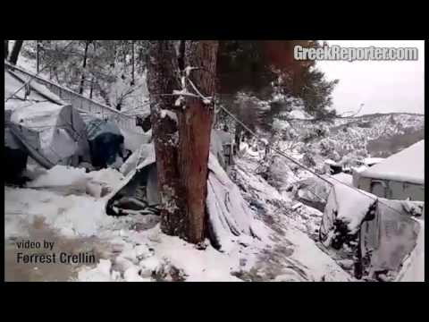

### AYS DIGEST 7/1 —Surviving 2017: From cut water supply to attacks and hypothermia
#### Damascus and its surrounds cut off from water supply for days / Explosion leaves dozens dead in rebel\-held town of Azaz / Refugee tents covered in snow in Greek camps / Temperatures drop to \-20 while people still sleep rough in Serbia / Two refugees dead due to extreme cold in Bulgaria / 15 year old Syrian dies in the aftermath of NYE attack in Bremen, Germany / The Dunkirk Refugee Women’s Centre in France burned down

Moria camp — photo by Giorgos Kosmopoulos
#### SYRIA
### Damascus and its surrounds cut off from water supply

Fighting around the source of the water supply leaves Damascus and its surrounds cut off from water for days\. According to UN estimates, more than 5\.5 million people in the Damascus area have been partly or completely cut off from their water supply, DW reports, forcing them to search for other sources and tripled the cost of bottled water, city residents reported\. The al\-Fija spring in Wadi Barada, northwest of Damascus, provides nearly two\-thirds of the city’s potable water\. Whoever controls the area indirectly controls the lives of the millions of people living in and around the Syrian capital\. The pumps at the Wadi Barada water plant were damaged in the last weeks, and water that remained flowing [has been contaminated with diesel fuel\.](http://m.dw.com/en/damascus-faces-third-day-without-water-following-alleged-contamination/a-36909307)
### Fuel truck explosion leaves dozens dead in Syrian border town

An explosion ripped through a busy market area in Azaz, a rebel\-controlled town near the Turkish border, the Syrian Observatory for Human Rights monitoring group reports\. Several sources said that a fuel truck had blown up at the scene\. First reports said at least 43 people were killed and many more injured, most of them being civilians\. A doctor cited by the turkish Anadolu Agency later reported the death toll rose to 60 people, DW [reports](http://www.dw.com/en/dozens-killed-in-likely-tanker-blast-in-syria/a-37047322) \. Activist\-operated local Azaz Media Centre also reports 60 deaths and many injured\. Rescue operations continued for hours after the event\.
#### **GREECE**
### Refugee tents covered in snow amidst harsh winter conditions in camps

The temperatures this week have dropped dangerously low all through Greece, made worse with strong wind gusts\. Photos of summer\-type tents covered in snow in Lesvos island’s open Moria camp can’t be described any other way than inhumane\. The weather is expected to only get worse\.
 In these desperate conditions, a volunteer at Moria camp writes:

> „Well done to all the small NGO’s who are risking the icy roads to at least get some supplies and replacement tents to Moria, especially the team at Attika, you guys are the best\.“ 

Although the Greek Migration Policy Minister Yiannis Mouzalas [recently stated](https://medium.com/@AreYouSyrious/greek-migration-policy-minister-yiannis-mouzalas-said-yesterday-36d9f031ab63#.stxx0q74d) that **“there are no refugees or migrants living in the cold anymore\. We successfully completed the procedures for overwintering”** these photos and videos prove otherwise\.

Moria camp — photo by Giorgos Kosmopoulos
#### SERBIA
### Refugees still without adequate shelter with temperatures dropping to \-20 at night

Temperatures in Serbia are dropping to extreme \-20 degrees Celsius at night, still nearly 2000 people are sleeping rough in Belgrade as well as in other locations in Serbia\. “The Serbian government ignored several requests by aid groups in November and December, including from [_Médecins Sans Frontières_](http://www.msf.org/) , to build temporary and winterized camps\. 80 of the most vulnerable people sleeping in the warehouse have finally been relocated today to already overfull camps around Serbia” Lydia Gall reports for [HRW](https://www.hrw.org/news/2017/01/06/asylum-seekers-left-cold) \.

■■■■■■■■■■■■■■ 
> **[MSF Sea](https://twitter.com/MSF_Sea) @ Twitter Says:** 

> > Dear @[SerbianPM](https://twitter.com/SerbianPM), this is how people fleeing #Syria, #Afghanistan, #Iraq are living in your capital #Belgrade. Tonight it's gonna be -20C. https://t.co/tC0Yd6BhOK 

> **Tweeted at [2017-01-07 13:14:59](https://twitter.com/msf_sea/status/817721191322488832).** 

■■■■■■■■■■■■■■ 

MSC is putting emergency heaters to warm the abandoned buildings where refugees sleep\. Despite the predictable situation the Serbian government, UNHCR Serbia and European Commission all failed to provide an adequate response, MSF writes\.

](assets/58e4a81cf741/1*c11ESjqGVgNu0Cn1HwTbFw.jpeg)

Photos by [Kontrapress](https://www.facebook.com/permalink.php?story_fbid=1021093731367841&id=221841217959767)

](assets/58e4a81cf741/1*XXVDJPHkW5D2UFYA45_Aag.jpeg)

Photos by [Kontrapress](https://www.facebook.com/permalink.php?story_fbid=1021093731367841&id=221841217959767)
#### BULGARIA
### Two Iraqis found dead due to extreme cold

Only four days after [a Somali woman died in the same region](http://bulgaria.bordermonitoring.eu/2017/01/03/breaking-news-somali-migrant-dies-near-the-bulgarian-turkish-border/) , hypotermia leaves two Iraqi men aged 28 and 35 dead near the village of Izvor in the region of Burgas near the Strandzha mountain massif, [Bordermonitoring Bulgaria](http://bulgaria.bordermonitoring.eu/) reports\. The refugees try to cross the mountain region where there is no fence blocking the way and often report about corpses in the woods, but the overall number of people who died in Bulgaria’s borderlands in the last years is unknown since there is no official statistics available\.
#### GERMANY
### 15 year old Syrian dies in the aftermath of NYE attack in Bremen

A 15 year old Syrian refugee, who was attacked on New Years Eve in the town of Bremen died in a hospital earlier today, writes [Enough is Enough](https://enoughisenough14.org/2017/01/07/15-year-old-syrian-refugee-killed-in-bremen-germany-antifa/) \.

After being attacked by a group of young men on Lüssumer Heide street in Bremen shortly after midnight on January 1st, the 15 year old was rushed into the hospital where doctors had to put him into an artificial coma due to severe head injuries\. Bremen police did not report the attack until Friday night after social media postings forced police authorities to release a statement, Enough is Enough reports\. Police said they have no indications so far that the attack was carried out with racist motivations\. Enough is Enough will continue to research and [update on the case](https://enoughisenough14.org/2017/01/07/15-year-old-syrian-refugee-killed-in-bremen-germany-antifa/) \.
#### FRANCE
### People still sleeping rough in the streets of Paris

“It doesn’t look like it from this picture, but there is at least 100 people lying here in between dual carrige ways\. This is the patch of ground dividing the roads” independent volunteers have reported about people sleeping on the streets of Paris, where the temperatures have gone to \-7°C yesterday\.

Photo by Megan Stuart

Blankets and sleeping bags are urgently needed\. The [Calais Action — Brighton](https://www.facebook.com/CalaisActionBrighton/) team are currently on a mission to try and keep people warm in these extreme conditions by collecting winter essentials \( [S\.N\.U\.G\. packs](https://www.facebook.com/events/1314869198595017/) \) \.
### The Dunkirk Refugee Women’s Centre burned down

The Dunkirk Refugee Women’s Centre, a space for women and children of Dunkirk camp, has burned down and needs to be rebuilt as soon as possible\. No one was hurt in the accident\. Now, volunteers are needed to work on the location\. If you have time to spare and the skills needed or know anyone who could help, contact [Rob Crook](https://www.facebook.com/rob.crook.39?fref=nf) directly or [Refugee Community Kitchen](http://refugeecommunitykitchen.com/) \. Carpenters and possibly some welding to reinforce a couple of areas are most urgent\.
[Help Refugees](http://www.helprefugees.org.uk/) say they are currently doing all they can do support the volunteers who work at the Centre and are working with them to discuss further action\.

](assets/58e4a81cf741/1*pTqu_nKtoMB_xBF3bOgjBw.jpeg)

Photo by [Rob Crook](https://www.facebook.com/calaisaction/posts/1392956437423524)
#### **Petition — Free Cédric Herrou**

Les utopistes en action association wrote a [petition letter](http://www.mesopinions.com/petition/justice/abandon-toutes-charges-retenues-relaxe-dric/27173) to the French State demanding the dropping of all charges and the release of Cédric Herrou, a French farmer accused of aiding illigal immigrants\. Witnessing the distress of these people, many of whom children, Herrou decided to help by providing accommodation, care and food for fifty refugees passing the area as well as aiding people with bordercrossing\. To recall, as [Guardian](https://www.theguardian.com/world/2017/jan/04/french-farmer-cedric-herrou-trial-helping-migrants-italian-border) reported, Herrou was accused of “helping undocumented foreigners enter, move about and reside” in France and for that faces up to five years in prison and a €30,000 \(£25,500\) fine if convicted\.

> „Cédric Herrou is neither a criminal nor even an activist, just a man moved by so much distress, a man determined not to close his eyes, to act where the authorities shine by their absence“, stands in the [petition](http://www.mesopinions.com/petition/justice/abandon-toutes-charges-retenues-relaxe-dric/27173) \. 

_Converted [Medium Post](https://areyousyrious.medium.com/ays-digest-7-1-surviving-2017-from-cut-water-supply-to-attacks-and-hypothermia-58e4a81cf741) by [ZMediumToMarkdown](https://github.com/ZhgChgLi/ZMediumToMarkdown)._
