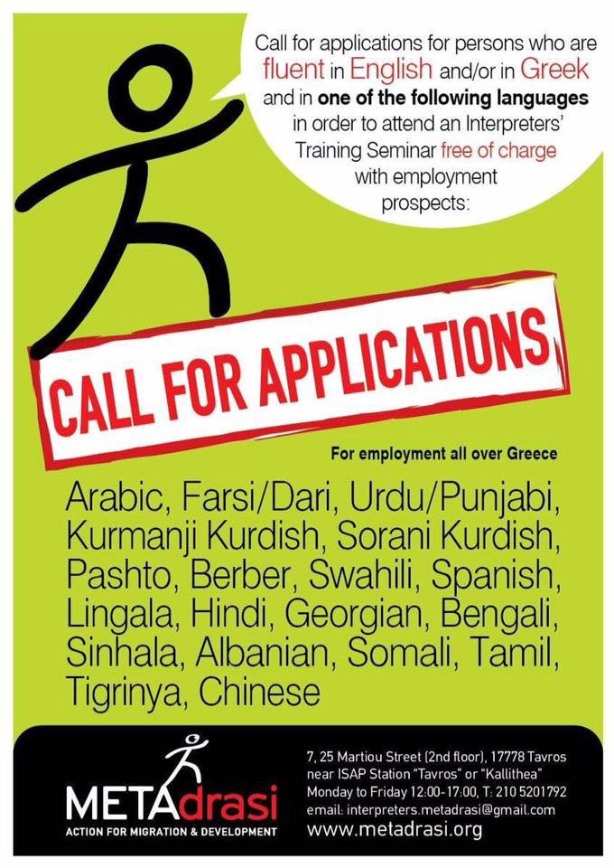
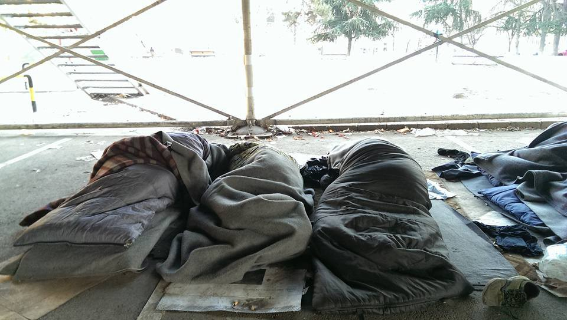
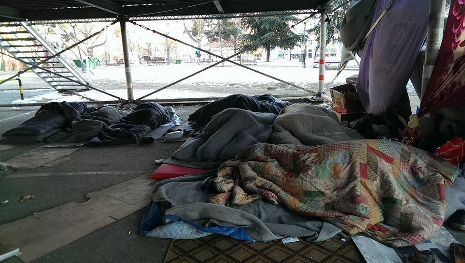

### AYS DIGEST 08/01 — Ceasefire not holding in Syria
#### Calls for help as refugees keep freezing in Greece/ Donations needed in Serbia/ 801 refugees sent to Turkey / 900 human traffickers detained in Germany last year/ Police deliberately threaten refugees lives

](assets/1b505e17ee24/1*KKDOY6lqTbvNTlb54rVUSQ.jpeg)

Photo by Gabriel Tizon/ [**Art Against**](https://www.facebook.com/artagainstproject/)
### Syria

The Syrian Network for Human Rights, which monitors attacks and casualties in the conflict, says there have been a total of 178 violations of the ceasefire deal since it was announced on December 29\. They report 11 civilian casualties, including one woman, two children, and an unborn baby, most of them killed by Syrian regime forces\. This [**report**](http://sn4hr.org/wp-content/pdf/english/178_violation_in_the_first_week_of_Ankara_Ceasefire_Agreement_en.pdf) , made with statements of survivors, victims families, and witnesses as well as imagery of the attacks says 160 breaches were by Assad forces\. Most of these were in Hama Province \(55\) and Homs Province \(30\), followed by Aleppo and Daraa Provinces \(19 each\), and Idlib Province \(14\) \. In addition, the SNHR claims 14 breaches by Russia: six in Aleppo, five in Idlib, and three in Hama\. The four breaches by rebels were in Aleppo and Hama\.

The report does not address the pro\-Assad offensives which have continued despite the ceasefire\. These include the aerial and ground assault seeking to overrun the Wadi Barada area, northwest of Damascus, and the attempt to take more territory in East Ghouta, northeast of the capital\.

The Syrian Observatory for Human Rights reports though that the warplanes carried out several airstrikes this morning on places in the areas of Bsima and Ayn al\-Fijah and other areas in the Barada Valley\.

Sources reported to the Syrian Observatory for Human rights that the re\-start of the military operations in Barada Valley area came after the failure to reach an agreement about the water supply which has its pumping stations at Ayn al\-Fijah\.
### Greece

In some parts of Greece, especially on the islands, refugees endure extreme low temperatures as the cold front from the north continues to sweep the country\. The forecast predicts very low temperatures and snowfall throughout the country until at least Wednesday so special measures are needed to minimize the harsh weather conditions\.

An easy and useful map for the weather in Greece can be found [here](https://www.eltiempo.es/grecia/lluvia) \.

United Nation’s refugee agency \(UNHCR\) urged authorities to speed up the relocation of over 15,000 refugees, saying that they are living with inadequate heating supplies to keep warm in the overcrowded camps on the Aegean islands\. UNHCR spokesman Adrian Edwards said that the situation is dire and urged the quick resettlement of refugees to either facilities on the mainland of Greece or other EU countries\.

> “Even with recent efforts to improve matters, conditions at many sites on the islands remain very poor” 

](assets/1b505e17ee24/1*hRV8hMnwZ9TNGepOczhiow.jpeg)

Photo by [**MSF Sea**](https://twitter.com/MSF_Sea)

](assets/1b505e17ee24/1*LxeHnmadO6fcffQU4PTKzw.jpeg)

Photo by Gabriel Tizon/ [**Art Against**](https://www.facebook.com/artagainstproject/)

](assets/1b505e17ee24/1*7B6MA_TNKdQ9ya-pEbHcTw.jpeg)

Photo by Gabriel Tizon/ [**Art Against**](https://www.facebook.com/artagainstproject/)

](assets/1b505e17ee24/1*5QdrwOGCI05icDat4LGmag.jpeg)

Photo by Gabriel Tizon/ [**Art Against**](https://www.facebook.com/artagainstproject/)

Volunteers are calling for help from Lesvos as they are getting short of most items for distribution like blankets, warm clothes, shoes and food\.

Please consider donating to [Dirty Girls Of Lesvos](https://www.facebook.com/dirtygirlslesvos/) ;

and also

[No Border Kitchen Lesvos](https://www.facebook.com/NBKLesvos/)

Donations to this bank account:
Rote Hilfe OG Salzwedel
IBAN: DE93 4306 0967 4007 2383 12
BIC: GENODEM1GLS
Comment: NBK Lesvos

From Alexandria camp, [Refugee Support Greece](https://www.facebook.com/RefugeeSupportGreece/) is also calling for support for their project:

_£20 allows us to give one hot meal a night to one person for a month\!_

Consider donating on the [link](https://mydonate.bt.com/donation/start.html…) \.
#### Athens

From the capital there’s also requests for volunteers\. [METAdrasi](https://www.facebook.com/metadrasi/) is looking for persons who are fluent both in English \(and/or Greek\) and in one of the following languages, in order to attend an Interpreters’ Training Seminar, free of charge, with employment prospects in Greece:
Arabic, Farsi/Dari, Sorani Kurdish, Kurmanji Kurdish, Urdu/Punjabi, Pashto, Georgian, Mandarin Chinese, Somali, Sinhala, Berber, Bengali, Lingala, Swahili, Tamil, Hindi, Tigrinya, Albanian\.

[Athens Volunteers Information and Co\-ordination Group](https://www.facebook.com/groups/AthensVolunteersInformation/permalink/1008950035903960/) has published a series of useful orientations to be used in possible situations involving refugees healthcare:

MEDICAL SITUATIONS: HINTS AND TIPS
[\#athensvolunteers\_medical](https://www.facebook.com/hashtag/athensvolunteers_medical?source=feed_text)

Researched and collated by the [Athens Volunteers Information and Co\-ordination Group](https://www.facebook.com/groups/AthensVolunteersInformation/) \.

Here are a few tips on what to do in a medical situation when families contact you with urgent situations: 
1\) Firstly don’t panic\. Take a deep breath and think about the situation at hand\. Think logically and think calmly\. What would you do at home if a similar situation occurred?

2\) Next, establish the facts about the medical situation: 
a\) who is the patient \(name, age, gender\) \. \. if its a baby/child, who is the legal guardian? Do they have a white card?
b\) what is the actual medical situation? Is it life threatening \(eg possible heart attack or bleeding uncontrollably\)? Or something that would occur in normal day to day life \(eg, cough/cold/flu etc\) 
c\) where is the patient? Address/location is important\. 
d\) can the patient walk? Is their mobility impaired in any way? 
e\) what nationality is the patient? Is a translator needed?

3\) if its not a life\-threatening emergency, have you directed the person to the appropriate medical services that are already available in Athens\. [https://goo\.gl/Ml5oDu](https://l.facebook.com/l.php?u=https%3A%2F%2Fgoo.gl%2FMl5oDu&h=cAQH6lO-jAQG3zT6I31Cjckta2hM3yRpPu99UVgH5fX8uXQ&enc=AZOIyag29Fsr_XzIzAkCZfxMr_VBTw7UKS-44NFhYL6RDpDxhaYMvm-WBpCKAKhUQZUz9tBzz1XlIH1aVrGlP0uZ8eQUyai5RRE5LjpIfxpQjSbDi_Fhjg0cmY1rHSIGMtBAGKLcub2u-IfJURkyxc5s2szV_xUvPIkXC-NlN5YWw8S0rdmp2sjyAOqYTrbrEIo&s=1)

so they can find a medical person \(either a doctor, a nurse, or a pharmacist\) or if a medical person is not around, is there a qualified first aider?

4\) If there is no medical person or first aider around or nearby, and/or if it is an emergency and something that cannot be dealt with through usual medication or by a clinic or doctor, then call an ambulance — the emergency medical service is 166\. \(Police is 100 and Firefighters is 199\) \.

5\) If the ambulance does not arrive quickly and it looks like the person is getting worse, then consider calling a taxi and taking the person to the hospital\. These numbers can be Googled\. Uber is generally good\. You can also try [MarhaCar](https://www.facebook.com/marhacar/) \( [Kara Kallenbach](https://www.facebook.com/kara.kallenbach) \) to see if they have any drivers available\.

Where possible, please try to avoid using Facebook to resolve an emergency medical situation — unless absolutely necessary\. If you do need to use FB then it is better to discretely message one or two people who you know can find help quickly rather than post publicly\.

Please try to think logically and think calmly and remember to consider ‘what would I do if I was at home?’

Footnote: the above information has been checked by a doctor and a nurse\.

Other reference points: Here are also some links to some medical websites for typical conditions\. Most of the situations below suggest that, if in doubt, don’t delay, see a doctor or get to the hospital\.

Comprehensive guide for minor childrens illnesses [http://www\.wales\.nhs\.uk/…/A%20guide%20to%20coughs%20and%20c…](http://l.facebook.com/l.php?u=http%3A%2F%2Fwww.wales.nhs.uk%2Fsitesplus%2Fdocuments%2F888%2FA%2520guide%2520to%2520coughs%2520and%2520colds%2520in%2520children%2520EAAD%25202012%2520-%2520ENGLISH%2520version.pdf&h=RAQHfd5V9AQFlVah2kq9Q3Pl7YMK1lEq6akXgxDYV89xUIw&enc=AZMRLlBjsyWId232G0OCa7bLf2xtHUB15gTf7SCfc2njs97DRcrlyEZdv2gfGrv3aEHO_6jp6AX_gQBvKJO1_4dUfuhzDo6fb95RYtLYKW37rdZ3szI6NhPyN7vovInU-zQCtgAP13xL4GOg1FS719ATuSrf_n-nrNO2pEUmz-Czat0OlxGhhpkzhRiQppVn6sA&s=1)

Symptoms of breathing difficulties [http://www\.parents\.com/…/ast…/signs\-of\-breathing\-difficulty/](http://www.parents.com/health/asthma/signs-of-breathing-difficulty/)

Skin rashes in children: [http://www\.nhs\.uk/…/skin\-rash\-child…/Pages/Introduction\.aspx](http://l.facebook.com/l.php?u=http%3A%2F%2Fwww.nhs.uk%2Fconditions%2Fskin-rash-children%2FPages%2FIntroduction.aspx&h=lAQE5rkHGAQHRaoZ6Ksipl9-hfA988UW864ogeXANBb81NQ&enc=AZNJSvodwcU6GNB4hIQeI5DVCCzj0udK5YzuVOruQv8OSzGYnp84jS3PBxtK5CTKgTPSEpK16iD3WMQb-KJvmaoAvr2tE_o6AVHClsEr9OfKo0EPWABTBRgWKRNVEiMHtuQTOURmcuwSgH3AERZpmfWS7DHt5ymPJD6_KtmbWWv7bwBDaYHlmyX3H5Kt5-K12SM&s=1)

Burns and scalds: [http://www\.nhs\.uk/Conditi…/Burns\-and\-scalds/…/Treatment\.aspx](http://l.facebook.com/l.php?u=http%3A%2F%2Fwww.nhs.uk%2FConditions%2FBurns-and-scalds%2FPages%2FTreatment.aspx&h=4AQHHZoajAQG6zfyHw1N2eydZ52k-BiSnLnBVYseLjCULFA&enc=AZMzPYcdI95iaCghnqOQ3SK-uPkb4NPTVU95rRsZyCzrfFLG6qN0V21YAQ6U_KhCN8ds2AEiiiRO0Fp1K49ft1JkOf5ZQmUFRiCrsRSZYE4SqhYtO03ZA-egq01GiUhA0ItFMvhgpZBKgZ-q-OgQOOzIeTZvwFJmkXL4E2yOJ8nlhtB5aqz5FbO8gGdFCg_JJ4Y&s=1)

Signs of heart failure: [http://www\.nhs\.uk/Conditi…/Heart\-failure/Pages/Symptoms\.aspx](http://l.facebook.com/l.php?u=http%3A%2F%2Fwww.nhs.uk%2FConditions%2FHeart-failure%2FPages%2FSymptoms.aspx&h=6AQHHP_m0AQEUvwhlkJOm7lKNZgePkd0V-qXOXXjcIkr8Hg&enc=AZMmRGlCnqLIBYA8-c0mdfueuy-HX-pJb5aAZts83lQNIvxWextqbrf5UkunGFjL-egOl4uT462NyQQLQJ7Syi3lDDtlaNJ7b6rMxgolYFZEgurA-8YDxlI1NadYWcxLkm7456Xde0WZph2xkngKvPdT-5nqxS1vG_EucehpK2f2KlI3jmLxhalV_6Hklrpio60&s=1)

Signs of a heart attack: [http://www\.nhs\.uk/Conditio…/Heart\-attack/Pages/Symptoms\.aspx](http://www.nhs.uk/Conditions/Heart-attack/Pages/Symptoms.aspx)

Symptoms of a common cold [http://www\.nhs\.uk/Conditions/Cold\-common/Pages/Symptoms\.aspx](http://l.facebook.com/l.php?u=http%3A%2F%2Fwww.nhs.uk%2FConditions%2FCold-common%2FPages%2FSymptoms.aspx&h=oAQHjPI2xAQGDeQIU7C14pqp4rVRYTdBgDrb-86OndIYRcg&enc=AZMnx__4O3486XWeLw5qXejb9FxGX2ooCN8IQZ4mgvitvL5fYu7_SGmA0fEgClH8IragtTcTyuIu4kJuevKkWYIh3_sGLVsXI9eh4Puh_edwS8bX9C8tVCNcscc2LpFfoY1XBRFQg4YaJkCrtHmgfvowiDpVbIjP1NQ_1xWaLWL2ByEDsMIcubGDdtE6EvynwbI&s=1)

Prevention and Health System in Greece: [http://www\.learnaboutgreece\.gr/english/section5\-2\.php](http://www.learnaboutgreece.gr/english/section5-2.php)

**Some numbers from Athens:**

There are approximately 1\.600 unaccompanied minors in Greece now, many living in improvised shelters\.

There are around 2000 people living in seven squats around Athens\. The situation in these places can be difficult, with overcrowded and cold living conditions\. All the places are run together by volunteers and refugees\. MSF regularly visits people and helps to take care of their health\.
### EU

European officials deported 801 people to Turkey in 2016, and over half of the deportations happened within two months of the controversial March deal between the EU and Turkey, Germany’s “Welt am Sonntag” weekly newspaper reported\. Under the EU\-Turkey agreement, the influx should match the returns but the paper claims that 2,672 Syrians legally arrived in the EU from Turkey, with over 1,000 being resettled in Germany\.
### Serbia

Refugees continue to endure very hard conditions in Belgrade\. Near the bus station \(Afghans park\) on Saturday at 8 am, the temperature was \-17\. Refugees suffer cold, hunger, alienation and an unknown fate\.

Photo by Esam M Esam

Photo by Esam M Esam

To continue to support refugees throughout Serbia, [Eidomeni Refugee Support](https://www.facebook.com/groups/eidomeni.refugee.support/) has posted a call for cooking equipment and teams:

> Since months a constant number of approx\. 1500 refugees are stuck in Belgrade, most of them in squatted dilapidated warehouses behind the main bus station and struggle day by day with the cold, the lack of everything, state/police repression and the danger to be evicted\. The conditions are very tough \(until \-20 degrees at nights, many sick persons…\), there is no more space in any official camp in Serbia and the Serbian government does not even build temporary and winterized camps\. Also since quite a lot of people were deported from camps all over Serbia to Presevo \(closed camp\) and afterwards illegally pushed back to Macedonia, people are scared to go to camps and behind the bus station they have more freedom of movement and possibilities of self\-determination than in state\-provided camps\. There were many attempts from the side of the police and Gendarmeria and other state institutions \(Commissariat for refugees\) to “clean” also this area from people on the move\. Since the warehouses are part of the complex of a big gentrification project called “Belgrade Waterfront” the investors also will destroy the squatted warehouses soon, it is just a question of time when\. Still it is important to support the self\-organized structures in the squats, may they last for 1 or 3 months more\.
 

> After an open letter from the government, which was basically banning the distribution of any supplies — also food, medicine, clothes… — \(but not making it illegal by law\), most of the NGOs left — and there is only one group still distributing a hot meal once per day\. The refugees have to cook on open fire in small groups, but with very bad and not enough equipment\. Many of them cannot afford to buy the ingredients, some are there on their own\. 

> THIS IS A CALL for cooking equipment or self organized kitchen teams\. 

> If you have KITCHEN EQUIPMENT that is not in use \(big pots, cookers, maybe a generator, …\) you could provide it \(You have to face that the equipment could break or get lost\) \.
 

> The idea is to support the autonomous, self\-organized cooking in the squats and to give the chance with getting bigger cooking equipment to establish a participatory, non\-hierarchical structure, where those who are waiting or passing, locals and everyone who is interested can cook all together for all\. It is understood that the approach is solidarity not charity\. 

If some SOLIDARITY \-COOKING CREWS are looking for a spot where to set up an autonomous kitchen, Belgrade is the place, where it is very needed\. \(Would be amazing, if after a few weeks people who live in the squats together with local solidarity groups could keep the cooking going\. \)

Freedom is where we organize\!

“Strengthening my shoulder will strengthen yours as well — and this is the only formation in which we can fight against the sexist, racist, imperialist, capitalist, murderous world order\.” \(Dilar D\. \)

If you have any idea to this callout, send an Email to refugeesupportserbia@riseup\.net
or \(contact the local group\) noborderserbia@riseup\.net

Also [Refugee Aid Miksalište](https://www.facebook.com/RefugeeAidMiksaliste/) together with NGOs and state institutions have begun an action for caring for refugees in the centers, due to such low temperatures here in Belgrade, where there are 1,500 refugees sleeping in inadequate conditions\. The action involves securing transport, heaters where they are sleeping, the distribution of [UNHCR Serbia](https://www.facebook.com/unhcrserbia/) jackets and blankets here at Miksalište, as well as keeping the most vulnerable groups in Miksalište overnight\.

> We hope to reduce the life risks of refugees who are exposed to climate extremes these days\. 

### Italy

At Como 58 refugees are sleeping rough, 2 of them are minors\.

](assets/1b505e17ee24/1*w3N2ZdqacxgPxFWPr9Ya9Q.png)

Photo by [**Como senza frontiere**](https://www.facebook.com/comosenzafrontiere/)
### Germany

There have been 900 arrests for human trafficking last year, considerably fewer than in 2015\. Germany weekly “Welt am Sonntag” reported on Sunday that up until the end of November 2016, 906 people had been detained by Germany’s Federal Police, compared to 3,370 traffickers for all of 2015\.

The huge decrease in arrests was due to countries closing off the so\-called Balkan route, one of the major passages previously used by people traveling from Turkey to Europe\.

Most of the suspected human traffickers detained by German authorities came from Syria with 72 arrests\. Another 70 came from Poland, 57 from both Germany and Iraq, followed by 53 Russians\.

Germany’s southern border to Austria, remains the country’s main hotspot for human trafficking, with authorities arresting 481 people there in 2016, while 155 and 106 suspects were detained at the Polish and Czech borders respectively\. The Belgian border also proved to be popular among traffickers with 45 suspects arrested there, almost twice as many as on the much longer border with France\.

Bavaria’s government is due to finalize on Tuesday its proposal for Germany’s refugee policy\.

The charter titled “So that Germany remains Germany” was reportedly written by CSU leader and Bavarian Premier Horst Seehofer\.

The CSU’s long\-time demand for an upper\-limit on the number of asylum seekers accepted in Germany is something Bavaria aims to achieve through EU quotas\. For months, the CSU has called a yearly cap of no more than 200,000 refugees, a move that Merkel has repeatedly rejected\. Alongside its refugee cap, the Bavarian state government is also proposing further restrictions on family reunions for refugees, possibly calling for asylum\-seekers to secure a livelihood independent of state subsidies before being permitted to apply for family members to join them in Germany\.

At the same time, however, they also state their commitment to the reception of refugees\.

> “The admission of those in need of protection is a requirement of Christian and humanitarian responsibility,” the document reads, adding that Germany must proceed with “zero tolerance against xenophobia, racism and anti\-Semitism\.” 

Smugglers abandon refugees in Germany:

A smuggler left 19 persons, including five children, at a motorway parking area in freezing temperatures in southern Germany and fled the scene, police said on Sunday\. The temperature was \-20 degrees Celsius on Saturday when they found the person, one of whom had approached two other people at the parking area to raise the alarm after their driver left them\.

They were freezing cold when the emergency services reached them near Brannenburg, just across the border from Austria\.

The people who were not carrying passports, said they came from Iraq, Iran and Syria\. They told police they had paid between 500 euros and 800 euros per person to be taken from an Italian refugee center to Germany\.
### France

Doctors without borders said today the police is confiscating the covers from refugees in Paris\.

■■■■■■■■■■■■■■ 
> **[MSF France](https://twitter.com/MSF_france) @ Twitter Says:** 

> > Après destruction tentes, #police confisque couvertures des #migrants des rues de #Paris, en plein hiver @[prefpolice](https://twitter.com/prefpolice) @[ndemorand](https://twitter.com/ndemorand) @[ChTaubira](https://twitter.com/ChTaubira) 

> **Tweeted at [2017-01-08 11:24:16](https://twitter.com/msf_france/status/818055718637027328).** 

■■■■■■■■■■■■■■ 

> “These unacceptable practices put the life of migrants in danger: teams from Doctors Without Borders had to look after eight people close to hypothermia\.” 

Temperatures have been below zero for days, at night time, in the french capital and hundreds of refugees try to survive these hard conditions, sometimes with no resources, depending only of the help and donations volunteers give them\.

[Care4Calais](https://www.facebook.com/care4calais/?fref=nf) is calling for donations to keep supporting refugees in France\. Please consider donating [here](http://www.care4calais.org/donate) \.
### UK

[Calais Action](https://www.facebook.com/calaisaction/) is asking for help from British citizens to put pressure on politicians in the UK and to consider donating to help the team on the field\.

> It is a measure of our humanity how we treat the dispossessed, the weak, the elderly, and the young\. Snow arrives in camps across Greece, and yet people are living in conditions like this \(Moria camp, Lesbos\) \. Yet the EU insists that adequate winterised provision IS given to refugees, and that they should be deported back to “county of first entry” \(and therefore back to camps like these\) \. 

> Where has all the money gone? The money that was sent to Greece to help with the refugee crisis? Where is it being spent? Because it’s not going on proper shelter, that’s for sure\. 

What do I do?

1\) Complain to your MEP via [www\.writetothem\.org](http://www.writetothem.org/)

2\) [Donate](https://mydonate.bt.com/events/hopecentre/298890)

3\) Sign the petition to “Stop [Dublin transfer](https://www.change.org/p/council-of-the-european-union-stan…) ” deportations back to camps like these

_Converted [Medium Post](https://areyousyrious.medium.com/ays-digest-08-01-ceasefire-not-holding-in-syria-1b505e17ee24) by [ZMediumToMarkdown](https://github.com/ZhgChgLi/ZMediumToMarkdown)._
