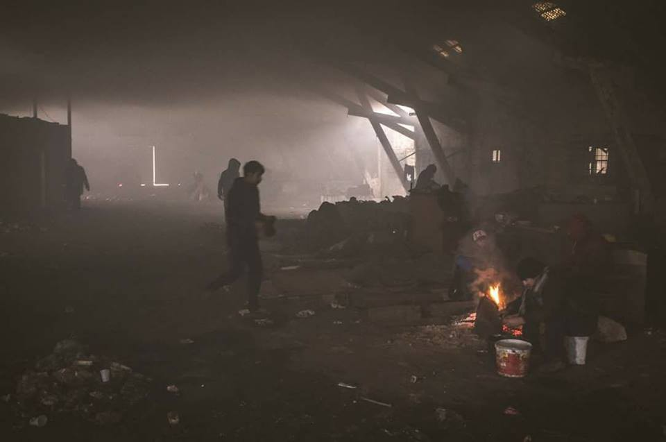

### AYS digest 09/01: If you are cold, count on Europe to steal your blanket

Snow and freezing temperatures destroying tents in Greek islands / Frost sets in and still no response from Serbian government / German authorities threaten to cut aid for countries that refuse to take back rejected asylum seekers — aftermath of Berlin attacks / French police stealing blankets from those sleeping on the streets / Request for solidarity accommodation in Cardiff

Belgrade\. Photo: Igor Čoko
### **“No person seeking protection, fleeing war, torture and extreme violence should be left out in the cold”** Clement Perrin, MSF

All along the Balkan route, temperatures have dropped so low that the situation in the official and makeshift camps has become unbearable and is putting lives in danger\. From the frozen tents in Lesvos to the freezing, abandoned buildings in Belgrade, people are being treated by the authorities as if they are not living beings\. As Stefano Argenziano, MSF’s operations coordinator on migration, points out, “the EU has decided to turn the entire region into its own gatekeeper,” and this gatekeeper has no means and in most cases, will, to create a system that would protect these people from the most basic of threats — freezing temperatures\.

Tent in a camp in Lesvos\. Photo: Dirty Girls of Lesvos Island

In a [statement](http://www.msf.org/en/article/migration-thousands-trapped-freezing-temperatures-greece-and-balkans) issued today, MSF stresses that “After being frozen out by European migration policies, thousands of migrants and refugees now find themselves trapped in freezing conditions in shelters that are ill\-adapted for winter in Greece and the Balkans\. The cynical neglect of European States’ policies, compounded by icy temperatures and a lack of preparation for winter have worsened an already unbearable situation for thousands of men, women and children seeking protection in Europe\.” In numbers, this means that in Serbia there are “more than 7,500 people currently stranded” who are “living in overcrowded camps and informal settlements\. The country has agreed with the EU to host up to 6,000 people, of whom only 3,140 live in facilities adapted for winter\. In Belgrade, around 2,000 young people, mainly from Afghanistan, Pakistan, Iraq and Syria are currently sleeping in abandoned buildings in the city centre, whilst temperatures plummet to as low as \-20°C\.”

Inside the abandoned buildings near the train station\. Photo: Igor Čoko

To make things worse, “For months, the strategy has been to block humanitarian aid to push these people into official camps\. But the camps are full and are already stretched beyond capacity, so today people are left with no other option than to sleep in abandoned buildings in freezing temperatures,” says Stephane Moissaing, MSF’s head of mission in Serbia\.

MSF has also pointed out, as we have previously reported, that they have been asking the EU, UNHCR and Serbian authorities to prevent the catastrophic consequences of the situation at hand for months\. A response has never come\. The situation is described by MSF as a “collective failure of these institutions” that “has left even the most basic needs unmet, exposing already vulnerable people to even more suffering\. Several have already died of hypothermia at the borders of Serbia and Bulgaria\.”

We hoped that winter would spare the Greek islands, but over the last few days snow has been falling steadily on the already overcrowded and desolate Greek ‘hotspots\.’ As MSF’s head of mission in Greece, Clement Perrin, points out “These families are paying the price of European cynicism and the reprehensible deal with Turkey\.”

Lesvos\. 14 cm of snow and still falling\. Photo: Eric Kempson

MSF concluded their statement with Perrin’s message to Greek authorities, saying that they “must stop congratulating themselves on humanitarian achievements while thousands of people are left to suffer as they wait for their asylum claims to be processed\. No person seeking protection, fleeing war, torture and extreme violence should be left out in the cold\.”
#### Greece
### **Lord Dubs loves Greece**

Although thousands stuck in Greece are suffering under heavy snowfall and freezing temperatures, Lord Dubs, who we all know as one of the key sponsors of an amendment to the Immigration Act, a law which provides free passage and shelter for unaccompanied minors to the United Kingdom, said today that the Greek authorities are doing a “great job\.” Fortunately, he pointed out that Greece needs more funds from other countries, including his\.

Meanwhile people on the ground, such as representatives from Dirty Girls of Lesvos Island, stated today that “It’s beyond time for creative, caring solutions rather than just money disappearing with few results and no transparency\.”
### **Promise to move people from tents to better accommodation starting tomorrow**

A “creative solution” came today from the Greek migration minister, who said in a statement that those living in tents in Lesvos would be moved as early as tomorrow\. As Refugees Deeply reports, Mouzalas made this remark at a talk in Athens tonight\. We will report on the situation tomorrow; it seems that there is accommodation as long as there is will\.

### **Electrician needed in Diavata camp**

There has been a call for help from Diavata camp in Northern Greece where they urgently need an electrician\. In the words of a camp representative, “Last night at the 3rd floor the the electrical circuit broke leaving the refugees of that floor without light and power\. We ask for immediate assistance as temperatures are very low\.”
#### Serbia
### **Why we need independent organizations in the field**

Representatives from Fresh Response have posted this message describing the current situation in Northern Serbia, as well as in other parts of the country, stressing the importance of independent networks in providing necessary aid and assistance\. There are many other independent organizations working in Serbia, but we bring you Fresh Response’s post in an effort to show what these groups are doing nowadays and why\.

_“These past days have been the busiest and most critical so far, and our volunteer team has been working round the clock to respond as best we can\._

_The situation has reached emergency levels: \-20 degree temperatures and 35km winds for days now\. Currently in the north, at least 350–400 refugees, including 30 young children, have no alternative but to sleep outside in makeshift tents, abandoned buildings, or in the open air\. One confirmed case of frostbite so far; more are inevitable\._

Northern Serbia\. Photo: Fresh Response

_Out of these, a few hundred unregistered people reside in the ‘jungles’ and have become the marginalised of the marginalised — unable to get a spot in one of Serbia’s official state\-run camps because there’s no space, or they fear illegal deportation \(which has been happening\) \. The authorities so far have resisted allowing additional emergency accommodation to be set up\._

_Because of a state\-issued letter a couple months ago prohibiting the distribution of aid to people outside the official camp system \(which leaves over 1800 refugees in the country out in the cold\), the other organisations in our area cannot officially provide humanitarian support to this population\. This is when the need for a 100% independently funded and volunteer\-driven project here is critical, as we can dare to go where the others can’t\._

Serbia\. Photo: Fresh Response

_We started preparing a few days before the cold snap hit, by calling upon all our local partners and friends for support\. We’ve held emergency meetings to plan out these days, inventoried our available stock from ours and partners’ warehouses, placed bulk orders for the items we lacked, and went into the jungles and squats to warn people of the dropping temperatures and get them all equipped with a baseline of warm clothing and gear\._

_During the past days on top of our daily food distributions, we’ve organised various mass and targeted NFI \(non\-food item\) distributions, getting out:_

_4 cubic meters of chopped firewood to Kelebija and Horgos transit zones, thanks to support from Larry Stanton; a couple hundred blankets, thanks to ongoing support from Doctors Without Borders/ Médecins Sans Frontières \(MSF\); 220 warm jumpers, thanks to NorthStar, Istočno\-Evropska Misija — Eastern European Outreach, Umino, and Volunteers for Humanity; 315 sets of thermal long underwear, 240 pairs of socks, 175 wool hats, 160 gloves, thanks to Peter Dweik, Erstmal Mensch, and CHLEBEM I SOLĄ; sleeping bags, insulation mats, tents, winter jackets, trousers, and shoes \(always in limited supply\) to those most in need; 323 emergency mylar blankets with live demonstrations from our volunteer translator on how to properly use them; 55 hot water bottles and funnels, thanks to Volonterski centar Vojvodine; 225 square meters and counting of foam insulation which we’ve been helping install on all tent/shelter floors in the area, in addition to tarpaulin sheeting to reinforce the exteriors_

_Meanwhile our volunteers have accompanied several urgent medical cases to the hospital to increase their chances of being admitted, including the boy with frostbite, who got there in time to avoid amputation\._

_All of this is only possible because of your donations and support, which enables us to stay independent, flexible and reach all refugee populations here without discrimination, every single day for the past 6 months\. THANK YOU\!”_
#### Germany
### **If you do not behave, Germany will not send aid**

The Local has reported that “Germany threatened on Sunday to end development aid to countries that refuse to take back rejected asylum seekers, a response to failings which kept the suspected Berlin attacker from being deported\.” \(See full article [here](https://www.thelocal.de/20170109/germany-threatens-aid-cuts-over-asylum-seeker-return) \. \)

The article goes on, “‘Those who do not cooperate sufficiently cannot hope to benefit from our development aid,’ Vice Chancellor Sigmar Gabriel told Der Spiegel in an interview published this weekend\. German Interior Minister Thomas de Maiziere told ARD public television on Sunday that he ‘fully supports this idea\.’ The warning was aimed in particular at Tunisia — the home nation of Anis Amri, who was suspected of ploughing a lorry into a Berlin Christmas market last month in an attack that killed 12 people — and at north African nations in general\.”

With these powerful threats from powerful people Germany hopes to quash the threat of terrorism\. As if that was ever the right way to do that\.
### **Personal stories from those deported from Germany**

Freiburger Forum has published several stories that shed light on what it means to be deported\. The stories are from Roma refugees from FYROM/Serbia who have been deported today from Rottweil \(close to Freiburg, Baden Württemberg\) \. The first is about an elderly man with brain cancer who was supposed to have surgery soon in Germany\. He will probably not receive any treatment in FYROM and now has no more belongings there, not even wood to heat his place\. He was deported alongside his wife and two adult sons, one of them volunteering at a bike workshop to repair bikes for other refugees, the other a man with special needs who was supposed to start a job in a sheltered workshop, as well as his granddaughter, who was looking for an apprenticeship\.

A second family had been living in Freiburg for several years and did not get any announcement of their deportation\. The police came for them at 5am\. One of the sons was supposed to start his professional training \(apprenticeship\) the following day\. There is actually a regulation in Germany that refugees should not be deported whilst they are completing an apprenticeship \(or for a further two years afterwards\) \. This law has been put in place because Germany lacks skilled workers\.

Another man wanted to leave the country voluntarily, but was stopped from leaving and deported instead\.

Freiburger Forum says that these examples show the ways that both the promises of politicians and legal requirements are being ignored\. The group also requests humanitarian rights for Roma\. German readers interested in more information can learn more [here](https://www.freiburger-forum.net/2017/01/schwerkranker-mann-aus-rottweil-abgeschoben-abschiebung-einer-familie-aus-freiburg/) \.
#### France
### **French police steal blankets in an effort to make those living in the streets disappear**

Streets of Paris\. Photo: P’tit Dej’a Flandre

In an effort not unlike that of the Serbian authorities, French authorities are trying to make refugees leave the streets of Paris by denying them the bare essentials they need to survive these cold days\. It has been reported both by media and activists on the ground that police are taking blankets from people sleeping in the streets in order to push them away and/or make them invisible\. As MSF points out, these people are on the streets due to overcrowding of reception centers\. These actions heighten the “systematic police violence” aimed at these people\. As The Independent reports, “MSF accused police of harassing migrants, waking them up in the middle of the night, using tear gas to disperse them, and not allowing them to sit down as they queue for a place in the shelter in the northern Parisian neighbourhood of La Chapelle\.” \(See full article [here](http://www.independent.co.uk/news/world/europe/french-police-stealing-blankets-migrants-paris-msf-a7516171.html) \. \)

The group, which distributes breakfast in the Flandres neighbourhood, describes how police confiscate blankets and explains that city employees then put everything in the trash\. Many people have already tried to enter the centre several times but have been rejected and forced to sleep in the street\. These events took place over the course of a week beginning on Friday the 30th\.

MSF programme coordinator Corinne Torre told The Independent that, “In the heart of winter, public powers should be able to provide shelter for all migrants, as a matter of urgency\. Instead, the forces of order confiscate their covers or force them to stay standing in a waiting line for hours, in a ridiculous bid to remove this population in distress from public view\. This denial of reality through the use of violence must stop\.” However, authorities have other reasoning in mind\. The Independent reports that the French Minister of the Interior, Bruno Le Roux, defended the police on Sunday, calling for an end to the “national sport of questioning” police work and added that he absolutely does not share this vision\. “What the police force is doing today is providing shelter for vulnerable people,” he said\. “Police work must continue this way, with the humanity that goes hand in hand with their responsibility\. It’s true that sometimes there can be difficulties associated with finding shelter for migrants\.”

We did not quite comprehend his words, and it seems he did not either\.
### **Dunkirk refugee women’s center needs help**

Dunkirk refugee women’s center after the fire\. Photo: Dunkirk Refugee Women’s Center

In other news, the Dunkirk Refugee Women’s Center “would like to thank everyone who has contacted and thought of the Women’s Center since the news broke of the fire in the early hours of Saturday morning\.” They add that they “are so touched by the messages of solidarity and support that we have received from individuals and organisations\. Please rest assured that everything we have lost we will rebuild\. The women’s center is not just a building, it is a network of strength, love and compassion and we are still here every day for the women, children and families of the camp\.”

If you are able to help, please follow [this link](https://www.gofundme.com/refugeewomenscentre) \.
#### UK
### Solidarity accommodation needed in Cardiff

Refugees at Home have posted this message and call for help:

_This is a call out to potential hosts in Cardiff\. We have just placed one guest but suddenly two more have appeared\._

_S is a Syrian refugee with status\. He is an English teacher and therefore fluent\. His referrer — who met him in France — says she would not hesitate to host him and that her young daughters really like him too\. But he needs somewhere by Wednesday when he gets moved out of NASS housing\._

_Then there’s A\. He’s Libyan and doesn’t have status yet\. He’s being referred by a great local organisation who is working really hard with him to sort out his future\._

_Can anyone help with either of these two young men? If you can’t, might you know someone who can? Please share in an effort to help them\._

If you want to know more, contact Refugees at Home via their [FB page](https://www.facebook.com/refugeesathome/) \.
### **Job with STAR network**

STAR network is looking for a communications officer\. If you are interested, please turn to the [following link](http://www.star-network.org.uk/index.php/news/comments/star_is_recruiting_a_communications_officer/) \.

_Converted [Medium Post](https://areyousyrious.medium.com/ays-digest-09-01-if-you-are-cold-count-on-europe-to-steal-your-blanket-fd5399d4cd48) by [ZMediumToMarkdown](https://github.com/ZhgChgLi/ZMediumToMarkdown)._
