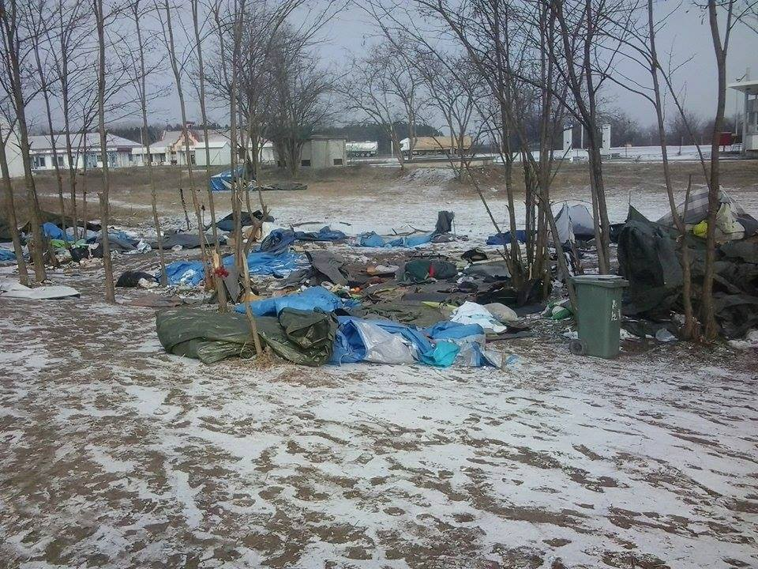
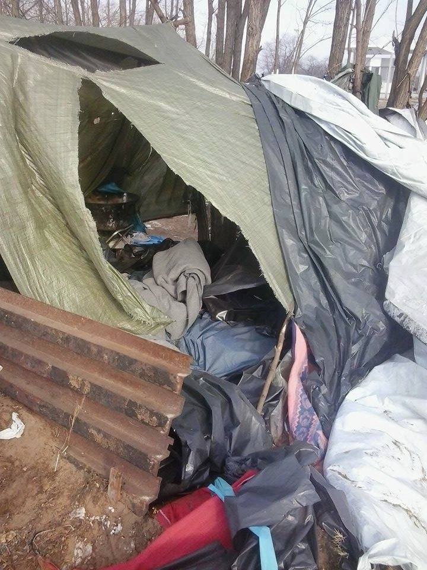
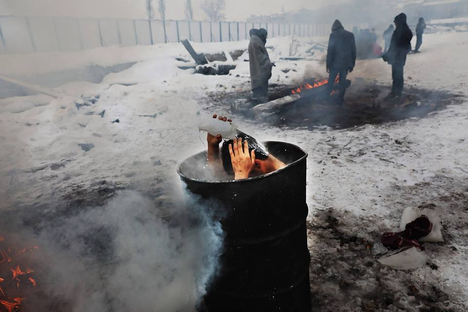

### AYS DIGEST 11/01 — Where authorities fail, volunteers stand firm
#### 2016 was the most deadly for healthcare workers in Syria/Warship to host refugees from Lesvos/Raid in Serbian\-Hungarian border/ Sharp drop in arrivals in Germany/50 propositions from BAAM in France/ Transfer of refugees to be assessed by Civil Liberties Committee/ General appeal for donations and hands

](assets/e7d4a279dc84/1*ME0ENPTIdqIvDL3Jo8xjCg.jpeg)

Photo by [**InterVolve**](https://www.facebook.com/InterVolve-219418945063168/)
### Syria

The Syrian American Medical Society \(SAMS\) launches a new report entitled:

> [_The Failure of UN Security Council Resolution 2286 in Preventing Attacks on Healthcare in Syria\._](https://foundation.sams-usa.net/reports/failure-un-security-council-resolution-2286-preventing-attacks-healthcare-syria) 

On May 3, 2016, the UN Security Council passed Resolution 2286, condemning attacks against medical facilities and personnel in conflict situations\. Yet following the adoption of this Resolution, the rate of attacks on healthcare increased by 89% to one every 29 hours\. August 2016 saw the greatest number of attacks on healthcare since the start of the conflict in Syria in 2011, with 41 attacks documented\. It also documents the use of advanced and unconventional weaponry\. Between June and December 2016, there were 9 instances of cluster munitions, which are prohibited under international law, being used to target medical facilities and personnel\. Additionally, incendiary weapons were used 7 times, and there were 4 reported cases of bunker buster bombs, used to destroy underground infrastructure, including M10, SAMS’s largest trauma hospital in eastern Aleppo City\.

The report documents, in total, 172 attacks on medical facilities and personnel from June through December 2016, using first\-hand testimony and photo documentation from physicians and health workers in Syria\. During the reporting period, **14 medical staff were killed and 23 sustained varying degrees of injuries\.**
### Greece

The Greek navy ship “Lesvos” will host refugees and from the overflowing camps that are suffering from the heavy snowfall\. The ship has docked at the port of Mytilene and will accommodate about 500 refugees who currently live in tents in the Moria camp\. As reported before, in the past five days, many refugees of the Moria camp are living under harsh conditions in tents covered with snow\.

](assets/e7d4a279dc84/1*tUaVC8Fn_DbygvD8exhzkg.jpeg)

Tent destroyed by the snow, photo by [**Khora**](https://www.facebook.com/KhoraAthens/)

“Lesvos,” currently loaded with beds, mattresses, blankets and stoves at the Salamis naval base, will be fully equipped to host the refugees\.

In the face of months of horrible conditions and delayed procedures in Moria Refugee Camp, refugee community leaders have come together to defend their rights and dignity with a [**letter**](https://legalcentrelesbos.wordpress.com/2017/01/10/moria-community-leaders-demand-respect-for-refugee-rights-in-lesvos/) to Mr\. Verwey \(Coordinator of the implementation of the EU\-Turkey agreementand\) and European Commission representatives to respond\.
#### Mainland

All across Greece the situation also remains very difficult with volunteers having to spend sometimes all of their resources to help the refugees around the country\.

In Vagiochori, volunteers tell us there has been no running water in the toilets for 5 days now\. The military gives people one water bottle per person per day\- there is no running water available for the people\. That water is for drinking, cooking, washing clothes and body\. Some people there haven’t had shower for up to 2 months because of the harsh conditions\. Skin diseases are spreading as Scabies warts get infected\.

People went on a strike last week, they went outside the camp, refused food\. But it didn’t change a thing\. The camp is literally in the middle of nowhere\- about 40km out of the city\. It used to be a transit camp in the summer where the police deported people caught on the Macedonian border\. People would stay for a day or two and return in the city to try and cross the border again\. Lately the camp has sent people staying there permanently \(some of them over 2 months\), but the conditions in the camp are horrible and the military breaches the law by forbidding people to distribute food from outside the fence, they don’t allow freezing cold people to light a fire OUTSIDE and also treat them like prisoners\- when people came to the fence to talk to us, police came up and told them in a rude manner not to stand there and to move away and not to go outside the camp\.

There were about 50 residents on the official numbers today but there are also reports of some refugees being moved to hotels\. We will soon know if this is a definite measure or if people are sent back to the camp when the weather improves\.

In Softex [InterVolve](https://www.facebook.com/InterVolve-219418945063168/) talk about strong winds and now snow, people living in a cold and dark warehouse or in partly broken caravans, some of them even without heating, no water because of frozen pipes\.

> The last 5 days we were running from caravan to caravan and from tent to tent to distribute blankets and sleeping bags, hats and gloves, scarves and socks, snow suits for children and thermals for adults\. People in the abandoned train in the backside of the camp aditionally got hot tea and hot water bottles\. And, unlike other actors in the camp, we kept our normal schedule of acitvities and distribution of food, hygiene products, clothes and shoes also on holidays and despite the freezing temperature, the storm and the snow\. 

> _“As long as people have to live under these conditions it is our duty to support them — no matter when and under which conditions\. We did everything we could and yet we know that it is not enough\. But still we hope that we were able to ease their situation at least a little bit\.”_ 

](assets/e7d4a279dc84/1*KtnYepiLwlpVCisy-iNnNQ.jpeg)

Photo by [**InterVolve**](https://www.facebook.com/InterVolve-219418945063168/)

](assets/e7d4a279dc84/1*AHYBTptDzpSWnQcBB4I_IA.jpeg)

Photo by [**InterVolve**](https://www.facebook.com/InterVolve-219418945063168/)

](assets/e7d4a279dc84/1*lNShoCS5qSi3sjXMRJ941A.jpeg)

Photo by [**InterVolve**](https://www.facebook.com/InterVolve-219418945063168/)

[Eko Project](https://www.facebook.com/Ekommunity/) working in Vasilika camp also has referred the lack of facilities there and has been working extra hard to keep refugees warm:

> Today, the seventh day without running water at Vasilika camp and nearly seven months living in the same old uninsulated tents, the people here are freezing\. It’s been snowing since the early hours of the morning and everything has turned to ice\. **It doesn’t matter that they’ve just taken away the majority of the toilets and showers leaving the community with almost no facilities as the pipes are frozen up anyway** \. There was even a shortage of firewood this afternoon and in these conditions that’s the only way to get warm, so we managed to get some wood to whoever was running low in preparation for the cold night ahead but it’s not enough\. They need a real roof over their heads, a real bed and a warm place to be\. 

](assets/e7d4a279dc84/1*k9FiSaa3rSvmCft7NhCytQ.jpeg)

Photo by [**Eko Project**](https://www.facebook.com/Ekommunity/)

[**Amnesty International**](https://www.amnesty.org/en/get-involved/take-action/refugees-freezing/) is urging everyone to put pressure on the European Commission Jean\-Claude Juncker to put human lives first and engage EU governments to move refugees from the Greek islands and on to other European countries\.

Tomorrow, Thursday, the 12th of January there will be a protest in front of the Ministry of Immigration in Athens to demanding decent housing for accommodation of refugees, financing and recruitment for social support structures for refugees and not for detention and suppression centers and housing for all refugees who want to stay in the municipalities in the areas\. The protest will take place at 5 pm\.

In these terrible conditions and running out of supplies many volunteer groups need help\! Donations and extra hands to continue working where there is more need\.

In Athens:

URGENT DONATIONS NEEDED AT ELLINIKON WAREHOUSE
Because of the cold weather these last few weeks, and the number of requests from camps, squats \(as far as Lesvos even\), the Pampiraiki Warehouse at Ellinikon have gotten to a point where they have RUN OUT OF men’s woolen hats and are running low on men’s really warm socks\. They have several requests for these items from various places in Greece and need to fulfill as many orders as possible\. If you, or you know of someone that could buy and donate to them to distribute we would appreciate it\. Also needed are men’s winter shoes 40 to 45\.

This request is for now, not for 4 or 5 weeks time\.

Post or take to Ellinikon Warehouse:

If posting, please let Katerina Rouniou and 
Negia Milian know when/what you are sending pampiraiki@gmail\.com
Delivery address: 
For the attention of: Sotiris Alexopoulos/Negia Milian
Old Athens Airport, 
Elliniko, basketball stadium, 
Pampiraiki warehouse 
\(Olympic airways entrance on the coastal road\) 
26 Posidonos Avenue, 
16 777, Greece\. On the [map](https://www.google.com/maps/place/37%C2%B053'44.2%22N+23%C2%B043'25.2%22E/@37.895616,23.7)

Volunteers of humanity also need donations to continue their work throughout Europe in cooperation with [Help Refugees](https://www.facebook.com/HelpRefugeesUK/) \.

> As you all know the weather has been horrific, and all over Northern Greece, Lesvos and Serbia, our humble emergency teams are responding to the most urgent needs of the refugees surviving subzero temperatures in substandard camps\.
 

> If you are able to help, we would be so grateful if you can during this absolutely critical time\. 

If you can make a contribution, no matter how small you can transfer your donation here:
Bank name: bank Leerau 
 Account name: Volunteers for Humanity
IBAN: CH96 0658 8570 0771 2190 6
SWIFT: RBABCH22588

There’s also an urgent need for volunteers at Nea Kavala camp and [A drop in the Ocean\.](https://www.facebook.com/drapenihavet/?fref=ts)

> A Drop in the Ocean, northern Greece is in need of longterm volunteers that can join us minimum 1 month\. We need people with logistic and IT skills\. We are running a distribution market in the camp where we give out clothes and NFI\`s\. We also have a dry food market where we deliver 4 basic items in addition to veggies\. 

### Serbia

From Serbia we get reports of a raid on the Serbian\-Hungarian border to clear a makeshift camp\.

Nearly 200 refugees and migrants were taken by police in the night in and around the Subotica, Kelebija, and Horgos area\. The raid targeted not only the brick factory squat, but also several small campsites in the fields and forest around Subotica as well as those staying in tents in the Kelebija transit zone\. Not only were people removed, but the makeshift camps assembled by the people themselves were brutally destroyed\.

Volunteers and activists on the ground wish to stress the importance of narrative in this action in anticipation of state entities presenting the event as a humanitarian action to protect against the bitter cold\. Keeping this in mind, if the well\-being of refugees and migrants in Serbia was truly the priority, it would stand to reason that state entities would not have spent the previous month and a half systematically targeting and forcibly shutting down aid access points\. Throughout December, both Fresh Response and the Kelebija Community Center have been the focus of multiple attempts to stop activity, to varying degrees of success\.

Furthermore, this sudden interest in the safety of refugees and migrants instead fits the pattern of 4 mass removals in the past three months \(the first of which resulted in illegal deportations\) \. The following is a summary of these mass removals \(or “cleanings” as they are often chillingly referred to by state entities\) \.

12 October — 4–5 buses to Presevo and Macedonia
6 November — 2 buses escorted by 1 bus and 3 cars filled with police to Presevo\. 3 men beaten in RAP when refusing to enter the bus\. 
23 November — Mass Attempted Train Deportation — 100 jumped off
11 January — 167 individuals removed from brick factory and Kelebija transit zone and taken to Presevo where they were registered\.

Photo from volunteers

Photo from volunteers

In Belgrade situation isn’t getting better and more than a thousand refugees struggle to survive in improvised shelter\.

Photo by Giorgos Moutafis

](assets/e7d4a279dc84/1*CSJZR-veoAjbNahTaqIueA.jpeg)

Photo by [**Refugee behind the closed borders**](https://www.facebook.com/Refugee-behind-the-closed-borders-1264829603528876/)

[Hot Food Idomeni](https://www.facebook.com/Hotfoodidomeni/?fref=ts) has been cooking for the men stranded in Belgrade and they also are in great need of donations at the moment:

**Over two months ago the professional mandated humanitarian agencies severely cut back their support in Belgrade\.**

Since then Hot food Idomeni have remained the only hot food provider for the 1500 people including many unaccompanied minors that live rough in and around the barracks in the centre of Belgrade in appalling conditions,

HFI provide one hot meal a day by line distribution at 1300hrs, everybody is welcome\.

This emergency response will continue until the mandated agencies and the Serbian authorities can authorise humanitarian assistance at the barracks or come up with a relocation plan\.

> We have no idea how long this process may take\. 

> Meanwhile temperatures have plummeted and there is no place for these people to go, their physical and mental health is fast deteriorating\. 

> **Therefore Hot Food Idomeni will continue their unilateral emergency response by continuing to distribute hot food and will increase the portions where necessary and will increase the kcal and nutritional value of the portions as needed** 

> We reiterate that this is an emergency response to a crisis and not a sustainable solution 

> Your support is vital\! 

### Germany

The number of asylum seekers arriving in Germany last year has dropped by two\-thirds to about 280,000\. The Government said the decrease signals that measures to reduce migration are working\.

In the spring of last year, the Balkan route used by migrants to reach Europe was closed and the EU\-Turkey migration deal reducing crossings across the Aegean went into effect, significantly reducing the number of new arrivals in Germany\. Nevertheless the number of first asylum application applications rose to 745,500 last year, including from those people who arrived in 2015 but did not formally apply for protection until 2016\. In 2015, 477,000 asylum applications were received\. Of those applications, the government made around 700,000 decisions, more than five times more than in 2014\. The increase signals German authorities have increased their capacity to process asylum applications after coming under criticism for bureaucratic backlogs in 2015\. Syrians remain the most common country of origin for asylum applications, followed by Afghanistan, Iraq, Iran and Eritrea\.

Some **62 percent** of all asylum applications in 2016, or about 434,000 people, were **decided favorably** \.
### Italy

On Friday 13 January at 20,45 Rebbio Parish will host a meeting to organize new solidarity actions, following the previous initiatives from Mensa di Sant’Eusebio\. Everybody is invited\.
This is a call from Flavio Bogani\.

> “To all the men and women of good will: good Life\! There is a dirty job to do\. There is a Home to set up, we are all needed because there’s a lot of work and we are all important\. On Friday 13 January, from 20,45 at Rebbio Parish, we will all have the chance to organize for the many initiatives to support the migrants and the people in need\. Within this cold, your heart will be able to warm up the environment, we are all necessary\. Come with a friend, take a warm sweater, underwear, wool socks… Do you want to know more? It’s not fair, come and find out\. I am here, if you are here too… give us a voice Eusebio\!” 

### France

In Paris, despite all the repression and violence used by the police against refugees, they obviously still don’t have where to go so hundreds keep hiding on the streets to sleep, like if they were criminals\.

[**Help Refugees**](https://www.facebook.com/HelpRefugeesUK/?fref=nf) are kindly requesting donations to be able to keep funding volunteers working in the streets of Paris whilst their people at the Calais wearhouse also offer support\.

](assets/e7d4a279dc84/1*ED8-SV9AEHkitC-gEstJ-g.jpeg)

Photo by [**Help Refugees**](https://www.facebook.com/HelpRefugeesUK/?fref=nf)

Please consider donating [here](http://www.helprefugees.org.uk) \.

Calais Action are looking for experienced volunteers to join their social media and fundraising teams\.

](assets/e7d4a279dc84/1*qWiLtq1MMpyQAxqHZ_z-4g.jpeg)

Photo by [**Calais Action**](https://www.facebook.com/calaisaction/)

Also [**People in Motion**](https://www.facebook.com/peopleinmotion15/?fref=nf) is trying to find funds to buy vital items to try and prevent more people freezing to death\. These will be sent to Paris where for most of this week the temperatures are set to plunge into the minuses\.

They will by buying:

Bivvy Bags: £18 each 
Thermals \(top and bottom\): £2 a set 
Backpacks: £5 each, so that refugees can keep hold of their Bivvy bag, sleeping bags and what ever personal belongings they may have\.

You can find the link to donate [here](http://www.people-in-motion.co.uk/) \.
### EU

Progress in transferring asylum seekers from Greece and Italy to other EU countries under an intra\-EU deal and from third countries to EU territory will be assessed by Civil Liberties Committee MEPs on Thursday\. They will also discuss the results of the March 2016 deal with Turkey to improve the management of migration and refugee flows\.

In the debate, between 17\.30 and 18\.30, the European Commission will explain its recent proposal to end the suspension of transfers of asylum seekers to Greece under the Dublin Regulation, which determines which EU member state is responsible for processing an asylum request\. Commissioner Dimitris Avramopoulos said in a plenary debate on 14 December 2016 that the Commission wants the transfers to resume gradually from 15 March\.

Earlier on Thursday, Director of UNHCR Bureau for Europe Vincent Cochetel will present MEPs with its proposals to improve protection of refugees in the EU and globally\.

The meeting of the Civil Liberties Committee will be webstreamed and can be followed [live](http://www.europarl.europa.eu/ep-live/en/committees/video?event=20170112-0900-COMMITTEE-LIBE) \.

_Converted [Medium Post](https://areyousyrious.medium.com/ays-digest-11-01-where-authorities-fail-volunteers-stand-firm-e7d4a279dc84) by [ZMediumToMarkdown](https://github.com/ZhgChgLi/ZMediumToMarkdown)._
