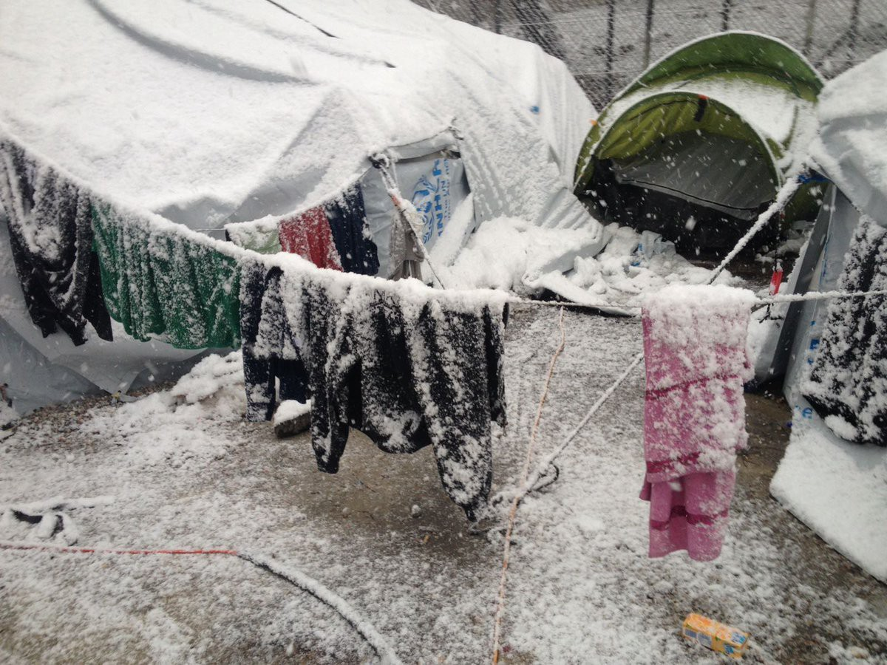
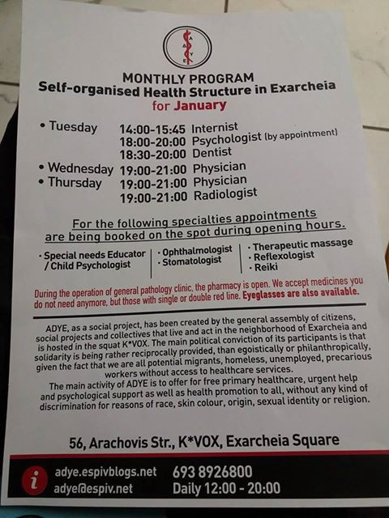
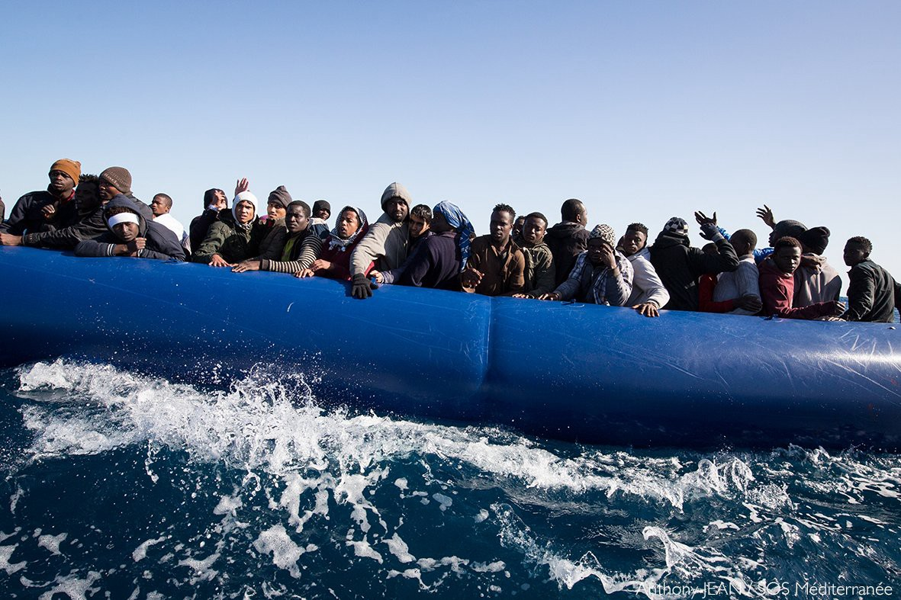

### AYS Daily News Digest 12\.1\.17 — Hungary vows to make lives of refugees more difficult

The snow is taking a harsh toll on refugees in the Balkans\. Arrivals on the Greek islands have ground to a halt\. Photo Credit: MSF International
#### Feature

Despite refugees showing little, if any, interest in remaining in Hungary, the Hungarian government remains steadfast in its position as one of the most vocally anti\-immigrant states in Europe\.

Hungary often positions itself as a defender of Europe, staving off Muslim hordes who wish to undermine the “European way of life”\. Prime Minister Viktor Orban said, in a speech to new cadets of Hungary’s notorious border guards, “Terror attacks, riots, violence, crime, ethnic and cultural clashes all show us that those who come do not want to live our lives\. They want to continue living their lives, just on the European standard of living\. We understand them but we can’t let them into Europe\. Nowhere do human rights prescribe national suicide\.” With such antagonistic conditions prevailing, it is little surprise that the Hungarian government will introduce new legislation allowing refugees to be detained for the entirety of their asylum process\.

Should the law pass, refugees will be required to remain stationary for the entirety of the processing time for their applications\. This legislation aims to limit contacts between refugees and the native Hungarian population\. In addition to being cruel, this bill is a violation of EU law\. According to the EU, “the detention of applicants should be applied in accordance with the underlying principle that a person should not be held in detention for the sole reason that he or she is seeking international protection\.” Even to those who are used to the Hungarian government’s blatant disregard for the well\-being of refugees, this latest action is unbelievably cruel\.
#### Syria
### Syria ceasefire holds, but tensions remain high

The UN Special Envoy to Syria, Staffan de Mistura, has said that both sides have largely kept the terms of the ceasefire, with the Wadi Barada Valley being an important exception\. The area supplies Damascus and surrounding villages with water, and continues to be a point of contention between regime forces and rebels\.

De Mistura also raised concerns that rebel groups were not allowing buses to leave the villages of Foua and Kefraya in Idlib province\. These buses had previously been used in recent evacuations elsewhere\.
#### Greece
### Greece has received 482 million Euros from the European Commission to deal with refugee crisis since 2015

[A total of 509 million](http://greece.greekreporter.com/2017/01/12/european-commission-greece-has-received-e482-mln-for-refugees/) has been allocated for refugee management in the period spanning from 2014 to 2020, with 352 million in emergency funding having already been spent\. The money went roughly equally to the government and NGOs, with 178 million going to the former and 175 to the latter\. Of the government spending, 89 million euros was given to the Ministry of Defense\.
### Orange House shelter has opened its doors

### Pampiraiki Warehouse in Athens is once again open

Their working hours are from 11am to 6pm, Monday through Friday\.
### Nurture Project International seeking female Arabic translator

If you are available and would like to offer your services, please email them at volunteer@nurtureprojectinternational\.org\.
### Dirty Girls laundry service needs your help\!

### Refugee Support Greece continues to provide invaluable resources for refugees

### Refugees trapped on Rhodes are in desperate need of help\!

### Athens group provides medical services to those in need

#### Serbia

■■■■■■■■■■■■■■ 
> **[MSF Sea](https://twitter.com/MSF_Sea) @ Twitter Says:** 

> > It is - 10 degrees in #Belgrade #Serbia today. Imagine you have to face the cold in these conditions. https://t.co/IflZqwNfBL 

> **Tweeted at [2017-01-12 08:59:12](https://twitter.com/msf_sea/status/819468760474066944).** 

■■■■■■■■■■■■■■ 

### UNHCR releases latest figures on Serbia

[The report](https://data.unhcr.org/mediterranean/download.php?id=2332) shows that there are currently over 7,200 refugees in Serbia, and details the populations of the camps\.
#### France

### Francois Fillon pledges to crack down on immigration

In an attempt to pander to the voters who would otherwise vote for Marine Le Pen’s Front Nationale, the conservative politician Francois Fillon pledged on Wednesday to set quotas on the number of foreign nationals allowed to claim asylum in France, and to create more tightly controlled borders\. Additionally, he promised to prevent refugees from claiming benefits in France if they have been in the country for less than two years\. France’s presidential election will take place in May, and it is expected that Fillon and Le Pen will face off against each other in runoff elections\. Polls currently show Fillon in the lead, but as recent experiences have shown, polls do not necessarily reflect the situation on the ground\.
### CPSE reports on interactive experience bringing attention to the plight of refugees

Our friends at the _Collectif Parisien de Soutien aux Exilés_ have reported that on the 16th of January, a giant board game will be painted on the ground in front of the La Chapelle Refugee centre\. People will be able to throw dice to experiment the “journey of a refugee,” going from the square “Manuel Valls” to the square “Dublin” and passing through the squares “retention centre,” and/or “deportation”\. Representatives from associations and organisations supporting refugees in Paris will speak at this event and educate the audience about the current situation, while information about the asylum procedure will be given to refugees\. The event will also be an opportunity to reaffirm the struggle against police violence\. The Paris “humanitarian centre” has been fully occupied since the day it opened, forcing refugees to sleep in the streets, even as police have intensified their harassment in the last ten days\.
### Phone Credit for Refugees group seeks funding\!

The [Phone Credit for Refugees group](https://www.facebook.com/groups/1709109339334305/) has been dutifully providing refugees with phone service for a while now\. After the destruction of the Calais camp, their profile shot up\. Now however, they are having trouble making ends meet\. On average, they receive a weekly bill of 12,000 pounds, with donations not even covering half of the cost\. The group is now out of funds, and will no longer be able to continue its services\. Please consider donating to them, to help refugees keep in touch with their friends and loved ones\.
### Dunkirk Refugee Children’s Center is seeking remote volunteers\!

#### Italy
### Man dies in Sesto Fiorentino Fire

“A\.M\.” died in the fire which broke out last night, January 11, in the occupied building of the ex furniture factory Aiazzone, in the municipality of Sesto Fiorentino\. A\.M\. was 38 years old, of Somali origin; he had received international protection in Italy and was living in Florence since 2008\. For a short time he lived in a centre, then in occupied buildings, in the absence of an alternative solution\. When the first fire broke out, A\.M\. fled the building unharmed\. He ducked back in, however, to try and retrieve the family reunification documents to bring his wife and two children to Europe\. He was unable to escape a second time, and perished in the fire\.

The fire, caused by an old heater not working properly or by a short circuit, began on the second floor of an abandoned building, empty for years and occupied in December 2014 by the _Movimento per la Lotta per la Casa_ to provide accommodation for a group of homeless refugees mainly from Somalia\. Medici per i Diritti Umani \(Medu\) has operated in the building since May 2015 offering health care to the people staying there, informing them of their right to health care and of the means of access to social and community health services\.

In January 2016, the building’s power was cut by Acea, the electricity company, in an effort to clear out its residents\. In response to this attempt, Medu publicly denounced the serious structural problems and sanitarian situation of the building, highlighting the poor living conditions of the people hosted\. At the time, they demanded that the Municipality of Sesto Fiorentino hold an immediate meeting with the associations and movements operating in support of the migrants sleeping in the ex Aiazzone, to find adequate housing solutions\.

Inside this building there were about 70 people, men and women, young and old, all holders of an international protection permit\.
Besides A\.M\., two other men were seriously poisoned by smoke, most likely originated by the camp stoves used to heat up\. One of them was a longtime patient of the doctors and operators of Medu mobile clinic, who had been demanding the municipalities of Florence and Sesto Fiorentino to rehouse him, given his precarious health condition\.

In the aftermath of the tragic fire, the city of Sesto Fiorentino set up camp in the parking lot of a large furniture factory nearby, but the tents used are insufficient to accommodate the people left in the streets, and minimum sanitary facilities have not yet been built\.

In these precarious and degrading conditions, death is tragic, but not surprising\. A\.M\. was not only a victim of the flames, but also of an integration system that was unable to generate social inclusion, a lack of social and family networks, and lack of access to basic rights such as housing\.

Medu forcefully demands that local and national institutions — the municipalities of Sesto Fiorentino, Florence and the metropolitan area — accept responsibility for this hateful and predictable tragedy, at least regarding of the survived victims\. They must ensure dignified, quick and safe living conditions to the people who are currently on the streets, taking into consideration the current weather conditions\.

Finally, Medu calls for structural interventions to implement of systems that will permanently resolve the many precarious settlements in the Florentine area, where hundreds of people, mostly political refugees, live, often in extremely vulnerable conditions\.

\(Translated from [this post](https://www.facebook.com/MEDUonlus/posts/10154901093614817:0?hc_location=ufi) \)
#### Mediterranean
### 123 were rescued today by MSF Sea

_Converted [Medium Post](https://areyousyrious.medium.com/ays-daily-news-digest-12-1-17-hungary-vows-to-make-lives-of-refugees-more-difficult-9d07d722be99) by [ZMediumToMarkdown](https://github.com/ZhgChgLi/ZMediumToMarkdown)._
