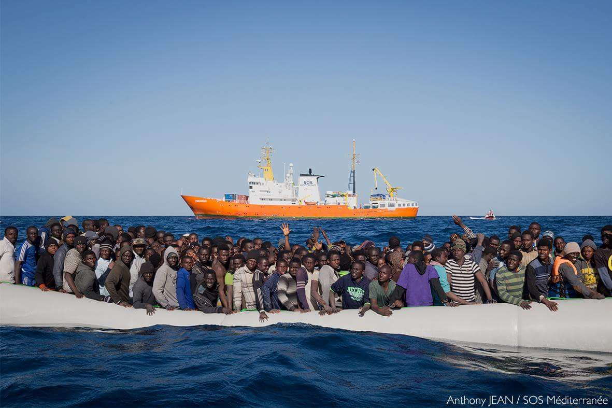
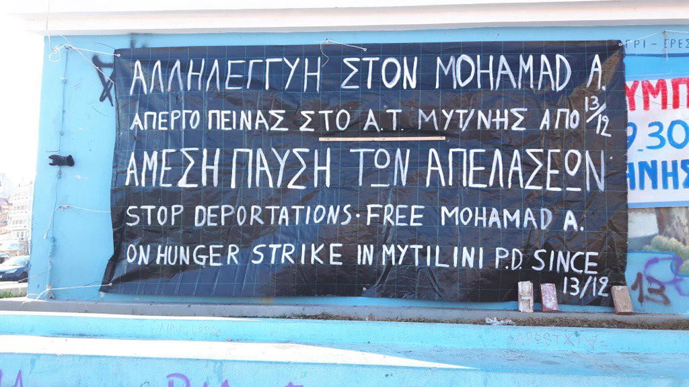
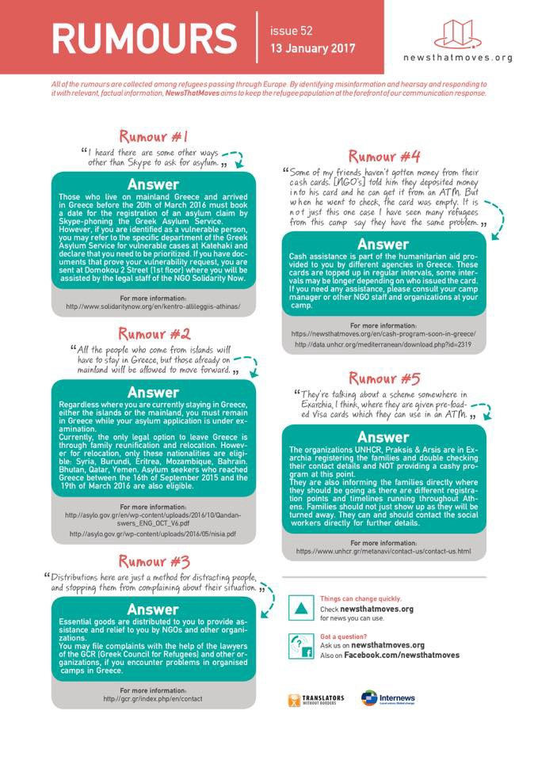
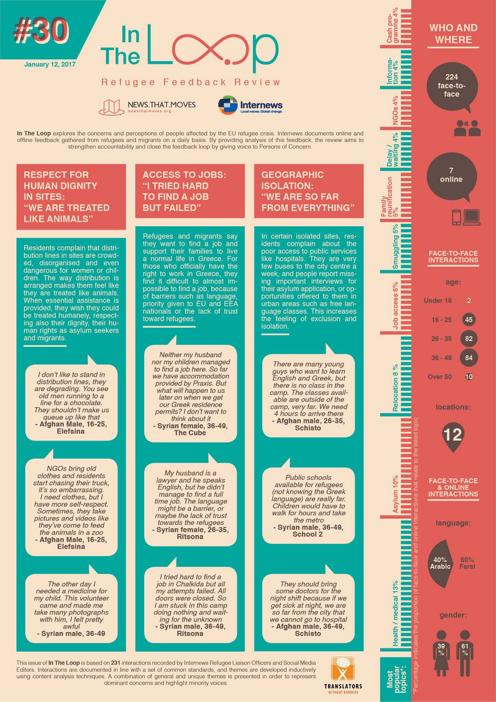

### AYS Daily News Digest 13/01: Officials don’t mind a person freezing if they’re ‘not in the system’
#### 193 people saved from the sea \| New returns from Greece to Turkey \| Slow transfer of refugees from the islands to the mainland \| Info on healthcare in Bulgaria, Macedonia and Serbia \| Serbia’s refugees who are “out of the system” officially ignored \| Hungary’s opposition demands humane treatment for refugees \| Changes in Austria \| Unaccompanied minor in France dies of heart attack

 
_“No discussion on the general balance of power between countries of the worls, and no argument about the political and economic difficulties that come with aid to refugees can justify states abandoning those human beings at the gates of death\.” — Michel Foucault on [r](https://twitter.com/hashtag/refugees?src=hash) efugees, an interview from 1979\._](assets/fc72dcade5d5/1*kD0g-V9DDt5NonfiS_WNFA.jpeg)

Serbia, January 2017\. Photo: [Art Against](https://www.facebook.com/artagainstproject/) 
_“No discussion on the general balance of power between countries of the worls, and no argument about the political and economic difficulties that come with aid to refugees can justify states abandoning those human beings at the gates of death\.” — Michel Foucault on [r](https://twitter.com/hashtag/refugees?src=hash) efugees, an interview from 1979\._
#### MEDITERRANEAN

On Friday afternoon the Aquarius, an MSF search and rescue vessel in the Mediterranean Sea, **saved 193 people** and they also recovered two bodies that were apparently crushed when panic broke out on board after shooting started off the Libyan coastline, according to [MSF Sea](https://twitter.com/MSF_Sea) **\.** According to some sources, Libyan officials are [not willing to accept](https://www.middleeastmonitor.com/20170113-libya-not-accepting-eu-refugee-deal/?platform=hootsuite) the offered EU refugee deal\.

Photo credit: Anthony Jean, SOS Méditerranée

29 people have reportedly died since the beginning of this year in an attempt to cross the Mediterranean\.
#### GREECE
### New returns from Greece to Turkey

On Thursday, 17 men, four women and six children, all from Syria, were flown from Lesvos to Adana in Turkey, a Greek official statement stated on Thursday\. Their requests for asylum in Greece were rejected\. It is [reported](http://www.ekathimerini.com/215248/article/ekathimerini/news/greece-returns-more-syrian-refugees-to-turkey) that more than 800 people have been returned under the EU — Turkey agreement, while about 23,000 new arrivals have reached the Greek islands\.
#### Arrivals

12 people were officially registered on the Aegean islands today\.

Two boats arrived on the island of Lesvos this Friday morning, one found by the Greek Coast Guard with 20 people on board, while the other landed on the north coast carrying 22 people\.

Lesvos — Mohamad A, a refugee held in detention while awaiting to be deported to Turkey on Saturday, has been on a hunger strike for 31 day\.
### Amnesty: Refugees Held Hostage by Failed EU Policy

Another attempt to put pressure on the European Commission to ensure that refugees are moved off the Greek islands, “instead of trying to maintain a deal that has condemned thousands of people to unbearable conditions’’, was put into motion by Amnesty International via an [online petition](https://www.amnesty.org.uk/actions/stop-refugees-freezing-death-greece) titled “Stop Refugees Freezing to Death in Greece”\.

> _’People are at imminent risk of freezing to death because European leaders are failing to help them… they are stuck in legal limbo and unable to leave the detention camps… effectively being held hostage by cruel and dysfunctional EU policies\.“_ 

We have recently published **a [joint statement](https://medium.com/@AreYouSyrious/wake-up-europe-human-beings-in-life-threatening-conditions-6123880d07a7#.dkkr277zo) from refugees and groups denouncing the treacherous living conditions in Greek camps\.**

5 deaths from the cold were so far [mentioned](http://www.ekathimerini.com/215256/article/ekathimerini/news/un-worried-about-migrants-dying-of-cold-dire-situation-in-greece) by the UNHCR spokeswoman, who [said](http://www.unhcr.org/en-us/news/latest/2017/1/5878e1c34/unhcr-calls-help-refugees-facing-european-winter-freeze.html) about 1,000 people were in unheated tents and dormitories in Greece, namely on the island of Samos\. Volunteers and doctors are constantly witnessing and treating a large number of desperate patients at the island camps, who are suffering from frostbite, shivering with cold and drenched by snow and rain\.

Without a doubt, a speedier registration and relocation process, that we also called for many times, would allow faster transfer of people to mainland Greece where better accommodation could be provided for them\.

However, the UN spokesman for Greece said 235 people had been transferred from camps on Lesvos to hotels at special rates in the past few days, and around 40 men from the camp spent their first night on Thursday on a tanker ship sent from Athens to Lesvos to house people living in the camp in Moria\.

](assets/fc72dcade5d5/1*lA2Co5tqCwykexQbVD4wFw.jpeg)

Screenshot source: [Greek Reporter](http://greece.greekreporter.com/2017/01/13/forty-refugees-from-moria-move-into-the-navy-ship-sent-from-athens/)
### Athens

An estimated number of 64 people were reportedly brought to Athens from the Mitilini camp, reportedly most of them with no winter clothes, no warm jackets\. According to volunteers on site, they seemed unaware of where they were exactly, they were visibly traumatized and scared\. Hopefully Athens will provide a safe place for these people and we hope with the impulse from the UN Refugee Agency and engagement from the Greek side, all those freezing will finally be given decent accommodation\.
#### Important \! Scabies — control and prevention

Information about scabies, researched and collated by [Athens Volunteers Information and Co\-ordination Group](https://www.facebook.com/groups/AthensVolunteersInformation/) , is available [here](http://www.cdc.gov/parasites/scabies/index.html) \.
#### New information point in Athens

[RefuComm](https://www.facebook.com/refucomm/?fref=nf) has just opened a new [information point](https://www.facebook.com/notes/refucomm/information-at-the-orange-house-athens/381472385537903?hc_location=ufi) at the Orange House\.
Visitors and residents now have access to detailed, written information about the processes and their legal rights on the Greek mainland in English, Arabic, Farsi and Urdu as well as the full schedule for registration\.
#### Upcoming film projection on the topic of LGBTI refugees and the challenges they face

The Canadian documentary Last Chance will be screened on January 18 at 6 p\.m\. at the Greek Film Archives, Iera Odos 48, Metro Keramikosthe\.
It tells the stories of five asylum seekers who flee their native countries to escape homophobic violence\. They face hurdles integrating into Canada, fear deportation and anxiously await a decision that will change their lives forever\. The film is in English with Greek subtitles\. A discussion with acclaimed panelists will follow in Greek\. Admission is free\.

■■■■■■■■■■■■■■ 
> **[MSF Sea](https://twitter.com/MSF_Sea) @ Twitter Says:** 

> > Good morning from Derveni camp near #Thessaloniki, one of the camps "adapted for winter". Try to take a shower in these conditions. https://t.co/g1Pznbqn18 

> **Tweeted at [2017-01-13 06:31:20](https://twitter.com/msf_sea/status/819793937716027392).** 

■■■■■■■■■■■■■■ 

### Information for refugees

Refugee Info teams created a set of videos, with the help of refugees wherever possible, to explain some of the asylum procedures the refugees face\. These videos are available in Arabic and Farsi\.
Videos on the Asylum process, reunification and relocation can be found on [this website](http://www.refugee.info/athens/info/videos) \.

#### ACCESS TO HEALTHCARE

News that moves have prepared an information pack on healthcare in the countries of the Balkan route\.
#### Bulgaria

Asylum seekers in Bulgaria have access to partially free health care only while their asylum procedure is ongoing, whereas refugees are excluded\. Based on the [Bulgarian Law on asylum and refugees](http://lex.bg/laws/ldoc/2135453184) , the authorities are paying for health insurance for asylum seekers\. Refugees and people under subsidiary protection, as all other Bulgarian citizens and foreigners legally residing in Bulgaria, have to cover health insurance on their own\. More details [here](https://newsthatmoves.org/en/access-to-healthcare-in-bulgaria/) \.
#### Macedonia

Recognised refugees and people under subsidiary protection have access to free public healthcare in FYROM\. All health services are free of charge for refugees/people under subsidiary protection, provided that they have the relevant documents proving their status\. All costs for health care are fully covered from the state budget\. [Find here](https://newsthatmoves.org/en/access-to-free-public-healthcare-in-fyrom/) is what is included\.
#### Serbia

Asylum seekers and recognized refugees \( \! \) have access to public healthcare in Serbia\. Health assistance is not free in Serbia, but if the situation is urgent, medical help is provided even to asylum seekers who have not begun the asylum procedure, [News That Moves](https://newsthatmoves.org/en/access-to-healthcare-in-serbia/) say\.
#### SERBIA

Although reaching Serbia means a perilous journey for many, legally leaving it, a “limbo” where most people are left to join the more than 7,000 refugees currently staying in this country, is close to impossible and doing so in other ways can be very dangerous as the borders of both Croatia and Hungary are [closed](https://newsthatmoves.org/en/qa-reaching-serbia/) \. Recent police violence has only confirmed the fears of many who consider risking their lives to leave Serbia and reach safety\.
According to the NGOs present there, around ten cases of severe frostbite were registered, among which is a one year\-old baby\.

■■■■■■■■■■■■■■ 
> **[Brian Ging](https://twitter.com/brianging) @ Twitter Says:** 

> > The shed on the left and the right each house hundreds.  Freezing,  filled with smoke.  Outbreaks of scabies.  Belgrade https://t.co/CYOcdGwooz 

> **Tweeted at [2017-01-13 12:51:46](https://twitter.com/brianging/status/819889675104120832).** 

■■■■■■■■■■■■■■ 

As a reaction to the dire conditions in which more than 1,200 people are left in Belgrade, sleeping rough outdoors where temperatures have been reaching \-17 Celsius in the past few days, Amnesty International have released a [report](https://www.amnesty.org/en/documents/eur70/5495/2017/en/) and they invite everyone to write to the Serbian officials,
- calling on the Minister of Labour, Employment, Veteran and Social Affairs to ensure all refugees and migrants are provided with basic services such as adequate housing, food, sanitation and healthcare and NGOs are not stopped from distributing aid;
- Urging the Minister of Social Affairs and the Minister of Interior to urgently deploy competent staff to identify and provide treatment to all unaccompanied children and other vulnerable individuals;
- Urging the Minister of Interior to ensure all persons wishing to seek asylum in the country are received by police and are referred to a reception centre for the duration of the asylum process

### Serbian authorities unwilling to help refugees who are ‘not in the system’

A representative of a local NGO in Subotica said that there are about a hundred migrants on different locations in Subotica, living out in the open without water, food, warm clothes or shoes and that the government isn’t interested in helping those who aren’t in the system\. 
“Serbia has the capacity to lodge these people somewhere, they received funds for that purpose, but there is no will to do it”, [Tibor Varga said](http://maglocistac.rs/varga-vlast-nezainteresovana-da-pomogne-migrantima-koji-se-nalaze-van-sistema/) \.
No organizations are allowed to help the people outside the camps\. The State Secretary at the competent Ministry stated: “We will definitely not allow the opening of alternative camps or encourage anyone to stay outside the system, that is simply not OK\. There is a place for everyone at the centres\.”
However, there is a number of claims by those staying outside in Belgrade that they’ve tried multiple times to register at the police office, but were sent away\. Another reason for the situation is that Serbia is only a stopover for these people, not a place where they would like to ask for asylum, a condition for getting protection at the official camps in the country\.

In The Loop, a weekly refugee feedback review by Internews
#### HUNGARY
### Hungarian opposition demanding more humane conditions for the refugees

The Hungarian Liberal Party \(opposition\) has issued a [written demand](http://dailynewshungary.com/oppostion-demands-w-hungary-refugee-camp-closed-winter/) that the government shut down substandard refugee camps, including the tent settlement near the Western Hungarian town of [Kormend](https://newsthatmoves.org/en/refugees-living-in-cold-in-hungary/) \.
Liberal Party foreign affairs spokesman István Szent\-Iványi said asylum seekers must be accommodated in more humane conditions and aid groups and individual volunteers wishing to render assistance must be permitted to do so, [News That Moves](https://newsthatmoves.org/en/hungarian-opposition-demands-humane-conditions/) report\.

Independent volunteers who wrote to us claim there are more closed than open camps in Hungary and the wellbeing of the refugees depends almost solely on volunteers\. The lack of government support in setting up a sustainable system, including proper language learning networks and permission to work, causes people to lose the strength and motivation for learning the language and culture and building connections\.

The Hungarian camerawoman who was filmed kicking or tripping up migrants near the Hungary\-Serbia border has been sentenced to three years’ probation for disorderly conduct\.
#### AUSTRIA
### Could Austria cut asylum numbers by half?

Austrian conservatives propose that Austria lower its upper limit for the number of asylum applications it will process from 35,000 to 17,000\. The drastically lower cap could effectively result in the closure of Austria‘s borders to asylum seekers, [reports](http://info@europeonline-magazine.eu) say\.
#### FRANCE
### A young Sudanese died of a heart attack

A group of unaccompanied underage migrants arrived in Saône\-et\-Loire, after the closure of the Calais camp\. The group included 15 teenagers \(aged 13 to 17\), from Sudan, Syria and Eritrea\. [Their stay](http://www.taize.fr/en_article21015.html) in the village of Ameugny, not far from Cluny, was organized by the Taizé Community, who have [previously welcomed](http://www.taize.fr/en_article19949.html) other refugees in their village, and the association Le Point\. Four of the minors have recently moved to the UK, but Samir was one of those who were rejected and had decided to seek a safe life in France, but sadly he never made it\. 
Avoiding media sensationalism, we share the personal account of one of the people who have been working on setting up a welcome place in this area and who continues to be a big support to the small refugee community there as one of the most involved locals\.

> On Thursday, January 5, Samir’s heart stopped\. He died\. 

> One could say : « Who cares ? Such things happen every day\. That’s no news\. » 

> But we do care\. Because he was our friend\. 

> Samir had a long, a very long journey to arrive at this little French village where he finished his life\. He was 17 or maybe a bit more\. He was born and had lived in Sudan\. Like many other young men he had to leave his country and look for peace and safety elsewhere\. Through Libya he arrived at the Mediterranean Sea\. He was told he was lucky to be alive after he crossed\. Italy, France, Calais… and a dream : the UK\. The dream of arriving in the UK kept him alive throughout his journey\. The dream of a better future on the other side of the Channel helped him to overcome the mud, the cold, the hunger of Calais\. But Calais was to be dismanteled\. Samir had to get on a bus to be taken to a safe place while waiting for the answer of the UK Home Office\. A « yes » or a « no » that would change his life\. 

> Samir accepted to wait and trust\. He got on a bus in Calais that would drive him to an unknown destination, somewhere in France for a short, a very short stay… « only a few days », he was told\. 

> At the beginning of November, late at night he and 15 other young men, unaccompanied minors from Calais, arrived in our village in the South of Burgundy\. 

> We knew in advance that welcoming these young men would transform the way we see the world but we never thought that this experience would bring us so far in friendship and solidarity\. Together we learned to listen, to ask good questions, not to judge, to be careful and caring, to be joyful and have fun together but also to shed tears together and to walk together\. Trust grew day by day\. The group of volunteers, the brothers of Taizé, the sisters of St\. Andrew around our new friends became this safe net that refugees are hoping for, a net that catches you whenever you fall\. 

> But from the « jungle » of Calais our new friends had to learn how to survive in a different kind of jungle: papers and administration\. A new fight, a new struggle started\. But we had a shared hope that together we will manage, we will be able to jump over the walls\. 

> Samir’s heart was too fragile, it stopped beating\. The shock was devastating\. How to face the death of a young man so close to his dream ? How to share the despair of his friends? How to comfort his beloved mother crying in Sudan? How to go on the next morning? 

> We have lot of questions and very few answers\. But what we know for sure is that we don’t want to lose our humanity, the only thing we can do is to keep on not closing our doors\. 

> — Orsi Hardi 

 \)](assets/fc72dcade5d5/1*GnDYF9r_dI56EUU-rpTWuw.jpeg)

Refugee boys upon their arrival to the welcome place in Ameugny, with members of the two Communities, Orsi and the volunteers \(Photo: [Taizé](https://www.facebook.com/taize/) \)

_Converted [Medium Post](https://areyousyrious.medium.com/ays-daily-news-digest-13-01-officials-dont-mind-a-person-freezing-if-they-re-not-in-the-system-fc72dcade5d5) by [ZMediumToMarkdown](https://github.com/ZhgChgLi/ZMediumToMarkdown)._
