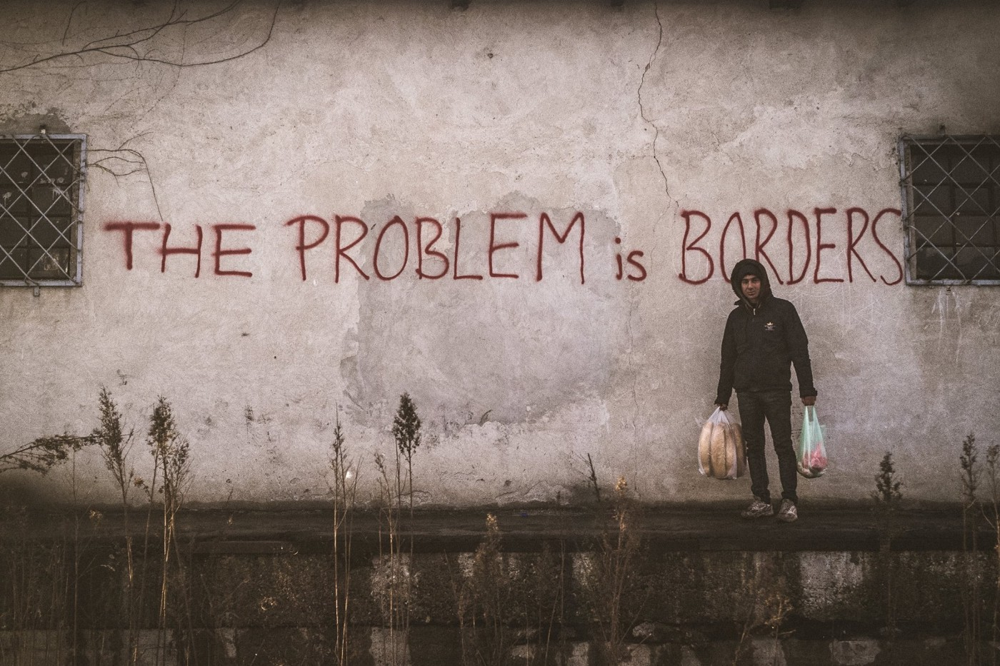
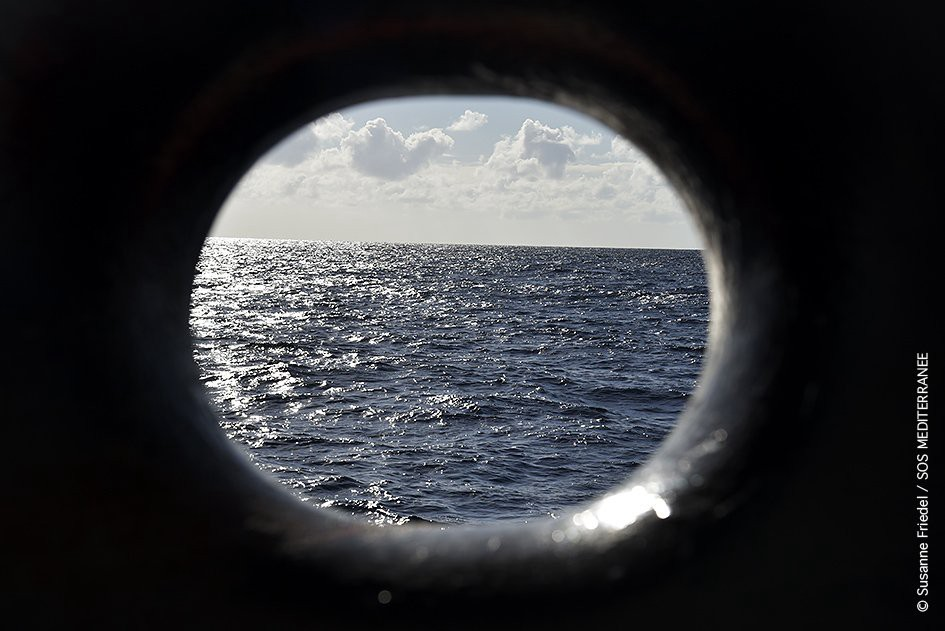
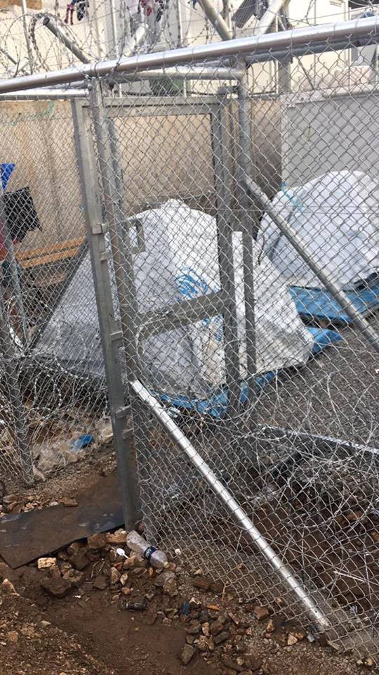
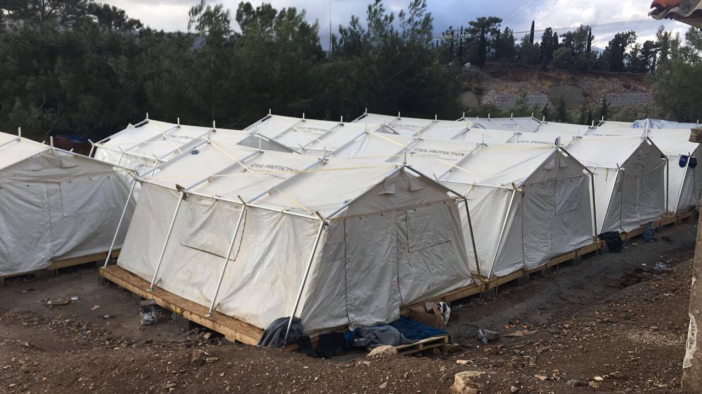
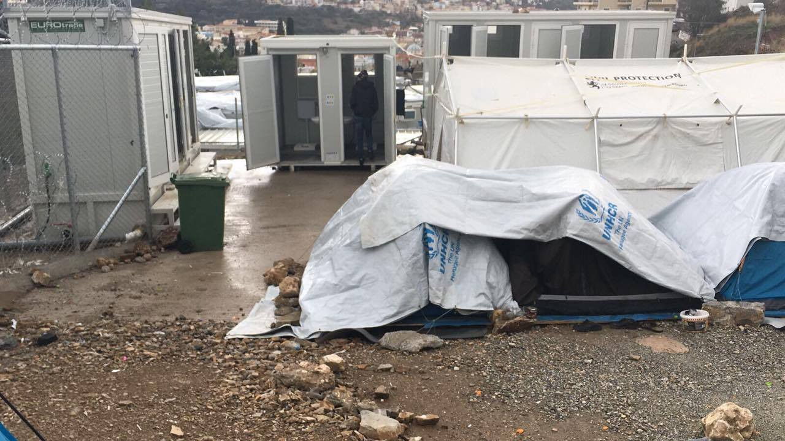
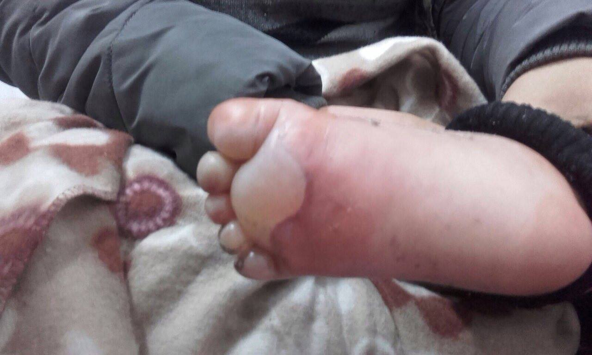
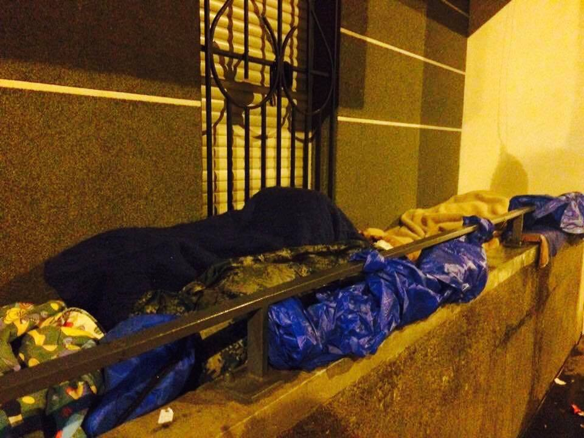

### AYS DAILY DIGEST 14/01/2017: More than 100 people have drowned in the Mediterranean sea

_Another tragedy in the Mediterranean with little to no reaction from the EU / When politicians in the EU react, usually it is to tighten borders and impose new rules // People in Greece remind their government about weak response all the time, but today we are bringing a letter from Lesvos for Mr\. Mouzalas // Volunteers in Serbia are helping people with frostbite, while Hungarian government stubbornly refuses to act humanely // Young refugees in Croatia victims of a poor system and lack of responsibility // No good news from France // Are You Syrious and Hot Food Idomeni helping people in Belgrade together_

Photo by Igor Čoko\. Belgrade\.
### Feature
#### \#Safepassage

Closed borders are taking more lives every day\. If people are not freezing to death, they die in the sea while trying to fulfill their dreams and come to, what they believe, is freedom and peace\. Today, a boat with 107 people has sunk in the sea between Libya and Italy\. Only 4 people were rescued\. By the end of the day 8 bodies were recovered from the sea\. The search for remaining 95 is still going on\.

Photo by MSF Sea

After the borders closed and the EU strengthened controls, smugglers started using smaller and less safe boats to cross the Mediterranean\. Sometimes they place more than 150 people in poorly made dinghies\. This practice has made the last year one of the deadliest so far in the sea\. Since the beginning of this year, more than 1,600 people have arrived in Europe by sea\.
### Greece
#### Another suicide attempt in camps

Despite all the appeals and media reports, the situation in camps all over the country is improving very slowly, if at all\. Some people have been moved to warm places, but many are still in camps, living under tents, in unheated squats and accommodation that is not suitable for living\.

[Humanitarian Support Agency](https://www.facebook.com/groups/volunteers.coordination/) reports that transfers of refugees continue from Moria camp, and many people are being sent to Kara Tepe camp\. Over the last three days, over 100 have been brought there and another 500 plus are expected to come within the next 2 weeks\.

HSA provides each new person anywhere between 12 and 15 items of clothing ranging from jumpers and winter coats to thick socks and good shoes\. They provide new clothing to be sure it will last for the rest of the winter\. To continue this important job, they need help\.

Donations for HSA are accepted here:

Paypal: [hsa\.lesvos@gmail\.com](mailto:hsa.lesvos@gmail.com)

Wire Transfer Details: Humanitarian Support Agency Paseo del Borne 15–7E 07012 Palma de Mallorca Bank Name: BBVA Bank Location: Palma de Mallorca, Spain SWIFT: BBVAESMMXXX Account Name: Humanitarian Support Agency IBAN: ES74 0182 4901 3102 0155 0306

People from Greece are well aware of the situation with refugees\. [Aphrodite Vati Mariola](https://www.facebook.com/aphrodite.vati/posts/1426887614002181?hc_location=ufi) wrote an open letter on her FB page addressed to the Minister of Immigration Policy, Mr\. Mouzalas, a person many are writing to these days\. Aphrodite reminded the minister that he and the government, as well as the EU, failed to help not only to refugees, but their own people in the past\.

> “I am sorry, Mr\. Mouzalas, but if you truly cared about the refugees and the state in which they have been living in for almost a year now, you would have taken action months and months ago\. The EU\-Turkey agreement was signed in March 2016, so why did we have to arrive at the year 2017 to suddenly feel the urgency to take action? Did we not know that winter was going to arrive again with extreme conditions and that so many people were living in limbo in Moria camp? Is it because the international press and social media have put pressure on the local congressmen, politicians and on the Ministry of Immigration? Instead of winterizing these camps, instead of renting closed warehouses, instead of offering government owned buildings which are closed, instead of using the money provided by the EU to prepare these facilities, it is suddenly the fault of the hoteliers that the refugees are suffering in these extreme weather conditions?” 

On more time, we want to stress out support with refugees in and out of camps, reminding that nearly €90m have been disbursed by the EU to the Greek government and more than €14m to UNHCR to improve conditions at the camps before the winter\. Yet, for the last months, more than 30,000 and 15,000 refugees on the mainland and the islands respectively, have been sleeping under inhumane and degrading conditions\. [Wake up Europe\!](https://medium.com/@AreYouSyrious/wake-up-europe-human-beings-in-life-threatening-conditions-6123880d07a7#.ntcwpyly6)

The situation is Greece makes people do desperate things\. Pru Waldorf, a long\-term volunteer at Samos and co\-founder of Calais Action, informed us about another suicide attempt among refugees in Samos\. This time, a 45\-year old Palestinian/Syrian man tried to kill himself\. He has been waiting with his three children for 8 months with no word on his status\.

_“The plight of Palestinians/Syrians is a cause for grave concern as they are considered stateless and the terms of the EU\- Turkey deal do not apply to them,”_ Pru told us\.

A couple of days ago, an Iraqi man, 33, also tried to kill himself\. Last month, an Afghan man tried to hang himself because he has to wait for more than 10 months\. Back in September, a man set himself alight in the camp in Samos in an attempt to end his life\.

_“People are becoming increasingly more desperate while the provision of psychosocial or enrichment activities are none existent\. These are very vulnerable people who have already experience loss and trauma that we can barely imagine and rather than safeguarding them and affording them their basic humans rights we are locking them up indefinitely\.”_

These are some of the pictures, taken by residents of the camp, today\.

### Serbia
#### More pictures of horror from Serbia

In Serbia, the government is doing hardly anything to help people who are staying out in the open, and the EU is pretending they do see and know nothing\. Volunteers from [Info Park](https://www.facebook.com/Info-Park-885932764794322/) posted today pictures of children with frostbites\. Pictures are made among people who came to the Info Park over the last two days from Bulgaria or Kosovo\. Among them, many are children under 10 years old\.

> “Some got a treatment at the children hospital in Belgrade but in reality, most of the cases are handled by three big medical teams currently giving a lifeline support to the refugees in downtown Belgrade: MSF, MDM and RMF\.
 

> Info Park working in coordination with organizations such as Praxis took care not only of the first response and medical referrals but also that the families are registered and sent to the camps to rest and recover\.” 

Photo by InfoPark

In Belgrade, the snow melted over the last two days, but the ice rain is starting, while meteorologist is predicting another snowfall predicted for Tuesday with temperatures of\-7C starting from tomorrow morning\.

There are more than 8,500 stuck in Serbia now\. Capacity in the reception centers is around 6,000, but many of these places are not ready for the winter conditions\.

Are You Syrious and our friends from Hot Food Idomeni are in Belgrade providing a hot meals for all those in need\. We wish to thank our generous donors and to congratulate to all of our volunteers who helped to make this project possible\. The kitchen goes by the name White Bob, in honor of our Warehouse/Field Coordinator Marko Boban who worked on it tirelessly for several months\.

### Croatia
#### 28 children asylum seekers start school this Monday

This coming Monday 28 children aged 7 to 15, in the status of asylum seekers, will start school in Zagreb\. The children are excited and happy and the team at the school is positive and ready to offer the children all their help, also thanks to the support of the Islamic community in Zagreb\. This is a result of the long term efforts of the AYS volunteers, who have been working in Porin reception centre with the children along with other NGOs and 6 other children were previously successfully enrolled in school\.

Unfortunately, this is another field where collaboration and involvement of the most important institution is missing\. There has been a lot of struggle during the attempt to enroll the children to school inspite the fact that according to the Croatian law, these children have the right to attend elementary and secondary school\. The Ministry of education has so far not reacted in any way to this\.

> „The struggle to have the older children included in high school education is still ahead of us“, the AYS children’s education coordinator said, adding; „but we hope for a quick and positive outcome\. Knowledge is power\.“ 

#### Refugee minors in Croatia lost in the cracks of the system

AYS volunteers recently met with four young refugees, unaccompanied minors staying in one of the institutional homes for children, who have been there since their arrival to Croatia, some weeks ago\. The boys were excited to see some new faces and people interested in their stories who are willing to do what they can to help them \(or push those who can to do it\) \.

Around 100 refugee children, mostly unaccompanied minors, are currently staying in Croatia’s institutional homes and care centres for children\. However, there is no information flow about the whereabouts of dozens of children who have passed through some of these centres in the previous months, neither is there a universal system that would enable equal approach and adequate care in all centres, so most of them are deprived of the basic conditions that young people in their position should be entitled to and which Croatian law actually includes as their right\. Among other obstacles, there are some basic shortages that make things even more complicated, such as the lack of official translators for some languages, adequate caretakers or thorough legal approach to their individual cases to enable possible family reunification etc\.

We invite the Ministry of social politics and youth to claim their responsibilities in making sure the unaccompanied refugee minors in Croatia are properly taken care of\. We hope the officials do their job, including the creating a network of all the accommodation centres used to host unaccompanied minors in Croatia, providing regular updates on their number in each of the centres and in total\. We hope the Ministry of education, science and sports of Croatia takes the initiative from the NGOs who have so far been pushing for the inclusion of refugee and asylum seekers’ children and minors in the state educational system and we hope the Ministry of Interior takes the lead, as it has so far done in a number of matters, in assuring that no minors are „lost in the system“, neglected or not given their rights upon arriving to Croatia\.
### Hungary
#### Closed doors and closed minds

Hungary is not willing to open border for people who are freezing in Serbia, and who are desperate to continue their journey\. _“They should register and go to camps in Serbia”_ , said foreign minister Péter Szijjártó in the Saturday issue of the german newspaper “Welt”\. He still argues that people do not have right to choose where they want to live\. _“We won’t allow an illegal journey through our country,”_ he said refusing even the idea of acting humanely and respecting basic human rights\.
### France
#### Humanity is needed in the city of light

Not even the government in France is willing to help to the people in need\. Streets of Paris were even today full with people who do not have shelter\. Existing centers and camps, even if they have the capacity to accept new people, can do that only for short period of time\. Many of them do not want to stay in France, but to continue to other countries\. They are scared and not sure if their rights will be respected if they go to existing camps, so they rather stay on the streets or in new tent cities springing up on the outskirts\.

People who are sleeping rough are constantly harassed and moved on by the police\. However, like in Greece and Serbia, volunteers are doing their best to help\. [Utopia56](https://www.facebook.com/asso.utopia56/) and [Paris Refugee Ground Support \(PRGS\)](https://www.facebook.com/PRGS.team/) are active on the ground, plus many small groups\. More help is needed:
- warm clothes, especially thermal underwear and warm, waterproof jackets; light weight ‘walking boots’\. For men, women and children, but mostly young and slim\. If you can help, [buy here](https://www.leisurefayre.com/section.…/86100/1/help_refugees) or deliver to the Calais warehouses
- blankets and sleeping bags — plus bivvy bags \(waterproof covers that are sort of part tent part sleeping bag\) \. B [uy one here](https://www.amazon.co.uk/…/ref=cm_wl_s…/254-5428572-4082365…) :
- Food: [Cuisine des migrants](http://(https://www.facebook.com/La-Cuisine-Des-Migrants-305783063…/)
- snug packs\- socks, neck\-warmer, underwear and gloves\. These need to go to the l’auberge/HelpRefugees warehouse\.

And finally — if you can support yourself in Paris \(there is not the volunteer infrastructure of Calais\) there is lots to do for Utopia56 or in the PRGS store room\. Contact them on or by email: [prgsteam2016@gmail\.com](mailto:prgsteam2016@gmail.com)

You can also [donate to Care4Calais](http://care4calais.org/donate) \.

Temperatures in Paris are due to go down to \-5 this upcoming week\.

Photo by Danika Jurisic\.

_Converted [Medium Post](https://areyousyrious.medium.com/ays-daily-digest-14-01-2017-more-than-100-people-have-drowned-in-the-mediterranean-sea-91159c2a8308) by [ZMediumToMarkdown](https://github.com/ZhgChgLi/ZMediumToMarkdown)._
