### AYS DIGEST 15\.01\.17: Criminalisation of volunteers all over France

_122 people arrive on Lesvos//Volunteers needed in Greece//Situation still terrible in Serbia//Solidarity is getting criminalised in France//_

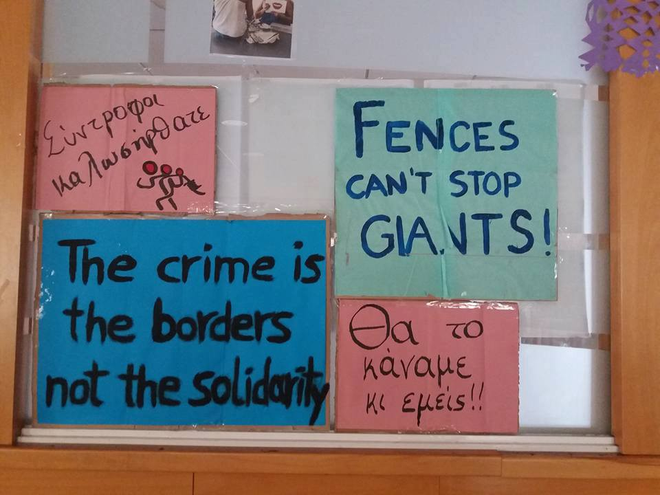

By Refugee hotel City Plaza Athens
#### Greece

**122 people arrive in Lesvos**

122 people in two boats landed during the early morning on the north coast of Lesvos, with temperatures close to zero and heavy rainstorms making their voyage and landing even more difficult\.

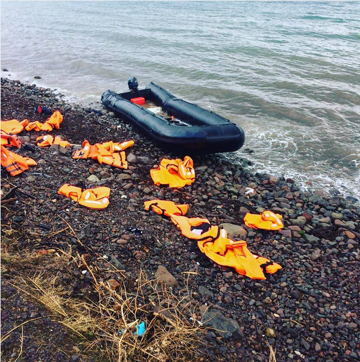

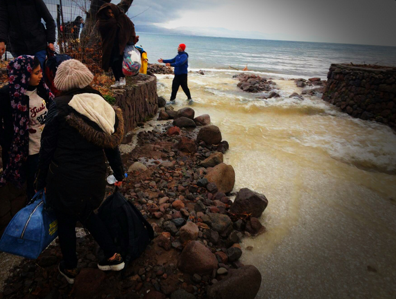

Photos by Lifeguard Hellas
### 340 people evacuated from Moria

Meanwhile, the UNHCR spokesperson Roland Schönbauer says that 340 people have been transferred out of the Moria camp in Lesvos, adding that “no kids” are in tents anymore and that up to 500 have been brought to the mainland since September\. According to Greek government statistics, 5,245 people still live on Lesvos although it has the capacity to host only 3,500 and living conditions are unlikely to improve as long as camps are overcrowded\. Spiros Galinos, mayor of Lesbos’ capital Mytilene said a week ago that Moria in particular faces problems, as the camp “ _can only host 1,500 people, but now hosts about 3,500_ ”\.
### Frontex to charter three ships to deport refugees

[Harekact](http://harekact.bordermonitoring.eu/) , which reports mainly on the EU\-Turkey deal, says that Frontex is going to charter three ships for the next two years in order to deport refugees and migrants from the islands of Lesvos, Chios and Kos to Turkey\. Deportations should then happen once a week from Lesvos and twice a month from Chios and Kos\.
### Solidarity movements in Greece demand the postponement of Mohamad Abdelgawad’s deportation

In a joint petition, solidarity movements all over Greece say:

“ _Egyptian national Mohamad Abdelgawad who received threats to his life after publishing material recording murders of Egyptian activists by the Sisi dictatorial regime, is claiming his freedom\. He had been detained in Moria since last April and then transferred to the Lesvos police department on 12/12/2016 due to a rejection of his asylum claim\. His decisive battle begins there by means of a hunger strike as his ultimate resort to claim the right to asylum and the cancellation of his deportation\. He was transferred to the Mytilene hospital on Thursday, 12/01/2017 on the 30th day of his hunger strike, while his deportation was programmed but didn’t take place for Friday,13/01/2016\. His health is in constant danger\._

_We are expressing in practice our solidarity with M\.A\. undergoing his hunger strike\. At a period in time in which the government in cooperation with the EU and the IMF are conducting the toughest attacks on workers and young people, in their attempt to make the immigrants scapegoats for the crisis\._

_We demand:_ 
_That Mohamad Abdelgawad remain hospitalised at the Mytilene throughout the duration of the hunger strike,_ 
_The immediate postponement of his deportation,_ 
_The immediate granting of Mohamad Abdelgawad’s requests”\._
### Update on the situation in Vagiochori

According to Swisscross, over the last few days the UNHCR has evacuated refugees from the Vagiochori camp to a hotel\.

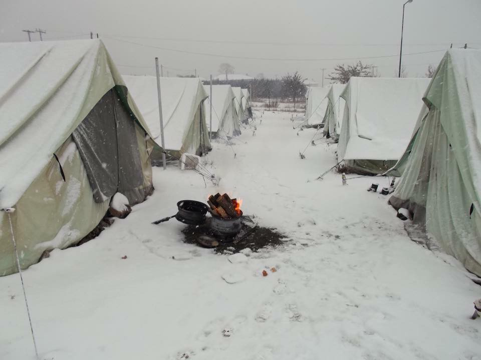

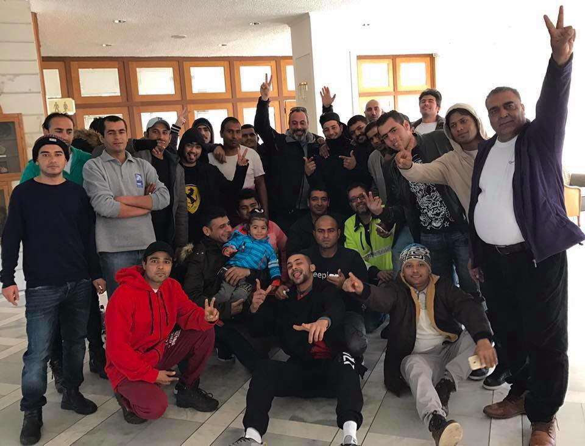

Photos by Schwizerchrüz\.ch

Swisscross met with an army official who seemed very willing to help the organisation\. The army plans to replace tents with containers and as soon as the first containers are set up, Swiscross will meet again with the military to discuss improvements to the camp\. The replacement of tents with containers is expected to last between two and four weeks and the camp could be able to host a total of 600 people\.

### Important Information for Refugees

The Asylum Service has made new time slots available for Urdu\-speaking refugees in Athens, according to United Rescue Aid\. The new hours are: Monday 15h00–16h00
Tuesday 14h00–15h00
Wednesday 10h00–12h00
For Urdu\-speaking refugees in any other places in Greece then Athens, the Skype hours are Thursday 10h00–11h00\.
### Transportation issues and solutions

**Marhacar is still helping in Greece** and has volunteer drivers delivering aid in Lesvos, Athens and Thessaloniki\. If you want to use their services or volunteer with them, you can contact them through their [Facebook page](https://www.facebook.com/marhacar/) \.

As a driver, you would deliver donations sourced by coordinators to refugee camps and refugee sites around Lesvos and mainland Greece on shifts from 9 AM — 3 PM and 3 PM — 9 PM\.

In Nea Kavala, refugees currently have to walk 30 minutes to the nearest supermarket, 45 minutes to the local village and 30 minutes to the clinic, in freezing temperatures and often along a dangerous highway\. Kayra Martinez is looking for volunteers who could organize some sort of shuttle service from the camp to the village\.

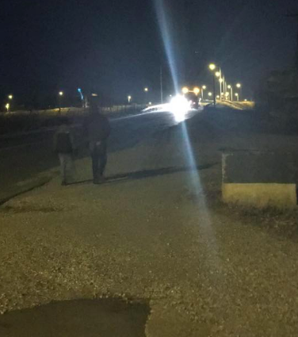

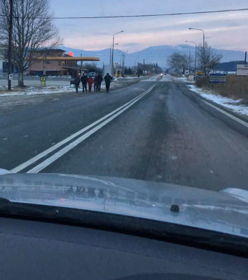

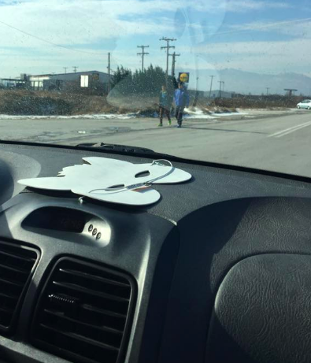

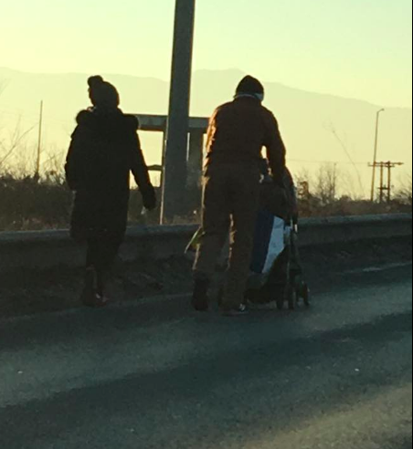

Photos by Kayra Martinez
### Volunteers needed in Filippiada

[Mobile Flüchtlingshilfe e\.V\. — Mobile Refugee Relief](https://www.facebook.com/MobileFluechtlingshilfe/) is looking for volunteers for its cultural centre/tea tent in Filippiada, preferably for the first two weeks of February, but also later\.
You can apply through this [form](http://goo.gl/forms/6FUY7w69wR) and by filling out this [doodle calendar](http://doodle.com/poll/5k2shd8qq35gp6sz) \.
You can also apply as a team leader, if you plan on staying for at least one month, are organised, reliable and experienced\. Registration needs to be done until the 28th of January\.

[Greecevol](http://greecevol.info/) lists other volunteering needs in Greece and in the rest of Europe\.

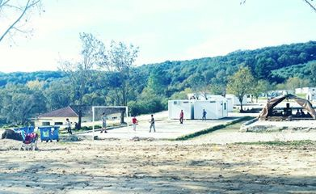

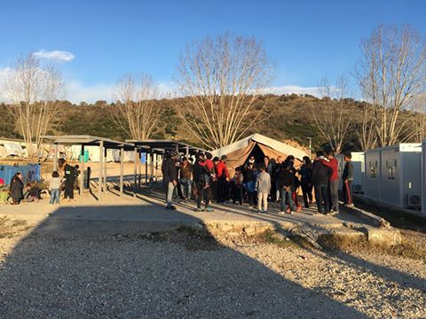

Photos by Mobile Flüchtlingshilfe e\.V\. — Mobile Refugee Relief
### Child friendly space back up and running in Ritsona

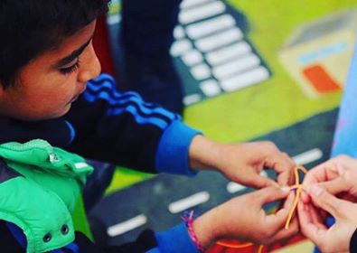

After a winter revamp the child friendly space in Ritsona camp in Greece is back up and running\. Operated by Lighthouse Relief with support from Help Refugees, it offers kids “a warm and safe environment” as well as “fun and stimulating activities”\.
#### Turkey
### Kapilar needs support

[Kapilar](https://www.facebook.com/izmirkapilar/) , an organisation working in Izmir, has been organising football matches for a group of Syrian teenagers, most of whom have been out of education for up to 5 years, and are particularly vulnerable to exploitation in textile sweatshops, factories and other labour\-intensive jobs\.

Their Sunday football matches have offered these teenagers a much needed opportunity to get out, socialise and exercise, as well as new and alternative moments for collective learning\.

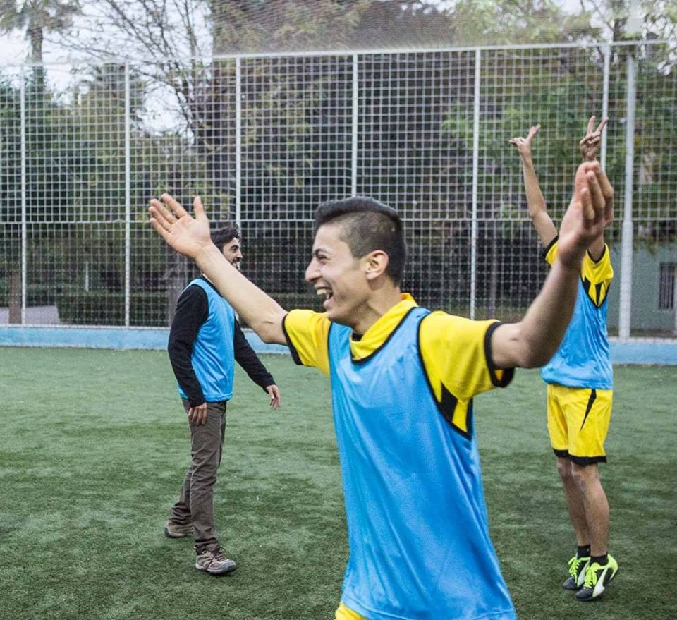

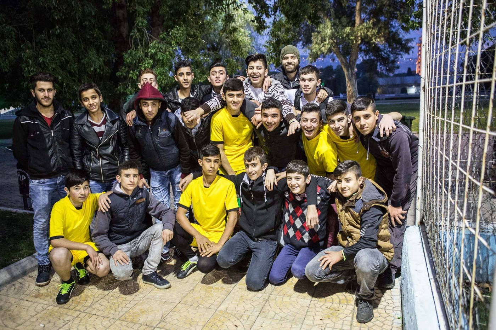

In order to carry on these football games, [Kapılar needs support](https://www.youcaring.com/kaplar-722264) , as it wants “ _to keep growing and ensure that our activities may continue in a healthy and sustainable manner_ ”\. In addition to the football games, Kapılar organises film screenings, food events, language classes and much more for refugees and the local community\.
#### Serbia

Living conditions are still extremely difficult for refugees sleeping rough in Belgrade, as these photos by “ [John Refugee](https://www.facebook.com/John-refugee-747163385440090/) ” show\. Refugees lack access to clean water and sanitary facilities, clothes, medicine and heating\.

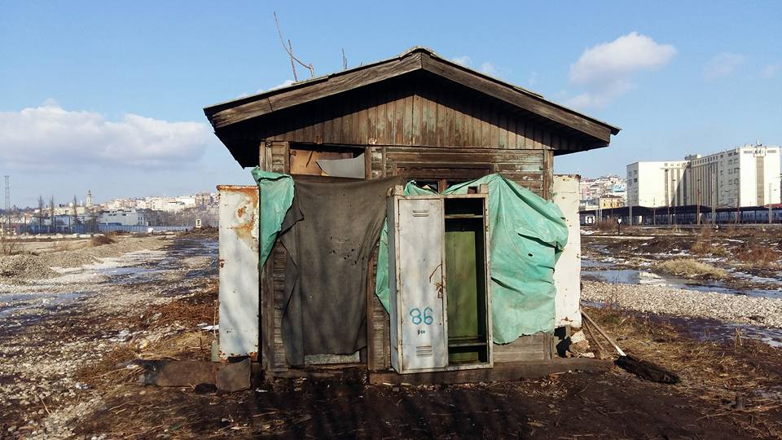

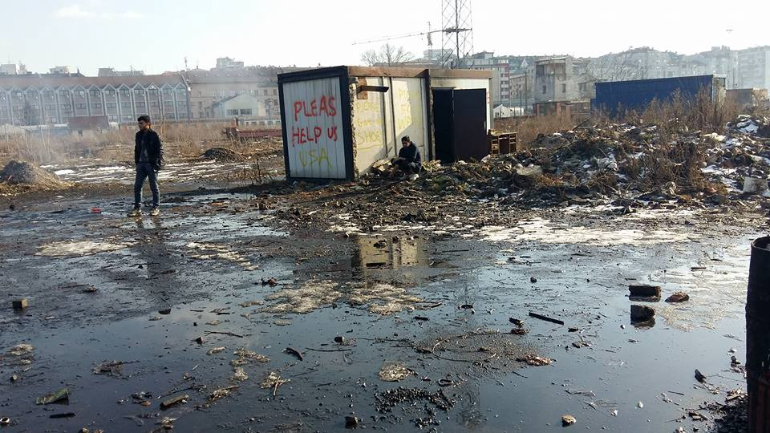

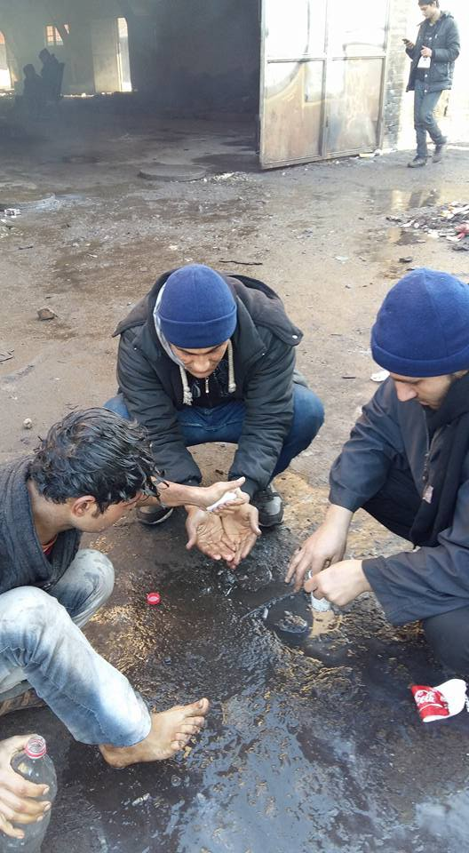

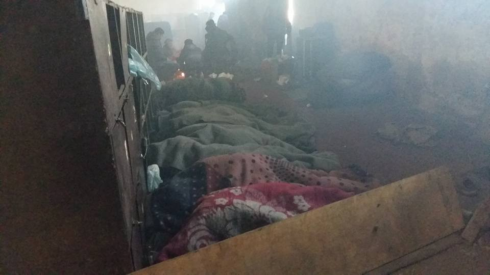

#### France
### Criminalisation of volunteers all over France

[Passeurs d’hospitalité](https://passeursdhospitalitesenglish.wordpress.com/2017/01/15/call-out-to-end-thesolidarity-offence-and-other-news/) reports that as trials multiply against people expressing their solidarity with refugees, a national appeal is circulating “ [To end the crime of solidarity](http://www.humanite.fr/manifeste-pour-en-finir-avec-le-delit-de-solidarite-630271) ”, signed on January 12th by 100 organizations and calling for a day of protests on the 9th of February\.

The appeal argues that a law that criminalizes “aiding the entry, stay and circulation of foreigners in an illegal situation”, is increasingly being used to prosecute volunteers\. Near the Italian border, 13 people are currently being prosecuted\. An [online petition](https://www.change.org/p/solidarit%C3%A9-avec-les-solidaires) and [online fund](https://www.helloasso.com/associations/association-pour-la-democratie-a-nice-adn/collectes/solidarite-avec-les-solidaires) is available to support these volunteers and pay their legal fees\.

Other laws that have nothing to do with immigration are also used to arrest volunteers, including laws that allow arrests on grounds of contempt, defamation and insults to public officials\. In Paris, Houssam El Assimi goes on trial on Tuesday 17 January\. The collective La Chapelle Debout [calls for people to come to support him and ask for his release](https://www.facebook.com/events/229081937546089/) on January 17th from 8:30 am at the Tribunal de Grande Instance, on the Île de la Cité\. La Chapelle Debout says he was arrested during a round\-up of refugees, during which he tried to inform them of their rights and was accused of “violence” and “rebellion” by police forces\.
### Baby products needed in Dunkirk

The [Dunkirk Refugee Children’s Centre](https://www.facebook.com/dunkirkrefugeechildrenscentre/?fref=nf) is calling on people coming to Dunkirk soon, to bring baby milk \(liquid\) ages 1–6 months, 6 months — 1 year as well as nappies sizes 5 and 6, babywipes\. Dummies, baby bottles and baby cups are also needed, as well as baby bottom cream, tissues, deodarants hats, gloves, socks underwear for the mums\.
#### Italy
### “Cold Welcome” in Como

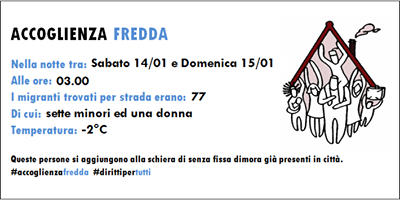

Image by Como senza frontera

In the town of Como at the border with Switzerland, refugees continue to sleep in the streets\. At 3:00 AM, 77 refugees were found sleeping at \-2°C, including seven minors and one woman\.
### Scuffles between refugees and police in Florence after fire destroys shelter

[Euronews](http://www.euronews.com/2017/01/14/clashes-between-police-and-refugees-in-florence?utm_source=dlvr.it&utm_medium=gplus) reports there have been scuffles between Somali refugees and police outside the office of regional authorities in Florence\. The refugees were demanding solutions after a fire on Thursday destroyed the shelter they were being housed in\. One man died in the blaze\.

_Converted [Medium Post](https://areyousyrious.medium.com/ays-digest-15-01-17-criminalisation-of-volunteers-all-over-france-53b23e1e7302) by [ZMediumToMarkdown](https://github.com/ZhgChgLi/ZMediumToMarkdown)._
