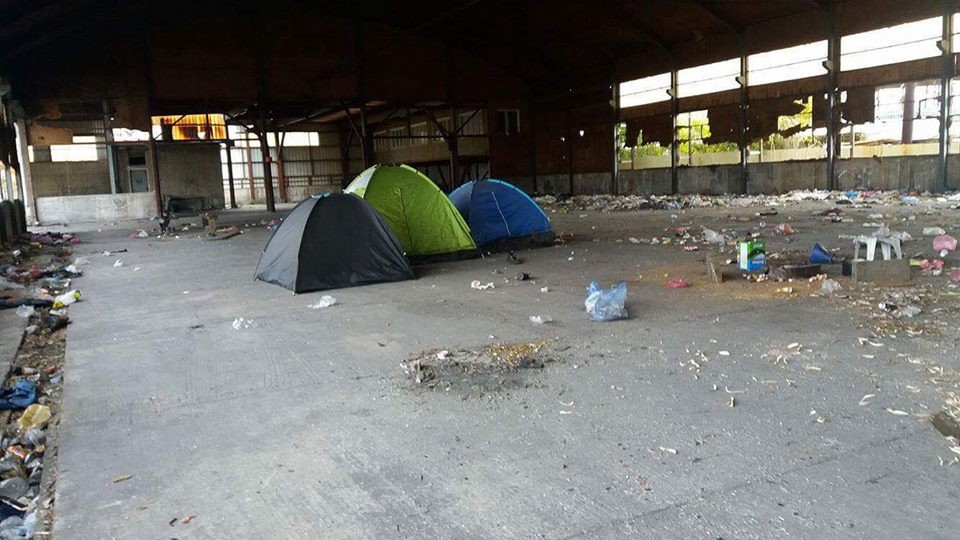
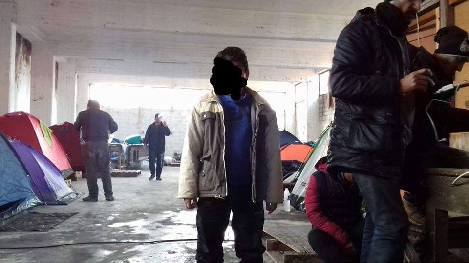
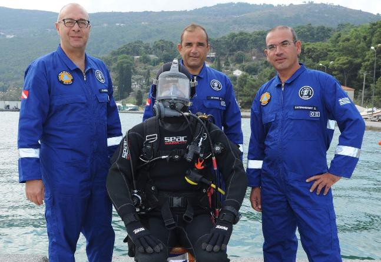
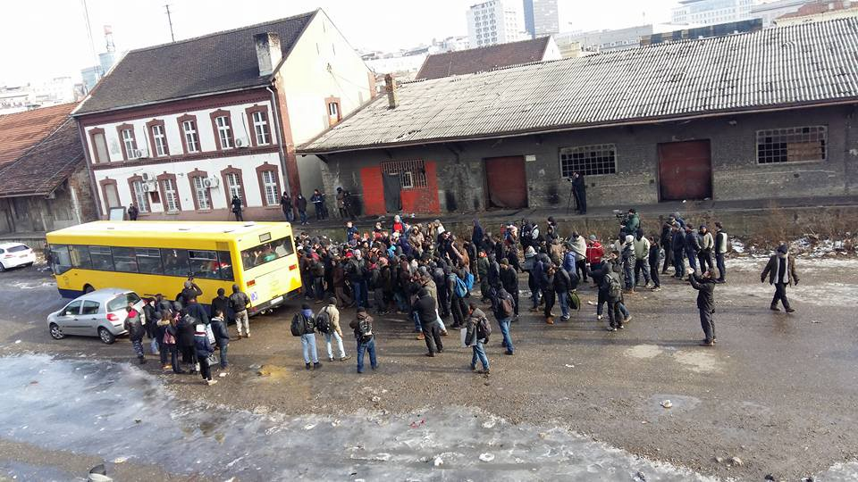
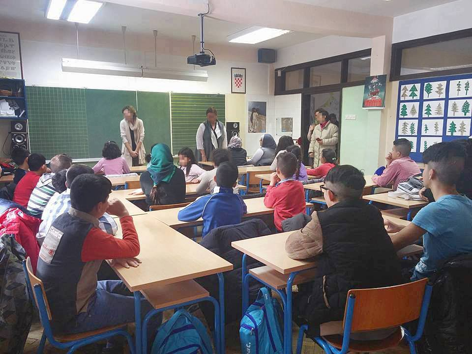
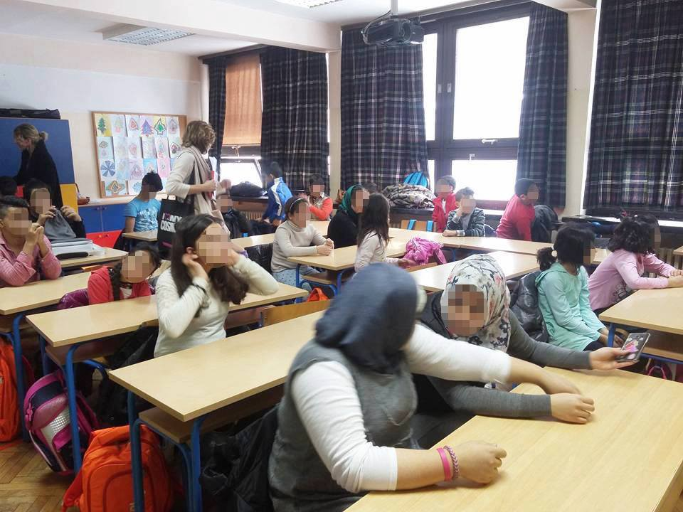

### AYS digest 16/01: No home, no peace, no rest

Are we?

_Aid needed in Lebanon for kidney dialysis patients / Spike in arrivals on Greek islands / Yiannis Mouzalas announced 8,000 new accommodation places for asylum seekers / Help needed in Patras / Transfers started from Belgrade to center of Obrenovac, people still in Krnjača / 28 children started school in Croatia today / New measures to be proposed in Italy — those seeking asylum will literally have to work for it / Carbon monoxide poisons a whole family inside La Linière camp in France / Call for action on the 17th of January in Paris_
#### Lebanon
### **Urgent help needed in Lebanon**

Salam LADC is sending out an urgent call for help\. Lebanon’s Ministry of Public Health has stopped providing financial aid for Syrian refugees who need kidney dialysis\. At least 27 people in the Bekaa Valley, who can barely afford the cab fare to the hospital, may die if they don’t receive treatment\.

If you are able to, please donate and share\.

#### Greece
### **130 people arrived to Greece from Turkey on Sunday**

It seems that the Aegean islands are witnessing a new spike in arrivals from Turkey\. Government data shows that 130 people arrived to the islands on Sunday\. There were 102 arrivals in Lesvos and 28 in Chios\.
### **Greece is struggling to make use of EU money for migrants and refugees**

With the numbers of migrants and refugees still increasing, the strain on Greek funds and bureaucracy is greater everyday\. As Kathimerini reports “Greece is struggling to make use of EU money for migrants and refugees after having absorbed just a fraction of the 509 million euros in funding for up to 2020\. So far, Athens has used about 2 percent of 294\.6 million euros from the EU’s Asylum, Migration and Integration Fund, and around 25 percent of 214\.8 million euros from the Internal Security Fund\.” Brussels is blaming Greece, but then again, when is that not the case\.
### **Minister Yiannis Mouzalas announced 8,000 new accommodation places for asylum seekers**

Even though funds are a mess, News that Moves has reported that during an interview with Flash 96\.0 radio, Greece’s Migration Minister Yiannis Mouzalas announced that 8,000 new accommodation places for asylum seekers were being created\. Mouzalas said asylum seekers will be housed in apartments around the country, and that these will be be administered by local municipalities\. A further 500 spots will be made available in other facilities\.
### **Help needed for 130 people stranded in cold abandoned factory in Patras**

Conditions in which 130 people live in an abandoned factory in Patras\. Photo: Rango Wagner

If only the aforementioned program could help 130 refugees living in abandoned factory buildings by Patras Port in western Greece, among them a ten year old boy with his dad\. There is no electricity and only one of the buildings has running water, cold, from a single tap\. We are not holding our breath waiting for the system to help them, so if you can, please support them this winter by donating via this [link](https://www.gofundme.com/helprefugeesinPatras) \.

Father and son\. Photo: Rango Wagner
### **Athens solidarity centre**

In Athens, people in need can head to the [Athens Solidarity Centre](http://www.solidaritynow.org/en/kentro-allileggiis-athinas/) \. Located at the Old Headquarters in Athens \(Frourarcheio\), the centre is dedicated to providing help to individuals who face urgent social and economic problems, regardless their age, nationality, religion and social or financial status\. The organisation offers psycho\-social and legal assistance, as well as vocational guidance\.

Several organisations and associations are operating inside the centre: [Solidarity Now](http://www.solidaritynow.org/en/) , [Praksis](http://www.praksis.gr/en/) , [Arsis](http://arsis.gr/en/) , [Network for Children’s Rights](http://ddp.gr/who-we-are/) and [Together for Children\.](http://mazigiatopaidi.gr/en/)

In September 2015, the [Greek Asylum Service](http://asylo.gov.gr/en/) began its operations at the centre, with a specific focus on vulnerable people\.

How to get assistance:

Call \+30 210 8220883 or email [athens@solidaritynow\.org](mailto:athens@solidaritynow.org) \. Address: [Domokou 2, Athens](https://www.google.gr/maps/place/Domokou+2,+Athina+104+40/data=!4m2!3m1!1s0x14a1bd2b60c1f0b3:0x2d3ec1b7ca954e3e?sa=X&ved=0ahUKEwiH9Pvco6jRAhVDWCwKHUIxDXYQ8gEIGTAA) \(opposite Larisa’s Railway Station\)
### **Greek\-English legal lexicon**

As News that Moves reports, “The non\-governmental organisation [Advocates Abroad](http://advocatesabroad.org/) has compiled and published a Greek\-English legal lexicon for migrants, asylum seekers, refugees, volunteers and attorneys\. The document contains a glossary of terms commonly used during the asylum process in Greece\.

The guide includes several translations of Greek asylum sample documents, health cards, decisions of inadmissibility, deportation decisions, and decisions on international protection\. The lexicon is available for download [here](https://drive.google.com/file/d/0B7m1mbz3TgLbSE5ndnRURy1oYVU/view) \.”
### **Emergency Response Centre International \(ERCI\) is looking for volunteers**

Those interested in volunteering at Elpida Home refugee camp “need to be able to take on camp shifts, assist, lead and suggest new activities for the resident refugees to thrive in, as well as to assist in vital services offered such as food and clothing distribution\. Volunteers should be able to commit for two weeks minimum, work 5 days a week from 12\.00 to 20\.30\.” If you feel you can contribute to the team at Elpida Home, please submit your application at: [www\.ercintl\.org/volunteer](http://www.ercintl.org/volunteer) and select “Thessaloniki, Camp Coordination & Logistics’’ as your preferred post\.
### **Support the Samos divers**

Samos divers, a non\-profit rescue organization, needs support\. If you can help, please turn to [this link](https://mydonate.bt.com/events/sda/371450) \.
#### Serbia
### **Transfers from Belgrade**

One bus\. Photo: Jan Refugee

Out of hundreds of people stranded in Belgrade, today some 50 were transferred to Krnjača center\. This was part of a plan to give them shelter at Obrenovac center in Serbia\. Krnjača is supposed to be a halfway house where people can receive care in a place with proper hygiene facilities\. Among other services, treatment for lice can be provided\. As reported from Belgrade, it is unclear when the people at Krnjača will be transferred onward\. Moreover, it is uncertain how many more will be able to come to Obrenovac and whether transfers will continue\. Today’s move was made possible through the efforts of international and domestic NGOs\.
#### Croatia

First day of school\. Photo: Are You Syrious
### **Knowledge is power\!**

Today is a big day for us\! At long last, 28 children with asylum seeker status started school in Zagreb\. The children, aged 7 to 15, will join their peers in regular classes but will also attend a specialized program to help them learn Croatian\. The children were very excited and happy and the team at the school is positive and ready to offer the children all their help\. This development is the result of long\-term efforts of AYS volunteers, who have been working in Porin reception center with the children along with other NGOs, and is also thanks to the support of the Islamic community in Zagreb\.

In September, at the beginning of the first semester 6 other children with asylum seeker status, as well as an additional 6 who have asylum, were successfully enrolled in school\. Now, on the first day of the second semester many more have joined them\. Furthermore, today 7 children with asylum began attending regular kindergarten\.

First day of school\. Photo: Are You Syrious

Unfortunately, education is another field where collaboration and involvement of the most important institution is missing\. There has been a lot of struggle throughout this attempt to enroll the children in school despite the fact that according to Croatian law, these children have the right to attend elementary and secondary school\. The Ministry of Education has so far not reacted in any way to this\.

“The struggle to have the older children included in high school education is still ahead of us,” the AYS children’s education coordinator said, adding, “but we hope for a quick and positive outcome\. Knowledge is power\.”
#### Slovenia
### **Filantropija needs volunteers for Slovenian language courses**

Filantropija is putting out a call for volunteers willing to provide help in teaching Slovenian language courses for refugees and asylum seekers\. Volunteers can help by teaching individual and/or group classes\. More info can be found [here](http://www.prostovoljstvo.org/za-prostovoljce/posredovalnica-prostovoljskih-del/#result_13311) \.
#### Italy
### **New legal measures to be proposed in Italy**

New measures proposed in Italy aim to divide those who are deemed illegal migrants from those who the state recognizes as refugees\. Among other points, those who arrive in Italy and apply for asylum will have to perform community service while waiting for an answer to their applications\. This and other immigration measures will be presented on Wednesday to Parliament by Interior Minister Marco Minniti\. Minniti stated that the new measures “will serve to ensure reception to those who have the title, being inflexible with those who are not qualified to stay in our country\.” The new rules will be joined by two legislative proposals\.

New CIEs \(centres for identification and expulsion\) will accommodate a maximum number of 100 people and will be located preferably close to airports\. Police will work inside these centres to carry out identification and deportation proceedings\. Inside there will supposedly be a “guarantor” who will verify that the rights of migrants are being respected\. Every region will have its own CIE, excluding Valle d’Aosta and Molise \(due to transport issues\) \.
### **How will the new system work?**

Two months after submitting an asylum request, migrants will be issued a document in which they are referred to as “sedicente” \(self\-styled\) \. The document will be enough to start working in socially useful jobs, a springboard for the acceptance of asylum requests\. It seems that the government will also make agreements with companies for internships that will be given to those migrants who have diplomas or special certifications\.

It seems that Italy is treading on a dangerous legal precedent where the right to asylum is given to those who are forced, among other things, to work for it\. Literally\. We would just like to repeat over and over again that no one is illegal and no amount of cynical measures can change this simple truth about the human condition\.

While conditions for those undergoing migration continue to deteriorate, for people already in Italy the days are far from bright\. As Melting Pot reports, following a death in the centre of Cona, lawyers and activists met and spoke to many asylum seekers being hosted in the former military base\. In light of the testimonies gathered, an urgent appeal was addressed to the European Court of Human Rights, which asked Italy for immediate clarification\.
### **European Court of Human Rights ruled that Italian state must provide information on lives of migrants in their reception centres**

Asgi, Giuristi Democratici, Melting Pot Europa, Campagna LasciateCIEntrare, Bassa Padovana Accoglie and Avvocato di Strada have stated that, since they presented an urgent appeal to the European Court of Human Rights on Wednesday, January 11th, the Court has ruled that the Italian State must provide information on:
- the nature of reception facilities
- inhumane conditions
- the presence of minors and the measures taken to ensure their protection
- any reason why minors were not included in appropriate facilities, as defined by national and international legislation\.

The migrants who signed the appeal are 3 minors and 1 adult\. On the 15th of January 2017, the Prefecture of Venice transferred the 3 minors to other centres, but the associations are still worried about the other minors present in Cona and about inhumane and appalling conditions at the centre\. These conditions include inadequate heating amidst harsh temperatures, a lack of proper hygiene facilities, overcrowding, and others\.
#### France
### **Tragedy hopefully avoided in La Linière camp**

The following story casts light on what a lack of proper housing can do and is doing all over Europe\.

As has been reported from the ground, a family living in a cottage in the migrant camp were transported to the regional hospital in Lille on Monday morning, around 9:30am, in serious condition\. The family, a couple and their two children, had been victims of carbon monoxide poisoning\. The four were in chalet 172, where they turned up the heat and were poisoned with carbon monoxide\. This outcome was likely due to the operation of the auxiliary heating, reinforced doubtless by the lack of ventilation of the shed\. With the cold, the family had stopped up the air inlets as much as possible\.

The father, mother and two children were taken to the CHRU in Lille, where they were placed in a hyperbaric chamber\.

Numerous first responders \(firefighters and police\) went to the camp of La Linière to check the condition of the other cottages and attempt to avoid new poisonings\. We wish the family a full and speedy recovery and desperately hope the authorities will recognize that people are not made to live in holes\.
### **Help 4 Refugee children needs help**

Photo: Help4Refugee Children

Help4Refugee Children working in Dunkirk camp is asking for support\. If you can help them continue their work with the little ones, please turn to [this link](http://www.gofundme.com/4refugeechildren) \.
### **Call for Action by “Paris d’Exil Association”**

“ _Mobilization on January 17th, in front of the Préfecture de Cité \(1:30pm\) after the trial of Houssam\._

_This week, two families living in the Paris region, awaiting the processing of their asylum claim, are about to be sent back to countries from where they will be sent directly “home”, where certain death is waiting for them\._

_We call on the media and reliable people from all sides to write to the police headquarters and to hold them accountable for these asylum claims which have been dashed off and rejected despite real threats to the lives of these adults and their children\. All have been assiduously learning French since September and are successfully integrating into French society\._

_Case 1: An Afghan family from the Hazara ethnic minority, persecuted by the Taliban, with three girls under the age of six who are regaining acceptance, livelihoods after terror and exile\. They have been attending school since September, which is banned for girls in Afghanistan\. On December 15th, the Dublin protocol summoned them to return to Norway, from where they will undoubtedly be sent directly back to Afghanistan\. Having refused to submit themselves to this decision, The Prefecture de Police of Cité requires their attendance at the “the office of removal”, on January 17, 2017 at 14:00 at the Prefecture de Police de Cité, from which they will be accompanied by there in detention\._

_Case 2: A political dissident family of a Middle Eastern dictatorship\. Parents of two children aged 2 and 5, dismissed in Denmark, have been given an access pass to return to this country on November the 29th, 2016 \(valid until 22 May\) \. On the 2nd of January 2017, they have been called to check in at the prefecture of Melun on January 31st with their luggage in order to be deported\!_

_Following the agreements signed between the EU and Afghanistan in October 2016, 80,000 Afghan nationals will be deported from Europe this year\._

_We must alert and mobilize ourselves by appearing at Place du Chatelet on 01/17/17 at 1\.30 pm to prevent this family from being forcibly deported and inevitably sent back to her executioners\!_

_We are organizing a happening and inviting MANY of you to join us all dressed in black, with a black umbrella if possible \(it may rain\) \. The most discreet depressing outfits are in order\. It’s time to get them out of the closets\! \!”_

Contact : parisdexil@gmail\.com

_Converted [Medium Post](https://areyousyrious.medium.com/ays-digest-16-01-no-home-no-peace-no-rest-18c6dcfde63e) by [ZMediumToMarkdown](https://github.com/ZhgChgLi/ZMediumToMarkdown)._
