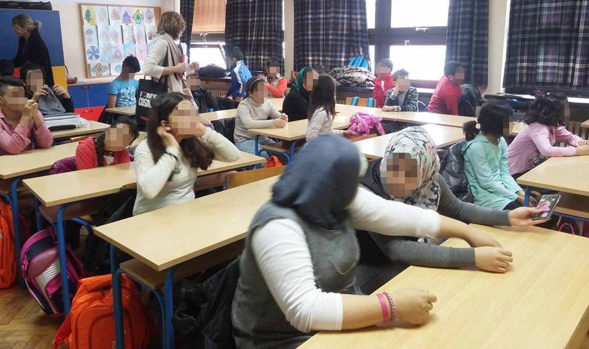

### Hrvatska “izgubila” djecu bez pratnje
#### Otvoreno pismo udruge Are You Syrious? Ministarstvu za demografiju, obitelj, mlade i socijalnu politiku, Pučkom pravobranitelju te Pravobraniteljici za djecu, povodom učestalih nestanaka maloljetnih izbjeglica iz dječjih domova u RH

Dio djece izbjeglica smještenih u Hrvatskoj ovog je tjedna krenuo u školu\. Drugi su završili u rukama krijumčara\. Foto: AYS

Poštovani,

Udruga Are You Syrious? ovim putem upozorava na potrebu **hitnog poboljšanja sustava skrbi nad maloljetnim izbjeglicama bez pratnje** smještenima u **centrima za pružanje socijalnih usluga** u zajednici poput **domova za odgoj djece** **i mladeži i odgojnih domova u Hrvatskoj\.**

Na ovu potrebu ukazuje i **zadnji slučaj** s kojime se naša organizacija susrela\. Radi se o slučaju trojice dječaka koji su bili smješteni u jednom od domova, a koji su dom samoinicijativno i potajno napustili 15\. siječnja 2016\., nakon što su tamo boravili gotovo mjesec dana\. Unutar tih mjesec dana nije im bio osiguran pristup prevoditelju te im, iako su iskazali namjeru za traženjem međunarodne zaštite, nije pokrenut postupak traženja azila — na taj način bila su im **uskraćena prava zajamčena međunarodnim i domaćim pravnim okvirom poput Konvencije o pravima djeteta, Zakona o međunarodnoj zaštiti i Zakona o strancima** \. Nisu bili u mogućnosti **komunicirati sa stručnim osobljem** te stoga **ni dobiti adekvatnu skrb** , iako su se pojedini djelatnici trudili da se malo bolje osjećaju\. **Nisu bili upisani u škole, niti na tečaj hrvatskoga jezika — prava koja su zajamčena spomenutim i drugim zakonima naše države\.** Bojali su se izići iz centra u kojemu su bili smješteni, jer su se nalazili na nepoznatom mjestu u potpuno nepoznatoj zemlji čiji jezik nisu poznavali\. Da im je na vrijeme pružena sva moguća kvalitetna podrška od strane sustava, možda se ne bi odlučili na riskiranje vlastitih života i sigurnosti odlazeći na put s krijumčarima ljudi\.

U ovom i sličnim slučajevima radi se o maloljetnicima u dobi od petnaest do osamnaest godina, no ponekad i o mlađoj djeci\. Kao organizacija koja pomaže izbjeglicama želimo ukazati na sljedeće:
1. U zadnjih nekoliko mjeseci u više navrata i iz više izvora dobivali smo informacije o **velikom broju maloljetnika** koji bježe s krijumčarima iz centara u koje su smješteni\. Tako smo dobili dojavu o **brojci od pedesetero maloljetnika koji su pobjegli iz samo jednog centra u Hrvatskoj** određenog za smještaj maloljetnika bez pratnje\. Jesu li ti navodi istiniti, nemoguće je utvrditi, jer **ne postoji sustav redovitog \(tjednog\) izvještavanja i na nacionalnoj razini objedinjenog evidentiranja o broju djece koja su smještena u te centre, koji su u nadležnosti Ministarstva za demografiju, obitelj, mlade i socijalnu politiku\.** U dopisu od 14\. prosinca 2016\. Kojega smo rimili od tog Ministarstva, navedeno je kako je do 31\.kolovoza 2016\. usluga smještaja za maloljetnike bez pratnje u domovima za odgoj djece i mladeži pružana **24\-ero djece** , dok je ta brojka u studenome 2016\. pala na **18\-ero djece\.** Ostaje **nejasno gdje je preostalih 6\-ero djece ili možda i više djece, jer iz dopisa ne možemo znati radi li se o istoj djeci koja su evidentirana u brojkama od kolovoza i studenog\. Pozivamo domove i Ministarstvo da informira javnost o točnom broju djece koja su nestala iz ovih centara od zatvaranja granica početkom ožujka 2016\.**
2. Nadalje, adekvatnost usluge koja se pruža djeci smještenoj u centrima postaje upitna s obzirom na to da **djeca nemaju pristup prevoditeljima, osim u rijetkim, formalno\-proceduralnim situacijama\.** Na taj način, **dijete često nije u mogućnosti komunicirati sa stručnjacima u centru** te **usluge** koje centri inače pružaju, poput **psihosocijalne podrške** , a koje su propisane Pravilnikom o minimalnim uvjetima pružatelja socijalnih usluga djetetu \(NN 40/2014 i 66/2015\) — djetetu bez pratnje koje ne govori hrvatski, a ponekad ni engleski jezik, ostaju **nedostupne\.**
3. Djeca bez pratnje smještena u navedenim centrima **nisu uključena u obrazovanje i nije im omogućen tečaj hrvatskoga jezika** , a uz pokoju iznimku, **niti drugi tipovi sadržaja\.** Time se u potpunosti **sprečavaju procesi društvene integracije i stvaraju uvjeti kojima se dijete na neki način potiče na bijeg s krijumčarima** \. Također, takav **nedostatak podrške negativno utječe na ovu djecu koja su u mnogim slučajevima imala negativna ili traumatična iskustva i u zemlji iz koje bježe, i u samoj situaciji izbjeglištva\.**

Podsjećamo da su Republika Hrvatska i njezine institucije kao članica EU i potpisnica Konvencije o pravima djeteta obvezne štititi prava djece, što uključuje i pružanje sigurnosti maloljetnim izbjeglicama bez pratnje\. Ovim putem stoga upozoravamo Ministarstvo za demografiju, obitelj, mlade i socijalnu politiku, Vladu Republike Hrvatske i cjelokupnu javnost na sljedeće **obveze i potrebe** :
1. Potrebno je **hitno osiguravanje usluga prevoditelja za djecu i maloljetnike bez pratnje smještenu u svim centrima za pružanje socijalnih usluga u Hrvatskoj, kako u procedurama poput traženja međunarodne zaštite, tako i u njihovoj svakodnevici\.** Za potonje svakako nije potrebno da su prevoditelji ujedno i službeni prevoditelji, već taj posao mogu obavljati i volonteri i zaposlenici koje organizacije civilnoga društva inače koriste u svojim aktivnostima\. Također, čak i onda kada država nije u mogućnosti pronaći službenog prevoditelja prilikom procedure traženja međunarodne zaštite, dužna je pronaći način da omogući djetetu pravodobno ostvarenje ovog prava\.
2. Potrebno je pružiti **adekvatnu i pravovremenu pravnu podršku,** na koju ova djeca imaju pravo te ubrzano pokretati procese **spajanja obitelji\.**
3. Potrebno je **hitno svu djecu uključiti u srednje škole i/ili pučka učilišta te im organizirati formalni tečaj hrvatskoga jezika u smislu pripremne nastave\.** Pritom je potrebno voditi računa o djetetovim dosadašnjim obrazovnim iskustvima i interesima\.
4. Potrebno je organizirati **aktivnosti za djecu unutar i izvan centara** , poput sudjelovanja djece u kreativnim radionicama, sportskim i kulturnim aktivnostima, kao jedan od vidova nužne psihosocijalne podrške i facilitacije procesa društvene integracije\.
5. Potrebno je **hitno ustanoviti nacionalnu koordinaciju ovih institucija te na tjednoj bazi transparentno objavljivati podatke o maloljetnicima bez pratnje koji se nalaze u svim centrima u Hrvatskoj\. Kao što smo spomenuli, koordinacija među ustanovama ne postoji, a podaci se ne objavljuju, čime se dobrobit, a u konačnici i sigurnost djece dovodi u pitanje\.**
6. Potrebno je **stvoriti uvjete za smještaj djece u alternativnu skrb i preispitati postojeću praksu smještanja djece izbjeglica bez pratnje u domove za odgoj djece i mladeži, odgojne domove i odgojne zavode kao mjeru, jer se time ona dodatno izoliraju, stigmatiziraju i kriminaliziraju** \.

Interpolova izvješća pokazuju kako je u Europskoj Uniji tijekom 2015\. \-te godine nestalo 10\.000 djece i maloljetnika\. Istodobno, prema službenim statistikama, mnogi recentni izvještaji međunarodnih organizacija poput UNHCR\-a, UNICEF\-a, IOM\-a, Human Rights Watch\-a, Agencije Europske Unije za ljudska prava \(FRA\) te drugih izvora pokazuju kako su upravo djeca i maloljetnici bez pratnje najranjivija skupina unutar tekuće krize izložena trgovini ljudima, organima, seksualnoj eksploataciji i silovanjima te drugim oblicima nasilja\. Stoga je dužnost svake države i svih njezinih institucija učiniti sve što je u njenoj moći kako bi zaštitila ova najranjivija bića\.

Lejla Juranić
Are You Syrious?
17\. siječnja 2017\.

_Converted [Medium Post](https://areyousyrious.medium.com/hrvatska-izgubila-djecu-bez-pratnje-747904498b0a) by [ZMediumToMarkdown](https://github.com/ZhgChgLi/ZMediumToMarkdown)._
