### AYS Daily News Digest 17/1: Massive negligence of minors and serious police abuse remain silently ignored
#### Accounts of police violence on borders surrounding Serbia pile up \| Unknown number of unaccompanied minors in Croatia got lost \|
New deaths of hypothermia Elliniko, neglect and despair of the refugees \| New fascist attack in a school in Piraeus \| France prepares for cold, police takes away warm covers of people \| At least 219 people died in the first 2 weeks of 2017 while trying to cross the Mediterranean

 \)](assets/38c0815bdec5/1*vAR6cAb6ERjOVslOUoquKQ.jpeg)

Young refugees in Belgrade, Serbia, 2017\. \(Photo: [John refugee](https://www.facebook.com/John-refugee-747163385440090/?hc_ref=PAGES_TIMELINE) \)
#### FEATURE
### Police violence

A number of accounts of police violence and abuse in the border areas of Serbia’s neighboring countries have been reaching us lately\. Although it has been a known subject for a while now, it was is the recent days that we received some disturbing documentation, photos and stories from people who have been beaten, abused and violated by the police officers of the border areas of Serbia, Hungary, Croatia and Macedonia\.
#### Rendőrség — Hungarian border

Hungarian official hostility towards the refugees is no novelty\. However, recent violent treatment reported by the refugees in the Horgos area points to a worrying practice and harsh reality threatening the refugees on their way to safety\. Following testimony is by one of the people who experienced this treatment\.

Original interview with the refugees in question was conducted on January 7 with a help of a translator\. Two people from the same group were interviewed at different sites and the facts of their stories matched, our sources say\.

January 5, 2017

> At night I made an attempt to cross the Hungarian border near the Horgos crossing\. 48 people left with me, but 9 of them got scared just before the border fence and decided to go back\. The rest of us succeeded and managed to get across the border onto the Hungarian side\. 

> We were walking through the forest about 15 kilometers north of the border when we heard cars coming and decided to hide\. 4 marked police cars arrived\. There were around 15 policemen with trained dogs, heat\-sensors and handguns\. They saw us in the light, rounded us up, and released dogs on us\. 

> Then, without asking any questions first, the police officers started kicking and beating us\. Afterwards they searched each of us, checking pockets and backpacks, destroying money and smartphones\. Money was shred up in front of our faces, smartphones smashed on the ground\. Policemen took out batteries and SIM cards from each phone and destroyed them separately\. 

> Then they collected all the warm clothing we had: jackets, gloves, hats, scarves, shoes and socks, leaving us only in light jumpers and trousers\. Every person who wore more than one pair of trousers was told to take them off\. 

> Meanwhile, one more police car came\. Newly arrived officers joined the rest\. They hit one of my friends with a stick, severely cutting his head\. Then they ordered all of us to sit in a line, with our legs spread, hands on our knees and bowed heads, and started pouring the water they had found in the bags on our heads and clothes\. 

> After that they ordered one man to stand up with his hands behind his back\. One of the police officers grabbed him by his collar, threw him on the ground and put a gun against his head\. When the victim started crying and begging for mercy the officer took his gun away while the other policeman put his leg on the man’s neck and held him down so others could kick him\. 

> Then everyone had the dogs released on them again\. When we were trying to back off to escape the dogs, police officers were on the other side of us, kicking us back towards the dogs\. This was repeated several times\. In the meantime, some policemen were drinking tea in the car observing and laughing at us\. 

> When the ‘game’ was over they put us in police cars and drove back to the Serbian border\. They set the air\-conditioning to maximum in order to lower the temperature\. We were brought back to the border where we were forced to read aloud the statement written in Urdu \(there were also versions in Pashto and Farsi\) saying that we crossed the border illegally and that we didn’t experience any verbal or physical violence from Hungarian side\. Those who didn’t read loud enough were yelled at and threatened\. While reading the statements, we were recorded by the officers\. 

> Afterwards, at around 8 in the morning, we were passed over to the Serbian side\. The Serbians received us and ordered us to go towards Horgos, but as we knew there’s no shelter in Horgos except for the unofficial camp in the transit zone, we decided to walk more than 20 kilometers to get back to Subotica\. Only some of us got their wet shoes or socks back so we took off some of the remaining clothes we had and wrapped them around our feet\. 

> The temperature was down to \-7 degrees at the time and it was snowing\. 

#### “Sigurnost i povjerenje” — Croatian border

Among the refugees staying out in the open in Belgrade there were many who told stories of violence by the Croatian police when they met them in the border areas with Serbia\. Those helping them have heard a great deal of vivid stories on how Croatian police returned a number of refugees who had reached Zagreb and other cities in Croatia, but were returned back to the fields close to the border with Serbia and directed to march through the fields into Serbia\. Others speak of being beaten up, pushed or kicked upon arrival to Croatia, without a chance to speak to their defense or even mention international protection\. Some were released from hospitals in Serbia with documented details in the release papers that speak to confirm their claims of previously being beaten up\.

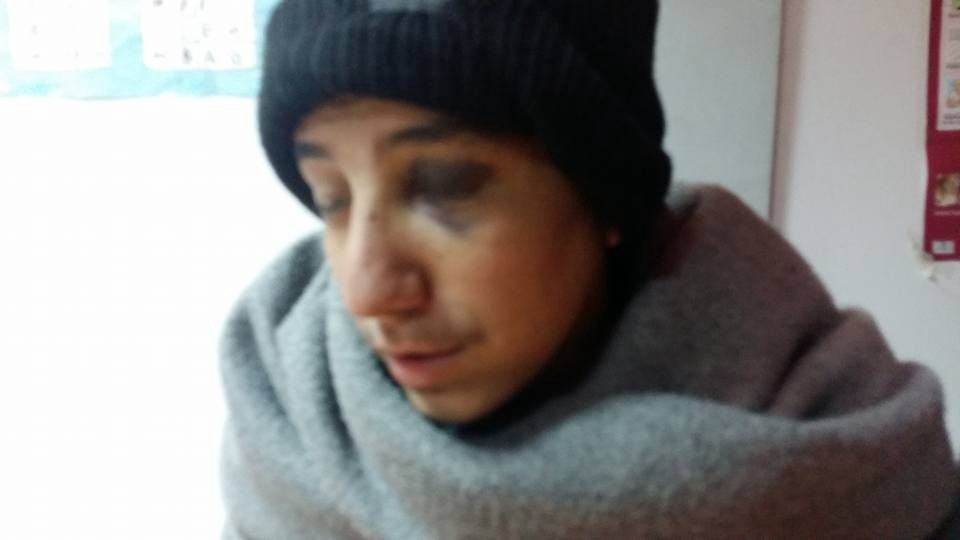

A 14 year old refugee after coming back from the Serbian\-Croatian border, where he was allegedly beaten up by the Croatian police \(Photo: Legis\)
#### Macedonia — Serbia

Already on December 28 2015 we [reported](https://www.facebook.com/areyousyrious/photos/pcb.565437213605166/565437070271847/?type=3) about the abuse in the border areas of Macedonia with Serbia, where those trying to leave Macedonia to pass through Serbia were not only facing criminal charges, but also suffered physical abuse\. Nowadays, between Macedonia and Serbia who share 283 km of border area, the practice continues and people are constantly being pushed back illegally from Serbia by their authorities in some of the 47 stations of border police in charge of the security of the Serbian state borders, consequently showing up in Macedonia, in Lojane in particular, where their stories are documented, injuries photographed and reports done by Legis are sent to the UNHCR and Ombudsman\.

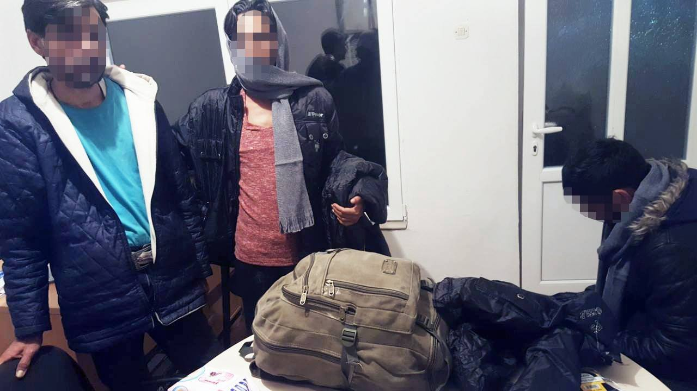

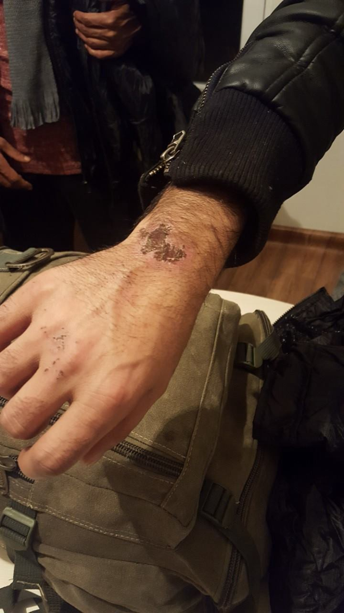

These young men were violently brought back from Serbia to Macedonia\. One of them shows the marks of the hand injuried he suffered from earlier police beatings\. \(Photo: Legis\)

Sources tell us that the Serbian police has a practice of illegally deporting refugees previously officially registred and lodged in one of the official camps accross the country\. Their cards received in the camp are being taken away from them and they are sent off to Macedonia without it, making it difficult to prove they were registered residents of one of the Serbian camps who got literally kicked out the camps and the country\. A call has been sent to all NGOs working with refugees in that area to take photos of the refugees’ cards because of the mentioned cases\.

This is a refugee boy who is staying in the outside makeshift camp in Belgrade who witnessed a number of beatings by the police, claiming that even previously Bulgarian police broke his arm\. This is one of the recent photos after encountering the border police\.
#### CROATIA
### Croatia keeps ‘losing’ unaccompanied minors

> How is it possible that dozens of refugee minors disappear from child care centres and everyone keeps quiet about it? 

Are You Syrious has sent an [open letter](https://medium.com/@AreYouSyrious/hrvatska-izgubila-djecu-bez-pratnje-747904498b0a#.6aiivotp6) to the responsible Ministries and child care institutions in Croatia, urging them to immediately start working on providing a better care system for unaccompanied refugee minors in Croatia, who are places in social care centres like child care facilities and special educational centres in the country\.

> This is a direct reaction to the last case our NGO came accross\. Three boys who were staying in one of these child care facilities have left on January 15, after having spent almost a month there\. Withing that time they had no translator to help them and, although they expressed the wish to ask for international protection, no process of demanding asylum was started on their behalf\. This way, the rights that are guaranteed by the international and national law \(Convention on the Rights of the Child, Law on Foreigners and International Protection as well as Croatian Foreigners Act\)were denied to them\. They were not able to communicate to the staff and therefore couldn’t get adequate care, though some of the staff tried to make things as pleasant as they could on their own\. They were not enrolled in school, nor did they have any language classes — these are just some of the rights guaranteed by the law in Croatia\. They were afraid to leave the centre where they stayed because they were in a foreign place in a foreign land whose language they did not know\. If they had been given proper care and support in time, perhaps they would not make a decision to risk their lives and safety by setting off on a journey with smugglers\. 

> This one and similar cases involve minors in the age of 15 to 18, sometimes even younger children\. 

It goes on listing several important things concerning minors in Croatia:
- we continually receive information of a large numeber of minors who flee the child care centres \(a number of 50 minors leaving a single centre was mentioned\) — these information are impossible to check and confirm since there is no system of regular evidention on weekly basis, that would inform about the number of minors in these centres, so we insist on an official document
- considering the fact that the children have no available translators, the adequacy of these centres is put into question because children have no way of using the services these centres are supposed to provide, such as psychological and social care
- children are not taking part in any educational activities, formal or informal and they are not learning the language\. Social integration is therefore impossible\. This creates ideal conditions to entice these young people to consider leaving with smugglers\.

Concluding the letter, **AYS demands that everyone is provided a translator; adequate legal aid be given in time so that family reunification could be sped up; immediate inclusion in education processes and provided language classes; extra activities inside and outside of the centres; establishing national coordination among the responsible institutions and transparent information flow to the public; providing appropriate accommodation for the minors, one of the most vulnerable refugee groups**
#### CROATIA
#### \[Disclaimer\] ”We have received the wrong refugees”

The president of Croatia, mrs\. Kolinda Grabar Kitarović recently made several statements in her interview with an Austrian newspaper regarding the refugees, among others that “those who have made their way to Europe were ‘men able to fight’ in the wars there, that she fears for women’s rights because of the amount of Muslims coming to Europe \(stating Afghan men as an example of someone whose respect towards women is an implausible scenario\) and that each EU state needs to decide for itself on taking in refugees\. Considering the fact that AYS is a Croatian based NGO, we must say these are statements from an individual politician — a completely misinformed one, as it reads from the text — and not from someone who represents the people‘s opinions\. We choose to believe if welcoming and providing aid to a human in need were put into question, a different statement would’ve been given by the collective action\. Engagements of a large number of volunteers, organisations and individuals and efforts to persuade institutions to do their job demonstrate a different spirit from the one that the president Grabar Kitarović would like to plant\. We hope \(and strive\) that these thoughts and ideas remain only in the pages of an outdated newspaper\.

Centre for Peace Studies and the Initiative Welcome protested in front of the Croatian Parliament to warn of the new changes in the Aliens Act, that characterize helping foreigners during their stay, transit and illegal border crossing as a criminal offense\. \(Photo: CMS\)
#### GREECE

■■■■■■■■■■■■■■ 
> **[MSF Sea](https://twitter.com/MSF_Sea) @ Twitter Says:** 

> > A 30 year old guy died of hypothermia between #Greece &amp; #Turkey. People continue to die at the European borders in 2017. https://t.co/cZe4dtdREq 

> **Tweeted at [2017-01-17 10:39:51](https://twitter.com/msf_sea/status/821306030772678656).** 

■■■■■■■■■■■■■■ 

### Elliniko — an illustration of the abandonment, despair and neglect of Refugees

Some 1000 people live in 3 makeshift camps at the former airport and abandoned stadiums, in the Elliniko area, a spot run by the Ministry\. Some refugees shared with us their reality and spoke of the life conditions they have been enduring for a lot of months now…

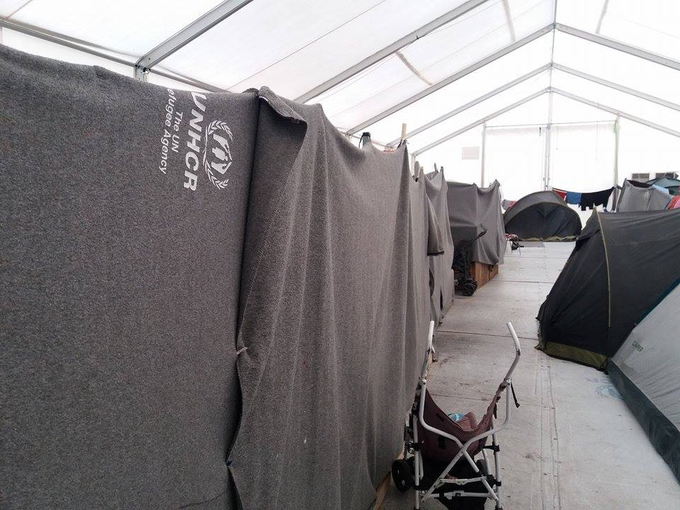

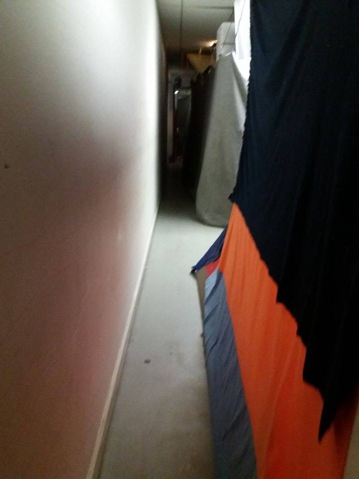

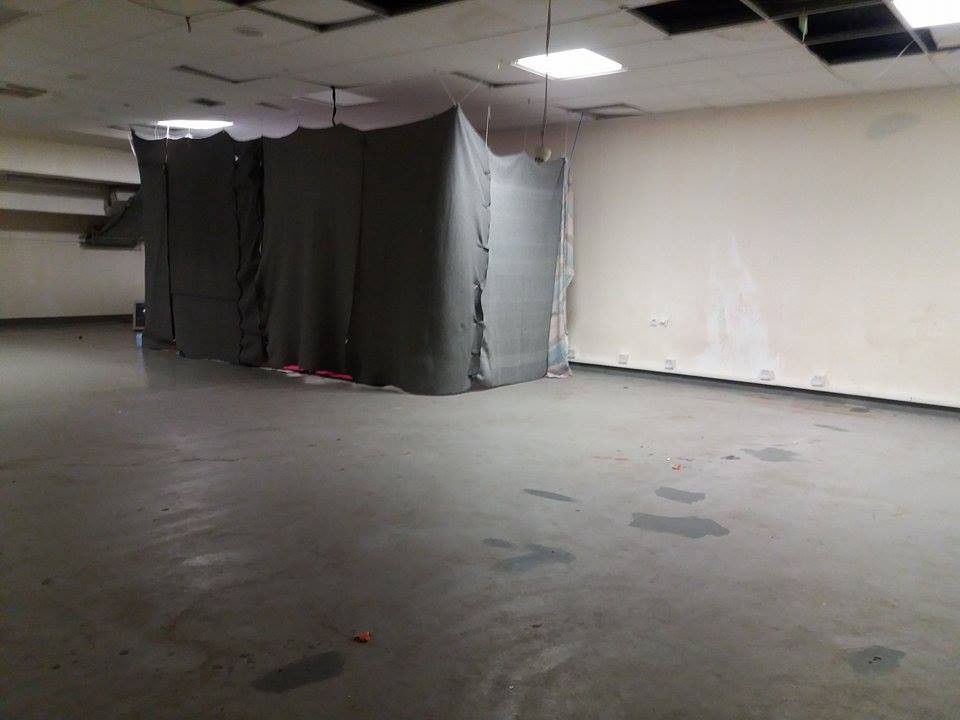

Photo: AYS

There are no volunteers present and no visits are allowed either — each visitor must be approved by the Ministry, similar to the procedures for visits to prisons\.

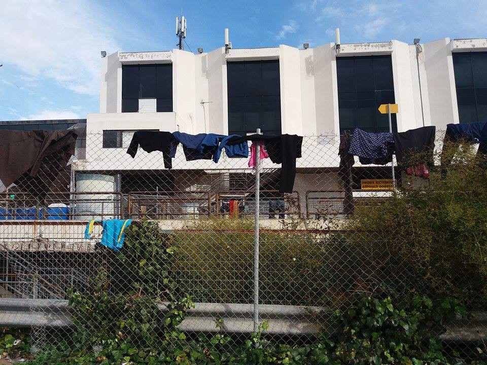

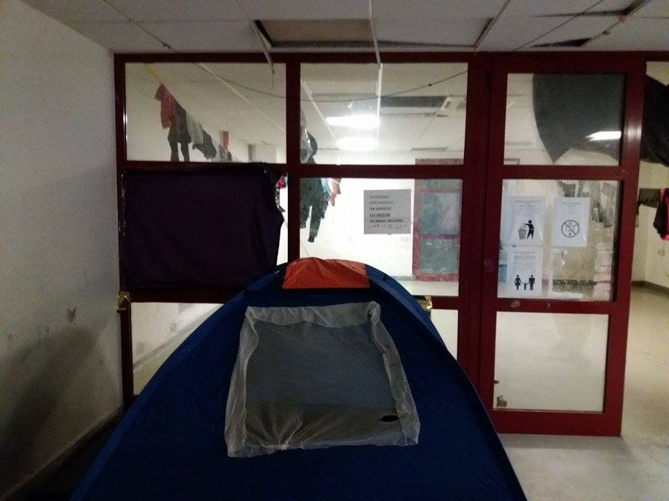

Photo: AYS

People staying there can leave the premises and need to take the bus to get to the supermarket though a warehouse that most likely has everything they might need is in their reach, but they are not allowed to go there\. So, if these people need something from a warehouse with donations, they have to go to the city centre and get it from another warehouse, about an hour ride away\.

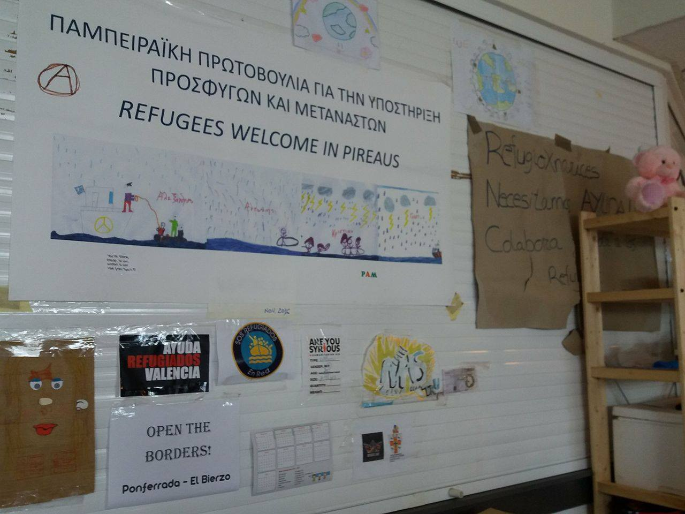

Although this warehouse with plenty of clothes and other things prepared and shipped precisely for these people is just a walk away, it remains out of reach for the Elliniko residents… \(Photo: AYS\)

There are a lot of children and babies in the camp\. A small family from Afghanistan got their first child 6 months ago, while staying in the camp\. Until a month ago these people stayed in a small tent\. Now they live in a basement of one of the four stadiums that provides more warmth than the tent, but is still not an appropriate place to raise a newborn baby\.

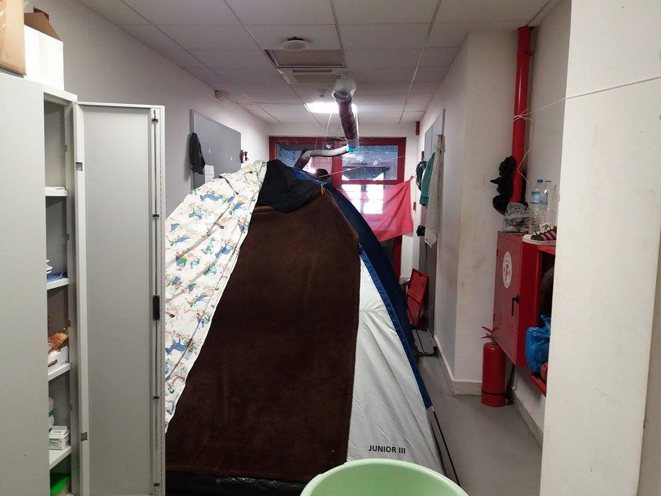

> Many tensions, fears, dreams and unimaginable life stories lie in the abandoned site and in the hollow stadium areas\. 

All of these people hope the camp will be closed and people moved to a better place\. Either way, they wish someone would help them move from there and ultimately they hope to leave and continue their life journey to a safe place\.

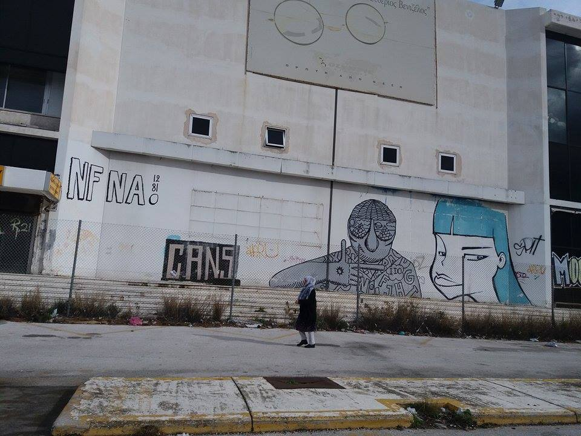

### Attack at the teachers, parents and children

A group identified as the members of the Golden Dawn invaded the 1st primary school in Perama, Piraeus, with another 40 people and hit teachers and parents while police was watching at Neo Ikonio\. Perama\. The reason was that the school accepted as students refugee children from Schisto camp, which is near the area\.
#### Fashion workshop for children at Khora, Athens

A group of volunteers are organizing a [fashion workshop](https://www.facebook.com/events/1142237975846111/?acontext=%7B%22source%22%3A4%2C%22action_history%22%3A%22%5B%7B%5C%22surface%5C%22%3A%5C%22group%5C%22%2C%5C%22mechanism%5C%22%3A%5C%22surface%5C%22%2C%5C%22extra_data%5C%22%3A%5B%5D%7D%5D%22%2C%22has_source%22%3Atrue%7D&source=4&action_history=%5B%7B%22surface%22%3A%22group%22%2C%22mechanism%22%3A%22surface%22%2C%22extra_data%22%3A%5B%5D%7D%5D&has_source=1) for kids at Khora community center in Exarchia, Athens\. 
Together with the kids, they will create and sew clothes based on the kids designs and wishes\. The idea is to empower the children and playing around with the idea of recycling and craft\. The workshop will take place from Monday 23rd to Friday 27th of January in the afternoons from 15\.00 until 18\.00\.Kids are welcome from the age of 8\.
#### Athens — supplies needed at the [Amurtel Greece for Refugee Mothers and Babies](https://www.facebook.com/AmurtelHellasforRefugeeMothersandBabies/?fref=nf)

> To keep our centre going, here is a list of supplies we still mostly need:
 

> \- bras
 

> \- diapers
 

> \- baby wipes
 

> \- baby blankets
 

> \- baby outdoor clothes 
 

> \- women’s sanitary towels
 

> \- hygiene packs for babies
 

> \- beauty packs for mothers 

\* \* \*

The last 18 refugees who have officially been registered as residents at the Vasilika Camp are now staying elsewhere and the camp has been emptied yesterday\. Reportedly, UNHCR said that they will take some people from the islands to Vasilika\. It is one of the camps that has been spoken about as a destination for future probable shift of island residents to several mainland camps in Greece\.

UNHCR has issued their [Weekly report](http://data.unhcr.org/mediterranean/download.php?id=2339) for the week January 2 to 8\.
#### SEA

219 people died crossing the Mediterranean in the first 2 weeks of 2017, while in total 2,876 refugees entered Europe by sea in the same period, IOM [reports](https://www.iom.int/news/mediterranean-migrant-arrivals-reach-2876-deaths-sea-219?utm_source=newsletter&utm_campaign=MediaBriefing1172017&utm_medium=email&utm_content=Mediterranean+Migrant+Arrivals+Reach+2%2C876%3B+Deaths+at+Sea+219) \.
Despite the mid\-winter weather making sea crossings seriously dangerous, the beginning of 2017 has brought [no sign of decrease](http://www.aljazeera.com/news/2017/01/180-missing-people-presumed-dead-shipwreck-170117092311329.html) in attempts to cross\.

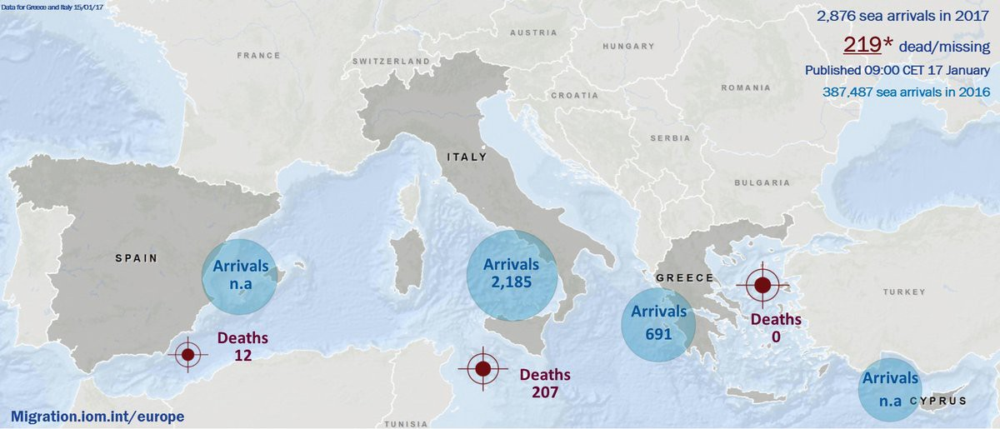

Source: IOM
#### FRANCE
#### Paris — Sleeping rough on \-7? Call 115

Expecting the announced extremely low temperatures, the French have launched ‘Operation Big Cold’ and said they’ll house everyone\- French homeless and migrants\- throughout the cold front, Paris based volunteers report\. They also mention the constant obstructing of their aid providing by the French police, although [they’ve been complaining](http://l.facebook.com/l.php?u=http%3A%2F%2Fpolice.unsa.org%2FIMG%2Fpdf%2F2017-01-12_compresse_violences_imaginaires_associations.pdf&h=ATOUmzzcENzHLozdFY7ZvgqK6Qg0_tLqC43VVGgY4fSbZZBh3cbrZLl4oA03bn2S7Y84e16tjCpCpgqCqC8jkemTyRxF921PZu3i0L8zDrblmd8fdK-T2mbwfvXsXd7WTls) about the accusations made by a number of NGOs about the police violence\.

 can so that we can purchase waterproof Bivvy bags and keep up with the French authorities’ destruction \(Photo: [Paris Refugee Ground Support](https://www.facebook.com/PRGS.team/?hc_ref=PAGES_TIMELINE) \)](assets/38c0815bdec5/1*N8a-7nLeGv4kPp2LfBjm0w.jpeg)

The police had taken all of the bedding \(provided by us and other aid groups\) from a slightly sheltered sleeping area and put it out in rain…Please [give what you](http://www.gofundme.com/prgsdonate) can so that we can purchase waterproof Bivvy bags and keep up with the French authorities’ destruction \(Photo: [Paris Refugee Ground Support](https://www.facebook.com/PRGS.team/?hc_ref=PAGES_TIMELINE) \)

Care4Calais is still caring for Calais\. Here’s [why](https://www.facebook.com/care4calais/posts/1412384898794463:0?hc_location=ufi) and how to [help](http://Care4Calais.org) \.
#### Belgians donate to UNHCR

The Government of Belgium has [made a donation](http://allafrica.com/stories/201701170080.html) of US$3,184,713 to support UNHCR‘s response to South Sudanese refugees fleeing to Uganda and the Democratic Republic of Congo\. We hope the means reach those who need it most in the countries whose refugees increasingly reach to Europe for safety\.
#### What to expect if you are an applicant for internetional in an EU Member State?

According to the law of the EU from the moment that a person has expressed wish to apply for international protection to the national authorities of an EU Member State, they are entitled to the certain rights, irrespective of the country in which your asylum application will be processed\. These can be found [here](https://www.easo.europa.eu/rights-and-obligations-context-reception) \.

_Converted [Medium Post](https://areyousyrious.medium.com/ays-daily-news-digest-17-1-massive-negligence-of-minors-and-serious-police-abuse-remain-silently-38c0815bdec5) by [ZMediumToMarkdown](https://github.com/ZhgChgLi/ZMediumToMarkdown)._
