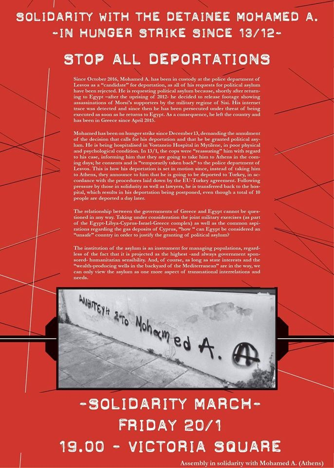
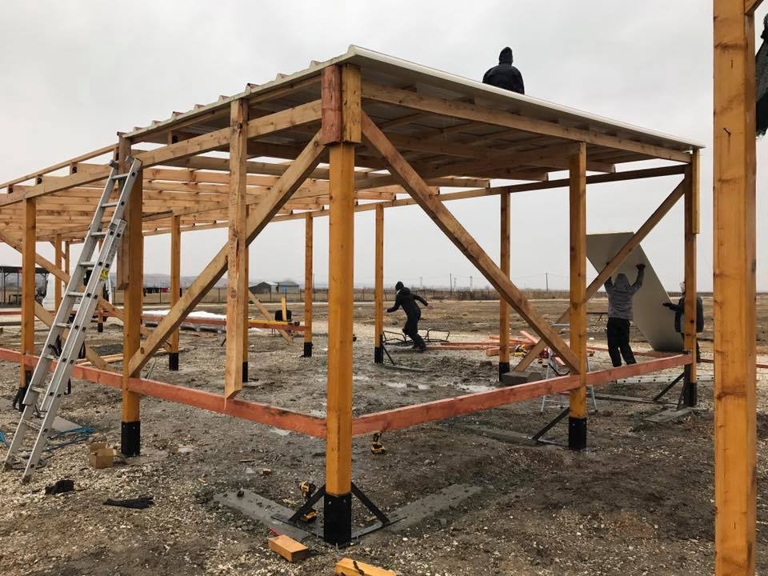

### AYS Daily Digest 19/1 — Calls for help and solidarity all over Europe

_UNHCR has limited access to Syrian refugees in Turkey / Call for solidarity march in Athens / Campaign urging protection of children refugees / Help needed for the upcoming winter conditions in Greece / Emergency center in Obrenovac near Belgrade now full / Austrian minister calls for strengthening border controls / Criminalization of solidarity at the border between France and Italy_

Morning at the Belgrade bus station, the temperature was around \-1º c and it was snowing\. Photo credit: NuuNoo Felicio
#### TURKEY
### UNHCR has limited access to Syrian refugees in Turkey

Despite the EU leaders calling UNHCR a “ [key actor in the resettlement process](http://europa.eu/rapid/press-release_MEMO-16-1221_en.htm) ” of refugees as part of the EU\-Turkey deal, a recent [letter from a UNHCR representative in Athens](http://statewatch.org/news/2017/jan/unhcr-letter-access-syrians-returned-turkey-to-greece-23-12-16.pdf) \(copy published by the NGO Statewatch\) shows that monitoring the condition of refugees and their rights has been limited\. It states that the organisation hasn’t been able to regularly access Turkey’s refugee camps\. It has also been unable to monitor whether refugees sent back from Greece are given adequate legal protection, since the authorities don’t provide that information, as Euractiv [reports](http://www.euractiv.com/section/global-europe/news/turkey-blocks-unhcr-access-to-syrian-refugees/) \.

In addition to the lack of information about the legal status and location of refugees readmitted from Greece, other administrative difficulties addressed include the current requirement that UNHCR staff members apply for accreditation five days in advance in order to visit camps\. This regulation “does not allow for timely monitoring of some individual cases,” the official wrote\. UNHCR staff were only approved in twelve of the sixteen instances that they requested access to the Duzici centre, a camp for Syrians coming from Greece in southern Turkey\.
#### GREECE
### **Call for solidarity march — Athens 20/1 at 19h** Victoria Square

**NoBorders** network calls for a solidarity march to grant political asylum to Mohamed A\.

> „Since October 2016, Mohamed A, has been in custody at the police department in Lesvos as a „candidate“ for deportation, as all of his requests for political asylum have been rejected\. He is requesting political asylum because, shortly after returning to Egypt — after the uprising of 2012 — he decided to release footage showing assassinations of Morsi’s supporters by the military regime of Sisi\. His internet trace was detected and since then he has been persecuted under threat of being executed as soon as he returns to Egypt\. As a consequence, he left the country and has been in Greece since April 2015\.“ 

\#FreeMohamedA
### “Mention the unmentioned” urges ministers to take action for refugee children

A campaign has launch across Europe urging authorities to take sufficient measures to ensure the protection of children refugees, who constituted up to 40% of the inhabitants of refugee camps in Greece in 2016\. 10,000 of these children have gone missing, writes Help Refugees\.

> “Left to their own devices, children missing in migration usually end up on the streets, left to face homelessness, hunger, sexual exploitation and other risks that no child should ever experience\. Creating trauma that is negative for both their mental and physical health\. They often rely on ruthless smugglers in an attempt to reach family or place of relative safety\.” 

Call on the representatives of authorities to acknowledge these children and read their stories [here](http://www.mentiontheunmentioned.eu) \.

> We will not stand by while these children are put in danger, join us in creating change and \#mentiontheunmentioned — _writes Help Refugees_ 

### Update from **Nea Kavala Refuge Camp, Kilkis**

[**The Timber Project**](https://www.facebook.com/thetimberproject.org/) is back on track and working hard on building a school at the Nea Kavala Refugee Camp\.

photos by The Timber Project

[**We Are Here** — Community Centre](https://www.facebook.com/WeAreHereCentre/) thanked both The Timber Project and Help Refugees in an update on what has been going on recently in Nea Kavala\. You can [read it in full here](https://www.facebook.com/WeAreHereCentre/posts/1934562610098668?hc_location=ufi) \.

Project [**Hope 4 Kids**](https://www.facebook.com/projecthope4kids) , a nonprofit helping to gather and distribute aid to displaced populations in Greece, is reporting about **Filippiada camp,** where people are in desperate need of warm clothes\.

> _“We are excited to announce that we are running a “gloves & new socks drive”_ 
 

> _Please note a few important details:_ 
 

> \- gloves and mittens do not have to be new but can be gently used, however we ask that they be in great condition with no rips or tears, etc\.
 

> \-socks need to be NEW
 

> \-we are not collecting any other warm winter items at this time — just gloves and socks
 

> \-we are collecting all sizes of gloves and socks
 

> \-because we would like to get items to the individuals in camp ASAP we will be collecting gloves and socks for 2 weeks and will ship items at that point\. \.
 

> \-if you want to drop items off in Salt Lake or Utah County please DM us for our address
 

> \-you can purchase items on Amazon and ship them to us here in Utah\. Again please DM us for address\. \.
 

> \-if you are outside of the U\.S\. and would like to ship items directly to us at Camp Filippiada, please DM us for address\. \.
 

> 
 

> _Please let us know if you have any additional questions\._ 
 

> _And thank you in advance for your cooperation as we work to warm the hands and toes and most importantly hearts of those in our camp\._ 

There were **20** new arrivals on **Chios** today\.
#### SERBIA
### Emergency centre at Obrenovac now full

> „Serbia will not expand the accommodation capacities for migrants, because the existing centers meet all their requirements and needs“ _the Serbian State Secretary at the Ministry of Labor, Employment, and Social Issues Nenad Ivanišević [stated](http://www.novosti.rs/vesti/naslovna/drustvo/aktuelno.290.html:645349-Ivanisevic-Srbija-nece-prosiriti-smestajne-kapacitete-za-migrante) today\._ 

[According to Ivanišević,](http://www.novosti.rs/vesti/naslovna/drustvo/aktuelno.290.html:645349-Ivanisevic-Srbija-nece-prosiriti-smestajne-kapacitete-za-migrante) if “a thousand or two thousand migrants made a camp in front of the Victoria Station in London, they would have used force and dispersed them from there long ago,” while Serbia would not use force against these people, nor ever will\. He added that he was “proud of how the country reacted and helped migrants even in the barracks in Belgrade\.”

Given that people are still sleeping rough on the streets of Belgrade with temperatures getting dangerously low again, the situation cannot be described as satisfactory\. At the Obrenovac barracks, where a small part of the refugees left outside of camps were transferred yesterday, 225 places have been filled\. Teams of journalists cannot enter the barracks without a permission from the Ministry of Defense, a process which takes days\.

Local N1 station [talked to](http://rs.n1info.com/a222157/Vesti/Vesti/Migranti-u-Kasarni-u-Obrenovcu.html) three young Pakistanis after finding out there is no more room in the barracks\. The police administration first sent them to Krnjača shelter, from where they were, again due to overcrowded capacities, sent to Obrenovac\. They had just enough money for a taxi back to the center of Belgrade\. Those who had a bit more luck in Obrenovac got a place to rest and some new clothes, but were not really protected from the winter temperatures\.

“The conditions are good, but we were cold\. We got one blanket and it’s not enough\. There are about 40 of us in one room and we do not have showers\. The food is also a problem,” one Afghan told them\. He added that there is running water, but only cold\. Also, there is electricity, but no heating\.

The Refugee Commission says they are working on constantly improving the conditions in the barracks\.

“Obrenovac is under renovation and there will be more room, but there is room\. There’s room in Preševo, in Divljana, in Pirot\. So it isn’t true that there is no room” said Ivan Mišković from the Refugee Commission\. Further strategy, according to the Commission, will be attempting to redirect refugees from Belgrade to camps in the south of the country, although they admit that this will be a difficult task\.
#### HUNGARY
### Solidarity in practice

[**MigSzol Szeged**](http://migszolszeged.kinja.com/) writes:

> „Yesterday evening we did the shopping from the food coupons donated earlier by Hungarian pensioners\. We bought food which is cheap, substantial and healthy, yet ready to eat or can be cooked on a campfire\. Along with another batch of firewood offered by a friend in Szeged, the colleagues at SOS Children’s Village delivered to the people waiting in front of the Röszke and Tompa transit zones\.“ 

Photos by MigSzol Szeged
#### GERMANY

The Foreign Ministry reported that in 2016, roughly 73,000 visas were granted to ensure family reunification for people from Syria or Iraq who have been granted asylum or subsidiary protection, [says](http://m.dw.com/en/many-more-family-members-join-refugees-in-germany/a-37186133) DW\.

Although that is three times as many as in the previous year, the numbers are far below what many Germans expected, [says](http://m.dw.com/en/many-more-family-members-join-refugees-in-germany/a-37186133) DW\. In 2016, parliament member Christian von Stetten said he expected 1\.1 million people to join family members who had been granted asylum\. Most applications for asylum came from Syrians \(36,9%\), Afghans \(17,6%\) and Iraqis \(13,3%\) \.

Even as the number of actual arriving refugees declined, **more than 900 attacks on refugee centers** were recorded in Germany in 2016, out of which 857 were suspect to have had **far\-right motives** \.
#### AUSTRIA
### Minister calls for strengthening border controls

With special attention to border with Slovakia, Austrian Defense Minister Hans\-Peter Doskozil has called for new measures to strengthen the country’s borders and keep refugees out\. Doskozil said that 282 asylum seekers who were caught this year trying to cross into Tyrol state were sent back to Italy\. Speaking alongside Interior Minister Wolfgang Sobotka, he noted that many of the migrants are entering Austria by train\. Both officials called for stricter controls on rail routes along the border\. They told the Austrian _Kurier_ that one hundred soldiers could be deployed to help with this process, DW [reports](http://m.dw.com/en/austrian-defense-minister-announces-new-plans-to-strengthen-border-controls/a-37185404) \. These planned new measures will be presented in ten days\.
#### FRANCE
### **Dunkirk Refugee Children’s Centre needs your help**

‘ **Help from Home** ’ is Dunkirk Centre’s initiative for those cannot commit to volunteering in France, but would like to use their skills, contacts or businesses to help from home\.
For the second week of the initiative they are looking for “help from someone who could advise on **Health and Safety** — policy documents, risk assessments and emergency planning, and a qualified individual/group who could deliver \(or fund ❤\) an accredited **paediatric first aid course** for our volunteers\.”
 If you are able to help e\-mail them at **info@refugeechildrenscentres\.org**

Photo by Dunkirk Refugee Children’s Centre

**Help Refugees** writes they are currently in need of sleeping bags \(preferably 4 season\), big thick blankets, emergency foil blankets, joggers in a size small, jackets and shoes in size 42, hand warmers\.

They are also still asking for **S\.N\.U\.G\. packs\.** These easy to make packs contain Socks x3, a Neck warmer \(scarf\) x1, Underwear x3, Gloves x1\.

**Volunteers** are also **needed** at The **Woodyard in Calais** , their warehouse, which distributes 6 TONS of wood to Dunkirk each week\.

Please email calaisdonations@gmail\.com to find out how you can deliver your items or email calaisvolunteers@gmail\.com to volunteer your time\.
Thank you\!
#### Nice region — criminalization of solidarity

If you wish to express solidarity and/or stay updated about the criminalization of solidarity at the border between France and Italy, you are very welcome to join the “Comité de Soutien aux Citoyens Solidaires des Alpes\-Maritimes »\. Visit the site:
[https://citoyenssolidaires06\.com/soutien\-de\-citoyens/](https://l.facebook.com/l.php?u=https%3A%2F%2Fcitoyenssolidaires06.com%2Fsoutien-de-citoyens%2F&h=ATM7rkjoaaejMbSUXZOUepl4lv3ksOh25fR6ED_55WH7IPmjOKgqLWo8Mh9LdSDq6unYC-rPFuoSabmeGHFW4FXh7G6SvgqVlu8Z42WDtQjYBR8M4iMyiGmvKOmZxm4AAtY) 
 
A list of **current court processes** under charge of helping migrants at the border between Italy and France:
 
\-Ben Art Core’s hearing, photographer, Nice Court, 1:30 pm, February 8th 2017
 
\-Cédric Herrou’s verdict, Nice Court, 8:30 am, February 10th 2017
 
 \-Félix’s hearing, Imperia Court \(Italy\), February 16th 2017
 
 \-Magalie’s hearing, Nice Court, 1:30 pm, March 2nd 2017
 
 \-Francesca’s hearing, Nice Court, 1:30 pm, April 4th 2017
 
 \-Eric and Marie\-Rose’s hearing, Nice Court, 1:30 pm, April 24th 2017
 
 \-hearing of Françoise Gogois, René Dahon, Gérard Bonnet et Dan Oudin, Nice Court, 1:30 pm, May 16th 2017
#### **PARIS**
### Getting people out of the cold

Photo by Paris Refugee Ground Support

[**Paris Refugee Ground Support**](https://www.facebook.com/PRGS.team/?ref=page_internal) brings updates on their OPERATION BIG COLD:

> “We still haven’t gotten through to 115 or 15 but thankfully we are seeing less people sleeping on the street \(about 60 down from 125 the night before\) \. Hopefully the city will continue getting people out of the cold\.” 

**Calais Action** also has „projects set up and projects in the pipeline“ that need your support and help\. You can read more about their plans and the amazing work they are doing here:
 [https://mydonate\.bt\.com/charities/calaisaction](https://mydonate.bt.com/charities/calaisaction)

or support their fundraisers directly:

[https://mydonate\.bt\.com/events/trollaid](https://mydonate.bt.com/events/trollaid) \(troll aid\)
[https://mydonate\.bt\.com/events/mobilefood](https://mydonate.bt.com/events/mobilefood) \(food van\)
[https://mydonate\.bt\.com/events/sda/371450](https://mydonate.bt.com/events/sda/371450) \( Samos divers\)
h [ttps://mydonate\.bt\.com/events/refugee](https://mydonate.bt.com/events/refugee) \(The film REFUGEE\)
[https://mydonate\.bt\.com/charities/calaisaction](https://mydonate.bt.com/charities/calaisaction) \(core funds i\.e\. money to help them carry on their work\)

_Converted [Medium Post](https://areyousyrious.medium.com/ays-daily-digest-19-1-calls-for-help-and-solidarity-all-over-europe-101827ae66fd) by [ZMediumToMarkdown](https://github.com/ZhgChgLi/ZMediumToMarkdown)._
