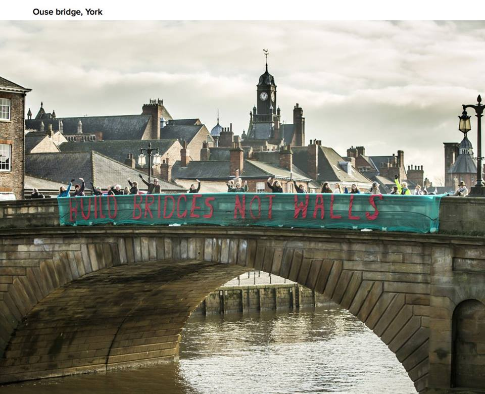
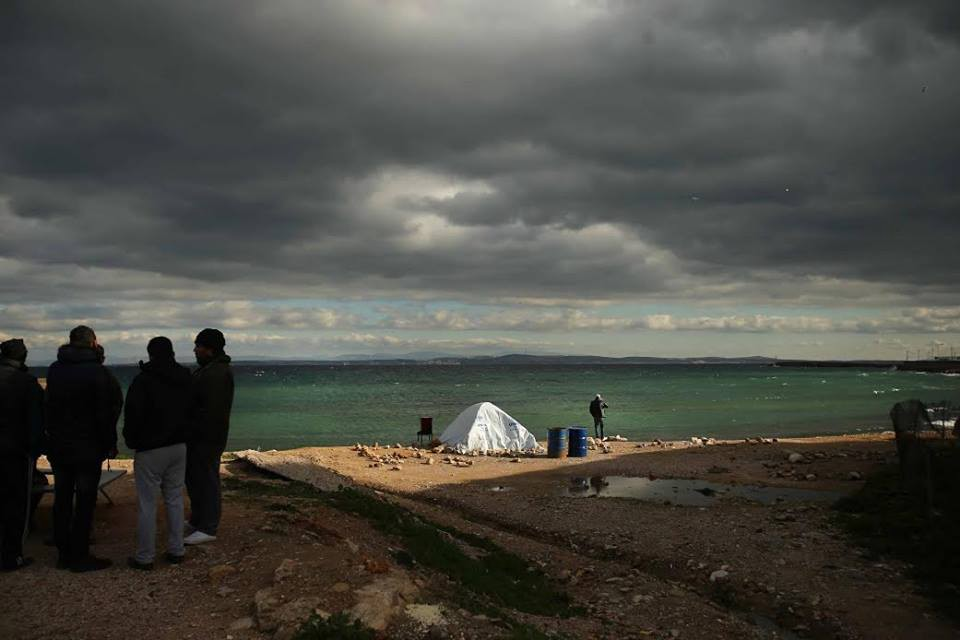
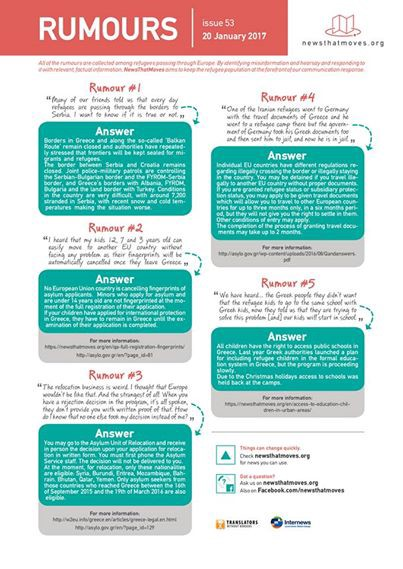

### AYS Daily Digest 20\.01\.17 — Hungarian\-style tactics documented in Croatia

#### Feature

In a [report released today](https://www.hrw.org/news/2017/01/20/croatia-asylum-seekers-forced-back-serbia) , Human Rights Watch has revealed the gruesome details gleaned from interviews with refugees\. Several refugees reported that they were beaten and forcibly deported to Serbia by the Croatian police\. This move, while utterly reprehensible, comes as no surprise\. Similar tactics are widely known and well\-documented on the Balkan Route\. Most reports of similar treatment are leveled against the Hungarian border police\. This is not the first time that Croatia has pushed refugees back into Serbia either\. Similar conduct was reported in January 2016\.

> “It was good that I had a lot of clothes as it served as padding,” he said\. “They \[officials\] beat me with a baton on my head and legs\. Five of them beat me…They also beat us as they made us run back into Serbia\.” 

It bears repeating that pushbacks are a clear violation of EU and international law as it pertains to refugees, according to which refugees are not to be deported to dangerous countries\. According to the UN High Commissioner for Refugees, Serbia does not qualify as a safe country, given its failure to adequately consider the refugees’ cases\. A total of 574 asylum applications \(mostly by Syrians, Afghans, and Iraqis\) were submitted in Serbia in 2016, of which only 19 received refugee status and 23 received subsidiary protection\. In other words, only 7% of those who seek to stay in Serbia have been given the legal status and protection that they seek\.

Every such report speaks volumes to the cruelty that refugees are forced to endure\. As if it were not enough that circumstances have forced them to leave their homes, those who make the journey to Europe are at great risk of harm as a result of negligence, or in some cases active violence as demonstrated in the report\. The leaders of Europe ought to be ashamed of their poor response to the refugee crisis\. These problems are not new, and yet there has been a severe failure to deal with them in a timely manner\.
#### Greece

Souda Refugee Camp on Chios\. Photo Credit: Jure Eržen
### Mayors of Greek islands seek to send refugees to the mainland

The mayors of Lesvos, Chios, Samos, Kos, and Leros have met with the European Commissioner for Migration to discuss the immediate transfer of refugees onto the mainland to decongest the currently existing camps and centers\. The islands wish to immediately send to the mainland between 1,500 to 2,000 refugees, many of whose applications for asylum have already been processed but whose transfer has not taken place because of the strains on the Greek refugee system\.

### NewsThatMoves has released its latest rumor fact sheet\.

The sheet is also available [here](https://drive.google.com/drive/folders/0B-_rJ_0o5IZIWFpSeGRoVDBZWGs) in Arabic, Greek, and Farsi\.

### Refugee\-related jobs compiled in one place

If you are looking for a new place to work, then you are in luck\. G2red has made available a large list of jobs available throughout the Greek mainland and the islands\. If you qualify for any of them, be sure to send in your CV\! The list may be accessed by clicking on the link below\.

#### Serbia

#### Germany
### Germany seeks to incentivize ‘voluntary returns’

The head of the Federal Office for Migration and Refugees has said that for 2017 Germany will be investing 40 million Euros in a program which seeks to have refugees return to their country of origin\. In 2016, Germany carried out a similar program costing 21\.5 million Euros, which extended to 54,000 refugees who opted to go home\. The plan seeks to limit the number of refugees in the country, and many are calling it an attempt to garner votes in the upcoming elections\.
### Flüchtlingshilfe München e\.V\. releases free multi\-lingual German workbook

The book is available in many different languages, namely English, Arabic, Farsi, Tigrinya, Urdu, Kurdish, Pashto, Turkish, and other languages\. The book may be downloaded at the link below\.

#### France
### Cedric Herrou continues to be harassed by police

Cedric Herrou gained international fame recently when he was put on trial for aiding refugees in crossing the Italian border into France\. His home was raided for the third time on Thursday, when around 20 heavily armed policemen searched his farm, pushing one journalist to the ground and pointing their gun at a Médecins du Monde nurse\. One brother and one volunteer as well as three minors were taken away in police cars and Cédric Herrou’s detention was extended for another 24 hours\.
### Documentary film about the lives of refugees in need of funding\!

### UK
### High court rules that over 10,000 refugees were treated unfairly

Between the years 2005 and 2014, the UK put thousands of people into a “detained fast track” to defend their claims if the Home Office deemed their request superfluous\. The refugees were then given only 7 days to prepare their case\. The court ruled that the people who were put through this process are to be given the right to have their claims reconsidered\. The problem is, of course, that many of those in question have already been deported from the UK, and this news is unlikely to reach them\.
### Young Syrian refugee seeking a room in West London

_Converted [Medium Post](https://areyousyrious.medium.com/ays-daily-digest-20-01-17-hungarian-style-tactics-documented-in-croatia-f9c41bfb1e7c) by [ZMediumToMarkdown](https://github.com/ZhgChgLi/ZMediumToMarkdown)._
