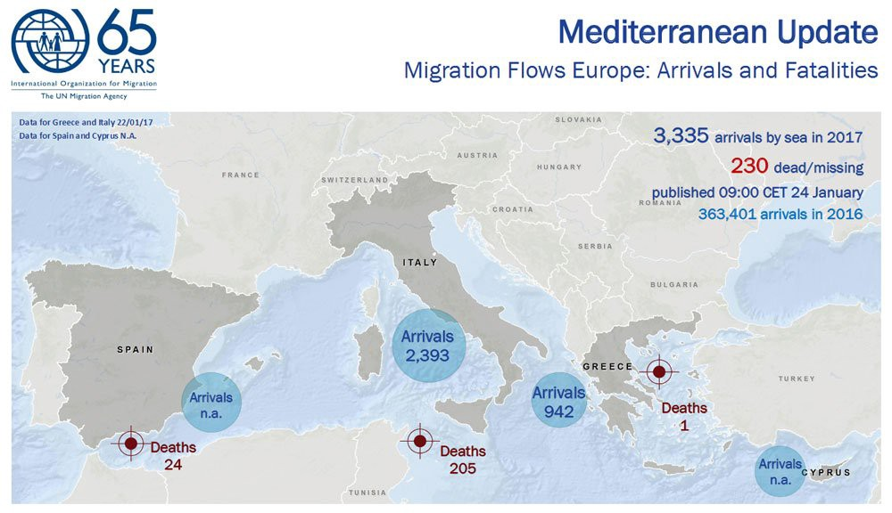

### AYS News Digest 24/01: Two young refugees lost their lives today
#### A boy dies in Moria \| New arrivals in the Aegean \| Much needed housing initiatives rising \| Refugees in Serbia still struggling \| Croatian NGOs demanding responsibility from all the responsibles in the Police \| A refugee killed himself in Venice; Life threatening poor conditions in some accommodation places in Italy \| 26 Afghans deported from Germany \| Taking care of unaccompanied minors in the UK — a lesson from Glasgow \| The new priorities of the US — suspending Muslim majority countries’ visas

 \)](assets/394879f46f66/1*IOnLArgbb6QLSlMCY8HZ9w.jpeg)

A boy in the fields around the Railway in Belgrade \(Photo: [Jan Refugee](https://www.facebook.com/jan.refugee.7) \)
#### MEDITERRANEAN

#### GREECE
### The islands

> A 21\-year old Egyptian refugee boy was found dead by his friends at the Moria detention camp on Lesvos\. The cause of his death is still unknown\. 

#### Arrivals

With **94** official registrations until this morning \(51 on Lesvos and 43 on other islands\), more than 1000 \(1063\) people have officially arrived on the Eastern Aegean islands since the beginning of the year, an average of 44 per day\.

#### Islands’ mayors receive no firm commitments from Tsipras

The mayors of Lesvos, Chios, Samos, Kos and Leros on Monday jointly presented their demands for measures to ease severe overcrowding at migrant reception centers on their islands during a [meeting in Athens](http://greece.greekreporter.com/2017/01/24/no-firm-commitment-on-decongesting-islands-at-pms-meeting-with-island-mayors-on-refugee-crisis/) with Prime Minister Alexis Tsipras\. They called for the transfer of hundreds of migrants to facilities on the Greek mainland, the improvement of the asylum process so that migrants can leave islands without delay, and measures to boost local economies which have been hit hard by the refugee crisis on top of the country’s financial crisis, [Ekathimerini](http://www.ekathimerini.com/215543/article/ekathimerini/news/island-mayors-ask-pm-for-transfer-of-migrants) reports\.

 \)](assets/394879f46f66/1*FqVJXVXQG7gISUTZDslVcg.jpeg)

Film posters from the 5 day documentary film\-making workshop for beginners, on Lesvos\. \(Images: [The Office of Displaced Designers](https://www.facebook.com/displaceddesigners/?ref=stream) \)
### Greek Asylum Service reschedules full registration dates of all who pre\-registrated in June/July of 2016

The Greek Asylum will reschedule 2500 appointments, which now will take place by the end of February 2017\.
All [appointments](http://asylo.gov.gr/en/?p=1974) will be concluded until the end of February 2017\.
You can check the date and place of your appointment in [this link](https://search.rescueapp.org/#/) \.

 and I AM YOU, but the real creators are the adolescents of Ritsona who made it happen” \(Photos: [I AM YOU\.](https://www.facebook.com/iamyourescue/) \)](assets/394879f46f66/1*jE1deFaph_5xMH8l-Vpjwg.jpeg)

“Tree of Hope is a project organized by [Lighthouse Relief](https://www.facebook.com/lighthouserelief/) and I AM YOU, but the real creators are the adolescents of Ritsona who made it happen” \(Photos: [I AM YOU\.](https://www.facebook.com/iamyourescue/) \)
### Housing

Although a number of people has been moved to better housing, apartments and houses, there are still around 100 people living in dire conditions at **Oraiokastro** , [according to the refugees](https://m.facebook.com/story.php?story_fbid=1709299526047821&id=1627523520892089&hc_location=ufi) from the camp\.

According to the [report](http://reliefweb.int/sites/reliefweb.int/files/resources/Accommodationupdateasof24January2017.pdf) of the **UNHCR** , a total of 18,279 people have so far been moved to apartments \(10,776\), different buildings \(1,927\) host families \(417\), and hotels \(5,159\), 254 people in the past week\.

**Tent To Home program** has 12 families in private housing in Athens and another 6 in Polykastro and Thessaloniki\. If someone is interested in volunteering with them to: prepare warehouse deliveries, visit families, help families get to know their neighborhoods, affordable shopping options, and local community centers, and help solve specific case issues, send a message to contacts for [Athens](https://www.facebook.com/asegur?fref=ufi) or [Polykastro](https://www.facebook.com/kayra.martinez?fref=nf) \.

As a part of the action intended to move everyone they can to the apartments some similar type of housing, the Greek Ministry has notified the residents of **Elliniko** that they might be the next to leave the really bad place they are currently accommodate in\. Although similar plans were presented in Novemeber 2016, still not much has happened\. We are attentive to the development of the situation\.

 ’s mission is to create healing environments where they can\. \(Photo credits: Nikos Pilos via The HOME Project\)](assets/394879f46f66/1*lUd3WDeqdI8pFVi00CFZcw.jpeg)

“As of Jan\. 13 according to the latest EKKA \(National Center for Social Solidarity\) data: 5,192 unaccompanied minors were officially registered entering Greece since the beginning of 2016, of those 1,301 are currently without a home and exposed to all sorts of dangers from child abuse, to sex trafficking and child labor\. The need for shelter, support and social integration is urgent\.” [The HOME Project](https://www.facebook.com/HomeProjectOrg/?fref=nf) ’s mission is to create healing environments where they can\. \(Photo credits: Nikos Pilos via The HOME Project\)
### Still divided sides on schooling of refugees in Greece

Teachers and parents at the Larissa school, that welcomed the refugee children into their official education programme, have been divided over the matter\. After some of the parents said they remain opposed to the presence of refugees at their children’s school, the principal [reportedly](http://www.ekathimerini.com/215533/article/ekathimerini/news/larissa-school-divided-over-classes-for-refugee-children) insisted she would remain committed to “offering adequate education to Greek and refugee children who we will soon be welcoming with an open heart, arms and mind\.”
Recently, we wrote about the fascist supporters who used violence against teachers and parents at a school in Piraeus area\. The case against them is now [being examined](http://www.ekathimerini.com/215548/article/ekathimerini/news/prosecutor-to-examine-golden-dawn-raid-on-perama-school) at the Piraeus prosecutor’s office\.

■■■■■■■■■■■■■■ 
> **[DOCTORS OF THE WORLD](https://twitter.com/_MdMUSA) @ Twitter Says:** 

> > The containers in #Malakassa that refugees are living in do not have windows, do not have doors, and none of them have heating or hot water. https://t.co/ceM4B0LEkn 

> **Tweeted at [2017-01-24 18:39:15](https://twitter.com/_mdmusa/status/823963388959223808).** 

■■■■■■■■■■■■■■ 

#### SERBIA
### UNHCR introduces a plan “orderly and dignified migration management” in Serbia

“ The strategy and appeal for Serbia are part of a bigger Regional Refugee and Migrant Response Plan for Europe covering Turkey, Southern Europe, Western Balkans, and other parts of Europe presented to potential donors in Geneva on 19 January\. \(…\)
While some aid will continue to be required to address the immediate needs of new arrivals, the activities under [RMRP](http://www.unhcr.rs/en/dokumenti/saopstenja-za-medije/unhcr-i-iom-predstavljaju-novi-plan-reagovanja-na-izbeglicku-i-migrantsku-krizu-u-srbiji.html) will primarily focus on the longer\-term staying population and their needs for shelter, food, health, education and solutions\. With this plan 8 UN agencies and 16 on\-governmental organisations seek to assist Serbia with activities at the value of over 39 million US dollars\. Under the preceding RMRPs of 2015–2016 Serbia had received international support to the refugee and migration situation at the value of **USD 13,106,618** \.”

 \)](assets/394879f46f66/1*GbeFZyH3fsuBUHwcJb3BRQ.jpeg)

A young refugee in Belgrade, Serbia \(Photo: [John refugee](https://www.facebook.com/John-refugee-747163385440090/) \)
#### CROATIA
### AYS and the ‘Welcome’ Initiative demanding responsibility from the Croatian police

The Welcome Initiative and Are You Syrious have urged the Croatian police to stop [forcibly and unlawfully turning back refugees](https://medium.com/@AreYouSyrious/ays-daily-news-digest-17-1-massive-negligence-of-minors-and-serious-police-abuse-remain-silently-38c0815bdec5#.h8gdo8rk1) from Croatia, to investigate such cases and take disciplinary action against those responsible, and to allow expelled refugees wishing to seek asylum in Croatia to return\.

Photos: AYS
#### ITALY
### Death of a young refugee in Venice canal

A 22 year old refugee who had fled from [Gambia](http://www.agenpress.it/notizie/2017/01/23/bari-appello-dei-gambiani-richiedenti-asilo-le-autorita-italiane-rilascino-permesso-soggiorno-sussidiario/) arrived to Italy on a dingy and in Pozzallo he received humanitarian protection\. On Tuesday he threw himself in the Gran Canal\(for unknown reasons\) and committed suicide as apparently he didn’t want to catch the life jackets the vaporetto sailors were throwing at him\. 
None of the bystanders jumped in to save the man\.
### Life threatening poor conditions in accomodation places

MEDU \(Medici per i diritti umani\) met today with Domenico Manzione \(deputy Home secretary\) to [talk about the horrible life conditions](http://www.meltingpot.org/Medu-al-sottosegretario-Manzione-grave-la-situazione-nella.html) of migrants working in the Piana di Gioia Tauro \(Calabria\) for the citrus fruit harvest\. 
In the makeshift camp of San Ferdinando, 1500 people live and 2 days ago they had a fire, the second in one month, which left 3 people injured \(among them, one woman\) \. MEDU reminded Manzione that on the 19th February 2016 a new protocol for reception was signed by the Prefecture of Reggio Calabria; it allowed the new construction of another temporary tent camp\.
Tents were bought and the location for the new camp was decided but the works won’t start before spring\. Given the horrible hygienic and living conditions MEDU urges to adopt immediate measures for the dignity and security of people\.
Lo Scatolone is an abandoned sports hall in Reggio Calabria where about 130 unaccompanied minors are hosted\. With no privacy, they all sleep in this big room with broken windows, with 2 toilets and 5 showers on disposition, with only cold water\. While in other places [documents are being signed](http://www.baritoday.it/politica/sottoscritta-piattaforma-per-l-inclusione-dei-cittadini-migranti-3088016.html) for the inclusion of the refugees, volunteers here have called for responsibility and for actions to be taken concerning a more proper lodging for these people\.

 \)](assets/394879f46f66/1*GCDlXaT_cYgPpVHBCDnyIg.jpeg)

“Tranquility is important, but freedom is everything”\. A protest organized by Baobab takes place on Wednesday, January 25 \( [link to the event](https://www.facebook.com/csoalastrada/photos/gm.1840145506226114/1156513427798251/?type=3&theater) \)

On Sunday 29th January from 1 to 7 PM, a [Solidarity Lunch](http://www.cronachediordinariorazzismo.org/pranzo-solidale-baobab-roma-migranti-transitanti/) will take place at the Spazio Sociale 100celleaperte \(Via delle Resede 5, Rome\) \. This event is organised for and with Baobab\.
#### UK
### Glasgow: Care for an unaccompanied refugee child / young person

> Glasgow City Council is welcoming to the city unaccompanied refugee children and young people\. These young people need a safe space, where they can feel welcomed and begin to build a new life\. **We would like to hear from people willing to welcome these children and young people into their homes\.** 
 

> Please come along to one of our information evenings to find out more:
 

> Thursday 26 January, 6\.30pm — 8pm
 

> Monday 30 January, 12pm — 2pm
 

> Monday 30 January, 6\.30pm — 8pm
 

> Tuesday 31 January, 6\.30pm — 8pm 

> All of these information events will be held at the City Chambers, George Square, Glasgow\. More info: [here](https://glasgow.gov.uk/index.aspx?articleid=20571) 

Any asylum seekers being dispersed to Knowsley — SHARe Knowsley have a drop\-in in Prescot and Kirkby every Monday\. See [the website](http://www.shareknowsley.org.uk/) for more details\.
#### GERMANY
### Another collective deportation of Afghans

Another 26 young Afghans arrived in Kabul, deported after years of living in Germany\. “What would you have me do here? There is only death\!” said 19\-year\-old Ramid Afshah, returning from Germany after five years — a country it had taken him six months to reach\. According to the AFP, the airport police spokesman Mohammad Adjmal Fawzi said at least one of the 26 was “suffering” and showing signs of psychological distress, adding: “He could be brought back to Germany\.”
#### US
### The States possibly closing their doors to Muslim refugees

According to several different reports, the Department of Homeland Security is currently considering ending Syrian refugee program and a suspension of Muslim majority country visas\. Visa holders from Iraq, Iran, Libya, Somalia, Sudan, Syria and Yemen will be primarily affected by the new immigration orders that the US president is about to sign\.

_Converted [Medium Post](https://areyousyrious.medium.com/ays-news-digest-25-01-young-refugee-lives-slowly-fading-accross-europe-394879f46f66) by [ZMediumToMarkdown](https://github.com/ZhgChgLi/ZMediumToMarkdown)._
