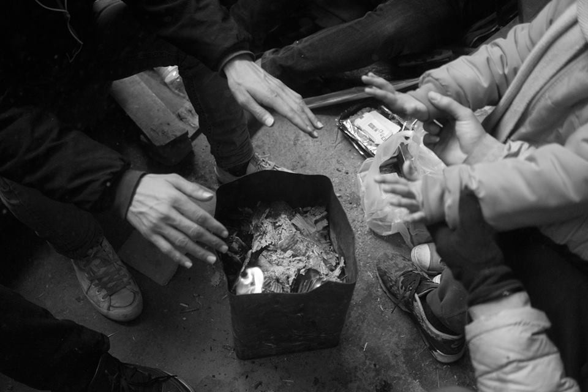
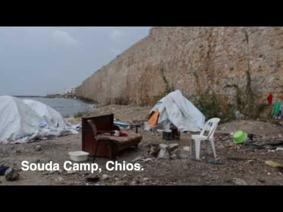
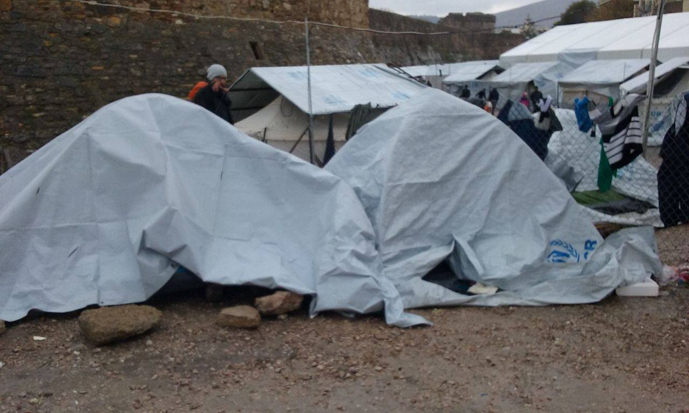
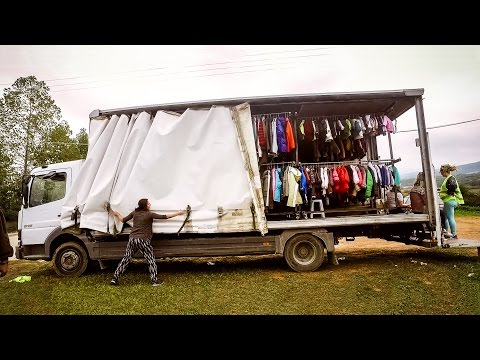
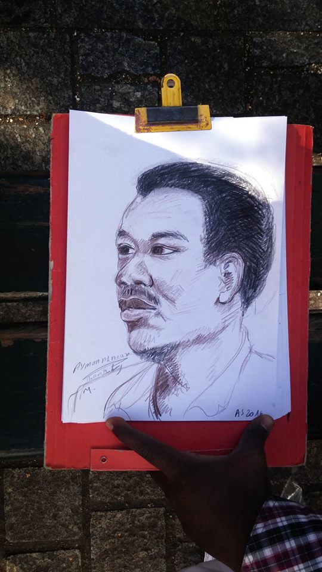

### AYS DAILY DIGEST 25/01: Updates from Greece

_Update on Greece//Donations needed for Paris//Arabic translator assigned to Dari\-speaking asylum\-seeker in Zagreb court//Portugal hopes to relocate Yazidi refugees//EU hopes to close its borders_

Photo Credits: Ahmad Haiel and Mahmoud Nbil
### Update on Greece

In a new video, the UNHCR praises the distribution of 360,000 winter items to 38,000 asylum seekers across Greece from October 2016 to January 2017\.

[ | Facebook")](https://www.facebook.com/ec.humanitarian.aid/videos/10154804950687906/)

Much still needs to be done, as shown and demonstrated by refugees themselves\.

Much of the [“Wake up call”](https://medium.com/@AreYouSyrious/wake-up-europe-human-beings-in-life-threatening-conditions-6123880d07a7#.2f2dy2ilx) for Europe published on the 11th of January and signed by 49 organizations operating in Greece remains valid, as people still live in unheated tents on the Aegean Islands\. While refugees have been moved to apartments on the mainland, many remain stuck in warehouses\. A survey, conducted with 278 refugees on mainland Greece by the Refugee Rights Data Project, also finds that 59% can’t wash with warm water while 39% say their shelters leak when it rains\.

Mariana Vareta, a volunteer for the “Mobile Info Team”, writes

> “There are still hundreds of refugees — including babies and children — living in canvas tents set up on damp concrete floors, inside freezing warehouses, with broken doors and windows\. Many times there is no water, because pipes freeze and break, and many others there is no electricity, because fuse boxes can’t handle the dozens of portable heaters and stoves that people desperately try to fight the cold with\. 

Picture taken today by “people from Chios”\.

She adds that

> “The refugee crisis put an enormous strain on the Greek health system, which was already on the verge of collapse\. Everything that is not urgent or super serious goes into an endless waiting list \(…\) Of course any flu, in this context, is completely devalued\. One of the things that touched me the most was a 5 year old boy with a sore throat, shrunken in a corner, crying softly, like he knew it was useless\.” 

Everyone is blaming each other for the lack of progress in Greece\. [DW](http://www.dw.com/en/eus-mishandled-millions-not-reaching-refugees/a-37266178) reports that Minister for Migration Ioannis Mouzalas points at the millions in funds given to large NGOs and international organisations and argues the government could have used the funds more efficiently, while the UNHRC blames the government for poor planning, saying there was uncertainty over which temporary sites would be maintained, upgraded or closed\.

However, the European Union is also to blame, partly because of its decision to ban people arriving on the islands from traveling to the mainland, leading to completely overcrowded camps and terrible living conditions\. The EU should also be blamed for the slow relocation process, as from the 12th to the 24th of January, only 471 refugees were relocated from Greece, putting the total to 7,919 out of 63,302\. The European Commission insisted that at least 2,000 people should be relocated every month to ensure that all persons eligible for relocation in Italy and Greece are transferred by September 2017, a target that is unlikely to be reached in January\.

Mariana Vareta finally points out that

> “The richest continent in the world will rather pay to keep the problem at a distance: pay Turkey to stop them from coming, pay Greece to hold them there, pay for walls to stop the rest \(…\) instead, there are over 2,000 unaccompanied children exposed to all kinds of exploitation, there are women recurring to prostitution to provide for their kids, and people trying to kill themselves in overcrowded camps\. Remember: this is Europe in the 21st century\.” 

\(You can read Mariana’s full post, including 10 ways to help, on her [Facebook page](https://www.facebook.com/mariana.vareta/posts/10154925419157866) \) \.
### Lesvos: Statement on the death of a refugee in Moria

The Boat Refugee Foundation has issued an official statement, on the death of a young man yesterday in Moria:

> “Yesterday, a 21 year old young man died in Camp Moria\. He was on his way to Europe from Egypt and stayed in the overcrowded refugee camp on Lesbos on a temporary basis\. The Egyptian was found in his tent by his friends\. A doctor was summoned immediately\. The situation was serious and the doctor indicated that the young man needed to be moved to the medical cabin\. He was transported by ambulance and resuscitated\. Unfortunately it was already too late and the young man died before doctors in the medical cabin could help him\. At this time, the cause of death is unclear and we don’t have much information about the young man\. The 21 year old Egyptian was, most probably, alone in his flight and without relatives in the camp\. The situation is now under control and is being investigated\.” 

### Protests inside Samos camp

No Borders received a message explaining how refugees feel and why they protest:

> “This problem from samos greece have to many people is died 
 

>  we don’t know we what doing any thing and we don’t have the doctors 
 

>  and not give us any thing 
 

>  we can outgoing and his water and bread all the expire 
 

>  and we need if we don’t eating we have to diet 
 

>  and we all from there all together is sick , i’m sick doctor told me after 2 month 
 

>  came back if you want i have a lot guide\. ?
 

>  and my wife also have many problems they not doing any thing and i have 5 children
 

>  please see us way we don’t know what we doing
 

>  help please help us “ 

### ACTION:

The Mobile Truck Shop will shift its focus to Lesvos given the sub\-zero temperatures and living conditions there\.

[It needs help](https://www.betterplace.org/en/projects/50552-truckshop-a-free-shop-for-refugees) to expand their stock of clothes and the size of their shop\.

### Protests outside the Petrou Ralli police department

[Insurrection News](https://insurrectionnewsworldwide.com/2017/01/25/athens-greece-photos-statement-from-the-intervention-at-the-immigration-directorate-on-petrou-ralli-street/) reports on protests that took place last Friday outside the jail of the Immigration Directorate on Petrou Ralli street\. People chanted slogans and tried to communicate with some prisoners, while immigrants on the outside used a bullhorn to communicate with prisoners in their language, who informed them of their lengthy detention and squalid living conditions\. The website says that communication with women detainees was impossible, because policewomen threatened them and did not let them get close to the windows\.

](assets/a873ef05e2a7/0*uPTpDecujRRwjKEm.)

[Original source](https://allilegioikratoumenonstanotia.wordpress.com/2017/01/22/paremvasi_petrou_ralli_20-01-2017/)

Journalist Marianna Karakoulaki says that around two weeks ago, detained women protested against the conditions at the Elliniko detention center and were then moved to the Petrou Ralli police department, “infamous for its brutality towards refugees”\. Petrou Ralli is a detention centre in southern Athens for refugees whose temporary stay papers have expired\.
#### Croatia
### Lost in Translation — Administrative Court of Zagreb assigns translator for Arabic language to Dari\-speaking asylum seeker

Today a serious omission occurred at the hearing at the Administrative Court of Zagreb — an Arabic language translator was assigned to a Dari\-speaking asylum seeker from Afghanistan during his appeal\. Despite the fact that the lawyer pointed out that her client cannot understand the translator, the judge continued with the process\. This is only one of the indicators of the low standards of juridical processes available to asylum seekers in Croatia — and the question is what kind of access do the asylum seekers in Croatia have to justice and protection? This is why AYS volunteers have started to monitor the Court processes — in these situations the presence of public is crucial\.
#### Slovakia
### Refugees resettled from Slovakia to US before Trump closes the door on the most vulnerable

[Spectator](http://spectator.sme.sk/c/20440334/iom-through-slovakia-over-1000-refugees-already-resettled.html) reports that a group of 23 refugees left Slovakia on the 17th of January and were resettled in the US\. Over 1,000 refugees have been resettled via the Emergency Transit Centre in Humenné in eastern Slovakia since 2009 according to the IOM, heading mainly to the United States, Canada and Norway\. As many as 96% have been resettled in the United States\. More than half of them are Somalis and a majority of them are families with small children or single mothers\. Trump’s plan to put all refugee resettlement on hold for 120 days will therefore clearly impact the most vulnerable\.

](assets/a873ef05e2a7/0*RUCCAOjR5MDouf-3.)

Patriots by [Pejac](https://www.facebook.com/pejac.es/?ref=page_internal)

Help Refugees says “ _nearly two thirds of of all refugees resettled in 2015 were accepted by the US, so the impact of this will be devastating\. Refugees are by definition people seeking sanctuary from some of the most horrific circumstances and it is the duty of compassionate and progressive nations to accept their fair share\. Banning refugees on the basis of their religious beliefs is abhorrent\. Halting resettlement of refugees will not, contrary to Trump’s assertions, make America safer\. On the contrary it will force people into the hands of traffickers and make the vigorous systems currently in place to vet refugees entering the US completely defunct\.”_
#### France
### Donations needed for Paris

Calais Action is making a [call\-out for donations](https://mydonate.bt.com/events/pariosaction/406673) \. The group will be out in Paris very soon and is looking to fund projects which could really help over the long term, one of which being a laundry service\. The group says

> “The situation is extremely difficult for both refugees and volunteers\. After volunteers distribute aid, police will confiscate\. This does not stop the volunteers helping and will not stop our support, please don’t let it stop you donating we really need you\.” 

As well as distributing aid, volunteers are working to find legal shelters and are connecting with homeless shelters\.
### Sleep out to raise funds for Paris and the phone credit group

On Saturday 11th February, ‘Herts for Refugees’, ‘Derbyshire Refugee Solidarity’ & ‘Phone credit for refugees and displaced people’ will be taking part in a sponsored sleep out to experience the brutal conditions refugees across Europe are facing daily\.

The goal is to raise funds to buy essential items for Paris, by [donating via justgiving](https://www.justgiving.com/campaigns/charity/hertsfor-refugees/Sleepout) or by texting PARI15 to 70070 to donate £10 towards priority items such as sleeping bags, bivvy bags, thermals, food etc\.

Funds raised by the phone credit group via [mydonate](https://mydonate.bt.com/fundraisers/phonecreditcampout) will enable more people across Europe to have that all important phone call to their loved ones\.

Photo by Ariane Segelstein

Local Parisian groups need support as well, including the Collectif Parisien de Soutien aux Exilés \(CPSE\), which supports refugees through material aid, medical, administrative and legal support\. The group is structured around three sectors, specializing in support for adults, families and unaccompanied minors\. You can donate [here](https://www.leetchi.com/c/solidarite-de-migrants-de-republique) \. Be sure to check out their [Facebook page](https://www.facebook.com/cpse75/) to stay updated\.
### Marine Le Pen prevented from entering La Linière camp

Front National president Marine Le Pen tried to enter the refugee camp of La Linière in Grande\-Synthe on Tuesday, but was prevented from doing so by city officials according to [France 3](http://france3-regions.francetvinfo.fr/nord-pas-de-calais/grande-synthe-marine-pen-refoule-du-camp-migrants-1182237.html) \. Mayor Damien Careme said the camp “is not a zoo” and condemned her hateful and divisive discourse\.
#### Portugal
### Portugal offers to relocate Yazidi refugees

[Ekathimerini](http://www.ekathimerini.com/215596/article/ekathimerini/community/portugals-offer-to-take-iraqi-refugees-from-greece-rebuffed-as-favoritism) reports Portugal has offered to take in several hundred of the 2,500 Yazidi refugees living in Greece, arguing that their mistreated community merits special protection\. Athens has rejected the offer, worried that other countries might start cherry\-picking asylum applications based on religion or ethnicity\. Ana Gomes, a Portuguese MEP, argues “these people have been victims of negative discrimination in resettlement to other European countries when they should be having positive discrimination in recognition of the barbarity they have suffered” while Migration Minister Yannis Mouzalas said “no government can discriminate on a racial basis and those making a lot of noise around this issue are not helping the Yazidis”\.

In an interview Ana Gomes accorded to “Are You Syrious” end of September, she already stated Portugal’s wish to relocate Yazidis, saying that Mouzalas rejection is

> “ridiculous, because discrimination can be made on the basis of special needs and of course the Yazidis group have many minors, elderly people pregnant women, single parents, so all the Yazidi group qualifies for this criteria — they could give priority to the vulnerable people among the Yazidis — but they don’t\.” 

She added that other member states have been asking “ _in a very outrageous discriminatory way_ ” that they should for instance receive Christian families from Syria\. She insisted that she

> “cannot understand why this \(relocation process\) takes so long, especially since countries like mine are open to take in refugees \(…\) after six\-seven months we’ve been dealing with that, it’s ridiculous\. We’ve been able to identify all these people, give them names, say where they are, everything and still nothing happens”\. 

Meanwhile [Expresso](http://expresso.sapo.pt/dossies/diario/2017-01-25-Grecia-e-contra-mas-Yazidis-vem-para-Portugal-190-confirmados-30-com-viagem-marcada) says that 190 Yazidis are confirmed to go to Portugal, while 30 already have a ticket and should arrive in one or two weeks\.
#### EU
### EU continues to focus on keeping refugees outside its borders

In an interview with [_DW_](http://www.dw.com/en/is-the-eu-turkey-refugee-deal-working/av-37263788) , Frontex director Fabrice Leggeri says the EU\-Turkey deal is working and talks about the situation in Libya\. He says that when refugees are at sea it is “already too late” and argues that “there is a need to fix the problem in cooperation with African countries”, saying that Frontex will deploy an officer to Niger this year to cooperate on other EU actions there\. In an interview with [_Le Figaro_](http://premium.lefigaro.fr/international/2017/01/24/01003-20170124ARTFIG00154-frontex-il-faut-juguler-les-flux-migratoires-en-afrique-avant-qu-ils-n-atteignent-la-libye.php) , Leggeri salso ays his organisation is deploying agents in non\-European countries to coordinate the collection and transfer of information regarding migration patterns\. He claims more work is being undertaken in countries of origin like Mali, while coast guard capacity is being reinforced in the Mediterranean\.

[_La Stampa_](http://www.lastampa.it/2017/01/25/esteri/pattugliamenti-e-rimpatri-ecco-il-piano-ue-da-milioni-OSsiVw64fPZvlUDR0fPGIP/premium.html) reports the EC is to propose a new migration plan worth €200m, stressing support for Italy and cooperation with Libyan authorities to stop the flow of migrants across the Mediterranean\. The plan could also include sending EU naval forces into Libyan waters or forming a line of protection off Libya’s coast, [_La Repubblica_](http://www.repubblica.it/esteri/2017/01/25/news/navi_ue_in_acque_libiche_ecco_il_piano_di_bruxelles_per_bloccare_i_barconi-156809985/) reports\.

The EU’s focus on keeping people out of its borders now reaches absurd levels, as [DW](http://www.dw.com/en/fight-over-migrant-centers-in-belarus/a-37260516) reports on the EU’s plan to finance the construction of centers to house migrants in Belarus\. An EU representative in Belarus said that construction of the centers is part of a project in which Belarus is supposed to help “steer irregular migration”\.

_Converted [Medium Post](https://areyousyrious.medium.com/ays-daily-digest-26-01-updates-on-greece-donations-needed-for-paris-a873ef05e2a7) by [ZMediumToMarkdown](https://github.com/ZhgChgLi/ZMediumToMarkdown)._
