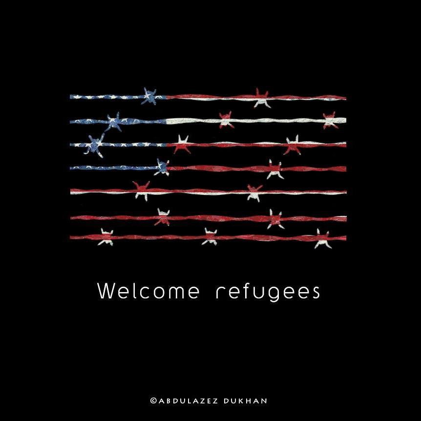
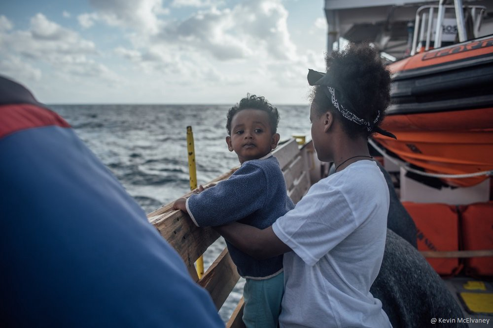
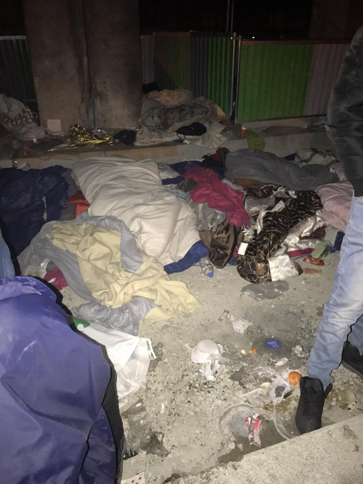

### AYS DAILY DIGEST 28/01/2017: The events of today are so absurd that it is hard to believe this day ever really happened

_Five refugees died on European soil during this week // No cash cards for people in squats in Athens // Streets of Paris covered with homeless refugees // Some of the EU member states plans to tighten their already very tight borders // Help is needed in Italy, Serbia and France // Solidarity needed all over the world_

“Bombing our country, Earning money by selling your guns, Destroying our houses, killing our families\. and after all of that, closing your borders in front of us\. Who is the real terrorists?” By Abdulazez Dukhan
### Greece
#### European death trap in Greece

Five people died in refugee camps during this week\. Among them, one 2 months old baby whose life started and ended in Ritsona camp\. The baby lived in the camp even though she was born with some health issues\. According to the local media, the police is investigating parents for child neglect\.

Children should not live in refugee camps, or anybody\. The culprit is not in Ritsona\.

Also today, 46 years old man died of hypothermia\. He lived in Moria camp\. People in the camp are on hunger strike one more time to protest their living conditions\.

While we express our deep condolence to families and friends of those who died, we call upon those who are responsible and have power to make decisions, to end this humiliation and torture of people\.

Do you really need more proofs that closed borders are killing people?

Nevertheless, instead of thinking about closing camps and providing dignified living conditions for people, authorities in Greece are considering new reception center on the island of Chios\. Preparations are ongoing at the Kagiava army camp, in the center of the island\.

This week CARE organizations issued a call for people in Athens and Thessaloniki to apply for the Urban Cash Assistance\. But not everybody is eligible\. People who are living in squats cannot ask for this type of help\. We tried to contact CARE office asking for the explanation, but did not get the answer so far\. What some of the volunteers suspect is that CARE accepted conditions imposed by the government\. Their teams tried to get the cash cards for all the refugees and visited the squats, registered people, but the government said no for the squats\. Results are that around 2000 people, families with children among them, will not receive this type of help that is more than needed for them\.

The squats are places where refugees are finding shelter\. Many people who are living there were on the streets, and if they do not have squats, formed together with local solidarity movements, they would be living on the streets until today probably\.

By current rules, cash cards are available for people older than 18, those who have a valid \(not expired\) document issued by the Greek government \(police note, pre\-registration, full registration, asylum card, or any other Greek valid document with an official stamp\), those who are not currently receiving cash assistance from another organization, those who are not legally working in Greece with a stable income, who arrived in Greece no sooner than January 2015, who are residing outside of camp\.

According to volunteers info, the cash card amount depends on the household size: single people gets 150 Euro, the family of two 250, of three 330, for four it is 390, five 450 Euro\.
### Italy
#### 1000 people arrived during one day

The situation is not much better in Italy, another EU member country where only on this Friday, around one thousand \(1000\) people arrived after being rescued from the sea\. One dead body was recovered, the Italian coastguard told the media\.

Photo MSF Sea Kevin McElvaney

People were found aboard six inflatable and three wooden boats, and saved by two coastguard ships\.

Volunteers are reporting from different Italian cities claiming that people are living in centers with minimal life conditions, or are forced to stay out in the open\. The media reported about [bad living conditions is CIE Center in Udine](http://react-text: 91 http://www.meltingpot.org/LasciateCIEntrare-visita-alla...) that is overcrowded, does not have heating and no legal assistance is provided\.

Meanwhile, group of activist tried to draw attention to this protesting and saying that nobody deserves to sleep on the street\.

](assets/69938b2bda84/1*rTwXIYYxc_Mso1mSd73T6g.jpeg)

By [Rete Solidale Pordenone](https://www.facebook.com/retesolidalepn/)
### Serbia
#### Call for doctor to join volunteers in Subotica

Despite all the media attention and appeals, people are still out in the open in Serbia, among them children not older than 12 years\. We are receiving calls for help from Belgrade, but also from Subotica where people are waiting and hoping to cross to the EU\.

](assets/69938b2bda84/1*WNOyn0jjEBUkiAUAVbyEqQ.jpeg)

Photo [John Refugee\.](https://www.facebook.com/John-refugee-747163385440090/)

[Fresh Response](https://www.facebook.com/freshresponseserbia/) , an independent volunteer project working in the north of Serbia, is in urgent need of an experienced field doctor to join their team\. The most common cases encountered by people there are frostbiting, hypothermia, physical trauma wounds, and body lice/scabies\.

_“The unique situation here is very different to Greece and best suited for a risk\-taking, adventurous individual,”_ they say in their call\. If you can help, PM [Dan Song](https://www.facebook.com/infisterra) for more info\.

They also need sleeping bags\.

The same is needed in Belgrade\. Additionally, the [Refugee Foundation in Serbia](https://www.facebook.com/izbegliceusrbiji/?fref=tshttps:%2F%2Fwww.facebook.com%2Fizbegliceusrbiji%2F%3Ffref&__mref=message_bubble) , is looking for volunteers who will work with kids, and they need some educational materials\. Contact them for more info\.
### Austria
#### New laws that will limit immigration

The government is planning a new laws to limit immigration, including laws to extended border controls, to control individual cars, installation of video surveillance on highways and trains, and that the railway companies, as well as taxi drivers, will be obliged to control whether their passengers are allowed to enter the country or they will be fined\.

The proposal is that the detention of asylum seekers after negative decision will be allowed for up to 18 months, and they should also be switched to non\-cash benefits\.

If a refugee is found in Austria and asks for asylum, a 1–2 week detention will be allowed in a police center\. If these new measures do not result in a drastic decrease of refugee numbers, special rules we are applied, as refusing entry at the border and denying the refugees the right to ask for asylum\.
### Germany
#### Tightening the borders

The government is planning to doubled police presence on the border with Austria\. Media are reporting that authorities fear a _“permanent refugee influx”_ \. As result, that between the city of Lindau on Lake Constance and the town of Freilassing, in the southern state of Bavaria, situated directly across the border from the Austrian city of Salzburg, the number of permanently stationed policemen is to be increased from 550 to more than 1,100 in the coming years\.

Two additional inspection units would be set up in the Bavarian towns of Freilassing and Kempten, from this summer onwards\.

The EU allowed Austria, Germany, Denmark, Sweden and Norway to continue the current internal border controls until mid\-February\.

However, citizens are much better than the governments\. Today in Cologne, hundreds marched against ongoing deportations of people from Afghanistan saying what everybody knows — it is not the safe country\.

](assets/69938b2bda84/1*qtVzXY0zrStMzrZwNQXv5g.jpeg)

Photo by [Forum Afghanischer Migraten](https://www.facebook.com/Forum-afghanischer-Migranten-193026784462210/)
### France
#### Bad lesson thought by police

While tourists are taking pictures under the Eiffel Tower, down the road, about 20 minutes walk as [Refugee Biriyani and Bananas team](https://www.facebook.com/RefugeeBiriyaniAndBananas/) reports, hundreds of people are sleeping on the streets and under bridges\.

_“I saw designer shops and people lining in fancy outfits waiting for theater and then people queuing many days out in the cold for a chance at life to get into a ‘Humanitarian Centre’?,”_ volunteers are reporting\. “We are here to do our bit to provide comfort and support to refugees in Paris\. They’ve crossed oceans and mountains only to find a society that didn’t want them\.”

Photo by Refugee Biriyani and Bananas team\.

The team is providing food for all those in need, but to continue doing so, they need help\. Find them on [their FB page](https://www.facebook.com/RefugeeBiriyaniAndBananas/) \.

Additionally, there are [more reports of police brutality](http://react-text: 153 https://www.facebook.com/quartierSolidaires/posts/1744484275867790) against refugees\. Heavily equipped police arrested some people who have found shelter in front of a school \(école Pajol , yesterday morning while kids were entering the school\. The refugees have been at this location for a while, and often parents gave them breakfast\.

[Help is needed in Calais](https://www.facebook.com/groups/CalaisMigrantSolidarityActionFromUK/permalink/1353305671410843/) , too\. Refugee Community Kitchen needs large quantities of oats, dates, fresh tomatoes, aubergine, peppers, olive oil, green tea bags
### US
#### Shame on you\!

And finally, the most absurd information of the day: the new president closed the nation’s borders to Muslims\. [Two Syrian families have been denied entry upon arrival at Philadelphia Airport](https://beta.phila.gov/press-releases/mayor/mayors-statement-on-syrian-families-turned-away-from-phl-airport/) \. According to the order, families fleeing the war in Syria will be indefinitely blocked from entering the country\.

_“We don’t want them here,”_ US president simplified his decision\. _“We want to ensure that we are not admitting into our country the very threats our soldiers are fighting overseas,”_ he said reminding of the important fact that in some of the countries where people who are banned are coming from, there are US soldiers fighting for years\. Those countries are Iraq, Syria, Iran, Sudan, Libya, Somalia, and Yemen\.

At the beginning, it was believed that the ban will affect only refugees, but people are being detained at the airports including students and those who live for a very long time in the US\. Human rights groups are claiming that some legal permanent residents who hold green cards were being stopped as they sought to return\.

The executive order he signed is described by the new administration as _“part of an extreme vetting plan to keep out radical Islamic terrorists”\._ The order also established _“a religious test for refugees from Muslim nations,”_ and orders that Christians and others from being granted priority over Muslims\.

In 2016, 38,901 refugees who declared themselves as Muslims were admitted to the US\.

As in Europe, as well in the US, people are protesting and opposing their government is doing, giving us hope that thing could be different\. Thousands gathered at the JFK airport in NYC demanding that visa holders and refugees who are detained are released and promising they will stay until that happens\.

Human rights groups are condemning this actions by the new administration describing it as official “religious persecution”\.

We hope that people in the US will say it loudly and clearly that this has to stop now\.

_Converted [Medium Post](https://areyousyrious.medium.com/ays-daily-digest-28-01-2017-this-day-is-so-absurd-that-it-is-hard-to-believe-it-really-happened-69938b2bda84) by [ZMediumToMarkdown](https://github.com/ZhgChgLi/ZMediumToMarkdown)._
