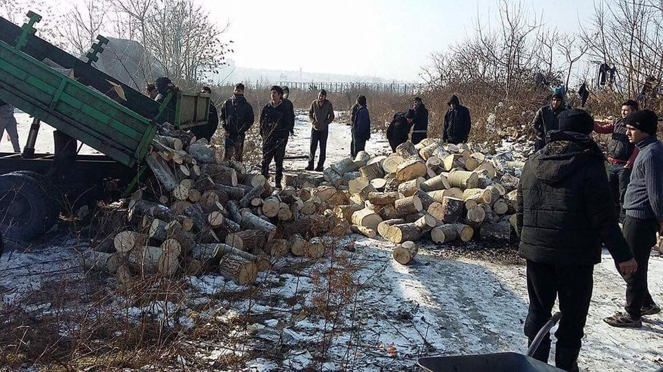
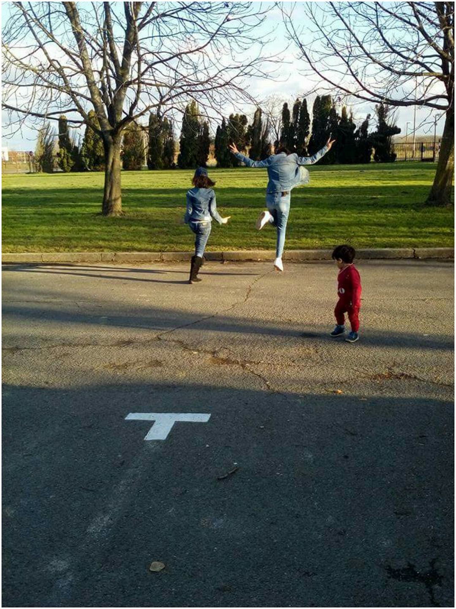

### AYS News Digest 27\.1\.2017— the road to safety is longer than most people think\.

](assets/82117f85971c/1*jP-qensLYPoAd4c0C6NzDg.jpeg)

“How can you judge us?” Photo Credit: [Abdulazez Dukhan](https://www.facebook.com/throughrefugeeeyes/photos/a.267469110309533.1073741828.266986607024450/452144841841958/?type=3&theater)
#### _FEATURE_
### Tragedy in Sweden highlights the long, perilous road from harm\.

A great tragedy in Sweden as three refugee boys attempted suicide, with one dying and the others remaining hospitalized in critical condition\. The boys were in a “home for care and living” for refugee minors\. Initial reports presented the three as having a suicide pact, but later details clarified that they were, rather, inspired by one another\. The boy who died is reported to have been having problems with his family and suffering extreme psychological distress over the potential risk of being deported\.

> Let this remain a sobering reminder that the road to security for refugees is much, much longer than the physical journey to their location\. For as long as the policy for resettlement in European countries remains tenuous and oriented towards pushing out “undesirables,” these stressors will remain and refugees will remain in unsafe circumstances\. 

In the context of the horror people are fleeing as well as the period of intensive trauma that characterizes the journey to reach Europe, it is, sadly, no wonder that many succumb to misery and despondency\. As the network of refugee support across Europe continues to develop, it is crucial to maintain contact and provide support to people in every community\. Additionally, may this be a catalyst for citizens to pressure their governments to prioritize humanity in the face of ever\-growing hostility\.

](assets/82117f85971c/1*ShUT9siIazzXZWMdIQ6WlQ.jpeg)

Photo Credit: [Abdulazez Dukhan](https://www.facebook.com/throughrefugeeeyes/?fref=nf)

[The court trial against Fredrik Önnevall](http://www.dn.se/kultur-noje/fredrik-onnevall-jag-har-aldrig-angrat-att-jag-tog-honom-med/) , a Swedish journalist who together with his team took with him a young boy in the spring of 2014 while filming a program for SVT and traveling through Europe to investigate right wing populism and racism, started this week\.

Önnevall states that he does not regret his actions, even though he is being accused of people smuggling\. Abel, the boy Önnevall and his team from SVT are accused of having smuggled across Europe, now lives in a Swedish family and goes to a Swedish school\. The boy and the man are still in contact, but they do not talk about the court case\. Önnevall says he does not want Abel to feel any guilt at all\. He will also accept the Decision handed down by the court, even though he might appeal against it in the Supreme Court in the event that he and his two less well\-known colleagues are convicted\.

Önnevall and his two colleagues claim that what they did is morally right\. The prosecutor claims that they committed a crime\. According to the indictment, they “intentionally, jointly and in concert” helped the boy to travel through Italy, Austria, Germany and Denmark before they took him across Öresundsbron to Sweden\.

What makes the case unique is that the smuggling \(transportation\) took place over several European borders\. This is something new in Sweden\. Whatever the decision, this court case will set a precedent\.
### GENERAL

People are encouraged to document and report all push\-backs and expulsions across the Balkan Route\. Welcome2EU has a comprehensive guide to reporting pushbacks and expulsions available in English, Farsi and Arabic\. Please [share](https://live.w2eu.info/en/push-backs-and-expulsions/) it widely\.

**Phone Credit for Refugees** has published an urgent aid appeal in order to help them fill the gap\.

> We currently have a list of 793 people waiting for mobile credit\. The admin team have been working extremely hard around the clock to process requests and complete top ups when cash becomes available\. To clear the current list we need to raise at least £16,000, as quickly as possible\. We appreciate the dedication of our members and once again ask for your support, to help vulnerable people stay connected with their family and friends\. 

Go to their page to find out how to support [them](https://www.facebook.com/top.ups.for.refugees/photos/a.234342526942293.1073741829.230826937293852/373597619683449/?type=3&permPage=1) \.

_For leaders, “solutions” mean keeping people out, not helping them\._

Europe is searching for new ways to send refugees and migrants back\. In a meeting on Thursday, various interior ministers from the EU made preparations on Malta in anticipation of a summit which will take place this Friday specifically designed to address the “central Mediterranean route\.” One of the proposed “solutions” is the creation of more refugee camps in North Africa\.

In the words of German Interior Minister Thomas de Maziere: The people taken up by the smugglers need to be saved and brought to a safe place…Then, from this safe place outside Europe, we would bring into Europe only those who require protection\.

The urgent emphasis on “outside Europe” would indicate that the priorities of these representatives focus first on protecting Europe and only after that protecting people\. Source: [Politico](http://www.politico.eu/article/malta-calls-for-new-ways-to-send-back-more-migrants-europeaan-commission-north-africa/) \.
### GREECE

_New developments for Afghan refugees in Greece anticipated_

The following is a report from Marina Liaki:

> Greek police officials meet Afghan officials to discuss migration, return of nationals 

> High\-level officials of the Greek police met with top Afghan officials to discuss the management of Afghan migrants living in the country and the return of those whose asylum application will be rejected, in a meeting which is significant in the management of migration, the citizen protection ministry said on Thursday\. 

> According to information, the Afghan government is preparing to open a diplomatic mission in Athens, which will greatly facilitate Greece’s efforts to return failed asylum seekers\. The country currently only has diplomatic missions in Brussels and Sofia\. The Afghan delegation was headed by the Director General of Consular Affairs of the Ministry of Foreign Affairs, Mirwais Samadi, while the Greek side was headed by Lieutenant General Zacharoula Tsirigoti, who is Head of the Immigration and Border Protection Division\. 

> The foreign dignitaries were briefed about the number of Afghan migrants residing on the islands and mainland Greece and then both sides suggested ways to manage issues that arise from their residence in the country and the procedure to return irregular migrants\. 

The next installment of NewsThatMoves’s “In the Loop” has been published, focusing on the feedback provided by refugees residing in Greece\.

](assets/82117f85971c/1*KzOp3g3aMApH0iofXpi8Gw.png)

Photo Credit: [NewsThatMoves](https://newsthatmoves.org/en/in-the-loop-32-cash-accommodation-minorities-at-sites/)

**Volunteer Call**

Mobile Info Team is looking for volunteers to join their team in Greece\!

Human Rights and Asylum Law Enthusiasts\!

> [Mobile Info Team for refugees in Greece — الفريق المتنقل لمعلومات اللاجئين](https://www.facebook.com/mobileinfoteam/) is looking for long term volunteers to join its case workers team ASAP\. 

> Minimum 2 months commitment, ideally 3, preferably with some experience on asylum law and procedures or, at least, a huge interest in the subject\. Needs to be organized, structured and responsible\. 

> We provide free accommodation, food, and a great team spirit in our shared apartment in Thessaloniki\. 

> If you think you are fit for the job, please drop us an email at mobileinfoteam@gmail\.com, we are looking forward to hearing from you\! 

Firewood distribution in Belgrade by People in Motion
### ITALY

_Updated asylum requests and rejections as well as schisms between volunteers and agencies\._

[Vie di Fuga](http://viedifuga.org/richieste-dasilo-ed-esiti-2016-90-500-domande-esaminate-respinte-il-61/) analyzed Italian government documents to provide a comprehensive report on asylum applications and rejections, a translation is provided below:

Record of requests examined and record of rejections\. In 2016, the Italian territorial commissions considered 90,473 protection requests, against 71,117 in 2015 \( \+27%\) and 36,270 in 2014\. The number of rejections was 55,425 last year, 61% of the requests; in 2015, this percentage was slightly over 58%, in 2014 39%, in 2013 29% and 2012 \(the year of “the North\-African emergency”\) it was barely 21%\.
In the past two years the rate of requests where refugee status was granted was cut by half: it amounted to 5% of the requests examined in 2016, while in 2014 it was 10%\. The same goes for subsidiary protection, where the rate fell from 23% in 2014 to 12% in 2016\.
In 2016, 123,482 asylum requests were submitted, 47% more than in the previous year\.
\- landed people: 42,925 \(2013\), 170,100 \(2014\), 153,842 \(2015\), 181,436 \(2016\)
\- asylum seekers: 26,620 \(2013\), 63,456 \(2014\), 83,970 \(2015\), 123,482 \(2016\) \.

In **Como** , volunteers and INGOs are again at odds as some volunteers in the Regina Teodolinda campaign have decided to walk out\.

_Four months after the centre’s opening, the coordinator of “camerieri del sorriso” Mariateresa Carminati announced she would leave the operation\. One reason \(among many\) is the prohibition by Red Cross supervisors not allowing the volunteers to give information on legal assistance to a couple of Pakistani individuals\. So far, 150 volunteers are engaged in the distribution of meals, but around 80 may be leaving too\. The service will continue in spite of this\._

](assets/82117f85971c/1*4uIAmMmpaV621hSuTe7pXw.jpeg)

Photo Credit: [Osservatorio Migranti Como](https://www.facebook.com/osservatoriomigranticomo)

Action in **Genova** as dozens of posters appeared overnight in symbolic locations throughout the city\.

_The pictures bear witnesses to the suffering of thousands of migrants crowding the European borders: long queues for food under the snow, hungry children, improvised dormitories, barbed wire\. Under the images, the title “Europe 2017”, along with messages such as “In memory of our conscience” or “Short Memory Day”\. The posters are signed by the autonomous group Aut Aut which launched a provocation on International Remembrance Day in order to make people reflect on what is happening around us, now\._

Translated from: [Era Superba](http://genova.erasuperba.it/notizie-genova/giornata-memoria-nostra-memoria-corta)
### AUSTRIA

_Miracle in Austria — deported family allowed to return\._

Saving the best for last — a hopeful miracle in Austria\. At long last, a positive decision coming in the wake of deportations that happened throughout 2016\. One family that had been deported from Austria to Croatia and was anxiously awaiting the decision has been informed that they are entitled to return to Austria\! It is hoped that this case will set a precedent and that all of the unlawful deportations will be resolved in a similar manner\. For full details, refer to Refugees Spielfeld [page](https://www.facebook.com/RefugeesSpielfeld/photos/a.1631564003770749.1073741829.1631251033802046/1823814911212323/?type=3) \. Are You Syrious is happy to have been able to provide support to this family while they awaited their decision in Zagreb and wishes them a happy settling into their new home\!

Family celebrates the good news\. Photo Credit: Bordercrossing Spielfeld

_Converted [Medium Post](https://areyousyrious.medium.com/ays-news-digest-27-1-2017-the-road-to-safety-is-longer-than-most-think-82117f85971c) by [ZMediumToMarkdown](https://github.com/ZhgChgLi/ZMediumToMarkdown)._
