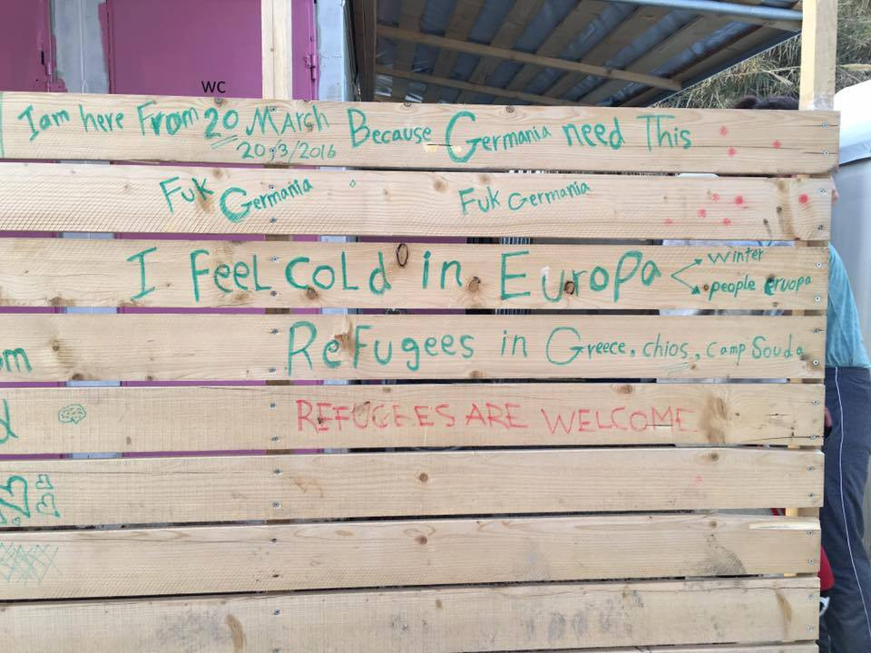
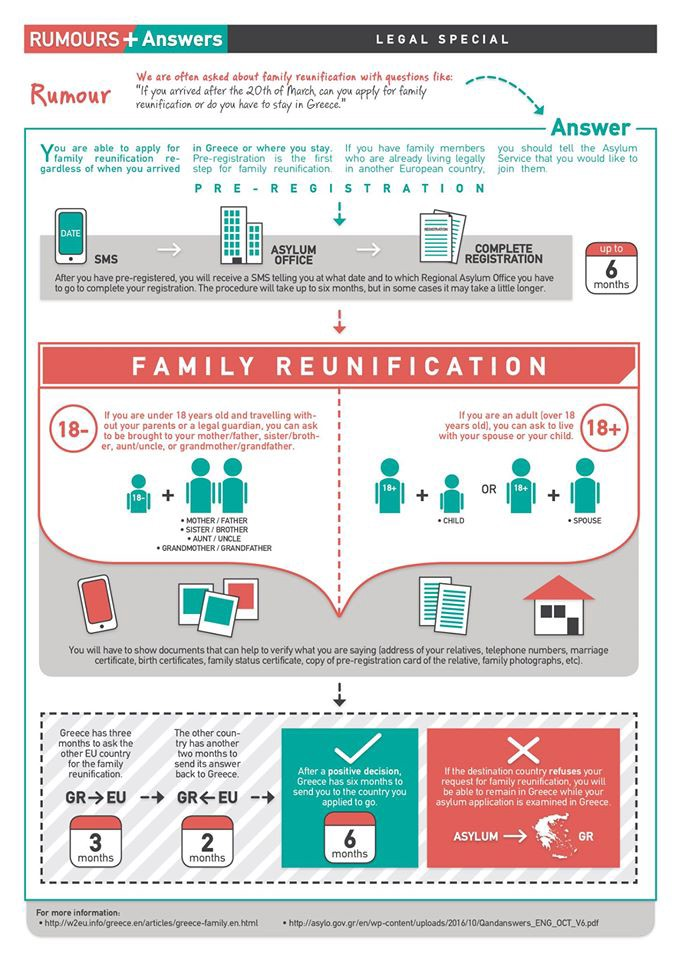

### AYS DAILY DIGEST 30\.1\.17 — Third man in Moria Camp dies, another hospitalized\.

#### Feature

A third man has been found dead in Moria on Lesvos\. An additional 2 people have died this week, one in Samos and one in Ritsona\. The tentmate of the deceased has been hospitalized\. With three dead and another sick on Lesvos, the story has begun to build panic and the Greek Minister of Migration has called for an investigation\. These deaths are bringing attention to the elephant in the room — namely, the poor shape of accommodation in the camp, and especially, the poor job they do of sheltering refugees from the elements\.

“We wonder how many deaths it will take for the government to wake up,” said Stavros Theodorakis, leader of the To Potomi party\. The two prior deaths, of people living in the same tent, were reported by Greek media as the result of fume inhalation\. The police currently believe that the victims, before going to sleep, had moved a coal burner into their tent to provide the tent with better heating\. The tent’s poor ventilation, it is believed, caused carbon monoxide poisoning\. The coroner’s tests have been inconclusive thus far\.

Regardless of the exact cause, the ultimate responsibility likely falls on the authorities’ failure to provide refugees with livable conditions\. In the first two deaths, if they were indeed the result of carbon monoxide poisoning, the tragedy could have been avoided if the refugees were being accommodated in well\-insulated structures with proper air circulation\. The problem is further exacerbated by the overcrowded conditions in the camps, and Greek authorities’ failure to transport more refugees to the mainland\. Many of the camps on the islands are over capacity, meaning that already scarce resources have to be distributed for a greater number of people, which of course increases the risks to peoples’ lives\.

We can only hope that the man currently hospitalized recovers, and that reforms are made to further prevent easily avoidable deaths\. Looking at the Greek government’s current track record however, one is unfortunately not filled with hope of a better future\.
#### Greece
### Photos from Souda Camp capture the precariousness of life on the islands

Sometimes, it is difficult to believe just how bad conditions are on the islands\. As the old saying goes, a picture says a thousand words\. These refugees live in shoddy tents right on the shore, and their only source of heating is a weak fire burning under the ruins\! When we speak of unacceptable conditions, this is what people should keep in mind\. Fortunately, most refugees are not quite this poorly treated, but the failure of the system to care for even a handful of helpless people should be taken as an affront to all\.

### New edition of Rumour Debunkings released

A higher resolution image, as well as the poster in Arabic, Greek, and Farsi, may be downloaded [here](https://drive.google.com/drive/folders/0B-_rJ_0o5IZIQlkzSXB6UHAwM2c) \. Those who wish to receive the posters as they are released may sign up for the weekly mailing list [here](http://eepurl.com/b-LtBj) \.
### Classes for refugee children open in Athens

Located at 40 Akominatou Street, the classes are open to refugees aged 6–17, with the goal of getting them to a level where they may enroll in Greek schools\. A second location will open in February at 34 Koletti Street\. The classes will take place from 4pm to 8pm, Monday to Friday\. More information may be found below\.

### InterVolve releases class schedule in Softex for next week

### Numbers

According to official figures, there have been 92 registrations, 40 on Leros and 52 on other islands\. There have also been reports of 30 arrivals on Lesvos\.

A total of 257–287 refugees have arrived on Chios in the month of January, depending on which source is referenced\.
### EKO Kitchen to cease operations in Vasilika

### Support group for LGBT refugees in Greece founded

The group, which has been active since August, may be found on a closed Facebook page [here](http://www.facebook.com/groups/LGBTrefugeesgreece) \. The group also launched a helpline in December, available for both Arabic and Farsi speakers\. Telephone numbers are as follows:

30 69 45 24 76 13 \(Arabic العربية/English\)
30 69 48 59 43 77 \(Farsi فارسی/English\)

They may also be reached by email at LGBTrefugeesgreece@gmail\.com\. All communications are of course kept strictly confidential\.
#### Serbia
### Cars of Hope Wuppertal begins soup kitchen project in Belgrade, asks for your support

Their statement, which may be read below in the original German, is as follows:

> _We have begun work in Belgrade\. Together with Soulwelders and refugees, we hope to build a soup kitchen here\. It is very cold here and just about everything is running short\. We will also build and distribute furnaces because of the cold\._ 

> _The direct consequences of EU border closure are plain to see: hunger, cold, and the removal of peoples’ dignity\._ 

> _Through supporting our crowdfunding campaign or by making a bank transfer to our account, you may not only support our work, but you make it possible in the first place\. We thus ask for contributions to one of the following accounts\._ 

> _Cars of Hope also has a crowdfunding campaign for its work with refugees in Greece and Serbia, [here](https://www.youcaring.com/cohrefugeeaid) or through one of the accounts provided before\._ 

> _Paypal account: carsofhopewtal@gmx\.de_ 

> _Bank account:_ 
 

> _Account holder: Sozialtal e\.V\._ 
 

> _Iban: DE80 3305 0000 0000 6968 49_ 
 

> _Bic: WUPSDE33XXX_ 
 

> _Purpose: Cars Of Hope_ 

#### Mediterranean
### Mediterranean deaths continue to steadily rise

Although far fewer people undertook the Mediterranean crossing in 2016 than 2015, larger numbers of people were killed en route to safety in Europe\. This trend is not showing signs of improvement, in fact it appears to be worsening\. Statistics compiled by the International Organization for Migration \(IOM\) show that 246 people were reported dead this month as of January 25, compared to 210 through January 25, 2016\.

These deaths, it should be pointed out, are completely avoidable and could be reduced significantly, if not completely, by giving refugees the ability to come into Europe by other means\. Though the smugglers whose actions directly bring about the regular sinkings along the route are directly responsible, it is important to remember that smugglers are empowered by EU policy which does not give people alternative courses of action\. Europe’s lamentations of death will be empty of meaning so long as European actions continue to put people in situations that do not allow them to reach safety and livable conditions\.
#### EU
### European Commission reports progress in the formation of a new Border and Coast Guard

The European Border and Coast Guard currently has 1,550 officers deployed, according to an [official press release](http://europa.eu/rapid/press-release_IP-17-123_en.htm) \. The agency’s unique role gives it the power to operate in third countries, and it was founded precisely so that it could operate where Frontex could not\. Its main role, however, seems to be in carrying out deportations\. Since October 2016, the agency has deported 3,421 refugees to the country in which they were fingerprinted, a greater amount than all such operations carried out in the whole of 2015\.
#### UK
### Rooms offered to those stranded in the UK because of Trump immigration ban

Those who find themselves unable to return to the US because of Donald Trump’s racist policies can have one fewer thing to worry about, with sympathetic people from London and the UK in general offering their rooms until such people may return home\. The efforts are being organized in a Facebook group, which may be found [here](https://www.facebook.com/groups/378076582572742/) \.
#### Canada
### Black Lives Matters in Toronto calls for action against Islamophobia and racism

_Converted [Medium Post](https://areyousyrious.medium.com/ays-daily-digest-30-1-17-third-man-in-moria-camp-dies-another-hospitalized-b3681955a3df) by [ZMediumToMarkdown](https://github.com/ZhgChgLi/ZMediumToMarkdown)._
