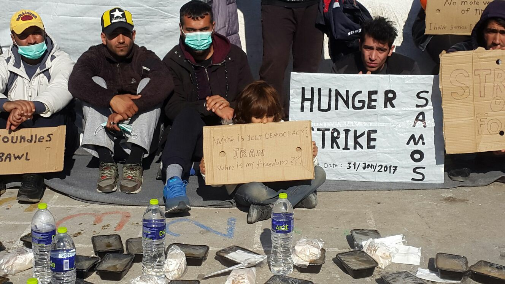
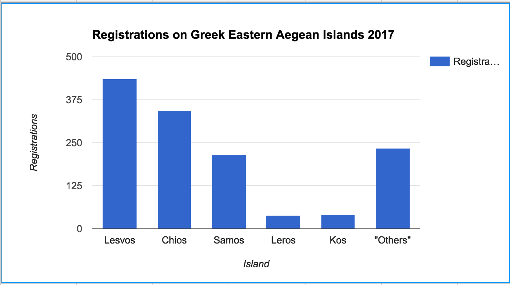
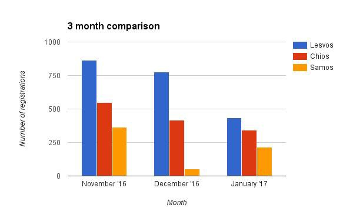
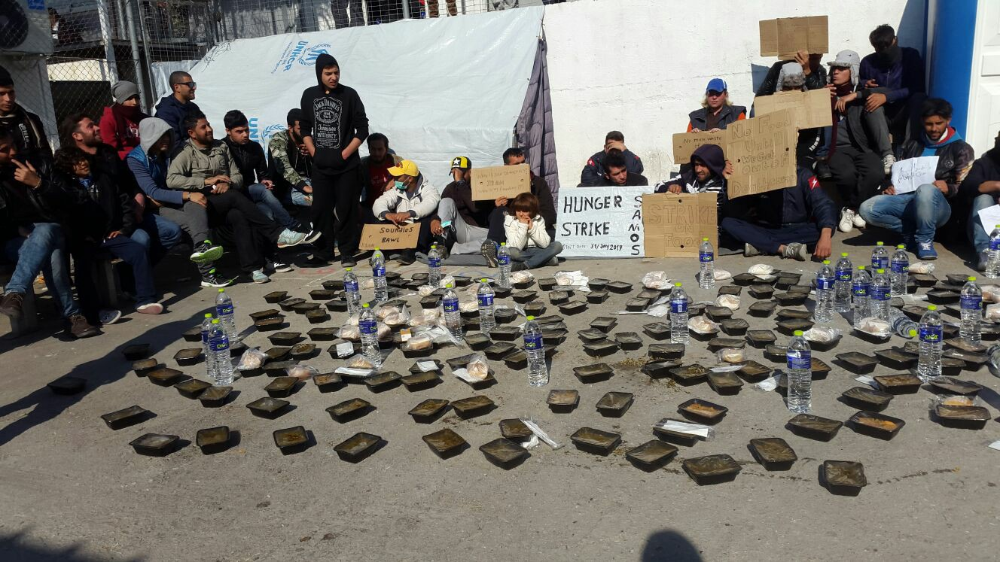
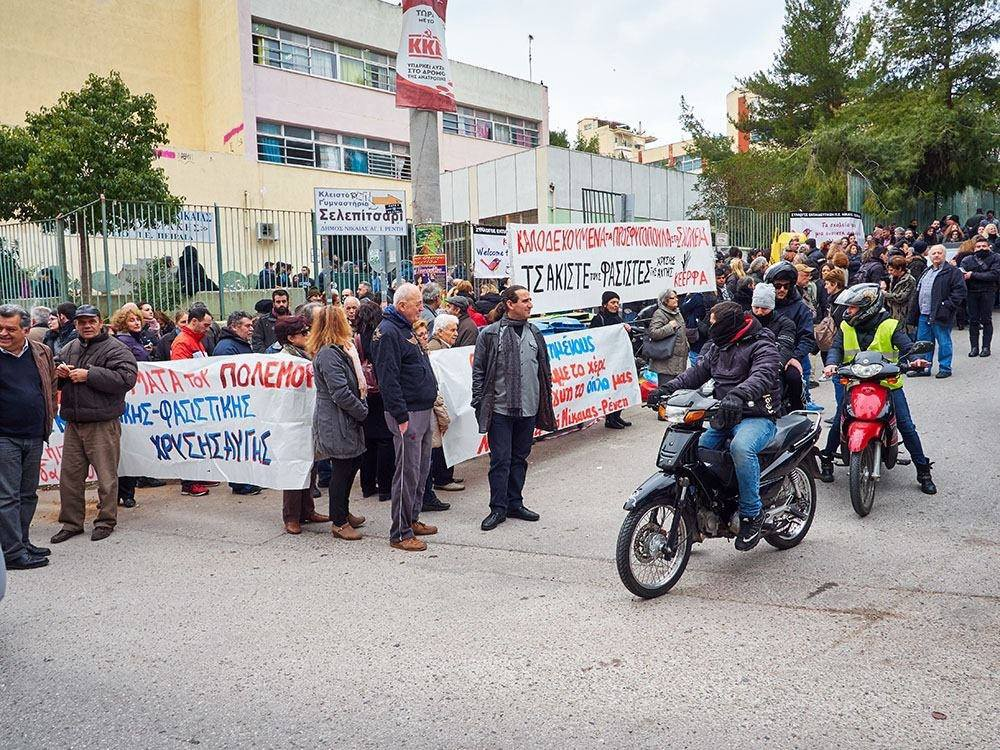
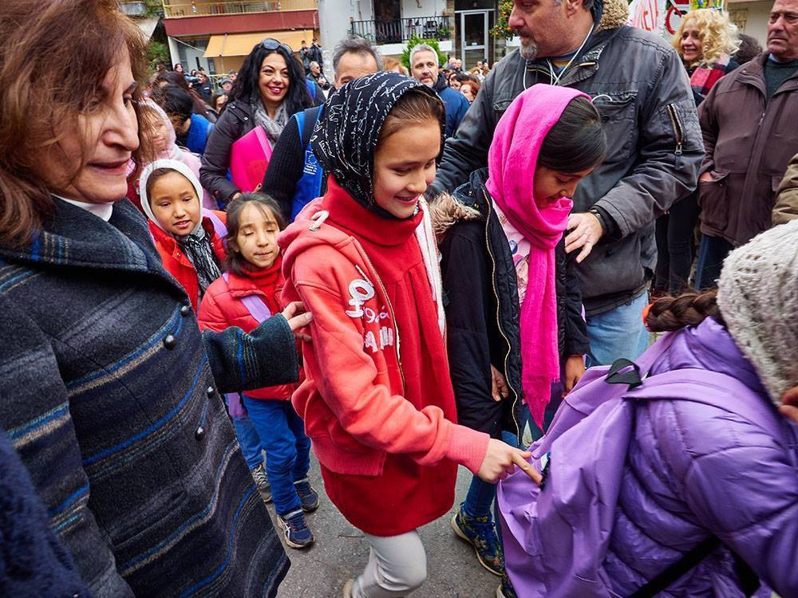
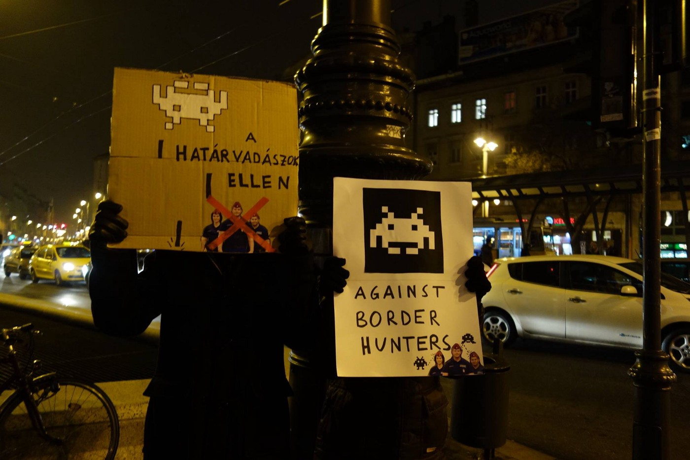
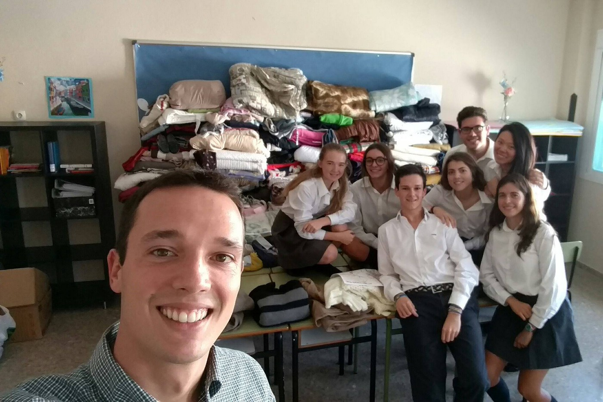
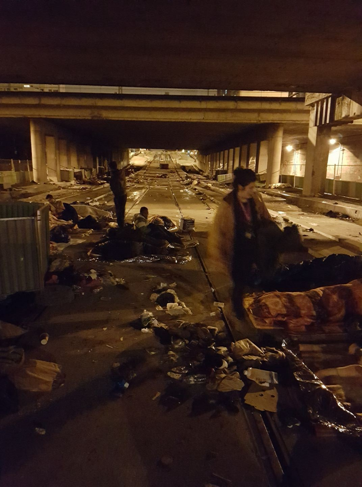

### Are You Syrious Digest 31/1: “Alternative facts” and the European way

Hunger strike Samos\. Photo by Hassem Ghafelpour
### FEATURE

Frederica Mogherini issued a statement in reference to the suspension of refugee admissions ordered via executive order by Donald Trump last week\.

A selected transcript follows:

■■■■■■■■■■■■■■ 
> **[Federica Mogherini](https://twitter.com/FedericaMog) @ Twitter Says:** 

> > #EU will continue to host refugees. It's our identity: we celebrate when walls are brought down &amp; bridges are built https://t.co/qaprF2C4Tc 

> **Tweeted at [2017-01-30 18:14:40](https://twitter.com/federicamog/status/826131530271514624).** 

■■■■■■■■■■■■■■ 

> \[President Trump’s policy\] is not the European way for sure\. The European Union will continue first of all to take care of and host Syrian refugees and other refugees fleeing from war…\. 

> The European Union strongly believes in a system that is based on international rules and norms full respect of all individuals regardless of their religion of their ethnic background of their country, or nationality, or gender\. 

> … in Europe we have a history that has taught us that every time that one invests in divisions, and walls, you might end up being in a prison if you build all walls around you\. 

As elegant and high\-minded as these words are, when juxtaposed with the reality of the European Union’s response and current course of action in the refugee crisis, they become little more than a cruel joke\.

Since early last year, refugees from “dispreferred” countries such as Pakistan and Iran have been consistently excluded from safe passage\. Anecdotes of language tests with assessors being non\-native speakers and yet having full power to determine’s someone’s nationality based on linguistic evidence spring to mind\.

As refugees stand in front of piles of razor wire and are brutally captured and pushed back, deceived by authorities, humiliated, terrorized throughout and at the borders of EU countries such as Hungary, Croatia, and Bulgaria \(among others\), these lovely words about resisting walls rapidly descent into complete absurdity\.

The high\-minded solidarity seems to come with a side of Frontex cooperation in patrolling and hunting for those pushed to the margins of the world, all designed to keep these undesired people out\. President Trump gave a great gift to more than those in his staff and party, lowering the bar of “humanitarian care” to new lows\. Congratulations, Europe, your values stand strong\.
### GREECE

From 1\. to 31\. January 1311 newly arrived people have been registered on the Eastern Aegean Islands according to official figures\. 436 on Lesvos, 344 on Chios, 215 on Samos, 40 on Leros, 41 on Kos, 235 on “others”\.

376 people returned voluntarily, 64 were deported to Turkey\.

Summary of registrations for 2017

This is a sharp decline in the last three months, when as can be seen via the following graph:

### Vathy

UNHCR Senior Communications Officer, Roland Schoenbauer roundly criticized official response of the managers of Vathy camp in Greece, which is severely underheated\. Mr\. Schoenbauer reports that UNHCR attempted to provide heaters, but [was awaiting official approval](https://twitter.com/R_Schoenbauer/status/826315430562234368) \.
### Samos

Samos Volunteers released a statement in regards to their recent purchasing of toilet paper for the RIC\. The volunteers collected 500 euro and have purchased enough supplies to last a significant while there\. A “continuous lack of toilet paper” had been noted by volunteers for a month by this point\. This lack contributed to dangerously unhygenic conditions, but was never addressed\. Andrei Bogdan authored the plea that was endorsed by Samos Volunteers:

> We have pleaded so many times for bigger supplies of these basic items with no result\. We’re now in a situation where we are facing the exasperation of people in the camp on a daily basis\. In recent weeks, we have seen a significant decline in the number of people coming to our hygiene window, likely due to the fact that we have to refuse to so many the access to basic hygienic items: ‘Mafi toilet paper, mafi shampoo, mafi washing powder, mafi, mafi, mafi…’ The list is ever growing, as is the number of people leaving with their heads down, disappointed, frustrated, and losing faith on those who they have relied on to accommodate them\.
 

> …\.
 

> Everyone should take a minute and reflect on the fact that a small group of volunteers with very limited funding is covering for a big part of the NFI needs for people in the camp\. This is not a new thing; it has been happening for months now, despite the EU funding and increases in the number of staff and capacity of the agencies managing the camp\. And please, do pass this information to your central offices, we are most curious to hear what they have to say\. 

### Hunger Strike

Around 100 individuals from Samos camp has commenced a hunger strike to protest to, among other things, request that authorities speed up the interview process\. According to a member of the strike, Hassem Ghafelpour, the process wait time is six more months for most, at least\. The use of flimsy summer tents mean that individuals in Samos, like throughout Greece, have been waiting in sub\-zero weather in structures where their breath can be seen\. Again, hygiene is another concern for these residents who lack a warm shower\. Another problem relates to inadequate medical — there is no easily\-accessible “special doctor or surgeon” and it is common for medical appointments to be on a months\-long timeline\.

Strike participants had previously attempted to reach out to authorities including UNHCR, but after receiving no concrete action in any demands, are hoping that this dramatic decision will help wake up some sleepy heads in offices\.

> we can’t do anything to send you
 

> but we will do it until we faint one by one 

Photo Credit: Hassem Ghafelpour

The European Commission has announced plans to speed asylum procedures for those on the [islands and transport them](https://www.facebook.com/refugee.info/photos/a.1063678090359004.1073741829.950581228335358/1294755507251260/?type=3) to the mainland as quickly as possible\. It is unclear how this is to happen without protracting the asylum process for those already on the mainland\. Additionally, it is important to note that this development has been promoted in conjunction with a move to evacuate the islands in anticipation of the 2017 tourist season\. It appears that money talks more than people, still\.

Solidarity actors blockading refugee children from anti\-refugee protestors\. Photo Courtesy of Aggelos Kalodoukas
### School Days

More and more children are getting the opportunity to return to school, in various ways as reported below\.

Wonderful news via Art Against:

> Athens, Greece 31 January 2017
 

>  The 15th Primary School of Nikaia neighborhood welcomes the refugee children to attend class\. After several attemts by Golden Dawn’s members, with brutal attacks, to block the entrance of refugee children in Greek schools, people unite with teachers and parents to welcome the children with balloons and songs\. In solidarity we trust\! 

Photo Courtesy of Aggelos Kalodoukas
### HUNGARY

Another installment of the “Space Invaders Against Border Hunters” protests in Hungary took place in order to raise awareness of the recent horrific reports of violence against individuals at the Hungarian\-Serbian border\.

Photo courtesy: MigSzol Csoport
### ITALY

Devastating news out of Italy as it was reported that a young Eritrean committed suicide after remaining in a reception center for refugees and migrants\.

> He had been in Italy since 2011, in Milan for a year, in the receiving centre for asylum seekers in Via Aldini: his mates and the operators found him dead in a courtyard on 29 January, right after 13\. He’s a young Eritrean, his name was Mussie: from the first report by the police, he threw himself from a window of the building\. The guy was in the ethno\-psychiatric division in hospital Niguarda\. There, the doctors were trying to help him recover from the traumas from his voyage from Africa to Italy\. 

> This death casts the alarm on the situation of aid for the refugees reaching the city after long and painful experiences\. The local government’s welfare assessor Pierfrancesco Majorino stated: “there is a need for stronger instruments to face the topic of people marked by psychiatric issues\. These people have more and more necessity of assistance and help”\. Mussie was in the receiving centre managed by Fondazione Progetto Arca, after four years in Bari he had attempted to move to Czech Republic\. Once reached the country, he had requested international protection, but he had been sent back to Italy, ending up in Milan\. 

Report translated from [Repubblica](http://milano.repubblica.it/cronaca/2017/01/29/news/milano_profughi_comune-157151008/) \.

Yet once again, where institutions fail, humanity starts to glimmer\. El Altillo School, Jerez de la Frontera, \(Spain\) collected and sent hundreds of jackets, pants, gloves, hats etc to Ospiti en Arrivo in order to help those dealing with the brutal cold there\.

Bravo, friends\! ❤
### GERMANY

Afghanistan Migrants Advice & Support Org reports that an “unconfirmed” number of individuals from Afghanistan were set to be deported from Germany on the 31st\.

> Those being deported today includes a brother and sister who have never been to Afghanistan before\. Their family still live in Denmark\. 

> IOM as the organization responsible will be taking care of them concerning the accommodation and financial assistance for the first two weeks\. AMASO will stay in touch with the siblings and provide further assistance if needed\. 

It is curious about how the deportation of a specific nationality squares up with the EU’s non\-partisan vision\.
### FRANCE

### Paris

The following is a volunteer report from Paris:

After the bitter cold, temperatures have risen in Paris but now is the rain causing problems to refugees on the streets\. 43 refugees were queuing for the asylum services to open after the weekend closure and they very little shelter\. Volunteers have been placing tarps and plastic sheets to provide cover from the rain as well as the usual items like blankets, sleeping bags, winter clothe, food, etc\. Refugees were very thankful for these efforts\.

Around Hidalgo centre there were few people as the police told everyone to not queue in front of the centre because of the bad weather and take shelter under the bridge next to it…ironically the same bridge that was “evicted” a couple of days before in another demonstration of force with some improvised shelters being destroyed…refugees obviously returned to the spot afterwards to spend the night like they have done for weeks or months\.

That night there was more people than usual under the bridge and there were a few minor health problems amongst refugees\. Volunteers helped treating foot injuries, like wounds and nasty skin infections and advised the most serious cases to see a doctor\.

> This is a subject that should be pointed out as there is NO medical assistance outside the “bubble” and refugees tend to prioritize queuing to get in the centre rather than looking after their own health\. 

PRGS accounts the numbers of refugees they find on the streets every night and after a reduction during the coldest days of the past 2 weeks the numbers are on the rise again with the figures above 200 in the northern part of paris\. Even with Utopia 56 taking dozens of refugees to hotels every night so help and donations are needed although we have to point out the huge wave of solidarity from Parisians and foreign volunteers from various groups that have looked after all these people in the last week giving out warm clothes, food, etc\.

This situation and that in Belgrade bear a striking resemblance to each other as institutionalization of the refugee response is resulting in pushing more people to the margins and further away from crucial assistance\. It will take lots of strength and love to press through these trying situations where both refugees and those who try to help them are pushed away and subjected to pressure by various entities\.
### Calais

Clare Moseley of Care4Calais reports that Calais is rapidly deteriorating and by all indicators is now “worse than ever\.” As more children and young people escape their designated centers upon learning they will be prohibited from entering England and hiding\. Even the relative shelter provided by the Jungle is removed after the systematic targeting and destruction of the area\.

> At least 10–12 new refugees arrive in or around or pass through Calais every day
 

>  200 refugees living in the smaller camps in Pas de Calais, plus 100 in the Calais town area, of which at least 50 are unaccompanied minors
 

>  1,300 living in wooden huts in Dunkirk, steeped in infectious black mould sleeping up to 10 refugees each, including children
 

>  Over 1,000 unaccompanied refugee minors scattered across France who are now giving up hope and in a precarious state
 

>  400 refugees sleeping rough in Paris 
 

>  2,000 refugees outside of the CAOs system across France
 

>  Many unaccounted for in detention centres in Lille, Paris and Calais 

Those who wish to support the ongoing efforts to support these people on the run yet again can go to Care4Calais\.
### UNITED STATES

Important information for refugees from the ACLU which is currently working to represent cases of discrimination in the wake of President Trump’s disastrous executive order\.

Photo Credit: ACLU

As has been demonstrated through these collected stories, it is truly puzzling to compare the reality of refugees in Europe to the noble sentiment espoused by EU officials\. The first step towards real change is full transparency — to continue to shroud the harsh truth in a slick sugar shell only will hurt all\.

_Converted [Medium Post](https://areyousyrious.medium.com/are-you-syrious-digest-31-1-alternative-facts-and-the-european-way-76211440b7ac) by [ZMediumToMarkdown](https://github.com/ZhgChgLi/ZMediumToMarkdown)._
