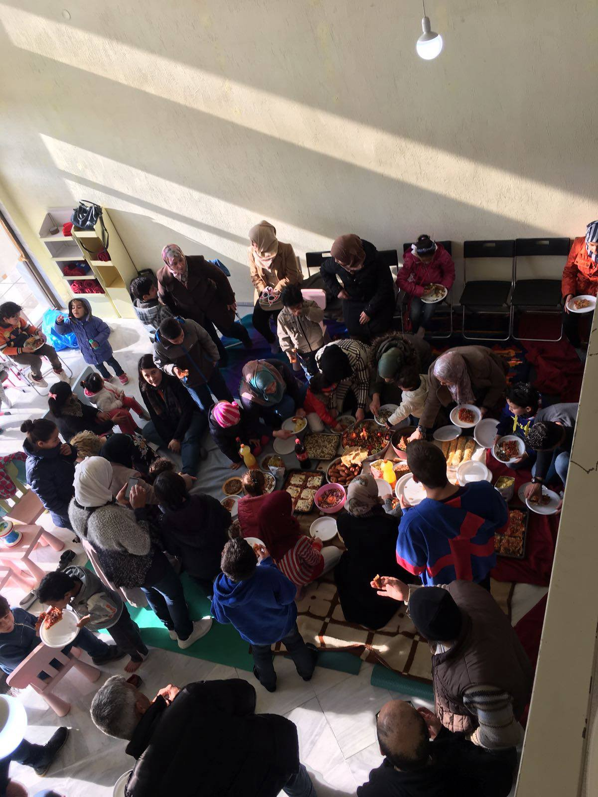

### AYS DAILY DIGEST 2/2/2017: The explosion of a train wagon in Šid leaves six people badly injured

_Desperate people forced to take dangerous roads // Closed borders are putting human lives in danger // People in Greece are being slowly moved from camps in mainlands and islands // Help needed in Serbia, even though the government is still doing everything to prevent volunteers from bringing it // Hate propaganda by Serbian media // Police in France continues to hunt refugees // Council of Europe condemns detention of people in migration_

](assets/5fb4a8cc8067/1*Q-BgFxM5S4LPCGl5ICUOUg.jpeg)

“Two different sides of reality, broken one and megalomaniac imagination one in a simple message\. Both trapped in the mud, down by the Belgrade waterfront\. The truth is somewhere else\. And future became legendary… Belgrade, January 2017\. A note from the refugee tragedy…” Copyright: [Igor Čoko](http://www.igorcoko.net)
### FEATURE
#### Serbia

Two people are in life\-threatening condition after the explosion of a train wagon this morning in Šid, Serbian media are reporting\. Four more were injured in this accident which occurred after they tried to board a train heading Slovenia by to climbing on its tank, according to early reports\. High\-voltage wires hanging above the train wagons seem to have been involved in the explosion\.

_“They are in critical condition, are connected to mechanical ventilation and respirator and under constant supervision,”_ Irena Jozić from the Emergency Center in Belgrade told the media\.

The identity of people who were injured is still unknown, but their estimated age is 23 to 25 ​​years\. The train Station where the explosion occurred was not near the refugee reception center in Šid\.

These refugees likely would never have attempted to board the train if the borders were not closed to people who are in need for shelter\.

We will update this report with new information, when available\.
### Mediterranean

Another rubber boat was found in the sea overnight\. A rescue team saved 120 passengers and brought them to safety\. Among the passengers were many children\.

Photo by MSF Sea
### GREECE
#### People moved from camps to hotels and apartments

After many promises, it looks like people are slowly being moved from camps into more human accommodation\. However, the winter is almost over in Greece, and these people have been living in camps for over a year, in some cases\.

According to volunteer information we gathered, there were 30 people in Vasilika camp last Sunday, 350 in Softex, around 120 in Kalachori, 50 people in Oreakastro, 132 people in Frakapore, and only 5 in Sindos Karamanslis\. Apparently, all the people from these camps will soon be moved to hotels and apartments, or to other camps where winterization has been completed\.

Some camps are emptied in order to upgrade the infrastructure, like Katsikas camp\. [Refugee Support Organization](http://www.refugeesupport.eu/new-operation-at-katsikas-camp/) reports that some 400 to 500 people will be moved back in over the next 3–5 weeks\. This organization has been asked by the authorities to be “the lead NGO for food and clothing distribution”, and they are getting ready\. They are also renovating an empty warehouse on site and converting it into a place where food and clothing will be offered “with dignity\.”

We also received information that at the same time, people from the islands were already starting to arrive in the mainland, in groups of around 100 a week\. Some of them arrived in Athens, where they are being accommodated in apartments\.

[Movement on the Ground](http://www.movementontheground.com/donations) reports that some families are being moved from Moria to Kara Tepe\. Approximately three hundred people have been moved, largely families\. For the other 700 residents, winter tents have been provided\.
#### Back to school, finally

The Greek school year began in September, but every child is still not yet in class\. However, the Education Ministry is promising that some 10,000 children up to the age of 15 will be attending schools by mid\-February\. The Ministry is also working on a plan to provide vocational training to young people aged between 15 and 24\.

This should have been done long ago, but we hope that this time all the kids will finally go back to school\.
#### Important info for asylum seekers about legal aid by RefuComm

> Asylum seekers have the right to consult, at their own cost, a lawyer or other legal advisor on matters relating to their application\. Free legal assistance is only provided for judicial appeals before the Administrative Court of Appeals upon the applicant’s request and is subject to \(a\) an insufficient means test, establishing the applicant’s inability to afford legal representation; and \(b\) a merits test, determining that the application has a “probability” of success\. The choice of legal representative is made on the basis of a list drawn up by the relevant Bar Association\. 

> However, in order to submit an application for legal aid, the asylum seeker needs to hire a lawyer, he/she has no choice over his /her legal representative, as lawyers are appointed from the list designated by the Bar Association\. The low rates and the great delays in remuneration awarded to legal aid lawyers act as a severe disincentive for legal professionals to take up asylum cases, adversely affecting both the availability and the quality of free legal assistance\. In Greece, free legal assistance and representation in all stages of the administrative and judicial asylum procedure have always been provided by NGOs according to their capacity\. 

For a list of legal aid providers please [see here](http://refucomm.com/infopacks/greece-mainland/living-in-greece/legal-help/en/greece-mainland_living-in-greece_legal-help_EN.pdf) \.
#### Good news from Polykastro and Patras\.

In Polycastro, our friend from the [Open Cultural Center](https://www.facebook.com/OpenCulturalCenter/) welcomed first visitors at their community center\.

_“The children were full of laughter, and adults full of smiles\. We at OCC are so happy that, with your help, the center is going to be a success\! We’re very close to opening the center full time — next week the interior walls will be installed\!”_

Photo by Open Cultural Center

Another AYS friend, Rando Wagner, visited people at Patras this week, where he reported some small but significant improvements in their living conditions\. A Swiss grassroots aid group is now in one of the abandoned factories, and they are cooking one meal a day for the 100 mainly Afghan people living in the building\. Rando, with his small team, delivered help again\. If you want to help him to continue his amazing mission, [see here](https://www.gofundme.com/humansasone) how to do that\.
### Serbia
#### Alarming situation in Subotica

Another round of horrifying photos of refugees conditions have been released\. This time, they document the situation at Subotica, near the Hungarian border, where people are sleeping in the warehouse of an abandoned brick factory\. They lack access to sanitary facilities, and have only minimal food\. Some organizations are managing to distribute food once a day\.

](assets/5fb4a8cc8067/1*RHQ4ROT_VtdqHe00spDaaA.jpeg)

Photo by [Istočno evopska misija](https://www.facebook.com/misija.org/)

Meanwhile, the Serbian government continues to cause problems for all those who are trying to help people and bring aid\. We are hearing news about groups that have been stopped at the border while trying to bring goods for people who are living in inhuman conditions and sleeping out in the open\.

We remind you about the ways to bring aid into Serbia\. The following info has been gathered by the [SouldWelders](https://www.facebook.com/SoulWelders/) group:

> “You cannot transport second\-hand items across the Serbian border unless you get special papers from the commissariat of Serbia\. If you bring new items you will be charged duty on the border\. If you are an experienced aid worker and want to volunteer in Belgrade contact us as we are leasing a house here with a workshop\. 

> The northern border is needing hard boiled aid workers, they are undermanned, not for the faint hearted\. If you want to bring catering trucks again, you will need paperwork from the commissariat of Serbia maybe if you have connections with MSF or UNHCR this will be possible\.” 

Everything is needed, more or less\. To coordinate more clearly, please get in touch with a team in the field\.

Serbian authorities have decided to limit the freedom of movement for about 600 people at the new reception centre in Obrenovac, near Belgrade\. People will only be able to leave the centre with special permission of the camp managers, and only at certain times\.

No one will be allowed to leave the centre after 22\.00h\.

A bus service will be available every day at 10\.00 to bring migrants and refugees from Obrenovac to Belgrade and back\.

Authorities have justified the measure by pointing to an incident in the media in which a woman with three children claimed she was attacked in the street by refugees\. Thess types of media reports openly invite hatred towards refugees\.

However, this is not the only center in this country where people have limited freedom of movement\. The situation is very similar all over\.
### Italy
#### Baobab warning

[Baobab](https://www.facebook.com/BaobabExperience/) warns about imminent police action in Italy\. Apparently, some 95 people from Nigeria could be deported back to this country where life is extremely dangerous\. Follow their page to get more info\.
### France
#### No rest for people in Paris

The situation is not getting any better for people in Paris\. Group [Paris Refugee Ground Support](https://www.facebook.com/PRGS.team/?fref=nf) provides information about the government’s moves to help people sleeping in the streets\.

Photo by Danika Jurisic

_“Almost 2 weeks after the French Government’s ‘Big Cold Plan’ and the numbers on the ground did drop; but is this a real humanitarian response? On the 7th January 2017 MSF denounced the French authorities handling of the refugee crisis in Paris and the constant police brutality that people in the street have been suffering from daily\._

_The Government’s response was ‘the Big Cold Plan’ while the temperatures dropped\. The plan was to last 10 days and provided temporary accommodation for people \(refugees and homeless\) sleeping on the streets on a night\-by\-night basis\. Even on the coldest of nights, there were still people on the streets\._

_After calling the 115\-hotline 4 or 5 times over many days, people could not get through due to inadequate organization\. People who have been living on the streets for months don’t want to be reminded of all that they have lost since they fled their own homes\. To then be pushed back out on the streets come morning, hurts more than the cold ever could\. With temperatures above freezing, more are returning to the streets and the numbers have notably risen\._

_The problem is far from solved\.”_

The group reports that more people are sleeping rough in Paris, including women and children who are alone and who do not feel safe, even for a moment\.

_“MSF have been working with Utopia 56 to provide accommodation to help the people in the city streets, and Utopia 56 has done amazing work to help get these people into safe accommodation; the Government is relying on the work of these groups to save lives\.”_

[Timothy Perkins](https://www.facebook.com/timothy.perkins.77) reports on people sleeping rough, as well as on the living conditions in reception centers just outside Paris\.

_“On the 20th of January, the association BAAM sent a letter to public authorities denouncing the living conditions in the Massy Palaiseau center, managed by the “Secours Islamique”\. This letter was sent after a meeting with refugees themselves, who described several issues:_

_Since December 2016, no social worker is present and all tasks are handled by two security agents\. Food always arrives in insufficient quantities, and distribution times are extremely limited, forcing some of the refugees to go without\. The 70 people sleep, eat and live in one room and blankets have not been cleaned in three months, while only four showers are available\._ 
_Many other problems are described in the letter, including humiliations, verbal abuse, and punitive sanctions\. On New Year’s Eve, for example, some refugees arrived after midnight and were forced by the guards to sleep outside\. There has been so far no response or changes made to their living conditions\. Instead, police came to the center today and three supposed refugee “leaders” were brought to the police station, possibly in response to this letter\.”_
#### And more help is needed in Dunkirk

[Dunkirk Refugee Children’s Center](https://www.facebook.com/dunkirkrefugeechildrenscentre/?fref=nf) issued a call for the Play Therapists and other education professionals \(on a voluntary basis\) “who could contribute to putting together resources and activity idea packs to support our teacher and volunteers working at the Centre\.”

If you are interested, Email at [info@refugeechildrenscentres\.org](mailto:info@refugeechildrenscentres.org)
### Sweden
#### Border control to be extended

[Local media are reporting](http://www.thelocal.se/20170201/sweden-extends-border-controls-until-spring-2017) that Sweden will extend border controls and ID checks in the south by a further three months\. The border controls on the Swedish side of the Öresund Bridge to Denmark were brought in during the autumn of 2015\.

The European Commission allowed the same for four more countries, but Sweden was the first one to respond\.
### General
#### Migrant detention is a serious “human rights concern”

[The Council of Europe issued and statement](http://www.coe.int/en/web/commissioner/blog/-/asset_publisher/xZ32OPEoxOkq/content/high-time-for-states-to-invest-in-alternatives-to-migrant-detention) condemning the use of migrant detention across Europe, saying that it represents “a serious human rights concern\.”

_“One of the first actions taken under the 2016 EU\-Turkey statement was too close off several reception facilities \(“hotspots”\) on the Greek islands with fences, effectively making them detention centers — a practice which has been partially reversed since then\. This month, the Hungarian government said it would make preparations to urgently reinstate mandatory migration detention\. In Italy, plans to open sixteen new detention centers were reported\. While European states increasingly feel the need to control — and to be seen to control — their borders, this cannot mean falling back on detention as a knee\-jerk reaction\.”_

In 2010, the Council of Europe Parliamentary Assembly adopted a resolution calling on states to ensure that _“the detention of asylum seekers and irregular migrants shall be exceptional and only used after first reviewing all other alternatives and finding that there is no effective alternative\.”_

Protests in London\. Photo by Nataša Jandrić

_Converted [Medium Post](https://areyousyrious.medium.com/ays-daily-digest-2-2-2017-the-explosion-of-a-train-wagon-in-%C5%A1id-leaves-six-people-badly-injured-5fb4a8cc8067) by [ZMediumToMarkdown](https://github.com/ZhgChgLi/ZMediumToMarkdown)._
