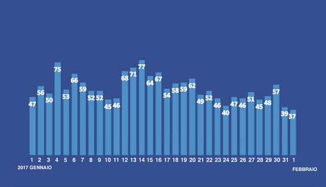

### AYS DAILY DIGEST 4/2/2017: Another life taken by the European borders

_Group of mainly young Afghans tried to enter the EU while walking over the frozen river // People from several African countries are among new arrivals to Greece // People who are being brought from islands to Athens left without care // Italian authorities are neglecting people who need protection // Volunteers needed in Calais, France, and Orekastro, Greece_

](assets/d9cdcb72de53/1*zd6bCfpT95U4wtNXcZ_H0g.jpeg)

Photo by [Refugee Accommodation City Plaza Athens](https://www.facebook.com/groups/943355035786244/)
### Feature
#### A boy who dreamed about Europe died at the EU doorstep

A young boy from Afghanistan died tonight while trying to enter European union\. He and group of 16 people were trying to cross over the river Tisa in between Serbia and Hungary\. They were walking over the frozen river, the ice broke under him and he fell into the cold river\. According to the eyewitness, he was crying for help while Hungarian border police were calmly observing what is happening\.

The river Tisa between Serbia and Hungary

Last week he was in Belgrade where the group of volunteers helped him, giving some warm clothes and food\. They tough him how to make a snowman\.

At the moment, the Hungarian police have his body and his cousin wants it back in Serbia, and to send it to his family\. So far, they do not know how to do that\. But volunteers, again, will be there to help in any way they can\. If you can assist, please try to contact volunteers on the field\.
### Greece
#### Over 230 new arrivals in 24 hours

During the last 24 hours, 232 new arrivals to islands were registered by volunteers who helped them\. Only to Lesvos, 142 people arrived\.

At the same time, many people arrived during this week from islands to Athens\. Some are left without any help\. Groups of volunteers are helping them to find accommodation, but also food and clothes since they have nothing\.

Eric and Philippa Kempson were helping to new arrivals at Lesvos, among other volunteers\. They reported about a big group, 60 people, that arrived on one boat, 29 men, 26 women, and 5 children\. New arrivals are from DRC Congo, Cameroon, Sierra Leone, Guinea, and Angola\. They were in a very bad shape and some with bad frostbites\. After taken to the safe place, they told that they were hiding in the woods in Turkey for three days before boarding the boat\.

One man who has very bad frostbites is under the doctor watch, but he will most probably have to undergo a long medical treatment\. Also, women who arrived on this boat were in a very bad condition\. Some unconscious when arrived, and all were deeply traumatized\. All new arrivals are for now in Moria, until processed\.

Philippa Kempson told us that more Africans are coming this year than ever before, mostly from Congo and Nigeria\. One of the reasons may be a very bad situation in Libya which makes people looking for another way to get to Europe \( [More about the situation in Libya](https://medium.com/@AreYouSyrious/ays-daily-digest-3-2-2017-malta-summit-eu-needs-a-reality-check-fffccc426659#.n1q82l30n) \) \.

Currently, there are about 15\.000 people on islands\.
#### Volunteer needed in Oreakastro

Camp Oreakastro is almost empty\. Only 24 people remained after they refused to be relocated to another camp\. People are moved to Alexandria and Veria camps\.

Those who remind are still hoping they will be moved to hotels or apartments next week\. As one of them told us, they refused to leave the camp since they were promised before they will be moved to some hotels and apartments and not to the another camp\. Many people left today unwillingly but afraid of the police that was present at the place\.

Photo by Abdelalih Alhamoud

> Currently, there are no volunteers at all in the camp and people there would appreciate some help\. They still receive the food, but the only way to eat that food is to cook it again\. 

Abdelalih Alhamoud is among those who stayed\. Here is his video from today\.

#### Hunger strikes in two camps

People from Afghanistan who are living in Eliniko camp will start hunger strike tomorrow\. The camp was supposed to be closed months ago, but nothing changed there\. The living conditions are unbearable, there are many children, and the Ministry that is in charge of the camp does not allow any volunteers inside which makes the situation even harder\.

Meanwhile, strike in Samos continues\. Some people decided to stop, being too exhausted after living for the month in inhuman conditions, in tents, at the sea shore, with bad food, and no hot water\. Some were taken to the hospital, while other continue their protest asking for better living conditions and to speed up the asylum process\.

Advocates Abroad are reporting about a increasing problem on the islands of authorities failing to notify refugees of their interview decisions\. As they only have 5 days to appeal, everyday is vital\. On day 6, if they didn’t begin the appeal, they can be arrested and deported\.

The refugees also need to be more diligent about renewing their white cards on their exact date of expiration, otherwise again, arrest and deportation\. Ditto for attending interviews and certainly for getting registered\.
#### New day center set up in Thessaloniki

[Alkyone Refugee Day Center](https://www.facebook.com/Refugee-Day-Center-Alkyone-Κέντρο-Ημέρας-Προσφύγων-Αλκυόνη-250670575362373/?hc_location=ufi) aims to address basic needs of people stranded in this are, especially the most vulnerable ones\. They provide two meals a day, clothing distribution, access to washing and drying machines, much needed psychosocial support, limited time housing in apartments, skills development workshops and seminar, activities and events aiming to cultural exchange, communication and interactivity between refugees and the local community\.

Operating hours: Monday — Friday 10:00–16:00\.

Adress: Orfanidou 5, 54626 Thessaloníki
Phone: \+30 231 553 0644
### Italy
#### Invisible walls

Authorities in Italy are not doing much to help people who are arriving in big numbers even this year\. Last night, 380 people were rescued at [Lampedusa](https://m.facebook.com/story.php?story_fbid=619906168198460&id=252231521632595) , among them many women and newborns\. They are mostly from Mali, Guinea, and Ivory Coast, but also from South Sudan, Sierra Leone, and Gambia\.

In Como area, [many people are still sleeping out in the open](https://ecoinformazioni.wordpress.com/2017/02/03/accoglienza-fredda-il-grafico-della-vergogna/) , with minimum help provided\. The Ronde solidarity group issued the data for January showing how many people are left without basic care in this area\. However, people from the region are helping as much as they can\.

Meanwhile, the [Territorial Asylum Commission of Brescia rejected](http://www.meltingpot.org/Brescia-La-Commissione-Territoriale-Asilo-ha-respinto-il-97.html#.WJY5-LF7GgQ) as much as 97 percent of asylum applications submitted by people who arrived in the provinces of Brescia, Cremona, Bergamo and Mantua\.
### Serbia
#### A shocking scenes from the border

More horror like stories from the European Union borders\. [Sirius\.Help team](https://www.facebook.com/sirius.help/) reports about “a shocking scene” they found at the Röszke\-Horgos transit zone\.

_“About 20 men stood in front of us wearing nothing but socks, or foils around their feet, or even barefoot\. None were wearing appropriate footwear\. We learned that the night before they tried to cross the border \(fence\) illegally, but they were caught by the Hungarian police\. After everything was taken from them, they were sent back to Serbia, barefoot\.”_

Photo by Sirious\.Help

_“Unfortunately, nowadays we hear about police abuse on a daily basis\. We would like to emphasize, that according to our experience with the Hungarian police is that the majority of them do their job in a professional and humane way at the Serbian\-Hungarian border\. Although the similar police abuse isn’t just inhumane, but it is also considered a crime\. Hopefully, the offenders will not only be removed from the police by the Hungarian authorities but will also be challenged for their acts\.”_

A new group of independent volunteers — No Name Kitchen — have started cooking dinner for refugees in Belgrade\. The food is simple and tasty, and their intentions are to keep improving the quality and to get refugees to help them cook\. On the first day, the distribution went well and everyone got food, and some got even extra doses\.

Photo by No Name Kitchen and AYS
### France
#### Volunteers needed in Calais

AYS volunteer reports that some 200 people are sleeping rough in and around Calais\. The youngest he met tonight was 15 years old\. People are staying in a makeshift camp not far away from what once was the Jungle\. They are afraid of the police that is hunting them in this area\.

People who are found on the streets are often taken to detention\. Volunteers, who distributed food and clothes, told us that when they were distributing clothes, one of the people they encounter gave back the waterproof walking boots saying _“they’re too heavy, that’s bad when we have to run from police\.”_

AYS volunteer also visited the detention center in Calais where, according to the police, there are 79 people, what is the maximum capacity\. Only yesterday 16 people were detained\.

At the same time, group [Help Refugees](https://www.facebook.com/HelpRefugeesUK/) issued a call for help in Calais area\.

_“We are seeing between 400–500 people every week and around 80 percent are unaccompanied minors\. The temperature has regularly dropped below freezing over the past month and children are living without tents or any other form of shelter\. This team also helps French homeless people when they see them\.”_

They are trying to help to unaccompanied minors who are often sleeping in the woods and under bridges in and around Calais, too\. Many are from Eritrea\.

Volunteers are urgently needed \(email [calaisvolunteers@helprefugees\.org\.uk](mailto:calaisvolunteers@helprefugees.org.uk) \), but also mobile phones and top\-up, bivvy bags, sleeping bags, and hand\-warmers\.

_“The reason for these children returning is that the root of the problem wasn’t fixed\. Dublin III \(family reunification\) transfers are still too slow and Dubs transfers \(for those no family in the UK\) have halted and the criteria set was heavily restricted\. In a troubling report released by the anti\-slavery commissioner yesterday, he states_

_“I would like to see more comprehensive criteria developed for future transfers that helps protect vulnerable children at risks of all forms of modern slavery\.”_

Report available [here](http://www.antislaverycommissioner.co.uk/news-insights/statement-call-for-adjustment-of-eligibility-criteria-under-section-67-of-the-immigration-act-2016/) \.

_Converted [Medium Post](https://areyousyrious.medium.com/ays-daily-digest-4-2-2017-another-life-taken-by-the-european-borders-d9cdcb72de53) by [ZMediumToMarkdown](https://github.com/ZhgChgLi/ZMediumToMarkdown)._
