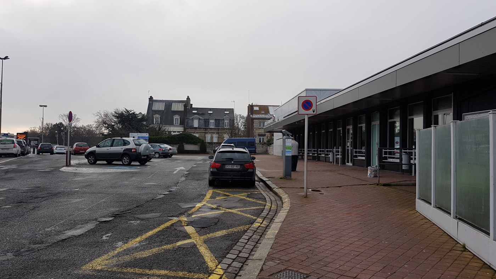
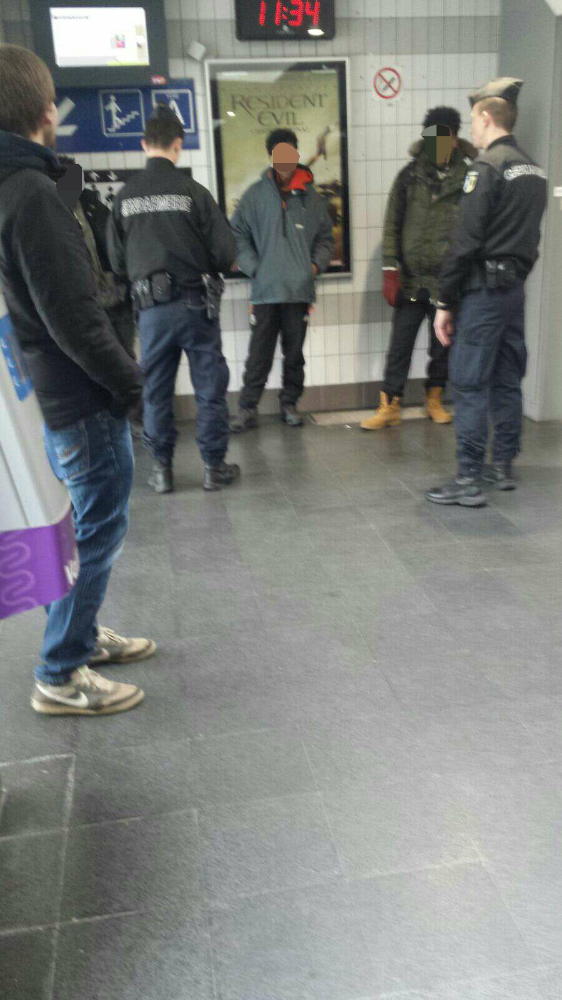
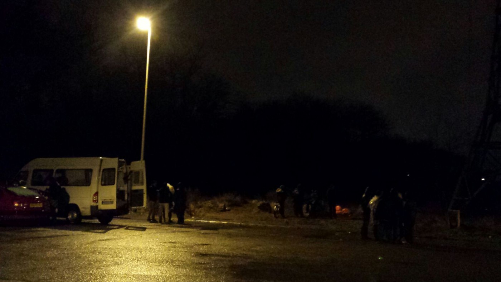
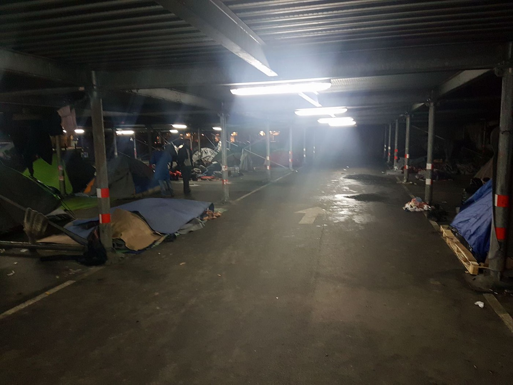

### AYS DAILY DIGEST 5/2/2017: How France fails to protect minors — field experiences

Police in Calais does not pay special attention people under 18 years / One person died trying to cross the Italian\-French border / Pessimistic prognosis for Serbia / More hunger strikes in Greece / Reportedly another person committed suicide in Sweden

](assets/34d9784d9a51/1*yZxVHFLE95-udamv0tFabg.jpeg)

The streets of France are rough\. In Paris, like seen on the picture, and in Calais\. Photo: [Paris Refugee Ground Support](https://www.facebook.com/PRGS.team/)

In Calais still some 200 people sleep rough in the streets and forests, among them approximately 50 minors\. The French government is, contrary to its responsibility, not taking care to provide and protect these under 18\-year\-olds\. Volunteers today tried to make the police transfer a minor from the train station to a reception center in Saint Omer\.

At their first try in a police department close to the train station, they were rejected, the reason given that the center would be closed today and not take anyone\. Being asked, where the individual should go so as to not sleep in the streets, the answer of one officer was: “Come back tomorrow\. We don’t have a solution for you\.” Further research showed that the center would host the boy and is open\. The volunteers wanted to inform the police about it and were rejected\. “Tomorrow\!”

Afterwards the volunteers spoke with some police officers, who were about to enter the department and asked the officers to help in this case\. The officers took the boy with them, but did not let the volunteers accompany the boy\. After waiting some minutes, they tried to contact the officers again to ask what would happen to the boy\. The answer was an order to leave the entrance zone of the police department with the words: “This is not your problem\. It’s a police problem\.” Only after refusing to leave, another officer came and told them that police would bring the boy to a reception center\. So far, it is unknown what really happened to the boy\.

Calais train station\. Photo: AYS
#### Don’t count on the police

The police are also ignoring their obligation to take special care of the unaccompanied minors at the station\. Partly armed with automatic weapons, they have been watching the train stations of Calais the whole day\. Today, they removed people without a ticket from the trains, the minors as well, but refused to provide them any solution except of paying the tickets — or getting them paid for\. At noon, around ten people were around the train station, trying to get in a train\. Patrolling volunteers provided them some essential needs\.

People being rounded up by the police\. Photo: Marcel Ottjes

Independent volunteers as well as Care4Calais and Utopia 56 are meeting with the people sleeping outside every evening to provide them with some hot food and drinks as well as with dry clothes and during rainy and cold days like today with waterproof and warm items\. The people say that sleeping in the streets with the chance, or better to be said hope, to be reunited with their families in the UK is better than what they faced in French reception centres, where they barely receive any support\. All of them stayed for a couple of weeks in governmental shelters, some also in the rough streets of Paris\. Utopia 56 is requesting one more volunteer, especially with driving license, to handle the situation on the ground and cover all tasks\. They also need sleeping bags, survival blankets, heaters, gloves, hats and scarves for men, warm waterproof coats, mobile phones, and financial donations for petrol cars, and the reloading in credit phones of minors\. If you can support them in any way, please contact them on [Facebook](https://www.facebook.com/groups/172900819749383/?fref=nf) \.

Volunteers meeting the homeless people in Calais\. Photo: Marcel Ottjes

In the detention center of Calais 74 people were being detained today, seven were put in detention yesterday, by one in the afternoon today\. Nationalities are mixed\.

Today one more person reportedly became the victim of European border policy\. Trying to cross the one from Italy to France, the person was hit by a train\.
### Serbia

The boy who died yesterday while trying to cross the river Tisa, border between Hungary and Serbia, was Rahmat Ullah Hanife\. Info Park reports that a smuggler sent 15 people \(Afghans and Pakistanis\) split into 3 smaller groups with 5 in each, to walk over the iced river\. The ice broke, two guys fell into water, one managed to swim out towards Hungary but Rahman didn’t\.

This is the second, similar death on Tisa river in a mere half a year — another Afghani minor drowned there last June\.

Info Park also reports that the ice is still present on Tisa river and despite Hungarian search attempts using drones and helicopters, the body has not been found or recovered\. According to other members of the group, a source of AYS, interviewed in Subotica, the Hungarian border guards observed the event but didn’t react or tried to help\. The smugglers apparently escaped to Bulgaria, fearing of a revenge of the refugees or legal repercussions\.

The whole group he belonged to in this attempt left Belgrade a day earlier in an attempt to reach EU territory\. This is again a serious development — movements of larger groups towards the northern border\. Even lots of newcomers are now skipping Belgrade and going directly to the Hungarian border\. The smugglers are changing strategies, trying to keep the business alive\.

> “We are not optimists at all about the future events on this border\. The current dynamics in Belgrade are accelerating again and lots of refugees are trying all the possible and impossible ways to make their journey to the EU\. We fear that many of those who are still in Bulgaria and Greece can’t wait to reach Serbia, a country with insufficient capacities even for all of those who are present here, let alone the new thousands that will come in spring/summer\. More tragedies are simply unevitable \(sic\. \) result of this hopeless situation\.” 

In Belgrade, about 50 refugees are sleeping next to a bus station in a sheltered car park, not far from the barracks\. Volunteers have told them they can get dinner from the barracks every day now\.

People sleeping in a car park in Belgrade\. Photo: Joao Pequeno

If you are considering to volunteer in Serbia or have useful information for new volunteers, please read or edit this [Google Doc](https://docs.google.com/document/d/14hlTlXT2H5Q9oetl7u2pirxBJltZZ97-R0kLILOt9dM/edit?usp=sharing) \. The aim is, to collect and provide as much information as possible\.
### Greece

After the hunger strike on Samos earlier this week, people in Elliniko camp in Athens started a hunger strike and protested for better treatment\. “Open the cities for the refugees\. No racism — no war”, they demanded\. [Art Against](https://www.facebook.com/artagainstproject/posts/1277377872311644) says, the protest is not only about better treatment but also better food and adequate shelter\. During the last weeks people in the camp saw rotten meals, making themselves and their children sick\.

](assets/34d9784d9a51/1*dGCPFQvKFfwnQCv0sXTc-A.jpeg)

Protest for better conditions in Elliniko camp\. Photo: City Plaza Squat via [Art Against](https://www.facebook.com/artagainstproject/photos/pcb.1277377872311644/1277377592311672/?type=3&theater)

In Athens volunteers had good experiences with providing meal vouchers for a hot vegetable Biryani to people in need\. They are aiming to provide 500 more vouchers and collect 1000 Pounds for that\. During the last hours they already collected some 500 Pounds\. If you want them to support in offering homeless or privately accommodated people a healthy meal, you can do it with this [fundraiser](https://www.gofundme.com/mealvouchers) \. A voucher of two Euros provides one meal\.

In Softex camp InterVolve is trying not only to teach children, but also to provide them social education classes and offer a safe space for at least some hours\. This also means, dealing with experiences of violence and abuse\. It happened not only in the past or on their run\. It still happens today and inside the camp\. “ These classes aim to help children cope a little better with the emotional stress of living in a camp as well as process the traumatic experiences many of them will have been subjected to in the past”, [InterVolve](https://www.facebook.com/permalink.php?story_fbid=404402673231460&id=219418945063168) says\.

](assets/34d9784d9a51/1*F3tePcxV2OQhmmk_qA7-xQ.jpeg)

Social education lessons in Softex\. Photo: [InterVolve](https://www.facebook.com/InterVolve-219418945063168/)

While there were no new registrations on the islands recorded today, volunteers on Samos saw 12 new arrivals\. Only yesterday they distributed 546 pairs of shoes to people on\-site\. As the demand for them was high, they decided to order this amount and offered heavy\-duty boiler suits for extra warmth and protection against the weather and nearly a hundred were taken\. If you want to support them, check their [website](https://samosvolunteers.org/2016/08/09/donations) \.

](assets/34d9784d9a51/1*odEOdh4A88YFiAQLysmEOg.jpeg)

Volunteers at the distribution on Samos\. Photo: [Samos Volunteers](https://www.facebook.com/samosvolunteers/)
### Sweden

The [Afghanistan Migrants Advice & Support Org](https://www.facebook.com/Afghanistan-Migrants-Advice-Support-Org-195295217167437/?fref=nf) reports that according to several media sources a 16\-year\-old asylum seeker from Afghanistan has committed suicide in Sweden\. “ We can not confirm the motive behind his action as far now\. This is the second suicide incident committed by Afghan minors in Sweden only in the past one month,” the organization says\.
### General

Volunteers of [Phone Credit For Refugees](https://www.facebook.com/top.ups.for.refugees/) were able to provide almost 3000 mobile phone top\-ups to people in need in January\. Most requests came from France, making nearly 1500 of the whole, 650 from Belgium and 450 from Italy\. The top\-ups had a value of more than 58\.000 Euros\. Overall the group covered 16 countries all over the world\. To continue their work and enable people to use their mobile phones, they need ongoing donations\. To support their work, click this [fundraiser](https://mydonate.bt.com/charities/phonecreditforrefugees) \.

](assets/34d9784d9a51/1*obLD6jOgVDenJkJMwfuiNA.jpeg)

Photo: [Phone Credit For Refugees](https://www.facebook.com/top.ups.for.refugees/)

_Converted [Medium Post](https://areyousyrious.medium.com/ays-daily-digest-5-2-2017-how-france-fails-to-protect-minors-field-experiences-34d9784d9a51) by [ZMediumToMarkdown](https://github.com/ZhgChgLi/ZMediumToMarkdown)._
