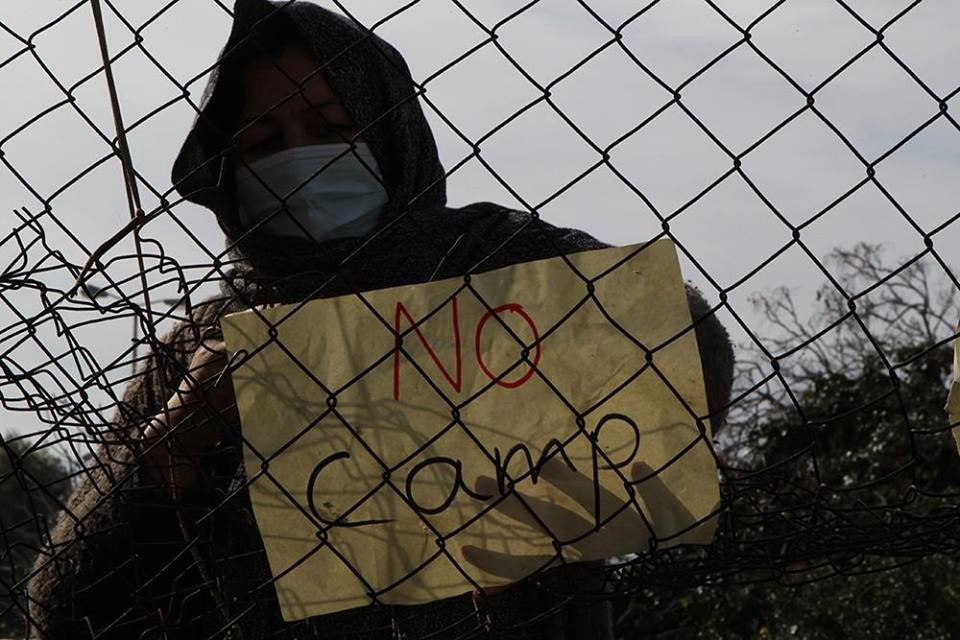
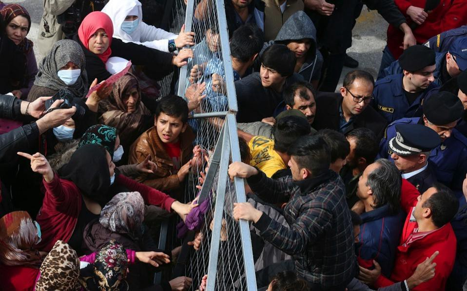
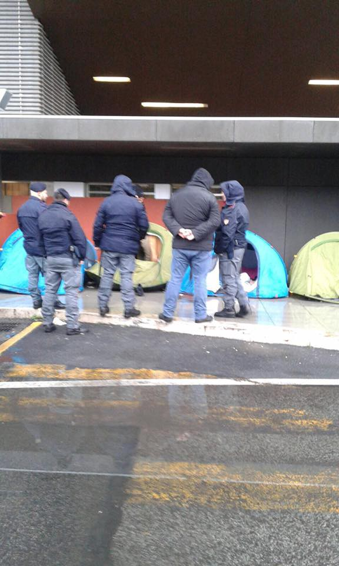
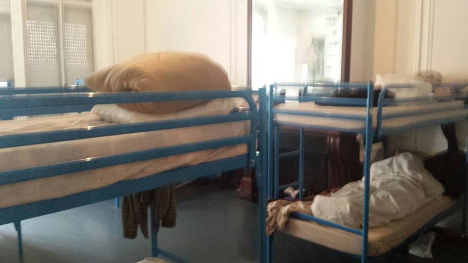

### AYS digest 06/02: Hunger strikes in Greece, halted deportations to Afghanistan in Germany

Elliniko camp today\. Photo: Art Against

_54 people came to Lesvos today / Samos hunger strike continues / Elliniko hunger strike continues, Mouzalas claims that it does not / Protest in Oraikastro camp / EduSquats needs teachers / Bulgaria receives a further 6\.1 million euros in emergency funding / Tragic death in La Dogana tunnel on the border between France and Italy / 1,500 people saved in rescue missions on the Mediterranean over the weekend / Makeshift camp in Piazzale Spadolini disassembled / Several German states halting deportations to Afghanistan due to reports of rising civilian casualties in that country_
#### Greece
### **54 people came to Lesvos today**

As is reported from the ground, “one boat was picked up of north coast Lesvos early hours the morning by coast guard, taken to Skala Sykaminia, 54 people on board all very wet and cold\.” People were taken in and among them was one child\.
### **Samos hunger strike continues**

Meanwhile, in Samos, another refugee needs emergency care after not eating for 3 days in the camp’s hunger strike\. The video below was taken while he was carried into the emergency room and vividly shows the condition this man is in\.

### Elliniko camp hunger strike continues

The Samos hunger strike is not the only one as there is also an ongoing hunger strike in Elliniko camp\. As reported by Infomobile, on February 5th 2017, most of the adults among the 711 refugees residing in the state\-run camp in the former Athens National Airport \(Camp Elliniko II\), the majority of whom come from Afghanistan, started a hunger strike to protest their degrading living conditions\. Their demands include transfer to homes, papers, and freedom of movement for all\. As reported by one of the refugees, it is very likely that the residents of the two other camps in Elliniko \(the nearby Olympic baseball and hockey stadiums\) will join in the protest\.
### **Mouzalas claims that there is no hunger strike amidst protest in Elliniko camp**

Mouzalas blocked\. Elliniko camp\. Photo: Kathimerini News

Migration Minister Yiannis Mouzalas came to the camp today, where he was confronted by refugees who at first did not allow him to come in\. Later on, when he entered, “during a press conference at the site, Mouzalas denied reports that some of the migrants had started a hunger strike in protest of conditions at the camp and accused a far\-left group of spreading the rumors\.” Learn more [here](http://greece.greekreporter.com/2017/02/06/refugees-block-migration-min-mouzalas-from-entering-elliniko-hotspot/?utm_source=dlvr.it&utm_medium=twitter) \.
### **Remaining residents of Oraikastro protest and do not to want be moved away from Thessaloniki**

Further north, the remaining nine residents of Oraikastro camp in Thessaloniki are protesting their relocation\. In their message to Greek authorities they state that they, _“understand you have to close the camp\. But we do not want to be moved to another camp\. The camps Veria and Alexandria that you are suggesting is too far away\. We have friends and family in Thessaloniki\. Some of us have been split up from our siblings as we are not considered to be part of their family\. We may not even be relocated to the same country as them\. We may not get the opportunity to see them for many years\. Please don’t rob us of this last opportunity to stay near our friends and family before relocation\._

_We stayed in Idomeni camp and now Oraikastro in very poor inhumane conditions\. We don’t want to move to another camp and be unsettled again\. No matter how good the other camps may be, camp conditions are not good for us\. It takes time to become used to a new camp and every move has always led to new problems\. None of these camps are suitable for human beings to live in\._

_Some of us have also had our second interviews and we were promised to be moved into an apartment or hotel after the second interview\._

_Today the families were moved to a hotel\. We understand that families with children should be priority and we are happy they will be living in better conditions now\. BUT WHAT ABOUT US??”_ To see their full message, follow [this link](https://www.facebook.com/abooda20124/posts/1844133629207621) \.
### **If you are wondering how you can help — EduSquats is looking for teachers\!**

They are looking for people who can offer: homework support in Greek language \(for kids of all ages\); Greek language; other languages \(Arabic, English, Farsi, French, German, Spanish, Urdu, etc\. \); arts and skills such as music, computer, dance, etc\.

EduSquats is an assembly that coordinates educational and cultural activities in squats of Exarchia\. Both residents and solidary individuals are teachers and students\. The organisation’s purpose is to create an environment where knowledge and skills can be combined and exchanged\. For this they are looking for new teachers and people who wish to share their skills\. So, if you have time to teach at least once a week for 1–2 hours and are willing to work in a self\-organized manner they say that they would be “happy to meet you\! \! \!”

Message them at edusquats@espivnet\.com or on Facebook \(EduSquats\) and/or visit them at their open assemblies every Friday night\.
#### Bulgaria
### **Bulgaria received 6\.1 million euros in emergency funding**

The Sofia Globe reports that the European Commission has awarded a further 6\.1 million euros in emergency funding to support migration management in Bulgaria, the Commission said on February 6th\. A sum of 3\.6 million euros will be provided to the International Organisation for Migration \(IOM\) from the Asylum, Migration and Integration Fund \(AMIF\) to enhance the protection of unaccompanied children, carry out voluntary returns and provide reintegration support as well as assistance, information and counseling to migrants, the EC said\.

An additional 2\.5 million euros will be provided to IOM to support the work already undertaken by the Bulgarian Ministry of the Interior in order to improve migration management and the Bulgarian asylum system\. The awards supplement the EU funding that has been granted to Bulgaria since October 2016, which has amounted to a total of 149 million euros under AMIF and the Internal Security Fund \(ISF\) \.
#### Italy
### **Tragic death in La Dogana tunnel on the border between France and Italy**

On the morning of February 5th at around 7am, a refugee, whose identity has not been revealed yet, was hit by a train in the “La Dogana” tunnel on the Ventimiglia\. He was just one kilometer away from the Italian\-French border\.

Even though rescuers acted quickly, it was not possible to save him\. The death will be added to a long list of names of people who have tried to cross the border but have met their death along rail tracks, or the highway, hit by cars, trucks or trains\. This is the second person in 3 months who has died in this way; the previous death occurred on December 23rd\.
### **Some 1,500 migrants have been rescued in the Mediterranean this weekend**

This is an unusually high number for winter, when crossings tend to slow because of difficult sea conditions, the Italian coastguard said on Sunday\. The number of people pulled to safety in the past two days brought the total saved since Wednesday to 4,500\. For more details follow [this link](http://www.thelocal.it/20170206/italian-rescuers-saved-1500-people-in-the-med-this-weekend) \.
### **Makeshift camp in Piazzale Spadolini disassembled**

Photo: Baobab Experience

Meanwhile, this morning in Piazzale Spadolini, Rome police evacuated the site’s makeshift camp and took 12 young men to police headquarters to be identified\. Reported by Baobab\.
#### Germany
### **Several German states halt deportations to Afghanistan due to reports of rising civilian casualties in that country**

As reported by the Local, “several German states are reportedly halting or considering halting deportations of failed asylum seekers to Afghanistan due to the worsening security situation, according to German media reports on Monday\. According to the report by publishing group [Funke Mediengruppe](http://www.morgenpost.de/politik/article209512759/Neue-Zweifel-an-Rueckfuehrungen-nach-Afghanistan.html) , Schleswig\-Holstein, Berlin, Bremen, Lower Saxony, Thuringia and Rhineland\-Palatinate are all having doubts about the federal government’s classification of Afghanistan’s level of safety, and therefore about Afghan deportations\. The information came from a survey of state interior ministries as the federal government reviews a new UN report on Afghanistan\. The UN said on Monday that there had been a record number of civilian casualties in 2016 with nearly 3,500 killed and more than 7,900 injured\.” For more details follow [this link](https://www.thelocal.de/20170206/german-states-to-delay-afghan-deportations-due-to-security-situation-report) \.

Many human rights organisations, including the UN, have warned against classifying parts of Afghanistan as “safe\.” We hope that the practice carried out in these German states will resonate with other European countries, too\.
#### France

As reported from the field, around 40 people were counted in the morning around Calais train station\. Only a few new arrivals and departures\.
### **Short report on conditions in CAO Saint Omer center**

One of the activist teams was in CAO Saint Omer, a center for unaccompanied minors, and has reported on conditions in this facility\. It has capacity for 45 teenagers and is permanently full\. Residents are allowed to stay for five nights\. After that they have to leave for one night, which means they are relegated to sleeping mostly in the streets\. People in the CAO get breakfast and in an office not far away they get French language classes and a meal\. It wasn’t possible to talk to staff onsite because they don’t speak English\.

_Converted [Medium Post](https://areyousyrious.medium.com/ays-digest-06-02-hunger-strikes-in-greece-halted-deportations-to-afghanistan-in-germany-185da631cdf2) by [ZMediumToMarkdown](https://github.com/ZhgChgLi/ZMediumToMarkdown)._
