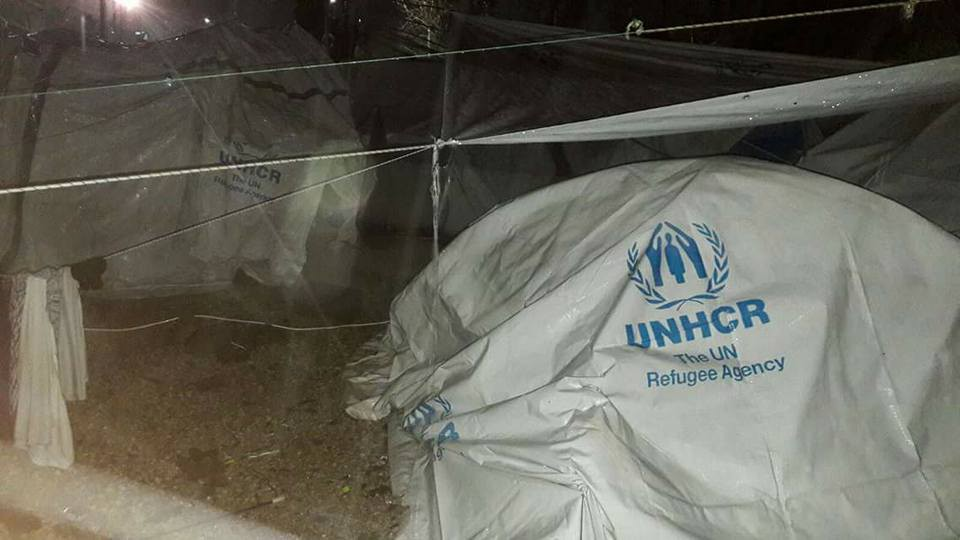
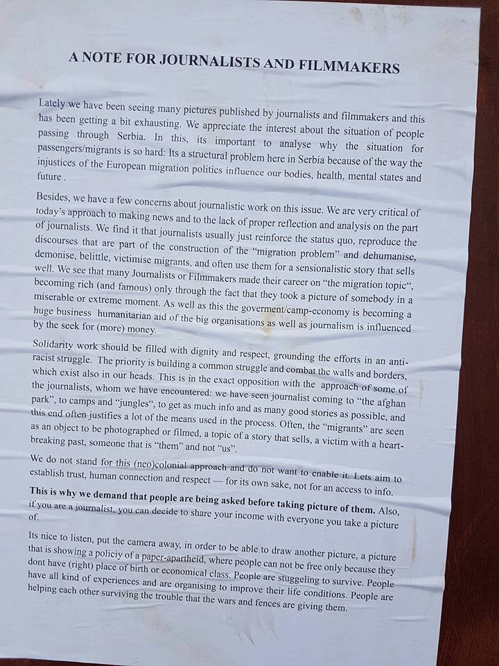
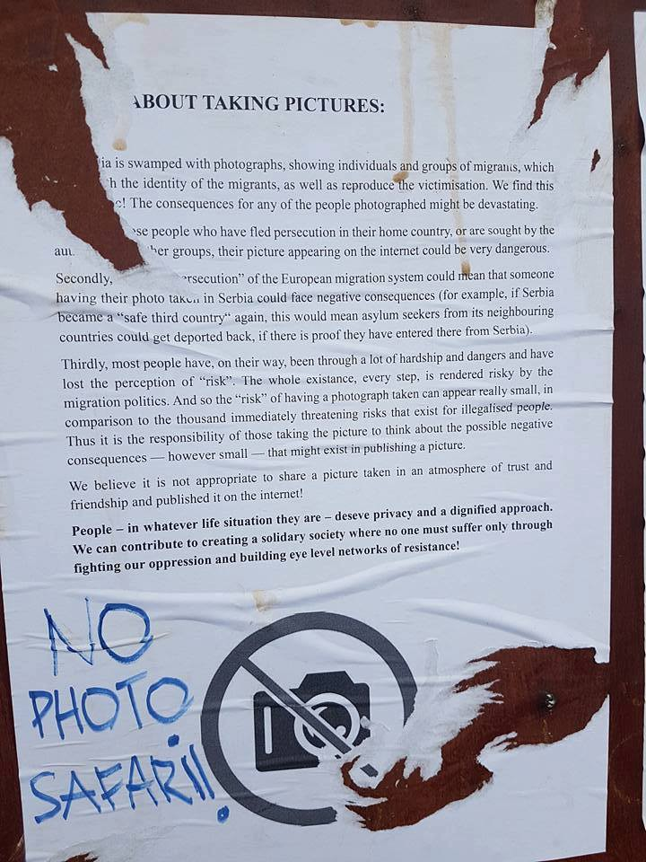
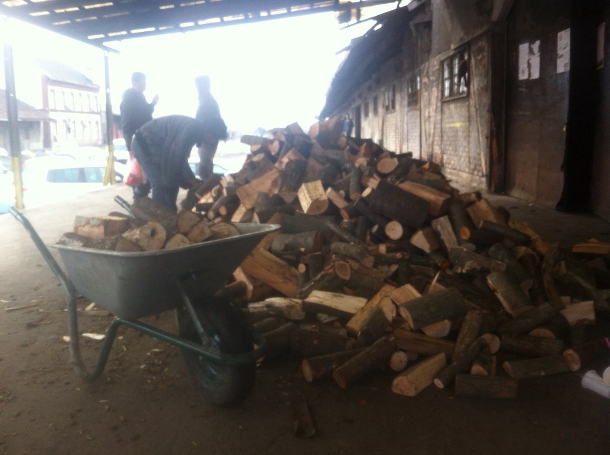

### AYS Daily News Digest 07/02: More money, less care and slow relocation
#### well hidden poor conditions in Moria \| More refugees in Athens \| Oraiokastro closed \| Refugees smuggled from Serbia, found in 2 trucks in Croatia \| Austria wants to tighten the closed borders \| Numbers of people saved at sea in Italy jump high \| EU and Italy violate the principle of non\-refoulement by signing the deal with Lybia

Moria, Lesvos \(Photo taken by a resident on Tuesday, February 7\)
#### RELOCATION
#### The implementation of the EU relocation scheme is faithful in its slow [processing](https://www.easo.europa.eu/relocation-0) \.

321 people were relocated from Greece in the past week, including 211 people who were relocated to Germany, bringing the total to **8,733** \.
Since the October 9 2015, when the first 19 people were relocated from Italy to Sweden, in the 16 months, a total of **3,205** people have been relocated from Italy to the other EU member states\.

Hopefully the cooperation and exchange of information between National Contact Points of the Member States of Relocation and Italy and Greece on the other side will speed up and become more efficient, thus saving lives and health of the thousands who in the meantime have put their and lives of their children on hold, mostly in harsh living conditions\.
#### GREECE

The European Commission has announced an **additional 3\.9 million euros** in emergency funding to Greece, it is [reported](http://aa.com.tr/en/europe/ec-earmarks-39m-fund-for-refugees-in-greece/742687) \.
The purpose of the aid is “to further support EU financed actions carried out by the Ministry of Defence to provide catering, accommodation and transportation to the migrants on the islands, also in support of emergency accommodation solutions, such as temporary accommodation in ships\.”
### Lesvos

Meanwhile on Lesvos…
#### “Nobody is staying in tents” — Moria tonight

](assets/9d5f7bf9351e/1*jJn5njOfE4X9-d9KYNObmw.jpeg)

Photo and video by a resident in Moria camp, via [Philippa Kempson](https://www.facebook.com/philippa.kempson.1)

Three earthquakes with magnitude around and above 5 on the Richter scale shook the island of Lesvos in the past 24 hours\. The epicenter of the earthquakes was located within the Turkish territory, about 34 km north of Mytilene\.
Since accumulative earthquakes often lead up to greater earthquakes, [seizmologists have urged](http://greece.greekreporter.com/2017/02/07/greek-seismologists-fear-activation-of-fault-may-cause-6-6-richter-earthquake-off-lesvos/) the local community to take preventive measures\.
However, although there were no greater damages, residents of both the islands of Lesvos and Chios were reportedly shaken by the tremors\.
### Athens
#### In practice, the official statements and figures don’t hold water

More people are being sent from islands to Athens\. 
According to the accounts of those on the ground, the UNHCR doesn’t seem to be providing them almost any substantial help at all\. 
AYS volunteer along with a group of other volunteers visited three camps \(Ritsona, Skaramangas and Oinofyta\) today and in all of these camps they were told that people are coming and asking for accommodation, but there is no space for new arrivals in the camps\. 
The same situation is all over Athens, in camps around the city and also in squats\. As a result of such situation, many people, including families with children, are seen in the streets\. Once more, help is offered by the solidarity network and volunteers\. New squats are being open almost on a weekly basis\. People who are placed in apartments by the big INGO and NGOs are in many cases not provided with cash cards or any kind of help on time\. They also ask for help from activists and volunteers in the field\. So far, they are finding ways to respond to their requests, but more help will be needed in the future if this trend continues — and it seems like it will, since the Greek government is planning to relocate more people from the islands to mainland Greece\.

The last eight residents of **Oraiokastro** have been transfered to hotel accommodation and the camp is officially \( finally\) closed, refugees report\.
#### SERBIA
#### A reminder to volunteers and journalists — be respectful

In the past days the world media was flooded in photos of vulnerable people during more or less private moments in unimaginable circumstances in Belgrade\. This was yet another initial impulse for some volunteers to write a reminder note to their fellow volunteers and to all the journalists who are not always following the stories and hardships of these people as diligently as they have been in the case of documenting these young people eating, showering, staring and freezing on \-15\.

> People — in whatever life situation they are — deserve privacy and a dignified approach\. We can contribute to creating a solidarity society where no one must suffer only through fighting our oppression and building eye level networks of resistance — they conclude\. 

If you are or have been working or volunteering with refugees in similar circumstances, please take time to read these notes about consideration, privacy and respect\.

Photo of the No Photo leaflet taken by AYS volunteer in Belgrade

The **SoulWelders** group have organized a steady supply of good wood to be distributed every morning to the residents of the warehouses behind the train station in Belgrade\. Their next step is to fit the woodburners they had built into the big spaces where people sleep\. They are cutting the big barrel burners along side a smaller cooking woodburner so people can keep warm and cook at the same time\. Their project keeps the people from inhaling lethal smokes from the materials they were previously burning and the team hopes for no more open fires very soon\. [Contact](https://www.facebook.com/SoulWelders/?hc_ref=PAGES_TIMELINE&fref=nf) to support or join them\.

The system: Every evening tickets are distributed so that people can collect their wood for fire burners the next morning\. \(Photo: SoulWelders\)

No Name Kitchen is a new Belgrade group of independent volunteers that got together to cook a regular meal for refugees in Belgrade and they are looking for support: helping hands, donations and a van for food distribution or a volunteer willing to join in with their van for a while\. [Contact them](https://www.facebook.com/No-Name-Kitchen-309778972753727/?hc_ref=PAGES_TIMELINE) if interested\.
#### CROATIA
### People smuggled inside two trucks from Serbia

Due to the harsh conditions for refugees in Serbia and the hopelessness of many people stranded there, illegal attempts to enter the EU through Croatia are occurring more often\. In these situations, mostly young boys and men risk their lives travelling in almost impossible conditions\. Two trucks were stopped near the border with Slovenia earlier this Tuesday\. One truck with Albanian licence plates had 3 Pakistani and 1 Afghan young man on board the vehicle and the other truck coming from Serbia had an unknown number of people\.
AYS and CMS have sent a letter to the Minister of interior of Croatia asking the Police to inform the public on the details of the happening, on the whereabouts of the people and reminding them of the rights these people are entitled to, regardless of the circumstances of their entry to the country\.
#### AUSTRIA
### ‘Europe is not yet closed enough’ — and we conclude this because people still risk lives to come

Austria’s Defence Minister wants to forge a new military alliance and strengthen cooperation with countries along the so\-called “Balkan route” to prevent refugees crossing Austria’s border illegally\. 
He said that the EU’s deal with Turkey to tackle the migrant crisis is no longer reliable and that “we must be prepared in case the government in Ankara opens the floodgates again”\.
#### ITALY
### Sub\-Saharan and Iraqui refugees saved in sea rescue operations

In the rescue operations by the offshore patrol vessel arriving at Vibo Valentia’s harbor on Monday, the 612 people who were [rescued](http://www.rainews.it/dl/rainews/articoli/Migranti-soccorsi-notte-64-iracheni-19-minori-oltre-500-in-arrivo-Augusta-30f3a2a1-64f6-4d6f-81b3-29a291ae337d.html) off the Libyan shores came from Sub\-Saharan Africa\. Among them, there were 61 women and 97 minors, of whom 91 unaccompanied\. They will be relocated in reception centres in the area\. About 150 of them are Moroccan, therefore not eligible to claim the status of refugee in Italy\. 22 people have been under medical observation in the tents on the docks\.
Meanwhile, during the same night, 64 Iraqi migrants have landed in Brindisi, including 19 minors, allegedly having left five days ago from an unknown location\. This morning, the vessel Canarias landed with 493 people on board, rescued in the wavy Sicily Channel\. They left from Sabrata between February 2 and 3, paying 2,500 dinars \(1,700 euro\) each\. Two alleged smugglers have been arrested\.
Meanwhile, the police also stopped another two smugglers \(one of a Sudanese dinghy, the other leading a Ghanaian boat\) accused of having smuggled 785 people, who were rescued two days ago by Aquarius\.
### 50% more arrivals that in February 2016

The number of people who [arrived in Italy](http://www.ansa.it/sito/notizie/topnews/2017/02/06/migranti-arrivi-2017-gia-a-quota-10mila_9645b41a-7a13-443e-addc-5a0c46d09bd3.html) searching for a refuge in 2017 is close to 10,000: 2,500 have arrived between February 5 and 6\. Today, the count has stopped at 9,359, that is 50% more than this time last year \(6,030 by February 2016\) \.
They come mainly from Africa: Guinea, Ivory Coast, Nigeria, Senegal, Gambia and Morocco\.

Like in other parts of Italy, the transit centre in [via Sammartini](http://www.vita.it/it/article/2017/02/06/milano-posti-esauriti-allhub-ora-dove-andranno-i-profughi/142359/) in Milan is overcrowded as it used to be just a transit centre for the refugees who were _en route_ to northern European countries\. Nowadays more and more people decide to stay permanently and ask for asylum and as the spring draws near, the question rises — how will they welcome the expected surge of people since already people have to look for alternative solutions to stay in the city\.

 **\)**](assets/9d5f7bf9351e/1*-sPs_7jF6u79A_kXii9H0A.jpeg)

A group of self organized people showing solidarity on daily basis by personally preparing, providing and distributing food to the refugees along Baobab\. Visit their page and sign your name if you can\. \(Photo: [**PASTI Baobab Experience**](https://www.facebook.com/PASTI-Baobab-Experience-1295938570502827/) **\)**
### The Association for Juridical Studies on Immigration [condems the agreement](https://www.libyaobserver.ly/news/asgi-eu-and-italy-de-facto-violate-principle-non-refoulement) reached by Libya and Italy

“The EU betrays basic rule of law principles and infringes the democratic basis for the peaceful coexistence of citizens” says Lorenzo Trucco, lawyer and president of ASGI\. 
In their statement, they claim that through these agreements, the EU and Italy de facto violate the principle of non\-refoulement, as they require third countries to forcibly block the passage of people in clear need of international protection\. They also demand that Italy stops repatriating people to countries of origin where their fundamental rights are not respected\.

 **\)**](assets/9d5f7bf9351e/1*zvwroL5plvloL-UQgTkICg.jpeg)

A protest was held in Calabria on Monday, against exploitation\.
They obtained to have the electricity back at the makeshift camp, to have the garbage removed from the ghetto and to fix a meeting with the Prefect of Reggio Calabria in order to solve the documents issue\. \(Photo: [**Melting Pot Europa**](https://www.facebook.com/meltingpoteuropa/) **\)**
### Hospitality and catering — free courses for refugees

Professional courses are offered to refugees in Rome, the duration is 322 hours:

> \- educational consultancy \(2 hours\)
 

> \- training \(200 hours\)
 

> \- internship \(100 hours\)
 

> \- help in job application \(20 hours\) 

People can apply as long as they have the following requirements:

> \- asylum/asylum seekers/subsidiary protection/humanitarian protection
 

> \- unemployed 
 

> \- min\. 18 years of age
 

> \- resident or domiciliate for at least 6 months in Lazio 
 

> \- Italian knowledge L2 — linguistic skills A2 level
 

> \- registered to the job centres \(centro per l’impiego — CPI\) 

There are no fees as these courses are part of a wider regional offer and part of the O\.R\.F\.E\.O\. \(Occupation for Refugees: Education, Empowerment, Opportunity\) \. 
For more information contact: orientamento@ciofslazio\.it
Website: [www\.ciofslazio\.it](http://l.facebook.com/l.php?u=http%3A%2F%2Fwww.ciofslazio.it%2F&h=ATOfgbz-4xySEMbQ3_SzotSgka1iZMaFpY_U4P8gxG2iqCRWeJZIAvP0hhpikXVXQ0YPBTpnReGa4Wwx9KtrmWn9MtnAQRJo_DpIZMfbJZfg725Zj_OyoF6yvflepJU-Bao)
#### FRANCE
#### The French calling for support demonstrations against push backs

Volunteers and citizens of France who are engaging in and about the CAOs \(Welcome and Orientation Centres in France\) have published the map of manifestations and protests held against the forced expulsions, the push backs of the asylum seekers in France\. They hope the past events that have been successful will serve as a motivation to the citizens of France to stand up for their fellow humans looking for a refuge in France and to organize similar or other kind of events in their support and post it in the common map published [here](https://www.google.com/maps/d/edit?mid=1PXCZv1QnVpyJvxTN3JJq0D4QgbI&ll=48.1572863496995%2C1.2686333499999591&z=6) \.
#### SWEDEN
#### Official estimates of the number of refugees change

The [number of people](https://www.svd.se/sankt-flyktingprognos-fran-migrationsverket/om/svenskt-flyktingmottagande) that enters Sweden and register to seek asylum has now been stabilized to around 400–600 persons/week, which has been a trend since the spring 2016\. According to the Migration Agency’s [statistics](https://www.migrationsverket.se/Om-Migrationsverket/Nyhetsarkiv/Nyhetsarkiv-2016/2016-01-01-Nastan-163-000-manniskor-sokte-asyl-i-Sverige-2015.html) , this is the lowest number since 2012\. The main reason for this is the restrictions across Europe that limits the chances to cross borders, as a consequence of the autumn 2015 when so many people came to Europe\.
In this year the agency expects to handle 91 000 cases concerning family reunification\. For 2018 the prognosis now is 35,000, instead of the 40,000 they had expected in October, but the number of expected unaccompanied minors has not changed\.

_Converted [Medium Post](https://areyousyrious.medium.com/ays-daily-news-digest-07-02-more-money-less-care-and-slow-relocation-9d5f7bf9351e) by [ZMediumToMarkdown](https://github.com/ZhgChgLi/ZMediumToMarkdown)._
