### AYS DAILY DIGEST 09/02/17 — Follow up on police violence and push\-backs

_Follow up on reports of police violence and push\-backs from Croatia / Volunteers report from Serbia, Macedonia, Greece and more / Teens arrested for attempted homicide in Denmark / Swedish journalist convicted of smuggling / New deportation plans call for new solidarity demonstrations_

](assets/19f73f2de883/1*YRTl__rtG4HfL28lequA8A.jpeg)

Photo by [Igor Čoko](http://www.igorcoko.net)
#### FEATURE
### Police violence — follow up

Following the [reports](https://medium.com/@AreYouSyrious/ays-daily-news-digest-17-1-massive-negligence-of-minors-and-serious-police-abuse-remain-silently-38c0815bdec5#.be6ey8uwl) made by AYS and other Croatian NGOs \(Centre for Peace Studies, Jesuit Refugee Service, “Welcome” Initiative\) regarding police violence and push\-backs of refugees on the Serbo\-Croatian border, we are finally seeing positive developments in the situation\. Along with our reports, a meeting with the Public Advocate was held yesterday at which Are You Syrious?, the Jesuit Refugee Service and Centre for Peace Studies were present\. The Public Advocate and her team visited Belgrade on Monday and Tuesday, confirming what our reports showed — and worse — and calling the events on the border torturous \(they had previously formulated it as “degrading treatment”\) \.

The Public Advocate Office is now in correspondence with the Croatian Minister of Interior, Vlaho Orepić, who first denied that violence on the borders and push\-backs were a systematic problem\. The Public Advocate is now gathering further evidence on violent and unlawful push\-backs, in cooperation with international and national NGO’s, AYS included\. Following our appeals for civil border monitoring, the Public Advocate Office agreed that such similar practice should be started on the Croatian border\. Unfortunately, the Ministry of Interior recently denied such suggestion when it was made by CMS and AYS, but proposed our visits to their border teams as a compromise\.

Croatia’s Minister of Internal Affairs, Vlaho Orepić, [confirmed in a statement today](http://www.vecernji.hr/hrvatska/vlaho-orepic-ako-je-netko-prekoracio-ovlasti-taj-covjek-vise-nece-biti-policajac-hrvatske-policije-1148453) that an investigation is being carried out\. Some of our volunteers have already been called to give statements about push\-backs\. “Rest assured, if anybody from the police in any way exceeded his authority this person will no longer be a Croatian police officer,” he stated\. Orepić continued to say that Croatia still has a “responsible role” in protecting the borders on the basis of the obligations under Schengen\. “We have an obligation to solve illegal immigration across the border and the Croatian police will carry out their task and at the same time be humane and friendly as it was until now,” he added\.

The Public Advocate’s Office also wants to run a process for any refugees now residing in Croatia who experienced beating or were previously pushed back to Serbia\. If you know of any cases, please let them know and a complaint to police behavior will be launched\. They can contact us or Public Advocate’s Office for details\.

The Centre for Peace Studies warned about refugees’s statements they were even more viciously beaten in the recent days, after the official complaint was filed to Croatian Ministry of Interior\. Groups in Belgrade claim that every day around 300 people cross the Croatian and Hungarian border\. Our team will visit Belgrade this weekend to further investigate cases of push\-backs\. The involvement of Public Advocate’s Office is an important move towards a joined effort in solving these problems\. They have the will, capacity and knowledge, but they definitely need the help of civil organizations in finding and gathering evidence\. We expect good cooperation on these issues from now on\.
#### **SYRIA**

[**From Syria With Love**](http://www.fromsyriawithlove.com/) **opens the 4th tent school** 
In July 2016, FSWL started the School Tent project\. Now, with donations and support, they were able to fully equip the school, providing teachers’ salaries and stationery for children, and covering other expenses\. 60 students aged 6–12 are now able to attend school there\.

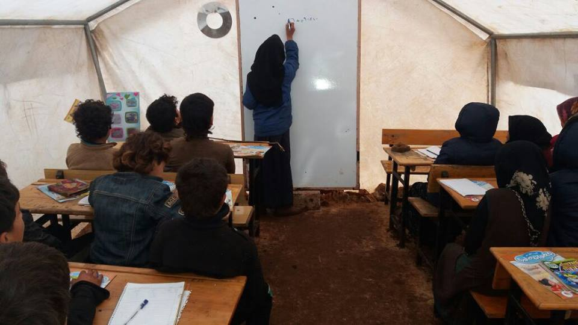

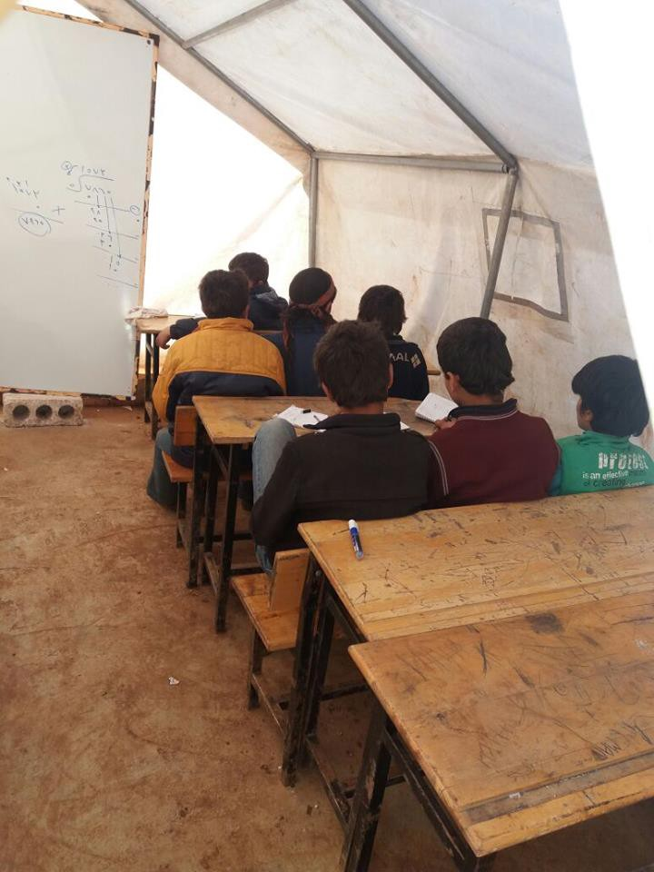

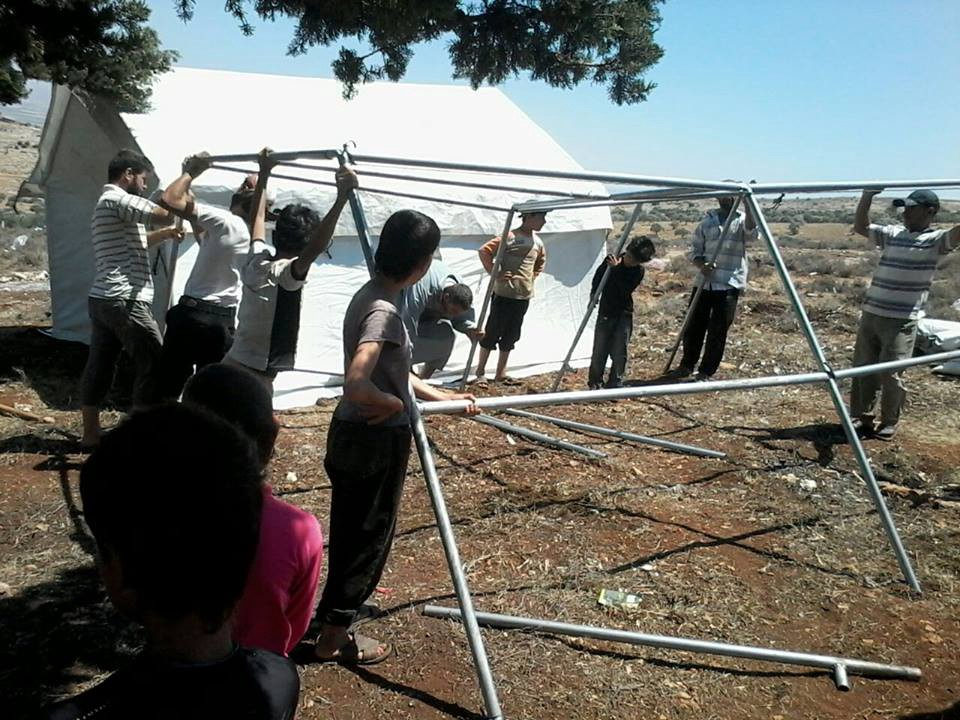

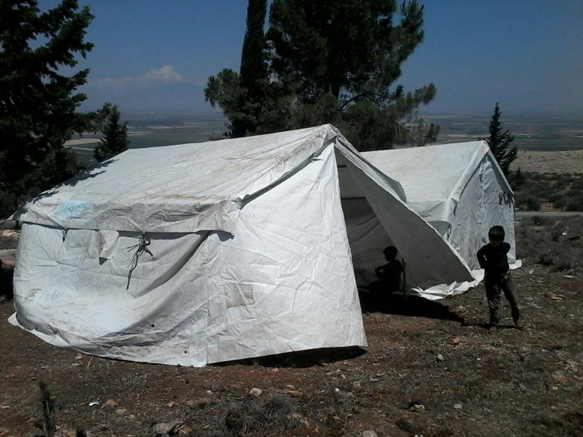

Photos by From Syria With Love
### Volunteers report from Serbia, Macedonia and Greece
#### SERBIA
#### AYS volunteer reports on the situation in Belgrade

“Just after food distribution from HFI, refugees queue one more time for another distribution from another group… it’s their routine and it gets tiring to stand in a queue all the time for food, for tea, for clothes, for everything\. \. \. but overall the spirits remain high and there are a now a good number of teams on the ground giving out aid\. The living conditions remain terrible though\. \.”

#### MigSzol Szeged reports from Subotica

> We have visited the abandoned and now slowly demolished old brick factory in Subotica, Serbia twice in the past days\. The site has been one of the main stations of migration into the European Union for more than a decade, and at the same time, a sorrowful symbol of the flourishing business of smuggling humans\. Recently Pakistani refugees found shelter here; they try to sneak into Hungary through the border fence\. Many of them reported about brutal beatings committed by the Hungarian police during the push\-backs to Serbia if they get caught on the other side of the fence\. 

> We met a man who tried to enter Hungary 21 times\. ‘Italian and German policemen \(belonging to the EU’s Frontex agency — MSzSz\) do not beat us, and there are some decent ones among Hungarians, too’, said one boy from Swat, Pakistan, who studied computer science back at home, but left his country because of the Taliban expansion\. He was not religious enough, and because of the routine harassments, he started off; he wants to end up in Italy or in France\. Being en route for seven months now, he said, ‘if you looked at my Facebook profile picture, you would not recognize me’\. Once he had a life, now he does not\. 

More photos can be found [at their page](https://www.facebook.com/migszolszeged/) \.

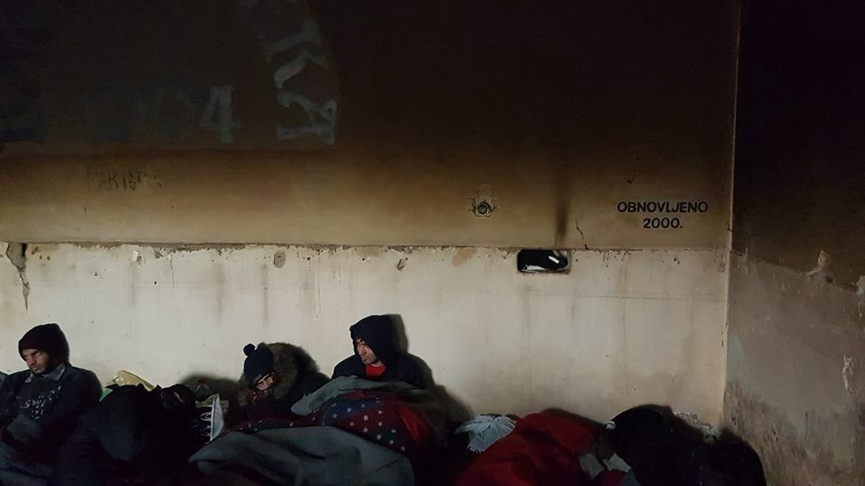

 , photos by MigSzol Szeged](assets/19f73f2de883/1*OOr7M5rNeNrlOeF0X8D3dA.jpeg)

[Subotica, Brick Factory](https://www.facebook.com/media/set/?set=a.397784280559327.1073741862.126963164308108&type=3) , photos by MigSzol Szeged

Around 47 percent of Serbian citizens have a positive view of migrants and refugees, while 60 percent sympathize with them, show research on public attitudes about migrants and refugees, [presented](http://www.blic.rs/vesti/drustvo/polovina-gradana-srbije-ima-pozitivan-stav-o-migrantima/ggbwv80) today in Belgrade\.

The research was produced by the public opinion research agency ProPoziv\. The study, which was conducted from 1 to 25 December 2016, included 2,792 participants from Belgrade and seven municipalities in which the migrant centres are located : Dimitrovgrad, Lajkovac, Preševo, Sjenica, Tutin, Subotica and Šid\.

ProPoziv director Marko Lazovic said that in comparison with June, the percentage of people with positive attitudes towards migrants is slightly elevated, but the number of those with negative attitudes is also increasing\. In June it was 19 percent, versus 34 percent of respondents today\. **The most positive opinion about the migrants come from citizens of Tutin, Sjenica and Preševo, who have the most contact with migrants\.**
#### MACEDONIA
#### Refugees sent back to Greece in the middle of night

Almost all the refugees that were placed in the transit centre Tabanovce were unexpectedly and without any explanation sent back to Greece last night, TV Nova informs\. About 49 refugees from Syria and Iraq, family members, women, children, elderly people were staying in the centre for almost a year, reports [Legis](http://legis.mk/news/2242/macedonia-returned-the-refugees-from-tabanovce-to-greece) \.

“According to the information from the Centre, last night around 11 o’clock police has come and without any announcement or explanation told the refugees to pack everything, because they will be sent back to Greece\. After this, the refugees were been quickly loaded on the bus and sent towards the Greek border\. Some of these refugees wished to continue towards the EU states, and the other part wished to stay in Macedonia\. MI announced they will give further details on the case later today\.”

Half of the refugees were children, none of them were asylum seekers and all of this was going on behind the back of everyone, even state institutions, a volunteer in Macedonia said\. They will continue trying to find out if all 46 refugees voluntarily went back\. The majority of them did want to go back to Greece, for example Syrians, the volunteer added\.
#### GREECE
### Out of sight, out of mind

Our volunteer reported from **Skaramangas** , the biggest remaining camp in Greece with about 3,200 people \(almost 50 percent are under 18\) \. It is another place where strict rules are imposed for all those who want to visit\. The camp is under the jurisdiction of the Ministry of Migration and run by the employees of this institution\. For anybody who wants to visit, approval from the Ministry is required, even if it is personal visit to some of the residents\. No independents volunteers are allowed inside\. However, the person in charge of the camp does not see this as restriction of freedom for residents and explains that the reason is to keep people who are living inside safe\. It looks more like keeping away all those who want to see the real situation inside the camp, where such a huge number of people are forced to live behind barbed wire\.

High wire around the camp makes it look rather like concentration camp than a place where those who are living enjoy freedom\. People go in and out through the door\-like cuts in the wire\. Kids are playing on a concrete playground\. Since November, as we were informed, everybody lives in ISO Boxes, but we were not able to check the conditions inside\.

The camp is placed in an industrial shipyard filled with rusting shipping containers, and absolutely everything is screaming that this is not a good place to live, especially not for children\. The site and its surroundings are full of steel, dust, and rocks, by the sea\. In a close proximity there is a bus stop, by the road and it take about 45 minutes to get to Athens\. As we were informed, there are several NGOs working inside the camp, as well as the school and medical facilities\. But yet, like any other camp, it is an extremely inhumane place and people should not be forced to live inside\.

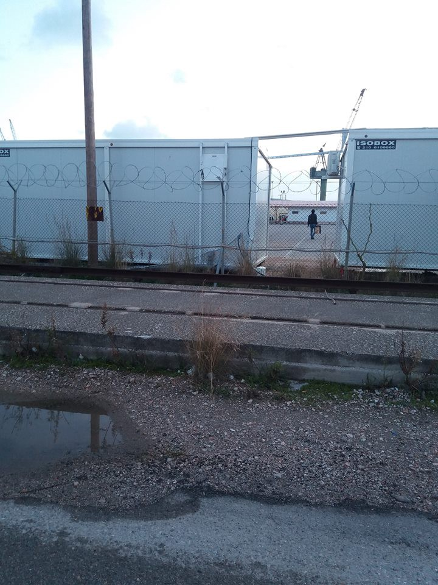

Photos by AYS volunteer

**INFO for people in need of medical attention in Thessaloniki** 
The **DocMobile** team is operating at the centre of Thessaloniki helping people with medical care and nutritional advices\. They will be seeing patients on a first come first served basis\.
Wednesdays 14:00–18:00
Okikopolis Social Centre
29A Ptolemeon Street
5th floor

**Northern Lights Aid** reported on their work:

> Here’s a bit of what we’re up to these days\! We are still working to support our friends from Kavala in their temporary winter location while construction is still being done on the camp\. One of our continuing activities is to frequently deliver additional food for people so they won’t get hungry during the cold months\. To keep people active and busy, we are also playing football or basketball for a couple hours each day with anyone who wants to join, including the locals\! Also, each morning and evening we draw, dance, play games and watch movies for a splash of fun on these cold winter days\! 

> We’ll continue to support our friends here in Greece and are preparing for many new things\. So, stay tuned for more updates coming soon and thank you to all of our wonderful donors who continue to make all of this important work possible\! 

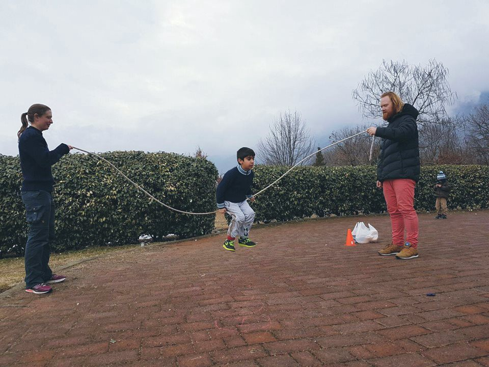

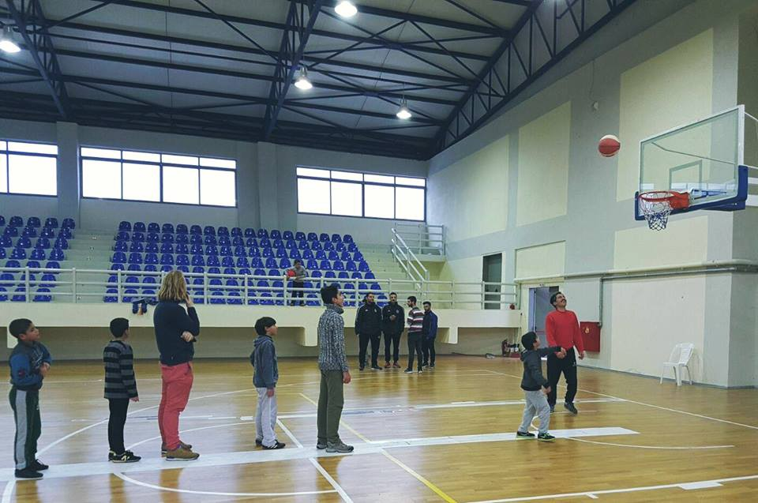

Photos by Northern Light Aid
#### DENMARK

Four Danish boys aged 15 and 16 have been arrested and charged with attempted homicide for trying to burn a 16\-year\-old Afghan boy alive in the small town of Ry on Monday, [reports](http://www.thelocal.dk/20170207/four-danish-teens-tried-to-burn-afghan-teen-alive) Danish news service The Local\.

According to the police, the boys threw a burning bottle filled with petrol at the Afghan boy, who suffered serious burns and is in serious condition\.
#### SWEDEN
#### Journalist convicted of smuggling

Fredrik Önnevall, the Swedish journalist who with his team was accused of people smuggling of a young Syrian boy, was convicted yesterday\. As AYS has previously reported, Önnevall and the team from SVT took a refugee boy with them from Greece in 2014 when they traveled through Europe to make a documentary for SVT \(public service channel\) called “Fosterland” about right wing populism\.

Önnevall, along with fellow team members photographer Claes Elofsson and an interpreter, were found guilty of people smuggling according to the court ruling\. They will all be sentenced to three months probation and community service\. According to the prosecutor, the incident was planned and premeditated, which is one of the reasons for the conviction\.

Önnevall and the others will try to appeal to the supreme court\. Regardless of how that turns out, the team maintains they do not regret their actions to help the boy\. They were surprised by the conviction, however, and had hoped that the prosecutors and court would have reevaluated their case and come to another decision\. Their lawyer tried to contend that the accused should be acquitted because of humanitarian reasons, but unfortunately without\. They still hope that the next court will reverse this decision\.

It was a civilian that saw the program on SVT and reported the incident\.
#### **NETHERLANDS**

**Amsterdam — looking for creative people from Aleppo**

The Tropenmuseum is searching for Syrian hosts for the exhibition Aleppo \(31 March — 10 September 2017\) \.

> Did you live or work in Aleppo and would you be willing to share your memories or personal stories about the city with us? We are looking for people that speak English and/or Dutch and who like to help with the exhibition and interact with visitors\. If you are a poet, musician, theatre maker or artist, you can also share your story in a creative way\. The Tropenmuseum offers you a training and a financial compensation\. 

> Participating will cost you a maximum of 2 hours a week in time\. Are you interested? Send an email to lisa\.kleeven@wereldculturen\.nl with a copy to info@refugeestartforce\.eu before 22 February 2017 

### New deportation plans call for new solidarity demonstrations
#### GERMANY — More centralized and faster deportations

German Chancellor Angela Merkel met with the premiers of Germany’s 16 states in Berlin today to discuss a plan that will [speed up the deportation process for migrants denied asylum\.](http://www.dw.com/en/german-authorities-deported-620-unaccompanied-minors/a-37461623) The plan was criticized by the Green party\.

Following a parliamentary inquiry by the Greens, the German government has revealed that 620 unaccompanied minors, who according to them failed to meet asylum requirements, have been deported, [reports](http://www.dw.com/en/german-authorities-deported-620-unaccompanied-minors/a-37461623) DW\. A majority of the deported minors were Afghans \(275\), following 58 Syrians, 39 minors from Eritrea and 36 Iraqis\.

Beate Walter\-Rosenheime, the Greens’ speaker for youth policy, said the deportations were “a large\-scale mistreatment of the children’s well\-being\.” noting that authorities should check if applicants have relatives in Germany before beginning the deportation process, no matter the asylum request outcome\.

Although, by law, minors should be sent to a state that has yet to meet its quota \(determined by the state’s financial standing\), the level of intake among states varies enormously, with some states taking as much as three times the required number and others not fulfilling the given quota\.

One of the main tenets of Merkel’s plan concerns a central coordination centre in Berlin that would include representatives from each state\. Additionally, the plan calls for federal deportation centres to be set up near airports to facilitate collective deportations\. The proposed plan would also make it easier to deport migrants who have been deemed as threats and increase incentives for [“voluntary returns,”](http://www.dw.com/en/program-paying-asylum-applicants-to-leave-germany-voluntarily-begins/a-37374656) where migrants receive money if they choose to leave Germany before receiving a final ruling on their asylum application, [reports](http://www.dw.com/en/merkel-pushes-german-states-for-more-migrant-deportations/a-37470199) DW\.

[**Action Against Deportations**](https://enoughisenough14.org/2017/02/09/germany-february-11-day-of-action-against-deportations/) will be held **this Saturday, February 11th\.** Demonstrations are planned in Berlin, Hamburg, Wiesbaden, Düsseldorf and several other cities\.

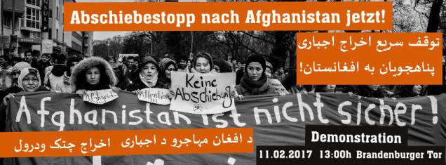

A map with details about the demonstrations and other useful information can be found here: [https://enoughisenough14\.org/2017/02/09/germany\-february\-11\-day\-of\-action\-against\-deportations/](https://enoughisenough14.org/2017/02/09/germany-february-11-day-of-action-against-deportations/)
#### **UK**
#### Don’t drop the Dubs Amendment

Driven by UK government’s announcement that it intends to [abandon its pledge to take 3,000 child refugees from Syria\.](http://www.independent.co.uk/news/only-350-syrian-refugee-children-will-be-allowed-to-settle-in-britain-thousands-less-than-promised-a7569691.html) a **demonstration** will be held tomorrow \( **February 10th** \) to demand that the Dubs amendment is enacted and that the government makes immediate steps to take child refugees from Syria\. Read more about the event [here](https://www.facebook.com/events/665795076933346/) \.

Although the Dubs Amendment committed the government to take in 3,000 minor refugees, Britain has only taken 350 so far\.

A **petition** demanding the enactment of the Dubs agreement can be signed here: [https://www\.change\.org/p/amber\-rudd\-mp\-fulfil\-your\-promise\-to\-take\-child\-refugees\-from\-syria\-enact\-the\-dubs\-amendment\-dubsnow](https://www.change.org/p/amber-rudd-mp-fulfil-your-promise-to-take-child-refugees-from-syria-enact-the-dubs-amendment-dubsnow)
#### AUSTRIA

Citizens of Vienna joining Civil March For Aleppo crew, still strong after more than 49 days:

#### FRANCE

Since the 4th of November 2016, refugees live in terrible living condition in the Centre d’Hébergement d’Urgence \(CHU\) managed by the Secours Islamique in Massy\.

In the video below, a volunteer describes the issues and says the problems are not new\. Since September, volunteers have warned against serious rights’ violations and affronts to the refugees’ dignity\. For example, several of them had to be treated for food poisoning after being served spoiled food\. Refugees also have to endure constant ‘contempt’ and ‘disrespect’ by staff, including the centre’s director; several refugees were expelled after protesting\. Since then, their situation has not improved, despite many reports to official authorities\. Living conditions are still squalid and staff is still disrespectful\. \(We have [previously reported](https://medium.com/@AreYouSyrious/ays-daily-digest-01-02-refugees-chased-in-calais-b5277482f4a1#.khd53ijxx) on the conditions at the centre\. \)

To make matters worse, since December 2016 there are no social workers and no employees except security\. At the beginning of this year, the residents decided to protest, by speaking to the director or by collectively refusing to eat\. On the 1st of February, three people considered as the “leaders”, received a notice that they had to leave the centre\. This came one day after they had tried to address issues with the director, leading him to call them “animals\.” Around 50 of the 70 residents said they would also leave if the three supposed leaders were forced to go\. Management then called police, accusing the three “leaders” of fighting, information that has been denied by several witnesses\. They were nevertheless brought to the police station and later released because of a lack of translators but will have to return within ten days\. The others were then called “animals”, “illiterate” and “terrorists” by the director, who also reminded them that they fall under Dublin III and that he could deport them if he wants\.

Given the situation, the centre’s residents have decided to express themselves in public and demand their transfer to a place where they will be treated like human beings\.

Images filmed by refugees in the centre:

#### Signal of Solidarity — Flüchtlingshilfe updates from Calais

Signal of Solidarity brought much needed aid to Calais today\. A baby stroller for a mother with a five\-week old baby, several hundred sleeping bags, blankets, sweaters, jackets, hats, gloves and scarves, two pallets with winter clothes, blankets… all of this was brought from Germany with the help of volunteers\.

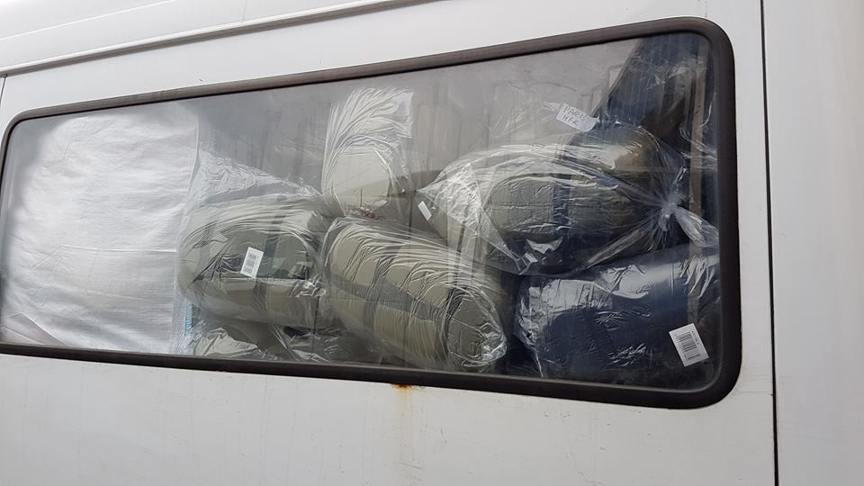

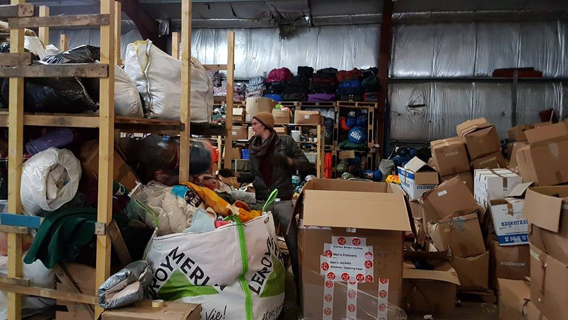

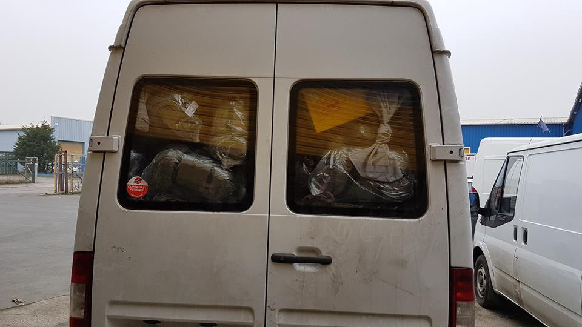

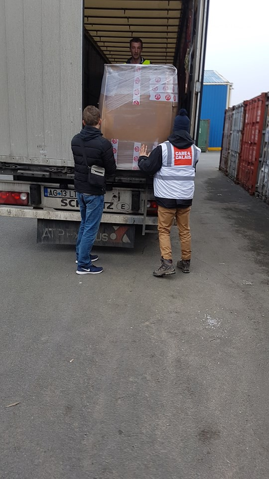

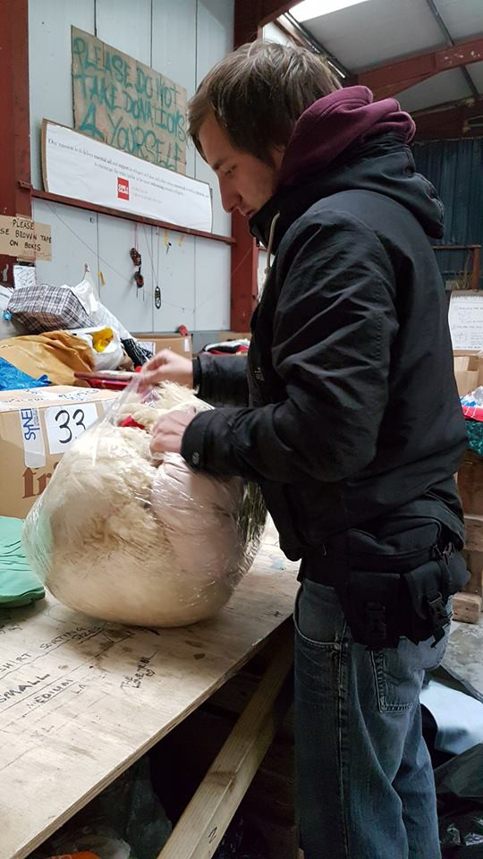

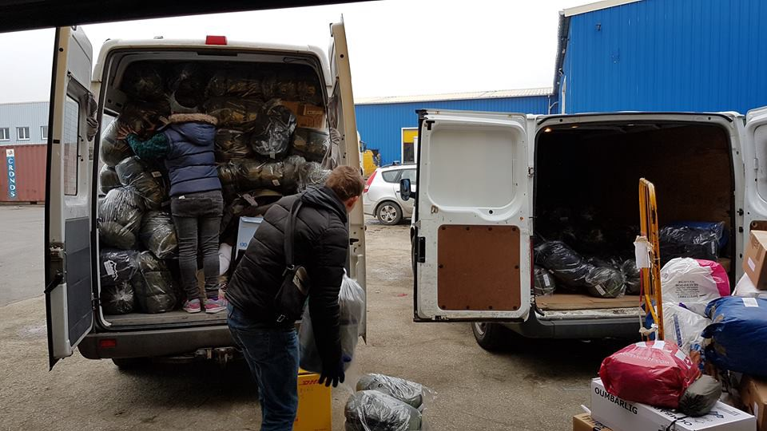

Photos by Signal of Solidarity
#### [**Dunkirk Refugee Children’s Centr**](https://www.facebook.com/dunkirkrefugeechildrenscentre/?ref=page_internal&fref=nf) **e—** HELP FROM HOME project

In need of a GRAPHIC DESIGNER

> Today is Week 5 of our ‘Help from Home’ series, where we put a call out to those who perhaps can’t commit to volunteering in France, but would like to use their skills, contacts or businesses to help us from home\. 

> This week we’re looking to find a Graphic Designer to offer their time to support the work of our fundraising volunteers and create some awesome artwork for future campaigns\. 

If you are interested e\-mail them at info@refugeechildrenscentres\.org

_Converted [Medium Post](https://areyousyrious.medium.com/ays-daily-digest-02-09-17-follow-up-on-police-violence-and-push-backs-19f73f2de883) by [ZMediumToMarkdown](https://github.com/ZhgChgLi/ZMediumToMarkdown)._
